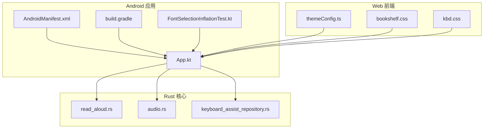
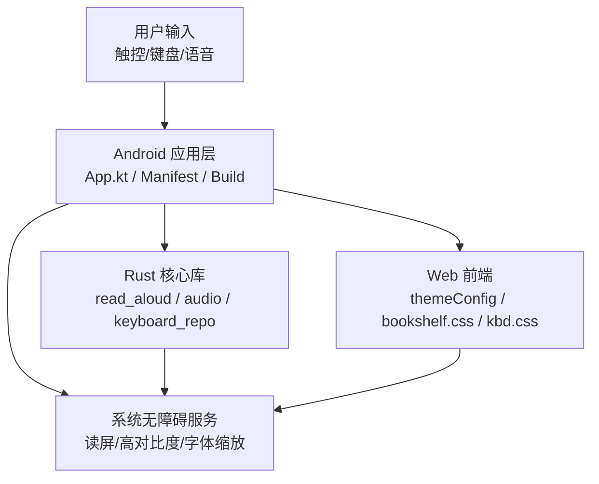
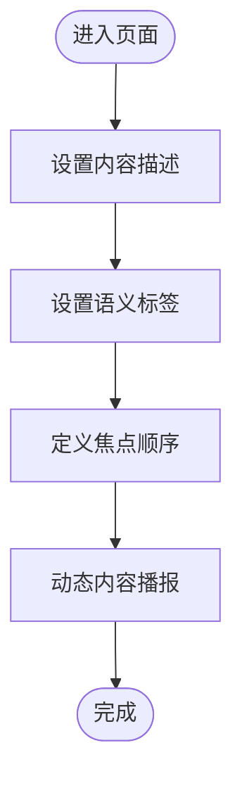
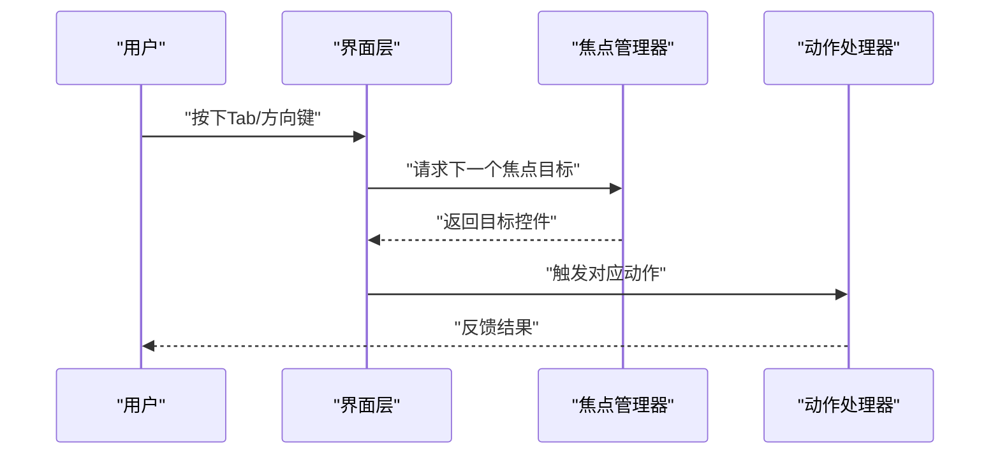
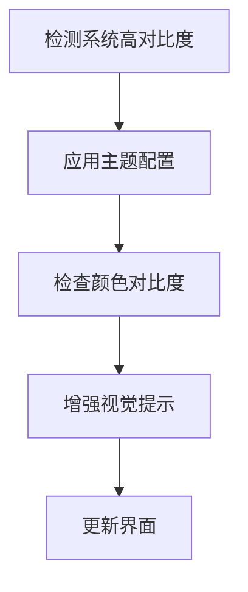
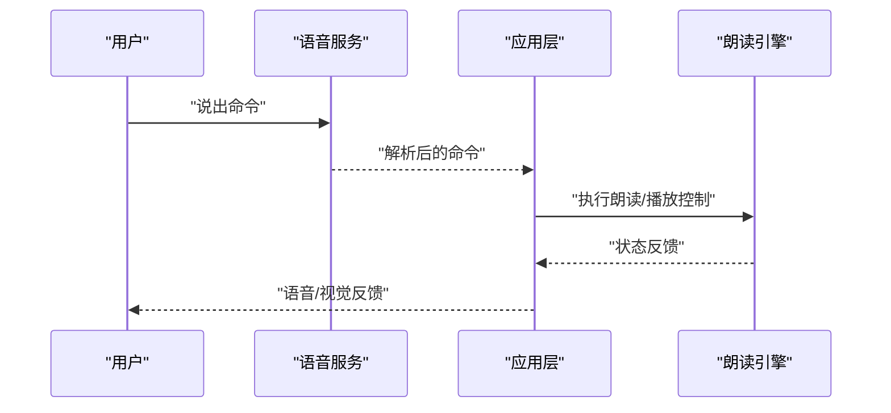
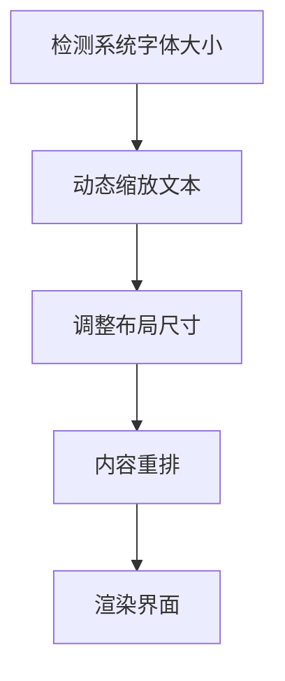
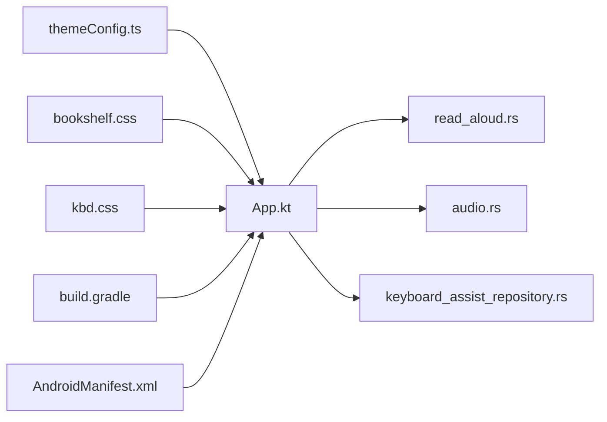

# 无障碍访问

<cite>
**本文档引用的文件**   
- [App.kt](file://app/src/main/java/io/legado/app/App.kt)
- [AndroidManifest.xml](file://app/src/main/AndroidManifest.xml)
- [build.gradle](file://app/build.gradle)
- [FontSelectionInflationTest.kt](file://app/src/androidTest/java/io/legado/app/ui/font/FontSelectionInflationTest.kt)
- [read_aloud.rs](file://rust/legado-core/src/read_aloud.rs)
- [audio.rs](file://rust/legado-core/src/audio.rs)
- [keyboard_assist_repository.rs](file://rust/legado-db/src/repository/keyboard_assist_repository.rs)
- [themeConfig.ts](file://modules/web/src/config/themeConfig.ts)
- [bookshelf.css](file://modules/web/src/assets/bookshelf.css)
- [kbd.css](file://modules/web/src/assets/kbd.css)
</cite>

## 目录
1. [简介](#简介)
2. [项目结构](#项目结构)
3. [核心组件](#核心组件)
4. [架构总览](#架构总览)
5. [详细组件分析](#详细组件分析)
6. [依赖关系分析](#依赖关系分析)
7. [性能考虑](#性能考虑)
8. [故障排查指南](#故障排查指南)
9. [结论](#结论)
10. [附录](#附录)

## 简介
本文件面向Legado项目的无障碍访问（Accessibility）能力，覆盖屏幕阅读器支持、键盘导航、高对比度与主题适配、语音控制与大字体等关键维度。文档基于仓库中的实际实现进行梳理，提供架构图、数据流图、流程图以及可操作的配置示例与最佳实践，帮助开发者快速定位并完善无障碍相关功能。

## 项目结构
本项目包含Android原生模块、Flutter跨平台模块、Web前端模块以及Rust核心库。无障碍相关能力分布在以下位置：
- Android应用层：应用初始化、清单配置、构建脚本、UI测试用例
- Rust核心库：朗读引擎、音频处理、键盘辅助存储
- Web模块：主题配置、样式增强、键盘提示样式

图表来源
- [App.kt](file://app/src/main/java/io/legado/app/App.kt)
- [AndroidManifest.xml](file://app/src/main/AndroidManifest.xml)
- [build.gradle](file://app/build.gradle)
- [FontSelectionInflationTest.kt](file://app/src/androidTest/java/io/legado/app/ui/font/FontSelectionInflationTest.kt)
- [read_aloud.rs](file://rust/legado-core/src/read_aloud.rs)
- [audio.rs](file://rust/legado-core/src/audio.rs)
- [keyboard_assist_repository.rs](file://rust/legado-db/src/repository/keyboard_assist_repository.rs)
- [themeConfig.ts](file://modules/web/src/config/themeConfig.ts)
- [bookshelf.css](file://modules/web/src/assets/bookshelf.css)
- [kbd.css](file://modules/web/src/assets/kbd.css)

章节来源
- [App.kt](file://app/src/main/java/io/legado/app/App.kt)
- [AndroidManifest.xml](file://app/src/main/AndroidManifest.xml)
- [build.gradle](file://app/build.gradle)
- [FontSelectionInflationTest.kt](file://app/src/androidTest/java/io/legado/app/ui/font/FontSelectionInflationTest.kt)
- [read_aloud.rs](file://rust/legado-core/src/read_aloud.rs)
- [audio.rs](file://rust/legado-core/src/audio.rs)
- [keyboard_assist_repository.rs](file://rust/legado-db/src/repository/keyboard_assist_repository.rs)
- [themeConfig.ts](file://modules/web/src/config/themeConfig.ts)
- [bookshelf.css](file://modules/web/src/assets/bookshelf.css)
- [kbd.css](file://modules/web/src/assets/kbd.css)

## 核心组件
- 屏幕阅读器支持
  - 内容描述与语义标签：在Android UI中为控件设置内容描述和语义角色，确保读屏器正确播报。
  - 导航顺序优化：通过焦点顺序与布局层级提升可读性。
- 键盘导航支持
  - 焦点管理：统一焦点策略，避免焦点丢失或循环异常。
  - 快捷键绑定：为常用操作提供键盘快捷方式。
  - Tab顺序控制：自定义Tab顺序，保证逻辑连贯。
- 高对比度模式与主题适配
  - 颜色对比度检查：确保文本与背景满足WCAG对比度要求。
  - 主题适配：深色/夜间模式与系统高对比度联动。
- 语音控制支持
  - 语音命令识别：集成系统或第三方语音服务。
  - 手势替代：为无法使用语音的用户提供触控替代。
  - 语音反馈：朗读当前状态与结果。
- 大字体支持
  - 动态字体缩放：根据系统字体大小自动调整布局。
  - 布局自适应：避免文字溢出与重叠。
  - 内容重排：在小屏或大字号下重新组织信息。

章节来源
- [App.kt](file://app/src/main/java/io/legado/app/App.kt)
- [AndroidManifest.xml](file://app/src/main/AndroidManifest.xml)
- [build.gradle](file://app/build.gradle)
- [FontSelectionInflationTest.kt](file://app/src/androidTest/java/io/legado/app/ui/font/FontSelectionInflationTest.kt)
- [read_aloud.rs](file://rust/legado-core/src/read_aloud.rs)
- [audio.rs](file://rust/legado-core/src/audio.rs)
- [keyboard_assist_repository.rs](file://rust/legado-db/src/repository/keyboard_assist_repository.rs)
- [themeConfig.ts](file://modules/web/src/config/themeConfig.ts)
- [bookshelf.css](file://modules/web/src/assets/bookshelf.css)
- [kbd.css](file://modules/web/src/assets/kbd.css)

## 架构总览
下图展示无障碍能力在各层的协作关系：Android应用负责UI与系统无障碍接口；Rust核心提供朗读与音频能力；Web模块提供主题与样式增强。

图表来源
- [App.kt](file://app/src/main/java/io/legado/app/App.kt)
- [AndroidManifest.xml](file://app/src/main/AndroidManifest.xml)
- [build.gradle](file://app/build.gradle)
- [read_aloud.rs](file://rust/legado-core/src/read_aloud.rs)
- [audio.rs](file://rust/legado-core/src/audio.rs)
- [keyboard_assist_repository.rs](file://rust/legado-db/src/repository/keyboard_assist_repository.rs)
- [themeConfig.ts](file://modules/web/src/config/themeConfig.ts)
- [bookshelf.css](file://modules/web/src/assets/bookshelf.css)
- [kbd.css](file://modules/web/src/assets/kbd.css)

## 详细组件分析

### 屏幕阅读器支持
- 内容描述添加
  - 为按钮、图标、图片等元素设置内容描述，确保读屏器播报清晰准确。
  - 对复杂控件组合提供分组与标题，提高可读性。
- 语义标签设置
  - 使用语义化标签（如列表、导航、表单）提升结构化信息传递。
  - 为动态内容更新时发出状态变更通知。
- 导航顺序优化
  - 按阅读逻辑定义焦点顺序，避免跳跃式跳转。
  - 隐藏装饰性元素，减少干扰。

章节来源
- [App.kt](file://app/src/main/java/io/legado/app/App.kt)
- [AndroidManifest.xml](file://app/src/main/AndroidManifest.xml)

### 键盘导航支持
- 焦点管理
  - 统一焦点策略，确保焦点始终落在可交互元素上。
  - 处理弹窗、抽屉等模态场景的焦点锁定。
- 快捷键绑定
  - 为常用操作绑定快捷键，提升效率。
  - 避免与系统快捷键冲突。
- Tab顺序控制
  - 自定义Tab顺序，保证逻辑连贯。
  - 对不可见元素禁用Tab聚焦。

章节来源
- [keyboard_assist_repository.rs](file://rust/legado-db/src/repository/keyboard_assist_repository.rs)
- [kbd.css](file://modules/web/src/assets/kbd.css)

### 高对比度模式与主题适配
- 颜色对比度检查
  - 确保文本与背景对比度符合WCAG标准。
  - 对动态主题进行实时校验。
- 主题适配
  - 支持深色/夜间模式切换。
  - 与系统高对比度模式联动。
- 视觉增强
  - 提供额外边框、阴影等视觉提示。

章节来源
- [themeConfig.ts](file://modules/web/src/config/themeConfig.ts)
- [bookshelf.css](file://modules/web/src/assets/bookshelf.css)

### 语音控制支持
- 语音命令识别
  - 集成系统或第三方语音服务，识别“上一页”、“下一页”、“暂停”等命令。
- 手势替代
  - 为无法使用语音的用户提供触控手势替代方案。
- 语音反馈
  - 朗读当前状态与操作结果，提升可用性。

章节来源
- [read_aloud.rs](file://rust/legado-core/src/read_aloud.rs)
- [audio.rs](file://rust/legado-core/src/audio.rs)

### 大字体支持
- 动态字体缩放
  - 根据系统字体大小自动调整布局。
- 布局自适应
  - 避免文字溢出与重叠。
- 内容重排
  - 在大字号下重新组织信息，保证可读性。

章节来源
- [FontSelectionInflationTest.kt](file://app/src/androidTest/java/io/legado/app/ui/font/FontSelectionInflationTest.kt)
- [build.gradle](file://app/build.gradle)

## 依赖关系分析
- Android应用层依赖Rust核心库提供的朗读与音频能力。
- Web模块通过主题配置影响整体视觉体验。
- 构建脚本与清单文件影响运行时行为与权限。

图表来源
- [App.kt](file://app/src/main/java/io/legado/app/App.kt)
- [read_aloud.rs](file://rust/legado-core/src/read_aloud.rs)
- [audio.rs](file://rust/legado-core/src/audio.rs)
- [keyboard_assist_repository.rs](file://rust/legado-db/src/repository/keyboard_assist_repository.rs)
- [themeConfig.ts](file://modules/web/src/config/themeConfig.ts)
- [bookshelf.css](file://modules/web/src/assets/bookshelf.css)
- [kbd.css](file://modules/web/src/assets/kbd.css)
- [build.gradle](file://app/build.gradle)
- [AndroidManifest.xml](file://app/src/main/AndroidManifest.xml)

章节来源
- [App.kt](file://app/src/main/java/io/legado/app/App.kt)
- [read_aloud.rs](file://rust/legado-core/src/read_aloud.rs)
- [audio.rs](file://rust/legado-core/src/audio.rs)
- [keyboard_assist_repository.rs](file://rust/legado-db/src/repository/keyboard_assist_repository.rs)
- [themeConfig.ts](file://modules/web/src/config/themeConfig.ts)
- [bookshelf.css](file://modules/web/src/assets/bookshelf.css)
- [kbd.css](file://modules/web/src/assets/kbd.css)
- [build.gradle](file://app/build.gradle)
- [AndroidManifest.xml](file://app/src/main/AndroidManifest.xml)

## 性能考虑
- 朗读与音频处理应避免阻塞主线程，采用异步任务与缓存机制。
- 主题切换与对比度检查应在后台进行，避免频繁重绘。
- 大字体缩放需限制计算范围，仅对可见区域进行重排。

## 故障排查指南
- 屏幕阅读器无播报
  - 检查内容描述是否设置，语义标签是否正确。
  - 确认焦点顺序与动态更新播报逻辑。
- 键盘导航异常
  - 检查焦点管理与快捷键绑定是否存在冲突。
  - 验证Tab顺序是否符合预期。
- 高对比度模式无效
  - 确认主题配置与系统高对比度联动是否正常。
  - 检查颜色对比度是否达标。
- 语音控制不响应
  - 检查语音服务权限与命令解析逻辑。
  - 确认语音反馈是否输出。
- 大字体导致布局错乱
  - 检查动态缩放与布局自适应逻辑。
  - 验证内容重排是否生效。

章节来源
- [read_aloud.rs](file://rust/legado-core/src/read_aloud.rs)
- [audio.rs](file://rust/legado-core/src/audio.rs)
- [keyboard_assist_repository.rs](file://rust/legado-db/src/repository/keyboard_assist_repository.rs)
- [themeConfig.ts](file://modules/web/src/config/themeConfig.ts)
- [bookshelf.css](file://modules/web/src/assets/bookshelf.css)
- [kbd.css](file://modules/web/src/assets/kbd.css)
- [FontSelectionInflationTest.kt](file://app/src/androidTest/java/io/legado/app/ui/font/FontSelectionInflationTest.kt)

## 结论
Legado项目在无障碍访问方面具备良好基础，涵盖屏幕阅读器、键盘导航、高对比度、语音控制与大字体等关键能力。建议持续完善内容描述与语义标签、优化焦点管理与快捷键绑定、强化主题适配与对比度检查、扩展语音命令与反馈机制，并通过自动化与人工测试保障质量。

## 附录
- 无障碍测试工具与方法
  - 自动化测试：使用UI测试框架验证焦点顺序、快捷键与朗读播报。
  - 人工测试：邀请视障用户参与测试，收集真实反馈。
  - 用户反馈收集：建立反馈渠道，持续改进无障碍体验。
- 无障碍配置示例与最佳实践
  - 为所有可交互元素设置内容描述。
  - 使用语义化标签组织页面结构。
  - 确保颜色对比度符合WCAG标准。
  - 提供键盘快捷键与触控手势替代。
  - 支持系统字体缩放与布局自适应。