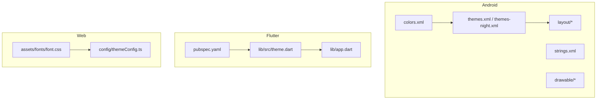
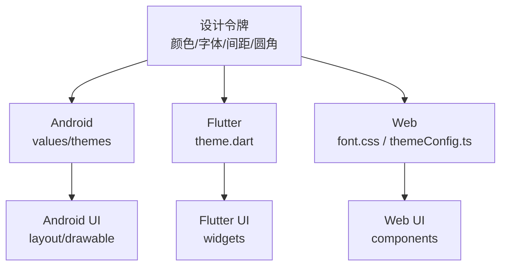
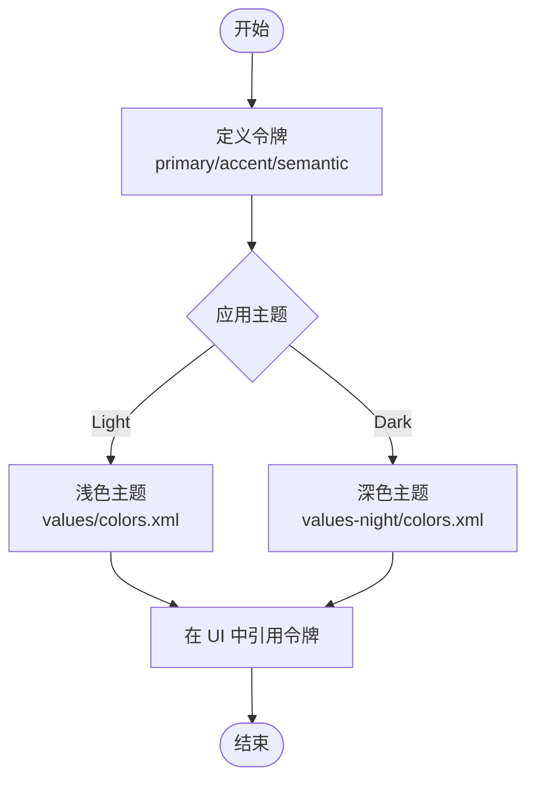
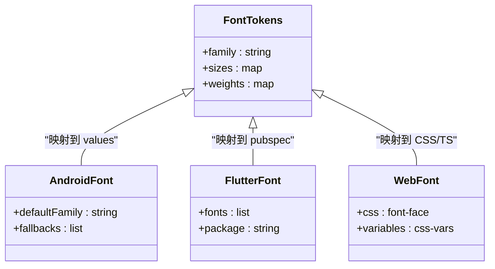
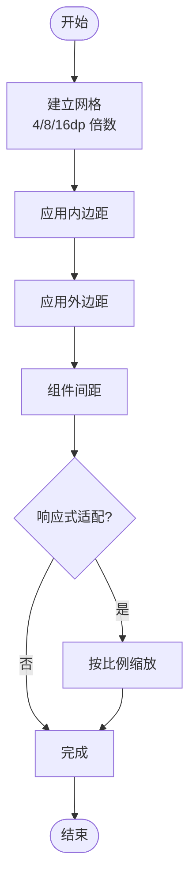
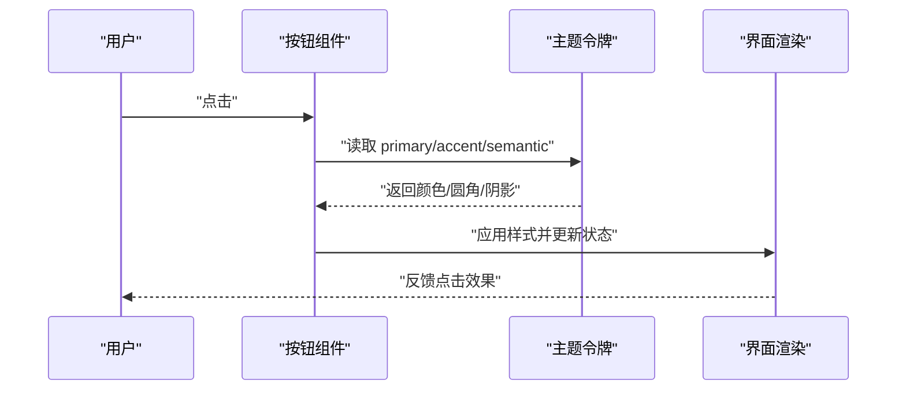
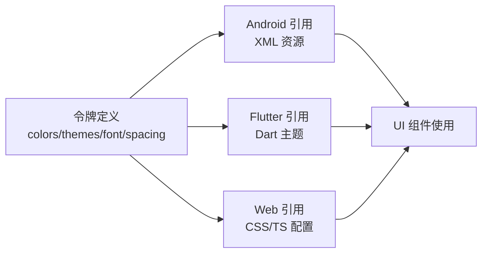
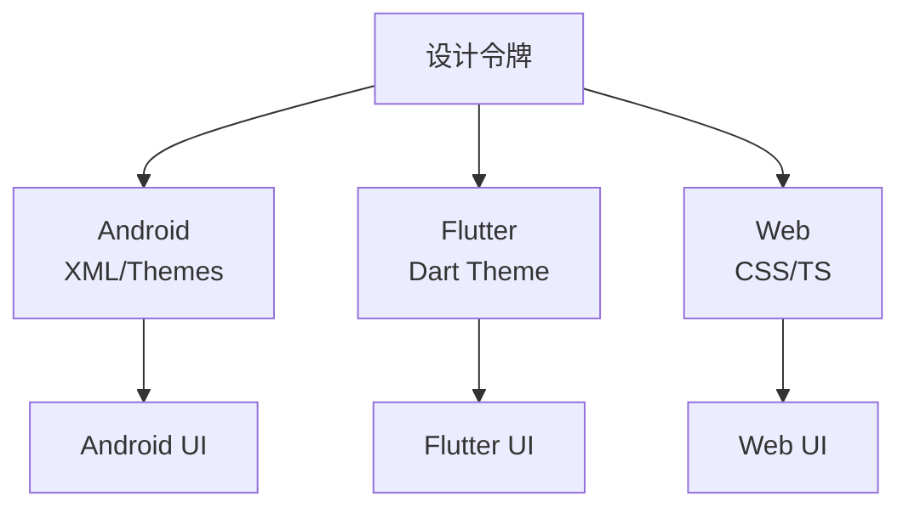

# 设计系统

<cite>
**本文引用的文件**   
- [app/src/main/res/values/colors.xml](file://app/src/main/res/values/colors.xml)
- [app/src/main/res/values-night/colors.xml](file://app/src/main/res/values-night/colors.xml)
- [app/src/main/res/values/strings.xml](file://app/src/main/res/values/strings.xml)
- [app/src/main/res/values/themes.xml](file://app/src/main/res/values/themes.xml)
- [app/src/main/res/values-night/themes.xml](file://app/src/main/res/values-night/themes.xml)
- [app/src/main/res/drawable/ic_button_primary.xml](file://app/src/main/res/drawable/ic_button_primary.xml)
- [app/src/main/res/layout/item_card.xml](file://app/src/main/res/layout/item_card.xml)
- [flutter_legado/lib/app.dart](file://flutter_legado/lib/app.dart)
- [flutter_legado/lib/src/theme.dart](file://flutter_legado/lib/src/theme.dart)
- [flutter_legado/pubspec.yaml](file://flutter_legado/pubspec.yaml)
- [modules/web/src/assets/fonts/font.css](file://modules/web/src/assets/fonts/font.css)
- [modules/web/src/config/themeConfig.ts](file://modules/web/src/config/themeConfig.ts)
</cite>

## 目录
1. [简介](#简介)
2. [项目结构](#项目结构)
3. [核心组件](#核心组件)
4. [架构总览](#架构总览)
5. [详细组件分析](#详细组件分析)
6. [依赖分析](#依赖分析)
7. [性能考虑](#性能考虑)
8. [故障排查指南](#故障排查指南)
9. [结论](#结论)
10. [附录](#附录)

## 简介
本设计系统文档面向 Legado 多端（Android、Flutter、Web）的样式与主题体系，覆盖颜色体系、字体规范、间距标准、基础组件样式、图标与图形资源使用规范，以及设计令牌（Design Tokens）的管理与使用方法。目标是帮助开发者与设计者统一视觉语言，提升跨端一致性与可维护性。

## 项目结构
Legado 的设计系统分布在三个平台：
- Android：通过 res/values 下的 colors、themes、strings 等定义主题与资源；drawable 与 layout 承载组件样式与布局。
- Flutter：通过 lib/src/theme.dart 集中管理主题与令牌；pubspec.yaml 声明字体与资源。
- Web：通过 modules/web 中的 CSS 与 TypeScript 配置管理字体与主题变量。

图表来源
- [app/src/main/res/values/colors.xml](file://app/src/main/res/values/colors.xml)
- [app/src/main/res/values/themes.xml](file://app/src/main/res/values/themes.xml)
- [app/src/main/res/values-night/themes.xml](file://app/src/main/res/values-night/themes.xml)
- [app/src/main/res/values/strings.xml](file://app/src/main/res/values/strings.xml)
- [app/src/main/res/drawable/ic_button_primary.xml](file://app/src/main/res/drawable/ic_button_primary.xml)
- [app/src/main/res/layout/item_card.xml](file://app/src/main/res/layout/item_card.xml)
- [flutter_legado/lib/src/theme.dart](file://flutter_legado/lib/src/theme.dart)
- [flutter_legado/lib/app.dart](file://flutter_legado/lib/app.dart)
- [flutter_legado/pubspec.yaml](file://flutter_legado/pubspec.yaml)
- [modules/web/src/assets/fonts/font.css](file://modules/web/src/assets/fonts/font.css)
- [modules/web/src/config/themeConfig.ts](file://modules/web/src/config/themeConfig.ts)

章节来源
- [app/src/main/res/values/colors.xml](file://app/src/main/res/values/colors.xml)
- [app/src/main/res/values/themes.xml](file://app/src/main/res/values/themes.xml)
- [app/src/main/res/values-night/themes.xml](file://app/src/main/res/values-night/themes.xml)
- [app/src/main/res/values/strings.xml](file://app/src/main/res/values/strings.xml)
- [flutter_legado/lib/src/theme.dart](file://flutter_legado/lib/src/theme.dart)
- [flutter_legado/lib/app.dart](file://flutter_legado/lib/app.dart)
- [flutter_legado/pubspec.yaml](file://flutter_legado/pubspec.yaml)
- [modules/web/src/assets/fonts/font.css](file://modules/web/src/assets/fonts/font.css)
- [modules/web/src/config/themeConfig.ts](file://modules/web/src/config/themeConfig.ts)

## 核心组件
本节聚焦设计系统的核心要素：颜色体系、字体规范、间距标准、基础组件样式、图标与图形资源、设计令牌。

- 颜色体系
  - 主色调：用于品牌识别与关键交互元素（如主要按钮、选中态）。
  - 辅助色：次要信息、装饰元素、背景层次。
  - 语义色：成功、警告、错误、信息状态反馈。
  - 明暗模式：通过 values 与 values-night 两套资源切换。
  
  章节来源
  - [app/src/main/res/values/colors.xml](file://app/src/main/res/values/colors.xml)
  - [app/src/main/res/values-night/colors.xml](file://app/src/main/res/values-night/colors.xml)
  - [app/src/main/res/values/themes.xml](file://app/src/main/res/values/themes.xml)
  - [app/src/main/res/values-night/themes.xml](file://app/src/main/res/values-night/themes.xml)

- 字体规范
  - 字体家族：默认字体与备用字体族，确保跨设备可读性。
  - 字号层级：标题、正文、辅助文本的字号阶梯。
  - 字重标准：常规、加粗等字重的使用场景。
  
  章节来源
  - [modules/web/src/assets/fonts/font.css](file://modules/web/src/assets/fonts/font.css)
  - [flutter_legado/pubspec.yaml](file://flutter_legado/pubspec.yaml)

- 间距标准
  - 内边距与外边距：基于统一网格与比例（如 4dp/8dp/16dp）构建一致性。
  - 组件间距：卡片、列表项、表单控件之间的留白原则。
  
  章节来源
  - [app/src/main/res/layout/item_card.xml](file://app/src/main/res/layout/item_card.xml)

- 基础组件样式
  - 按钮：主按钮、次按钮、禁用态、尺寸与圆角。
  - 输入框：边框、焦点态、占位符、错误提示。
  - 卡片：阴影、圆角、内容区域留白。
  
  章节来源
  - [app/src/main/res/drawable/ic_button_primary.xml](file://app/src/main/res/drawable/ic_button_primary.xml)
  - [app/src/main/res/layout/item_card.xml](file://app/src/main/res/layout/item_card.xml)

- 图标系统与图形资源
  - 矢量图标：统一命名与尺寸，适配不同密度。
  - 图片资源：分类组织（背景、封面、通用图标），命名规范。
  
  章节来源
  - [app/src/main/res/drawable/ic_button_primary.xml](file://app/src/main/res/drawable/ic_button_primary.xml)

- 设计令牌（Design Tokens）
  - 定义：将颜色、字体、间距、圆角等抽象为令牌，供各端引用。
  - 管理：在 Android 的 values、Flutter 的 theme.dart、Web 的 themeConfig.ts 中集中管理。
  - 使用：UI 层仅引用令牌，不直接写死值，保证一致性。
  
  章节来源
  - [app/src/main/res/values/colors.xml](file://app/src/main/res/values/colors.xml)
  - [flutter_legado/lib/src/theme.dart](file://flutter_legado/lib/src/theme.dart)
  - [modules/web/src/config/themeConfig.ts](file://modules/web/src/config/themeConfig.ts)

## 架构总览
下图展示设计令牌在各端的流转与应用方式：Android 通过 XML 资源与主题，Flutter 通过 Dart 主题对象，Web 通过 CSS 与 TS 配置。

图表来源
- [app/src/main/res/values/colors.xml](file://app/src/main/res/values/colors.xml)
- [app/src/main/res/values/themes.xml](file://app/src/main/res/values/themes.xml)
- [flutter_legado/lib/src/theme.dart](file://flutter_legado/lib/src/theme.dart)
- [modules/web/src/assets/fonts/font.css](file://modules/web/src/assets/fonts/font.css)
- [modules/web/src/config/themeConfig.ts](file://modules/web/src/config/themeConfig.ts)

## 详细组件分析

### 颜色体系
- 主色调：用于强调与关键操作，建议在按钮、链接、选中态中使用。
- 辅助色：用于背景、分隔线、次要文字，避免喧宾夺主。
- 语义色：成功（绿色系）、警告（黄色系）、错误（红色系）、信息（蓝色系），用于状态反馈。
- 明暗模式：通过 values 与 values-night 分别定义，确保对比度与可读性。

图表来源
- [app/src/main/res/values/colors.xml](file://app/src/main/res/values/colors.xml)
- [app/src/main/res/values-night/colors.xml](file://app/src/main/res/values-night/colors.xml)

章节来源
- [app/src/main/res/values/colors.xml](file://app/src/main/res/values/colors.xml)
- [app/src/main/res/values-night/colors.xml](file://app/src/main/res/values-night/colors.xml)

### 字体规范
- 字体家族：设置默认字体族与回退字体，保障中文与英文显示一致性。
- 字号层级：H1/H2/H3/Body/Caption 等层级，保持阅读节奏与信息层级。
- 字重标准：Regular/Bold 等，标题与强调使用加粗，正文保持常规。
- Web 与 Flutter：CSS 与 pubspec 中声明字体资源，确保加载与缓存策略。

图表来源
- [modules/web/src/assets/fonts/font.css](file://modules/web/src/assets/fonts/font.css)
- [flutter_legado/pubspec.yaml](file://flutter_legado/pubspec.yaml)

章节来源
- [modules/web/src/assets/fonts/font.css](file://modules/web/src/assets/fonts/font.css)
- [flutter_legado/pubspec.yaml](file://flutter_legado/pubspec.yaml)

### 间距标准
- 内边距与外边距：采用 4dp/8dp/16dp 的倍数，形成一致的网格系统。
- 组件间距：卡片、列表项、表单控件之间保持合理留白，提升可读性。
- 响应式：在不同屏幕尺寸下按比例缩放，保持视觉平衡。

图表来源
- [app/src/main/res/layout/item_card.xml](file://app/src/main/res/layout/item_card.xml)

章节来源
- [app/src/main/res/layout/item_card.xml](file://app/src/main/res/layout/item_card.xml)

### 基础组件样式
- 按钮
  - 主按钮：使用主色调，圆角与阴影增强点击感。
  - 次按钮：使用辅助色或描边样式，弱化但可识别。
  - 禁用态：降低透明度或灰度，明确不可用状态。
- 输入框
  - 边框与焦点态：清晰区分输入区域与激活状态。
  - 占位符与错误提示：提供引导与反馈。
- 卡片
  - 圆角与阴影：营造层次感，突出内容区块。
  - 内容留白：确保文本与图标的呼吸空间。

图表来源
- [app/src/main/res/drawable/ic_button_primary.xml](file://app/src/main/res/drawable/ic_button_primary.xml)
- [app/src/main/res/layout/item_card.xml](file://app/src/main/res/layout/item_card.xml)

章节来源
- [app/src/main/res/drawable/ic_button_primary.xml](file://app/src/main/res/drawable/ic_button_primary.xml)
- [app/src/main/res/layout/item_card.xml](file://app/src/main/res/layout/item_card.xml)

### 图标系统与图形资源
- 矢量图标：统一命名与尺寸，支持多密度适配。
- 图片资源：按用途分类（背景、封面、通用图标），命名遵循 kebab-case。
- 使用规范：在 drawable 与 assets 中组织，避免重复与冲突。

章节来源
- [app/src/main/res/drawable/ic_button_primary.xml](file://app/src/main/res/drawable/ic_button_primary.xml)

### 设计令牌（Design Tokens）
- 定义位置：Android 的 values/colors.xml、Flutter 的 theme.dart、Web 的 themeConfig.ts。
- 令牌类型：颜色、字体、间距、圆角、阴影等。
- 使用方式：UI 层仅引用令牌，不直接写死值，确保一致性与可维护性。
- 版本管理：通过主题文件与配置文件进行版本控制，便于迭代与回滚。

图表来源
- [app/src/main/res/values/colors.xml](file://app/src/main/res/values/colors.xml)
- [flutter_legado/lib/src/theme.dart](file://flutter_legado/lib/src/theme.dart)
- [modules/web/src/config/themeConfig.ts](file://modules/web/src/config/themeConfig.ts)

章节来源
- [app/src/main/res/values/colors.xml](file://app/src/main/res/values/colors.xml)
- [flutter_legado/lib/src/theme.dart](file://flutter_legado/lib/src/theme.dart)
- [modules/web/src/config/themeConfig.ts](file://modules/web/src/config/themeConfig.ts)

## 依赖分析
设计令牌在各端的依赖关系如下：Android 依赖 XML 资源与主题，Flutter 依赖 Dart 主题对象，Web 依赖 CSS 与 TS 配置。UI 组件通过引用令牌实现样式一致性。

图表来源
- [app/src/main/res/values/colors.xml](file://app/src/main/res/values/colors.xml)
- [flutter_legado/lib/src/theme.dart](file://flutter_legado/lib/src/theme.dart)
- [modules/web/src/config/themeConfig.ts](file://modules/web/src/config/themeConfig.ts)

章节来源
- [app/src/main/res/values/colors.xml](file://app/src/main/res/values/colors.xml)
- [flutter_legado/lib/src/theme.dart](file://flutter_legado/lib/src/theme.dart)
- [modules/web/src/config/themeConfig.ts](file://modules/web/src/config/themeConfig.ts)

## 性能考虑
- 资源优化：压缩图片与矢量图标，减少包体积。
- 字体加载：按需加载字体，避免阻塞渲染。
- 主题切换：懒加载主题资源，提升启动速度。
- 缓存策略：对静态资源启用缓存，减少重复下载。

## 故障排查指南
- 颜色不一致：检查 values 与 values-night 是否同步更新，确认 UI 是否引用令牌而非硬编码。
- 字体缺失：确认 pubspec 与 CSS 中字体声明正确，路径无误。
- 主题未生效：检查主题文件是否被正确应用，确认设备或浏览器主题模式。
- 组件样式异常：核对 drawable 与 layout 中的样式定义，确保与令牌一致。

章节来源
- [app/src/main/res/values/colors.xml](file://app/src/main/res/values/colors.xml)
- [app/src/main/res/values/themes.xml](file://app/src/main/res/values/themes.xml)
- [flutter_legado/lib/src/theme.dart](file://flutter_legado/lib/src/theme.dart)
- [modules/web/src/assets/fonts/font.css](file://modules/web/src/assets/fonts/font.css)

## 结论
本设计系统通过统一的令牌管理与多端映射，实现了 Legado 在 Android、Flutter、Web 上的视觉一致性。建议持续完善令牌定义与使用规范，加强代码审查与自动化测试，确保设计系统的长期稳定与可扩展性。

## 附录
- 最佳实践
  - 始终通过令牌引用样式，避免硬编码。
  - 保持明暗模式的一致性，确保对比度达标。
  - 定期审计资源文件，清理冗余与重复。
  - 使用版本控制管理令牌变更，记录变更原因与影响范围。