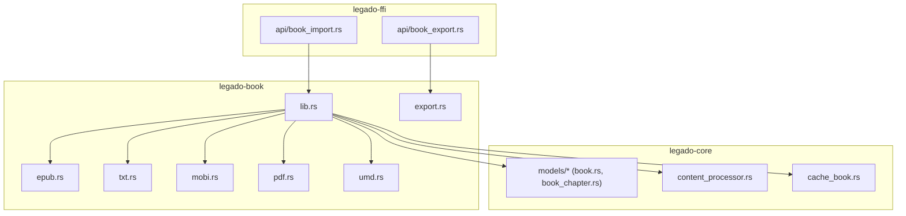
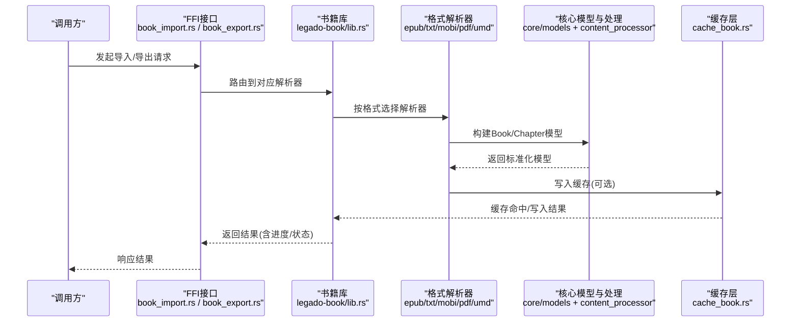
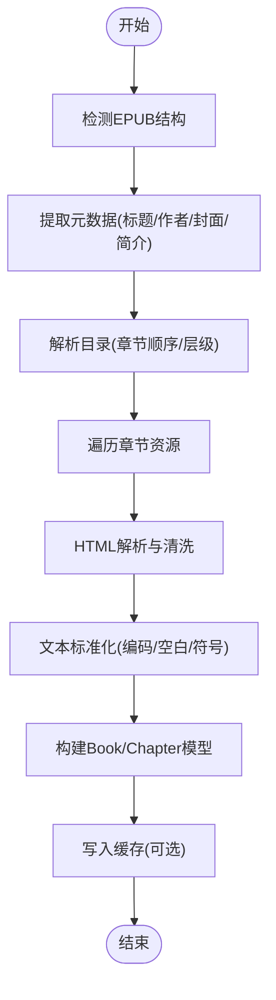
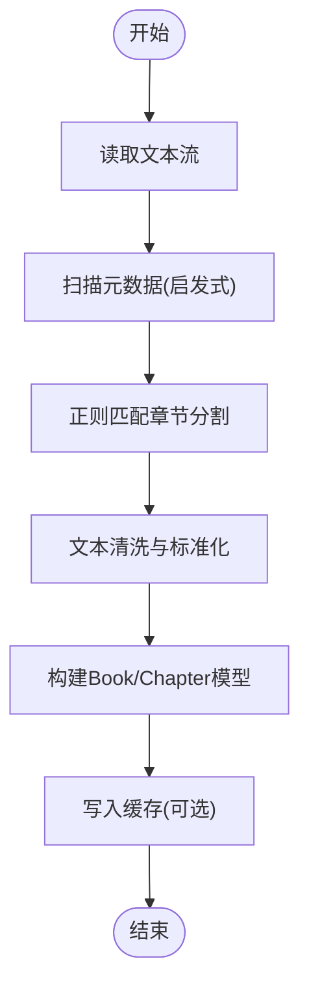
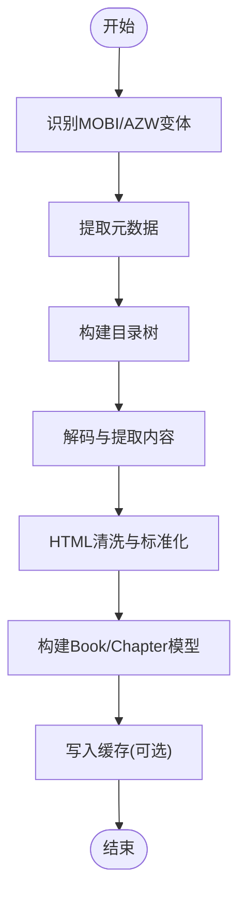
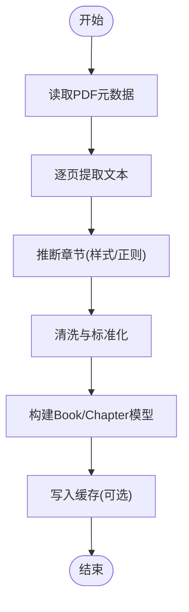
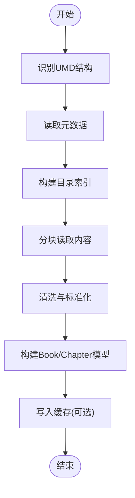
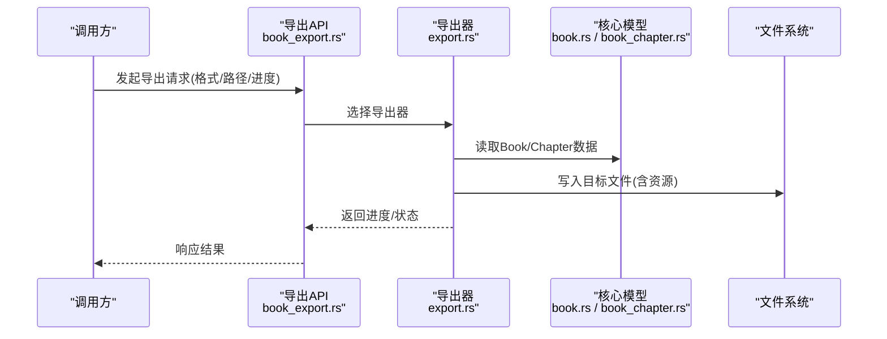
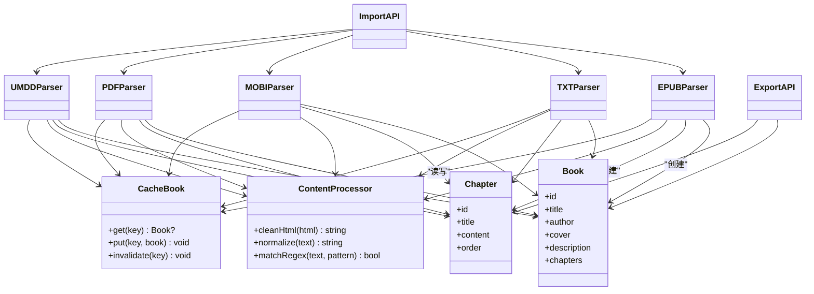

# 书籍处理系统

<cite>
**本文档引用的文件**   
- [lib.rs](file://rust/legado-book/src/lib.rs)
- [epub.rs](file://rust/legado-book/src/epub.rs)
- [txt.rs](file://rust/legado-book/src/txt.rs)
- [mobi.rs](file://rust/legado-book/src/mobi.rs)
- [pdf.rs](file://rust/legado-book/src/pdf.rs)
- [umd.rs](file://rust/legado-book/src/umd.rs)
- [export.rs](file://rust/legado-book/src/export.rs)
- [book.rs](file://rust/legado-core/src/models/book.rs)
- [book_chapter.rs](file://rust/legado-core/src/models/book_chapter.rs)
- [content_processor.rs](file://rust/legado-core/src/content_processor.rs)
- [cache_book.rs](file://rust/legado-core/src/cache_book.rs)
- [book_import.rs](file://rust/legado-ffi/src/api/book_import.rs)
- [book_export.rs](file://rust/legado-ffi/src/api/book_export.rs)
</cite>

## 目录
1. [简介](#简介)
2. [项目结构](#项目结构)
3. [核心组件](#核心组件)
4. [架构总览](#架构总览)
5. [详细组件分析](#详细组件分析)
6. [依赖关系分析](#依赖关系分析)
7. [性能与缓存策略](#性能与缓存策略)
8. [导入导出与批量处理](#导入导出与批量处理)
9. [格式扩展指南](#格式扩展指南)
10. [故障排查与调试](#故障排查与调试)
11. [结论](#结论)

## 简介
本文件面向Legado项目的“书籍处理系统”，系统性阐述多格式书籍（EPUB、TXT、MOBI、PDF、UMD等）的解析与处理流程，涵盖元数据提取、章节分割、内容清洗、缓存与并发优化、导入导出能力，以及新增格式的扩展方法。文档以代码级为依据，辅以架构图与时序图，帮助读者快速理解并高效扩展系统能力。

## 项目结构
本项目采用Rust模块化设计，书籍处理相关能力主要分布在以下模块：
- legado-book：各书格式的具体解析实现（EPUB/TXT/MOBI/PDF/UMD）与导出逻辑
- legado-core：领域模型（Book/Chapter）、内容处理器、缓存抽象等核心能力
- legado-ffi：对外暴露的FFI接口，封装导入/导出等API供上层调用

**图表来源** 
- [lib.rs](file://rust/legado-book/src/lib.rs)
- [epub.rs](file://rust/legado-book/src/epub.rs)
- [txt.rs](file://rust/legado-book/src/txt.rs)
- [mobi.rs](file://rust/legado-book/src/mobi.rs)
- [pdf.rs](file://rust/legado-book/src/pdf.rs)
- [umd.rs](file://rust/legado-book/src/umd.rs)
- [export.rs](file://rust/legado-book/src/export.rs)
- [book.rs](file://rust/legado-core/src/models/book.rs)
- [book_chapter.rs](file://rust/legado-core/src/models/book_chapter.rs)
- [content_processor.rs](file://rust/legado-core/src/content_processor.rs)
- [cache_book.rs](file://rust/legado-core/src/cache_book.rs)
- [book_import.rs](file://rust/legado-ffi/src/api/book_import.rs)
- [book_export.rs](file://rust/legado-ffi/src/api/book_export.rs)

**章节来源**
- [lib.rs](file://rust/legado-book/src/lib.rs)
- [book.rs](file://rust/legado-core/src/models/book.rs)
- [book_chapter.rs](file://rust/legado-core/src/models/book_chapter.rs)

## 核心组件
- 格式解析器族：针对EPUB、TXT、MOBI、PDF、UMD分别提供解析入口，统一输出到核心模型
- 核心模型：Book与BookChapter定义书籍与章节的数据结构
- 内容处理器：负责HTML清洗、正则匹配、文本规范化等通用处理
- 缓存层：对已解析的书籍或章节进行内存/磁盘缓存，降低重复IO与CPU开销
- FFI接口：对外暴露导入/导出API，支持批量任务与进度回调

**章节来源**
- [content_processor.rs](file://rust/legado-core/src/content_processor.rs)
- [cache_book.rs](file://rust/legado-core/src/cache_book.rs)
- [book_import.rs](file://rust/legado-ffi/src/api/book_import.rs)
- [book_export.rs](file://rust/legado-ffi/src/api/book_export.rs)

## 架构总览
下图展示从导入请求到解析完成、缓存落盘、再到导出的整体流程。

**图表来源** 
- [book_import.rs](file://rust/legado-ffi/src/api/book_import.rs)
- [book_export.rs](file://rust/legado-ffi/src/api/book_export.rs)
- [lib.rs](file://rust/legado-book/src/lib.rs)
- [epub.rs](file://rust/legado-book/src/epub.rs)
- [txt.rs](file://rust/legado-book/src/txt.rs)
- [mobi.rs](file://rust/legado-book/src/mobi.rs)
- [pdf.rs](file://rust/legado-book/src/pdf.rs)
- [umd.rs](file://rust/legado-book/src/umd.rs)
- [book.rs](file://rust/legado-core/src/models/book.rs)
- [book_chapter.rs](file://rust/legado-core/src/models/book_chapter.rs)
- [content_processor.rs](file://rust/legado-core/src/content_processor.rs)
- [cache_book.rs](file://rust/legado-core/src/cache_book.rs)

## 详细组件分析

### EPUB 解析与处理
- 目标：从EPUB容器中提取元数据（标题、作者、封面、简介）、目录与章节内容，并进行HTML清洗与文本标准化
- 关键点：
  - 元数据读取：从OPF/NCX等描述文件中提取字段，并进行空值与格式校验
  - 目录解析：识别章节顺序与层级，生成章节列表
  - 内容提取：遍历资源文件，解析HTML片段，去除样式脚本，保留正文
  - 清洗与标准化：合并换行、去噪、编码统一、特殊字符处理

**图表来源** 
- [epub.rs](file://rust/legado-book/src/epub.rs)
- [content_processor.rs](file://rust/legado-core/src/content_processor.rs)
- [book.rs](file://rust/legado-core/src/models/book.rs)
- [book_chapter.rs](file://rust/legado-core/src/models/book_chapter.rs)

**章节来源**
- [epub.rs](file://rust/legado-book/src/epub.rs)
- [content_processor.rs](file://rust/legado-core/src/content_processor.rs)

### TXT 解析与处理
- 目标：从纯文本中推断章节边界与内容，提取可能的元数据（如文件头信息）
- 关键点：
  - 章节分割：基于正则表达式匹配常见章节标题模式（如“第X章”、“Chapter X”等），支持自定义规则
  - 文本清洗：去除不可见字符、统一换行、清理页眉页脚残留
  - 元数据启发式：扫描文件头部关键词（如“书名/作者”）尝试提取基础信息

**图表来源** 
- [txt.rs](file://rust/legado-book/src/txt.rs)
- [content_processor.rs](file://rust/legado-core/src/content_processor.rs)
- [book.rs](file://rust/legado-core/src/models/book.rs)
- [book_chapter.rs](file://rust/legado-core/src/models/book_chapter.rs)

**章节来源**
- [txt.rs](file://rust/legado-book/src/txt.rs)
- [content_processor.rs](file://rust/legado-core/src/content_processor.rs)

### MOBI 解析与处理
- 目标：解析MOBI/AZW系列格式，提取元数据、目录与内容
- 关键点：
  - 容器识别：判断MOBI/AZW变体，定位记录块
  - 元数据与目录：解析PDB头部与索引表，构建章节树
  - 内容提取：解压缩与解码文本，必要时进行HTML片段清洗

**图表来源** 
- [mobi.rs](file://rust/legado-book/src/mobi.rs)
- [content_processor.rs](file://rust/legado-core/src/content_processor.rs)
- [book.rs](file://rust/legado-core/src/models/book.rs)
- [book_chapter.rs](file://rust/legado-core/src/models/book_chapter.rs)

**章节来源**
- [mobi.rs](file://rust/legado-book/src/mobi.rs)
- [content_processor.rs](file://rust/legado-core/src/content_processor.rs)

### PDF 解析与处理
- 目标：从PDF中提取文本与元数据，尽可能还原章节结构与阅读顺序
- 关键点：
  - 元数据读取：从PDF信息字典获取标题、作者等
  - 文本提取：逐页抽取文本，结合字体与布局信息进行分段
  - 章节推断：基于标题样式或正则模式识别章节边界
  - 内容清洗：去除分页符、页眉页脚、噪声字符

**图表来源** 
- [pdf.rs](file://rust/legado-book/src/pdf.rs)
- [content_processor.rs](file://rust/legado-core/src/content_processor.rs)
- [book.rs](file://rust/legado-core/src/models/book.rs)
- [book_chapter.rs](file://rust/legado-core/src/models/book_chapter.rs)

**章节来源**
- [pdf.rs](file://rust/legado-book/src/pdf.rs)
- [content_processor.rs](file://rust/legado-core/src/content_processor.rs)

### UMD 解析与处理
- 目标：解析UMD格式，提取元数据、目录与内容
- 关键点：
  - 容器识别与分块读取，避免大文件一次性加载
  - 目录与内容映射，保证章节顺序正确
  - 文本清洗与标准化，兼容不同编码

**图表来源** 
- [umd.rs](file://rust/legado-book/src/umd.rs)
- [content_processor.rs](file://rust/legado-core/src/content_processor.rs)
- [book.rs](file://rust/legado-core/src/models/book.rs)
- [book_chapter.rs](file://rust/legado-core/src/models/book_chapter.rs)

**章节来源**
- [umd.rs](file://rust/legado-book/src/umd.rs)
- [content_processor.rs](file://rust/legado-core/src/content_processor.rs)

### 导出功能
- 目标：将内部Book/Chapter模型导出为指定格式（如EPUB/TXT等）
- 关键点：
  - 模板与序列化：根据目标格式生成标准结构
  - 资源处理：封面、样式、目录等资源的打包与引用
  - 进度反馈：在批量导出时提供进度回调

**图表来源** 
- [book_export.rs](file://rust/legado-ffi/src/api/book_export.rs)
- [export.rs](file://rust/legado-book/src/export.rs)
- [book.rs](file://rust/legado-core/src/models/book.rs)
- [book_chapter.rs](file://rust/legado-core/src/models/book_chapter.rs)

**章节来源**
- [export.rs](file://rust/legado-book/src/export.rs)
- [book_export.rs](file://rust/legado-ffi/src/api/book_export.rs)

## 依赖关系分析
- 格式解析器均依赖核心模型（Book/Chapter）与内容处理器（清洗、正则、HTML处理）
- FFI接口作为统一入口，屏蔽具体格式差异，向上层提供一致的导入/导出API
- 缓存层可被解析器与导出器复用，减少重复计算与IO

**图表来源** 
- [book.rs](file://rust/legado-core/src/models/book.rs)
- [book_chapter.rs](file://rust/legado-core/src/models/book_chapter.rs)
- [content_processor.rs](file://rust/legado-core/src/content_processor.rs)
- [cache_book.rs](file://rust/legado-core/src/cache_book.rs)
- [epub.rs](file://rust/legado-book/src/epub.rs)
- [txt.rs](file://rust/legado-book/src/txt.rs)
- [mobi.rs](file://rust/legado-book/src/mobi.rs)
- [pdf.rs](file://rust/legado-book/src/pdf.rs)
- [umd.rs](file://rust/legado-book/src/umd.rs)
- [book_import.rs](file://rust/legado-ffi/src/api/book_import.rs)
- [book_export.rs](file://rust/legado-ffi/src/api/book_export.rs)

**章节来源**
- [book.rs](file://rust/legado-core/src/models/book.rs)
- [book_chapter.rs](file://rust/legado-core/src/models/book_chapter.rs)
- [content_processor.rs](file://rust/legado-core/src/content_processor.rs)
- [cache_book.rs](file://rust/legado-core/src/cache_book.rs)

## 性能与缓存策略
- 内存管理
  - 大文件分块读取，避免一次性加载导致OOM
  - 流式处理文本与HTML，边读边清洗，降低峰值内存
- 磁盘缓存
  - 对解析后的Book/Chapter进行序列化缓存，键由文件指纹+版本组成
  - 缓存失效策略：源文件变更或解析规则更新后自动失效
- 并发处理
  - 并行解析多个文件或同一文件的章节分片
  - 限制并发度以避免IO瓶颈与CPU争用
- 正则与HTML处理优化
  - 预编译正则表达式，复用匹配上下文
  - HTML清洗采用轻量DOM或流式解析，避免重型库开销

[本节为通用指导，不直接分析具体文件]

## 导入导出与批量处理
- 导入流程
  - 通过FFI接口接收文件路径/流与目标格式
  - 路由到对应解析器，执行元数据提取、章节分割、内容清洗
  - 写入缓存并返回进度与状态
- 导出流程
  - 根据目标格式选择导出器，序列化Book/Chapter模型
  - 打包资源（封面、样式、目录）并写入文件系统
  - 支持批量任务队列与进度回调
- 批量特性
  - 任务队列化，支持优先级与重试
  - 断点续传与失败隔离，单个任务失败不影响整体

**章节来源**
- [book_import.rs](file://rust/legado-ffi/src/api/book_import.rs)
- [book_export.rs](file://rust/legado-ffi/src/api/book_export.rs)
- [export.rs](file://rust/legado-book/src/export.rs)

## 格式扩展指南
- 步骤概览
  - 新建解析器文件（如 newformat.rs），实现统一的解析接口
  - 在库入口（lib.rs）注册新格式与路由
  - 复用核心模型与内容处理器，确保输出一致
  - 若需缓存，接入缓存层并提供键生成策略
- 关键实现要点
  - 元数据提取：覆盖标题、作者、封面、简介等字段，缺失时回退默认值
  - 章节分割：优先结构化目录；若无目录则使用正则启发式
  - 内容清洗：统一编码、去除噪声、标准化空白与标点
  - 错误处理：区分格式不支持、损坏文件、权限不足等异常
- 示例参考
  - 参考现有解析器（EPUB/TXT/MOBI/PDF/UMD）的实现风格与错误处理模式

**章节来源**
- [lib.rs](file://rust/legado-book/src/lib.rs)
- [epub.rs](file://rust/legado-book/src/epub.rs)
- [txt.rs](file://rust/legado-book/src/txt.rs)
- [mobi.rs](file://rust/legado-book/src/mobi.rs)
- [pdf.rs](file://rust/legado-book/src/pdf.rs)
- [umd.rs](file://rust/legado-book/src/umd.rs)
- [content_processor.rs](file://rust/legado-core/src/content_processor.rs)

## 故障排查与调试
- 常见问题
  - 元数据缺失或不完整：检查解析器元数据提取逻辑与回退策略
  - 章节分割错误：调整正则规则或启用结构化目录优先
  - 内容乱码：确认编码检测与转换流程
  - 性能问题：检查是否启用缓存、并发度是否合理、是否存在重复IO
- 调试建议
  - 启用详细日志，记录解析阶段耗时与错误堆栈
  - 对输入样本进行最小化复现，逐步定位问题
  - 使用单元测试验证正则与HTML清洗规则的正确性

**章节来源**
- [content_processor.rs](file://rust/legado-core/src/content_processor.rs)
- [cache_book.rs](file://rust/legado-core/src/cache_book.rs)

## 结论
Legado书籍处理系统通过清晰的模块化设计与统一的模型抽象，实现了多格式书籍的高效解析与处理。借助内容处理器与缓存层，系统在准确性与性能之间取得平衡。扩展新格式时，遵循现有模式即可快速集成。未来可进一步优化并发调度与缓存策略，提升大规模批处理能力。