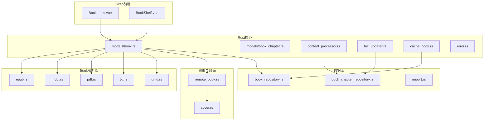
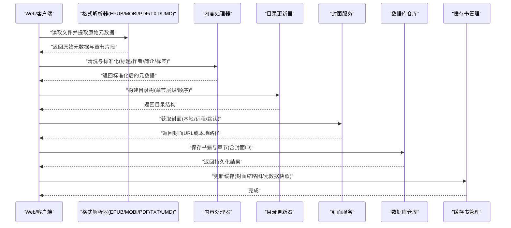
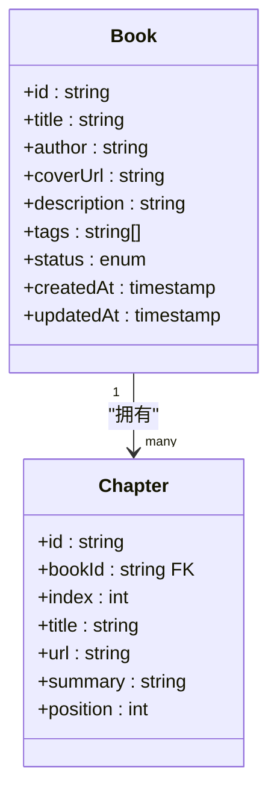
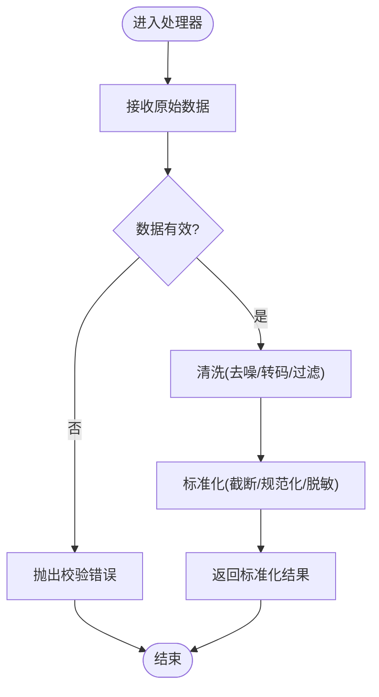
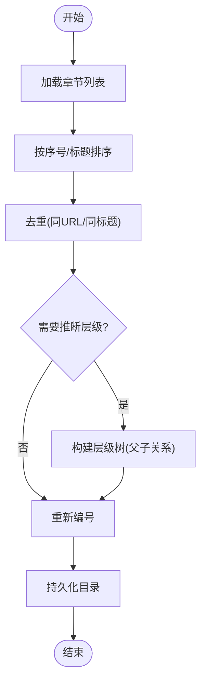
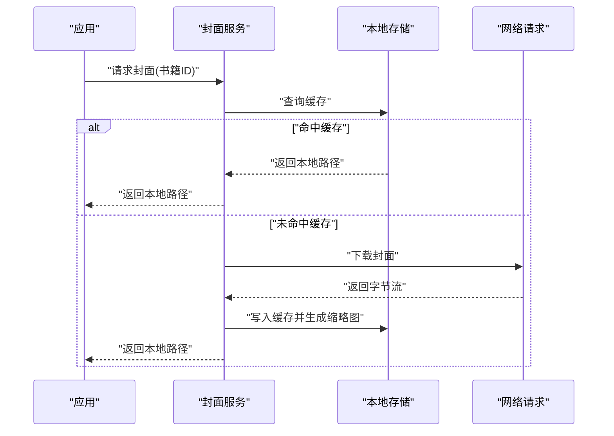
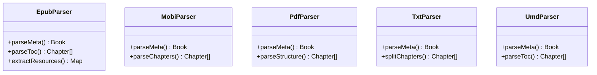
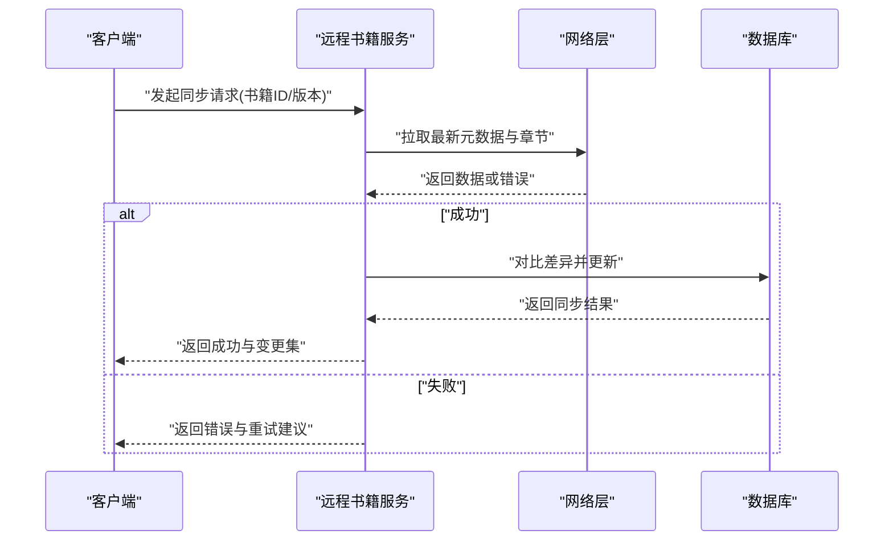
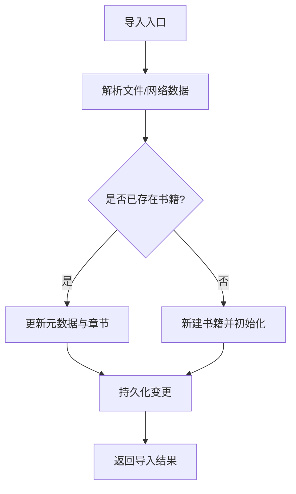
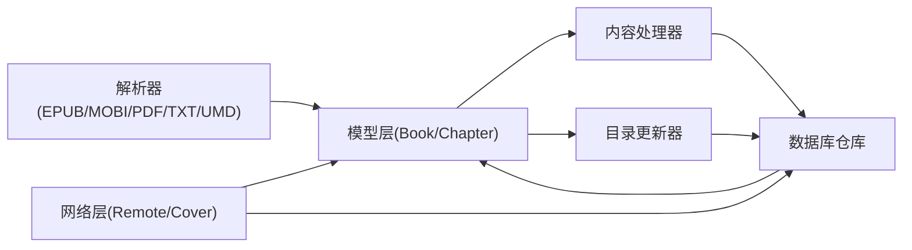

# 元数据处理

<cite>
**本文档引用的文件**   
- [lib.rs](file://rust/legado-core/src/lib.rs)
- [book.rs](file://rust/legado-core/src/models/book.rs)
- [book_chapter.rs](file://rust/legado-core/src/models/book_chapter.rs)
- [content_processor.rs](file://rust/legado-core/src/content_processor.rs)
- [toc_updater.rs](file://rust/legado-core/src/toc_updater.rs)
- [cache_book.rs](file://rust/legado-core/src/cache_book.rs)
- [error.rs](file://rust/legado-core/src/error.rs)
- [epub.rs](file://rust/legado-book/src/epub.rs)
- [mobi.rs](file://rust/legado-book/src/mobi.rs)
- [pdf.rs](file://rust/legado-book/src/pdf.rs)
- [txt.rs](file://rust/legado-book/src/txt.rs)
- [umd.rs](file://rust/legado-book/src/umd.rs)
- [cover.rs](file://rust/legado-net/src/cover.rs)
- [remote_book.rs](file://rust/legado-net/src/remote_book.rs)
- [book_repository.rs](file://rust/legado-db/src/repository/book_repository.rs)
- [book_chapter_repository.rs](file://rust/legado-db/src/repository/book_chapter_repository.rs)
- [import.rs](file://rust/legado-db/src/import.rs)
- [BookItems.vue](file://modules/web/src/components/BookItems.vue)
- [BookShelf.vue](file://modules/web/src/views/BookShelf.vue)
</cite>

## 目录
1. [简介](#简介)
2. [项目结构](#项目结构)
3. [核心组件](#核心组件)
4. [架构总览](#架构总览)
5. [详细组件分析](#详细组件分析)
6. [依赖关系分析](#依赖关系分析)
7. [性能考虑](#性能考虑)
8. [故障排查指南](#故障排查指南)
9. [结论](#结论)
10. [附录](#附录)

## 简介
本文件面向书籍元数据处理的完整生命周期，覆盖从提取、清洗、标准化到持久化与展示的全链路。重点包括：
- 标题、作者、封面、简介、标签等字段的处理逻辑
- 元数据验证规则与错误处理机制
- 封面图片的获取、缓存与显示优化策略
- 章节信息提取与目录结构构建算法
- 元数据同步与冲突解决机制
- 自定义元数据字段扩展方法与示例路径

## 项目结构
本项目采用多语言分层架构：
- Rust 核心层负责模型定义、内容处理、网络请求、数据库访问与FFI桥接
- Android/Kotlin 应用层提供UI与业务编排
- Web模块提供在线编辑与管理界面
- Book库负责多种电子书格式的解析（EPUB/MOBI/PDF/TXT/UMD）

图表来源
- [book.rs:1-200](file://rust/legado-core/src/models/book.rs#L1-L200)
- [book_chapter.rs:1-200](file://rust/legado-core/src/models/book_chapter.rs#L1-L200)
- [content_processor.rs:1-200](file://rust/legado-core/src/content_processor.rs#L1-L200)
- [toc_updater.rs:1-200](file://rust/legado-core/src/toc_updater.rs#L1-L200)
- [cache_book.rs:1-200](file://rust/legado-core/src/cache_book.rs#L1-L200)
- [error.rs:1-200](file://rust/legado-core/src/error.rs#L1-L200)
- [epub.rs:1-200](file://rust/legado-book/src/epub.rs#L1-L200)
- [mobi.rs:1-200](file://rust/legado-book/src/mobi.rs#L1-L200)
- [pdf.rs:1-200](file://rust/legado-book/src/pdf.rs#L1-L200)
- [txt.rs:1-200](file://rust/legado-book/src/txt.rs#L1-L200)
- [umd.rs:1-200](file://rust/legado-book/src/umd.rs#L1-L200)
- [cover.rs:1-200](file://rust/legado-net/src/cover.rs#L1-L200)
- [remote_book.rs:1-200](file://rust/legado-net/src/remote_book.rs#L1-L200)
- [book_repository.rs:1-200](file://rust/legado-db/src/repository/book_repository.rs#L1-L200)
- [book_chapter_repository.rs:1-200](file://rust/legado-db/src/repository/book_chapter_repository.rs#L1-L200)
- [import.rs:1-200](file://rust/legado-db/src/import.rs#L1-L200)
- [BookItems.vue:1-200](file://modules/web/src/components/BookItems.vue#L1-L200)
- [BookShelf.vue:1-200](file://modules/web/src/views/BookShelf.vue#L1-L200)

章节来源
- [lib.rs:1-200](file://rust/legado-core/src/lib.rs#L1-L200)

## 核心组件
- 书籍模型与章节模型：统一描述书籍与章节的核心字段与关系
- 内容处理器：对原始内容进行清洗、格式化与标准化
- 目录更新器：基于章节列表构建目录树结构
- 缓存书管理：封面与元数据的本地缓存策略
- 错误模型：统一的错误类型与传播方式
- 格式解析器：针对EPUB/MOBI/PDF/TXT/UMD的元数据与内容提取
- 网络与封面：远程抓取、下载、缓存与缩略图生成
- 数据库仓库：书籍与章节的增删改查与导入导出

章节来源
- [book.rs:1-200](file://rust/legado-core/src/models/book.rs#L1-L200)
- [book_chapter.rs:1-200](file://rust/legado-core/src/models/book_chapter.rs#L1-L200)
- [content_processor.rs:1-200](file://rust/legado-core/src/content_processor.rs#L1-L200)
- [toc_updater.rs:1-200](file://rust/legado-core/src/toc_updater.rs#L1-L200)
- [cache_book.rs:1-200](file://rust/legado-core/src/cache_book.rs#L1-L200)
- [error.rs:1-200](file://rust/legado-core/src/error.rs#L1-L200)

## 架构总览
下图展示了从“源数据”到“持久化与展示”的端到端流程，涵盖多格式解析、元数据清洗、目录构建、封面处理与数据库落盘。

图表来源
- [epub.rs:1-200](file://rust/legado-book/src/epub.rs#L1-L200)
- [mobi.rs:1-200](file://rust/legado-book/src/mobi.rs#L1-L200)
- [pdf.rs:1-200](file://rust/legado-book/src/pdf.rs#L1-L200)
- [txt.rs:1-200](file://rust/legado-book/src/txt.rs#L1-L200)
- [umd.rs:1-200](file://rust/legado-book/src/umd.rs#L1-L200)
- [content_processor.rs:1-200](file://rust/legado-core/src/content_processor.rs#L1-L200)
- [toc_updater.rs:1-200](file://rust/legado-core/src/toc_updater.rs#L1-L200)
- [cover.rs:1-200](file://rust/legado-net/src/cover.rs#L1-L200)
- [book_repository.rs:1-200](file://rust/legado-db/src/repository/book_repository.rs#L1-L200)
- [book_chapter_repository.rs:1-200](file://rust/legado-db/src/repository/book_chapter_repository.rs#L1-L200)
- [cache_book.rs:1-200](file://rust/legado-core/src/cache_book.rs#L1-L200)

## 详细组件分析

### 书籍与章节模型
- 书籍模型包含标题、作者、封面、简介、标签、状态、时间戳等核心字段，并提供序列化/反序列化能力
- 章节模型包含章节序号、标题、链接、内容摘要、位置信息等，支持层级与排序
- 两者通过外键关联，确保目录与内容的完整性

图表来源
- [book.rs:1-200](file://rust/legado-core/src/models/book.rs#L1-L200)
- [book_chapter.rs:1-200](file://rust/legado-core/src/models/book_chapter.rs#L1-L200)

章节来源
- [book.rs:1-200](file://rust/legado-core/src/models/book.rs#L1-L200)
- [book_chapter.rs:1-200](file://rust/legado-core/src/models/book_chapter.rs#L1-L200)

### 内容处理器（清洗与标准化）
- 输入：原始文本、HTML片段、JSON/XML片段
- 处理：去噪、正则替换、编码转换、富文本清理、长度限制
- 输出：标准化的字符串或结构化对象（如简介、标签数组）

图表来源
- [content_processor.rs:1-200](file://rust/legado-core/src/content_processor.rs#L1-L200)

章节来源
- [content_processor.rs:1-200](file://rust/legado-core/src/content_processor.rs#L1-L200)

### 目录更新器（章节结构与目录构建）
- 输入：章节列表（可能无序或缺失层级）
- 处理：排序、去重、层级推断、索引重建
- 输出：稳定的目录树结构（用于导航与阅读定位）

图表来源
- [toc_updater.rs:1-200](file://rust/legado-core/src/toc_updater.rs#L1-L200)

章节来源
- [toc_updater.rs:1-200](file://rust/legado-core/src/toc_updater.rs#L1-L200)

### 封面服务（获取、缓存与显示优化）
- 获取策略：优先本地缓存，其次远程下载，最后回退默认封面
- 缓存策略：按书籍ID哈希存储，支持缩略图生成与过期清理
- 显示优化：懒加载、占位图、尺寸适配、失败重试

图表来源
- [cover.rs:1-200](file://rust/legado-net/src/cover.rs#L1-L200)

章节来源
- [cover.rs:1-200](file://rust/legado-net/src/cover.rs#L1-L200)

### 多格式解析器（EPUB/MOBI/PDF/TXT/UMD）
- EPUB：解析OPF元数据、NCX/NAV目录、资源映射
- MOBI：提取AZW系列元数据与章节边界
- PDF：抽取文档属性与页面结构
- TXT：基于正则识别标题与章节分隔
- UMD：专有格式元数据与章节解析

图表来源
- [epub.rs:1-200](file://rust/legado-book/src/epub.rs#L1-L200)
- [mobi.rs:1-200](file://rust/legado-book/src/mobi.rs#L1-L200)
- [pdf.rs:1-200](file://rust/legado-book/src/pdf.rs#L1-L200)
- [txt.rs:1-200](file://rust/legado-book/src/txt.rs#L1-L200)
- [umd.rs:1-200](file://rust/legado-book/src/umd.rs#L1-L200)

章节来源
- [epub.rs:1-200](file://rust/legado-book/src/epub.rs#L1-L200)
- [mobi.rs:1-200](file://rust/legado-book/src/mobi.rs#L1-L200)
- [pdf.rs:1-200](file://rust/legado-book/src/pdf.rs#L1-L200)
- [txt.rs:1-200](file://rust/legado-book/src/txt.rs#L1-L200)
- [umd.rs:1-200](file://rust/legado-book/src/umd.rs#L1-L200)

### 网络与远程书籍（抓取与同步）
- 远程抓取：根据URL模板与规则解析网页元数据与章节列表
- 同步策略：增量更新、冲突检测（以服务器为准或合并策略）
- 错误处理：超时重试、降级策略、日志记录

图表来源
- [remote_book.rs:1-200](file://rust/legado-net/src/remote_book.rs#L1-L200)

章节来源
- [remote_book.rs:1-200](file://rust/legado-net/src/remote_book.rs#L1-L200)

### 数据库仓库（持久化与导入）
- 书籍仓库：CRUD操作、批量插入、条件查询
- 章节仓库：分页加载、按书ID检索、索引维护
- 导入工具：从文件或网络导入，自动创建书籍与章节

图表来源
- [book_repository.rs:1-200](file://rust/legado-db/src/repository/book_repository.rs#L1-L200)
- [book_chapter_repository.rs:1-200](file://rust/legado-db/src/repository/book_chapter_repository.rs#L1-L200)
- [import.rs:1-200](file://rust/legado-db/src/import.rs#L1-L200)

章节来源
- [book_repository.rs:1-200](file://rust/legado-db/src/repository/book_repository.rs#L1-L200)
- [book_chapter_repository.rs:1-200](file://rust/legado-db/src/repository/book_chapter_repository.rs#L1-L200)
- [import.rs:1-200](file://rust/legado-db/src/import.rs#L1-L200)

### Web展示（书架与书籍项）
- BookItems.vue：渲染书籍卡片（封面、标题、作者、标签）
- BookShelf.vue：书架布局、搜索、排序、批量操作

章节来源
- [BookItems.vue:1-200](file://modules/web/src/components/BookItems.vue#L1-L200)
- [BookShelf.vue:1-200](file://modules/web/src/views/BookShelf.vue#L1-L200)

## 依赖关系分析
- 模型层依赖：Book与Chapter通过外键关联，保证一致性
- 处理层依赖：内容处理器与目录更新器依赖模型层，输出标准化结构
- 解析层依赖：各格式解析器独立实现，统一返回模型对象
- 网络层依赖：远程书籍服务与封面服务通过网络层进行IO
- 存储层依赖：数据库仓库封装ORM操作，提供事务与并发控制

图表来源
- [book.rs:1-200](file://rust/legado-core/src/models/book.rs#L1-L200)
- [book_chapter.rs:1-200](file://rust/legado-core/src/models/book_chapter.rs#L1-L200)
- [content_processor.rs:1-200](file://rust/legado-core/src/content_processor.rs#L1-L200)
- [toc_updater.rs:1-200](file://rust/legado-core/src/toc_updater.rs#L1-L200)
- [epub.rs:1-200](file://rust/legado-book/src/epub.rs#L1-L200)
- [mobi.rs:1-200](file://rust/legado-book/src/mobi.rs#L1-L200)
- [pdf.rs:1-200](file://rust/legado-book/src/pdf.rs#L1-L200)
- [txt.rs:1-200](file://rust/legado-book/src/txt.rs#L1-L200)
- [umd.rs:1-200](file://rust/legado-book/src/umd.rs#L1-L200)
- [remote_book.rs:1-200](file://rust/legado-net/src/remote_book.rs#L1-L200)
- [cover.rs:1-200](file://rust/legado-net/src/cover.rs#L1-L200)
- [book_repository.rs:1-200](file://rust/legado-db/src/repository/book_repository.rs#L1-L200)
- [book_chapter_repository.rs:1-200](file://rust/legado-db/src/repository/book_chapter_repository.rs#L1-L200)

章节来源
- [book.rs:1-200](file://rust/legado-core/src/models/book.rs#L1-L200)
- [book_chapter.rs:1-200](file://rust/legado-core/src/models/book_chapter.rs#L1-L200)
- [content_processor.rs:1-200](file://rust/legado-core/src/content_processor.rs#L1-L200)
- [toc_updater.rs:1-200](file://rust/legado-core/src/toc_updater.rs#L1-L200)
- [epub.rs:1-200](file://rust/legado-book/src/epub.rs#L1-L200)
- [mobi.rs:1-200](file://rust/legado-book/src/mobi.rs#L1-L200)
- [pdf.rs:1-200](file://rust/legado-book/src/pdf.rs#L1-L200)
- [txt.rs:1-200](file://rust/legado-book/src/txt.rs#L1-L200)
- [umd.rs:1-200](file://rust/legado-book/src/umd.rs#L1-L200)
- [remote_book.rs:1-200](file://rust/legado-net/src/remote_book.rs#L1-L200)
- [cover.rs:1-200](file://rust/legado-net/src/cover.rs#L1-L200)
- [book_repository.rs:1-200](file://rust/legado-db/src/repository/book_repository.rs#L1-L200)
- [book_chapter_repository.rs:1-200](file://rust/legado-db/src/repository/book_chapter_repository.rs#L1-L200)

## 性能考虑
- 解析阶段：使用流式解析避免大文件内存峰值；对PDF/EPUB启用按需加载
- 内容处理：正则表达式预编译与复用；批量清洗减少重复计算
- 目录构建：增量更新而非全量重建；使用索引加速查找
- 封面处理：缩略图异步生成；LRU缓存命中率监控
- 数据库：批量插入与事务包裹；合理索引设计（书名、作者、标签）
- 网络：连接池与超时控制；失败快速回退与重试退避

## 故障排查指南
- 常见错误类型：解析失败、网络超时、磁盘空间不足、权限拒绝
- 错误分类：可恢复（重试）、不可恢复（用户干预）、降级（跳过/默认值）
- 日志记录：关键步骤打点，异常堆栈与上下文信息
- 调试建议：开启详细日志；隔离问题模块；复现最小用例

章节来源
- [error.rs:1-200](file://rust/legado-core/src/error.rs#L1-L200)

## 结论
本书籍元数据处理系统通过分层架构与模块化设计，实现了从多格式解析、清洗标准化、目录构建、封面处理到持久化展示的完整闭环。系统在性能、可靠性与可扩展性方面均有充分考虑，适合大规模书籍管理与在线编辑场景。

## 附录

### 元数据验证规则与错误处理机制
- 必填字段：标题、作者、封面URL（可为空但需有默认策略）
- 长度限制：简介不超过阈值；标签数量上限
- 格式校验：URL合法性、编码一致性、日期格式
- 错误处理：捕获解析异常、网络异常、IO异常；提供降级与重试

章节来源
- [error.rs:1-200](file://rust/legado-core/src/error.rs#L1-L200)

### 自定义元数据字段扩展方法
- 在书籍模型中新增字段（保持向后兼容）
- 在解析器中添加对应字段的提取逻辑
- 在内容处理器中增加清洗与标准化规则
- 在数据库仓库中迁移表结构并更新查询接口
- 在Web前端中展示与编辑新字段

示例路径参考
- 模型扩展：[book.rs:1-200](file://rust/legado-core/src/models/book.rs#L1-L200)
- 解析扩展：[epub.rs:1-200](file://rust/legado-book/src/epub.rs#L1-L200)
- 处理扩展：[content_processor.rs:1-200](file://rust/legado-core/src/content_processor.rs#L1-L200)
- 仓库扩展：[book_repository.rs:1-200](file://rust/legado-db/src/repository/book_repository.rs#L1-L200)
- 前端扩展：[BookItems.vue:1-200](file://modules/web/src/components/BookItems.vue#L1-L200)