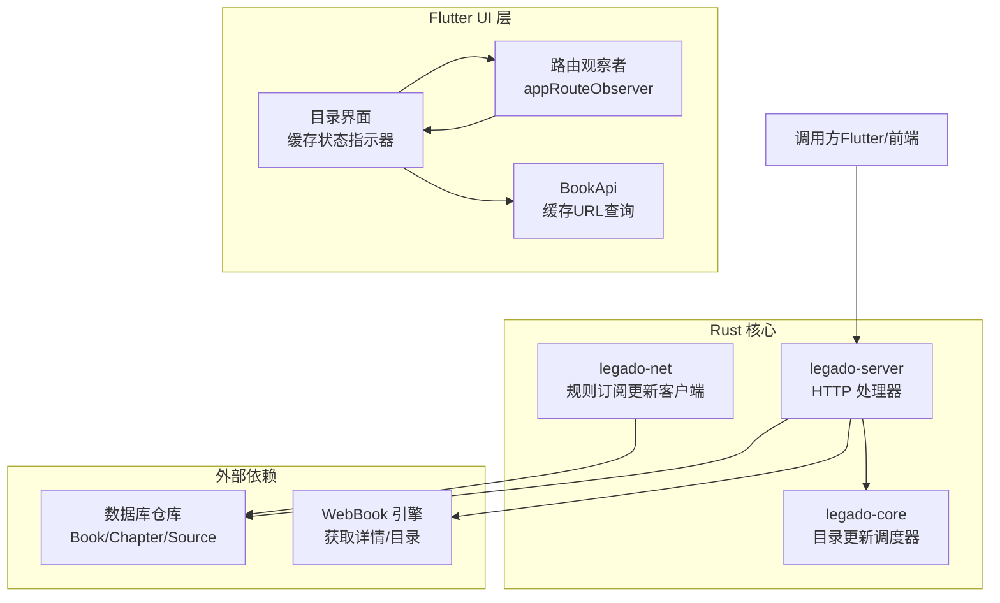
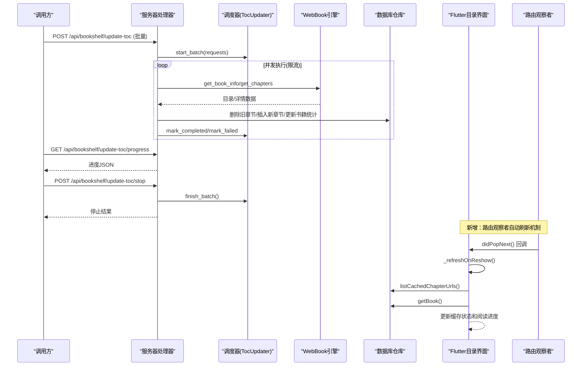
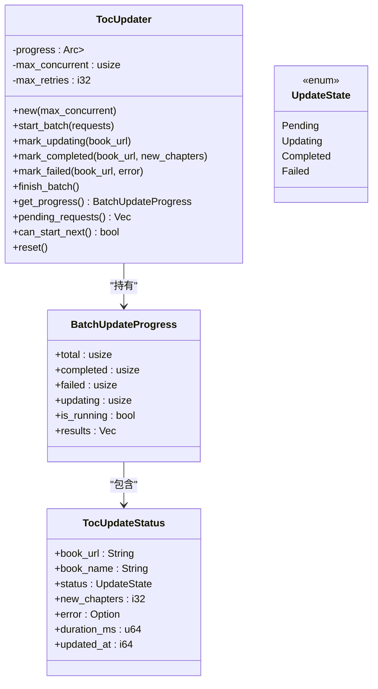
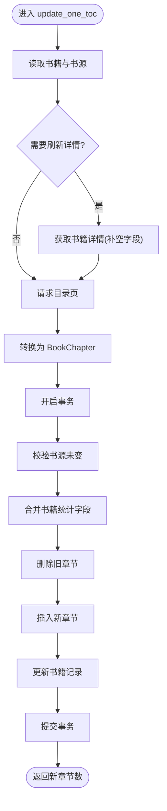
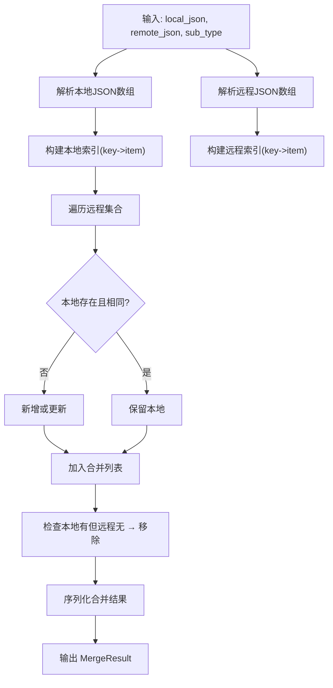
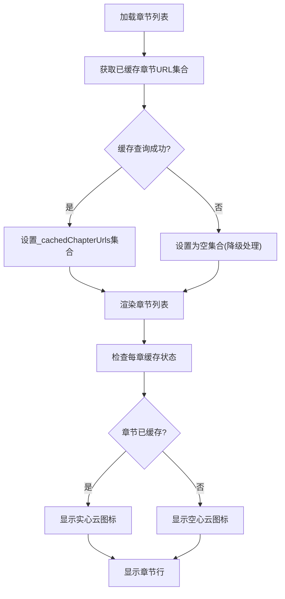
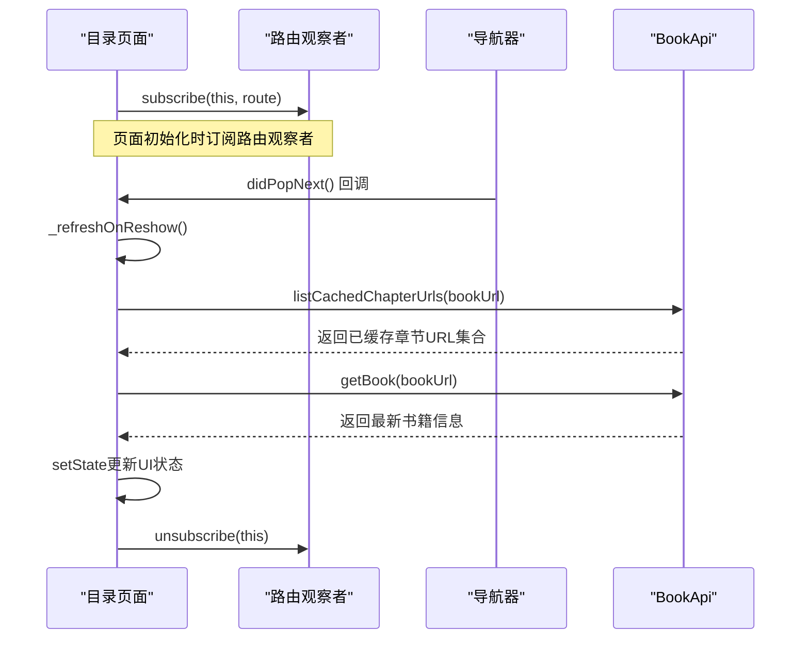
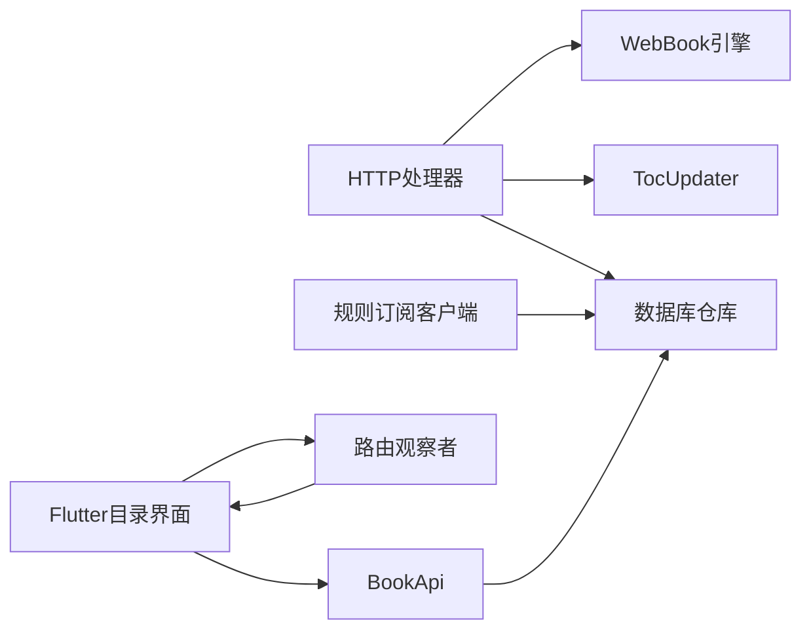

# 增强的目录更新系统

<cite>
**本文引用的文件**   
- [README.md](file://README.md)
- [toc_updater.rs](file://rust/legado-core/src/toc_updater.rs)
- [toc_update.rs](file://rust/legado-server/src/handlers/toc_update.rs)
- [rule_update_client.rs](file://rust/legado-net/src/rule_update_client.rs)
- [TocViewModel.kt](file://app/src/main/java/io/legado/app/ui/book/toc/TocViewModel.kt)
- [toc_screen.dart](file://flutter_legado/lib/src/screens/toc_screen.dart)
- [app_route_observer.dart](file://flutter_legado/lib/src/utils/app_route_observer.dart)
- [app.dart](file://flutter_legado/lib/app.dart)
- [book_api.dart](file://flutter_legado/lib/src/services/book_api.dart)
</cite>

## 更新摘要
**变更内容**   
- 新增自动章节缓存系统的视觉指示器功能，在目录界面显示云端图标（实心表示已缓存，空心表示未缓存）
- 实现通过appRouteObserver的路由观察功能来自动刷新缓存状态
- 增强目录界面的用户体验，提供实时的章节缓存状态反馈

## 目录
1. [简介](#简介)
2. [项目结构](#项目结构)
3. [核心组件](#核心组件)
4. [架构总览](#架构总览)
5. [详细组件分析](#详细组件分析)
6. [依赖关系分析](#依赖关系分析)
7. [性能考量](#性能考量)
8. [故障排查指南](#故障排查指南)
9. [结论](#结论)
10. [附录](#附录)

## 简介
本文件聚焦于"增强的目录更新系统"，该系统在 Legado 项目中负责批量与单本的书籍目录（章节）更新，提供并发控制、进度追踪、失败重试与停止语义。系统由 Rust 核心调度器与 HTTP API 处理器组成，并通过 WebBook 引擎与数据库仓库完成网络请求、解析与落库。同时，文档也涵盖规则订阅更新客户端，用于书源/替换规则/RSS 源的增量合并。**最新更新**：新增了自动章节缓存系统的视觉指示器，通过 Flutter UI 层实现云端图标的实时显示和路由观察者驱动的自动刷新机制。

## 项目结构
- Rust 核心层：
  - 目录更新调度器：位于 legado-core，实现并发限流、去重、优先级排序与进度状态机。
  - HTTP 处理器：位于 legado-server，暴露单本与批量更新接口，并维护全局调度器实例与停止标志。
  - 规则订阅更新客户端：位于 legado-net，负责远程订阅拉取与本地 JSON 数组的增量合并。
- Flutter UI 层：跨平台界面，包含新增的自动章节缓存视觉指示器和路由观察者功能。
- Android 旧代码：Kotlin 目录相关视图模型（作为迁移对照参考）。

**图表来源**
- [toc_updater.rs:1-729](file://rust/legado-core/src/toc_updater.rs#L1-L729)
- [toc_update.rs:1-678](file://rust/legado-server/src/handlers/toc_update.rs#L1-L678)
- [rule_update_client.rs:1-318](file://rust/legado-net/src/rule_update_client.rs#L1-L318)
- [toc_screen.dart:1-921](file://flutter_legado/lib/src/screens/toc_screen.dart#L1-L921)
- [app_route_observer.dart:1-10](file://flutter_legado/lib/src/utils/app_route_observer.dart#L1-L10)

## 核心组件
- TocUpdater（调度器）
  - 职责：管理批量更新的生命周期、并发上限、逐本状态（待处理/更新中/完成/失败）、统计与重置。
  - 关键能力：按 book_url 去重、priority 升序稳定排序、信号量限流、should_stop 停止语义、线程安全的状态变更。
- HTTP 处理器（单本/批量）
  - 职责：暴露 REST 端点，封装单本更新流程（读取书籍/书源→可选刷新书籍详情→请求目录→事务落库），以及批量更新调度。
  - 关键能力：全局 TOC_UPDATER 实例、STOP_FLAG 原子停止标志、后台 tokio 任务执行、进度轮询与停止接口。
- 规则订阅更新客户端
  - 职责：从远程 URL 拉取订阅内容，对比版本并合并变更（新增/更新/移除），支持间隔策略与无 UA 请求。
  - 关键能力：fetch_subscription、merge_subscription、should_update。
- **新增**：自动章节缓存视觉指示器
  - 职责：在目录界面显示每章的缓存状态，使用云端图标区分已缓存和未缓存章节。
  - 关键能力：通过 BookApi.listCachedChapterUrls 获取缓存章节集合，根据 chapter_url 判断显示实心或空心云图标。
- **新增**：路由观察者自动刷新机制
  - 职责：监听页面路由变化，当从阅读器返回时自动刷新缓存状态和当前章节信息。
  - 关键能力：订阅 appRouteObserver，在 didPopNext 回调中触发 _refreshOnReshow 方法。

**章节来源**
- [toc_updater.rs:1-729](file://rust/legado-core/src/toc_updater.rs#L1-L729)
- [toc_update.rs:1-678](file://rust/legado-server/src/handlers/toc_update.rs#L1-L678)
- [rule_update_client.rs:1-318](file://rust/legado-net/src/rule_update_client.rs#L1-L318)
- [toc_screen.dart:100-141](file://flutter_legado/lib/src/screens/toc_screen.dart#L100-L141)
- [book_api.dart:532-534](file://flutter_legado/lib/src/services/book_api.dart#L532-L534)

## 架构总览
整体数据流：
- 调用方通过 HTTP 发起单本或批量更新请求。
- 处理器校验参数并构建更新请求；批量路径使用全局调度器进行并发限流与进度跟踪。
- 单本更新链路：读取书籍与书源→按需刷新书籍详情→请求目录页→转换为 BookChapter→事务式落库（删旧插新 + 书籍统计字段）。
- 进度与停止：通过 progress 端点轮询；stop 端点设置停止标志，未开始的任务标记为失败。
- **新增**：UI 层通过路由观察者监听页面重现事件，自动刷新章节缓存状态和阅读进度。

**图表来源**
- [toc_update.rs:246-377](file://rust/legado-server/src/handlers/toc_update.rs#L246-L377)
- [toc_updater.rs:215-269](file://rust/legado-core/src/toc_updater.rs#L215-L269)
- [toc_screen.dart:118-141](file://flutter_legado/lib/src/screens/toc_screen.dart#L118-L141)

## 详细组件分析

### 调度器 TocUpdater（并发与状态机）
- 数据结构
  - TocUpdateRequest：包含 book_url、book_name、source_url、priority、refresh_book_info。
  - TocUpdateStatus：记录每本书的状态、新章节数、错误信息、耗时与更新时间。
  - BatchUpdateProgress：批次总量、完成/失败/更新中计数、运行标志与逐本结果。
- 并发与调度
  - run_batch：对请求去重并按 priority 升序稳定排序；以信号量限制并发；单本失败不中断整批；should_stop 触发后未开始的任务标记失败。
- 线程安全
  - 使用 Arc<Mutex<BatchUpdateProgress>> 保护共享状态；提供 mark_updating/marked_completed/marked_failed 等原子操作。

**图表来源**
- [toc_updater.rs:12-195](file://rust/legado-core/src/toc_updater.rs#L12-L195)

**章节来源**
- [toc_updater.rs:1-729](file://rust/legado-core/src/toc_updater.rs#L1-L729)

### HTTP 处理器（单本与批量）
- 单本更新
  - 读取书籍与书源（缺省 source_url 时回退到 book.origin）。
  - 按需刷新书籍详情（仅补空字段，避免覆盖用户本地数据）。
  - 请求目录页并转换为 BookChapter。
  - 事务式落库：校验书源未变→删除旧章节→插入新章节→更新书籍统计字段（总数、最新章节标题/时间、字数等）。
- 批量更新
  - 全局 TOC_UPDATER 实例与 STOP_FLAG 原子标志。
  - 后台 tokio 任务执行 run_batch；worker 闭包复用单本更新逻辑。
  - 提供进度查询与停止接口。

**图表来源**
- [toc_update.rs:100-236](file://rust/legado-server/src/handlers/toc_update.rs#L100-L236)

**章节来源**
- [toc_update.rs:1-678](file://rust/legado-server/src/handlers/toc_update.rs#L1-L678)

### 规则订阅更新客户端
- 功能要点
  - fetch_subscription：HTTP GET 拉取订阅 JSON，支持去除 User-Agent 头。
  - merge_subscription：基于主键字段（bookSourceUrl/name/sourceUrl）进行新增/更新/移除合并。
  - should_update：根据 last_update 与 interval_hours 判断是否需要更新。
- 适用场景
  - 书源、替换规则、RSS 源的增量同步与版本管理。

**图表来源**
- [rule_update_client.rs:97-180](file://rust/legado-net/src/rule_update_client.rs#L97-L180)

**章节来源**
- [rule_update_client.rs:1-318](file://rust/legado-net/src/rule_update_client.rs#L1-L318)

### 自动章节缓存视觉指示器（新增功能）
- 功能特性
  - 云端图标显示：实心云图标表示章节已缓存，空心云图标表示章节未缓存。
  - 实时状态更新：通过 BookApi.listCachedChapterUrls 获取已缓存章节的 URL 集合。
  - 智能降级：缓存查询失败时默认显示为未缓存状态，不影响目录正常展示。
- 实现细节
  - 在章节行渲染时调用 _cacheStatusIcon 方法判断缓存状态。
  - 使用 Icons.cloud_done 和 Icons.cloud_outlined 分别表示已缓存和未缓存。
  - 当前阅读章节显示对勾图标，优先于缓存状态显示。

**图表来源**
- [toc_screen.dart:167-178](file://flutter_legado/lib/src/screens/toc_screen.dart#L167-L178)
- [toc_screen.dart:558-573](file://flutter_legado/lib/src/screens/toc_screen.dart#L558-L573)

**章节来源**
- [toc_screen.dart:70-72](file://flutter_legado/lib/src/screens/toc_screen.dart#L70-L72)
- [toc_screen.dart:167-178](file://flutter_legado/lib/src/screens/toc_screen.dart#L167-L178)
- [toc_screen.dart:558-573](file://flutter_legado/lib/src/screens/toc_screen.dart#L558-L573)
- [book_api.dart:532-534](file://flutter_legado/lib/src/services/book_api.dart#L532-L534)

### 路由观察者自动刷新机制（新增功能）
- 功能特性
  - 页面重现监听：通过 RouteAware 接口的 didPopNext 方法监听页面重现事件。
  - 自动状态刷新：从阅读器返回时自动刷新章节缓存状态和当前阅读进度。
  - 无缝体验：刷新过程对用户透明，确保目录界面始终显示最新状态。
- 实现细节
  - 在 didChangeDependencies 中订阅 appRouteObserver。
  - 在 dispose 中取消订阅，防止内存泄漏。
  - _refreshOnReshow 方法同时刷新缓存状态和书籍信息。

**图表来源**
- [toc_screen.dart:97-116](file://flutter_legado/lib/src/screens/toc_screen.dart#L97-L116)
- [toc_screen.dart:118-141](file://flutter_legado/lib/src/screens/toc_screen.dart#L118-L141)
- [app_route_observer.dart:1-10](file://flutter_legado/lib/src/utils/app_route_observer.dart#L1-L10)

**章节来源**
- [toc_screen.dart:97-116](file://flutter_legado/lib/src/screens/toc_screen.dart#L97-L116)
- [toc_screen.dart:118-141](file://flutter_legado/lib/src/screens/toc_screen.dart#L118-L141)
- [app.dart:76-79](file://flutter_legado/lib/app.dart#L76-L79)
- [app_route_observer.dart:1-10](file://flutter_legado/lib/src/utils/app_route_observer.dart#L1-L10)

### Android 目录视图模型（迁移对照）
- TocViewModel 提供目录相关的业务方法（如 upBookTocRule、reverseToc、搜索与导出书签等），作为 Kotlin 侧目录更新的参考实现。

**章节来源**
- [TocViewModel.kt:1-150](file://app/src/main/java/io/legado/app/ui/book/toc/TocViewModel.kt#L1-L150)

## 依赖关系分析
- 模块耦合
  - 处理器依赖调度器（TocUpdater）与 WebBook 引擎、数据库仓库。
  - 调度器独立于网络与存储，只关注并发与状态。
  - 规则订阅客户端独立于目录更新，专注于订阅数据的拉取与合并。
  - **新增**：Flutter UI 层依赖路由观察者和 BookApi 实现缓存状态显示和自动刷新。
- 外部依赖
  - 网络：reqwest（HTTP 客户端）。
  - 数据库：rusqlite（通过仓库接口访问 Book/Chapter/Source）。
  - 并发：tokio（异步运行时）、Semaphore（限流）、JoinSet（任务聚合）。
  - **新增**：Flutter Material Design（图标资源）、Riverpod（状态管理）。

**图表来源**
- [toc_update.rs:1-678](file://rust/legado-server/src/handlers/toc_update.rs#L1-L678)
- [toc_updater.rs:1-729](file://rust/legado-core/src/toc_updater.rs#L1-L729)
- [rule_update_client.rs:1-318](file://rust/legado-net/src/rule_update_client.rs#L1-L318)
- [toc_screen.dart:1-921](file://flutter_legado/lib/src/screens/toc_screen.dart#L1-L921)

**章节来源**
- [toc_update.rs:1-678](file://rust/legado-server/src/handlers/toc_update.rs#L1-L678)
- [toc_updater.rs:1-729](file://rust/legado-core/src/toc_updater.rs#L1-L729)
- [rule_update_client.rs:1-318](file://rust/legado-net/src/rule_update_client.rs#L1-L318)
- [toc_screen.dart:1-921](file://flutter_legado/lib/src/screens/toc_screen.dart#L1-L921)

## 性能考量
- 并发控制
  - 使用信号量限制最大并发，避免过多网络与数据库压力。
  - 建议根据设备 CPU 与网络状况动态调整 max_concurrent。
- 去重与优先级
  - 按 book_url 去重减少重复工作；priority 升序确保高优先级任务先执行。
- 失败隔离
  - 单本失败不影响其他任务，提升整体吞吐与鲁棒性。
- 停止语义
  - should_stop 快速终止未开始任务，已飞任务自然结束，保证资源释放。
- 数据库事务
  - 事务内完成校验、删除与插入，减少中间态不一致风险。
- **新增**：UI 性能优化
  - 缓存查询失败时采用降级处理，避免阻塞目录加载。
  - 路由观察者仅在页面重现时触发刷新，减少不必要的网络请求。
  - 使用 setState 局部更新，避免整个目录列表重新渲染。

## 故障排查指南
- 常见问题
  - 书籍不存在：单本更新返回错误描述，检查 book_url 是否正确。
  - 书源不存在：当 origin 指向的书源缺失时，需重新导入或修复书源。
  - 目录为空：网络解析失败或站点结构变化，需检查规则或重试。
  - 批量更新卡住：确认 stop 端点是否被调用；检查进度端点的 is_running 与 updating 计数。
  - **新增**：缓存状态不更新：检查路由观察者是否正确订阅，确认 didPopNext 回调是否触发。
  - **新增**：云端图标显示异常：验证 BookApi.listCachedChapterUrls 是否正常返回，检查 chapter_url 匹配逻辑。
- 调试建议
  - 使用 progress 端点观察每本书的状态与错误信息。
  - 降低 max_concurrent 验证并发问题。
  - 查看日志中的错误字符串定位具体问题。
  - **新增**：在 Flutter DevTools 中检查路由观察者订阅状态。
  - **新增**：添加日志输出到 _refreshOnReshow 方法，确认刷新逻辑执行情况。

**章节来源**
- [toc_update.rs:246-377](file://rust/legado-server/src/handlers/toc_update.rs#L246-L377)
- [toc_screen.dart:118-141](file://flutter_legado/lib/src/screens/toc_screen.dart#L118-L141)

## 结论
增强的目录更新系统通过 Rust 核心调度器与 HTTP 处理器实现了高并发、可观测、可控制的目录更新能力。其设计兼顾了性能与稳定性，适用于大规模书籍目录的批量更新场景。规则订阅更新客户端则完善了生态资源的增量同步能力。**最新更新**：新增的自动章节缓存视觉指示器和路由观察者机制显著提升了用户体验，使目录界面能够实时反映章节缓存状态，并在页面重现时自动保持数据一致性。建议在部署时合理配置并发与超时参数，并结合进度与错误信息进行监控与排障。

## 附录
- 术语说明
  - 目录：书籍的章节列表。
  - 书源：定义如何解析网页内容的规则集合。
  - 订阅：远程提供的规则/书源/RSS 源集合，支持增量合并。
  - **新增**：缓存状态：章节正文是否已下载到本地存储，通过云端图标直观显示。
  - **新增**：路由观察者：Flutter 框架提供的页面生命周期监听机制，用于处理页面重现事件。
- 参考链接
  - 项目 README 与开发指南（Rust/Flutter 环境搭建与测试）。
  - **新增**：Flutter RouteAware 官方文档，了解页面生命周期管理最佳实践。
  - **新增**：Material Design 图标规范，确保云端图标的一致性和可访问性。

**章节来源**
- [README.md:1-121](file://README.md#L1-L121)
- [app_route_observer.dart:1-10](file://flutter_legado/lib/src/utils/app_route_observer.dart#L1-L10)