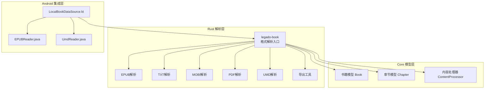
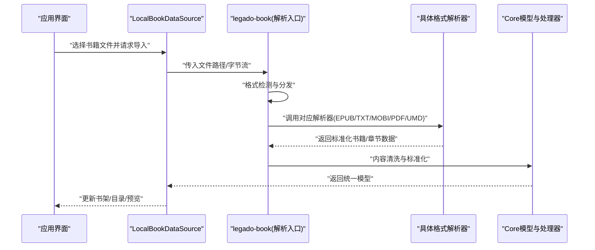
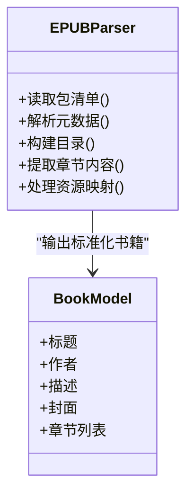
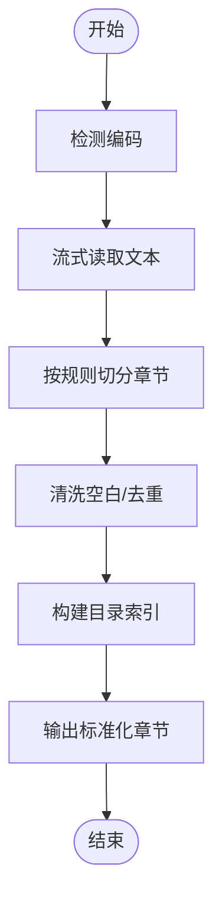
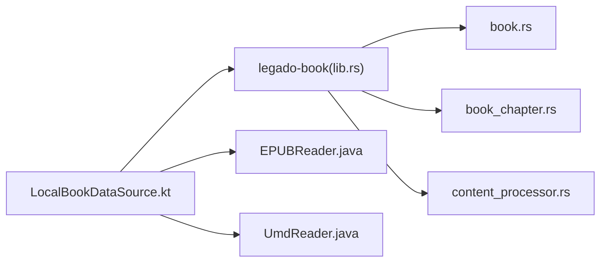

# 多格式书籍支持

<cite>
**本文档引用的文件**   
- [rust/legado-book/src/lib.rs](file://rust/legado-book/src/lib.rs)
- [rust/legado-book/src/epub.rs](file://rust/legado-book/src/epub.rs)
- [rust/legado-book/src/txt.rs](file://rust/legado-book/src/txt.rs)
- [rust/legado-book/src/mobi.rs](file://rust/legado-book/src/mobi.rs)
- [rust/legado-book/src/pdf.rs](file://rust/legado-book/src/pdf.rs)
- [rust/legado-book/src/umd.rs](file://rust/legado-book/src/umd.rs)
- [rust/legado-book/src/export.rs](file://rust/legado-book/src/export.rs)
- [rust/legado-core/src/models/book.rs](file://rust/legado-core/src/models/book.rs)
- [rust/legado-core/src/models/book_chapter.rs](file://rust/legado-core/src/models/book_chapter.rs)
- [rust/legado-core/src/content_processor.rs](file://rust/legado-core/src/content_processor.rs)
- [app/src/main/java/io/legado/app/model/localBook/LocalBookDataSource.kt](file://app/src/main/java/io/legado/app/model/localBook/LocalBookDataSource.kt)
- [modules/book/src/main/java/me/ag2s/epublib/EPUBReader.java](file://modules/book/src/main/java/me/ag2s/epublib/EPUBReader.java)
- [modules/book/src/main/java/me/ag2s/umdlib/UmdReader.java](file://modules/book/src/main/java/me/ag2s/umdlib/UmdReader.java)
</cite>

## 目录
1. [简介](#简介)
2. [项目结构](#项目结构)
3. [核心组件](#核心组件)
4. [架构总览](#架构总览)
5. [详细组件分析](#详细组件分析)
6. [依赖关系分析](#依赖关系分析)
7. [性能考量](#性能考量)
8. [故障排查指南](#故障排查指南)
9. [结论](#结论)
10. [附录：扩展新格式最佳实践](#附录：扩展新格式最佳实践)

## 简介
本文件面向Legado项目的“多格式书籍支持”能力，系统性梳理EPUB、TXT、MOBI、PDF、UMD等格式的解析实现原理与工程落地。内容涵盖：
- 各格式的元数据结构、内容组织方式与特殊处理逻辑
- 格式检测算法与兼容性处理机制
- 代码级示例路径，指导如何扩展新的书籍格式
- 不同格式的性能特点与内存占用建议
- 格式转换与标准化的最佳实践

## 项目结构
Legado的多格式书籍支持由三层构成：
- Rust层（高性能解析）：位于 rust/legado-book，提供对多种电子书格式的解析与导出能力
- Core层（通用模型与处理）：位于 rust/legado-core，定义统一的书籍/章节模型与内容处理管线
- Android/Kotlin层（应用集成）：位于 app 与 modules/book，负责UI交互、本地书源数据源与部分Java库封装

图表来源
- [rust/legado-book/src/lib.rs](file://rust/legado-book/src/lib.rs)
- [rust/legado-core/src/models/book.rs](file://rust/legado-core/src/models/book.rs)
- [rust/legado-core/src/models/book_chapter.rs](file://rust/legado-core/src/models/book_chapter.rs)
- [rust/legado-core/src/content_processor.rs](file://rust/legado-core/src/content_processor.rs)
- [app/src/main/java/io/legado/app/model/localBook/LocalBookDataSource.kt](file://app/src/main/java/io/legado/app/model/localBook/LocalBookDataSource.kt)
- [modules/book/src/main/java/me/ag2s/epublib/EPUBReader.java](file://modules/book/src/main/java/me/ag2s/epublib/EPUBReader.java)
- [modules/book/src/main/java/me/ag2s/umdlib/UmdReader.java](file://modules/book/src/main/java/me/ag2s/umdlib/UmdReader.java)

章节来源
- [rust/legado-book/src/lib.rs](file://rust/legado-book/src/lib.rs)
- [rust/legado-core/src/models/book.rs](file://rust/legado-core/src/models/book.rs)
- [rust/legado-core/src/models/book_chapter.rs](file://rust/legado-core/src/models/book_chapter.rs)
- [rust/legado-core/src/content_processor.rs](file://rust/legado-core/src/content_processor.rs)
- [app/src/main/java/io/legado/app/model/localBook/LocalBookDataSource.kt](file://app/src/main/java/io/legado/app/model/localBook/LocalBookDataSource.kt)
- [modules/book/src/main/java/me/ag2s/epublib/EPUBReader.java](file://modules/book/src/main/java/me/ag2s/epublib/EPUBReader.java)
- [modules/book/src/main/java/me/ag2s/umdlib/UmdReader.java](file://modules/book/src/main/java/me/ag2s/umdlib/UmdReader.java)

## 核心组件
- 统一书籍模型（Book/Chapter）：在Core层定义，用于跨格式标准化表示，便于后续渲染、搜索、统计等功能复用
- 内容处理器（ContentProcessor）：负责HTML清洗、文本规范化、样式/脚本剥离、图片资源处理等
- 格式解析器（Rust层）：针对EPUB/TXT/MOBI/PDF/UMD分别实现，输出标准化的书籍与章节对象
- Android集成：通过Kotlin数据源调用Rust解析或Java库，完成导入、预览、目录构建与内容加载

章节来源
- [rust/legado-core/src/models/book.rs](file://rust/legado-core/src/models/book.rs)
- [rust/legado-core/src/models/book_chapter.rs](file://rust/legado-core/src/models/book_chapter.rs)
- [rust/legado-core/src/content_processor.rs](file://rust/legado-core/src/content_processor.rs)
- [app/src/main/java/io/legado/app/model/localBook/LocalBookDataSource.kt](file://app/src/main/java/io/legado/app/model/localBook/LocalBookDataSource.kt)

## 架构总览
下图展示从文件输入到标准化输出的整体流程，以及各格式解析器的职责边界。

图表来源
- [rust/legado-book/src/lib.rs](file://rust/legado-book/src/lib.rs)
- [rust/legado-book/src/epub.rs](file://rust/legado-book/src/epub.rs)
- [rust/legado-book/src/txt.rs](file://rust/legado-book/src/txt.rs)
- [rust/legado-book/src/mobi.rs](file://rust/legado-book/src/mobi.rs)
- [rust/legado-book/src/pdf.rs](file://rust/legado-book/src/pdf.rs)
- [rust/legado-book/src/umd.rs](file://rust/legado-book/src/umd.rs)
- [rust/legado-core/src/models/book.rs](file://rust/legado-core/src/models/book.rs)
- [rust/legado-core/src/models/book_chapter.rs](file://rust/legado-core/src/models/book_chapter.rs)
- [rust/legado-core/src/content_processor.rs](file://rust/legado-core/src/content_processor.rs)
- [app/src/main/java/io/legado/app/model/localBook/LocalBookDataSource.kt](file://app/src/main/java/io/legado/app/model/localBook/LocalBookDataSource.kt)

## 详细组件分析

### EPUB 解析
- 元数据结构：遵循OPF规范，包含包清单、元数据（标题、作者、语言、标识符）、导航文档（NCX/NAV）与资源清单
- 内容组织：以ZIP容器承载HTML/XHTML、CSS、图片与字体；通过SPINE顺序组织阅读顺序
- 特殊处理：
  - 封面提取与替换
  - 目录生成（优先NAV，回退NCX）
  - 图片资源相对路径修正与懒加载策略
  - 样式清理与字体嵌入兼容
- 实现要点：
  - Rust侧使用轻量解析器快速抽取目录与章节内容
  - Android侧可借助Java库进行复杂排版场景的辅助处理

图表来源
- [rust/legado-book/src/epub.rs](file://rust/legado-book/src/epub.rs)
- [rust/legado-core/src/models/book.rs](file://rust/legado-core/src/models/book.rs)

章节来源
- [rust/legado-book/src/epub.rs](file://rust/legado-book/src/epub.rs)
- [modules/book/src/main/java/me/ag2s/epublib/EPUBReader.java](file://modules/book/src/main/java/me/ag2s/epublib/EPUBReader.java)

### TXT 解析
- 元数据结构：通常无内置元数据，需基于文件名、内容首行或用户配置推断标题、作者、简介
- 内容组织：纯文本，按换行或自定义规则切分章节；支持UTF-8/BOM/GBK等多编码
- 特殊处理：
  - 自动编码检测与转码
  - 章节分割规则（正则/启发式）
  - 去重与空白行清理
  - 可选OCR后处理（若为扫描版）
- 实现要点：
  - 流式读取避免大文件一次性载入内存
  - 预扫描建立索引以提升目录构建速度

图表来源
- [rust/legado-book/src/txt.rs](file://rust/legado-book/src/txt.rs)

章节来源
- [rust/legado-book/src/txt.rs](file://rust/legado-book/src/txt.rs)

### MOBI 解析
- 元数据结构：Mobipocket格式，包含PDB头部、文本块、索引与元数据记录
- 内容组织：线性文本为主，部分支持内嵌图片与简单样式
- 特殊处理：
  - 编码识别（常为Windows-1252/UTF-8）
  - 目录解析（索引表）
  - 图片提取与替换
- 实现要点：
  - 优先使用Rust解析器保证速度与稳定性
  - 对损坏文件的容错与降级策略

章节来源
- [rust/legado-book/src/mobi.rs](file://rust/legado-book/src/mobi.rs)

### PDF 解析
- 元数据结构：PDF文档包含字典、对象流、页面树、字体与图像资源
- 内容组织：页面为单位，文本与矢量图形混合，可能含表格、公式与图片
- 特殊处理：
  - 文本提取与段落重组
  - 目录书签提取（Outline）
  - 图片提取与压缩
  - 复杂布局下的阅读顺序恢复
- 实现要点：
  - 按需分页加载，控制内存峰值
  - 对扫描件采用OCR流水线（可选）

章节来源
- [rust/legado-book/src/pdf.rs](file://rust/legado-book/src/pdf.rs)

### UMD 解析
- 元数据结构：UMD是中文移动阅读常用格式，包含头信息、章节索引与正文数据
- 内容组织：章节顺序明确，通常附带封面与少量元数据
- 特殊处理：
  - 版本兼容（不同厂商实现差异）
  - 编码与字符集处理
  - 目录重建与章节合并
- 实现要点：
  - 结合Android侧Java库进行兼容性增强

章节来源
- [rust/legado-book/src/umd.rs](file://rust/legado-book/src/umd.rs)
- [modules/book/src/main/java/me/ag2s/umdlib/UmdReader.java](file://modules/book/src/main/java/me/ag2s/umdlib/UmdReader.java)

### 导出与标准化
- 导出能力：将内部标准化模型输出为常见格式（如EPUB），便于分享与备份
- 标准化流程：统一元数据字段、章节结构、图片资源管理与样式归一化

章节来源
- [rust/legado-book/src/export.rs](file://rust/legado-book/src/export.rs)

## 依赖关系分析
- Rust解析层依赖Core模型与内容处理器，确保输出一致
- Android层通过Kotlin数据源桥接Rust与Java库，形成双通道兼容
- 外部库（如EPUBReader、UmdReader）作为补充，覆盖特定场景

图表来源
- [app/src/main/java/io/legado/app/model/localBook/LocalBookDataSource.kt](file://app/src/main/java/io/legado/app/model/localBook/LocalBookDataSource.kt)
- [rust/legado-book/src/lib.rs](file://rust/legado-book/src/lib.rs)
- [rust/legado-core/src/models/book.rs](file://rust/legado-core/src/models/book.rs)
- [rust/legado-core/src/models/book_chapter.rs](file://rust/legado-core/src/models/book_chapter.rs)
- [rust/legado-core/src/content_processor.rs](file://rust/legado-core/src/content_processor.rs)
- [modules/book/src/main/java/me/ag2s/epublib/EPUBReader.java](file://modules/book/src/main/java/me/ag2s/epublib/EPUBReader.java)
- [modules/book/src/main/java/me/ag2s/umdlib/UmdReader.java](file://modules/book/src/main/java/me/ag2s/umdlib/UmdReader.java)

章节来源
- [app/src/main/java/io/legado/app/model/localBook/LocalBookDataSource.kt](file://app/src/main/java/io/legado/app/model/localBook/LocalBookDataSource.kt)
- [rust/legado-book/src/lib.rs](file://rust/legado-book/src/lib.rs)

## 性能考量
- 流式处理：TXT/EPUB等大文件应使用流式读取，避免一次性载入内存
- 分页与懒加载：PDF/EPUB图片与章节按需加载，降低峰值内存
- 并发与缓存：目录构建与内容清洗可并行执行，结果缓存减少重复计算
- 编码检测优化：TXT编码检测采用快速启发式，失败时回退默认编码
- 资源管理：及时释放临时文件与句柄，防止内存泄漏

[本节为通用指导，不直接分析具体文件]

## 故障排查指南
- 格式检测失败：检查文件头签名与扩展名一致性，必要时启用强制模式
- 目录缺失：确认解析器是否成功提取导航文档（EPUB NAV/NCX、MOBI索引、PDF Outline）
- 乱码问题：验证编码检测与转码流程，尝试手动指定编码
- 内存溢出：限制单次读取大小，启用分页与图片懒加载
- 兼容性问题：切换至Android Java库分支（如UMD/EPUB），对比输出差异

章节来源
- [rust/legado-book/src/lib.rs](file://rust/legado-book/src/lib.rs)
- [rust/legado-book/src/txt.rs](file://rust/legado-book/src/txt.rs)
- [rust/legado-book/src/epub.rs](file://rust/legado-book/src/epub.rs)
- [rust/legado-book/src/pdf.rs](file://rust/legado-book/src/pdf.rs)
- [rust/legado-book/src/umd.rs](file://rust/legado-book/src/umd.rs)

## 结论
Legado通过Rust高性能解析与Android兼容库的双通道设计，实现了对主流电子书格式的广泛支持。统一的Core模型与内容处理器确保了跨格式的一致性体验。未来可在保持现有架构的前提下，持续扩展新格式与优化性能。

[本节为总结性内容，不直接分析具体文件]

## 附录：扩展新格式最佳实践
- 新增解析器：
  - 在Rust层添加新模块，实现格式检测、元数据抽取、目录构建与章节内容提取
  - 输出标准化Book/Chapter模型，交由ContentProcessor统一清洗
- 兼容与降级：
  - 提供Android Java/Kotlin备选实现，应对平台差异
  - 对异常文件进行容错与降级处理
- 测试与验证：
  - 准备典型样本与边缘案例，覆盖编码、目录、图片、样式等场景
  - 基准测试评估解析速度与内存占用
- 文档与维护：
  - 更新接口契约与错误码说明
  - 维护格式特性矩阵与已知问题清单

章节来源
- [rust/legado-book/src/lib.rs](file://rust/legado-book/src/lib.rs)
- [rust/legado-core/src/models/book.rs](file://rust/legado-core/src/models/book.rs)
- [rust/legado-core/src/models/book_chapter.rs](file://rust/legado-core/src/models/book_chapter.rs)
- [rust/legado-core/src/content_processor.rs](file://rust/legado-core/src/content_processor.rs)
- [app/src/main/java/io/legado/app/model/localBook/LocalBookDataSource.kt](file://app/src/main/java/io/legado/app/model/localBook/LocalBookDataSource.kt)