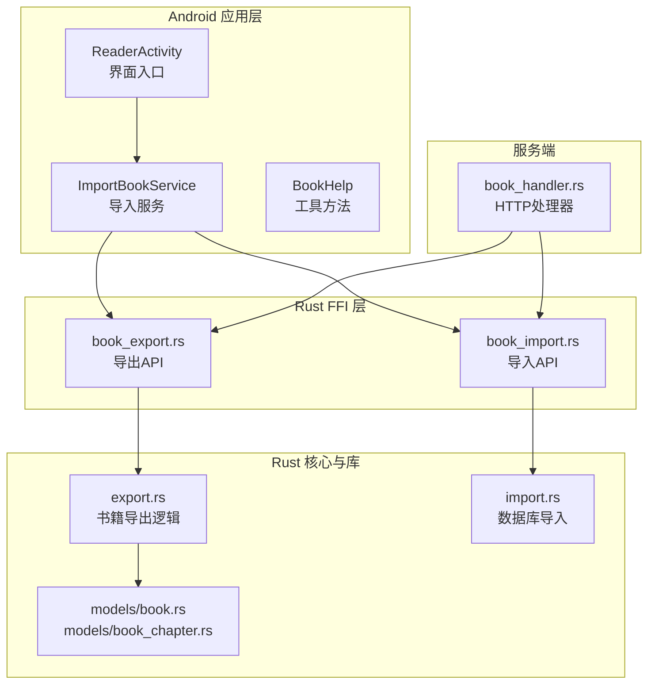
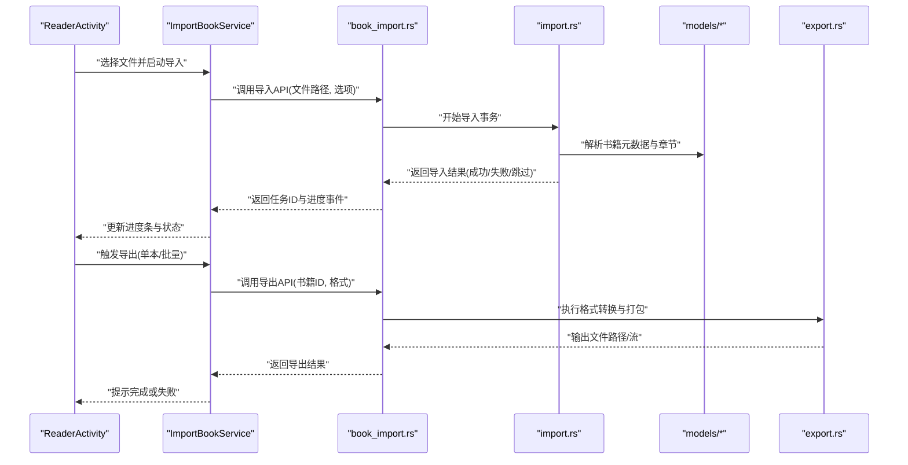
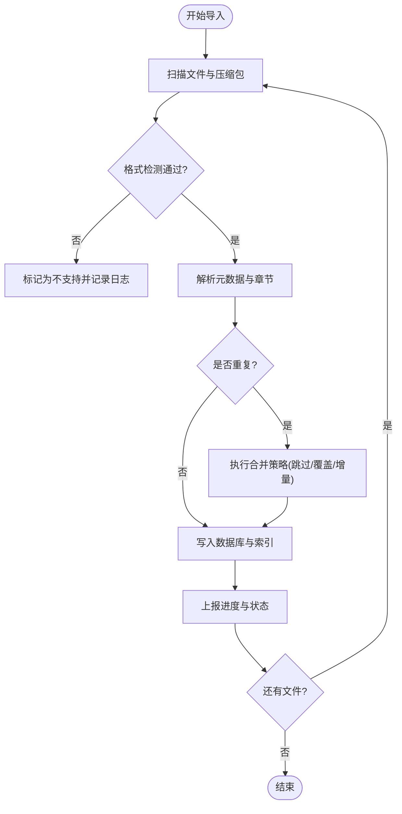
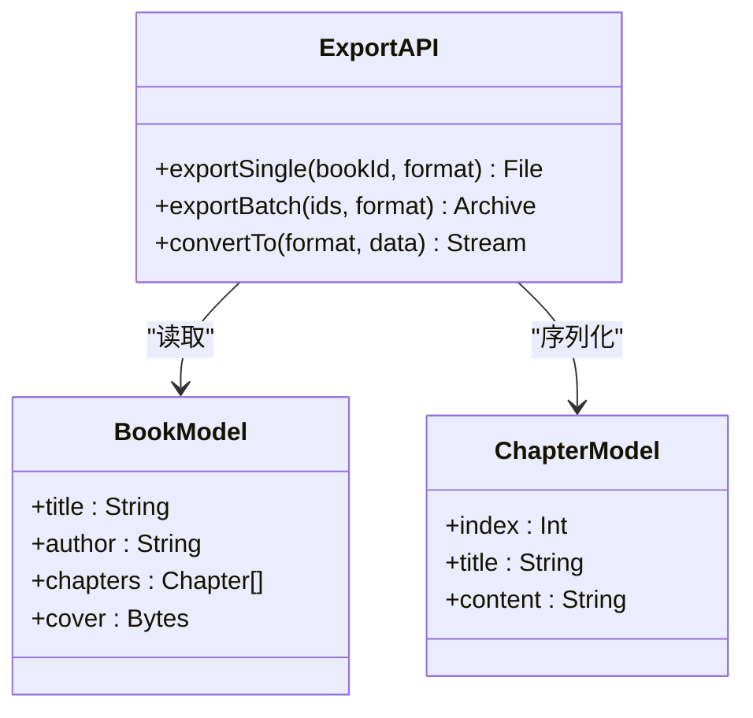
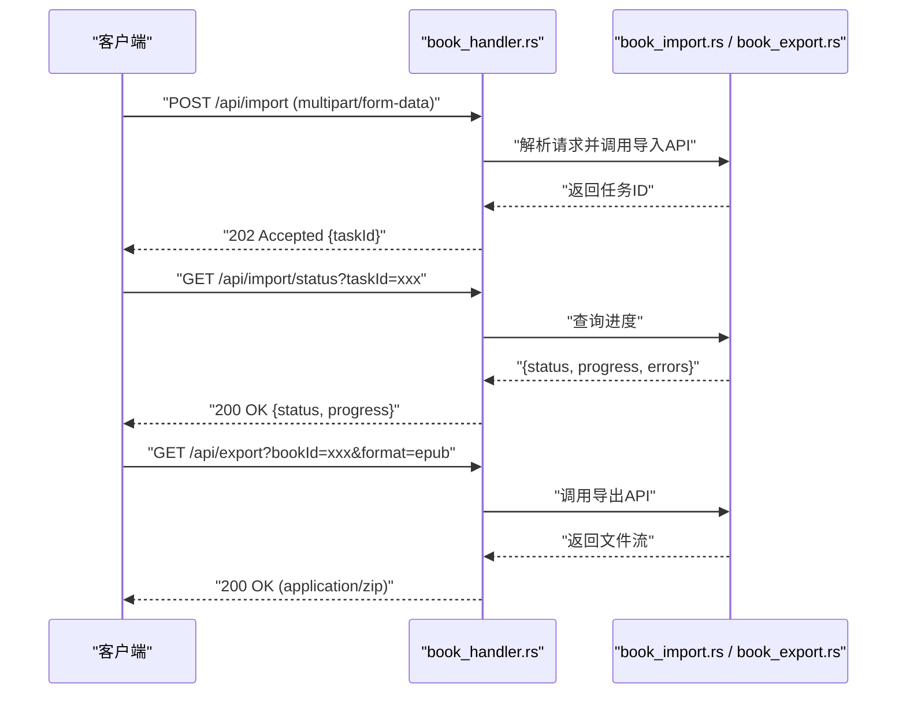
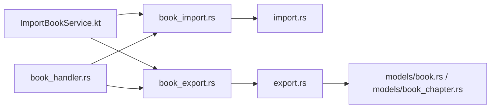

# 导入导出功能

<cite>
**本文引用的文件**   
- [rust/legado-ffi/src/api/book_import.rs](file://rust/legado-ffi/src/api/book_import.rs)
- [rust/legado-ffi/src/api/book_export.rs](file://rust/legado-ffi/src/api/book_export.rs)
- [rust/legado-book/src/export.rs](file://rust/legado-book/src/export.rs)
- [rust/legado-db/src/import.rs](file://rust/legado-db/src/import.rs)
- [rust/legado-core/src/models/book.rs](file://rust/legado-core/src/models/book.rs)
- [rust/legado-core/src/models/book_chapter.rs](file://rust/legado-core/src/models/book_chapter.rs)
- [rust/legado-server/src/handlers/book_handler.rs](file://rust/legado-server/src/handlers/book_handler.rs)
- [app/src/main/java/io/legado/app/help/BookHelp.kt](file://app/src/main/java/io/legado/app/help/BookHelp.kt)
- [app/src/main/java/io/legado/app/service/ImportBookService.kt](file://app/src/main/java/io/legado/app/service/ImportBookService.kt)
- [app/src/main/java/io/legado/app/ui/book/reader/ReaderActivity.kt](file://app/src/main/java/io/legado/app/ui/book/reader/ReaderActivity.kt)
</cite>

## 目录
1. [简介](#简介)
2. [项目结构](#项目结构)
3. [核心组件](#核心组件)
4. [架构总览](#架构总览)
5. [详细组件分析](#详细组件分析)
6. [依赖关系分析](#依赖关系分析)
7. [性能考量](#性能考量)
8. [故障排查指南](#故障排查指南)
9. [结论](#结论)
10. [附录](#附录)

## 简介
本文件面向Legado项目的书籍导入与导出能力，系统性梳理批量导入算法（文件扫描、格式检测、重复处理、进度跟踪）、导出能力（单本导出、批量导出、格式转换、压缩打包）、数据校验与错误恢复机制、增量导入与智能合并策略、命令行接口与API调用示例、大文件处理的性能优化与内存管理策略，以及与第三方阅读软件的兼容性与数据迁移方案。文档以代码级为依据，辅以架构图与时序图帮助理解。

## 项目结构
导入导出相关能力横跨Rust FFI层、数据库层、业务模型层、服务端HTTP处理器以及Android应用层：
- Rust FFI层：对外暴露导入导出API，桥接上层调用与底层实现
- 数据库层：提供导入事务、去重、增量更新等能力
- 业务模型层：定义书籍与章节数据结构，支撑解析与序列化
- 服务端：提供HTTP接口用于远程导入导出
- Android应用层：集成UI与服务，驱动导入任务、展示进度、处理用户交互

**图表来源** 
- [rust/legado-ffi/src/api/book_import.rs](file://rust/legado-ffi/src/api/book_import.rs)
- [rust/legado-ffi/src/api/book_export.rs](file://rust/legado-ffi/src/api/book_export.rs)
- [rust/legado-book/src/export.rs](file://rust/legado-book/src/export.rs)
- [rust/legado-db/src/import.rs](file://rust/legado-db/src/import.rs)
- [rust/legado-core/src/models/book.rs](file://rust/legado-core/src/models/book.rs)
- [rust/legado-core/src/models/book_chapter.rs](file://rust/legado-core/src/models/book_chapter.rs)
- [rust/legado-server/src/handlers/book_handler.rs](file://rust/legado-server/src/handlers/book_handler.rs)
- [app/src/main/java/io/legado/app/ui/book/reader/ReaderActivity.kt](file://app/src/main/java/io/legado/app/ui/book/reader/ReaderActivity.kt)
- [app/src/main/java/io/legado/app/service/ImportBookService.kt](file://app/src/main/java/io/legado/app/service/ImportBookService.kt)
- [app/src/main/java/io/legado/app/help/BookHelp.kt](file://app/src/main/java/io/legado/app/help/BookHelp.kt)

**章节来源**
- [rust/legado-ffi/src/api/book_import.rs](file://rust/legado-ffi/src/api/book_import.rs)
- [rust/legado-ffi/src/api/book_export.rs](file://rust/legado-ffi/src/api/book_export.rs)
- [rust/legado-book/src/export.rs](file://rust/legado-book/src/export.rs)
- [rust/legado-db/src/import.rs](file://rust/legado-db/src/import.rs)
- [rust/legado-core/src/models/book.rs](file://rust/legado-core/src/models/book.rs)
- [rust/legado-core/src/models/book_chapter.rs](file://rust/legado-core/src/models/book_chapter.rs)
- [rust/legado-server/src/handlers/book_handler.rs](file://rust/legado-server/src/handlers/book_handler.rs)
- [app/src/main/java/io/legado/app/ui/book/reader/ReaderActivity.kt](file://app/src/main/java/io/legado/app/ui/book/reader/ReaderActivity.kt)
- [app/src/main/java/io/legado/app/service/ImportBookService.kt](file://app/src/main/java/io/legado/app/service/ImportBookService.kt)
- [app/src/main/java/io/legado/app/help/BookHelp.kt](file://app/src/main/java/io/legado/app/help/BookHelp.kt)

## 核心组件
- 导入API（FFI）：接收文件路径或流、目标存储位置、导入选项（覆盖/跳过/合并），返回任务ID与进度回调
- 导出API（FFI）：按书籍ID或列表导出为指定格式（如EPUB/TXT/PDF），支持批量与压缩打包
- 数据库导入：事务性写入、去重判断、增量更新章节与元数据、保留用户配置
- 书籍导出库：读取书籍内容与元数据，转换为目标格式，生成压缩包
- 服务端处理器：暴露HTTP接口供Web端或外部系统调用导入导出
- Android服务：调度导入任务、上报进度、处理异常与重试

**章节来源**
- [rust/legado-ffi/src/api/book_import.rs](file://rust/legado-ffi/src/api/book_import.rs)
- [rust/legado-ffi/src/api/book_export.rs](file://rust/legado-ffi/src/api/book_export.rs)
- [rust/legado-db/src/import.rs](file://rust/legado-db/src/import.rs)
- [rust/legado-book/src/export.rs](file://rust/legado-book/src/export.rs)
- [rust/legado-server/src/handlers/book_handler.rs](file://rust/legado-server/src/handlers/book_handler.rs)
- [app/src/main/java/io/legado/app/service/ImportBookService.kt](file://app/src/main/java/io/legado/app/service/ImportBookService.kt)

## 架构总览
导入导出采用分层设计：Android层发起请求，通过Rust FFI调用底层能力；数据库层负责持久化与一致性；导出库负责格式转换与打包；服务端提供HTTP入口。

**图表来源** 
- [app/src/main/java/io/legado/app/ui/book/reader/ReaderActivity.kt](file://app/src/main/java/io/legado/app/ui/book/reader/ReaderActivity.kt)
- [app/src/main/java/io/legado/app/service/ImportBookService.kt](file://app/src/main/java/io/legado/app/service/ImportBookService.kt)
- [rust/legado-ffi/src/api/book_import.rs](file://rust/legado-ffi/src/api/book_import.rs)
- [rust/legado-db/src/import.rs](file://rust/legado-db/src/import.rs)
- [rust/legado-core/src/models/book.rs](file://rust/legado-core/src/models/book.rs)
- [rust/legado-core/src/models/book_chapter.rs](file://rust/legado-core/src/models/book_chapter.rs)
- [rust/legado-book/src/export.rs](file://rust/legado-book/src/export.rs)

## 详细组件分析

### 批量导入算法
- 文件扫描：递归遍历目录，识别支持的书籍扩展名与压缩包内文件
- 格式检测：根据文件头与扩展名判定格式（如EPUB/TXT/PDF/UMD等），必要时进行二次校验
- 重复处理：基于书名+作者或内容指纹判断重复，支持跳过、覆盖、合并策略
- 进度跟踪：分阶段上报（扫描、解析、写入、索引），支持中断与恢复

**图表来源** 
- [rust/legado-db/src/import.rs](file://rust/legado-db/src/import.rs)
- [rust/legado-ffi/src/api/book_import.rs](file://rust/legado-ffi/src/api/book_import.rs)

**章节来源**
- [rust/legado-db/src/import.rs](file://rust/legado-db/src/import.rs)
- [rust/legado-ffi/src/api/book_import.rs](file://rust/legado-ffi/src/api/book_import.rs)

### 导出功能实现
- 单本导出：按书籍ID导出为指定格式（EPUB/TXT/PDF等）
- 批量导出：按书籍列表或筛选条件批量导出，支持统一命名规则
- 格式转换：将内部模型转换为目标格式，处理封面、目录、正文与样式
- 压缩打包：将多个导出文件打包为ZIP/TAR等归档格式，便于分发

**图表来源** 
- [rust/legado-ffi/src/api/book_export.rs](file://rust/legado-ffi/src/api/book_export.rs)
- [rust/legado-book/src/export.rs](file://rust/legado-book/src/export.rs)
- [rust/legado-core/src/models/book.rs](file://rust/legado-core/src/models/book.rs)
- [rust/legado-core/src/models/book_chapter.rs](file://rust/legado-core/src/models/book_chapter.rs)

**章节来源**
- [rust/legado-ffi/src/api/book_export.rs](file://rust/legado-ffi/src/api/book_export.rs)
- [rust/legado-book/src/export.rs](file://rust/legado-book/src/export.rs)
- [rust/legado-core/src/models/book.rs](file://rust/legado-core/src/models/book.rs)
- [rust/legado-core/src/models/book_chapter.rs](file://rust/legado-core/src/models/book_chapter.rs)

### 数据校验与错误恢复
- 输入校验：检查文件存在性、大小限制、格式合法性、编码正确性
- 过程校验：解析过程中对章节顺序、内容完整性、链接有效性进行检查
- 错误恢复：支持断点续传、事务回滚、部分导入的清理与补偿
- 日志与告警：记录失败原因、跳过条目、重试次数与最终状态

**章节来源**
- [rust/legado-db/src/import.rs](file://rust/legado-db/src/import.rs)
- [rust/legado-ffi/src/api/book_import.rs](file://rust/legado-ffi/src/api/book_import.rs)

### 增量导入与智能合并
- 增量导入：仅导入新增或更新的书籍与章节，减少重复工作
- 智能合并：对比本地与导入数据的差异，保留用户自定义设置（如书签、笔记、阅读进度）
- 冲突解决：提供优先级策略（本地优先/远端优先/手动确认）

**章节来源**
- [rust/legado-db/src/import.rs](file://rust/legado-db/src/import.rs)
- [rust/legado-core/src/models/book.rs](file://rust/legado-core/src/models/book.rs)

### 命令行接口与API调用示例
- HTTP接口：通过服务端处理器暴露REST API，支持上传文件、查询任务状态、下载导出结果
- 调用方式：POST上传导入文件，GET查询进度，GET下载导出文件
- 参数说明：包含文件格式、覆盖策略、目标路径等

**图表来源** 
- [rust/legado-server/src/handlers/book_handler.rs](file://rust/legado-server/src/handlers/book_handler.rs)
- [rust/legado-ffi/src/api/book_import.rs](file://rust/legado-ffi/src/api/book_import.rs)
- [rust/legado-ffi/src/api/book_export.rs](file://rust/legado-ffi/src/api/book_export.rs)

**章节来源**
- [rust/legado-server/src/handlers/book_handler.rs](file://rust/legado-server/src/handlers/book_handler.rs)
- [rust/legado-ffi/src/api/book_import.rs](file://rust/legado-ffi/src/api/book_import.rs)
- [rust/legado-ffi/src/api/book_export.rs](file://rust/legado-ffi/src/api/book_export.rs)

### 大文件处理与内存管理
- 流式处理：避免一次性加载整个文件到内存，使用分块读取与写入
- 缓冲策略：合理设置缓冲区大小，平衡I/O与CPU开销
- 并发控制：限制解析与写入的并发度，防止资源争用
- 垃圾回收：及时释放临时对象，避免内存泄漏

**章节来源**
- [rust/legado-book/src/export.rs](file://rust/legado-book/src/export.rs)
- [rust/legado-db/src/import.rs](file://rust/legado-db/src/import.rs)

### 与其他阅读软件的兼容性与数据迁移
- 格式兼容：支持常见电子书格式（EPUB/TXT/PDF/UMD等），确保内容完整
- 元数据映射：将不同来源的元数据映射到统一模型，保证标题、作者、目录一致
- 迁移方案：提供从其他阅读软件导出的JSON/CSV导入适配器，自动匹配字段

**章节来源**
- [rust/legado-book/src/export.rs](file://rust/legado-book/src/export.rs)
- [rust/legado-core/src/models/book.rs](file://rust/legado-core/src/models/book.rs)

## 依赖关系分析
导入导出涉及多层依赖：Android服务依赖FFI接口，FFI依赖数据库与模型，服务端依赖FFI暴露HTTP能力。

**图表来源** 
- [app/src/main/java/io/legado/app/service/ImportBookService.kt](file://app/src/main/java/io/legado/app/service/ImportBookService.kt)
- [rust/legado-ffi/src/api/book_import.rs](file://rust/legado-ffi/src/api/book_import.rs)
- [rust/legado-ffi/src/api/book_export.rs](file://rust/legado-ffi/src/api/book_export.rs)
- [rust/legado-db/src/import.rs](file://rust/legado-db/src/import.rs)
- [rust/legado-book/src/export.rs](file://rust/legado-book/src/export.rs)
- [rust/legado-core/src/models/book.rs](file://rust/legado-core/src/models/book.rs)
- [rust/legado-core/src/models/book_chapter.rs](file://rust/legado-core/src/models/book_chapter.rs)
- [rust/legado-server/src/handlers/book_handler.rs](file://rust/legado-server/src/handlers/book_handler.rs)

**章节来源**
- [app/src/main/java/io/legado/app/service/ImportBookService.kt](file://app/src/main/java/io/legado/app/service/ImportBookService.kt)
- [rust/legado-ffi/src/api/book_import.rs](file://rust/legado-ffi/src/api/book_import.rs)
- [rust/legado-ffi/src/api/book_export.rs](file://rust/legado-ffi/src/api/book_export.rs)
- [rust/legado-db/src/import.rs](file://rust/legado-db/src/import.rs)
- [rust/legado-book/src/export.rs](file://rust/legado-book/src/export.rs)
- [rust/legado-core/src/models/book.rs](file://rust/legado-core/src/models/book.rs)
- [rust/legado-core/src/models/book_chapter.rs](file://rust/legado-core/src/models/book_chapter.rs)
- [rust/legado-server/src/handlers/book_handler.rs](file://rust/legado-server/src/handlers/book_handler.rs)

## 性能考量
- I/O优化：使用异步I/O与零拷贝技术减少系统调用开销
- 解析优化：并行解析多文件，但限制线程池大小避免过载
- 存储优化：批量写入数据库，减少事务提交频率
- 内存优化：流式处理大文件，及时释放缓存

[本节为通用指导，不直接分析具体文件]

## 故障排查指南
- 常见问题：文件格式不支持、编码错误、章节缺失、网络超时
- 排查步骤：检查日志、验证文件完整性、重试导入、查看任务状态
- 恢复策略：启用事务回滚、清理部分导入数据、重新扫描未导入文件

**章节来源**
- [rust/legado-db/src/import.rs](file://rust/legado-db/src/import.rs)
- [rust/legado-ffi/src/api/book_import.rs](file://rust/legado-ffi/src/api/book_import.rs)

## 结论
Legado的导入导出功能通过分层架构与Rust FFI实现了高效、稳定、可扩展的数据处理能力。批量导入算法支持文件扫描、格式检测、重复处理与进度跟踪；导出功能涵盖单本与批量导出、格式转换与压缩打包；数据校验与错误恢复机制保障数据一致性；增量导入与智能合并策略提升用户体验；HTTP接口与Android服务提供便捷的调用方式；大文件处理与内存管理策略确保性能与稳定性。

[本节为总结性内容，不直接分析具体文件]

## 附录
- 术语表：FFI（外部函数接口）、增量导入、智能合并、事务回滚
- 参考链接：项目README、开发文档、API规范

[本节为补充信息，不直接分析具体文件]