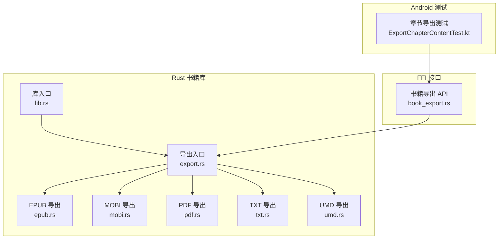
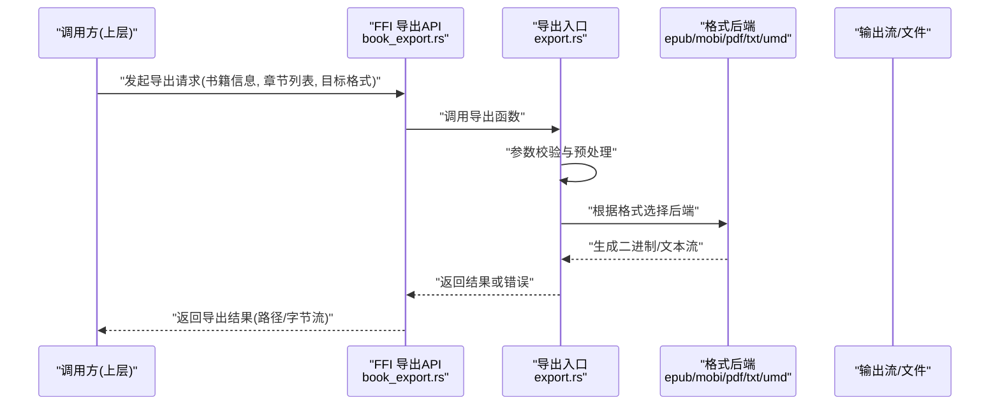
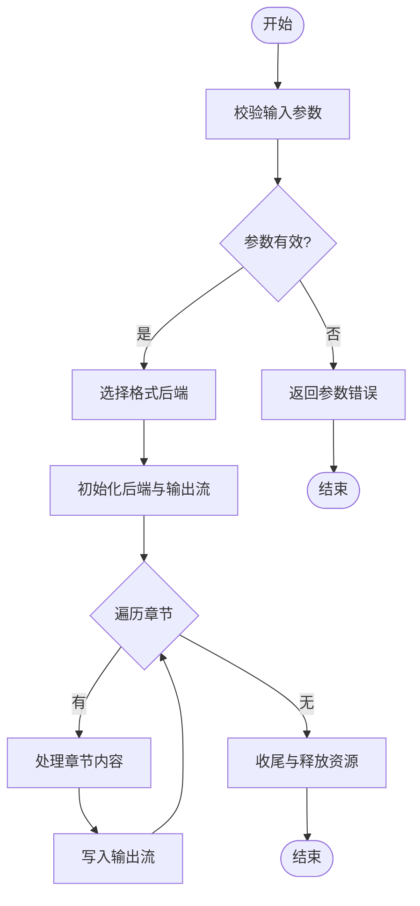
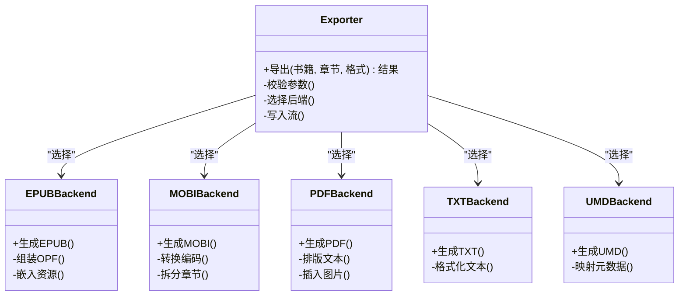
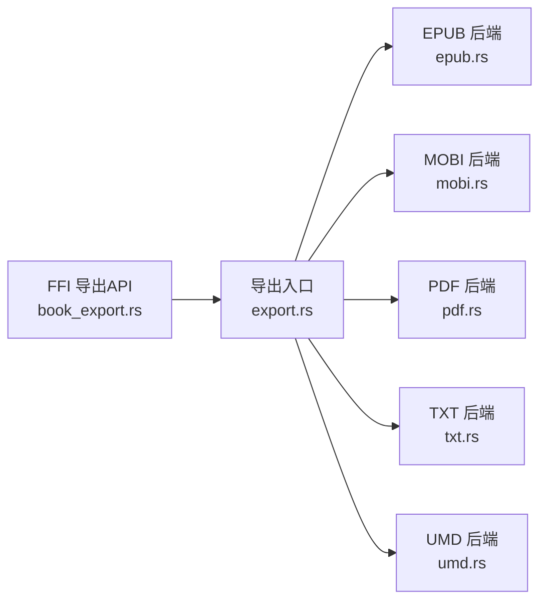

# 导出功能

<cite>
**本文引用的文件**   
- [export.rs](file://rust/legado-book/src/export.rs)
- [epub.rs](file://rust/legado-book/src/epub.rs)
- [mobi.rs](file://rust/legado-book/src/mobi.rs)
- [pdf.rs](file://rust/legado-book/src/pdf.rs)
- [txt.rs](file://rust/legado-book/src/txt.rs)
- [umd.rs](file://rust/legado-book/src/umd.rs)
- [book_export.rs](file://rust/legado-ffi/src/api/book_export.rs)
- [lib.rs](file://rust/legado-book/src/lib.rs)
- [ExportChapterContentTest.kt](file://app/src/test/java/io/legado/app/service/ExportChapterContentTest.kt)
</cite>

## 目录
1. [简介](#简介)
2. [项目结构](#项目结构)
3. [核心组件](#核心组件)
4. [架构总览](#架构总览)
5. [详细组件分析](#详细组件分析)
6. [依赖关系分析](#依赖关系分析)
7. [性能考量](#性能考量)
8. [故障排查指南](#故障排查指南)
9. [结论](#结论)
10. [附录](#附录) 

## 简介
本文件聚焦 Legado 项目的“导出”能力，围绕书籍与章节内容的多格式导出进行系统化说明。内容涵盖系统架构、数据流、处理逻辑、集成点与错误处理，并提供可视化图示与排障建议，帮助开发者与用户理解并高效使用导出功能。

## 项目结构
导出功能主要位于 Rust 层的 book 模块（负责具体格式实现）与 FFI 层（对外暴露 API），并在 Android 测试中覆盖关键流程。整体组织方式如下：
- Rust 书籍库 lego-book：提供多种导出后端（EPUB、MOBI、PDF、TXT、UMD）与统一导出入口。
- FFI 接口 lego-ffi：将 Rust 导出能力暴露给上层调用方。
- Android 测试：对导出章节内容进行端到端验证。

**图表来源** 
- [export.rs:1-200](file://rust/legado-book/src/export.rs#L1-L200)
- [epub.rs:1-200](file://rust/legado-book/src/epub.rs#L1-L200)
- [mobi.rs:1-200](file://rust/legado-book/src/mobi.rs#L1-L200)
- [pdf.rs:1-200](file://rust/legado-book/src/pdf.rs#L1-L200)
- [txt.rs:1-200](file://rust/legado-book/src/txt.rs#L1-L200)
- [umd.rs:1-200](file://rust/legado-book/src/umd.rs#L1-L200)
- [lib.rs:1-200](file://rust/legado-book/src/lib.rs#L1-L200)
- [book_export.rs:1-200](file://rust/legado-ffi/src/api/book_export.rs#L1-L200)
- [ExportChapterContentTest.kt:1-200](file://app/src/test/java/io/legado/app/service/ExportChapterContentTest.kt#L1-L200)

**章节来源**
- [export.rs:1-200](file://rust/legado-book/src/export.rs#L1-L200)
- [lib.rs:1-200](file://rust/legado-book/src/lib.rs#L1-L200)
- [book_export.rs:1-200](file://rust/legado-ffi/src/api/book_export.rs#L1-L200)
- [ExportChapterContentTest.kt:1-200](file://app/src/test/java/io/legado/app/service/ExportChapterContentTest.kt#L1-L200)

## 核心组件
- 统一导出入口（export.rs）
  - 职责：接收导出请求参数（如书籍元数据、章节列表、目标格式等），调度对应后端生成器，返回导出结果或错误。
  - 关键点：格式选择、参数校验、并发控制、资源释放。
- 格式后端（epub.rs、mobi.rs、pdf.rs、txt.rs、umd.rs）
  - 职责：将书籍内容与元数据转换为特定格式的二进制或文本流。
  - 关键点：格式规范适配、章节顺序与分页、图片与样式处理、压缩与体积优化。
- FFI 导出 API（book_export.rs）
  - 职责：为上层语言（Kotlin/Java）提供稳定的导出函数签名，封装错误类型与返回值。
  - 关键点：跨语言边界的数据序列化、异常映射、线程安全。
- 库入口（lib.rs）
  - 职责：聚合导出相关模块，暴露公共接口供外部使用。
  - 关键点：模块可见性、版本兼容、依赖声明。

**章节来源**
- [export.rs:1-200](file://rust/legado-book/src/export.rs#L1-L200)
- [epub.rs:1-200](file://rust/legado-book/src/epub.rs#L1-L200)
- [mobi.rs:1-200](file://rust/legado-book/src/mobi.rs#L1-L200)
- [pdf.rs:1-200](file://rust/legado-book/src/pdf.rs#L1-L200)
- [txt.rs:1-200](file://rust/legado-book/src/txt.rs#L1-L200)
- [umd.rs:1-200](file://rust/legado-book/src/umd.rs#L1-L200)
- [book_export.rs:1-200](file://rust/legado-ffi/src/api/book_export.rs#L1-L200)
- [lib.rs:1-200](file://rust/legado-book/src/lib.rs#L1-L200)

## 架构总览
导出功能的调用链从上层触发，经 FFI 进入 Rust 导出入口，再分发到具体格式后端完成生成，最终返回结果。

**图表来源** 
- [book_export.rs:1-200](file://rust/legado-ffi/src/api/book_export.rs#L1-L200)
- [export.rs:1-200](file://rust/legado-book/src/export.rs#L1-L200)
- [epub.rs:1-200](file://rust/legado-book/src/epub.rs#L1-L200)
- [mobi.rs:1-200](file://rust/legado-book/src/mobi.rs#L1-L200)
- [pdf.rs:1-200](file://rust/legado-book/src/pdf.rs#L1-L200)
- [txt.rs:1-200](file://rust/legado-book/src/txt.rs#L1-L200)
- [umd.rs:1-200](file://rust/legado-book/src/umd.rs#L1-L200)

## 详细组件分析

### 统一导出入口（export.rs）
- 设计要点
  - 以“工厂模式”按目标格式选择后端处理器。
  - 支持批量章节处理与进度回调（若适用）。
  - 统一的错误模型与日志记录。
- 复杂度与性能
  - 时间复杂度与章节数量线性相关；可通过分块写入降低内存峰值。
  - I/O 密集场景建议使用异步流式写入。
- 错误处理
  - 参数非法、后端初始化失败、I/O 异常均应有明确错误码与恢复策略。

**图表来源** 
- [export.rs:1-200](file://rust/legado-book/src/export.rs#L1-L200)

**章节来源**
- [export.rs:1-200](file://rust/legado-book/src/export.rs#L1-L200)

### 格式后端（epub.rs、mobi.rs、pdf.rs、txt.rs、umd.rs）
- EPUB
  - 特点：结构化文档、支持样式与图片、可重排。
  - 关注点：OPF/NCX/HTML 组装、封面与字体嵌入、压缩打包。
- MOBI
  - 特点：Kindle 兼容、旧版格式限制较多。
  - 关注点：文本编码、章节分割、元数据映射。
- PDF
  - 特点：固定布局、适合打印与分享。
  - 关注点：页面尺寸、字体嵌入、图片 DPI、分页算法。
- TXT
  - 特点：最简文本、通用性强。
  - 关注点：编码选择、换行符、标题层级。
- UMD
  - 特点：特定平台格式。
  - 关注点：平台规范、元数据字段、兼容性。

**图表来源** 
- [export.rs:1-200](file://rust/legado-book/src/export.rs#L1-L200)
- [epub.rs:1-200](file://rust/legado-book/src/epub.rs#L1-L200)
- [mobi.rs:1-200](file://rust/legado-book/src/mobi.rs#L1-L200)
- [pdf.rs:1-200](file://rust/legado-book/src/pdf.rs#L1-L200)
- [txt.rs:1-200](file://rust/legado-book/src/txt.rs#L1-L200)
- [umd.rs:1-200](file://rust/legado-book/src/umd.rs#L1-L200)

**章节来源**
- [epub.rs:1-200](file://rust/legado-book/src/epub.rs#L1-L200)
- [mobi.rs:1-200](file://rust/legado-book/src/mobi.rs#L1-L200)
- [pdf.rs:1-200](file://rust/legado-book/src/pdf.rs#L1-L200)
- [txt.rs:1-200](file://rust/legado-book/src/txt.rs#L1-L200)
- [umd.rs:1-200](file://rust/legado-book/src/umd.rs#L1-L200)

### FFI 导出 API（book_export.rs）
- 职责
  - 定义跨语言调用的导出函数签名。
  - 将 Rust 错误映射为上层可识别的错误类型。
  - 管理导出生命周期（创建、执行、销毁）。
- 注意事项
  - 避免在跨边界传递大对象，优先使用流式或分块传输。
  - 确保线程安全与资源清理。

**章节来源**
- [book_export.rs:1-200](file://rust/legado-ffi/src/api/book_export.rs#L1-L200)

### 库入口（lib.rs）
- 职责
  - 聚合导出相关模块，暴露稳定 API。
  - 管理依赖与版本兼容性。
- 注意事项
  - 合理划分模块可见性，减少耦合。

**章节来源**
- [lib.rs:1-200](file://rust/legado-book/src/lib.rs#L1-L200)

### Android 测试（ExportChapterContentTest.kt）
- 作用
  - 验证章节导出流程的正确性与稳定性。
  - 覆盖常见边界条件（空章节、超长章节、特殊字符等）。
- 建议
  - 增加性能回归用例与内存占用监控。

**章节来源**
- [ExportChapterContentTest.kt:1-200](file://app/src/test/java/io/legado/app/service/ExportChapterContentTest.kt#L1-L200)

## 依赖关系分析
导出功能内部依赖清晰，各后端相互独立，便于扩展与维护。FFI 层作为唯一对外接口，降低了上层耦合度。

**图表来源** 
- [book_export.rs:1-200](file://rust/legado-ffi/src/api/book_export.rs#L1-L200)
- [export.rs:1-200](file://rust/legado-book/src/export.rs#L1-L200)
- [epub.rs:1-200](file://rust/legado-book/src/epub.rs#L1-L200)
- [mobi.rs:1-200](file://rust/legado-book/src/mobi.rs#L1-L200)
- [pdf.rs:1-200](file://rust/legado-book/src/pdf.rs#L1-L200)
- [txt.rs:1-200](file://rust/legado-book/src/txt.rs#L1-L200)
- [umd.rs:1-200](file://rust/legado-book/src/umd.rs#L1-L200)

**章节来源**
- [book_export.rs:1-200](file://rust/legado-ffi/src/api/book_export.rs#L1-L200)
- [export.rs:1-200](file://rust/legado-book/src/export.rs#L1-L200)

## 性能考量
- I/O 优化
  - 采用流式写入，避免一次性加载全部内容到内存。
  - 合理设置缓冲区大小，平衡 CPU 与 I/O 开销。
- 并发与并行
  - 对章节处理可考虑分片并行，但需控制并发度以避免资源争用。
- 压缩与体积
  - EPUB/PDF 等格式启用合适的压缩策略，权衡生成时间与文件大小。
- 内存管理
  - 及时释放临时对象与大对象引用，防止内存泄漏。

[本节为通用指导，不直接分析具体文件]

## 故障排查指南
- 常见问题定位
  - 参数校验失败：检查书籍元数据与章节列表完整性。
  - 后端初始化失败：确认目标格式依赖是否可用。
  - I/O 异常：检查输出路径权限与磁盘空间。
- 调试建议
  - 开启详细日志，记录每个阶段的耗时与错误堆栈。
  - 使用最小复现用例逐步缩小问题范围。
- 恢复策略
  - 对可重试错误（网络、临时 I/O）实施指数退避重试。
  - 对不可重试错误（参数非法、格式不支持）快速失败并提示用户。

**章节来源**
- [export.rs:1-200](file://rust/legado-book/src/export.rs#L1-L200)
- [book_export.rs:1-200](file://rust/legado-ffi/src/api/book_export.rs#L1-L200)

## 结论
Legado 的导出功能通过清晰的模块化设计与稳定的 FFI 接口，实现了多格式、可扩展的书籍与章节导出能力。建议在后续迭代中持续优化 I/O 性能、增强错误诊断与完善测试覆盖，以提升用户体验与系统稳定性。

[本节为总结性内容，不直接分析具体文件]

## 附录
- 扩展新格式
  - 新增后端文件（如 newformat.rs），实现统一接口。
  - 在导出入口注册新格式，并在 FFI 层暴露调用方法。
- 最佳实践
  - 保持后端无状态，便于并发与缓存。
  - 统一错误模型与日志规范，便于问题追踪。

[本节为概念性内容，不直接分析具体文件]