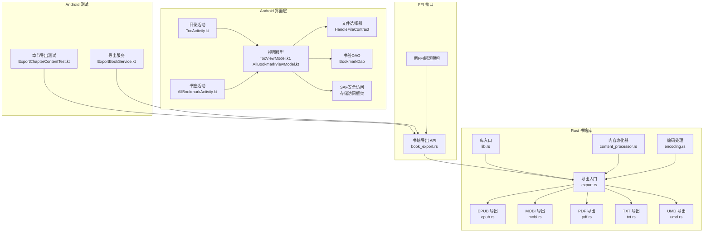
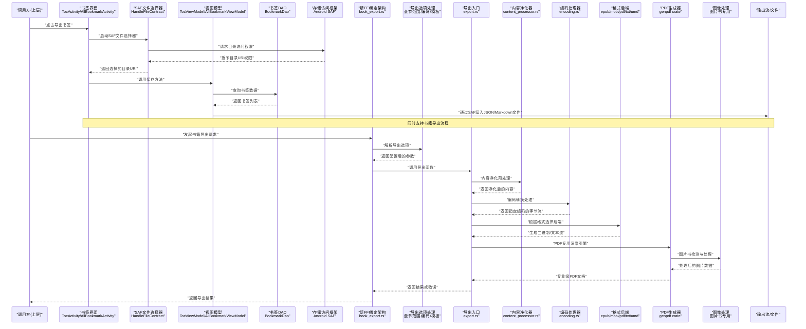
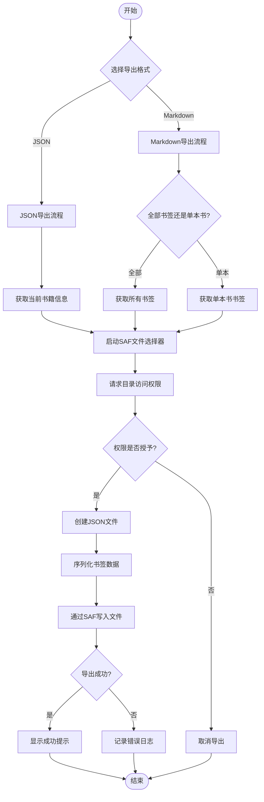
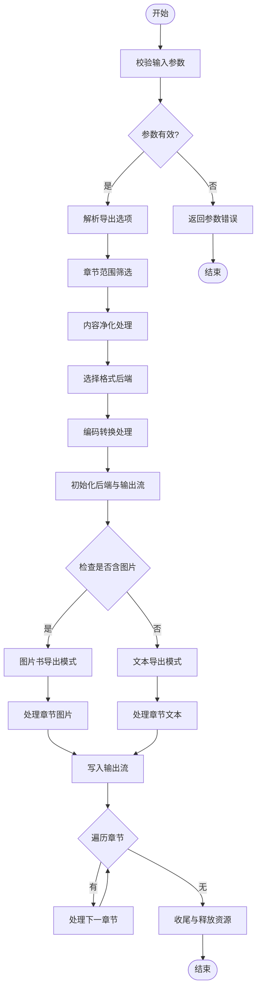
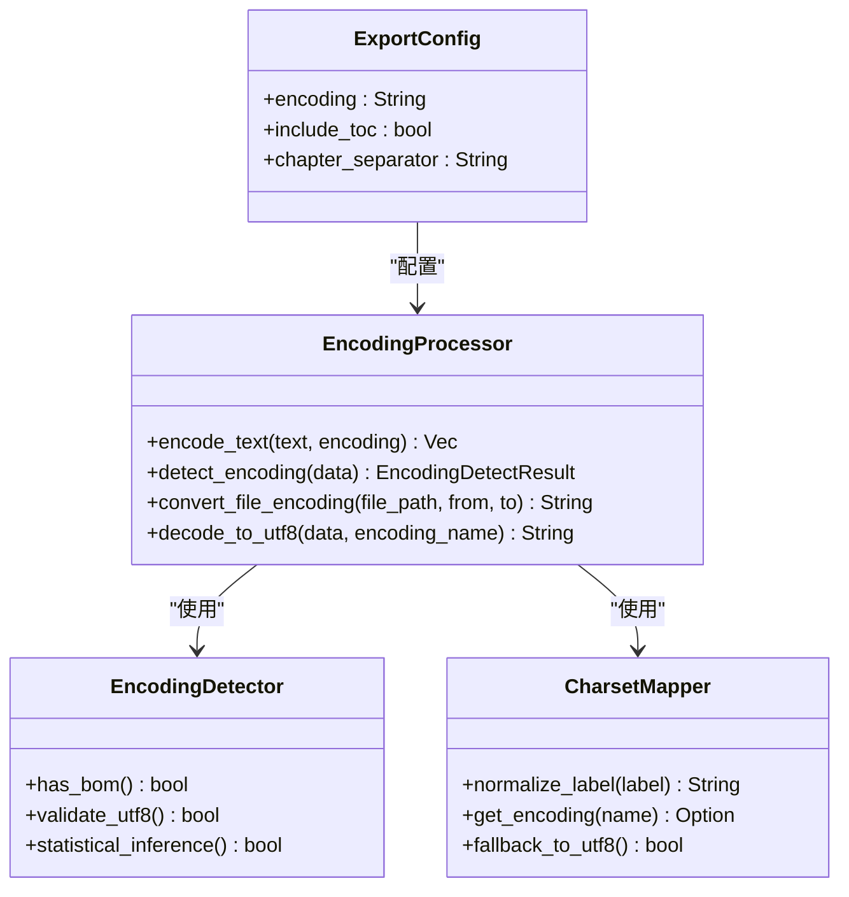
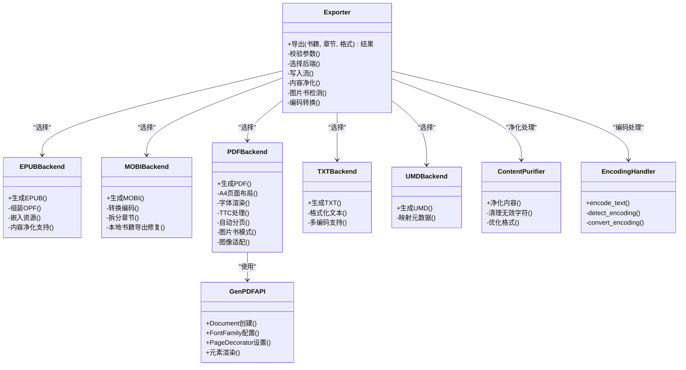
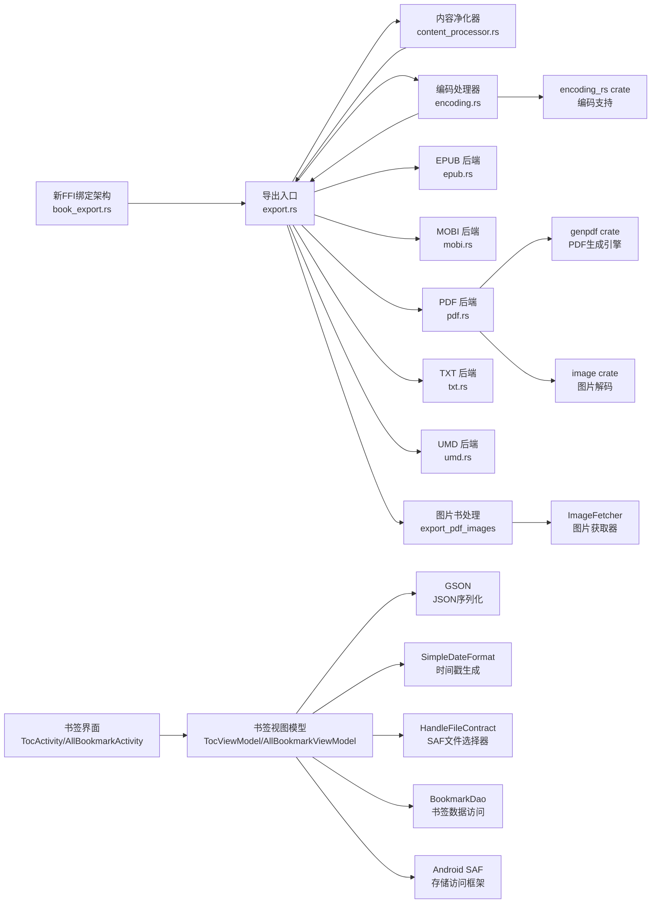

# 导出功能

<cite>
**本文引用的文件**   
- [export.rs](file://rust/legado-book/src/export.rs)
- [encoding.rs](file://rust/legado-book/src/encoding.rs)
- [book_export.rs](file://rust/legado-ffi/src/api/book_export.rs)
- [ExportBookService.kt](file://app/src/main/java/io/legado/app/service/ExportBookService.kt)
- [ExportChapterContentTest.kt](file://app/src/test/java/io/legado/app/service/ExportChapterContentTest.kt)
- [TocActivity.kt](file://app/src/main/java/io/legado/app/ui/book/toc/TocActivity.kt)
- [TocViewModel.kt](file://app/src/main/java/io/legado/app/ui/book/toc/TocViewModel.kt)
- [AllBookmarkActivity.kt](file://app/src/main/java/io/legado/app/ui/book/bookmark/AllBookmarkActivity.kt)
- [AllBookmarkViewModel.kt](file://app/src/main/java/io/legado/app/ui/book/bookmark/AllBookmarkViewModel.kt)
- [HandleFileContract.kt](file://app/src/main/java/io/legado/app/ui/file/HandleFileContract.kt)
</cite>

## 更新摘要
**所做更改**   
- 新增书签导出功能，支持JSON和Markdown两种格式
- 实现智能文件名生成，包含时间戳和书籍信息
- 集成Android SAF（存储访问框架）文件选择器，提供安全的目录授权写入功能
- 增强现有导出功能，添加章节范围选择和自定义文件名模板
- 完善多编码支持，支持UTF-8、GB2312、GBK等多种编码格式
- **最新增强**：通过系统文件选择器实现目录授权写入，确保导出操作的安全性和可靠性

## 目录
1. [简介](#简介)
2. [项目结构](#项目结构)
3. [核心组件](#核心组件)
4. [架构总览](#架构总览)
5. [详细组件分析](#详细组件分析)
6. [依赖关系分析](#依赖关系分析)
7. [性能考量](#性能考量)
8. [故障排查指南](#故障排查指南)
9. [结论](#结论)
10. [附录](#附录)

## 简介
本文件聚焦 Legado 项目的"导出"能力，围绕书籍与章节内容的多格式导出进行系统化说明。经过重大重构后，系统已迁移到新的FFI绑定架构，并新增了内容净化功能和本地书籍导出的修复。**最新的重要更新**：新增了基于 genpdf crate 的纯 Rust PDF 导出功能，提供专业级的 A4 页面布局、多平台字体支持和 TTC 字体集合处理能力。**重大增强**：新增图片书（漫画类）PDF 导出功能，专门针对包含图像列表的章节，将每张图片渲染为独立页面，按原始宽高比适配 A4 内容区并水平居中。**新增功能**：现在支持书签导出（JSON和Markdown格式）、多编码导出（UTF-8、GB2312、GBK等）、章节范围选择和自定义文件名模板功能。**最新增强**：通过Android SAF（存储访问框架）支持，使用系统文件选择器实现安全的目录授权写入，大大提升了导出操作的安全性和用户体验。

## 项目结构
导出功能主要位于 Rust 层的 book 模块（负责具体格式实现）与 FFI 层（对外暴露 API），并在 Android 层提供用户界面和文件操作。整体组织方式如下：
- Rust 书籍库 legado-book：提供多种导出后端（EPUB、MOBI、PDF、TXT、UMD）与统一导出入口。
- FFI 接口 legado-ffi：将 Rust 导出能力暴露给上层调用方，采用新的绑定架构。
- Android 界面层：提供书签导出、文件选择器和用户交互界面。
- Android 测试：对导出章节内容进行端到端验证。

**图表来源** 
- [export.rs:1-200](file://rust/legado-book/src/export.rs#L1-L200)
- [book_export.rs:1-200](file://rust/legado-ffi/src/api/book_export.rs#L1-L200)
- [TocActivity.kt:46-53](file://app/src/main/java/io/legado/app/ui/book/toc/TocActivity.kt#L46-L53)
- [AllBookmarkActivity.kt:36-43](file://app/src/main/java/io/legado/app/ui/book/bookmark/AllBookmarkActivity.kt#L36-L43)
- [HandleFileContract.kt:1-100](file://app/src/main/java/io/legado/app/ui/file/HandleFileContract.kt#L1-L100)

**章节来源**
- [export.rs:1-200](file://rust/legado-book/src/export.rs#L1-L200)
- [book_export.rs:1-200](file://rust/legado-ffi/src/api/book_export.rs#L1-L200)
- [TocActivity.kt:46-53](file://app/src/main/java/io/legado/app/ui/book/toc/TocActivity.kt#L46-L53)
- [AllBookmarkActivity.kt:36-43](file://app/src/main/java/io/legado/app/ui/book/bookmark/AllBookmarkActivity.kt#L36-L43)

## 核心组件
- 统一导出入口（export.rs）
  - 职责：接收导出请求参数（如书籍元数据、章节列表、目标格式等），调度对应后端生成器，返回导出结果或错误。
  - 关键点：格式选择、参数校验、并发控制、资源释放、内容净化集成、**新增**多编码支持。
- 格式后端（epub.rs、mobi.rs、pdf.rs、txt.rs、umd.rs）
  - 职责：将书籍内容与元数据转换为特定格式的二进制或文本流。
  - 关键点：格式规范适配、章节顺序与分页、图片与样式处理、压缩与体积优化、内容净化支持、**新增**编码转换。
- FFI 导出 API（book_export.rs）
  - 职责：为上层语言（Kotlin/Java）提供稳定的导出函数签名，封装错误类型与返回值。
  - 关键点：跨语言边界的数据序列化、异常映射、线程安全、新FFI绑定架构支持、**新增**章节范围筛选和文件名模板。
- 编码处理器（encoding.rs）
  - 职责：提供文本编码检测、转换和处理功能。
  - 关键点：支持多种编码格式、BOM处理、字符集转换、**新增**UTF-8/GBK/GB2312等编码支持。
- **书签导出组件（新增）**
  - 职责：提供书签数据的JSON和Markdown格式导出功能。
  - 关键点：智能文件名生成、文件选择器集成、书签数据序列化、Markdown格式美化、**新增**SAF安全访问支持。
- **Android SAF文件选择器（新增）**
  - 职责：通过系统文件选择器提供安全的目录授权写入功能。
  - 关键点：存储访问框架集成、URI权限管理、目录选择确认、安全文件操作。

**章节来源**
- [export.rs:1-200](file://rust/legado-book/src/export.rs#L1-L200)
- [book_export.rs:1-200](file://rust/legado-ffi/src/api/book_export.rs#L1-L200)
- [encoding.rs:1-100](file://rust/legado-book/src/encoding.rs#L1-L100)
- [TocViewModel.kt:88-128](file://app/src/main/java/io/legado/app/ui/book/toc/TocViewModel.kt#L88-L128)
- [AllBookmarkViewModel.kt:24-65](file://app/src/main/java/io/legado/app/ui/book/bookmark/AllBookmarkViewModel.kt#L24-L65)
- [HandleFileContract.kt:1-100](file://app/src/main/java/io/legado/app/ui/file/HandleFileContract.kt#L1-L100)

## 架构总览
导出功能的调用链从上层触发，经新的FFI绑定架构进入 Rust 导出入口，再分发到具体格式后端完成生成，最终返回结果。新增的内容净化功能在导出前对内容进行清洗和优化。**最新的PDF导出架构**：基于 genpdf crate 的纯 Rust 实现，提供专业级的 PDF 生成功能，包括专门的图片书导出管线。**新增的导出选项架构**：支持编码、章节范围和文件名模板等高级配置。**新增的书签导出架构**：通过Android界面层直接访问数据库，使用SAF文件选择器进行安全的文件输出。

**图表来源** 
- [TocActivity.kt:46-53](file://app/src/main/java/io/legado/app/ui/book/toc/TocActivity.kt#L46-L53)
- [TocViewModel.kt:88-128](file://app/src/main/java/io/legado/app/ui/book/toc/TocViewModel.kt#L88-L128)
- [AllBookmarkActivity.kt:36-43](file://app/src/main/java/io/legado/app/ui/book/bookmark/AllBookmarkActivity.kt#L36-L43)
- [AllBookmarkViewModel.kt:24-65](file://app/src/main/java/io/legado/app/ui/book/bookmark/AllBookmarkViewModel.kt#L24-L65)
- [HandleFileContract.kt:1-100](file://app/src/main/java/io/legado/app/ui/file/HandleFileContract.kt#L1-L100)
- [export.rs:260-320](file://rust/legado-book/src/export.rs#L260-L320)
- [book_export.rs:65-92](file://rust/legado-ffi/src/api/book_export.rs#L65-L92)

## 详细组件分析

### 书签导出功能（新增）
- 设计要点
  - 支持JSON和Markdown两种导出格式。
  - 智能文件名生成，包含时间戳和书籍信息。
  - 集成Android SAF文件选择器，提供安全的目录授权写入。
  - 支持单本书籍书签导出和全部书签导出。
  - **最新增强**：通过系统文件选择器确保文件操作的安全性和可靠性。
- 技术实现
  - JSON格式：使用GSON序列化工具直接输出书签数据。
  - Markdown格式：按照层级结构组织书签内容，包含章节标题、原文和摘要。
  - 文件名模板：`bookmark-{时间戳}.json` 或 `bookmark-{书名} {作者}.json`。
  - 文件选择器：使用HandleFileContract进行安全的SAF文件操作。
  - SAF支持：通过存储访问框架获得目录级别的写入权限。
- 用户体验
  - 导出成功后显示Toast提示。
  - 导出失败时记录详细错误日志。
  - 支持异步导出，避免阻塞主线程。
  - **新增**：系统文件选择器提供直观的文件路径选择体验。

**图表来源** 
- [TocViewModel.kt:88-104](file://app/src/main/java/io/legado/app/ui/book/toc/TocViewModel.kt#L88-L104)
- [TocViewModel.kt:106-128](file://app/src/main/java/io/legado/app/ui/book/toc/TocViewModel.kt#L106-L128)
- [AllBookmarkViewModel.kt:24-37](file://app/src/main/java/io/legado/app/ui/book/bookmark/AllBookmarkViewModel.kt#L24-L37)
- [AllBookmarkViewModel.kt:40-65](file://app/src/main/java/io/legado/app/ui/book/bookmark/AllBookmarkViewModel.kt#L40-L65)
- [HandleFileContract.kt:1-100](file://app/src/main/java/io/legado/app/ui/file/HandleFileContract.kt#L1-L100)

**章节来源**
- [TocViewModel.kt:88-128](file://app/src/main/java/io/legado/app/ui/book/toc/TocViewModel.kt#L88-L128)
- [AllBookmarkViewModel.kt:24-65](file://app/src/main/java/io/legado/app/ui/book/bookmark/AllBookmarkViewModel.kt#L24-L65)
- [TocActivity.kt:182-188](file://app/src/main/java/io/legado/app/ui/book/toc/TocActivity.kt#L182-L188)
- [AllBookmarkActivity.kt:69-75](file://app/src/main/java/io/legado/app/ui/book/bookmark/AllBookmarkActivity.kt#L69-L75)
- [HandleFileContract.kt:1-100](file://app/src/main/java/io/legado/app/ui/file/HandleFileContract.kt#L1-L100)

### 统一导出入口（export.rs）
- 设计要点
  - 以"工厂模式"按目标格式选择后端处理器。
  - 支持批量章节处理与进度回调（若适用）。
  - 统一的错误模型与日志记录。
  - **新增**：内容净化集成，在导出前对内容进行清洗。
  - **重大更新**：新增图片书检测逻辑，自动切换到图片导出管线。
  - **新增**：多编码支持，通过 `encode_text` 函数实现 UTF-8/GBK/GB2312 等编码转换。
- 复杂度与性能
  - 时间复杂度与章节数量线性相关；可通过分块写入降低内存峰值。
  - I/O 密集场景建议使用异步流式写入。
  - **新增**：图片书导出时按页处理，避免一次性加载所有图片。
  - **新增**：编码转换时的流式处理，避免大文本的内存占用。
- 错误处理
  - 参数非法、后端初始化失败、I/O 异常均应有明确错误码与恢复策略。
  - **新增**：图片获取失败、解码失败、网络下载失败的详细错误信息。
  - **新增**：编码转换失败的错误处理和回退机制。

**图表来源** 
- [export.rs:295-310](file://rust/legado-book/src/export.rs#L295-L310)
- [book_export.rs:151-162](file://rust/legado-ffi/src/api/book_export.rs#L151-L162)

**章节来源**
- [export.rs:260-320](file://rust/legado-book/src/export.rs#L260-L320)
- [book_export.rs:151-162](file://rust/legado-ffi/src/api/book_export.rs#L151-L162)

### Android SAF文件选择器（新增）
- 设计要点
  - 基于Android存储访问框架（SAF）实现安全的文件操作。
  - 通过系统文件选择器让用户选择目标目录。
  - 获得目录级别的持久化访问权限。
  - 支持读写操作，确保文件导出的安全性。
- 技术实现
  - 使用registerForActivityResult注册文件选择器回调。
  - 通过Intent.ACTION_OPEN_DOCUMENT_TREE启动系统文件选择器。
  - 处理URI权限，确保应用可以访问选择的目录。
  - 集成到书签导出流程中，提供一致的用户体验。
- 用户体验
  - 直观的目录浏览界面，用户可以轻松选择目标位置。
  - 权限请求透明化，用户清楚了解应用的访问需求。
  - 错误处理友好，权限拒绝时提供清晰的提示信息。

**章节来源**
- [TocActivity.kt:46-53](file://app/src/main/java/io/legado/app/ui/book/toc/TocActivity.kt#L46-L53)
- [AllBookmarkActivity.kt:36-43](file://app/src/main/java/io/legado/app/ui/book/bookmark/AllBookmarkActivity.kt#L36-L43)
- [HandleFileContract.kt:1-100](file://app/src/main/java/io/legado/app/ui/file/HandleFileContract.kt#L1-L100)

### 多编码支持功能
- 设计要点
  - 支持 UTF-8、GB2312、GBK、GB18030、UTF-16、ASCII 等多种编码格式。
  - 通过 `encode_text` 函数实现高效的文本编码转换。
  - 支持 BOM 检测和自动处理。
  - 不可映射字符以 `?` 替代，对齐 Kotlin 编码器 REPLACE 语义。
- 技术实现
  - 使用 `encoding_rs` crate 提供底层编码支持。
  - 流式编码处理，避免大文本的内存占用。
  - 智能编码检测，优先使用 UTF-8，回退到其他编码。
  - 支持标签归一化，如 GB2312 自动归入 GBK。
- 错误处理
  - 未知编码自动回退到 UTF-8。
  - 编码转换失败时保留原始字节。
  - 详细的错误信息和调试支持。

**图表来源** 
- [encoding.rs:557-597](file://rust/legado-book/src/encoding.rs#L557-L597)
- [encoding.rs:39-140](file://rust/legado-book/src/encoding.rs#L39-L140)

**章节来源**
- [encoding.rs:557-597](file://rust/legado-book/src/encoding.rs#L557-L597)
- [encoding.rs:39-140](file://rust/legado-book/src/encoding.rs#L39-L140)

### 章节范围选择功能
- 设计要点
  - 支持 startChapter 和 endChapter 参数，实现闭区间章节筛选。
  - 默认值 -1 表示不限范围，导出全部章节。
  - 与 Android 原版行为保持一致。
- 技术实现
  - 在 FFI 层实现章节过滤逻辑。
  - 使用闭区间比较算法，确保起始和结束章节都包含在内。
  - 保持原有章节索引不变，仅过滤输出内容。
- 使用示例
  - 仅导出第2章：`{"startChapter":1,"endChapter":1}`
  - 导出第1-5章：`{"startChapter":0,"endChapter":4}`
  - 导出全部章节：`{"startChapter":-1,"endChapter":-1}`

**章节来源**
- [book_export.rs:151-162](file://rust/legado-ffi/src/api/book_export.rs#L151-L162)

### 自定义文件名模板功能
- 设计要点
  - 支持 `{name}` 和 `{author}` 占位符替换。
  - 默认模板为 `{书名}.{扩展名}`，保持向后兼容。
  - 支持自定义模板字符串，提供更灵活的文件命名。
- 技术实现
  - 在 FFI 层实现模板解析和替换逻辑。
  - 自动添加文件扩展名，确保文件格式正确。
  - 支持空作者名的优雅处理。
- 使用示例
  - 默认模板：`"导出测试书.txt"`
  - 自定义模板：`"{name} 作者：{author}.txt"` → `"导出测试书 作者：张三.txt"`

**章节来源**
- [book_export.rs:244-253](file://rust/legado-ffi/src/api/book_export.rs#L244-L253)

### 格式后端（epub.rs、mobi.rs、pdf.rs、txt.rs、umd.rs）
- EPUB
  - 特点：结构化文档、支持样式与图片、可重排。
  - 关注点：OPF/NCX/HTML 组装、封面与字体嵌入、压缩打包、内容净化支持。
- MOBI
  - 特点：Kindle 兼容、旧版格式限制较多。
  - 关注点：文本编码、章节分割、元数据映射、本地书籍导出修复。
- **PDF（全新实现）**
  - 特点：基于 genpdf crate 的纯 Rust 实现，专业级 PDF 生成。
  - 关注点：A4 页面布局、中文 CJK 字体支持、TTC 字体集合处理、自动分页、段落缩进。
  - **重大更新**：新增图片书导出模式，支持图像列表章节的逐页渲染。
- TXT
  - 特点：最简文本、通用性强。
  - 关注点：编码选择、换行符、标题层级、**新增**多编码支持。
- UMD
  - 特点：特定平台格式。
  - 关注点：平台规范、元数据字段、兼容性。

**图表来源** 
- [export.rs:1-200](file://rust/legado-book/src/export.rs#L1-L200)
- [encoding.rs:557-597](file://rust/legado-book/src/encoding.rs#L557-L597)

**章节来源**
- [export.rs:1-200](file://rust/legado-book/src/export.rs#L1-L200)
- [encoding.rs:557-597](file://rust/legado-book/src/encoding.rs#L557-L597)

### FFI 导出 API（book_export.rs）
- 职责
  - 定义跨语言调用的导出函数签名。
  - 将 Rust 错误映射为上层可识别的错误类型。
  - 管理导出生命周期（创建、执行、销毁）。
  - **新增**：支持新的FFI绑定架构，提供更稳定的跨语言接口。
  - **重大更新**：集成图片书导出功能，自动提取章节中的图片源并绝对化URL。
  - **新增**：导出选项处理，包括编码、章节范围和文件名模板。
- 注意事项
  - 避免在跨边界传递大对象，优先使用流式或分块传输。
  - 确保线程安全与资源清理。
  - **新增**：内容净化参数的传递和处理。
  - **新增**：图片书导出时的网络图片获取器注入。
  - **新增**：导出选项的JSON解析和验证。

**章节来源**
- [book_export.rs:65-92](file://rust/legado-ffi/src/api/book_export.rs#L65-L92)
- [book_export.rs:151-162](file://rust/legado-ffi/src/api/book_export.rs#L151-L162)
- [book_export.rs:244-253](file://rust/legado-ffi/src/api/book_export.rs#L244-L253)

### Android 测试（ExportChapterContentTest.kt）
- 作用
  - 验证章节导出流程的正确性与稳定性。
  - 覆盖常见边界条件（空章节、超长章节、特殊字符等）。
  - **新增**：验证内容净化功能和FFI绑定架构的稳定性。
  - **新增**：测试多编码导出、章节范围筛选和文件名模板功能。
- 建议
  - 增加性能回归用例与内存占用监控。
  - 扩展本地书籍导出的测试用例。
  - **新增**：图片书PDF导出的专项测试用例。
  - **新增**：编码转换的边界情况测试。

**章节来源**
- [ExportChapterContentTest.kt:1-34](file://app/src/test/java/io/legado/app/service/ExportChapterContentTest.kt#L1-L34)

## 依赖关系分析
导出功能内部依赖清晰，各后端相互独立，便于扩展与维护。FFI 层作为唯一对外接口，降低了上层耦合度。新的FFI绑定架构提供了更稳定的跨语言通信机制。**新增的PDF导出依赖**：genpdf crate 提供纯 Rust 的 PDF 生成能力，image crate 提供图片解码支持。**新增的编码依赖**：encoding_rs crate 提供多编码支持。**新增的书签导出依赖**：GSON用于JSON序列化，SimpleDateFormat用于时间戳生成。**新增的SAF依赖**：Android存储访问框架提供安全的文件操作能力。

**图表来源** 
- [export.rs:1-200](file://rust/legado-book/src/export.rs#L1-L200)
- [book_export.rs:65-92](file://rust/legado-ffi/src/api/book_export.rs#L65-L92)
- [encoding.rs:15-16](file://rust/legado-book/src/encoding.rs#L15-L16)
- [TocViewModel.kt:88-128](file://app/src/main/java/io/legado/app/ui/book/toc/TocViewModel.kt#L88-L128)
- [AllBookmarkViewModel.kt:24-65](file://app/src/main/java/io/legado/app/ui/book/bookmark/AllBookmarkViewModel.kt#L24-L65)
- [HandleFileContract.kt:1-100](file://app/src/main/java/io/legado/app/ui/file/HandleFileContract.kt#L1-L100)

**章节来源**
- [export.rs:1-200](file://rust/legado-book/src/export.rs#L1-L200)
- [encoding.rs:15-16](file://rust/legado-book/src/encoding.rs#L15-L16)
- [TocViewModel.kt:88-128](file://app/src/main/java/io/legado/app/ui/book/toc/TocViewModel.kt#L88-L128)
- [AllBookmarkViewModel.kt:24-65](file://app/src/main/java/io/legado/app/ui/book/bookmark/AllBookmarkViewModel.kt#L24-L65)

## 性能考量
- I/O 优化
  - 采用流式写入，避免一次性加载全部内容到内存。
  - 合理设置缓冲区大小，平衡 CPU 与 I/O 开销。
  - **新增**：内容净化过程的性能优化，避免不必要的重复处理。
  - **新增**：图片书导出时按需加载图片，避免内存溢出。
  - **新增**：编码转换时的流式处理，减少内存占用。
  - **新增**：书签导出时使用流式写入，避免大数据量内存占用。
  - **新增**：SAF文件操作优化，减少权限检查开销。
- 并发与并行
  - 对章节处理可考虑分片并行，但需控制并发度以避免资源争用。
  - **新增**：FFI绑定架构的并发安全性保证。
  - **新增**：网络图片下载的异步处理。
  - **新增**：书签导出使用协程进行异步处理。
- 压缩与体积
  - EPUB/PDF 等格式启用合适的压缩策略，权衡生成时间与文件大小。
  - **新增**：图片书导出时保持原始图片质量，避免额外压缩。
  - **新增**：JSON导出时保持数据完整性，Markdown格式注重可读性。
- 内存管理
  - 及时释放临时对象与大对象引用，防止内存泄漏。
  - **新增**：内容净化过程中的内存优化。
  - **新增**：图片处理后及时释放内存，避免累积。
  - **新增**：编码转换时的内存池复用。
  - **新增**：书签数据查询时使用流式处理，避免一次性加载所有数据。
  - **新增**：SAF URI权限管理，避免内存泄漏。
- **PDF导出性能优化**
  - 字体缓存机制，避免重复加载相同字体文件。
  - 增量渲染，支持大文档的分页处理。
  - 内存高效的 TTC 字体提取算法。
  - **新增**：图片书导出时的渐进式渲染，避免一次性处理大量图片。

## 故障排查指南
- 常见问题定位
  - 参数校验失败：检查书籍元数据与章节列表完整性。
  - 后端初始化失败：确认目标格式依赖是否可用。
  - I/O 异常：检查输出路径权限与磁盘空间。
  - **新增**：内容净化失败：检查净化规则配置和内容格式兼容性。
  - **新增**：FFI绑定问题：检查跨语言接口的数据类型匹配。
  - **新增**：PDF字体问题：检查系统字体安装和 TTC 文件完整性。
  - **新增**：图片书导出问题：检查图片路径有效性、网络可达性和图片格式支持。
  - **新增**：编码转换问题：检查目标编码是否支持、字符集兼容性。
  - **新增**：章节范围问题：检查章节索引是否有效、范围是否合理。
  - **新增**：文件名模板问题：检查模板语法、占位符是否正确。
  - **新增**：书签导出问题：检查数据库连接、文件权限和存储空间。
  - **新增**：SAF权限问题：检查目录访问权限是否被授予、URI是否有效。
- 调试建议
  - 开启详细日志，记录每个阶段的耗时与错误堆栈。
  - 使用最小复现用例逐步缩小问题范围。
  - **新增**：针对内容净化和FFI绑定的专项调试工具。
  - **新增**：PDF字体检测工具和字体回退机制。
  - **新增**：图片书导出的图片获取和渲染调试工具。
  - **新增**：编码转换的调试输出和字符映射检查。
  - **新增**：章节范围筛选的调试日志。
  - **新增**：文件名模板解析的调试信息。
  - **新增**：书签导出的数据库查询和文件写入调试。
  - **新增**：SAF权限请求和文件操作的调试日志。
- 恢复策略
  - 对可重试错误（网络、临时 I/O）实施指数退避重试。
  - 对不可重试错误（参数非法、格式不支持）快速失败并提示用户。
  - **新增**：内容净化的降级处理和回滚机制。
  - **新增**：PDF字体的多级回退策略（系统字体 → 内置字体 → 错误提示）。
  - **新增**：图片书导出的错误隔离，单张图片失败不影响其他图片。
  - **新增**：编码转换的自动回退机制（UTF-8 → 其他编码）。
  - **新增**：章节范围无效的自动修正（调整到有效范围）。
  - **新增**：文件名模板错误的默认处理（使用默认模板）。
  - **新增**：书签导出失败时的数据备份和恢复机制。
  - **新增**：SAF权限被拒绝时的用户引导和重新请求机制。

**章节来源**
- [export.rs:884-887](file://rust/legado-book/src/export.rs#L884-L887)
- [export.rs:487-504](file://rust/legado-book/src/export.rs#L487-L504)
- [encoding.rs:154-200](file://rust/legado-book/src/encoding.rs#L154-L200)
- [TocViewModel.kt:99-103](file://app/src/main/java/io/legado/app/ui/book/toc/TocViewModel.kt#L99-L103)
- [TocViewModel.kt:123-127](file://app/src/main/java/io/legado/app/ui/book/toc/TocViewModel.kt#L123-L127)
- [AllBookmarkViewModel.kt:32-36](file://app/src/main/java/io/legado/app/ui/book/bookmark/AllBookmarkViewModel.kt#L32-L36)
- [AllBookmarkViewModel.kt:60-64](file://app/src/main/java/io/legado/app/ui/book/bookmark/AllBookmarkViewModel.kt#L60-L64)

## 结论
Legado 的导出功能通过重大重构，实现了基于新FFI绑定架构的多格式、可扩展的书籍与章节导出能力。**最新的重要进展**：新增的基于 genpdf crate 的纯 Rust PDF 导出功能，提供了专业级的 A4 页面布局、多平台字体支持和 TTC 字体集合处理能力，显著提升了系统的稳定性和用户体验。**重大增强**：新增的图片书（漫画类）PDF 导出功能，专门处理包含图像列表的章节，将每张图片渲染为独立页面，按原始宽高比适配 A4 内容区并水平居中，为漫画阅读体验提供了完整的导出解决方案。**新增功能**：现在支持书签导出（JSON和Markdown格式）、多编码导出（UTF-8、GB2312、GBK等）、章节范围选择和自定义文件名模板功能，大大增强了导出功能的灵活性和实用性。**最新增强**：通过Android SAF（存储访问框架）支持，使用系统文件选择器实现安全的目录授权写入，确保了文件操作的安全性和可靠性，为用户提供了更加安全和便捷的文件导出体验。建议在后续迭代中持续优化 I/O 性能、增强错误诊断与完善测试覆盖，特别是针对内容净化、FFI绑定、PDF导出、编码转换、图片书处理、书签导出和SAF文件操作功能的专项优化。

## 附录
- 扩展新格式
  - 新增后端文件（如 newformat.rs），实现统一接口。
  - 在导出入口注册新格式，并在 FFI 层暴露调用方法。
  - **新增**：确保新格式支持内容净化功能。
  - **新增**：如需图片支持，实现相应的图片处理逻辑。
  - **新增**：为新格式添加编码支持和章节范围筛选。
- 最佳实践
  - 保持后端无状态，便于并发与缓存。
  - 统一错误模型与日志规范，便于问题追踪。
  - **新增**：充分利用新的FFI绑定架构优势，确保跨语言调用的稳定性。
  - **新增**：合理使用内容净化功能，平衡处理效果与性能。
  - **新增**：PDF导出时优先使用系统字体，提供明确的字体缺失错误信息。
  - **新增**：图片书导出时提供详细的错误信息和调试支持。
  - **新增**：编码转换时使用合理的默认值和回退机制。
  - **新增**：章节范围筛选时进行边界检查和错误处理。
  - **新增**：文件名模板使用时进行语法验证和错误提示。
  - **新增**：书签导出时提供友好的用户界面和错误反馈。
  - **新增**：SAF文件操作时正确处理权限请求和用户交互。
- **PDF导出配置指南**
  - 环境变量 LEGADO_PDF_FONT 指定自定义字体路径。
  - 支持 Windows、Linux、macOS、Android 多平台字体检测。
  - 自动处理 TTC 字体集合，提取单个字体面。
  - 提供详细的字体缺失错误信息和解决方案。
  - **新增**：图片书导出时自动检测章节中的图片列表。
  - **新增**：支持本地文件和网络图片，通过 ImageFetcher 注入网络获取逻辑。
- **图片书导出配置指南**
  - 章节必须包含 images 字段，值为图片URL或本地路径列表。
  - 网络图片需要注入 ImageFetcher 才能正常下载。
  - 支持 JPEG 和 PNG 格式，自动处理透明通道。
  - 图片按原始宽高比适配 A4 内容区，不放大显示。
  - 每张图片渲染为独立页面，自动水平居中。
- **多编码导出配置指南**
  - 支持的编码格式：UTF-8、GB2312、GBK、GB18030、UTF-16、UTF-16LE、ASCII。
  - 默认编码为 UTF-8，可通过 `encoding` 参数指定其他编码。
  - 编码转换时自动处理 BOM 和不可映射字符。
  - 对于不支持的编码，自动回退到 UTF-8。
- **章节范围筛选配置指南**
  - 使用 `startChapter` 和 `endChapter` 参数指定章节范围。
  - 章节索引从 0 开始，-1 表示不限范围。
  - 支持闭区间筛选，起始和结束章节都包含在内。
  - 范围无效时自动调整到有效范围。
- **自定义文件名模板配置指南**
  - 支持 `{name}` 和 `{author}` 占位符。
  - 默认模板为 `{书名}.{扩展名}`。
  - 模板会自动添加文件扩展名。
  - 空作者名会优雅处理，不会导致错误。
- **书签导出配置指南**
  - JSON格式：直接输出书签数据，适合程序读取和备份。
  - Markdown格式：层次化结构，适合人类阅读和分享。
  - 文件名自动生成：包含时间戳或书籍信息，避免文件冲突。
  - 支持单本书籍和全部书签导出，满足不同使用场景。
  - 集成Android文件选择器，提供安全的文件操作环境。
  - **新增**：通过SAF文件选择器确保目录授权写入的安全性。
- **SAF文件操作配置指南**
  - 使用registerForActivityResult注册文件选择器回调。
  - 通过Intent.ACTION_OPEN_DOCUMENT_TREE启动系统文件选择器。
  - 处理URI权限，确保应用可以访问选择的目录。
  - 提供友好的权限请求提示和用户引导。
  - 支持持久化目录权限，避免重复请求。
  - 错误处理友好，权限拒绝时提供清晰的提示信息。

**章节来源**
- [export.rs:792-887](file://rust/legado-book/src/export.rs#L792-L887)
- [export.rs:411-521](file://rust/legado-book/src/export.rs#L411-L521)
- [book_export.rs:65-92](file://rust/legado-ffi/src/api/book_export.rs#L65-L92)
- [book_export.rs:151-162](file://rust/legado-ffi/src/api/book_export.rs#L151-L162)
- [book_export.rs:244-253](file://rust/legado-ffi/src/api/book_export.rs#L244-L253)
- [encoding.rs:557-597](file://rust/legado-book/src/encoding.rs#L557-L597)
- [TocViewModel.kt:88-128](file://app/src/main/java/io/legado/app/ui/book/toc/TocViewModel.kt#L88-L128)
- [AllBookmarkViewModel.kt:24-65](file://app/src/main/java/io/legado/app/ui/book/bookmark/AllBookmarkViewModel.kt#L24-L65)
- [HandleFileContract.kt:1-100](file://app/src/main/java/io/legado/app/ui/file/HandleFileContract.kt#L1-L100)