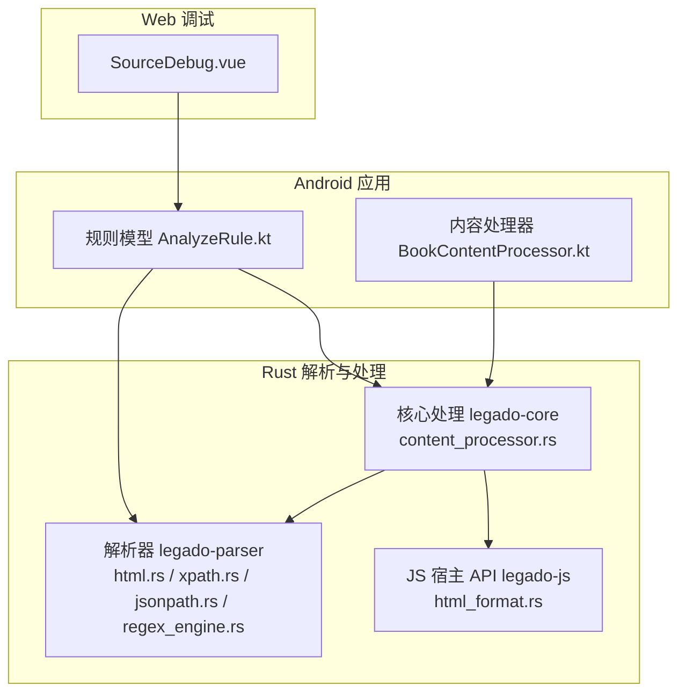
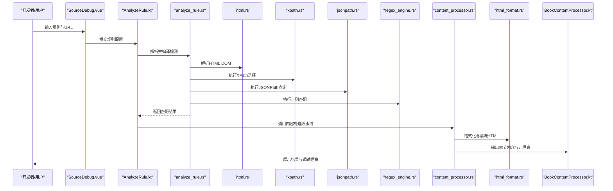
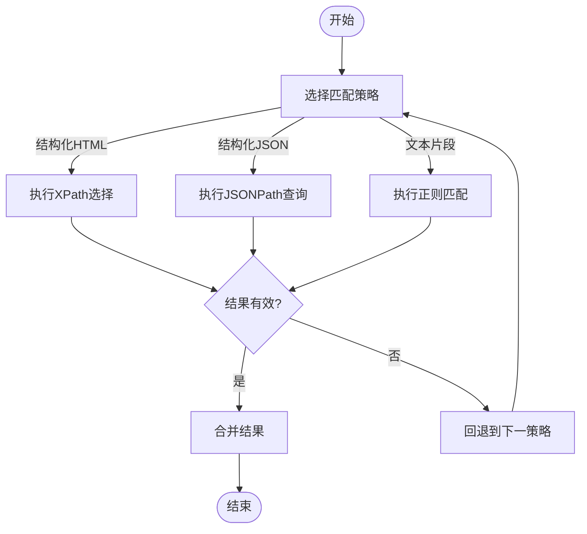
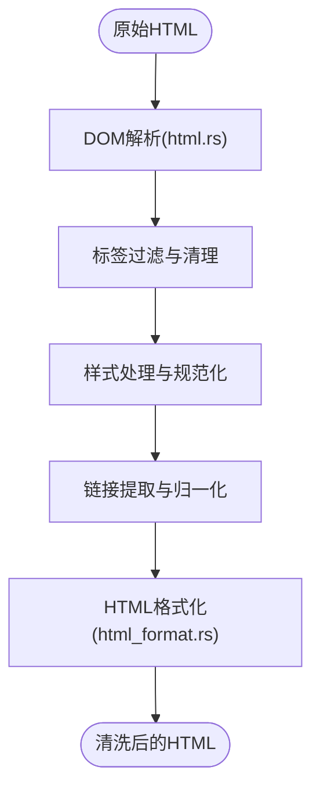
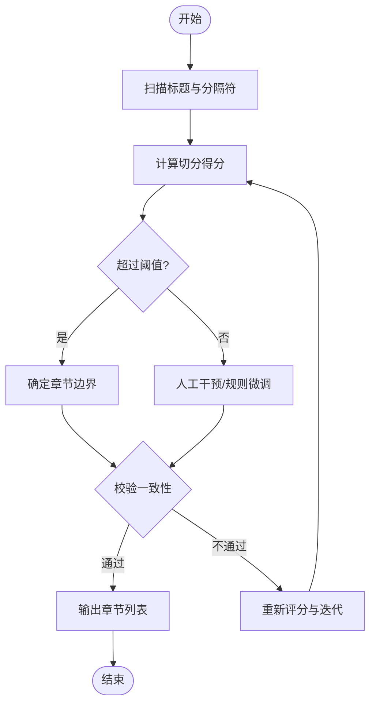
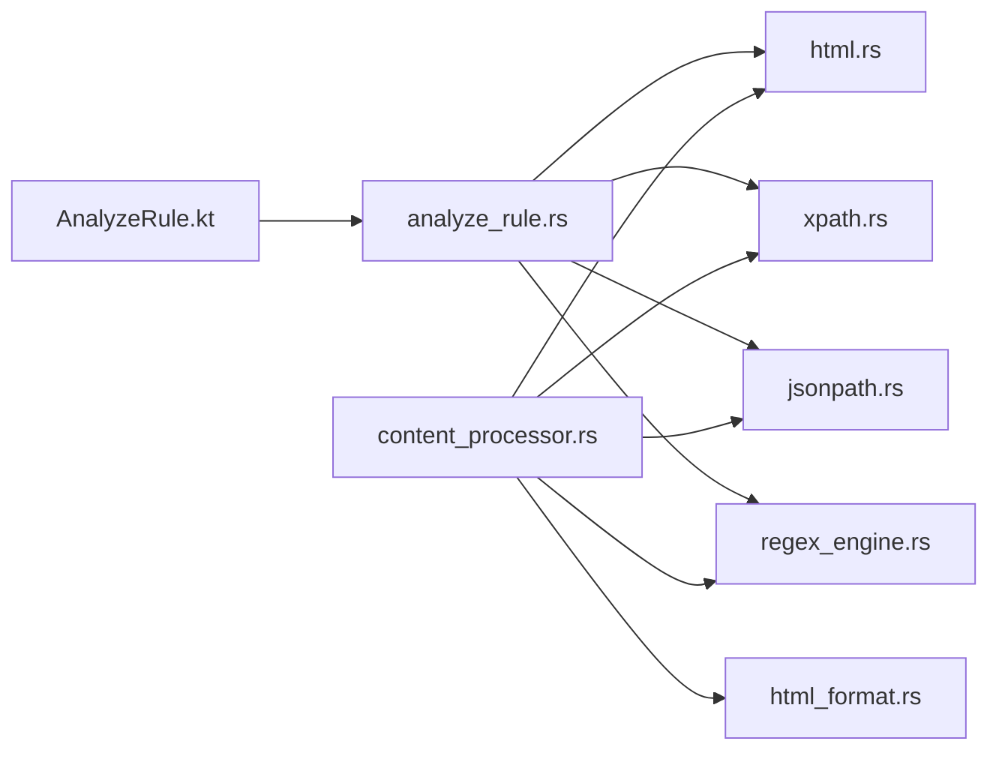

# 章节分割与内容提取

<cite>
**本文引用的文件**   
- [legado-parser/src/analyze_rule.rs](file://rust/legado-parser/src/analyze_rule.rs)
- [legado-parser/src/xpath.rs](file://rust/legado-parser/src/xpath.rs)
- [legado-parser/src/jsonpath.rs](file://rust/legado-parser/src/jsonpath.rs)
- [legado-parser/src/html.rs](file://rust/legado-parser/src/html.rs)
- [legado-parser/src/regex_engine.rs](file://rust/legado-parser/src/regex_engine.rs)
- [legado-core/src/content_processor.rs](file://rust/legado-core/src/content_processor.rs)
- [legado-js/src/host_api/html_format.rs](file://rust/legado-js/src/host_api/html_format.rs)
- [app/src/main/java/io/legado/app/help/book/BookContentProcessor.kt](file://app/src/main/java/io/legado/app/help/book/BookContentProcessor.kt)
- [app/src/main/java/io/legado/app/model/analyzeRule/AnalyzeRule.kt](file://app/src/main/java/io/legado/app/model/analyzeRule/AnalyzeRule.kt)
- [modules/web/src/components/SourceDebug.vue](file://modules/web/src/components/SourceDebug.vue)
</cite>

## 目录
1. [简介](#简介)
2. [项目结构](#项目结构)
3. [核心组件](#核心组件)
4. [架构总览](#架构总览)
5. [详细组件分析](#详细组件分析)
6. [依赖关系分析](#依赖关系分析)
7. [性能考量](#性能考量)
8. [故障排查指南](#故障排查指南)
9. [结论](#结论)
10. [附录](#附录)

## 简介
本章节聚焦于“章节分割与内容提取”的完整技术链路，覆盖以下关键能力：
- 基于正则表达式、XPath、JSONPath 的规则匹配算法与执行流程
- HTML 内容的解析与清洗（标签过滤、样式处理、链接提取）
- 章节边界的自动识别与手动调整机制
- 内容预处理与后处理（文本格式化、编码转换、特殊字符处理）
- 规则调试工具与测试方法
- 复杂网页结构的处理案例与解决方案

该文档面向开发者与维护者，既提供高层架构说明，也深入到具体实现细节，帮助读者快速定位问题并优化规则。

## 项目结构
本项目在 Rust 层提供解析与处理的核心能力，Android/Kotlin 层负责业务编排与交互，Web 端提供规则调试界面。与“章节分割与内容提取”直接相关的模块分布如下：
- Rust 解析器：legado-parser（HTML/XPath/JSONPath/正则引擎）
- Rust 核心处理：legado-core（内容处理器）
- JS 宿主 API：legado-js（HTML 格式化等辅助能力）
- Android 应用：app（规则模型、内容处理器、UI 集成）
- Web 调试：modules/web（源调试面板）

图表来源
- [legado-parser/src/html.rs](file://rust/legado-parser/src/html.rs)
- [legado-parser/src/xpath.rs](file://rust/legado-parser/src/xpath.rs)
- [legado-parser/src/jsonpath.rs](file://rust/legado-parser/src/jsonpath.rs)
- [legado-parser/src/regex_engine.rs](file://rust/legado-parser/src/regex_engine.rs)
- [legado-core/src/content_processor.rs](file://rust/legado-core/src/content_processor.rs)
- [legado-js/src/host_api/html_format.rs](file://rust/legado-js/src/host_api/html_format.rs)
- [app/src/main/java/io/legado/app/model/analyzeRule/AnalyzeRule.kt](file://app/src/main/java/io/legado/app/model/analyzeRule/AnalyzeRule.kt)
- [app/src/main/java/io/legado/app/help/book/BookContentProcessor.kt](file://app/src/main/java/io/legado/app/help/book/BookContentProcessor.kt)
- [modules/web/src/components/SourceDebug.vue](file://modules/web/src/components/SourceDebug.vue)

章节来源
- [legado-parser/src/analyze_rule.rs](file://rust/legado-parser/src/analyze_rule.rs)
- [legado-core/src/content_processor.rs](file://rust/legado-core/src/content_processor.rs)
- [app/src/main/java/io/legado/app/model/analyzeRule/AnalyzeRule.kt](file://app/src/main/java/io/legado/app/model/analyzeRule/AnalyzeRule.kt)
- [app/src/main/java/io/legado/app/help/book/BookContentProcessor.kt](file://app/src/main/java/io/legado/app/help/book/BookContentProcessor.kt)
- [modules/web/src/components/SourceDebug.vue](file://modules/web/src/components/SourceDebug.vue)

## 核心组件
- 规则分析与执行（Rust）
  - analyze_rule.rs：规则解析、编译与执行入口，协调 XPath/JSONPath/正则匹配
  - xpath.rs：XPath 表达式解析与节点选择
  - jsonpath.rs：JSONPath 查询与数据抽取
  - regex_engine.rs：正则表达式引擎封装与匹配策略
- HTML 解析与清洗（Rust + JS）
  - html.rs：HTML 解析、DOM 构建、节点遍历与筛选
  - html_format.rs：HTML 格式化、标签清理、样式处理、链接提取
- 内容处理（Rust + Kotlin）
  - content_processor.rs：内容预处理、分章逻辑、后处理流水线
  - BookContentProcessor.kt：Android 侧内容处理编排与缓存
- 规则调试（Web）
  - SourceDebug.vue：规则输入、预览、结果对比与错误诊断

章节来源
- [legado-parser/src/analyze_rule.rs](file://rust/legado-parser/src/analyze_rule.rs)
- [legado-parser/src/xpath.rs](file://rust/legado-parser/src/xpath.rs)
- [legado-parser/src/jsonpath.rs](file://rust/legado-parser/src/jsonpath.rs)
- [legado-parser/src/regex_engine.rs](file://rust/legado-parser/src/regex_engine.rs)
- [legado-parser/src/html.rs](file://rust/legado-parser/src/html.rs)
- [legado-js/src/host_api/html_format.rs](file://rust/legado-js/src/host_api/html_format.rs)
- [legado-core/src/content_processor.rs](file://rust/legado-core/src/content_processor.rs)
- [app/src/main/java/io/legado/app/help/book/BookContentProcessor.kt](file://app/src/main/java/io/legado/app/help/book/BookContentProcessor.kt)
- [modules/web/src/components/SourceDebug.vue](file://modules/web/src/components/SourceDebug.vue)

## 架构总览
整体流程从“规则定义”到“内容输出”，分为规则解析、数据获取、HTML 解析与清洗、内容处理与分章、结果输出与调试。

图表来源
- [modules/web/src/components/SourceDebug.vue](file://modules/web/src/components/SourceDebug.vue)
- [app/src/main/java/io/legado/app/model/analyzeRule/AnalyzeRule.kt](file://app/src/main/java/io/legado/app/model/analyzeRule/AnalyzeRule.kt)
- [legado-parser/src/analyze_rule.rs](file://rust/legado-parser/src/analyze_rule.rs)
- [legado-parser/src/html.rs](file://rust/legado-parser/src/html.rs)
- [legado-parser/src/xpath.rs](file://rust/legado-parser/src/xpath.rs)
- [legado-parser/src/jsonpath.rs](file://rust/legado-parser/src/jsonpath.rs)
- [legado-parser/src/regex_engine.rs](file://rust/legado-parser/src/regex_engine.rs)
- [legado-core/src/content_processor.rs](file://rust/legado-core/src/content_processor.rs)
- [legado-js/src/host_api/html_format.rs](file://rust/legado-js/src/host_api/html_format.rs)
- [app/src/main/java/io/legado/app/help/book/BookContentProcessor.kt](file://app/src/main/java/io/legado/app/help/book/BookContentProcessor.kt)

## 详细组件分析

### 规则匹配算法（正则、XPath、JSONPath）
- 正则表达式匹配
  - 通过 regex_engine.rs 统一封装，支持多模式匹配、分组捕获、回溯控制与性能优化
  - 适用于文本片段抽取、标题识别、分页链接提取等场景
- XPath 选择
  - 通过 xpath.rs 解析与执行，支持路径选择、属性访问、条件过滤、函数调用
  - 适合结构化 HTML 节点的精准定位与批量抽取
- JSONPath 查询
  - 通过 jsonpath.rs 进行 JSON 数据的键值抽取、数组遍历、条件筛选
  - 常用于接口响应体中的字段映射与嵌套结构解析
- 规则组合与优先级
  - analyze_rule.rs 将多种匹配策略组合为规则链，按优先级执行，失败回退与短路策略可配置

图表来源
- [legado-parser/src/regex_engine.rs](file://rust/legado-parser/src/regex_engine.rs)
- [legado-parser/src/xpath.rs](file://rust/legado-parser/src/xpath.rs)
- [legado-parser/src/jsonpath.rs](file://rust/legado-parser/src/jsonpath.rs)
- [legado-parser/src/analyze_rule.rs](file://rust/legado-parser/src/analyze_rule.rs)

章节来源
- [legado-parser/src/regex_engine.rs](file://rust/legado-parser/src/regex_engine.rs)
- [legado-parser/src/xpath.rs](file://rust/legado-parser/src/xpath.rs)
- [legado-parser/src/jsonpath.rs](file://rust/legado-parser/src/jsonpath.rs)
- [legado-parser/src/analyze_rule.rs](file://rust/legado-parser/src/analyze_rule.rs)

### HTML 解析与清洗流程
- 解析阶段
  - html.rs 负责将原始 HTML 转换为 DOM，支持容错解析与编码检测
- 清洗阶段
  - 标签过滤：移除脚本、样式、注释等无关节点
  - 样式处理：内联样式规范化、类名映射、主题适配
  - 链接提取：相对路径转绝对路径、参数标准化、去重
- 格式化阶段
  - html_format.rs 提供 HTML 美化、缩进、换行与可读性优化

图表来源
- [legado-parser/src/html.rs](file://rust/legado-parser/src/html.rs)
- [legado-js/src/host_api/html_format.rs](file://rust/legado-js/src/host_api/html_format.rs)

章节来源
- [legado-parser/src/html.rs](file://rust/legado-parser/src/html.rs)
- [legado-js/src/host_api/html_format.rs](file://rust/legado-js/src/host_api/html_format.rs)

### 章节边界自动识别与手动调整
- 自动识别
  - 基于标题层级（h1-h6）、分隔符、固定模板、正则模式等多维度信号
  - content_processor.rs 整合信号权重，计算最佳切分点
- 手动调整
  - 支持插入/删除切分点、合并/拆分段落、修正标题归属
  - 通过规则配置与调试面板实时验证效果

图表来源
- [legado-core/src/content_processor.rs](file://rust/legado-core/src/content_processor.rs)

章节来源
- [legado-core/src/content_processor.rs](file://rust/legado-core/src/content_processor.rs)

### 内容预处理与后处理
- 预处理
  - 编码转换：UTF-8/BIG5/GBK 自动检测与转换
  - 特殊字符处理：实体解码、不可见字符清理、Unicode 规范化
  - 文本格式化：空白压缩、换行修复、标点统一
- 后处理
  - 链接补全与校验、图片资源替换、广告与噪声剔除
  - 章节元信息提取（标题、作者、时间、来源）

章节来源
- [legado-core/src/content_processor.rs](file://rust/legado-core/src/content_processor.rs)
- [legado-js/src/host_api/html_format.rs](file://rust/legado-js/src/host_api/html_format.rs)

### 规则调试工具与测试方法
- 调试面板
  - SourceDebug.vue 提供规则编辑、实时预览、结果对比、错误日志
- 测试方法
  - 单元测试：针对正则、XPath、JSONPath 的断言用例
  - 集成测试：端到端抓取、解析、分章与输出验证
  - 回归测试：规则变更对历史结果的影响评估

章节来源
- [modules/web/src/components/SourceDebug.vue](file://modules/web/src/components/SourceDebug.vue)
- [app/src/main/java/io/legado/app/model/analyzeRule/AnalyzeRule.kt](file://app/src/main/java/io/legado/app/model/analyzeRule/AnalyzeRule.kt)

### 复杂网页结构的处理案例与解决方案
- 动态加载内容
  - 使用 JavaScript 渲染后的 DOM 作为输入，或模拟请求头与 Cookie
- 反爬与验证码
  - 通过中间件注入代理、重试策略、UA 伪装与指纹规避
- 多页聚合
  - 分页链接提取与并发抓取，结果合并与去重
- 非标准 HTML
  - 容错解析、自定义标签映射、降级到文本抽取

章节来源
- [legado-parser/src/html.rs](file://rust/legado-parser/src/html.rs)
- [legado-parser/src/regex_engine.rs](file://rust/legado-parser/src/regex_engine.rs)
- [legado-core/src/content_processor.rs](file://rust/legado-core/src/content_processor.rs)

## 依赖关系分析
- 模块耦合
  - AnalyzeRule.kt 依赖 analyze_rule.rs 进行规则编译与执行
  - content_processor.rs 依赖 html.rs、xpath.rs、jsonpath.rs、regex_engine.rs 完成解析与抽取
  - html_format.rs 为内容处理提供格式化与清洗能力
- 外部依赖
  - 网络请求与缓存由上层服务提供
  - 数据库与持久化由后端存储模块管理

图表来源
- [app/src/main/java/io/legado/app/model/analyzeRule/AnalyzeRule.kt](file://app/src/main/java/io/legado/app/model/analyzeRule/AnalyzeRule.kt)
- [legado-parser/src/analyze_rule.rs](file://rust/legado-parser/src/analyze_rule.rs)
- [legado-parser/src/html.rs](file://rust/legado-parser/src/html.rs)
- [legado-parser/src/xpath.rs](file://rust/legado-parser/src/xpath.rs)
- [legado-parser/src/jsonpath.rs](file://rust/legado-parser/src/jsonpath.rs)
- [legado-parser/src/regex_engine.rs](file://rust/legado-parser/src/regex_engine.rs)
- [legado-core/src/content_processor.rs](file://rust/legado-core/src/content_processor.rs)
- [legado-js/src/host_api/html_format.rs](file://rust/legado-js/src/host_api/html_format.rs)

章节来源
- [app/src/main/java/io/legado/app/model/analyzeRule/AnalyzeRule.kt](file://app/src/main/java/io/legado/app/model/analyzeRule/AnalyzeRule.kt)
- [legado-parser/src/analyze_rule.rs](file://rust/legado-parser/src/analyze_rule.rs)
- [legado-core/src/content_processor.rs](file://rust/legado-core/src/content_processor.rs)

## 性能考量
- 正则表达式优化
  - 避免灾难性回溯，使用原子组与非捕获组，预编译常用模式
- XPath 查询优化
  - 减少深层选择，使用索引与谓词裁剪，批量节点操作
- JSONPath 查询优化
  - 限制查询深度，避免全量遍历，缓存中间结果
- HTML 解析优化
  - 增量解析与流式处理，避免一次性加载大文档
- 并发与缓存
  - 并行抓取与解析，结果缓存与失效策略

[本节为通用指导，无需特定文件引用]

## 故障排查指南
- 常见问题
  - 规则不生效：检查规则优先级与回退策略
  - 章节切分错误：调整标题权重与分隔符规则
  - 链接丢失：确认相对路径转换与域名拼接逻辑
  - 编码异常：强制指定编码或启用自动检测
- 调试步骤
  - 使用 SourceDebug.vue 查看中间结果与错误日志
  - 逐步缩小范围，分别验证正则、XPath、JSONPath
  - 引入最小可复现样例，隔离外部干扰因素

章节来源
- [modules/web/src/components/SourceDebug.vue](file://modules/web/src/components/SourceDebug.vue)
- [legado-parser/src/analyze_rule.rs](file://rust/legado-parser/src/analyze_rule.rs)
- [legado-core/src/content_processor.rs](file://rust/legado-core/src/content_processor.rs)

## 结论
本章系统阐述了 Legado 项目中“章节分割与内容提取”的完整技术栈与实现要点。通过正则、XPath、JSONPath 的组合匹配，结合 HTML 解析与清洗、内容处理流水线以及调试工具，能够高效应对复杂网页结构与多样化规则需求。建议在开发中遵循性能优化与故障排查的最佳实践，持续提升规则的稳定性与可维护性。

[本节为总结性内容，无需特定文件引用]

## 附录
- 术语表
  - 规则：用于抽取与分章的正则、XPath、JSONPath 表达式集合
  - 清洗：去除无关标签、样式与噪声，保留核心内容
  - 分章：根据标题与分隔符将长文本切分为独立章节
- 参考实现路径
  - 规则解析与执行：[legado-parser/src/analyze_rule.rs](file://rust/legado-parser/src/analyze_rule.rs)
  - HTML 解析与清洗：[legado-parser/src/html.rs](file://rust/legado-parser/src/html.rs)、[legado-js/src/host_api/html_format.rs](file://rust/legado-js/src/host_api/html_format.rs)
  - 内容处理流水线：[legado-core/src/content_processor.rs](file://rust/legado-core/src/content_processor.rs)
  - Android 编排与调试：[app/src/main/java/io/legado/app/model/analyzeRule/AnalyzeRule.kt](file://app/src/main/java/io/legado/app/model/analyzeRule/AnalyzeRule.kt)、[modules/web/src/components/SourceDebug.vue](file://modules/web/src/components/SourceDebug.vue)

[本节为附录信息，无需特定文件引用]