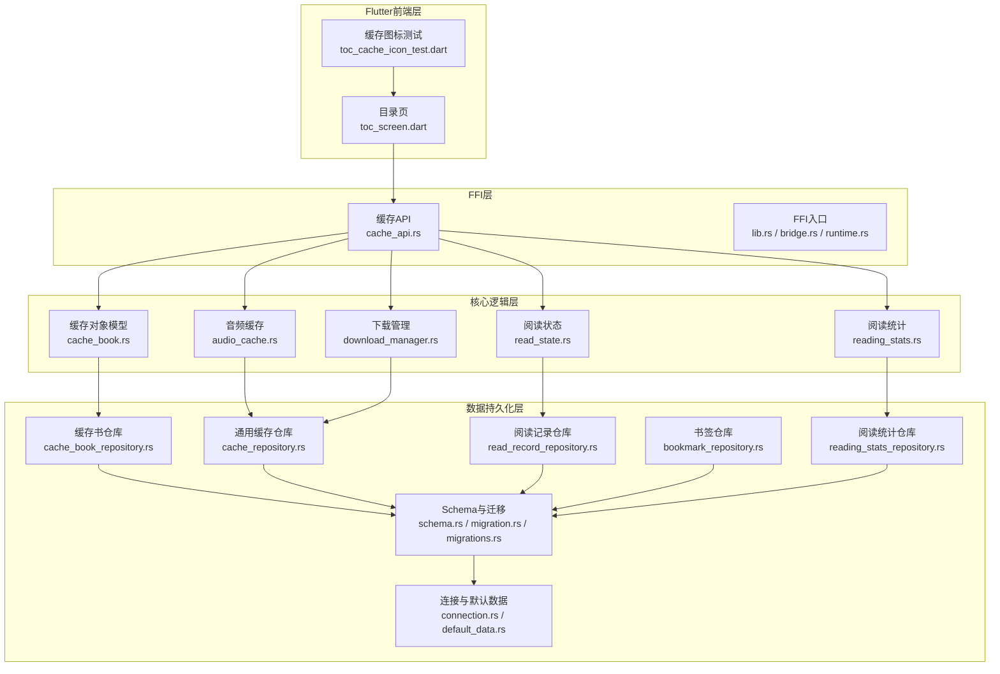
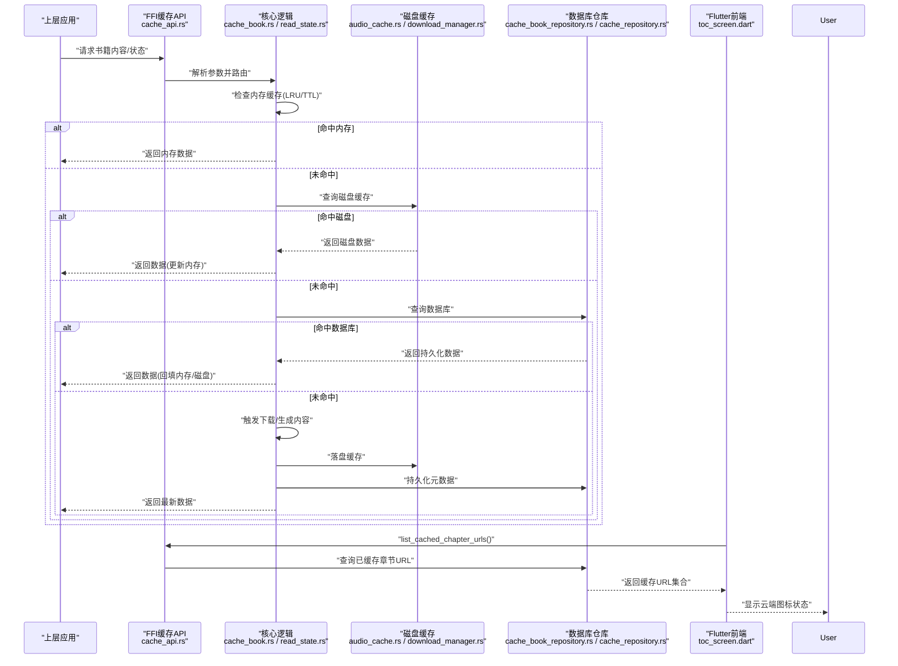
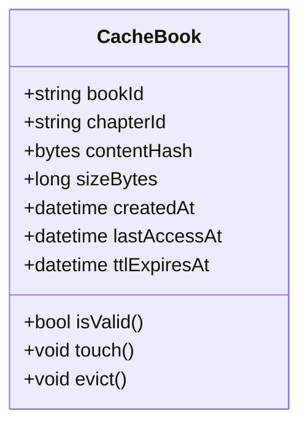
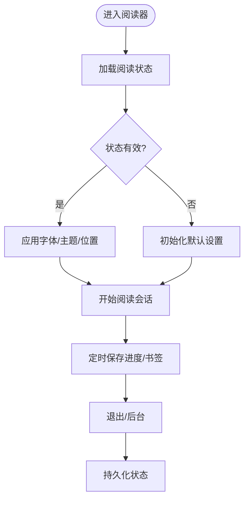
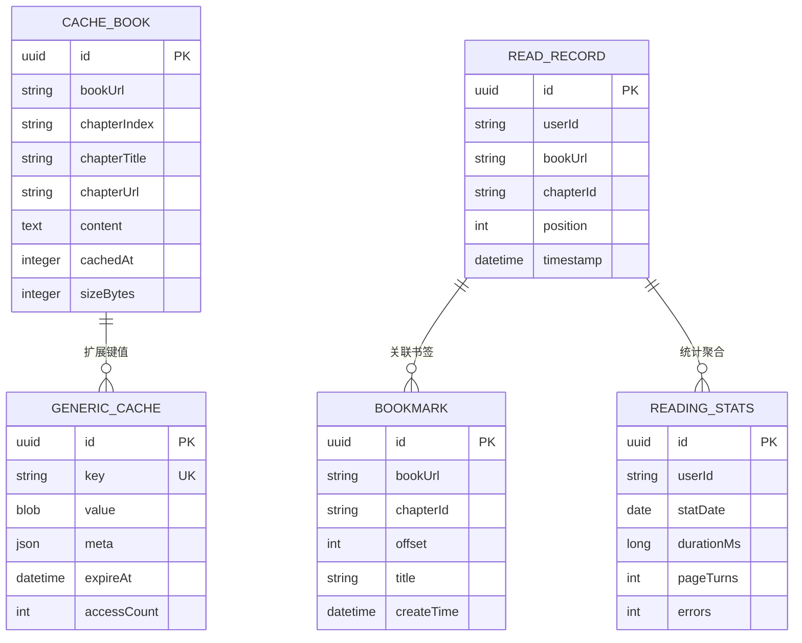
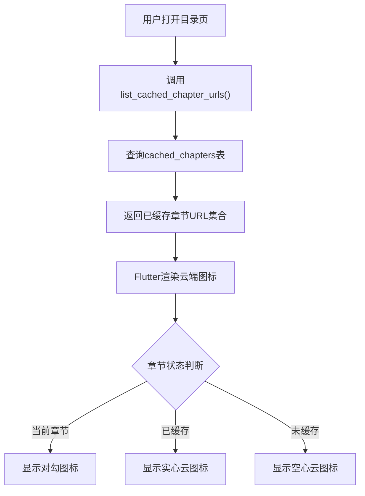
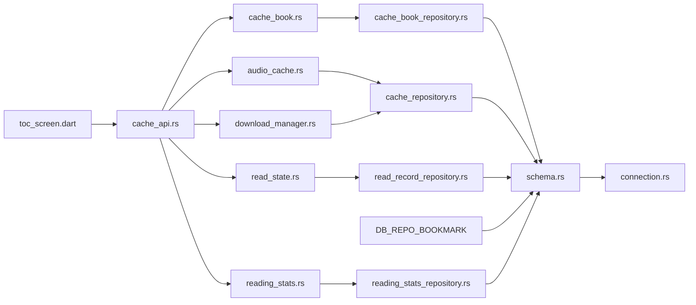

# 缓存管理

<cite>
**本文引用的文件**   
- [cache_api.rs](file://rust/legado-ffi/src/api/cache_api.rs)
- [cache_book_repository.rs](file://rust/legado-db/src/repository/cache_book_repository.rs)
- [cache_repository.rs](file://rust/legado-db/src/repository/cache_repository.rs)
- [read_record_repository.rs](file://rust/legado-db/src/repository/read_record_repository.rs)
- [bookmark_repository.rs](file://rust/legado-db/src/repository/bookmark_repository.rs)
- [reading_stats_repository.rs](file://rust/legado-db/src/repository/reading_stats_repository.rs)
- [cache_book.rs](file://rust/legado-core/src/cache_book.rs)
- [read_state.rs](file://rust/legado-core/src/read_state.rs)
- [reading_stats.rs](file://rust/legado-core/src/reading_stats.rs)
- [audio_cache.rs](file://rust/legado-core/src/audio_cache.rs)
- [download_manager.rs](file://rust/legado-core/src/download_manager.rs)
- [lib.rs](file://rust/legado-core/src/lib.rs)
- [schema.rs](file://rust/legado-db/src/schema.rs)
- [migration.rs](file://rust/legado-db/src/migration.rs)
- [migrations.rs](file://rust/legado-db/src/migration/migrations.rs)
- [connection.rs](file://rust/legado-db/src/connection.rs)
- [default_data.rs](file://rust/legado-db/src/default_data.rs)
- [rule_big_data.rs](file://rust/legado-db/src/rule_big_data.rs)
- [import.rs](file://rust/legado-db/src/import.rs)
- [lib.rs](file://rust/legado-ffi/src/lib.rs)
- [bridge.rs](file://rust/legado-ffi/src/bridge.rs)
- [runtime.rs](file://rust/legado-ffi/src/runtime.rs)
- [error.rs](file://rust/legado-ffi/src/error.rs)
- [db_state.rs](file://rust/legado-ffi/src/db_state.rs)
- [frb_generated.rs](file://rust/legado-ffi/src/frb_generated.rs)
- [toc_screen.dart](file://flutter_legado/lib/src/screens/toc_screen.dart)
- [toc_cache_icon_test.dart](file://flutter_legado/test/widget/toc_cache_icon_test.dart)
</cite>

## 更新摘要
**变更内容**   
- 新增自动章节缓存系统，支持阅读时自动缓存章节内容
- 实现云端图标指示器功能，在目录页显示章节缓存状态
- 新增FFI端点list_cached_chapter_urls()用于查询已缓存章节URL集合
- 数据库迁移到版本102，将cached_chapters表的唯一索引从单列改为复合键(book_url, chapter_url)
- 修复跨书缓存串本问题，确保不同书籍的相同章节URL互不影响
- 增强目录页UI，显示当前章节对勾、已缓存实心云、未缓存空心云三种状态

## 目录
1. [简介](#简介)
2. [项目结构](#项目结构)
3. [核心组件](#核心组件)
4. [架构总览](#架构总览)
5. [详细组件分析](#详细组件分析)
6. [依赖关系分析](#依赖关系分析)
7. [性能考量](#性能考量)
8. [故障排查指南](#故障排查指南)
9. [结论](#结论)
10. [附录](#附录)

## 简介
本文件面向Legado项目的"书籍缓存管理"能力，系统性梳理多级缓存架构（内存、磁盘、数据库）的协同机制。经过架构简化后，当前版本专注于核心缓存功能的实现，包括基础缓存策略与淘汰算法、阅读进度保存与恢复、以及简化的缓存清理机制。文档以代码级为依据，结合仓库中的Rust核心模块与FFI接口进行说明，帮助读者理解当前的缓存管理体系。

**最新更新**：新增了自动章节缓存系统，包括云端图标指示器、FFI端点list_cached_chapter_urls()、数据库迁移到版本102（复合唯一索引）、以及阅读时的自动缓存功能。

## 项目结构
Legado在Rust层实现了核心的缓存、读取状态、下载与持久化能力，并通过FFI暴露给上层应用。关键目录与职责如下：
- Rust核心库（legado-core）：实现缓存对象模型、音频缓存、下载管理、阅读状态与统计等。
- 数据库访问（legado-db）：提供缓存表、阅读记录、书签、统计等Repository与Schema定义、迁移与默认数据。
- FFI桥接（legado-ffi）：对外暴露缓存API、配置API、书签API、阅读记录API等，统一调用入口。
- 连接与状态（legado-db/connection.rs, db_state.rs）：数据库连接池、状态管理与事务封装。
- Flutter前端（flutter_legado）：实现目录页缓存状态显示、云端图标指示器等用户界面功能。

**图表来源** 
- [cache_api.rs](file://rust/legado-ffi/src/api/cache_api.rs)
- [cache_book.rs](file://rust/legado-core/src/cache_book.rs)
- [read_state.rs](file://rust/legado-core/src/read_state.rs)
- [reading_stats.rs](file://rust/legado-core/src/reading_stats.rs)
- [audio_cache.rs](file://rust/legado-core/src/audio_cache.rs)
- [download_manager.rs](file://rust/legado-core/src/download_manager.rs)
- [cache_book_repository.rs](file://rust/legado-db/src/repository/cache_book_repository.rs)
- [cache_repository.rs](file://rust/legado-db/src/repository/cache_repository.rs)
- [read_record_repository.rs](file://rust/legado-db/src/repository/read_record_repository.rs)
- [bookmark_repository.rs](file://rust/legado-db/src/repository/bookmark_repository.rs)
- [reading_stats_repository.rs](file://rust/legado-db/src/repository/reading_stats_repository.rs)
- [schema.rs](file://rust/legado-db/src/schema.rs)
- [migration.rs](file://rust/legado-db/src/migration.rs)
- [migrations.rs](file://rust/legado-db/src/migration/migrations.rs)
- [connection.rs](file://rust/legado-db/src/connection.rs)
- [default_data.rs](file://rust/legado-db/src/default_data.rs)
- [toc_screen.dart](file://flutter_legado/lib/src/screens/toc_screen.dart)
- [toc_cache_icon_test.dart](file://flutter_legado/test/widget/toc_cache_icon_test.dart)

**章节来源**
- [lib.rs](file://rust/legado-core/src/lib.rs)
- [lib.rs](file://rust/legado-ffi/src/lib.rs)
- [bridge.rs](file://rust/legado-ffi/src/bridge.rs)
- [runtime.rs](file://rust/legado-ffi/src/runtime.rs)

## 核心组件
- 缓存对象模型（cache_book.rs）：定义书籍缓存条目、元数据、过期时间、大小估算等，支撑LRU/TTL策略。
- 阅读状态（read_state.rs）：维护当前阅读位置、书签、字体设置、主题等状态，支持序列化与持久化。
- 阅读统计（reading_stats.rs）：累计阅读时长、翻页次数、章节访问频次等，用于分析与优化。
- 音频缓存（audio_cache.rs）：音频片段缓存、预加载、淘汰策略，提升播放流畅度。
- 下载管理（download_manager.rs）：批量下载、断点续传、并发控制、失败重试与缓存落盘。
- FFI缓存API（cache_api.rs）：对外暴露缓存查询、写入、清理、统计等接口，供上层调用。
- **新增**：自动章节缓存系统，支持阅读时自动缓存章节内容，并提供云端图标指示器功能。

**章节来源**
- [cache_book.rs](file://rust/legado-core/src/cache_book.rs)
- [read_state.rs](file://rust/legado-core/src/read_state.rs)
- [reading_stats.rs](file://rust/legado-core/src/reading_stats.rs)
- [audio_cache.rs](file://rust/legado-core/src/audio_cache.rs)
- [download_manager.rs](file://rust/legado-core/src/download_manager.rs)
- [cache_api.rs](file://rust/legado-ffi/src/api/cache_api.rs)

## 架构总览
下图展示从FFI到核心逻辑再到数据库的多级缓存协作流程。上层通过FFI调用缓存API，核心层根据策略选择内存或磁盘缓存，必要时回源或写入数据库；读取路径遵循"内存→磁盘→数据库→网络"的降级顺序。

**图表来源** 
- [cache_api.rs](file://rust/legado-ffi/src/api/cache_api.rs)
- [cache_book.rs](file://rust/legado-core/src/cache_book.rs)
- [read_state.rs](file://rust/legado-core/src/read_state.rs)
- [audio_cache.rs](file://rust/legado-core/src/audio_cache.rs)
- [download_manager.rs](file://rust/legado-core/src/download_manager.rs)
- [cache_book_repository.rs](file://rust/legado-db/src/repository/cache_book_repository.rs)
- [cache_repository.rs](file://rust/legado-db/src/repository/cache_repository.rs)
- [toc_screen.dart](file://flutter_legado/lib/src/screens/toc_screen.dart)

## 详细组件分析

### 缓存对象与策略（cache_book.rs）
- 数据结构：包含书籍标识、章节信息、内容哈希、大小、创建时间、最后访问时间、过期时间等字段，便于LRU与TTL计算。
- 策略实现：
  - LRU：基于最近访问时间排序，容量超限时淘汰最久未使用的条目。
  - TTL：按过期时间判断有效性，定期扫描清理过期项。
- 复杂度：插入O(1)、查找O(1)、淘汰O(log n)（取决于底层容器）。
- 优化建议：分片缓存降低锁竞争；热点数据预热；异步清理避免阻塞。

**图表来源** 
- [cache_book.rs](file://rust/legado-core/src/cache_book.rs)

**章节来源**
- [cache_book.rs](file://rust/legado-core/src/cache_book.rs)

### 阅读状态管理（read_state.rs）
- 状态项：阅读位置（页码/偏移）、书签列表、字体族与大小、行距、主题、夜间模式、滚动偏好等。
- 持久化：序列化为JSON或二进制，写入本地文件或数据库；支持增量更新与冲突合并。
- 恢复机制：启动时加载状态，优先读取最近会话，回退到上次保存；异常时保留安全快照。
- 一致性：读写加锁，避免并发覆盖；版本化字段兼容旧格式。

**图表来源** 
- [read_state.rs](file://rust/legado-core/src/read_state.rs)

**章节来源**
- [read_state.rs](file://rust/legado-core/src/read_state.rs)

### 阅读统计与指标（reading_stats.rs）
- 指标项：阅读时长、翻页次数、章节访问频次、错误率、缓存命中率。
- 采集方式：事件驱动，异步聚合，周期性落库。
- 用途：识别热点章节、优化预取策略、评估缓存效果。

**章节来源**
- [reading_stats.rs](file://rust/legado-core/src/reading_stats.rs)

### 音频缓存（audio_cache.rs）
- 目标：减少网络抖动对播放的影响，保证连续播放。
- 策略：滑动窗口预加载、Lru淘汰、TTL过期；支持多声道与分段缓存。
- 监控：缓存占用、命中率、丢弃率、延迟分布。

**章节来源**
- [audio_cache.rs](file://rust/legado-core/src/audio_cache.rs)

### 下载管理（download_manager.rs）
- 功能：批量下载、断点续传、并发限制、失败重试、去重校验。
- 缓存集成：下载完成后写入磁盘缓存与数据库元数据，更新统计。
- 资源控制：队列长度、线程池大小、带宽限速。

**章节来源**
- [download_manager.rs](file://rust/legado-core/src/download_manager.rs)

### FFI缓存API（cache_api.rs）
- 接口类别：
  - 查询：按bookId/chapterId获取缓存内容与元数据。
  - 写入：写入内容、更新访问时间与TTL。
  - 清理：按规则清理过期/低优先级缓存，释放空间。
  - 统计：命中率、占用空间、条目数量。
- 错误处理：统一错误码与消息，便于上层诊断。
- **新增**：`list_cached_chapter_urls()`函数，用于查询某本书已缓存章节的chapter_url集合，支持目录页云端图标显示。

**章节来源**
- [cache_api.rs](file://rust/legado-ffi/src/api/cache_api.rs)

### 数据库仓库与Schema（cache_book_repository.rs / cache_repository.rs / schema.rs）
- 仓库职责：CRUD操作、分页查询、条件过滤、批量更新。
- Schema设计：
  - 缓存书表：bookId、chapterId、contentHash、size、createdAt、lastAccessAt、ttlExpiresAt等。
  - 通用缓存表：key、value、meta、expireAt、accessCount等。
  - 阅读记录表：userId、bookId、chapterId、position、timestamp等。
  - 书签表：id、bookId、chapterId、offset、title、createTime等。
  - 阅读统计表：userId、date、duration、pageTurns、errors等。
- 迁移与默认数据：版本升级脚本与初始数据注入，确保兼容性。
- **重要更新**：数据库迁移到版本102，将cached_chapters表的唯一索引从chapter_url单列改为(book_url, chapter_url)复合键，解决跨书缓存串本问题。

**图表来源** 
- [schema.rs](file://rust/legado-db/src/schema.rs)
- [cache_book_repository.rs](file://rust/legado-db/src/repository/cache_book_repository.rs)
- [cache_repository.rs](file://rust/legado-db/src/repository/cache_repository.rs)
- [read_record_repository.rs](file://rust/legado-db/src/repository/read_record_repository.rs)
- [bookmark_repository.rs](file://rust/legado-db/src/repository/bookmark_repository.rs)
- [reading_stats_repository.rs](file://rust/legado-db/src/repository/reading_stats_repository.rs)

**章节来源**
- [cache_book_repository.rs](file://rust/legado-db/src/repository/cache_book_repository.rs)
- [cache_repository.rs](file://rust/legado-db/src/repository/cache_repository.rs)
- [read_record_repository.rs](file://rust/legado-db/src/repository/read_record_repository.rs)
- [bookmark_repository.rs](file://rust/legado-db/src/repository/bookmark_repository.rs)
- [reading_stats_repository.rs](file://rust/legado-db/src/repository/reading_stats_repository.rs)
- [schema.rs](file://rust/legado-db/src/schema.rs)
- [migration.rs](file://rust/legado-db/src/migration.rs)
- [migrations.rs](file://rust/legado-db/src/migration/migrations.rs)
- [default_data.rs](file://rust/legado-db/src/default_data.rs)

### 自动章节缓存系统（新增功能）
- **云端图标指示器**：在目录页为每个章节显示缓存状态图标，当前章节显示对勾，已缓存章节显示实心云，未缓存章节显示空心云。
- **FFI端点**：`list_cached_chapter_urls()`函数返回某本书已缓存章节的chapter_url集合，供Flutter前端查询使用。
- **数据库迁移**：版本102迁移将cached_chapters表的唯一索引从chapter_url单列改为(book_url, chapter_url)复合键，防止不同书籍的相同章节URL相互覆盖。
- **阅读时自动缓存**：在阅读过程中自动缓存章节内容，提升后续访问速度。
- **Flutter集成**：目录页通过BookApi.listCachedChapterUrls调用FFI接口，获取缓存状态并渲染相应的云端图标。

**图表来源** 
- [cache_api.rs](file://rust/legado-ffi/src/api/cache_api.rs)
- [toc_screen.dart](file://flutter_legado/lib/src/screens/toc_screen.dart)
- [toc_cache_icon_test.dart](file://flutter_legado/test/widget/toc_cache_icon_test.dart)

**章节来源**
- [cache_api.rs](file://rust/legado-ffi/src/api/cache_api.rs)
- [toc_screen.dart](file://flutter_legado/lib/src/screens/toc_screen.dart)
- [toc_cache_icon_test.dart](file://flutter_legado/test/widget/toc_cache_icon_test.dart)
- [migrations.rs](file://rust/legado-db/src/migration/migrations.rs)

## 依赖关系分析
- FFI层依赖核心逻辑：缓存API调用cache_book.rs、read_state.rs等，统一入口为lib.rs/bridge.rs/runtime.rs。
- 核心逻辑依赖仓库：cache_book.rs依赖cache_book_repository.rs；read_state.rs依赖read_record_repository.rs；audio_cache.rs依赖cache_repository.rs。
- 仓库依赖Schema与连接：所有Repository依赖schema.rs定义的表结构与connection.rs的连接管理。
- **新增依赖**：Flutter前端依赖FFI缓存API，特别是新增的list_cached_chapter_urls()接口。

**图表来源** 
- [cache_api.rs](file://rust/legado-ffi/src/api/cache_api.rs)
- [cache_book.rs](file://rust/legado-core/src/cache_book.rs)
- [read_state.rs](file://rust/legado-core/src/read_state.rs)
- [reading_stats.rs](file://rust/legado-core/src/reading_stats.rs)
- [audio_cache.rs](file://rust/legado-core/src/audio_cache.rs)
- [download_manager.rs](file://rust/legado-core/src/download_manager.rs)
- [cache_book_repository.rs](file://rust/legado-db/src/repository/cache_book_repository.rs)
- [cache_repository.rs](file://rust/legado-db/src/repository/cache_repository.rs)
- [read_record_repository.rs](file://rust/legado-db/src/repository/read_record_repository.rs)
- [bookmark_repository.rs](file://rust/legado-db/src/repository/bookmark_repository.rs)
- [reading_stats_repository.rs](file://rust/legado-db/src/repository/reading_stats_repository.rs)
- [schema.rs](file://rust/legado-db/src/schema.rs)
- [connection.rs](file://rust/legado-db/src/connection.rs)
- [toc_screen.dart](file://flutter_legado/lib/src/screens/toc_screen.dart)

**章节来源**
- [lib.rs](file://rust/legado-ffi/src/lib.rs)
- [bridge.rs](file://rust/legado-ffi/src/bridge.rs)
- [runtime.rs](file://rust/legado-ffi/src/runtime.rs)

## 性能考量
- 缓存命中率：通过reading_stats.rs统计命中率，优化预取与TTL设置。
- 内存占用：LRU容量上限与分片策略，避免OOM；定期压缩与去重。
- I/O吞吐：批量写入、异步落盘、合并小文件；磁盘缓存分目录与索引。
- 并发控制：读写锁分离、无锁队列、背压与限流。
- 监控指标：命中率、平均延迟、丢弃率、空间占用、错误率。
- **新增优化**：复合唯一索引提升查询性能，避免跨书缓存污染导致的重复查询。

[本节为通用指导，不直接分析具体文件]

## 故障排查指南
- 常见问题：
  - 缓存未命中：检查TTL是否过短、LRU容量是否过小、键生成是否一致。
  - 数据不一致：确认读写锁与事务边界，检查版本号与校验和。
  - 空间不足：执行清理任务，查看大文件与过期条目。
  - 读取卡顿：分析I/O瓶颈与线程池配置，调整并发与预取策略。
  - **新增**：云端图标显示异常：检查list_cached_chapter_urls()接口调用是否正常，数据库复合索引是否正确建立。
- 调试工具：
  - 启用日志与指标导出，定位热点与异常。
  - 使用FFI API查询缓存状态与统计，验证策略生效。
  - 数据库层面检查索引与慢查询，优化SQL与Schema。
  - **新增**：验证数据库迁移v102是否正确执行，检查idx_cached_chapters_book_url复合唯一索引是否存在。

**章节来源**
- [error.rs](file://rust/legado-ffi/src/error.rs)
- [db_state.rs](file://rust/legado-ffi/src/db_state.rs)
- [frb_generated.rs](file://rust/legado-ffi/src/frb_generated.rs)

## 结论
Legado的缓存管理体系通过FFI层统一入口、核心层策略实现与数据库层持久化，形成高效可靠的多级缓存架构。经过架构简化后，当前版本专注于核心缓存功能的实现，LRU与TTL策略保障内存与磁盘利用率，阅读状态与统计提供用户体验与优化依据。合理的清理策略与监控手段确保系统稳定与性能。

**最新更新**：新增的自动章节缓存系统显著提升了用户体验，通过云端图标指示器让用户直观了解章节缓存状态，复合唯一索引的设计解决了跨书缓存串本的关键问题。建议在业务场景中结合指标动态调优，持续迭代缓存策略与存储结构。

[本节为总结性内容，不直接分析具体文件]

## 附录
- 术语表：LRU（最近最少使用）、TTL（生存时间）、FFI（外部函数接口）、Repository（数据访问抽象）。
- 参考文件：
  - 缓存对象与策略：[cache_book.rs](file://rust/legado-core/src/cache_book.rs)
  - 阅读状态与统计：[read_state.rs](file://rust/legado-core/src/read_state.rs), [reading_stats.rs](file://rust/legado-core/src/reading_stats.rs)
  - 音频缓存与下载：[audio_cache.rs](file://rust/legado-core/src/audio_cache.rs), [download_manager.rs](file://rust/legado-core/src/download_manager.rs)
  - FFI接口：[cache_api.rs](file://rust/legado-ffi/src/api/cache_api.rs), [lib.rs](file://rust/legado-ffi/src/lib.rs), [bridge.rs](file://rust/legado-ffi/src/bridge.rs), [runtime.rs](file://rust/legado-ffi/src/runtime.rs)
  - 数据库仓库与Schema：[cache_book_repository.rs](file://rust/legado-db/src/repository/cache_book_repository.rs), [cache_repository.rs](file://rust/legado-db/src/repository/cache_repository.rs), [read_record_repository.rs](file://rust/legado-db/src/repository/read_record_repository.rs), [bookmark_repository.rs](file://rust/legado-db/src/repository/bookmark_repository.rs), [reading_stats_repository.rs](file://rust/legado-db/src/repository/reading_stats_repository.rs), [schema.rs](file://rust/legado-db/src/schema.rs), [migration.rs](file://rust/legado-db/src/migration.rs), [migrations.rs](file://rust/legado-db/src/migration/migrations.rs), [connection.rs](file://rust/legado-db/src/connection.rs), [default_data.rs](file://rust/legado-db/src/default_data.rs)
  - **新增**：Flutter前端与测试：[toc_screen.dart](file://flutter_legado/lib/src/screens/toc_screen.dart), [toc_cache_icon_test.dart](file://flutter_legado/test/widget/toc_cache_icon_test.dart)

[本节为附录信息，不直接分析具体文件]