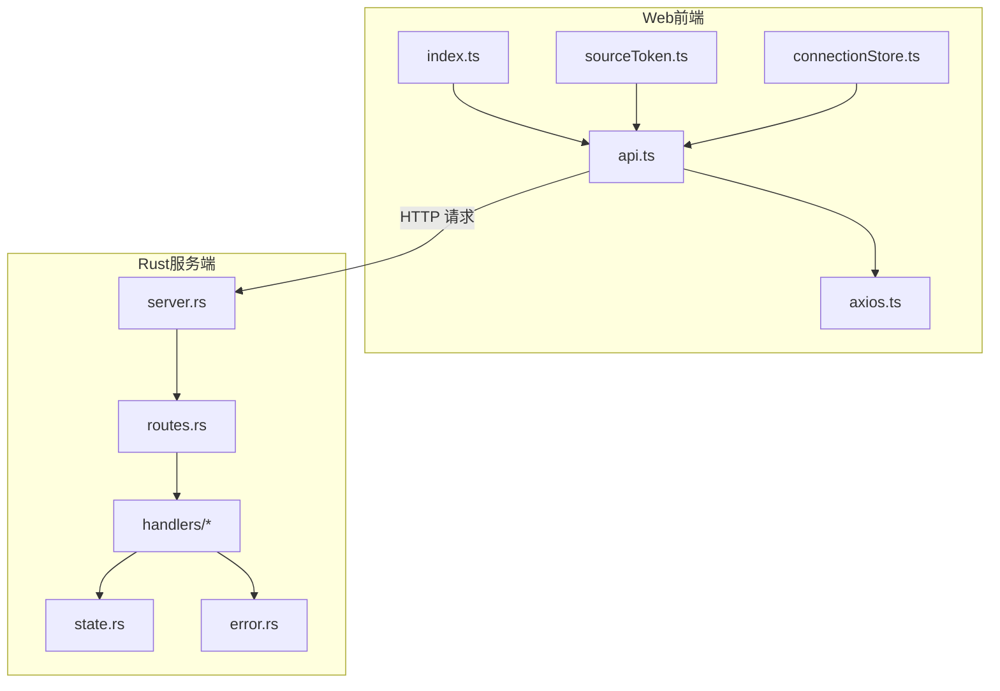
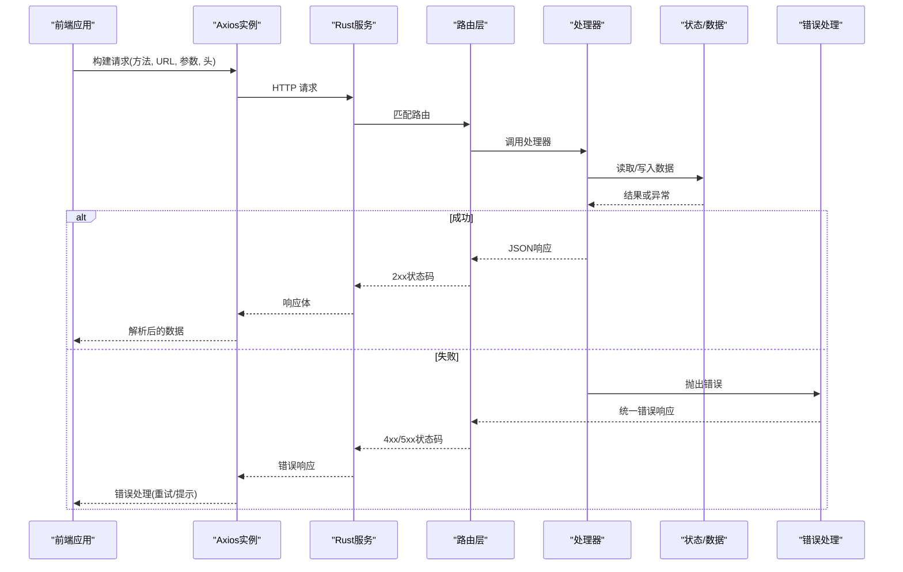
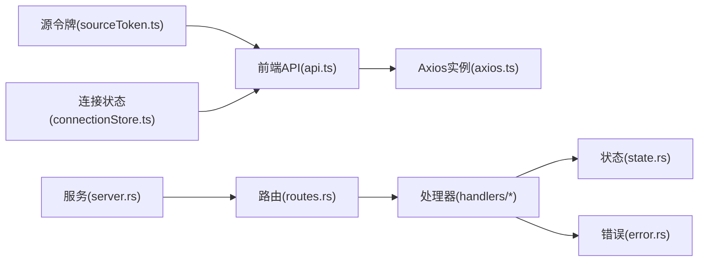

# API接口设计

<cite>
**本文档引用的文件**   
- [routes.rs](file://rust/legado-server/src/routes.rs)
- [server.rs](file://rust/legado-server/src/server.rs)
- [state.rs](file://rust/legado-server/src/state.rs)
- [error.rs](file://rust/legado-server/src/error.rs)
- [lib.rs](file://rust/legado-server/src/lib.rs)
- [handlers/mod.rs](file://rust/legado-server/src/handlers/mod.rs)
- [api.rs](file://modules/web/src/api/api.ts)
- [axios.ts](file://modules/web/src/api/axios.ts)
- [index.ts](file://modules/web/src/api/index.ts)
- [sourceToken.ts](file://modules/web/src/api/sourceToken.ts)
- [connectionStore.ts](file://modules/web/src/store/connectionStore.ts)
</cite>

## 目录
1. [简介](#简介)
2. [项目结构](#项目结构)
3. [核心组件](#核心组件)
4. [架构总览](#架构总览)
5. [详细组件分析](#详细组件分析)
6. [依赖关系分析](#依赖关系分析)
7. [性能考虑](#性能考虑)
8. [故障排查指南](#故障排查指南)
9. [结论](#结论)
10. [附录](#附录)

## 简介
本文件面向Legado项目的API接口设计与实现，目标是形成一套可落地的RESTful规范与参考文档。内容涵盖：
- URL命名约定、HTTP方法使用、状态码定义等标准规范
- 请求响应格式（JSON数据结构、字段校验、错误响应）
- 认证授权机制（JWT令牌、权限控制、会话管理）
- 版本控制与兼容性管理（版本策略、向后兼容、废弃通知）
- 完整API参考（端点描述、参数说明、示例调用）
- Swagger/OpenAPI文档生成与测试方法

本项目包含服务端（Rust）与Web前端（Vue/TS），通过HTTP进行交互；同时存在本地服务器能力（用于设备内通信）。本文档将基于现有代码结构与模块划分，给出统一的接口设计规范与落地建议。

## 项目结构
从仓库结构看，API相关代码主要分布在以下位置：
- Rust服务端：路由注册、服务启动、状态管理、错误处理、处理器入口
- Web前端：API封装、Axios配置、连接状态管理、源令牌管理

图表来源
- [server.rs](file://rust/legado-server/src/server.rs)
- [routes.rs](file://rust/legado-server/src/routes.rs)
- [state.rs](file://rust/legado-server/src/state.rs)
- [error.rs](file://rust/legado-server/src/error.rs)
- [api.ts](file://modules/web/src/api/api.ts)
- [axios.ts](file://modules/web/src/api/axios.ts)
- [index.ts](file://modules/web/src/api/index.ts)
- [sourceToken.ts](file://modules/web/src/api/sourceToken.ts)
- [connectionStore.ts](file://modules/web/src/store/connectionStore.ts)

章节来源
- [server.rs](file://rust/legado-server/src/server.rs)
- [routes.rs](file://rust/legado-server/src/routes.rs)
- [state.rs](file://rust/legado-server/src/state.rs)
- [error.rs](file://rust/legado-server/src/error.rs)
- [api.ts](file://modules/web/src/api/api.ts)
- [axios.ts](file://modules/web/src/api/axios.ts)
- [index.ts](file://modules/web/src/api/index.ts)
- [sourceToken.ts](file://modules/web/src/api/sourceToken.ts)
- [connectionStore.ts](file://modules/web/src/store/connectionStore.ts)

## 核心组件
- 服务端路由与服务启动：负责监听端口、注册路由、挂载中间件、统一错误处理与日志记录
- 处理器层：按业务域拆分，如书籍、搜索、RSS、用户、配置、缓存、音频等
- 状态与上下文：共享应用状态、数据库连接、配置项、运行时环境
- 错误模型：统一错误码、错误消息、堆栈信息（开发模式）
- Web前端API封装：Axios实例、拦截器、基础URL、超时、重试、鉴权头注入
- 连接与令牌管理：本地服务器连接地址、源令牌获取与刷新、连接状态同步

章节来源
- [lib.rs](file://rust/legado-server/src/lib.rs)
- [server.rs](file://rust/legado-server/src/server.rs)
- [routes.rs](file://rust/legado-server/src/routes.rs)
- [state.rs](file://rust/legado-server/src/state.rs)
- [error.rs](file://rust/legado-server/src/error.rs)
- [handlers/mod.rs](file://rust/legado-server/src/handlers/mod.rs)
- [api.ts](file://modules/web/src/api/api.ts)
- [axios.ts](file://modules/web/src/api/axios.ts)
- [index.ts](file://modules/web/src/api/index.ts)
- [sourceToken.ts](file://modules/web/src/api/sourceToken.ts)
- [connectionStore.ts](file://modules/web/src/store/connectionStore.ts)

## 架构总览
整体采用“前端HTTP客户端 + Rust HTTP服务”的架构。前端通过Axios发起REST请求，服务端由路由分发到具体处理器，处理器访问状态与数据层，返回统一JSON响应。

图表来源
- [server.rs](file://rust/legado-server/src/server.rs)
- [routes.rs](file://rust/legado-server/src/routes.rs)
- [state.rs](file://rust/legado-server/src/state.rs)
- [error.rs](file://rust/legado-server/src/error.rs)
- [api.ts](file://modules/web/src/api/api.ts)
- [axios.ts](file://modules/web/src/api/axios.ts)

## 详细组件分析

### RESTful API设计规范
- URL命名约定
  - 使用名词复数表示资源集合，例如 /books、/chapters、/rss
  - 路径层级不超过三层，避免深层嵌套
  - 使用小写字母与连字符分隔，不使用下划线
  - 查询参数用于过滤、排序、分页，例如 ?page=1&size=20&sort=-createdAt
- HTTP方法使用
  - GET：获取资源列表或详情
  - POST：创建新资源
  - PUT：全量更新资源
  - PATCH：部分更新资源
  - DELETE：删除资源
  - 幂等性：GET、PUT、DELETE应为幂等；POST非幂等
- 状态码定义
  - 2xx：成功（200 OK、201 Created、204 No Content）
  - 4xx：客户端错误（400 Bad Request、401 Unauthorized、403 Forbidden、404 Not Found、422 Unprocessable Entity）
  - 5xx：服务端错误（500 Internal Server Error、503 Service Unavailable）
- 请求与响应格式
  - 统一Content-Type为application/json
  - 响应体结构包含code、message、data、traceId等字段
  - 分页响应包含total、page、size、items等字段
- 字段验证
  - 服务端对必填字段、类型、长度、范围进行校验
  - 返回422并附带字段级错误信息
- 错误响应
  - 统一错误模型，包含错误码、错误消息、可选堆栈（仅开发）
  - 区分业务错误与系统错误

章节来源
- [routes.rs](file://rust/legado-server/src/routes.rs)
- [error.rs](file://rust/legado-server/src/error.rs)
- [api.ts](file://modules/web/src/api/api.ts)
- [axios.ts](file://modules/web/src/api/axios.ts)

### 认证与授权机制
- 认证流程
  - 登录接口返回JWT令牌（access_token、refresh_token、expires_in）
  - 后续请求在Authorization头携带Bearer token
  - Token过期时自动刷新或使用refresh_token换取新token
- 权限控制
  - 基于角色的访问控制（RBAC），在路由或处理器中校验角色/权限
  - 敏感接口需额外签名或二次确认
- 会话管理
  - 无状态会话（JWT），服务端不存储会话
  - 支持多端登录限制（可选）
- 安全策略
  - HTTPS强制、CORS白名单、速率限制、防重放攻击
  - 敏感数据脱敏输出，错误信息不包含敏感细节

章节来源
- [sourceToken.ts](file://modules/web/src/api/sourceToken.ts)
- [connectionStore.ts](file://modules/web/src/store/connectionStore.ts)
- [api.ts](file://modules/web/src/api/api.ts)
- [axios.ts](file://modules/web/src/api/axios.ts)

### 版本控制与兼容性管理
- 版本策略
  - URL前缀版本化：/api/v1/...、/api/v2/...
  - 头部版本协商：Accept-Version、X-API-Version（可选）
- 向后兼容
  - 新增字段保持可选，旧客户端忽略未知字段
  - 删除字段需保留一段时间并提供迁移指南
- 废弃通知
  - 响应头X-Deprecation、Sunset-Time告知废弃时间
  - 日志记录废弃接口调用，监控影响面

章节来源
- [routes.rs](file://rust/legado-server/src/routes.rs)
- [server.rs](file://rust/legado-server/src/server.rs)

### 完整API参考（示例）
以下为常见端点的参考模板（以书籍为例）：
- 获取书籍列表
  - 方法：GET
  - URL：/api/v1/books
  - 查询参数：page、size、keyword、category、sort
  - 响应：{ code, message, data: { total, page, size, items: [...] } }
- 获取书籍详情
  - 方法：GET
  - URL：/api/v1/books/{id}
  - 路径参数：id（整数）
  - 响应：{ code, message, data: Book }
- 创建书籍
  - 方法：POST
  - URL：/api/v1/books
  - 请求体：BookCreate
  - 响应：{ code, message, data: Book }
- 更新书籍
  - 方法：PUT
  - URL：/api/v1/books/{id}
  - 请求体：BookUpdate
  - 响应：{ code, message, data: Book }
- 删除书籍
  - 方法：DELETE
  - URL：/api/v1/books/{id}
  - 响应：{ code, message, data: null }

注意：以上为通用模板，实际字段与行为需结合后端处理器实现与数据模型。

章节来源
- [routes.rs](file://rust/legado-server/src/routes.rs)
- [handlers/mod.rs](file://rust/legado-server/src/handlers/mod.rs)

### Swagger/OpenAPI文档生成与测试
- 文档生成
  - 在服务端集成OpenAPI注解或中间件，自动生成/openapi.json
  - 提供/docs页面展示交互式文档
- 测试方法
  - 使用curl或Postman导入OpenAPI规范进行冒烟测试
  - 编写自动化测试用例覆盖关键路径与边界条件
  - 压测工具（如wrk、k6）评估性能与稳定性

章节来源
- [server.rs](file://rust/legado-server/src/server.rs)
- [routes.rs](file://rust/legado-server/src/routes.rs)

## 依赖关系分析
前端API封装依赖Axios实例与连接状态管理；服务端路由依赖处理器与状态管理；错误处理贯穿全链路。

图表来源
- [api.ts](file://modules/web/src/api/api.ts)
- [axios.ts](file://modules/web/src/api/axios.ts)
- [sourceToken.ts](file://modules/web/src/api/sourceToken.ts)
- [connectionStore.ts](file://modules/web/src/store/connectionStore.ts)
- [server.rs](file://rust/legado-server/src/server.rs)
- [routes.rs](file://rust/legado-server/src/routes.rs)
- [state.rs](file://rust/legado-server/src/state.rs)
- [error.rs](file://rust/legado-server/src/error.rs)

章节来源
- [api.ts](file://modules/web/src/api/api.ts)
- [axios.ts](file://modules/web/src/api/axios.ts)
- [sourceToken.ts](file://modules/web/src/api/sourceToken.ts)
- [connectionStore.ts](file://modules/web/src/store/connectionStore.ts)
- [server.rs](file://rust/legado-server/src/server.rs)
- [routes.rs](file://rust/legado-server/src/routes.rs)
- [state.rs](file://rust/legado-server/src/state.rs)
- [error.rs](file://rust/legado-server/src/error.rs)

## 性能考虑
- 网络层
  - 合理设置超时与重试策略，避免雪崩
  - 启用Gzip/Brotli压缩，减少传输体积
- 服务端
  - 异步处理耗时操作，避免阻塞主线程
  - 数据库查询优化，索引与分页
  - 缓存热点数据（内存/Redis）
- 前端
  - 请求去抖与节流，避免重复提交
  - 列表虚拟滚动与懒加载
  - 错误快速失败与降级策略

[本节为通用指导，无需特定文件引用]

## 故障排查指南
- 常见问题
  - 401未授权：检查Authorization头与Token有效性
  - 404未找到：核对URL与路由注册
  - 422参数错误：检查请求体字段与校验规则
  - 500服务端错误：查看服务端日志与堆栈
- 调试技巧
  - 启用开发模式输出详细错误信息
  - 使用浏览器开发者工具与网络面板抓包
  - 服务端添加请求ID追踪链路

章节来源
- [error.rs](file://rust/legado-server/src/error.rs)
- [axios.ts](file://modules/web/src/api/axios.ts)

## 结论
本文档基于Legado项目的代码结构与模块划分，给出了RESTful API设计规范、认证授权机制、版本控制策略、API参考模板以及Swagger/OpenAPI文档生成与测试方法。建议在实现过程中严格遵循规范，确保接口一致性、可维护性与可扩展性。

[本节为总结性内容，无需特定文件引用]

## 附录
- 术语表
  - JWT：JSON Web Token，用于无状态认证
  - RBAC：基于角色的访问控制
  - OpenAPI：API描述与文档标准
- 参考链接
  - RESTful API设计最佳实践
  - HTTP状态码规范
  - JWT规范与实现指南

[本节为补充信息，无需特定文件引用]