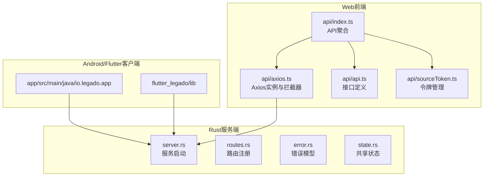
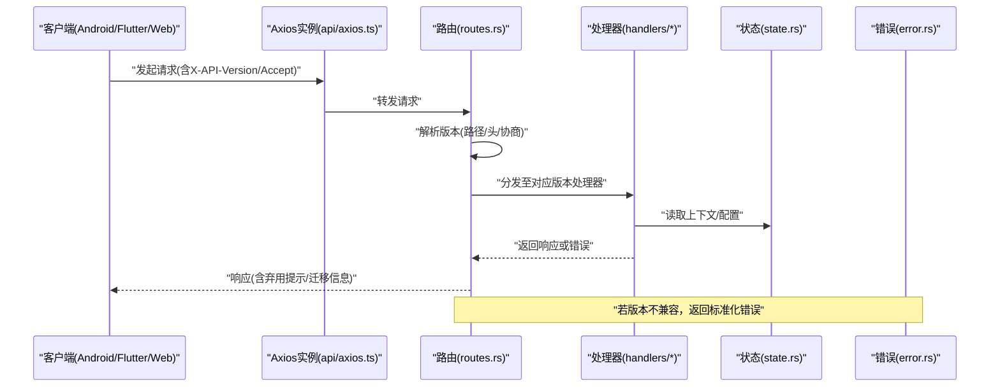
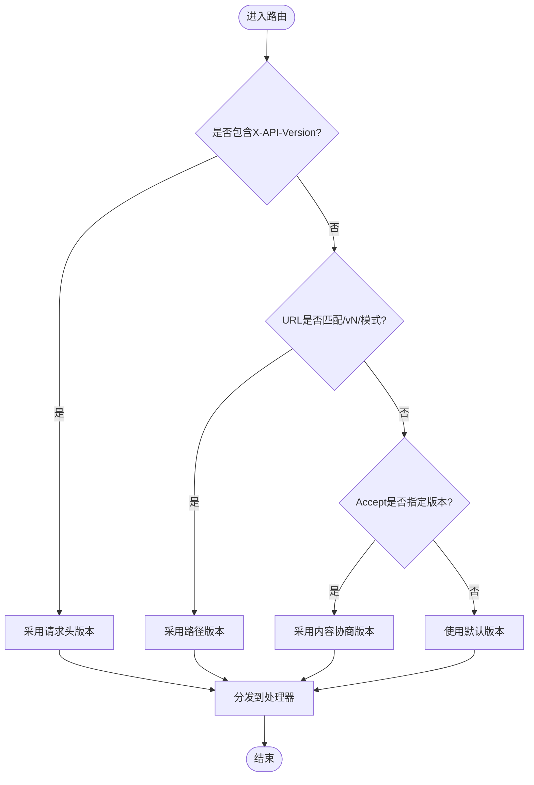
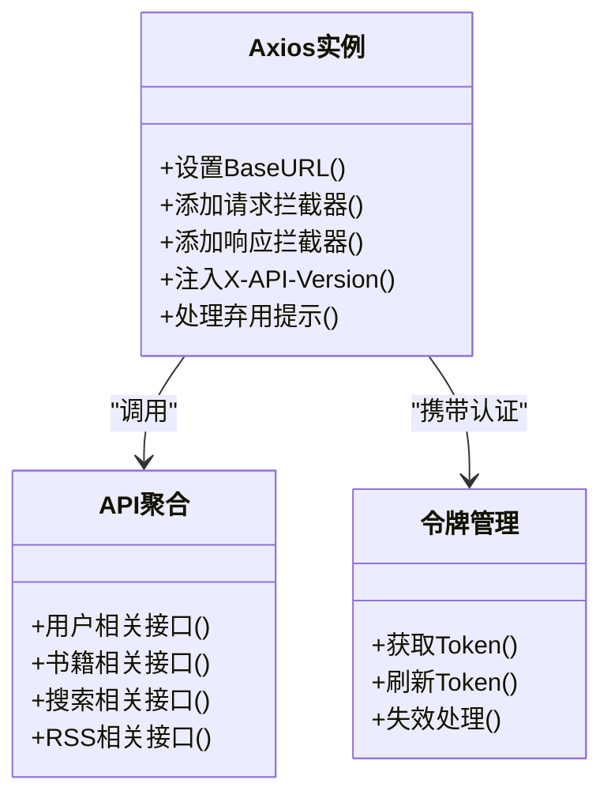
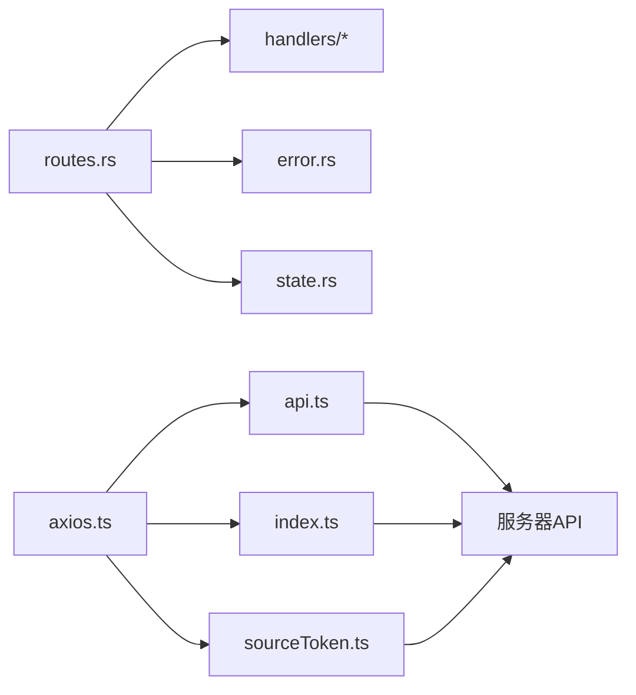

# API版本控制

<cite>
**本文引用的文件**   
- [routes.rs](file://rust/legado-server/src/routes.rs)
- [server.rs](file://rust/legado-server/src/server.rs)
- [lib.rs](file://rust/legado-server/src/lib.rs)
- [error.rs](file://rust/legado-server/src/error.rs)
- [state.rs](file://rust/legado-server/src/state.rs)
- [api.ts](file://modules/web/src/api/api.ts)
- [axios.ts](file://modules/web/src/api/axios.ts)
- [index.ts](file://modules/web/src/api/index.ts)
- [sourceToken.ts](file://modules/web/src/api/sourceToken.ts)
- [README.md](file://README.md)
</cite>

## 目录
1. [简介](#简介)
2. [项目结构](#项目结构)
3. [核心组件](#核心组件)
4. [架构总览](#架构总览)
5. [详细组件分析](#详细组件分析)
6. [依赖分析](#依赖分析)
7. [性能考虑](#性能考虑)
8. [故障排查指南](#故障排查指南)
9. [结论](#结论)
10. [附录](#附录)

## 简介
本文件面向Legado项目的API版本控制，目标是形成一套可落地的版本策略与工程实践。内容涵盖：
- URL路径版本化、请求头版本化、内容协商等版本管理方案
- 向后兼容性保证（字段废弃策略、行为变更处理、迁移工具）
- 废弃通知机制（弃用警告、迁移指南、生命周期管理）
- 版本测试与发布流程（兼容性测试、灰度发布、回滚策略）
- 完整示例与最佳实践

说明：当前仓库中未发现显式的“版本号”常量或统一的版本路由前缀实现。因此本文以“现状评估 + 推荐方案”的方式给出落地建议，并结合现有HTTP服务与Web前端代码结构，提供可直接参考的集成点与扩展位置。

## 项目结构
Legado包含多语言与多模块：
- Rust服务端（legado-server）：提供HTTP接口、路由注册、错误处理、状态管理等
- Web前端（modules/web）：通过TypeScript调用后端API，封装Axios实例与请求拦截器
- Android应用（app）：原生客户端，内部使用网络库访问本地或远程服务
- Flutter跨端（flutter_legado）：跨平台客户端，同样需要遵循API契约

图表来源
- [server.rs](file://rust/legado-server/src/server.rs)
- [routes.rs](file://rust/legado-server/src/routes.rs)
- [error.rs](file://rust/legado-server/src/error.rs)
- [state.rs](file://rust/legado-server/src/state.rs)
- [api.ts](file://modules/web/src/api/api.ts)
- [axios.ts](file://modules/web/src/api/axios.ts)
- [index.ts](file://modules/web/src/api/index.ts)
- [sourceToken.ts](file://modules/web/src/api/sourceToken.ts)

章节来源
- [README.md](file://README.md)

## 核心组件
- 服务端路由与中间件：负责URL解析、鉴权、限流、日志、版本选择等
- 错误与响应模型：统一错误码、消息体、弃用提示、迁移指引
- 客户端请求层：统一基础URL、请求头注入（如X-API-Version）、内容协商（Accept/Content-Type）
- 配置与状态：全局版本策略、特性开关、灰度规则

章节来源
- [routes.rs](file://rust/legado-server/src/routes.rs)
- [server.rs](file://rust/legado-server/src/server.rs)
- [error.rs](file://rust/legado-server/src/error.rs)
- [state.rs](file://rust/legado-server/src/state.rs)
- [api.ts](file://modules/web/src/api/api.ts)
- [axios.ts](file://modules/web/src/api/axios.ts)
- [index.ts](file://modules/web/src/api/index.ts)
- [sourceToken.ts](file://modules/web/src/api/sourceToken.ts)

## 架构总览
下图展示从客户端到服务端的请求链路，以及版本控制的接入点（请求头、URL路径、内容协商）。

图表来源
- [axios.ts](file://modules/web/src/api/axios.ts)
- [routes.rs](file://rust/legado-server/src/routes.rs)
- [state.rs](file://rust/legado-server/src/state.rs)
- [error.rs](file://rust/legado-server/src/error.rs)

## 详细组件分析

### 服务端路由与版本选择
- 路由注册：集中式注册所有API端点，便于统一加入版本判断逻辑
- 版本解析优先级建议：
  1) 请求头 X-API-Version（最明确，适合灰度与A/B）
  2) URL路径 /v1/...（强约束，利于缓存与CDN）
  3) 内容协商 Accept: application/vnd.legado.v1+json（灵活但需客户端配合）
- 默认策略：未指定版本时，返回“默认最新稳定版”，并附带弃用提示（如适用）

图表来源
- [routes.rs](file://rust/legado-server/src/routes.rs)

章节来源
- [routes.rs](file://rust/legado-server/src/routes.rs)

### 错误与响应模型
- 统一错误码：区分“版本不兼容”“参数校验失败”“业务异常”等
- 弃用提示：在响应体或头部增加Deprecation、Sunset、Migration-Url等字段
- 迁移指引：为每个弃用端点提供迁移文档链接与新旧字段映射

章节来源
- [error.rs](file://rust/legado-server/src/error.rs)

### 客户端请求层（Web）
- Axios实例：统一设置BaseURL、超时、重试、拦截器（注入X-API-Version、Accept）
- API聚合：按功能域组织接口，便于版本隔离与替换
- 令牌管理：独立模块维护认证信息，避免与版本逻辑耦合

图表来源
- [axios.ts](file://modules/web/src/api/axios.ts)
- [api.ts](file://modules/web/src/api/api.ts)
- [index.ts](file://modules/web/src/api/index.ts)
- [sourceToken.ts](file://modules/web/src/api/sourceToken.ts)

章节来源
- [axios.ts](file://modules/web/src/api/axios.ts)
- [api.ts](file://modules/web/src/api/api.ts)
- [index.ts](file://modules/web/src/api/index.ts)
- [sourceToken.ts](file://modules/web/src/api/sourceToken.ts)

### 服务端状态与配置
- 全局版本策略：默认版本、支持版本列表、灰度规则
- 特性开关：用于渐进式启用新字段或行为
- 运行时配置：动态调整弃用策略与迁移指引

章节来源
- [state.rs](file://rust/legado-server/src/state.rs)

## 依赖分析
- 服务端依赖：路由注册、错误模型、状态管理、处理器实现
- 客户端依赖：Axios实例、API定义、令牌管理
- 外部依赖：HTTP协议、JSON序列化、可选的内容协商

图表来源
- [routes.rs](file://rust/legado-server/src/routes.rs)
- [error.rs](file://rust/legado-server/src/error.rs)
- [state.rs](file://rust/legado-server/src/state.rs)
- [axios.ts](file://modules/web/src/api/axios.ts)
- [api.ts](file://modules/web/src/api/api.ts)
- [index.ts](file://modules/web/src/api/index.ts)
- [sourceToken.ts](file://modules/web/src/api/sourceToken.ts)

章节来源
- [routes.rs](file://rust/legado-server/src/routes.rs)
- [axios.ts](file://modules/web/src/api/axios.ts)

## 性能考虑
- 版本解析开销：优先使用请求头或路径，避免复杂正则；内容协商仅在必要时启用
- 缓存友好性：路径版本化有利于CDN与反向代理缓存；避免频繁协商
- 响应体积：弃用提示与迁移信息应精简，避免影响大对象传输
- 灰度与A/B：基于请求头或用户ID分流，减少全量切换风险

## 故障排查指南
- 常见问题
  - 客户端未发送X-API-Version导致走默认版本，出现字段缺失
  - Accept头未正确设置导致内容协商失败
  - 旧版客户端收到弃用提示但未处理，导致UI异常
- 排查步骤
  - 检查请求头与URL路径是否包含版本信息
  - 查看服务端日志中的版本解析结果与路由分发
  - 确认响应体中的弃用提示与迁移链接
  - 验证客户端对弃用提示的处理逻辑

章节来源
- [error.rs](file://rust/legado-server/src/error.rs)
- [routes.rs](file://rust/legado-server/src/routes.rs)
- [axios.ts](file://modules/web/src/api/axios.ts)

## 结论
- 当前仓库未实现统一的API版本控制，建议在路由层与客户端请求层同时接入
- 推荐优先采用“请求头版本化 + 路径版本化”双轨制，辅以内容协商提升灵活性
- 建立完整的弃用通知与迁移指引体系，确保平滑演进
- 引入兼容性测试、灰度发布与回滚策略，保障稳定性

## 附录

### 版本策略建议
- URL路径版本化
  - 格式：/v1/resource、/v2/resource
  - 优点：简单直观、缓存友好
  - 缺点：URL膨胀、历史版本并存成本高
- 请求头版本化
  - 头名：X-API-Version: 1.2.3
  - 优点：灵活、易于灰度与A/B测试
  - 缺点：需客户端主动注入，调试稍复杂
- 内容协商
  - 头名：Accept: application/vnd.legado.v1+json
  - 优点：语义清晰、可扩展性强
  - 缺点：客户端与网关需支持，兼容性要求高

### 向后兼容性保证
- 字段废弃策略
  - 新增字段必须可选，不得破坏旧客户端解析
  - 删除字段需保留一段时间并提供替代字段
  - 重命名字段需同时支持新旧名称
- 行为变更处理
  - 默认行为保持不变，新功能通过开关或新版本暴露
  - 错误码与消息体保持稳定，新增错误码需文档化
- 迁移工具开发
  - 提供脚本自动转换请求/响应格式
  - 生成SDK更新补丁，降低客户端升级成本

### 废弃通知机制
- 弃用警告
  - 响应头：Deprecation: true、Sunset: <日期>
  - 响应体：message包含弃用说明与迁移链接
- 迁移指南
  - 提供新旧字段映射表与示例
  - 在线文档与离线包同步更新
- 生命周期管理
  - v1支持期≥12个月，v2发布后v1进入维护期
  - 定期清理长期未使用的版本路由

### 版本测试与发布流程
- 兼容性测试
  - 自动化用例覆盖新旧版本的请求/响应
  - 契约测试确保字段与行为一致
- 灰度发布
  - 基于用户ID或设备指纹逐步放量
  - 监控关键指标（错误率、延迟、转化率）
- 回滚策略
  - 快速回滚到上一稳定版本
  - 数据迁移具备幂等性与可逆性

### 完整示例与最佳实践
- 客户端示例（Web）
  - 在Axios拦截器中注入X-API-Version
  - 处理弃用提示并引导用户升级
- 服务端示例（Rust）
  - 在路由层解析版本并分发到对应处理器
  - 统一错误模型与弃用提示
- 最佳实践
  - 版本命名遵循语义化版本（主.次.修订）
  - 保持最小可用集，避免过度拆分
  - 文档先行，变更即更新