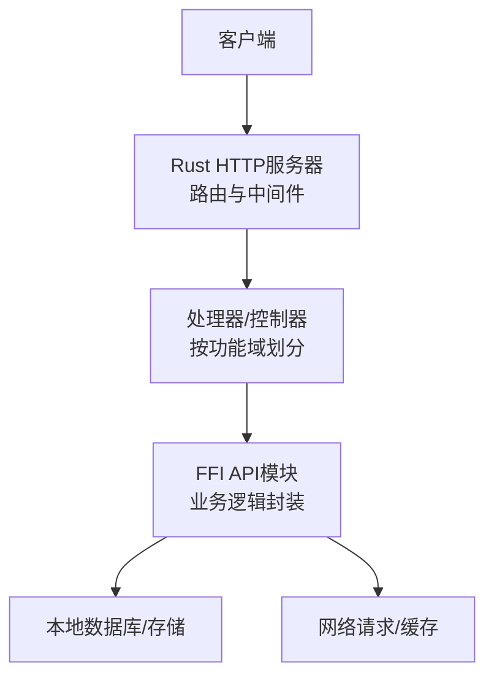
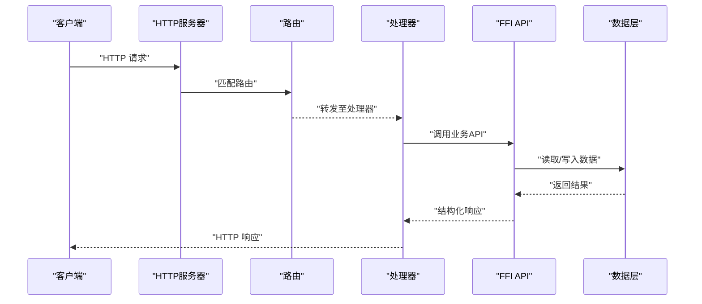
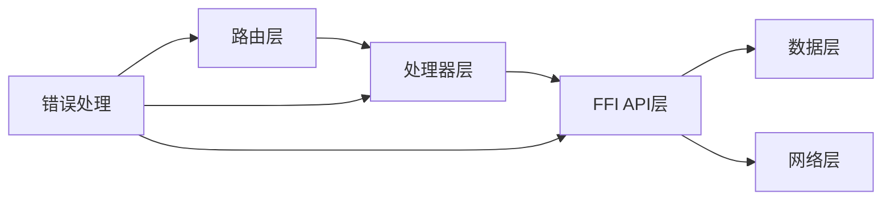

# RESTful API设计规范

<cite>
**本文档引用的文件**
- [routes.rs](file://rust/legado-server/src/routes.rs)
- [server.rs](file://rust/legado-server/src/server.rs)
- [lib.rs](file://rust/legado-server/src/lib.rs)
- [error.rs](file://rust/legado-server/src/error.rs)
- [state.rs](file://rust/legado-server/src/state.rs)
- [handlers/mod.rs](file://rust/legado-server/src/handlers/mod.rs)
- [api/audio_api.rs](file://rust/legado-ffi/src/api/audio_api.rs)
- [api/backup_api.rs](file://rust/legado-ffi/src/api/backup_api.rs)
- [api/book_export.rs](file://rust/legado-ffi/src/api/book_export.rs)
- [api/book_group_api.rs](file://rust/legado-ffi/src/api/book_group_api.rs)
- [api/book_import.rs](file://rust/legado-ffi/src/api/book_import.rs)
- [api/bookmark_api.rs](file://rust/legado-ffi/src/api/bookmark_api.rs)
- [api/bookshelf.rs](file://rust/legado-ffi/src/api/bookshelf.rs)
- [api/cache_api.rs](file://rust/legado-ffi/src/api/cache_api.rs)
- [api/config_api.rs](file://rust/legado-ffi/src/api/config_api.rs)
- [api/http_tts_api.rs](file://rust/legado-ffi/src/api/http_tts_api.rs)
- [api/read_record_api.rs](file://rust/legado-ffi/src/api/read_record_api.rs)
- [api/reader.rs](file://rust/legado-ffi/src/api/reader.rs)
- [api/reading_stats_api.rs](file://rust/legado-ffi/src/api/reading_stats_api.rs)
- [api/replace_rule_api.rs](file://rust/legado-ffi/src/api/replace_rule_api.rs)
- [api/rss.rs](file://rust/legado-ffi/src/api/rss.rs)
- [api/rss_star_api.rs](file://rust/legado-ffi/src/api/rss_star_api.rs)
- [api/search.rs](file://rust/legado-ffi/src/api/search.rs)
- [api/search_history_api.rs](file://rust/legado-ffi/src/api/search_history_api.rs)
- [api/server_api.rs](file://rust/legado-ffi/src/api/server_api.rs)
- [api/source.rs](file://rust/legado-ffi/src/api/source.rs)
- [api/source_switch.rs](file://rust/legado-ffi/src/api/source_switch.rs)
- [api/txt_search_api.rs](file://rust/legado-ffi/src/api/txt_search_api.rs)
- [api/user_api.rs](file://rust/legado-ffi/src/api/user_api.rs)
- [api/web_book.rs](file://rust/legado-ffi/src/api/web_book.rs)
</cite>

## 目录
1. [简介](#简介)
2. [项目结构](#项目结构)
3. [核心组件](#核心组件)
4. [架构总览](#架构总览)
5. [详细组件分析](#详细组件分析)
6. [依赖关系分析](#依赖关系分析)
7. [性能考量](#性能考量)
8. [故障排查指南](#故障排查指南)
9. [结论](#结论)
10. [附录](#附录)

## 简介
本规范面向Legado项目的RESTful API设计与实现，目标是为URL命名、HTTP方法语义、状态码使用、请求响应格式（JSON）、分页与排序过滤等数据契约提供统一标准，并给出最佳实践与常见模式示例。文档基于服务器路由、处理器与FFI API模块的实际组织进行归纳，确保规范可落地且与现有代码结构一致。

## 项目结构
Legado的API相关能力主要分布在以下位置：
- Rust服务端：负责HTTP路由注册、请求分发、错误处理与状态管理
- FFI API层：对外暴露业务接口（如书架、搜索、源管理、TTS、备份等）
- Web前端：通过HTTP调用后端API，完成交互

**图示来源**
- [server.rs](file://rust/legado-server/src/server.rs)
- [routes.rs](file://rust/legado-server/src/routes.rs)
- [lib.rs](file://rust/legado-server/src/lib.rs)
- [handlers/mod.rs](file://rust/legado-server/src/handlers/mod.rs)
- [api/audio_api.rs](file://rust/legado-ffi/src/api/audio_api.rs)
- [api/search.rs](file://rust/legado-ffi/src/api/search.rs)
- [api/bookshelf.rs](file://rust/legado-ffi/src/api/bookshelf.rs)

**章节来源**
- [server.rs](file://rust/legado-server/src/server.rs)
- [routes.rs](file://rust/legado-server/src/routes.rs)
- [lib.rs](file://rust/legado-server/src/lib.rs)

## 核心组件
- 路由与服务器：集中定义HTTP端点与版本前缀，统一入口
- 处理器/控制器：按资源域拆分，处理请求参数校验、权限检查、调用业务层
- FFI API模块：封装具体业务操作，返回结构化结果
- 错误处理：统一错误类型与响应格式，保证一致性

**章节来源**
- [routes.rs](file://rust/legado-server/src/routes.rs)
- [handlers/mod.rs](file://rust/legado-server/src/handlers/mod.rs)
- [error.rs](file://rust/legado-server/src/error.rs)
- [state.rs](file://rust/legado-server/src/state.rs)

## 架构总览
下图展示从客户端到业务层的典型请求流程，体现路由分发、处理器处理与FFI API调用的顺序。

**图示来源**
- [server.rs](file://rust/legado-server/src/server.rs)
- [routes.rs](file://rust/legado-server/src/routes.rs)
- [handlers/mod.rs](file://rust/legado-server/src/handlers/mod.rs)
- [api/search.rs](file://rust/legado-ffi/src/api/search.rs)

## 详细组件分析

### URL命名约定与路径结构设计
- 资源命名规则
  - 使用复数名词表示集合，单数名词表示单个资源，例如“books”、“book”
  - 避免动词出现在路径中，动作通过HTTP方法与查询参数表达
  - 层级不超过三层，保持可读性与可维护性
- 路径结构设计
  - 采用版本前缀，如“/api/v1/...”，便于向后兼容
  - 嵌套资源使用子路径，如“/api/v1/books/{id}/chapters”
  - 静态资源与动态资源分离，静态资源放在独立命名空间
- 参数传递方式
  - 路径参数用于标识资源ID或必要上下文
  - 查询参数用于筛选、排序、分页等可选条件
  - 请求体用于复杂对象创建与更新

**章节来源**
- [routes.rs](file://rust/legado-server/src/routes.rs)
- [api/search.rs](file://rust/legado-ffi/src/api/search.rs)
- [api/bookshelf.rs](file://rust/legado-ffi/src/api/bookshelf.rs)

### HTTP方法使用原则
- GET：幂等、安全，用于获取资源列表或详情；支持查询参数过滤与分页
- POST：非幂等，用于创建新资源或触发不可逆操作
- PUT：幂等，用于完整替换资源；要求客户端提供完整字段
- PATCH：部分更新资源，仅提交变更字段
- DELETE：删除指定资源，通常幂等

适用场景建议：
- 列表与详情优先使用GET，避免在POST中返回大量只读数据
- 批量操作可通过POST到集合级端点，并在请求体中描述操作意图
- 状态变更类操作建议使用POST，以明确副作用

**章节来源**
- [handlers/mod.rs](file://rust/legado-server/src/handlers/mod.rs)
- [api/source.rs](file://rust/legado-ffi/src/api/source.rs)

### 状态码规范
- 成功响应
  - 200 OK：常规成功
  - 201 Created：资源创建成功
  - 204 No Content：删除成功或无返回内容
- 客户端错误
  - 400 Bad Request：请求参数无效
  - 401 Unauthorized：未认证
  - 403 Forbidden：权限不足
  - 404 Not Found：资源不存在
  - 409 Conflict：资源冲突
  - 422 Unprocessable Entity：语义正确但无法处理
- 服务器错误
  - 500 Internal Server Error：内部异常
  - 502/503：上游服务不可用或维护中

错误响应应包含统一的错误信息结构，便于客户端解析与提示。

**章节来源**
- [error.rs](file://rust/legado-server/src/error.rs)

### 请求响应格式标准
- JSON数据结构
  - 所有API默认返回JSON，Content-Type为application/json
  - 字段命名采用小驼峰或下划线风格，保持一致性
  - 时间戳使用ISO 8601字符串，数值类型明确精度
- 分页机制
  - 使用page与size或offset与limit参数
  - 响应中包含total、page、size、hasNext等元数据
- 排序与过滤
  - 使用sort字段指定排序字段与方向，如“field:asc”
  - 过滤参数使用明确的键名，如“status=active”
- 统一响应包装
  - 成功响应包含data字段
  - 失败响应包含code、message、details等字段

**章节来源**
- [api/search.rs](file://rust/legado-ffi/src/api/search.rs)
- [api/bookshelf.rs](file://rust/legado-ffi/src/api/bookshelf.rs)
- [api/config_api.rs](file://rust/legado-ffi/src/api/config_api.rs)

### 最佳实践与常见模式
- 资源建模
  - 每个资源对应一个清晰的实体，避免过度耦合
  - 关联资源通过子路径或外键引用表达
- 版本控制
  - 使用URL前缀进行API版本管理
  - 废弃接口保留过渡期，提供迁移指南
- 安全性
  - 敏感操作需鉴权与授权
  - 输入校验与输出序列化严格化
- 可观测性
  - 记录关键操作的日志与指标
  - 错误信息不包含敏感数据

**章节来源**
- [routes.rs](file://rust/legado-server/src/routes.rs)
- [handlers/mod.rs](file://rust/legado-server/src/handlers/mod.rs)

## 依赖关系分析
API层之间的依赖关系如下：
- 路由层依赖处理器，处理器依赖FFI API模块
- FFI API模块依赖数据层与网络层
- 错误处理贯穿各层，确保一致性

**图示来源**
- [routes.rs](file://rust/legado-server/src/routes.rs)
- [handlers/mod.rs](file://rust/legado-server/src/handlers/mod.rs)
- [api/search.rs](file://rust/legado-ffi/src/api/search.rs)
- [error.rs](file://rust/legado-server/src/error.rs)

**章节来源**
- [routes.rs](file://rust/legado-server/src/routes.rs)
- [handlers/mod.rs](file://rust/legado-server/src/handlers/mod.rs)
- [api/search.rs](file://rust/legado-ffi/src/api/search.rs)

## 性能考量
- 连接池与并发：合理配置HTTP连接池大小，避免资源耗尽
- 缓存策略：对频繁读取的数据实施缓存，减少数据库压力
- 分页与限流：限制单次返回数据量，防止大响应导致内存溢出
- 异步处理：耗时操作采用异步执行，提升吞吐
- 压缩传输：启用GZIP/Brotli压缩，降低带宽占用

[本节为通用指导，无需特定文件来源]

## 故障排查指南
- 常见问题定位
  - 检查路由匹配是否正确，路径参数是否缺失
  - 验证请求体结构与字段类型是否符合契约
  - 查看错误日志中的状态码与消息
- 调试技巧
  - 使用开发环境开启详细日志
  - 通过单元测试覆盖边界情况
  - 利用抓包工具分析请求与响应
- 恢复措施
  - 重试机制适用于幂等操作
  - 降级策略保障核心功能可用
  - 监控告警及时发现异常

**章节来源**
- [error.rs](file://rust/legado-server/src/error.rs)
- [state.rs](file://rust/legado-server/src/state.rs)

## 结论
本规范为Legado项目的RESTful API设计提供了系统性指导，涵盖URL命名、HTTP方法语义、状态码、JSON格式、分页排序等关键方面。通过遵循这些规范，可提升API的一致性、可维护性与用户体验。建议在团队内推广并持续优化，以适应业务演进与技术发展。

[本节为总结性内容，无需特定文件来源]

## 附录
- 术语表
  - 资源：API操作的核心实体，如书籍、章节、用户
  - 端点：具体的API访问路径
  - 契约：请求与响应的格式约定
- 参考链接
  - RESTful API设计指南
  - HTTP状态码规范
  - JSON Schema规范

[本节为补充信息，无需特定文件来源]