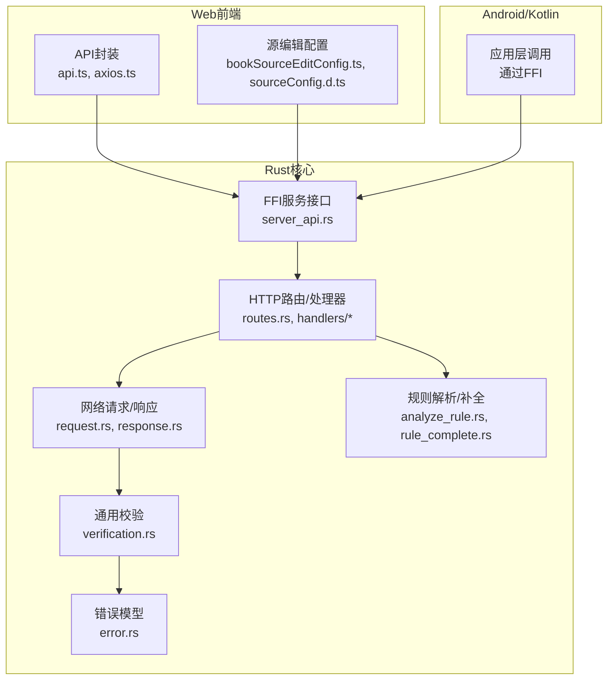
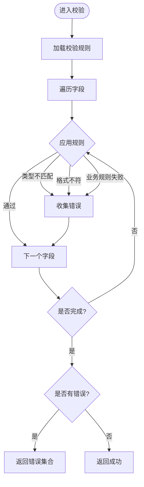
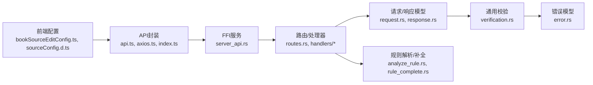

# 数据验证与校验

<cite>
**本文档引用的文件**   
- [verification.rs](file://rust/legado-net/src/verification.rs)
- [error.rs](file://rust/legado-core/src/error.rs)
- [lib.rs](file://rust/legado-core/src/lib.rs)
- [types.rs](file://rust/legado-core/src/types.rs)
- [request.rs](file://rust/legado-net/src/request.rs)
- [response.rs](file://rust/legado-net/src/response.rs)
- [middleware.rs](file://rust/legado-net/src/middleware.rs)
- [source_checker.rs](file://rust/legado-net/src/source_checker.rs)
- [rule_complete.rs](file://rust/legado-parser/src/rule_complete.rs)
- [analyze_rule.rs](file://rust/legado-parser/src/analyze_rule.rs)
- [book_source_edit_config.ts](file://modules/web/src/config/bookSourceEditConfig.ts)
- [sourceConfig.d.ts](file://modules/web/src/config/sourceConfig.d.ts)
- [api.ts](file://modules/web/src/api/api.ts)
- [axios.ts](file://modules/web/src/api/axios.ts)
- [index.ts](file://modules/web/src/api/index.ts)
- [server_api.rs](file://rust/legado-ffi/src/api/server_api.rs)
- [routes.rs](file://rust/legado-server/src/routes.rs)
- [handlers/mod.rs](file://rust/legado-server/src/handlers/mod.rs)
- [error.rs](file://rust/legado-server/src/error.rs)
</cite>

## 目录
1. [简介](#简介)
2. [项目结构](#项目结构)
3. [核心组件](#核心组件)
4. [架构总览](#架构总览)
5. [详细组件分析](#详细组件分析)
6. [依赖关系分析](#依赖关系分析)
7. [性能考量](#性能考量)
8. [故障排查指南](#故障排查指南)
9. [结论](#结论)
10. [附录](#附录)

## 简介
本文件面向Legado项目的数据验证与校验体系，系统性梳理字段类型检查、格式校验、业务规则校验等策略；阐述前后端一致性方案（共享规则、类型同步、接口契约）；说明自定义验证器扩展机制（插件化、复杂逻辑、异步校验）；并给出错误处理与用户体验优化实践。文档同时提供端到端流程图与类图，帮助读者快速理解从前端输入到后端持久化的全链路校验流程。

## 项目结构
Legado采用多语言、多模块协作：
- Rust核心库负责网络请求、解析、数据库与FFI桥接，内置通用校验与错误模型。
- Web前端使用TypeScript/Vue进行表单配置与API调用，定义源编辑配置与类型声明，保证前后端契约一致。
- Android/Kotlin应用层通过FFI调用Rust能力，复用同一套校验与错误语义。



**图表来源** 
- [request.rs](file://rust/legado-net/src/request.rs)
- [response.rs](file://rust/legado-net/src/response.rs)
- [verification.rs](file://rust/legado-net/src/verification.rs)
- [error.rs](file://rust/legado-core/src/error.rs)
- [analyze_rule.rs](file://rust/legado-parser/src/analyze_rule.rs)
- [rule_complete.rs](file://rust/legado-parser/src/rule_complete.rs)
- [server_api.rs](file://rust/legado-ffi/src/api/server_api.rs)
- [routes.rs](file://rust/legado-server/src/routes.rs)
- [bookSourceEditConfig.ts](file://modules/web/src/config/bookSourceEditConfig.ts)
- [sourceConfig.d.ts](file://modules/web/src/config/sourceConfig.d.ts)
- [api.ts](file://modules/web/src/api/api.ts)
- [axios.ts](file://modules/web/src/api/axios.ts)

**章节来源**
- [lib.rs](file://rust/legado-core/src/lib.rs)
- [types.rs](file://rust/legado-core/src/types.rs)

## 核心组件
- 通用校验器（verification.rs）：提供字段存在性、类型断言、范围/长度/正则等基础校验能力，可组合为复合规则。
- 请求/响应模型（request.rs, response.rs）：统一序列化/反序列化的边界校验入口，确保入参合法、出参稳定。
- 错误模型（error.rs）：标准化错误码、消息与上下文，便于前端展示与调试。
- 规则解析与补全（analyze_rule.rs, rule_complete.rs）：对源规则进行完整性检查与默认值填充，保障解析稳定性。
- 前端配置与类型（bookSourceEditConfig.ts, sourceConfig.d.ts）：定义表单字段、校验规则与类型约束，驱动编辑器行为。
- API封装（api.ts, axios.ts, index.ts）：统一请求拦截、参数序列化、错误映射，保证前后端契约一致。
- FFI与服务层（server_api.rs, routes.rs, handlers/*）：对外暴露的HTTP接口，承载参数校验、权限检查与业务编排。

**章节来源**
- [verification.rs](file://rust/legado-net/src/verification.rs)
- [request.rs](file://rust/legado-net/src/request.rs)
- [response.rs](file://rust/legado-net/src/response.rs)
- [error.rs](file://rust/legado-core/src/error.rs)
- [analyze_rule.rs](file://rust/legado-parser/src/analyze_rule.rs)
- [rule_complete.rs](file://rust/legado-parser/src/rule_complete.rs)
- [bookSourceEditConfig.ts](file://modules/web/src/config/bookSourceEditConfig.ts)
- [sourceConfig.d.ts](file://modules/web/src/config/sourceConfig.d.ts)
- [api.ts](file://modules/web/src/api/api.ts)
- [axios.ts](file://modules/web/src/api/axios.ts)
- [index.ts](file://modules/web/src/api/index.ts)
- [server_api.rs](file://rust/legado-ffi/src/api/server_api.rs)
- [routes.rs](file://rust/legado-server/src/routes.rs)

## 架构总览
下图展示了从前端表单提交到后端校验、解析、存储的完整流程，以及错误在链路中的传播方式。

```mermaid
sequenceDiagram
participant FE as "前端页面"
participant API as "API封装<br/>api.ts/axios.ts"
participant FFI as "FFI服务<br/>server_api.rs"
participant RT as "路由/处理器<br/>routes.rs/handlers"
participant REQ as "请求模型<br/>request.rs"
participant VER as "通用校验<br/>verification.rs"
participant PAR as "规则解析/补全<br/>analyze_rule.rs/rule_complete.rs"
participant DB as "数据库/持久化"
participant ERR as "错误模型<br/>error.rs"
FE->>API : 提交表单数据
API->>FFI : 构造请求并发送
FFI->>RT : 路由分发
RT->>REQ : 反序列化入参
REQ->>VER : 执行字段校验
VER-->>REQ : 校验结果成功/失败
alt 校验失败
REQ->>ERR : 生成错误对象
ERR-->>RT : 返回错误
RT-->>API : HTTP错误响应
API-->>FE : 用户友好提示
else 校验成功
RT->>PAR : 规则解析与补全
PAR-->>RT : 结构化数据
RT->>DB : 写入或查询
DB-->>RT : 结果
RT-->>API : 成功响应
API-->>FE : 渲染结果
end
```

**图表来源** 
- [api.ts](file://modules/web/src/api/api.ts)
- [axios.ts](file://modules/web/src/api/axios.ts)
- [server_api.rs](file://rust/legado-ffi/src/api/server_api.rs)
- [routes.rs](file://rust/legado-server/src/routes.rs)
- [request.rs](file://rust/legado-net/src/request.rs)
- [verification.rs](file://rust/legado-net/src/verification.rs)
- [analyze_rule.rs](file://rust/legado-parser/src/analyze_rule.rs)
- [rule_complete.rs](file://rust/legado-parser/src/rule_complete.rs)
- [error.rs](file://rust/legado-core/src/error.rs)

## 详细组件分析

### 通用校验器（verification.rs）
- 职责：提供字段存在性、类型断言、长度/范围/枚举/正则等基础校验；支持链式组合与条件校验。
- 设计要点：
  - 将校验规则抽象为可复用的“校验器”，便于在不同请求/实体间复用。
  - 支持短路校验与批量收集错误，避免重复计算。
  - 与错误模型对接，输出统一的错误结构。
- 复杂度：线性于字段数量与规则数量；可通过缓存规则描述降低重复开销。
- 可扩展点：新增自定义校验器（同步/异步），注册到校验器工厂。



**图表来源** 
- [verification.rs](file://rust/legado-net/src/verification.rs)
- [error.rs](file://rust/legado-core/src/error.rs)

**章节来源**
- [verification.rs](file://rust/legado-net/src/verification.rs)
- [error.rs](file://rust/legado-core/src/error.rs)

### 请求/响应模型（request.rs, response.rs）
- 职责：定义入参/出参的数据结构与序列化策略；在反序列化阶段触发基础校验。
- 关键点：
  - 使用强类型字段与可选字段，结合默认值与必填标记。
  - 在反序列化钩子中集成通用校验器，实现“一次定义，处处生效”。
  - 响应体包含状态码、消息与数据载荷，便于前端统一处理。
- 性能：避免在反序列化路径中进行昂贵操作；必要时延迟校验。

**章节来源**
- [request.rs](file://rust/legado-net/src/request.rs)
- [response.rs](file://rust/legado-net/src/response.rs)

### 规则解析与补全（analyze_rule.rs, rule_complete.rs）
- 职责：对源规则进行完整性检查、缺失项补全、默认值注入与兼容性处理。
- 关键点：
  - 识别必需字段与可选字段，缺失时按策略填充或报错。
  - 对正则、XPath、JSONPath等表达式进行语法检查。
  - 提供增量更新与回滚能力，保证解析过程可观测。
- 适用场景：源编辑、批量导入、版本迁移。

**章节来源**
- [analyze_rule.rs](file://rust/legado-parser/src/analyze_rule.rs)
- [rule_complete.rs](file://rust/legado-parser/src/rule_complete.rs)

### 前端配置与类型（bookSourceEditConfig.ts, sourceConfig.d.ts）
- 职责：定义源编辑器的表单字段、校验规则与类型约束，驱动UI交互与提交前校验。
- 关键点：
  - 字段类型、长度、正则、必填等规则与后端保持一致。
  - 提供本地预览与即时反馈，减少无效请求。
  - 类型声明集中管理，避免前后端类型漂移。
- 一致性策略：以类型声明为单一事实来源，自动生成部分校验代码。

**章节来源**
- [bookSourceEditConfig.ts](file://modules/web/src/config/bookSourceEditConfig.ts)
- [sourceConfig.d.ts](file://modules/web/src/config/sourceConfig.d.ts)

### API封装与拦截（api.ts, axios.ts, index.ts）
- 职责：统一请求构造、参数序列化、错误映射与重试策略。
- 关键点：
  - 在请求拦截器中进行前端校验，尽早失败。
  - 在响应拦截器中将后端错误转换为统一结构，便于前端展示。
  - 支持超时、重试、取消等网络级控制。
- 一致性：与后端错误模型对齐，保证错误信息可读性与可定位性。

**章节来源**
- [api.ts](file://modules/web/src/api/api.ts)
- [axios.ts](file://modules/web/src/api/axios.ts)
- [index.ts](file://modules/web/src/api/index.ts)

### FFI与服务层（server_api.rs, routes.rs, handlers/*）
- 职责：对外暴露HTTP接口，承载参数校验、权限检查、业务编排与结果返回。
- 关键点：
  - 路由层解析路径与查询参数，分发给处理器。
  - 处理器调用通用校验器与规则解析器，确保数据合法性。
  - 错误统一由错误模型包装，保持跨层一致性。
- 扩展性：处理器可组合多个校验器与业务服务，形成清晰的分层。

**章节来源**
- [server_api.rs](file://rust/legado-ffi/src/api/server_api.rs)
- [routes.rs](file://rust/legado-server/src/routes.rs)
- [handlers/mod.rs](file://rust/legado-server/src/handlers/mod.rs)

### 错误模型（error.rs）
- 职责：定义错误码、消息模板、上下文信息与堆栈追踪。
- 关键点：
  - 区分系统错误、业务错误与用户输入错误。
  - 提供人类可读的消息与开发者调试信息分离。
  - 支持国际化与动态插值。
- 使用建议：所有校验失败均通过该模型上报，前端据此展示友好提示。

**章节来源**
- [error.rs](file://rust/legado-core/src/error.rs)

## 依赖关系分析


**图表来源** 
- [bookSourceEditConfig.ts](file://modules/web/src/config/bookSourceEditConfig.ts)
- [sourceConfig.d.ts](file://modules/web/src/config/sourceConfig.d.ts)
- [api.ts](file://modules/web/src/api/api.ts)
- [axios.ts](file://modules/web/src/api/axios.ts)
- [index.ts](file://modules/web/src/api/index.ts)
- [server_api.rs](file://rust/legado-ffi/src/api/server_api.rs)
- [routes.rs](file://rust/legado-server/src/routes.rs)
- [handlers/mod.rs](file://rust/legado-server/src/handlers/mod.rs)
- [request.rs](file://rust/legado-net/src/request.rs)
- [response.rs](file://rust/legado-net/src/response.rs)
- [verification.rs](file://rust/legado-net/src/verification.rs)
- [error.rs](file://rust/legado-core/src/error.rs)
- [analyze_rule.rs](file://rust/legado-parser/src/analyze_rule.rs)
- [rule_complete.rs](file://rust/legado-parser/src/rule_complete.rs)

**章节来源**
- [lib.rs](file://rust/legado-core/src/lib.rs)
- [types.rs](file://rust/legado-core/src/types.rs)

## 性能考量
- 校验规则缓存：对静态规则进行编译/缓存，避免重复解析。
- 短路策略：在首个严重错误处提前返回，减少不必要计算。
- 批量校验：对列表型字段采用并行或批处理校验，降低往返次数。
- 延迟校验：对昂贵校验（如远程唯一性检查）按需触发。
- 内存占用：避免在高频路径创建大量临时对象，尽量复用缓冲区。

[本节为通用指导，无需特定文件引用]

## 故障排查指南
- 常见错误分类：
  - 字段缺失或类型不匹配：检查请求体结构与类型声明是否一致。
  - 格式校验失败：确认正则、日期、数值范围是否符合预期。
  - 业务规则失败：核对业务约束与上游依赖（如唯一性、权限）。
- 定位步骤：
  - 查看错误模型中的错误码与消息，定位具体字段与规则。
  - 启用调试日志，观察校验链路与规则命中情况。
  - 对比前端类型声明与后端模型，排除类型漂移。
- 用户体验优化：
  - 前端即时校验与占位提示，减少无效提交。
  - 错误信息分层：对用户显示友好提示，对开发者保留详细上下文。
  - 提供重试与修正引导，提升成功率。

**章节来源**
- [error.rs](file://rust/legado-core/src/error.rs)
- [api.ts](file://modules/web/src/api/api.ts)
- [axios.ts](file://modules/web/src/api/axios.ts)

## 结论
Legado的数据验证与校验体系以“强类型+规则化”为核心，贯穿前端、网络、解析与持久化各层。通过通用校验器、统一错误模型与前后端类型同步，实现了高一致性、高可维护性的校验框架。建议在新增功能时优先定义类型与规则，复用现有校验器，并遵循错误模型的规范，以确保用户体验与系统稳定性。

[本节为总结性内容，无需特定文件引用]

## 附录
- 最佳实践清单：
  - 以类型声明为单一事实来源，前后端共享。
  - 将校验规则与业务逻辑解耦，便于测试与维护。
  - 对敏感字段进行二次校验（服务端不可信原则）。
  - 为复杂校验编写单元测试与集成测试。
  - 错误信息国际化与分级展示。
- 参考路径：
  - 通用校验器：[verification.rs](file://rust/legado-net/src/verification.rs)
  - 错误模型：[error.rs](file://rust/legado-core/src/error.rs)
  - 请求/响应模型：[request.rs](file://rust/legado-net/src/request.rs), [response.rs](file://rust/legado-net/src/response.rs)
  - 规则解析/补全：[analyze_rule.rs](file://rust/legado-parser/src/analyze_rule.rs), [rule_complete.rs](file://rust/legado-parser/src/rule_complete.rs)
  - 前端配置与类型：[bookSourceEditConfig.ts](file://modules/web/src/config/bookSourceEditConfig.ts), [sourceConfig.d.ts](file://modules/web/src/config/sourceConfig.d.ts)
  - API封装：[api.ts](file://modules/web/src/api/api.ts), [axios.ts](file://modules/web/src/api/axios.ts), [index.ts](file://modules/web/src/api/index.ts)
  - FFI与服务层：[server_api.rs](file://rust/legado-ffi/src/api/server_api.rs), [routes.rs](file://rust/legado-server/src/routes.rs), [handlers/mod.rs](file://rust/legado-server/src/handlers/mod.rs)