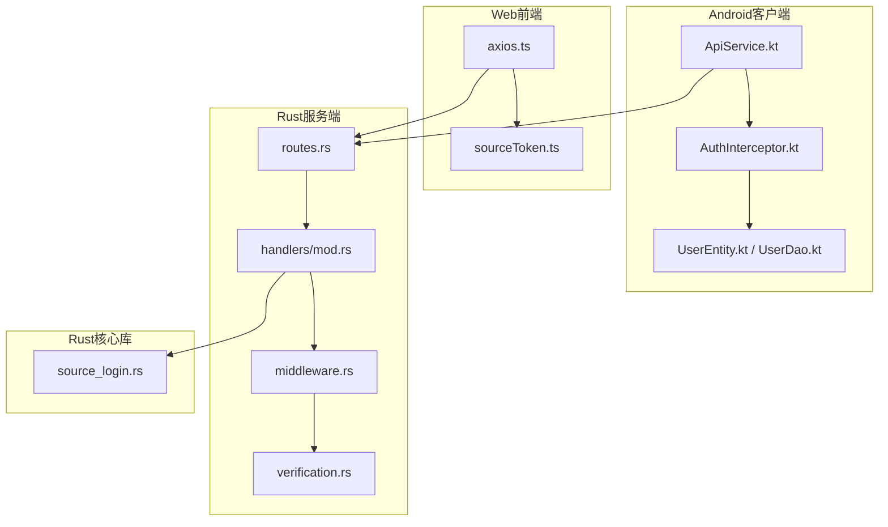
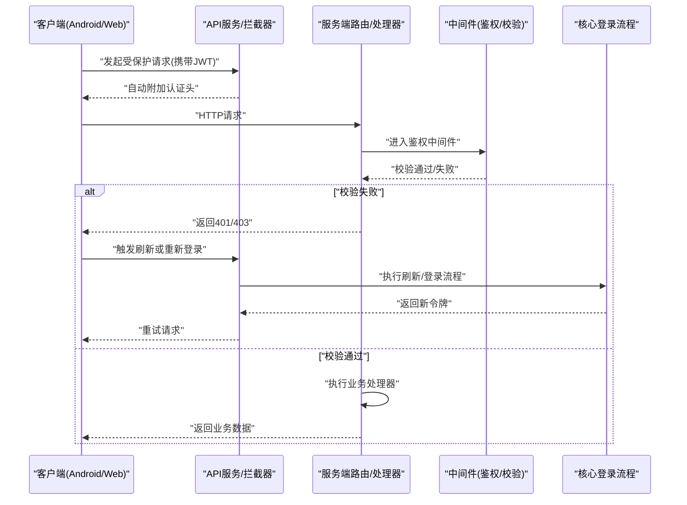
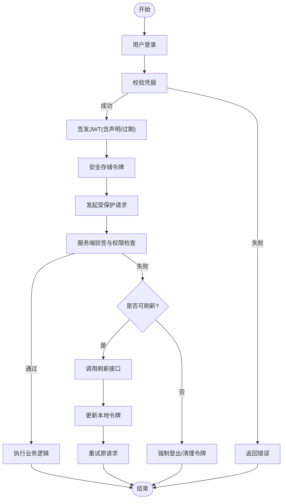
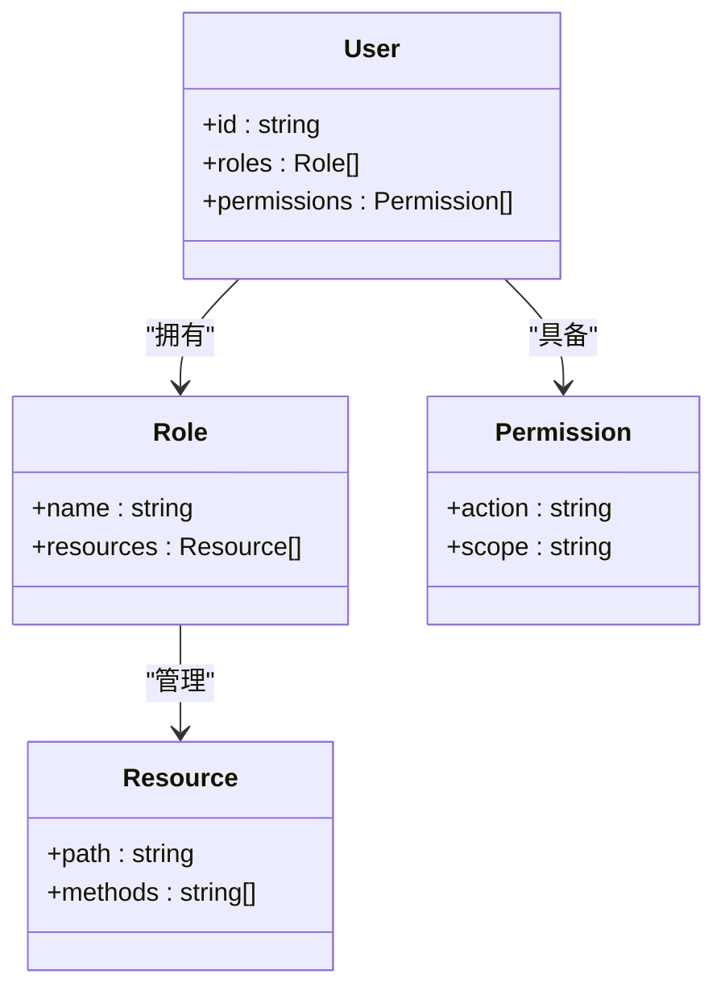
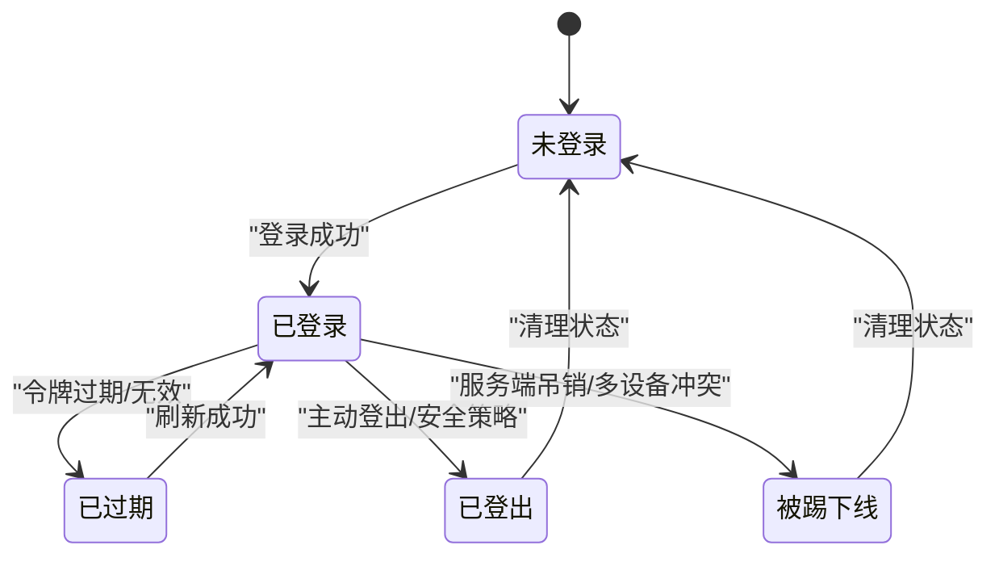
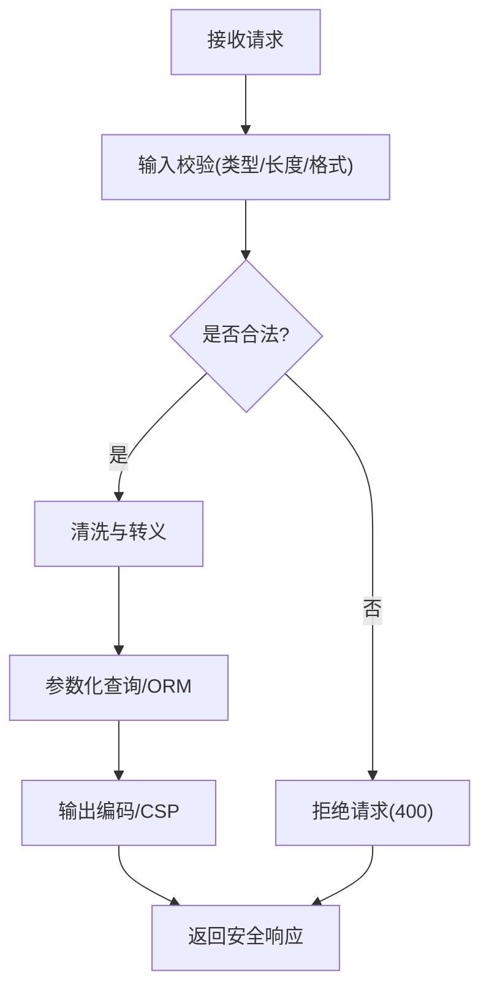
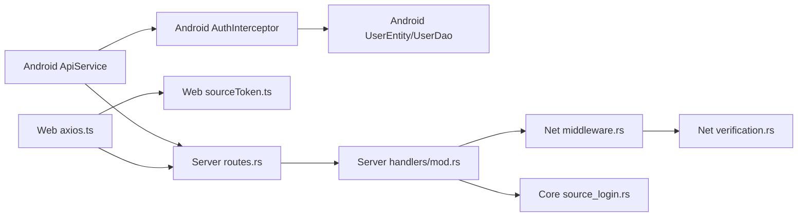

# 认证授权机制

<cite>
**本文引用的文件**   
- [app/src/main/java/io/legado/app/api/ApiService.kt](file://app/src/main/java/io/legado/app/api/ApiService.kt)
- [app/src/main/java/io/legado/app/api/interceptor/AuthInterceptor.kt](file://app/src/main/java/io/legado/app/api/interceptor/AuthInterceptor.kt)
- [app/src/main/java/io/legado/app/data/entity/UserEntity.kt](file://app/src/main/java/io/legado/app/data/entity/UserEntity.kt)
- [app/src/main/java/io/legado/app/data/dao/UserDao.kt](file://app/src/main/java/io/legado/app/data/dao/UserDao.kt)
- [modules/web/src/api/axios.ts](file://modules/web/src/api/axios.ts)
- [modules/web/src/api/sourceToken.ts](file://modules/web/src/api/sourceToken.ts)
- [rust/legado-server/src/routes.rs](file://rust/legado-server/src/routes.rs)
- [rust/legado-server/src/handlers/mod.rs](file://rust/legado-server/src/handlers/mod.rs)
- [rust/legado-core/src/source_login.rs](file://rust/legado-core/src/source_login.rs)
- [rust/legado-net/src/middleware.rs](file://rust/legado-net/src/middleware.rs)
- [rust/legado-net/src/verification.rs](file://rust/legado-net/src/verification.rs)
</cite>

## 目录
1. [简介](#简介)
2. [项目结构](#项目结构)
3. [核心组件](#核心组件)
4. [架构总览](#架构总览)
5. [详细组件分析](#详细组件分析)
6. [依赖关系分析](#依赖关系分析)
7. [性能考虑](#性能考虑)
8. [故障排查指南](#故障排查指南)
9. [结论](#结论)
10. [附录](#附录)

## 简介
本文件面向Legado项目的认证与授权机制，聚焦以下目标：
- JWT令牌机制：生成、验证、刷新与安全存储策略
- 权限控制模型：角色管理、资源访问控制、操作权限等安全策略
- 会话管理：登录状态维护、会话超时处理、多设备支持
- API安全防护：输入校验、SQL注入防护、XSS防护等实践
- 提供完整实现示例与最佳实践指南

说明：本项目为跨端应用（Android/Kotlin、Flutter、Web前端、Rust后端），认证授权涉及客户端与服务端协同。下文将结合仓库中的关键代码位置进行系统性说明。

## 项目结构
从仓库结构看，认证相关能力分布在多个模块：
- Android客户端：API服务定义、拦截器、用户实体与DAO
- Web前端：HTTP封装、源令牌管理
- Rust服务端：路由、处理器、网络中间件、校验工具
- Rust核心库：源登录流程抽象

图表来源 
- [app/src/main/java/io/legado/app/api/ApiService.kt](file://app/src/main/java/io/legado/app/api/ApiService.kt)
- [app/src/main/java/io/legado/app/api/interceptor/AuthInterceptor.kt](file://app/src/main/java/io/legado/app/api/interceptor/AuthInterceptor.kt)
- [app/src/main/java/io/legado/app/data/entity/UserEntity.kt](file://app/src/main/java/io/legado/app/data/entity/UserEntity.kt)
- [app/src/main/java/io/legado/app/data/dao/UserDao.kt](file://app/src/main/java/io/legado/app/data/dao/UserDao.kt)
- [modules/web/src/api/axios.ts](file://modules/web/src/api/axios.ts)
- [modules/web/src/api/sourceToken.ts](file://modules/web/src/api/sourceToken.ts)
- [rust/legado-server/src/routes.rs](file://rust/legado-server/src/routes.rs)
- [rust/legado-server/src/handlers/mod.rs](file://rust/legado-server/src/handlers/mod.rs)
- [rust/legado-net/src/middleware.rs](file://rust/legado-net/src/middleware.rs)
- [rust/legado-net/src/verification.rs](file://rust/legado-net/src/verification.rs)
- [rust/legado-core/src/source_login.rs](file://rust/legado-core/src/source_login.rs)

章节来源
- [app/src/main/java/io/legado/app/api/ApiService.kt](file://app/src/main/java/io/legado/app/api/ApiService.kt)
- [rust/legado-server/src/routes.rs](file://rust/legado-server/src/routes.rs)

## 核心组件
- 客户端API服务与拦截器：负责在请求头中附加认证信息（如JWT）、处理响应中的鉴权失败并触发刷新或重新登录
- 用户数据持久化：用户实体与DAO用于本地保存用户信息与令牌
- Web前端HTTP封装：统一处理请求拦截、令牌注入与错误处理
- 服务端路由与处理器：定义认证相关接口（登录、刷新、登出）及受保护资源访问
- 网络中间件与校验：统一鉴权、输入校验、速率限制、防重放等
- 核心登录流程：抽象源登录逻辑，便于扩展不同源的认证方式

章节来源
- [app/src/main/java/io/legado/app/api/interceptor/AuthInterceptor.kt](file://app/src/main/java/io/legado/app/api/interceptor/AuthInterceptor.kt)
- [app/src/main/java/io/legado/app/data/entity/UserEntity.kt](file://app/src/main/java/io/legado/app/data/entity/UserEntity.kt)
- [app/src/main/java/io/legado/app/data/dao/UserDao.kt](file://app/src/main/java/io/legado/app/data/dao/UserDao.kt)
- [modules/web/src/api/axios.ts](file://modules/web/src/api/axios.ts)
- [modules/web/src/api/sourceToken.ts](file://modules/web/src/api/sourceToken.ts)
- [rust/legado-server/src/handlers/mod.rs](file://rust/legado-server/src/handlers/mod.rs)
- [rust/legado-net/src/middleware.rs](file://rust/legado-net/src/middleware.rs)
- [rust/legado-net/src/verification.rs](file://rust/legado-net/src/verification.rs)
- [rust/legado-core/src/source_login.rs](file://rust/legado-core/src/source_login.rs)

## 架构总览
整体认证授权流程遵循“客户端持有JWT，服务端校验签名与权限”的模式。关键交互如下：

图表来源 
- [app/src/main/java/io/legado/app/api/ApiService.kt](file://app/src/main/java/io/legado/app/api/ApiService.kt)
- [app/src/main/java/io/legado/app/api/interceptor/AuthInterceptor.kt](file://app/src/main/java/io/legado/app/api/interceptor/AuthInterceptor.kt)
- [modules/web/src/api/axios.ts](file://modules/web/src/api/axios.ts)
- [rust/legado-server/src/routes.rs](file://rust/legado-server/src/routes.rs)
- [rust/legado-server/src/handlers/mod.rs](file://rust/legado-server/src/handlers/mod.rs)
- [rust/legado-net/src/middleware.rs](file://rust/legado-net/src/middleware.rs)
- [rust/legado-core/src/source_login.rs](file://rust/legado-core/src/source_login.rs)

## 详细组件分析

### JWT令牌机制
- 令牌生成：服务端在成功登录后签发JWT，包含用户标识、角色、过期时间等声明；签名使用强密钥算法，避免伪造
- 令牌验证：服务端中间件对每个受保护请求解析并验签，检查过期、吊销列表（可选）
- 令牌刷新：客户端检测到即将过期或收到401时，调用刷新接口获取新令牌；刷新需校验原令牌有效性并绑定设备上下文
- 安全存储：客户端将JWT存储在安全区域（Android Keystore/SecureStorage），避免明文暴露；Web端优先使用HttpOnly Cookie或内存存储

章节来源
- [rust/legado-net/src/middleware.rs](file://rust/legado-net/src/middleware.rs)
- [rust/legado-net/src/verification.rs](file://rust/legado-net/src/verification.rs)
- [app/src/main/java/io/legado/app/api/interceptor/AuthInterceptor.kt](file://app/src/main/java/io/legado/app/api/interceptor/AuthInterceptor.kt)
- [modules/web/src/api/axios.ts](file://modules/web/src/api/axios.ts)
- [modules/web/src/api/sourceToken.ts](file://modules/web/src/api/sourceToken.ts)

### 权限控制模型
- 角色管理：基于角色的访问控制（RBAC），用户拥有角色集合，角色关联资源与操作权限
- 资源访问控制：服务端按资源路径或控制器方法配置权限策略，未授权访问返回403
- 操作权限：细粒度到具体动作（读/写/删除），在处理器或中间件中校验
- 最小权限原则：默认拒绝，显式授权；定期审计角色与权限映射

章节来源
- [rust/legado-server/src/handlers/mod.rs](file://rust/legado-server/src/handlers/mod.rs)
- [rust/legado-net/src/middleware.rs](file://rust/legado-net/src/middleware.rs)

### 会话管理机制
- 登录状态维护：客户端在本地保存用户会话状态（令牌、用户信息、最后登录时间）
- 会话超时处理：服务端设置短生命周期令牌，客户端定时刷新；长时间无活动则强制登出
- 多设备支持：令牌绑定设备指纹或会话ID，支持并发登录与单点登出策略

章节来源
- [app/src/main/java/io/legado/app/data/entity/UserEntity.kt](file://app/src/main/java/io/legado/app/data/entity/UserEntity.kt)
- [app/src/main/java/io/legado/app/data/dao/UserDao.kt](file://app/src/main/java/io/legado/app/data/dao/UserDao.kt)
- [modules/web/src/api/sourceToken.ts](file://modules/web/src/api/sourceToken.ts)

### API安全防护措施
- 输入验证：服务端对所有入参进行类型、长度、格式校验，拒绝非法输入
- SQL注入防护：使用参数化查询与ORM，禁止拼接SQL；对动态条件进行白名单过滤
- XSS防护：输出编码、CSP策略、禁用危险HTML标签；前端对用户输入进行转义
- 其他防护：HTTPS强制、速率限制、CSRF防护（针对表单提交）、敏感日志脱敏

章节来源
- [rust/legado-net/src/verification.rs](file://rust/legado-net/src/verification.rs)
- [rust/legado-net/src/middleware.rs](file://rust/legado-net/src/middleware.rs)

### 完整实现示例与最佳实践
- 登录流程：客户端提交用户名密码，服务端校验后签发JWT并返回；客户端安全存储
- 刷新流程：客户端检测过期或收到401，调用刷新接口，服务端校验原令牌并颁发新令牌
- 权限校验：服务端中间件根据角色与资源策略决定允许或拒绝
- 安全存储：Android使用Keystore，Web使用HttpOnly Cookie或内存；避免localStorage明文存储
- 错误处理：统一错误码与消息，区分401（未认证）与403（未授权）

章节来源
- [rust/legado-core/src/source_login.rs](file://rust/legado-core/src/source_login.rs)
- [app/src/main/java/io/legado/app/api/ApiService.kt](file://app/src/main/java/io/legado/app/api/ApiService.kt)
- [modules/web/src/api/axios.ts](file://modules/web/src/api/axios.ts)

## 依赖关系分析
认证授权涉及的模块间依赖如下：

图表来源 
- [app/src/main/java/io/legado/app/api/ApiService.kt](file://app/src/main/java/io/legado/app/api/ApiService.kt)
- [app/src/main/java/io/legado/app/api/interceptor/AuthInterceptor.kt](file://app/src/main/java/io/legado/app/api/interceptor/AuthInterceptor.kt)
- [app/src/main/java/io/legado/app/data/entity/UserEntity.kt](file://app/src/main/java/io/legado/app/data/entity/UserEntity.kt)
- [app/src/main/java/io/legado/app/data/dao/UserDao.kt](file://app/src/main/java/io/legado/app/data/dao/UserDao.kt)
- [modules/web/src/api/axios.ts](file://modules/web/src/api/axios.ts)
- [modules/web/src/api/sourceToken.ts](file://modules/web/src/api/sourceToken.ts)
- [rust/legado-server/src/routes.rs](file://rust/legado-server/src/routes.rs)
- [rust/legado-server/src/handlers/mod.rs](file://rust/legado-server/src/handlers/mod.rs)
- [rust/legado-net/src/middleware.rs](file://rust/legado-net/src/middleware.rs)
- [rust/legado-net/src/verification.rs](file://rust/legado-net/src/verification.rs)
- [rust/legado-core/src/source_login.rs](file://rust/legado-core/src/source_login.rs)

章节来源
- [rust/legado-server/src/routes.rs](file://rust/legado-server/src/routes.rs)
- [rust/legado-net/src/middleware.rs](file://rust/legado-net/src/middleware.rs)

## 性能考虑
- 令牌校验开销：服务端应缓存公钥或签名验证结果，减少重复计算
- 数据库查询：权限与用户信息查询使用索引与缓存，避免N+1问题
- 网络重试：客户端合理设置重试次数与退避策略，避免雪崩
- 会话刷新：批量刷新与去重，降低服务端压力

[本节为通用指导，不直接分析具体文件]

## 故障排查指南
- 常见问题
  - 401未认证：检查令牌是否存在、是否过期、是否被吊销
  - 403未授权：检查用户角色与资源权限映射是否正确
  - 刷新失败：检查刷新令牌有效性、设备上下文一致性
- 调试建议
  - 启用详细日志（脱敏），记录请求头、响应码、错误堆栈
  - 使用抓包工具验证JWT结构与签名
  - 单元测试覆盖登录、刷新、权限校验路径

章节来源
- [rust/legado-net/src/middleware.rs](file://rust/legado-net/src/middleware.rs)
- [rust/legado-net/src/verification.rs](file://rust/legado-net/src/verification.rs)
- [app/src/main/java/io/legado/app/api/interceptor/AuthInterceptor.kt](file://app/src/main/java/io/legado/app/api/interceptor/AuthInterceptor.kt)

## 结论
Legado的认证授权体系以JWT为核心，结合客户端拦截器与服务端中间件实现端到端的安全控制。通过RBAC权限模型、严格的输入校验与安全存储策略，保障用户数据与系统资源的安全。建议在后续迭代中持续优化令牌生命周期管理、权限审计与异常监控，提升整体安全性与用户体验。

[本节为总结性内容，不直接分析具体文件]

## 附录
- 术语表
  - JWT：JSON Web Token，用于身份认证的令牌
  - RBAC：基于角色的访问控制
  - CSP：内容安全策略，防止XSS攻击
- 参考实现路径
  - 客户端拦截器：[app/src/main/java/io/legado/app/api/interceptor/AuthInterceptor.kt](file://app/src/main/java/io/legado/app/api/interceptor/AuthInterceptor.kt)
  - Web HTTP封装：[modules/web/src/api/axios.ts](file://modules/web/src/api/axios.ts)
  - 服务端中间件：[rust/legado-net/src/middleware.rs](file://rust/legado-net/src/middleware.rs)
  - 校验工具：[rust/legado-net/src/verification.rs](file://rust/legado-net/src/verification.rs)
  - 核心登录流程：[rust/legado-core/src/source_login.rs](file://rust/legado-core/src/source_login.rs)

[本节为补充信息，不直接分析具体文件]