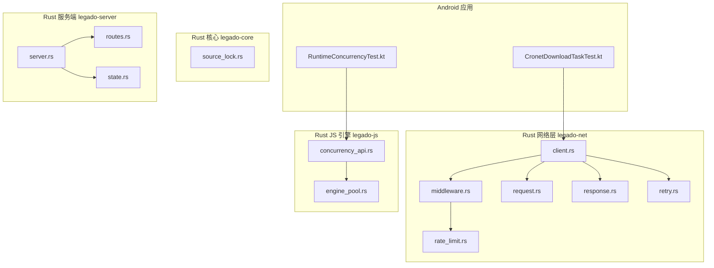
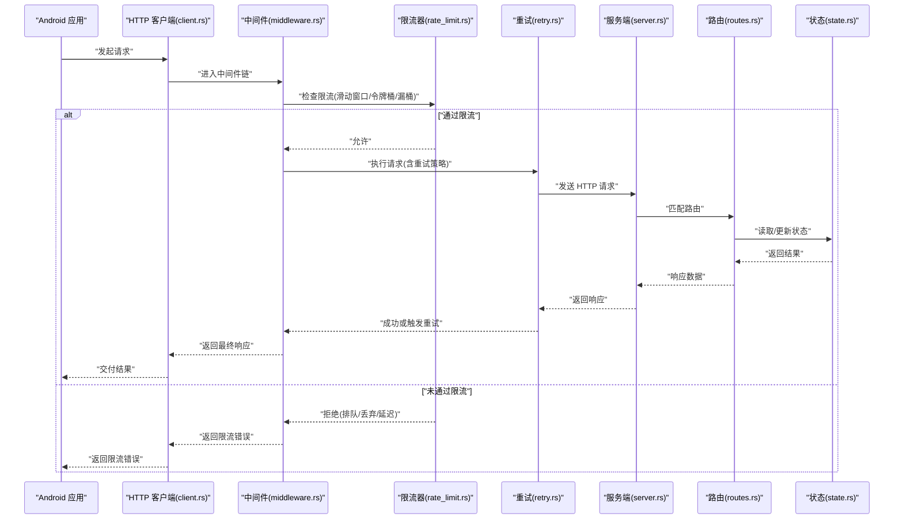
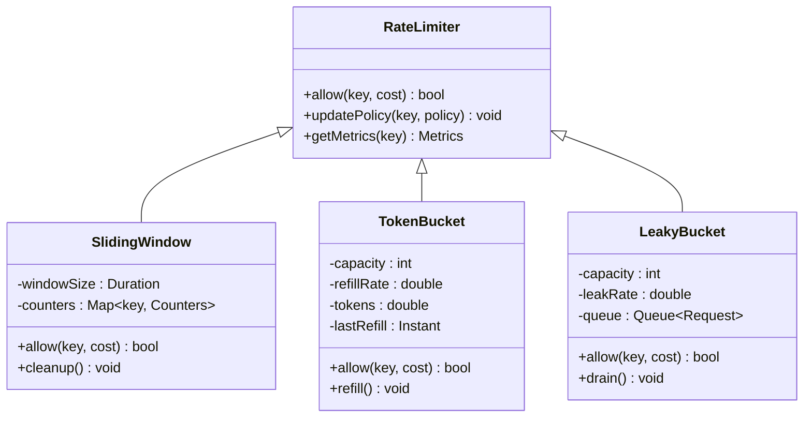
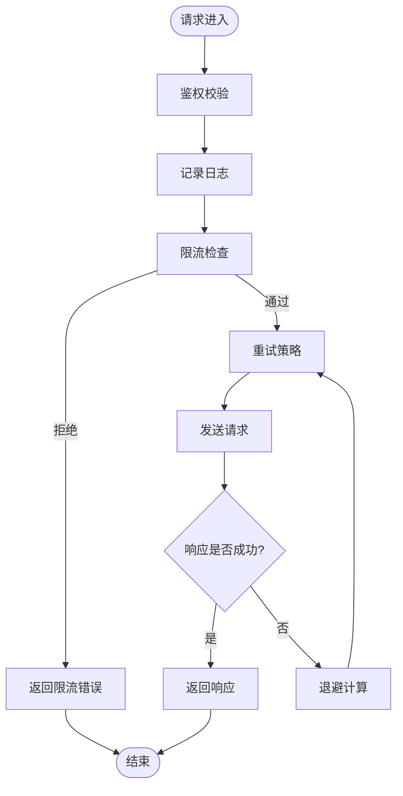
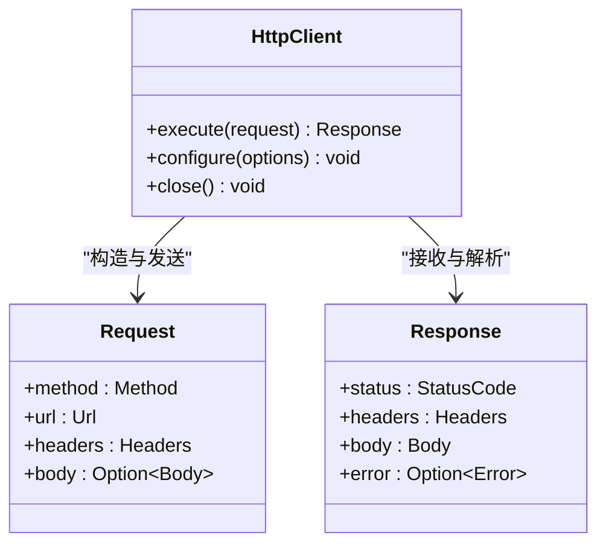
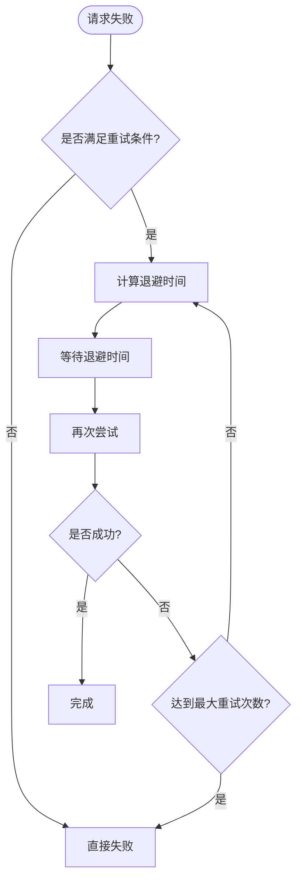
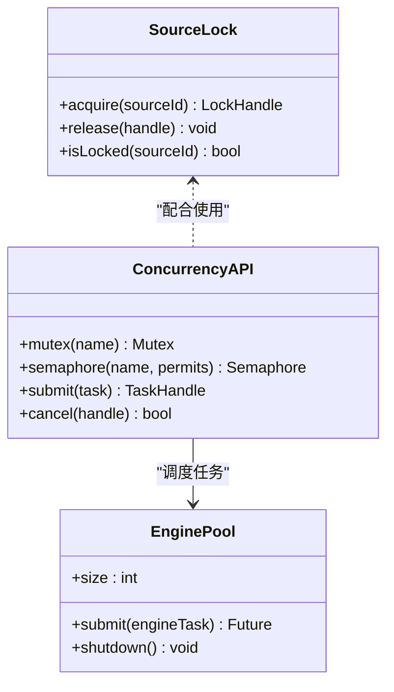
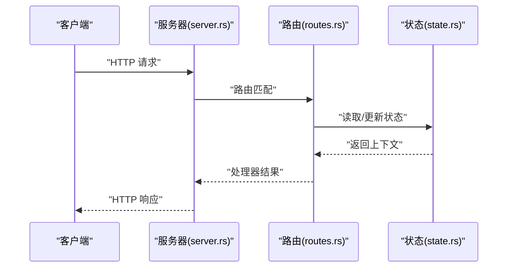
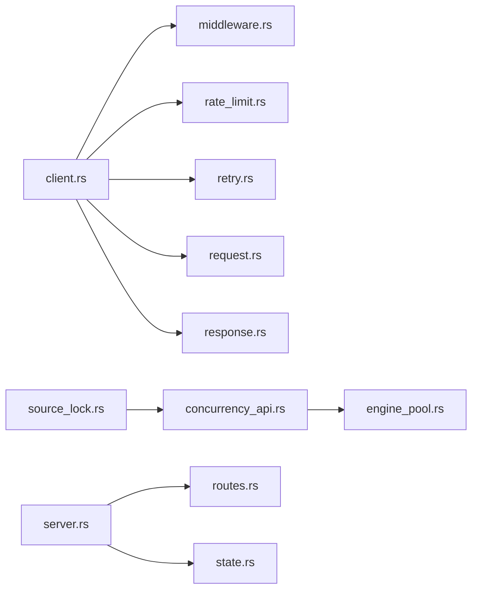

# 速率限制与防抖

<cite>
**本文引用的文件**   
- [rate_limit.rs](file://rust/legado-net/src/rate_limit.rs)
- [middleware.rs](file://rust/legado-net/src/middleware.rs)
- [client.rs](file://rust/legado-net/src/client.rs)
- [request.rs](file://rust/legado-net/src/request.rs)
- [response.rs](file://rust/legado-net/src/response.rs)
- [retry.rs](file://rust/legado-net/src/retry.rs)
- [source_lock.rs](file://rust/legado-core/src/source_lock.rs)
- [concurrency_api.rs](file://rust/legado-js/src/host_api/concurrency_api.rs)
- [engine_pool.rs](file://rust/legado-js/src/engine_pool.rs)
- [server.rs](file://rust/legado-server/src/server.rs)
- [routes.rs](file://rust/legado-server/src/routes.rs)
- [state.rs](file://rust/legado-server/src/state.rs)
- [CronetDownloadTaskTest.kt](file://app/src/test/java/io/legado/app/ci/CronetDownloadTaskTest.kt)
- [RuntimeConcurrencyTest.kt](file://app/src/test/java/io/legado/app/RuntimeConcurrencyTest.kt)
</cite>

## 目录
1. [简介](#简介)
2. [项目结构](#项目结构)
3. [核心组件](#核心组件)
4. [架构总览](#架构总览)
5. [详细组件分析](#详细组件分析)
6. [依赖关系分析](#依赖关系分析)
7. [性能考量](#性能考量)
8. [故障排查指南](#故障排查指南)
9. [结论](#结论)
10. [附录](#附录)

## 简介
本文件围绕“速率限制与防抖”主题，系统化梳理 Legado 在 Rust 网络层、JS 引擎并发控制、服务端请求处理以及 Android 端下载与并发测试中的相关实现。重点覆盖：
- 限流策略设计：滑动窗口、令牌桶、漏桶等算法的适用场景与落地方式
- 并发控制机制：线程池管理、任务队列、资源竞争处理
- 防抖节流技术：请求去重、重复提交防护、高频操作优化
- 限流配置管理：动态调整、分级限流、白名单机制
- 完整示例与调优建议：从代码到实践的可操作性指导

## 项目结构
本项目采用多语言混合架构：
- Rust 网络层（legado-net）提供 HTTP 客户端、中间件、重试与限流能力
- Rust 核心（legado-core）提供源锁等并发控制原语
- Rust JS 引擎（legado-js）暴露并发 API 与引擎池管理
- Rust 服务端（legado-server）承载 Web API，具备路由与状态管理
- Android 应用（app）包含 Cronet 下载任务测试与运行时并发测试

图表来源
- [client.rs](file://rust/legado-net/src/client.rs)
- [middleware.rs](file://rust/legado-net/src/middleware.rs)
- [rate_limit.rs](file://rust/legado-net/src/rate_limit.rs)
- [request.rs](file://rust/legado-net/src/request.rs)
- [response.rs](file://rust/legado-net/src/response.rs)
- [retry.rs](file://rust/legado-net/src/retry.rs)
- [source_lock.rs](file://rust/legado-core/src/source_lock.rs)
- [concurrency_api.rs](file://rust/legado-js/src/host_api/concurrency_api.rs)
- [engine_pool.rs](file://rust/legado-js/src/engine_pool.rs)
- [server.rs](file://rust/legado-server/src/server.rs)
- [routes.rs](file://rust/legado-server/src/routes.rs)
- [state.rs](file://rust/legado-server/src/state.rs)

章节来源
- [client.rs](file://rust/legado-net/src/client.rs)
- [middleware.rs](file://rust/legado-net/src/middleware.rs)
- [rate_limit.rs](file://rust/legado-net/src/rate_limit.rs)
- [source_lock.rs](file://rust/legado-core/src/source_lock.rs)
- [concurrency_api.rs](file://rust/legado-js/src/host_api/concurrency_api.rs)
- [engine_pool.rs](file://rust/legado-js/src/engine_pool.rs)
- [server.rs](file://rust/legado-server/src/server.rs)
- [routes.rs](file://rust/legado-server/src/routes.rs)
- [state.rs](file://rust/legado-server/src/state.rs)
- [CronetDownloadTaskTest.kt](file://app/src/test/java/io/legado/app/ci/CronetDownloadTaskTest.kt)
- [RuntimeConcurrencyTest.kt](file://app/src/test/java/io/legado/app/RuntimeConcurrencyTest.kt)

## 核心组件
- 网络层限流与中间件
  - rate_limit.rs：定义并实现限流器（如滑动窗口、令牌桶、漏桶），提供统一接口供中间件调用
  - middleware.rs：HTTP 请求拦截与处理管线，集成限流、重试、鉴权等横切逻辑
  - client.rs：HTTP 客户端封装，负责构建请求、执行调用、处理响应与错误
  - request.rs / response.rs：请求与响应数据结构定义及序列化/反序列化
  - retry.rs：失败重试策略（退避、次数上限、条件重试）

- 并发控制与资源保护
  - source_lock.rs：针对数据源的细粒度锁，避免同一源的并发冲突
  - concurrency_api.rs：向 JS 引擎暴露并发控制 API（如信号量、互斥、任务调度）
  - engine_pool.rs：JS 引擎池管理，控制并发度与资源回收

- 服务端请求处理
  - server.rs：HTTP 服务器启动、监听、生命周期管理
  - routes.rs：路由注册与处理器映射
  - state.rs：全局状态与共享资源（含限流配置、白名单等）

- Android 端验证与测试
  - CronetDownloadTaskTest.kt：基于 Cronet 的下载任务并发与限流验证
  - RuntimeConcurrencyTest.kt：运行时并发行为与稳定性测试

章节来源
- [rate_limit.rs](file://rust/legado-net/src/rate_limit.rs)
- [middleware.rs](file://rust/legado-net/src/middleware.rs)
- [client.rs](file://rust/legado-net/src/client.rs)
- [request.rs](file://rust/legado-net/src/request.rs)
- [response.rs](file://rust/legado-net/src/response.rs)
- [retry.rs](file://rust/legado-net/src/retry.rs)
- [source_lock.rs](file://rust/legado-core/src/source_lock.rs)
- [concurrency_api.rs](file://rust/legado-js/src/host_api/concurrency_api.rs)
- [engine_pool.rs](file://rust/legado-js/src/engine_pool.rs)
- [server.rs](file://rust/legado-server/src/server.rs)
- [routes.rs](file://rust/legado-server/src/routes.rs)
- [state.rs](file://rust/legado-server/src/state.rs)
- [CronetDownloadTaskTest.kt](file://app/src/test/java/io/legado/app/ci/CronetDownloadTaskTest.kt)
- [RuntimeConcurrencyTest.kt](file://app/src/test/java/io/legado/app/RuntimeConcurrencyTest.kt)

## 架构总览
下图展示从 Android 发起请求到 Rust 网络层、JS 引擎与服务端的整体流程，突出限流与并发控制的关键节点。

图表来源
- [client.rs](file://rust/legado-net/src/client.rs)
- [middleware.rs](file://rust/legado-net/src/middleware.rs)
- [rate_limit.rs](file://rust/legado-net/src/rate_limit.rs)
- [retry.rs](file://rust/legado-net/src/retry.rs)
- [server.rs](file://rust/legado-server/src/server.rs)
- [routes.rs](file://rust/legado-server/src/routes.rs)
- [state.rs](file://rust/legado-server/src/state.rs)

## 详细组件分析

### 限流器设计与实现（rate_limit.rs）
- 目标：为不同维度（IP、用户、API、数据源）提供统一的限流接口
- 常见算法：
  - 滑动窗口：统计固定时间窗内的请求数，平滑峰值，适合高吞吐场景
  - 令牌桶：以恒定速率生成令牌，突发流量可消耗令牌，适合弹性限流
  - 漏桶：以恒定速率处理请求，突发流量入队等待，适合削峰填谷
- 关键特性：
  - 维度化限流键（key-by）支持按 IP、用户、URL 前缀、源标识等组合
  - 动态阈值调整：运行时修改窗口大小、令牌速率、桶容量
  - 白名单机制：对特定 key 跳过限流或放宽阈值
  - 降级策略：当计数器/令牌存储不可用时，回退到宽松策略或快速失败

图表来源
- [rate_limit.rs](file://rust/legado-net/src/rate_limit.rs)

章节来源
- [rate_limit.rs](file://rust/legado-net/src/rate_limit.rs)

### 中间件与请求管线（middleware.rs）
- 职责：串联鉴权、日志、限流、重试、压缩等横切逻辑
- 限流集成点：在请求发出前调用限流器，根据结果决定放行、排队或拒绝
- 重试集成点：对瞬时错误（超时、5xx）进行指数退避重试
- 扩展性：支持插件式中间件注册与顺序编排

图表来源
- [middleware.rs](file://rust/legado-net/src/middleware.rs)
- [retry.rs](file://rust/legado-net/src/retry.rs)

章节来源
- [middleware.rs](file://rust/legado-net/src/middleware.rs)
- [retry.rs](file://rust/legado-net/src/retry.rs)

### HTTP 客户端与请求/响应（client.rs, request.rs, response.rs）
- client.rs：封装连接池、超时、代理、SSL 配置；协调中间件与重试
- request.rs：定义请求头、体、方法、URL 模板解析
- response.rs：定义状态码、头部、体、错误类型与转换

图表来源
- [client.rs](file://rust/legado-net/src/client.rs)
- [request.rs](file://rust/legado-net/src/request.rs)
- [response.rs](file://rust/legado-net/src/response.rs)

章节来源
- [client.rs](file://rust/legado-net/src/client.rs)
- [request.rs](file://rust/legado-net/src/request.rs)
- [response.rs](file://rust/legado-net/src/response.rs)

### 重试策略（retry.rs）
- 策略类型：固定间隔、线性退避、指数退避、抖动随机
- 触发条件：网络错误、超时、特定状态码
- 上限控制：最大重试次数、总耗时上限、熔断开关

图表来源
- [retry.rs](file://rust/legado-net/src/retry.rs)

章节来源
- [retry.rs](file://rust/legado-net/src/retry.rs)

### 并发控制与资源保护（source_lock.rs, concurrency_api.rs, engine_pool.rs）
- source_lock.rs：按数据源维度加锁，避免并发写入冲突与脏读
- concurrency_api.rs：向 JS 暴露并发原语（互斥、信号量、任务队列），便于脚本侧限流与去重
- engine_pool.rs：管理 JS 引擎实例数量，限制 CPU 密集型任务的并发度

图表来源
- [source_lock.rs](file://rust/legado-core/src/source_lock.rs)
- [concurrency_api.rs](file://rust/legado-js/src/host_api/concurrency_api.rs)
- [engine_pool.rs](file://rust/legado-js/src/engine_pool.rs)

章节来源
- [source_lock.rs](file://rust/legado-core/src/source_lock.rs)
- [concurrency_api.rs](file://rust/legado-js/src/host_api/concurrency_api.rs)
- [engine_pool.rs](file://rust/legado-js/src/engine_pool.rs)

### 服务端请求处理（server.rs, routes.rs, state.rs）
- server.rs：启动 HTTP 服务，绑定端口，加载中间件与路由
- routes.rs：定义 API 路由与处理器，支持路径参数、查询参数
- state.rs：维护全局状态（限流配置、白名单、缓存、指标）

图表来源
- [server.rs](file://rust/legado-server/src/server.rs)
- [routes.rs](file://rust/legado-server/src/routes.rs)
- [state.rs](file://rust/legado-server/src/state.rs)

章节来源
- [server.rs](file://rust/legado-server/src/server.rs)
- [routes.rs](file://rust/legado-server/src/routes.rs)
- [state.rs](file://rust/legado-server/src/state.rs)

### Android 端验证与测试（CronetDownloadTaskTest.kt, RuntimeConcurrencyTest.kt）
- CronetDownloadTaskTest.kt：验证 Cronet 下载任务的并发与限流行为，确保在高并发下稳定
- RuntimeConcurrencyTest.kt：验证运行时并发行为，包括线程切换、内存可见性与竞态条件

章节来源
- [CronetDownloadTaskTest.kt](file://app/src/test/java/io/legado/app/ci/CronetDownloadTaskTest.kt)
- [RuntimeConcurrencyTest.kt](file://app/src/test/java/io/legado/app/RuntimeConcurrencyTest.kt)

## 依赖关系分析
- 网络层依赖：
  - client.rs 依赖 middleware.rs、rate_limit.rs、retry.rs、request.rs、response.rs
- 核心层依赖：
  - source_lock.rs 被 JS 并发 API 与业务逻辑共同引用
- JS 层依赖：
  - concurrency_api.rs 依赖 engine_pool.rs 进行任务调度
- 服务端依赖：
  - server.rs 依赖 routes.rs 与 state.rs 完成请求处理与状态管理

图表来源
- [client.rs](file://rust/legado-net/src/client.rs)
- [middleware.rs](file://rust/legado-net/src/middleware.rs)
- [rate_limit.rs](file://rust/legado-net/src/rate_limit.rs)
- [retry.rs](file://rust/legado-net/src/retry.rs)
- [request.rs](file://rust/legado-net/src/request.rs)
- [response.rs](file://rust/legado-net/src/response.rs)
- [concurrency_api.rs](file://rust/legado-js/src/host_api/concurrency_api.rs)
- [engine_pool.rs](file://rust/legado-js/src/engine_pool.rs)
- [server.rs](file://rust/legado-server/src/server.rs)
- [routes.rs](file://rust/legado-server/src/routes.rs)
- [state.rs](file://rust/legado-server/src/state.rs)
- [source_lock.rs](file://rust/legado-core/src/source_lock.rs)

章节来源
- [client.rs](file://rust/legado-net/src/client.rs)
- [middleware.rs](file://rust/legado-net/src/middleware.rs)
- [rate_limit.rs](file://rust/legado-net/src/rate_limit.rs)
- [retry.rs](file://rust/legado-net/src/retry.rs)
- [request.rs](file://rust/legado-net/src/request.rs)
- [response.rs](file://rust/legado-net/src/response.rs)
- [concurrency_api.rs](file://rust/legado-js/src/host_api/concurrency_api.rs)
- [engine_pool.rs](file://rust/legado-js/src/engine_pool.rs)
- [server.rs](file://rust/legado-server/src/server.rs)
- [routes.rs](file://rust/legado-server/src/routes.rs)
- [state.rs](file://rust/legado-server/src/state.rs)
- [source_lock.rs](file://rust/legado-core/src/source_lock.rs)

## 性能考量
- 限流算法选择：
  - 滑动窗口：适合高吞吐、低延迟场景，注意内存占用与清理策略
  - 令牌桶：适合突发流量与弹性限流，需合理设置容量与填充速率
  - 漏桶：适合削峰填谷，避免下游过载，注意队列长度与丢弃策略
- 并发控制：
  - 线程池大小应与 CPU 核数与 I/O 特性匹配，避免过度切换
  - 任务队列长度需监控，防止内存膨胀与 OOM
  - 资源竞争通过细粒度锁与无锁数据结构降低争用
- 防抖节流：
  - 请求去重：基于 URL+参数哈希去重，避免重复网络请求
  - 重复提交防护：前端按钮禁用与后端幂等键结合
  - 高频操作优化：合并批量请求、延迟执行、采样上报
- 配置管理：
  - 动态调整：热更新限流阈值、白名单、降级策略
  - 分级限流：按用户等级、API 重要性、数据源负载差异化限流
  - 白名单机制：内部服务、管理员、健康检查豁免限流

[本节为通用性能指导，不直接分析具体文件]

## 故障排查指南
- 常见问题：
  - 限流过严导致大量 429 错误：检查窗口大小、令牌速率、白名单配置
  - 重试风暴：确认退避策略、最大重试次数、熔断开关
  - 内存泄漏：监控队列长度、对象生命周期、缓存 TTL
  - 死锁与竞态：检查锁粒度、持有时间、异步回调中的锁使用
- 诊断手段：
  - 启用详细日志与指标采集（QPS、延迟分布、错误率）
  - 使用压测工具模拟高并发，观察限流与重试行为
  - 通过线程快照与堆转储定位热点与泄漏

章节来源
- [middleware.rs](file://rust/legado-net/src/middleware.rs)
- [retry.rs](file://rust/legado-net/src/retry.rs)
- [rate_limit.rs](file://rust/legado-net/src/rate_limit.rs)
- [concurrency_api.rs](file://rust/legado-js/src/host_api/concurrency_api.rs)
- [engine_pool.rs](file://rust/legado-js/src/engine_pool.rs)

## 结论
Legado 在网络层、JS 引擎与服务端构建了完整的速率限制与并发控制体系。通过灵活的限流算法、健壮的中间件管线、细粒度的资源锁与引擎池管理，有效应对高并发与不稳定网络环境。结合 Android 端的测试验证，确保了系统在真实场景下的稳定性与性能。建议在部署时结合业务特征动态调整限流策略，并持续监控指标以优化体验。

[本节为总结性内容，不直接分析具体文件]

## 附录
- 限流配置示例（概念性）：
  - 滑动窗口：窗口大小=60s，阈值=100 次/分钟，按 IP 维度
  - 令牌桶：容量=50，填充速率=10 令牌/秒，按用户维度
  - 漏桶：容量=20，泄漏速率=5 请求/秒，按 API 维度
- 防抖节流最佳实践：
  - 输入框搜索：300ms 防抖，合并相同关键词
  - 表单提交：前端禁用按钮，后端校验幂等键
  - 高频事件：滚动/触摸节流至 16ms（约 60fps）

[本节为概念性附录，不直接分析具体文件]