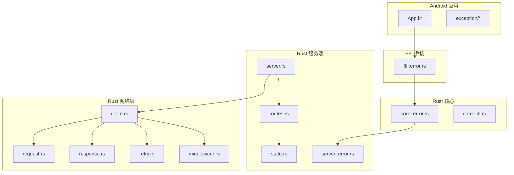
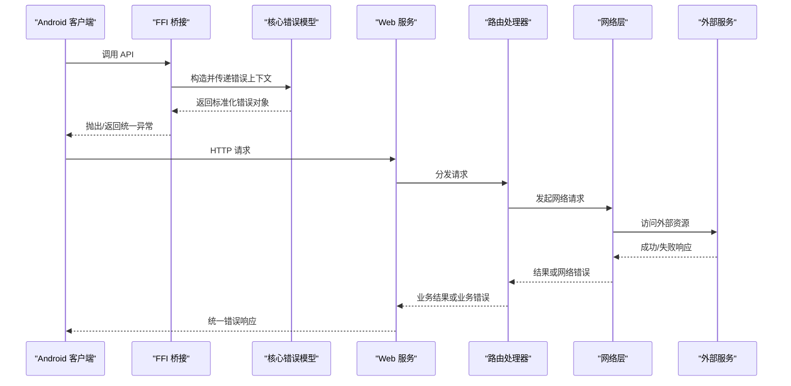
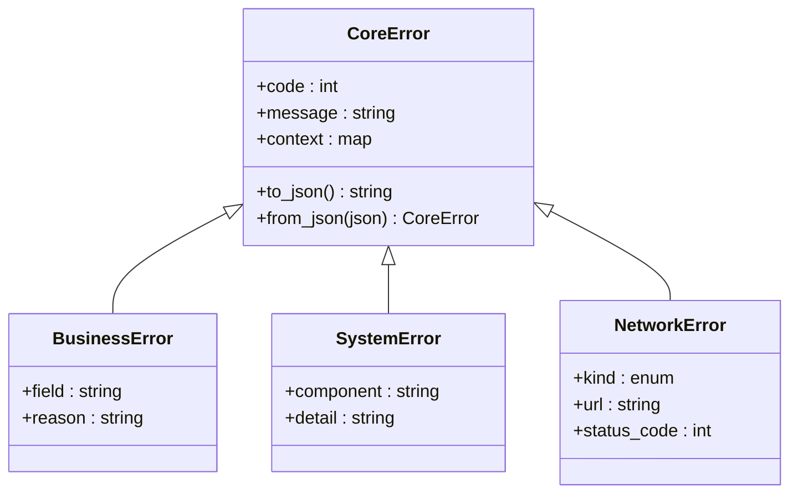
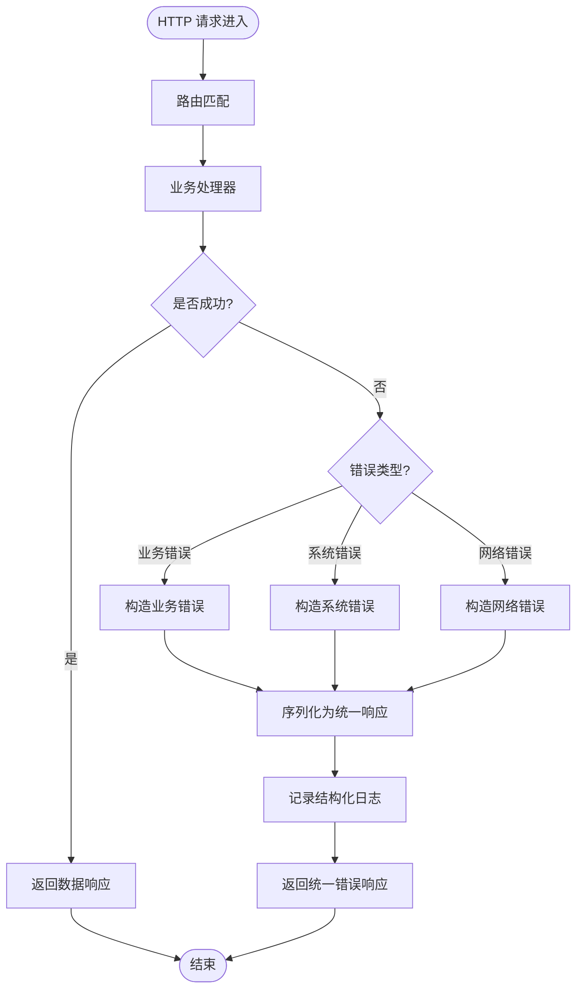
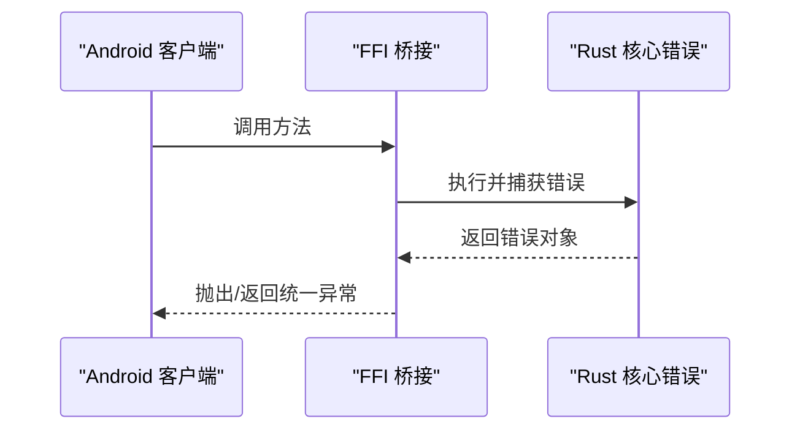
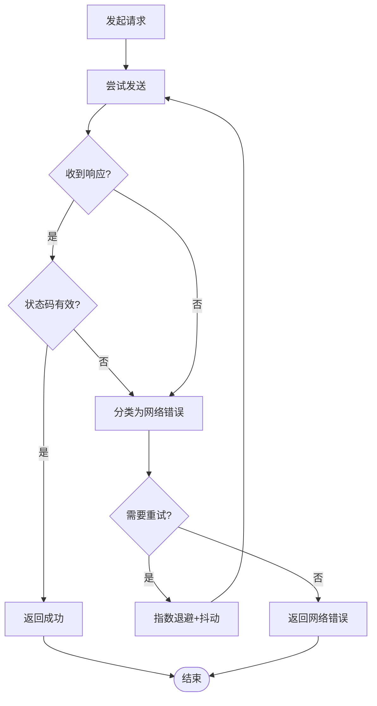
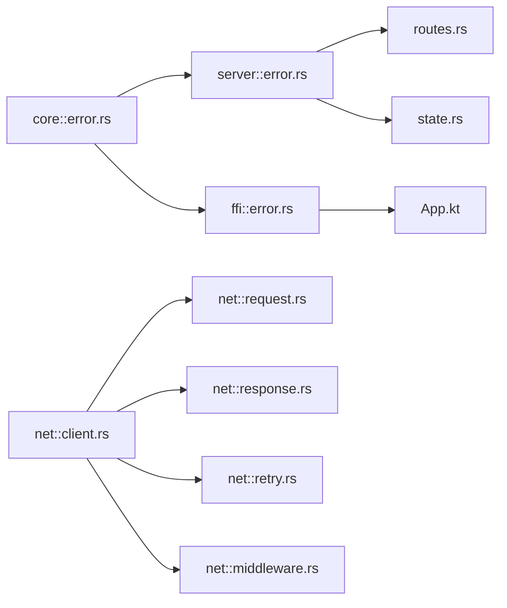

# 错误处理机制

<cite>
**本文引用的文件**   
- [error.rs](file://rust/legado-core/src/error.rs)
- [error.rs](file://rust/legado-server/src/error.rs)
- [error.rs](file://rust/legado-ffi/src/error.rs)
- [lib.rs](file://rust/legado-core/src/lib.rs)
- [lib.rs](file://rust/legado-server/src/lib.rs)
- [routes.rs](file://rust/legado-server/src/routes.rs)
- [server.rs](file://rust/legado-server/src/server.rs)
- [state.rs](file://rust/legado-server/src/state.rs)
- [client.rs](file://rust/legado-net/src/client.rs)
- [request.rs](file://rust/legado-net/src/request.rs)
- [response.rs](file://rust/legado-net/src/response.rs)
- [retry.rs](file://rust/legado-net/src/retry.rs)
- [middleware.rs](file://rust/legado-net/src/middleware.rs)
- [App.kt](file://app/src/main/java/io/legado/app/App.kt)
- [exception目录](file://app/src/main/java/io/legado/app/exception/)
</cite>

## 目录
1. [简介](#简介)
2. [项目结构](#项目结构)
3. [核心组件](#核心组件)
4. [架构总览](#架构总览)
5. [详细组件分析](#详细组件分析)
6. [依赖关系分析](#依赖关系分析)
7. [性能考量](#性能考量)
8. [故障排查指南](#故障排查指南)
9. [结论](#结论)
10. [附录](#附录)

## 简介
本文件系统化梳理 Legado 项目的错误处理机制，覆盖错误分类体系、统一响应格式、异常捕获策略、日志与监控实践，以及端到端示例与最佳实践。目标是为开发者提供从设计到落地的完整参考，帮助在 Android、Rust 后端与网络层建立一致、可观测、可维护的错误处理规范。

## 项目结构
Legado 采用多语言、多模块架构：
- Rust 核心库（legado-core）定义通用错误类型与转换
- Rust Web 服务（legado-server）实现 HTTP 路由、中间件与全局错误处理
- FFI 桥接（legado-ffi）负责跨语言错误传播
- 网络层（legado-net）封装请求/响应、重试与中间件
- Android 应用（app）通过 Kotlin 进行 UI 层异常展示与本地错误处理

图表来源
- [App.kt](file://app/src/main/java/io/legado/app/App.kt)
- [error.rs](file://rust/legado-core/src/error.rs)
- [error.rs](file://rust/legado-server/src/error.rs)
- [error.rs](file://rust/legado-ffi/src/error.rs)
- [server.rs](file://rust/legado-server/src/server.rs)
- [routes.rs](file://rust/legado-server/src/routes.rs)
- [state.rs](file://rust/legado-server/src/state.rs)
- [client.rs](file://rust/legado-net/src/client.rs)
- [request.rs](file://rust/legado-net/src/request.rs)
- [response.rs](file://rust/legado-net/src/response.rs)
- [retry.rs](file://rust/legado-net/src/retry.rs)
- [middleware.rs](file://rust/legado-net/src/middleware.rs)

章节来源
- [App.kt](file://app/src/main/java/io/legado/app/App.kt)
- [error.rs](file://rust/legado-core/src/error.rs)
- [error.rs](file://rust/legado-server/src/error.rs)
- [error.rs](file://rust/legado-ffi/src/error.rs)
- [server.rs](file://rust/legado-server/src/server.rs)
- [routes.rs](file://rust/legado-server/src/routes.rs)
- [state.rs](file://rust/legado-server/src/state.rs)
- [client.rs](file://rust/legado-net/src/client.rs)
- [request.rs](file://rust/legado-net/src/request.rs)
- [response.rs](file://rust/legado-net/src/response.rs)
- [retry.rs](file://rust/legado-net/src/retry.rs)
- [middleware.rs](file://rust/legado-net/src/middleware.rs)

## 核心组件
- 统一错误模型：在 Rust 核心与服务端分别定义错误枚举/结构体，用于表达业务错误、系统错误、网络错误等类别，并提供序列化能力以生成统一 JSON 响应。
- 全局异常捕获：在服务端入口注册中间件或全局处理器，将未捕获异常转换为标准错误响应；在 Android 侧通过应用级异常钩子收集崩溃与运行时异常。
- 网络错误与重试：在网络层对超时、连接失败、SSL 错误等进行分类，结合指数退避与最大重试次数策略，保证稳定性。
- FFI 错误传播：在 FFI 层将 Rust 错误转换为 Android 可识别的异常或状态码，确保跨语言调用链路的错误一致性。
- 日志与追踪：在关键路径记录结构化日志，包含错误码、请求标识、堆栈摘要，便于问题定位与监控告警。

章节来源
- [error.rs](file://rust/legado-core/src/error.rs)
- [error.rs](file://rust/legado-server/src/error.rs)
- [error.rs](file://rust/legado-ffi/src/error.rs)
- [client.rs](file://rust/legado-net/src/client.rs)
- [retry.rs](file://rust/legado-net/src/retry.rs)
- [middleware.rs](file://rust/legado-net/src/middleware.rs)
- [App.kt](file://app/src/main/java/io/legado/app/App.kt)

## 架构总览
下图展示了从 Android 客户端发起请求到 Rust 服务端处理、再到网络层访问外部资源的全链路错误流转。

图表来源
- [App.kt](file://app/src/main/java/io/legado/app/App.kt)
- [error.rs](file://rust/legado-ffi/src/error.rs)
- [error.rs](file://rust/legado-core/src/error.rs)
- [server.rs](file://rust/legado-server/src/server.rs)
- [routes.rs](file://rust/legado-server/src/routes.rs)
- [client.rs](file://rust/legado-net/src/client.rs)

## 详细组件分析

### Rust 核心错误模型（legado-core）
- 职责：定义统一的错误枚举与转换逻辑，涵盖业务错误、系统错误、网络错误等类别；提供 Into 转换以便在各层之间无缝传递。
- 设计要点：
  - 错误分类清晰：业务错误（如参数校验失败、权限不足）、系统错误（如数据库不可用、内部计算异常）、网络错误（如超时、DNS 解析失败）。
  - 携带上下文：错误对象包含错误码、消息、可选的附加字段（如请求 ID、字段名），便于前端展示与日志追踪。
  - 可序列化：支持 JSON 序列化，便于跨进程/跨语言传输。
- 复杂度与性能：错误对象通常轻量，序列化开销可控；建议在高频路径避免不必要的堆分配。

图表来源
- [error.rs](file://rust/legado-core/src/error.rs)

章节来源
- [error.rs](file://rust/legado-core/src/error.rs)
- [lib.rs](file://rust/legado-core/src/lib.rs)

### Rust 服务端错误处理（legado-server）
- 职责：定义服务端错误类型，注册全局异常处理器，将未捕获异常转换为统一 JSON 响应；在路由层区分业务错误与系统错误。
- 设计要点：
  - 全局捕获：在服务器启动时安装中间件或全局处理器，捕获 panic 与未处理异常，记录结构化日志并返回标准错误响应。
  - 路由映射：不同路由返回不同的错误码与消息，保持语义化与可测试性。
  - 状态管理：通过 state 模块共享配置与上下文，错误处理时可读取必要信息（如租户、环境标志）。
- 响应规范：
  - 统一结构：包含 code、message、data（可为空）、trace_id（可选）。
  - 错误码：按领域划分，如 1xxx 业务错误、2xxx 系统错误、3xxx 网络错误。
  - 国际化：根据 Accept-Language 或用户偏好返回本地化消息。

图表来源
- [error.rs](file://rust/legado-server/src/error.rs)
- [routes.rs](file://rust/legado-server/src/routes.rs)
- [server.rs](file://rust/legado-server/src/server.rs)
- [state.rs](file://rust/legado-server/src/state.rs)

章节来源
- [error.rs](file://rust/legado-server/src/error.rs)
- [routes.rs](file://rust/legado-server/src/routes.rs)
- [server.rs](file://rust/legado-server/src/server.rs)
- [state.rs](file://rust/legado-server/src/state.rs)

### FFI 错误传播（legado-ffi）
- 职责：在 Rust 与 Android 之间传递错误，确保两端对错误语义一致。
- 设计要点：
  - 错误映射：将 Rust 错误转换为 Android 可识别的异常或状态码。
  - 上下文保留：尽量保留 trace_id、请求 URL、字段名等关键信息。
  - 安全边界：避免敏感信息泄露，必要时脱敏。

图表来源
- [error.rs](file://rust/legado-ffi/src/error.rs)
- [error.rs](file://rust/legado-core/src/error.rs)

章节来源
- [error.rs](file://rust/legado-ffi/src/error.rs)
- [error.rs](file://rust/legado-core/src/error.rs)

### 网络层错误与重试（legado-net）
- 职责：封装 HTTP 请求/响应，对网络错误进行分类，并提供重试策略。
- 设计要点：
  - 错误分类：超时、连接失败、SSL/TLS 错误、HTTP 状态码错误等。
  - 重试策略：指数退避、抖动、最大重试次数、幂等性判断。
  - 中间件：统一添加请求头、鉴权、日志、限流等。
- 性能考量：合理设置超时与重试阈值，避免雪崩；对非幂等操作谨慎重试。

图表来源
- [client.rs](file://rust/legado-net/src/client.rs)
- [request.rs](file://rust/legado-net/src/request.rs)
- [response.rs](file://rust/legado-net/src/response.rs)
- [retry.rs](file://rust/legado-net/src/retry.rs)
- [middleware.rs](file://rust/legado-net/src/middleware.rs)

章节来源
- [client.rs](file://rust/legado-net/src/client.rs)
- [request.rs](file://rust/legado-net/src/request.rs)
- [response.rs](file://rust/legado-net/src/response.rs)
- [retry.rs](file://rust/legado-net/src/retry.rs)
- [middleware.rs](file://rust/legado-net/src/middleware.rs)

### Android 应用层异常处理（app）
- 职责：在 UI 层捕获异常，展示友好提示，上报崩溃与错误日志。
- 设计要点：
  - 全局异常钩子：捕获未处理异常，记录堆栈与设备信息。
  - 本地错误：对输入校验、文件读写、数据库操作等进行分类处理。
  - 与 FFI 集成：接收 FFI 层错误并转化为 UI 提示。

章节来源
- [App.kt](file://app/src/main/java/io/legado/app/App.kt)
- [exception目录](file://app/src/main/java/io/legado/app/exception/)

## 依赖关系分析
- 耦合度：核心错误模型被服务端、FFI、网络层共同依赖，形成稳定的错误契约；服务端与网络层解耦良好，通过错误枚举传递。
- 循环依赖：各模块间无直接循环导入，错误类型集中在 core 层，降低耦合。
- 外部依赖：网络层依赖 HTTP 客户端与 SSL 配置；服务端依赖路由框架与日志库。

图表来源
- [error.rs](file://rust/legado-core/src/error.rs)
- [error.rs](file://rust/legado-server/src/error.rs)
- [error.rs](file://rust/legado-ffi/src/error.rs)
- [routes.rs](file://rust/legado-server/src/routes.rs)
- [state.rs](file://rust/legado-server/src/state.rs)
- [client.rs](file://rust/legado-net/src/client.rs)
- [request.rs](file://rust/legado-net/src/request.rs)
- [response.rs](file://rust/legado-net/src/response.rs)
- [retry.rs](file://rust/legado-net/src/retry.rs)
- [middleware.rs](file://rust/legado-net/src/middleware.rs)
- [App.kt](file://app/src/main/java/io/legado/app/App.kt)

章节来源
- [error.rs](file://rust/legado-core/src/error.rs)
- [error.rs](file://rust/legado-server/src/error.rs)
- [error.rs](file://rust/legado-ffi/src/error.rs)
- [routes.rs](file://rust/legado-server/src/routes.rs)
- [state.rs](file://rust/legado-server/src/state.rs)
- [client.rs](file://rust/legado-net/src/client.rs)
- [request.rs](file://rust/legado-net/src/request.rs)
- [response.rs](file://rust/legado-net/src/response.rs)
- [retry.rs](file://rust/legado-net/src/retry.rs)
- [middleware.rs](file://rust/legado-net/src/middleware.rs)
- [App.kt](file://app/src/main/java/io/legado/app/App.kt)

## 性能考量
- 错误对象序列化：在高并发场景下，避免频繁分配大对象；使用零拷贝或缓冲池优化序列化路径。
- 重试策略：对非幂等操作禁用自动重试；合理设置超时与退避参数，防止放大流量。
- 日志采样：对高频错误进行采样记录，减少 I/O 压力；关键错误全量记录。
- 监控指标：统计错误率、P95/P99 延迟、重试成功率，作为容量规划与告警依据。

[本节为通用指导，不直接分析具体文件]

## 故障排查指南
- 快速定位：通过 trace_id 串联请求链路，结合服务端与客户端日志定位根因。
- 常见错误：
  - 网络超时：检查 DNS、代理、SSL 配置与远端可用性。
  - 业务校验失败：核对输入字段与规则，确认错误码与消息。
  - 系统异常：查看堆栈与组件状态，必要时重启或回滚。
- 调试建议：
  - 启用详细日志与调试模式，限制范围以避免噪声。
  - 使用模拟服务与断点复现问题。
  - 对重试路径增加退避日志，观察重试行为。

章节来源
- [error.rs](file://rust/legado-server/src/error.rs)
- [client.rs](file://rust/legado-net/src/client.rs)
- [retry.rs](file://rust/legado-net/src/retry.rs)
- [App.kt](file://app/src/main/java/io/legado/app/App.kt)

## 结论
Legado 的错误处理机制以核心错误模型为中心，贯穿 Android、FFI、服务端与网络层，形成一致的语义与响应格式。通过全局异常捕获、结构化日志与重试策略，提升了系统的稳定性与可观测性。建议持续完善错误码字典、国际化文案与监控告警，以支撑更大规模的使用场景。

[本节为总结性内容，不直接分析具体文件]

## 附录
- 统一错误响应结构（建议）：
  - code：整数错误码，按领域划分
  - message：人类可读的消息，支持国际化
  - data：业务数据或为空
  - trace_id：请求追踪标识
- 错误码分类建议：
  - 1xxx：业务错误（参数、权限、状态机）
  - 2xxx：系统错误（内部异常、资源不可用）
  - 3xxx：网络错误（超时、连接失败、SSL）
- 最佳实践：
  - 在入口处集中处理异常，避免分散 try-catch
  - 错误消息不包含敏感信息
  - 对重试与降级进行明确约定
  - 定期审查错误码与日志质量

[本节为通用指导，不直接分析具体文件]