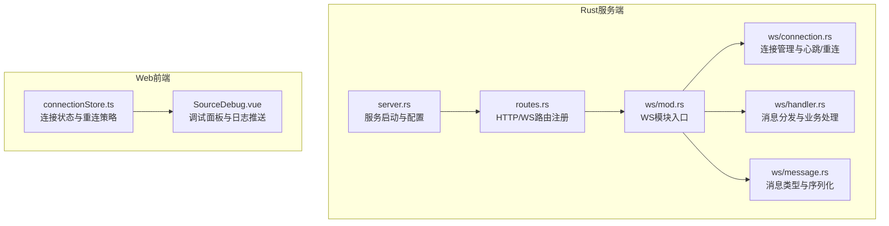
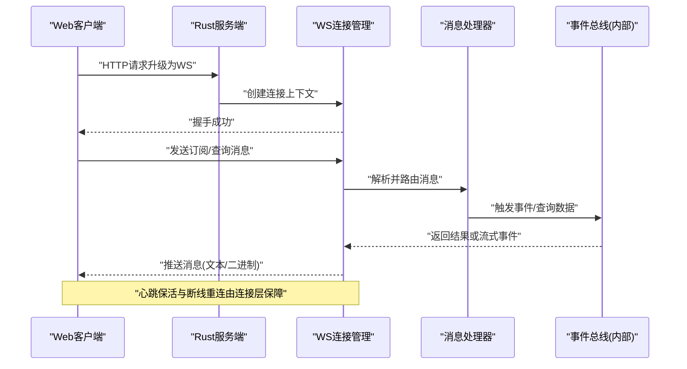
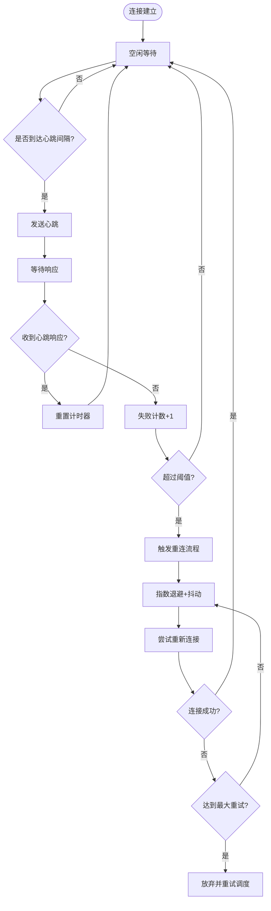
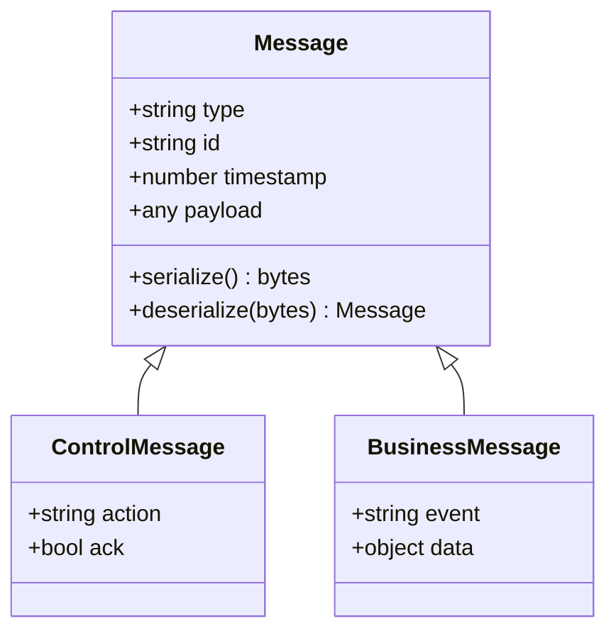
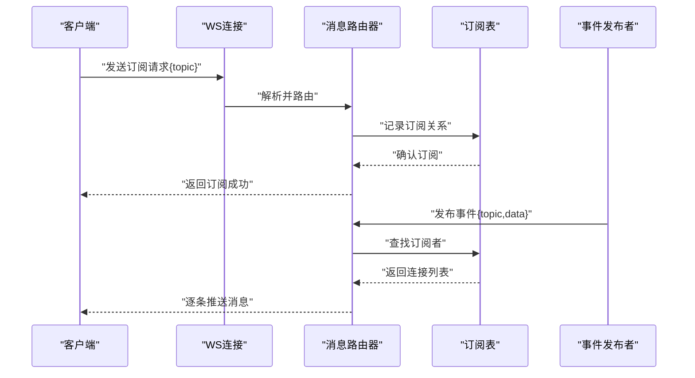
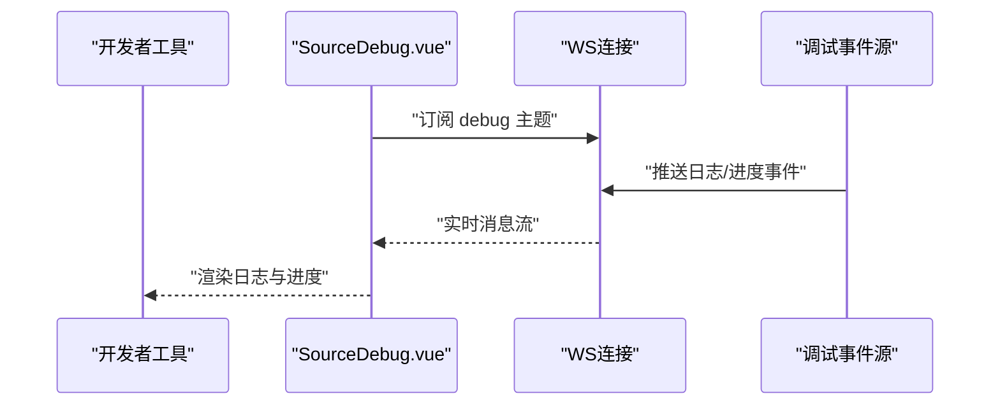
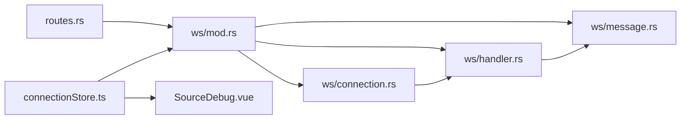

# WebSocket实时通信

<cite>
**本文引用的文件**   
- [rust/legado-server/src/ws/mod.rs](file://rust/legado-server/src/ws/mod.rs)
- [rust/legado-server/src/ws/handler.rs](file://rust/legado-server/src/ws/handler.rs)
- [rust/legado-server/src/ws/connection.rs](file://rust/legado-server/src/ws/connection.rs)
- [rust/legado-server/src/ws/message.rs](file://rust/legado-server/src/ws/message.rs)
- [rust/legado-server/src/routes.rs](file://rust/legado-server/src/routes.rs)
- [rust/legado-server/src/server.rs](file://rust/legado-server/src/server.rs)
- [modules/web/src/store/connectionStore.ts](file://modules/web/src/store/connectionStore.ts)
- [modules/web/src/components/SourceDebug.vue](file://modules/web/src/components/SourceDebug.vue)
</cite>

## 目录
1. [简介](#简介)
2. [项目结构](#项目结构)
3. [核心组件](#核心组件)
4. [架构总览](#架构总览)
5. [详细组件分析](#详细组件分析)
6. [依赖关系分析](#依赖关系分析)
7. [性能考量](#性能考量)
8. [故障排查指南](#故障排查指南)
9. [结论](#结论)
10. [附录：客户端集成指南](#附录客户端集成指南)

## 简介
本文件面向Legado项目的WebSocket实时通信子系统，系统性阐述连接生命周期管理（建立、心跳、断线重连）、消息协议设计（类型、序列化、压缩）、事件驱动架构（订阅发布、路由、广播）与调试能力（实时日志、源调试、搜索进度）。同时提供客户端集成要点与性能监控、故障诊断方法，帮助开发者快速接入并稳定运行。

## 项目结构
WebSocket相关实现主要分布在Rust服务端与Web前端两个部分：
- Rust服务端：位于 rust/legado-server 模块，包含WS路由注册、连接管理、消息处理与协议定义。
- Web前端：位于 modules/web 模块，包含连接状态管理、调试面板与消息收发封装。

**图表来源** 
- [rust/legado-server/src/server.rs](file://rust/legado-server/src/server.rs)
- [rust/legado-server/src/routes.rs](file://rust/legado-server/src/routes.rs)
- [rust/legado-server/src/ws/mod.rs](file://rust/legado-server/src/ws/mod.rs)
- [rust/legado-server/src/ws/connection.rs](file://rust/legado-server/src/ws/connection.rs)
- [rust/legado-server/src/ws/handler.rs](file://rust/legado-server/src/ws/handler.rs)
- [rust/legado-server/src/ws/message.rs](file://rust/legado-server/src/ws/message.rs)
- [modules/web/src/store/connectionStore.ts](file://modules/web/src/store/connectionStore.ts)
- [modules/web/src/components/SourceDebug.vue](file://modules/web/src/components/SourceDebug.vue)

**章节来源**
- [rust/legado-server/src/server.rs](file://rust/legado-server/src/server.rs)
- [rust/legado-server/src/routes.rs](file://rust/legado-server/src/routes.rs)
- [rust/legado-server/src/ws/mod.rs](file://rust/legado-server/src/ws/mod.rs)
- [modules/web/src/store/connectionStore.ts](file://modules/web/src/store/connectionStore.ts)

## 核心组件
- 连接管理器：负责单个WebSocket连接的上下文、读写通道、心跳检测、断线重连与资源清理。
- 消息处理器：解析消息、路由到具体业务逻辑、聚合广播与定向推送。
- 消息协议：统一的消息类型、字段约定、序列化格式与可选压缩策略。
- 路由与注册：将WS端点挂载到HTTP服务器，完成握手与升级。
- 前端连接存储：维护连接状态、自动重连、错误恢复与UI同步。
- 调试面板：订阅服务端调试事件，展示实时日志与搜索进度。

**章节来源**
- [rust/legado-server/src/ws/connection.rs](file://rust/legado-server/src/ws/connection.rs)
- [rust/legado-server/src/ws/handler.rs](file://rust/legado-server/src/ws/handler.rs)
- [rust/legado-server/src/ws/message.rs](file://rust/legado-server/src/ws/message.rs)
- [rust/legado-server/src/routes.rs](file://rust/legado-server/src/routes.rs)
- [modules/web/src/store/connectionStore.ts](file://modules/web/src/store/connectionStore.ts)

## 架构总览
整体采用“服务端事件总线 + 前端订阅”的异步模式。服务端通过WS通道向已订阅的连接推送事件；前端基于连接状态管理进行消息收发与UI更新。

**图表来源** 
- [rust/legado-server/src/routes.rs](file://rust/legado-server/src/routes.rs)
- [rust/legado-server/src/ws/connection.rs](file://rust/legado-server/src/ws/connection.rs)
- [rust/legado-server/src/ws/handler.rs](file://rust/legado-server/src/ws/handler.rs)
- [rust/legado-server/src/ws/message.rs](file://rust/legado-server/src/ws/message.rs)

## 详细组件分析

### 连接管理（心跳与断线重连）
- 连接生命周期：握手后进入活跃态，周期性发送心跳帧；收到对端心跳响应则重置超时计时器。
- 心跳策略：固定间隔探测，支持可配置超时阈值；连续失败触发断线标记。
- 断线重连：客户端侧指数退避重试，带最大重试次数与抖动；服务端侧保持连接池上限与资源回收。
- 资源清理：断开时释放句柄、取消任务、清理订阅映射。

**图表来源** 
- [rust/legado-server/src/ws/connection.rs](file://rust/legado-server/src/ws/connection.rs)

**章节来源**
- [rust/legado-server/src/ws/connection.rs](file://rust/legado-server/src/ws/connection.rs)

### 消息协议（类型、序列化、压缩）
- 消息类型：区分控制类（如心跳、订阅、确认）与业务类（如日志、搜索结果、源调试信息）。
- 序列化格式：统一JSON结构，包含类型标识、时间戳、载荷等；二进制大对象可采用Base64或分片传输。
- 压缩传输：对大体积负载启用压缩（如Gzip/Brotli），在握手或首条消息协商压缩参数。
- 校验与容错：字段完整性校验、版本兼容处理、异常消息回退默认值。

**图表来源** 
- [rust/legado-server/src/ws/message.rs](file://rust/legado-server/src/ws/message.rs)

**章节来源**
- [rust/legado-server/src/ws/message.rs](file://rust/legado-server/src/ws/message.rs)

### 事件驱动架构（订阅发布、路由、广播）
- 订阅发布：客户端按主题订阅，服务端维护订阅表；事件触发时按主题路由到对应连接集合。
- 消息路由：根据消息type/action字段分发至处理器；支持多路复用与优先级队列。
- 广播机制：支持全量广播与分组广播；限流与背压保护避免雪崩。
- 异步处理：使用协程/任务池执行耗时操作，保证低延迟响应。

**图表来源** 
- [rust/legado-server/src/ws/handler.rs](file://rust/legado-server/src/ws/handler.rs)
- [rust/legado-server/src/ws/message.rs](file://rust/legado-server/src/ws/message.rs)

**章节来源**
- [rust/legado-server/src/ws/handler.rs](file://rust/legado-server/src/ws/handler.rs)
- [rust/legado-server/src/ws/message.rs](file://rust/legado-server/src/ws/message.rs)

### 调试功能（实时日志、源调试、搜索进度）
- 实时日志：服务端将调试日志以事件形式推送到订阅了“debug”主题的客户端。
- 源调试：针对JS源执行过程输出关键步骤、错误堆栈与性能指标。
- 搜索进度：分页/增量推送搜索结果，支持进度百分比与累计数量。
- 前端面板：SourceDebug组件订阅调试事件，渲染日志流与进度条。

**图表来源** 
- [modules/web/src/components/SourceDebug.vue](file://modules/web/src/components/SourceDebug.vue)
- [rust/legado-server/src/ws/handler.rs](file://rust/legado-server/src/ws/handler.rs)

**章节来源**
- [modules/web/src/components/SourceDebug.vue](file://modules/web/src/components/SourceDebug.vue)
- [rust/legado-server/src/ws/handler.rs](file://rust/legado-server/src/ws/handler.rs)

## 依赖关系分析
- 服务端依赖：WS模块依赖路由注册、消息协议定义与连接管理；处理器依赖事件总线与业务服务。
- 前端依赖：连接存储依赖WebSocket API与状态管理；调试面板依赖连接存储的事件回调。

**图表来源** 
- [rust/legado-server/src/routes.rs](file://rust/legado-server/src/routes.rs)
- [rust/legado-server/src/ws/mod.rs](file://rust/legado-server/src/ws/mod.rs)
- [rust/legado-server/src/ws/connection.rs](file://rust/legado-server/src/ws/connection.rs)
- [rust/legado-server/src/ws/message.rs](file://rust/legado-server/src/ws/message.rs)
- [rust/legado-server/src/ws/handler.rs](file://rust/legado-server/src/ws/handler.rs)
- [modules/web/src/store/connectionStore.ts](file://modules/web/src/store/connectionStore.ts)
- [modules/web/src/components/SourceDebug.vue](file://modules/web/src/components/SourceDebug.vue)

**章节来源**
- [rust/legado-server/src/routes.rs](file://rust/legado-server/src/routes.rs)
- [rust/legado-server/src/ws/mod.rs](file://rust/legado-server/src/ws/mod.rs)
- [modules/web/src/store/connectionStore.ts](file://modules/web/src/store/connectionStore.ts)

## 性能考量
- 连接规模：限制单进程最大连接数，避免内存与句柄耗尽。
- 心跳开销：合理设置心跳间隔与超时，平衡保活与带宽消耗。
- 消息压缩：对大负载启用压缩，减少网络占用；注意CPU权衡。
- 背压与限流：对高频事件进行节流与批处理，防止前端卡顿。
- 异步I/O：非阻塞读写与任务池化，提升吞吐与延迟稳定性。

[本节为通用指导，不直接分析具体文件]

## 故障排查指南
- 连接频繁断开：检查心跳配置、网络质量与服务端负载；查看连接层错误码与重试日志。
- 消息丢失或乱序：确认序列号与ACK机制；检查订阅表一致性与路由规则。
- 调试面板无数据：验证主题订阅是否正确；检查服务端调试事件是否开启。
- 性能劣化：监控CPU/内存/网络指标；定位热点路径与瓶颈组件。

**章节来源**
- [rust/legado-server/src/ws/connection.rs](file://rust/legado-server/src/ws/connection.rs)
- [rust/legado-server/src/ws/handler.rs](file://rust/legado-server/src/ws/handler.rs)
- [modules/web/src/components/SourceDebug.vue](file://modules/web/src/components/SourceDebug.vue)

## 结论
Legado的WebSocket实时通信以清晰的分层设计与事件驱动架构为基础，提供了健壮的连接管理、灵活的协议扩展与完善的调试能力。通过合理的心跳与重连策略、消息压缩与背压控制，可在高并发场景下保持稳定与高效。前端侧的连接状态管理与调试面板进一步提升了开发体验与问题定位效率。

[本节为总结性内容，不直接分析具体文件]

## 附录：客户端集成指南
- 连接配置：指定WS地址、超时与心跳间隔；支持TLS与代理。
- 消息处理：实现订阅/取消订阅、消息解析与事件回调；处理错误与重连。
- 错误恢复：捕获网络异常与协议错误，触发指数退避重连；保留未消费消息队列。
- 调试接入：订阅调试主题，渲染日志与进度；提供过滤与导出功能。

**章节来源**
- [modules/web/src/store/connectionStore.ts](file://modules/web/src/store/connectionStore.ts)
- [modules/web/src/components/SourceDebug.vue](file://modules/web/src/components/SourceDebug.vue)