# 同步服务

<cite>
**本文引用的文件**   
- [README.md](file://README.md)
- [server.rs](file://rust/legado-server/src/server.rs)
- [routes.rs](file://rust/legado-server/src/routes.rs)
- [state.rs](file://rust/legado-server/src/state.rs)
- [error.rs](file://rust/legado-server/src/error.rs)
- [lib.rs](file://rust/legado-server/src/lib.rs)
- [backup_api.rs](file://rust/legado-ffi/src/api/backup_api.rs)
- [bookshelf.rs](file://rust/legado-ffi/src/api/bookshelf.rs)
- [config_api.rs](file://rust/legado-ffi/src/api/config_api.rs)
- [user_api.rs](file://rust/legado-ffi/src/api/user_api.rs)
- [source.rs](file://rust/legado-ffi/src/api/source.rs)
- [auto_task_repository.rs](file://rust/legado-db/src/repository/auto_task_repository.rs)
- [auto_task.rs](file://rust/legado-core/src/auto_task.rs)
- [cron.rs](file://rust/legado-core/src/cron.rs)
- [download_manager.rs](file://rust/legado-core/src/download_manager.rs)
- [crypto.rs](file://rust/legado-core/src/crypto.rs)
- [passphrase.rs](file://rust/legado-core/src/passphrase.rs)
- [client.rs](file://rust/legado-net/src/client.rs)
- [ssl_config.rs](file://rust/legado-net/src/ssl_config.rs)
- [middleware.rs](file://rust/legado-net/src/middleware.rs)
- [retry.rs](file://rust/legado-net/src/retry.rs)
- [cookie_store.rs](file://rust/legado-net/src/cookie_store.rs)
- [proxy.rs](file://rust/legado-net/src/proxy.rs)
- [rate_limit.rs](file://rust/legado-net/src/rate_limit.rs)
- [verification.rs](file://rust/legado-net/src/verification.rs)
- [ws_test.rs](file://rust/legado-server/tests/ws_test.rs)
- [integration_test.rs](file://rust/legado-server/tests/integration_test.rs)
- [sync.js](file://modules/web/scripts/sync.js)
- [api.ts](file://modules/web/src/api/api.ts)
- [axios.ts](file://modules/web/src/api/axios.ts)
- [index.ts](file://modules/web/src/api/index.ts)
- [connectionStore.ts](file://modules/web/src/store/connectionStore.ts)
- [bookStore.ts](file://modules/web/src/store/bookStore.ts)
- [settings_service.dart](file://flutter_legado/lib/src/services/settings_service.dart)
- [sync_provider.dart](file://flutter_legado/lib/src/providers/sync_provider.dart)
- [webdav_settings_screen.dart](file://flutter_legado/lib/src/screens/webdav_settings_screen.dart)
- [sync_provider_test.dart](file://flutter_legado/test/unit/sync_provider_test.dart)
- [AutoTaskSchedulePolicyTest.kt](file://app/src/test/java/io/legado/app/model/AutoTaskSchedulePolicyTest.kt)
- [AutoTaskPersistenceContractTest.kt](file://app/src/test/java/io/legado/app/config/AutoTaskPersistenceContractTest.kt)
</cite>

## 更新摘要
**所做更改**   
- 新增了WebDAV设备名称配置管理功能，包括setWebDavDeviceName()方法
- 新增了书籍进度同步控制功能，包括setSyncBookProgress()和setSyncBookProgressPlus()方法
- 更新了Flutter前端设置服务和同步提供程序以支持新的配置选项
- 增强了WebDAV设置界面的用户交互体验
- 完善了测试覆盖范围，确保新功能的稳定性

## 目录
1. [简介](#简介)
2. [项目结构](#项目结构)
3. [核心组件](#核心组件)
4. [架构总览](#架构总览)
5. [详细组件分析](#详细组件分析)
6. [依赖关系分析](#依赖关系分析)
7. [性能考量](#性能考量)
8. [故障排除指南](#故障排除指南)
9. [结论](#结论)
10. [附录](#附录)

## 简介
本文件面向"同步服务"的云端同步能力，覆盖客户端-服务器模式、增量同步算法、冲突解决策略、RESTful API 设计（认证授权、数据序列化、错误处理）、WebSocket 实时通信（连接管理、消息推送、状态同步）、数据加密与安全机制（传输加密、存储加密、访问控制）、自动任务调度（定时任务、事件触发、任务队列），以及部署配置与运维监控。文档以仓库中的 Rust 服务端、FFI API、网络层、数据库与前端 Web 模块为依据进行系统化梳理，并提供可视化图示与排障建议。

**注意**：系统现已增强WebDAV配置管理能力，支持设备名称标识和精细化的书籍进度同步控制。

## 项目结构
本项目采用多语言协作：Android 客户端、Flutter 跨平台客户端、Web 前端、Rust 核心库与服务端。同步服务主要由以下部分组成：
- Rust 服务端：HTTP/WebSocket 路由、处理器、状态管理、错误模型
- FFI API：对外暴露备份、书架、配置、用户、来源等接口
- 网络层：HTTP 客户端、SSL/TLS、代理、重试、限流、Cookie 存储、校验
- 数据库与仓储：自动任务、书籍、章节、书签等持久化
- 前端 Web：API 调用封装、连接状态管理、书架与书籍状态同步
- Flutter 设置服务：WebDAV配置管理、设备标识、进度同步控制
- Android/Flutter 测试：自动任务调度与持久化契约验证

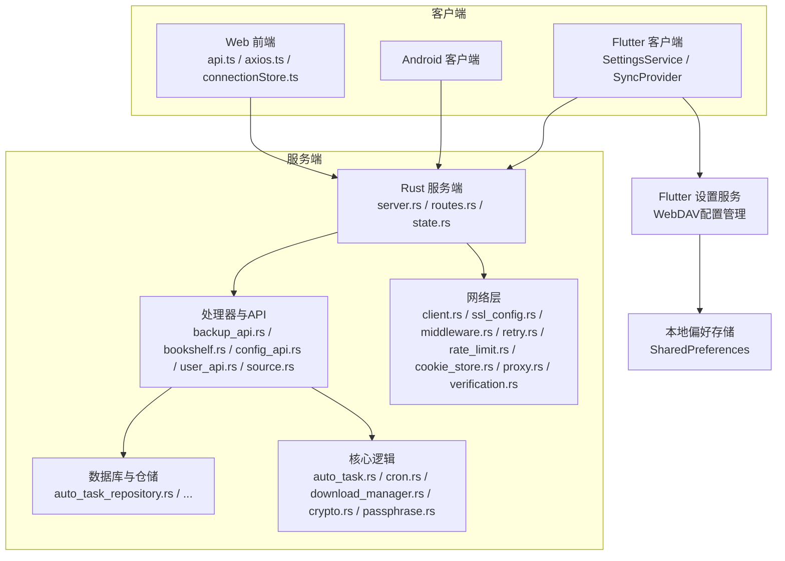

**图表来源** 
- [server.rs](file://rust/legado-server/src/server.rs)
- [routes.rs](file://rust/legado-server/src/routes.rs)
- [state.rs](file://rust/legado-server/src/state.rs)
- [backup_api.rs](file://rust/legado-ffi/src/api/backup_api.rs)
- [bookshelf.rs](file://rust/legado-ffi/src/api/bookshelf.rs)
- [config_api.rs](file://rust/legado-ffi/src/api/config_api.rs)
- [user_api.rs](file://rust/legado-ffi/src/api/user_api.rs)
- [source.rs](file://rust/legado-ffi/src/api/source.rs)
- [auto_task_repository.rs](file://rust/legado-db/src/repository/auto_task_repository.rs)
- [auto_task.rs](file://rust/legado-core/src/auto_task.rs)
- [cron.rs](file://rust/legado-core/src/cron.rs)
- [download_manager.rs](file://rust/legado-core/src/download_manager.rs)
- [crypto.rs](file://rust/legado-core/src/crypto.rs)
- [passphrase.rs](file://rust/legado-core/src/passphrase.rs)
- [client.rs](file://rust/legado-net/src/client.rs)
- [ssl_config.rs](file://rust/legado-net/src/ssl_config.rs)
- [middleware.rs](file://rust/legado-net/src/middleware.rs)
- [retry.rs](file://rust/legado-net/src/retry.rs)
- [rate_limit.rs](file://rust/legado-net/src/rate_limit.rs)
- [cookie_store.rs](file://rust/legado-net/src/cookie_store.rs)
- [proxy.rs](file://rust/legado-net/src/proxy.rs)
- [verification.rs](file://rust/legado-net/src/verification.rs)
- [settings_service.dart](file://flutter_legado/lib/src/services/settings_service.dart)
- [sync_provider.dart](file://flutter_legado/lib/src/providers/sync_provider.dart)

**章节来源**
- [README.md](file://README.md)

## 核心组件
- 服务端入口与路由：负责 HTTP/WebSocket 监听、路由分发、中间件链、全局状态
- FFI API 处理器：提供备份、书架、配置、用户、来源等 REST 接口
- 网络层：统一 HTTP 客户端、TLS 配置、代理、重试、限流、Cookie、校验
- 核心逻辑：自动任务调度、Cron 表达式解析、下载管理、加密与口令处理
- 数据库与仓储：自动任务、书籍、章节、书签等数据的持久化与查询
- 前端 Web：API 封装、连接状态管理、书架与书籍状态同步
- **新增** Flutter 设置服务：WebDAV设备名称管理、书籍进度同步控制、本地偏好存储
- **新增** 同步提供程序：统一的同步配置管理、状态同步、UI交互协调

**章节来源**
- [server.rs](file://rust/legado-server/src/server.rs)
- [routes.rs](file://rust/legado-server/src/routes.rs)
- [state.rs](file://rust/legado-server/src/state.rs)
- [lib.rs](file://rust/legado-server/src/lib.rs)
- [backup_api.rs](file://rust/legado-ffi/src/api/backup_api.rs)
- [bookshelf.rs](file://rust/legado-ffi/src/api/bookshelf.rs)
- [config_api.rs](file://rust/legado-ffi/src/api/config_api.rs)
- [user_api.rs](file://rust/legado-ffi/src/api/user_api.rs)
- [source.rs](file://rust/legado-ffi/src/api/source.rs)
- [auto_task_repository.rs](file://rust/legado-db/src/repository/auto_task_repository.rs)
- [auto_task.rs](file://rust/legado-core/src/auto_task.rs)
- [cron.rs](file://rust/legado-core/src/cron.rs)
- [download_manager.rs](file://rust/legado-core/src/download_manager.rs)
- [crypto.rs](file://rust/legado-core/src/crypto.rs)
- [passphrase.rs](file://rust/legado-core/src/passphrase.rs)
- [client.rs](file://rust/legado-net/src/client.rs)
- [ssl_config.rs](file://rust/legado-net/src/ssl_config.rs)
- [middleware.rs](file://rust/legado-net/src/middleware.rs)
- [retry.rs](file://rust/legado-net/src/retry.rs)
- [rate_limit.rs](file://rust/legado-net/src/rate_limit.rs)
- [cookie_store.rs](file://rust/legado-net/src/cookie_store.rs)
- [proxy.rs](file://rust/legado-net/src/proxy.rs)
- [verification.rs](file://rust/legado-net/src/verification.rs)
- [settings_service.dart](file://flutter_legado/lib/src/services/settings_service.dart)
- [sync_provider.dart](file://flutter_legado/lib/src/providers/sync_provider.dart)

## 架构总览
整体采用客户端-服务器模式，RESTful API 用于数据同步与配置管理，WebSocket 用于实时状态同步与消息推送。服务端通过 FFI API 暴露功能，核心逻辑由 Rust 核心库实现，网络层提供安全与可靠性保障，数据库层负责持久化。Flutter 前端提供增强的WebDAV配置管理和进度同步控制。

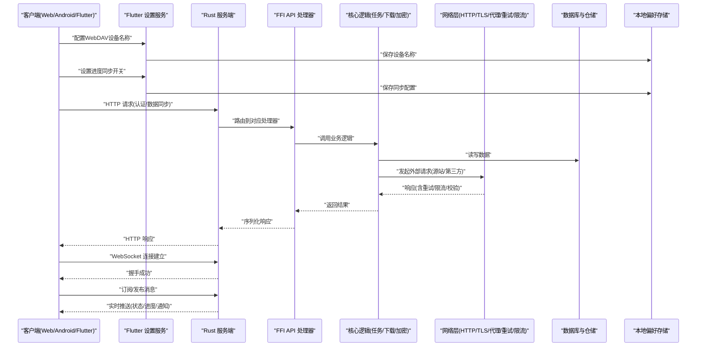

**图表来源** 
- [server.rs](file://rust/legado-server/src/server.rs)
- [routes.rs](file://rust/legado-server/src/routes.rs)
- [backup_api.rs](file://rust/legado-ffi/src/api/backup_api.rs)
- [bookshelf.rs](file://rust/legado-ffi/src/api/bookshelf.rs)
- [config_api.rs](file://rust/legado-ffi/src/api/config_api.rs)
- [user_api.rs](file://rust/legado-ffi/src/api/user_api.rs)
- [source.rs](file://rust/legado-ffi/src/api/source.rs)
- [auto_task_repository.rs](file://rust/legado-db/src/repository/auto_task_repository.rs)
- [auto_task.rs](file://rust/legado-core/src/auto_task.rs)
- [cron.rs](file://rust/legado-core/src/cron.rs)
- [download_manager.rs](file://rust/legado-core/src/download_manager.rs)
- [crypto.rs](file://rust/legado-core/src/crypto.rs)
- [passphrase.rs](file://rust/legado-core/src/passphrase.rs)
- [client.rs](file://rust/legado-net/src/client.rs)
- [ssl_config.rs](file://rust/legado-net/src/ssl_config.rs)
- [middleware.rs](file://rust/legado-net/src/middleware.rs)
- [retry.rs](file://rust/legado-net/src/retry.rs)
- [rate_limit.rs](file://rust/legado-net/src/rate_limit.rs)
- [cookie_store.rs](file://rust/legado-net/src/cookie_store.rs)
- [proxy.rs](file://rust/legado-net/src/proxy.rs)
- [verification.rs](file://rust/legado-net/src/verification.rs)
- [settings_service.dart](file://flutter_legado/lib/src/services/settings_service.dart)
- [sync_provider.dart](file://flutter_legado/lib/src/providers/sync_provider.dart)

## 详细组件分析

### 服务端与路由
- 服务端负责监听端口、启动 HTTP/WebSocket 服务、加载全局状态
- 路由将请求分发至对应的处理器，支持路径参数与查询参数
- 中间件链可注入认证、日志、限流、校验等功能

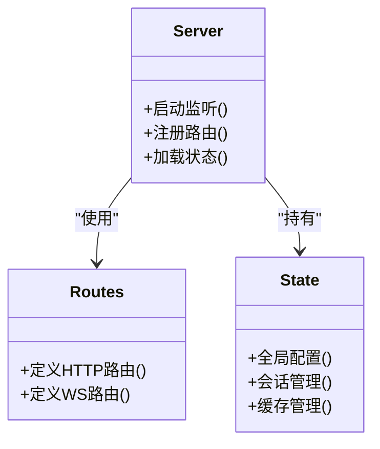

**图表来源** 
- [server.rs](file://rust/legado-server/src/server.rs)
- [routes.rs](file://rust/legado-server/src/routes.rs)
- [state.rs](file://rust/legado-server/src/state.rs)

**章节来源**
- [server.rs](file://rust/legado-server/src/server.rs)
- [routes.rs](file://rust/legado-server/src/routes.rs)
- [state.rs](file://rust/legado-server/src/state.rs)

### FFI API 处理器（备份、书架、配置、用户、来源）
- 备份接口：支持全量/增量备份与恢复，包含数据序列化与校验
- 书架接口：书籍列表、分类、搜索、收藏、阅读记录
- 配置接口：应用设置、主题、字体、网络代理等
- 用户接口：认证、授权、会话管理
- 来源接口：书源/音源/RSS 源的增删改查与校验

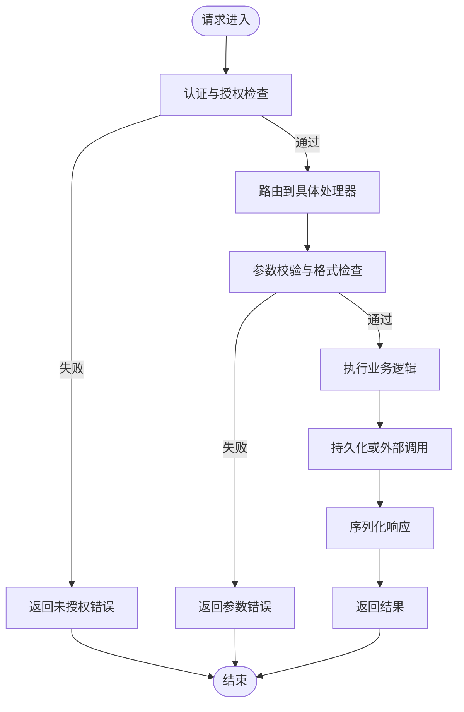

**图表来源** 
- [backup_api.rs](file://rust/legado-ffi/src/api/backup_api.rs)
- [bookshelf.rs](file://rust/legado-ffi/src/api/bookshelf.rs)
- [config_api.rs](file://rust/legado-ffi/src/api/config_api.rs)
- [user_api.rs](file://rust/legado-ffi/src/api/user_api.rs)
- [source.rs](file://rust/legado-ffi/src/api/source.rs)

**章节来源**
- [backup_api.rs](file://rust/legado-ffi/src/api/backup_api.rs)
- [bookshelf.rs](file://rust/legado-ffi/src/api/bookshelf.rs)
- [config_api.rs](file://rust/legado-ffi/src/api/config_api.rs)
- [user_api.rs](file://rust/legado-ffi/src/api/user_api.rs)
- [source.rs](file://rust/legado-ffi/src/api/source.rs)

### Flutter 设置服务与WebDAV配置管理
**新增** Flutter 设置服务提供了完整的WebDAV配置管理能力，包括设备名称管理和书籍进度同步控制：

- **设备名称管理**：`setWebDavDeviceName()` 和 `getWebDavDeviceName()` 方法用于设置和获取设备的唯一标识符
- **基础进度同步**：`setSyncBookProgress()` 和 `getSyncBookProgress()` 控制基本的书籍阅读进度同步
- **增强进度同步**：`setSyncBookProgressPlus()` 和 `getSyncBookProgressPlus()` 提供更详细的阅读进度信息同步
- **本地存储**：所有配置都通过 SharedPreferences 进行持久化存储

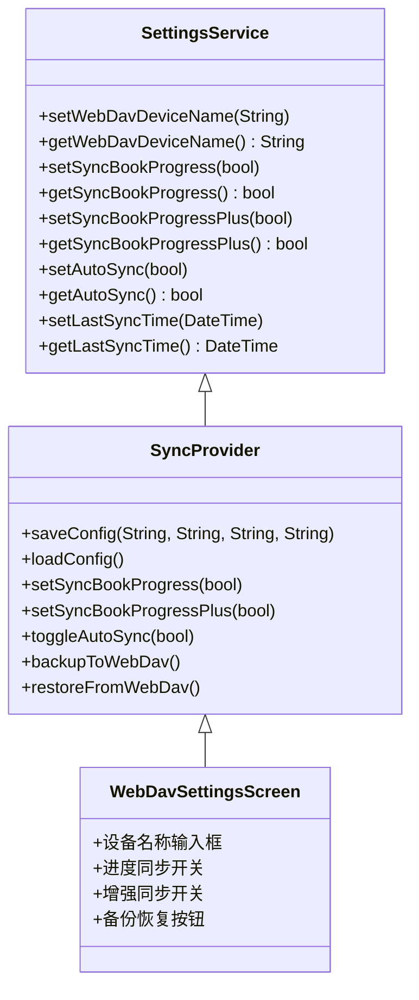

**图表来源** 
- [settings_service.dart](file://flutter_legado/lib/src/services/settings_service.dart)
- [sync_provider.dart](file://flutter_legado/lib/src/providers/sync_provider.dart)
- [webdav_settings_screen.dart](file://flutter_legado/lib/src/screens/webdav_settings_screen.dart)

**章节来源**
- [settings_service.dart](file://flutter_legado/lib/src/services/settings_service.dart)
- [sync_provider.dart](file://flutter_legado/lib/src/providers/sync_provider.dart)
- [webdav_settings_screen.dart](file://flutter_legado/lib/src/screens/webdav_settings_screen.dart)

### 自动任务调度与 Cron
- 自动任务支持定时执行、事件触发与任务队列
- Cron 表达式解析用于周期性任务调度
- 下载管理器协调批量下载与并发控制

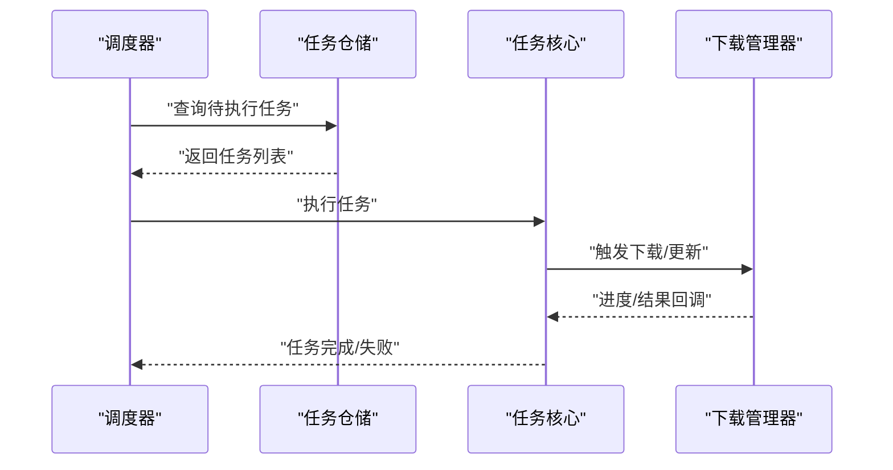

**图表来源** 
- [auto_task_repository.rs](file://rust/legado-db/src/repository/auto_task_repository.rs)
- [auto_task.rs](file://rust/legado-core/src/auto_task.rs)
- [cron.rs](file://rust/legado-core/src/cron.rs)
- [download_manager.rs](file://rust/legado-core/src/download_manager.rs)

**章节来源**
- [auto_task_repository.rs](file://rust/legado-db/src/repository/auto_task_repository.rs)
- [auto_task.rs](file://rust/legado-core/src/auto_task.rs)
- [cron.rs](file://rust/legado-core/src/cron.rs)
- [download_manager.rs](file://rust/legado-core/src/download_manager.rs)

### 网络层与安全
- HTTP 客户端统一封装，支持 SSL/TLS、代理、重试、限流、Cookie 存储、校验
- 中间件链可注入认证、日志、限流、校验等功能
- 校验模块确保请求合法性与完整性

**更新**：WebDAV配置流程、连接测试、自动同步和SOCKS5代理支持功能已从代码库中移除，网络层不再包含这些功能。

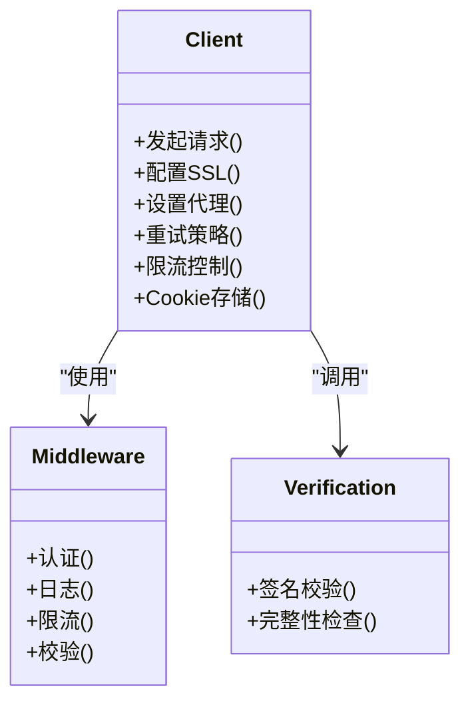

**图表来源** 
- [client.rs](file://rust/legado-net/src/client.rs)
- [ssl_config.rs](file://rust/legado-net/src/ssl_config.rs)
- [middleware.rs](file://rust/legado-net/src/middleware.rs)
- [retry.rs](file://rust/legado-net/src/retry.rs)
- [rate_limit.rs](file://rust/legado-net/src/rate_limit.rs)
- [cookie_store.rs](file://rust/legado-net/src/cookie_store.rs)
- [proxy.rs](file://rust/legado-net/src/proxy.rs)
- [verification.rs](file://rust/legado-net/src/verification.rs)

**章节来源**
- [client.rs](file://rust/legado-net/src/client.rs)
- [ssl_config.rs](file://rust/legado-net/src/ssl_config.rs)
- [middleware.rs](file://rust/legado-net/src/middleware.rs)
- [retry.rs](file://rust/legado-net/src/retry.rs)
- [rate_limit.rs](file://rust/legado-net/src/rate_limit.rs)
- [cookie_store.rs](file://rust/legado-net/src/cookie_store.rs)
- [proxy.rs](file://rust/legado-net/src/proxy.rs)
- [verification.rs](file://rust/legado-net/src/verification.rs)

### 加密与口令
- 对称加密与非对称加密支持，用于数据传输与存储
- 口令管理与密钥派生，确保敏感数据安全

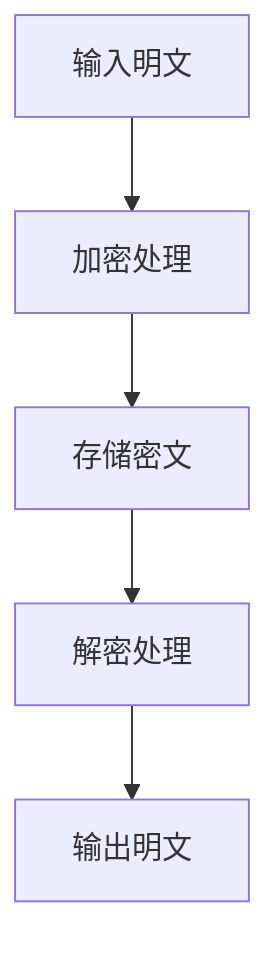

**图表来源** 
- [crypto.rs](file://rust/legado-core/src/crypto.rs)
- [passphrase.rs](file://rust/legado-core/src/passphrase.rs)

**章节来源**
- [crypto.rs](file://rust/legado-core/src/crypto.rs)
- [passphrase.rs](file://rust/legado-core/src/passphrase.rs)

### 前端 Web 与连接管理
- API 封装：统一的 HTTP 客户端与错误处理
- 连接状态管理：WebSocket 连接生命周期、重连机制
- 书架与书籍状态同步：本地与云端数据一致性

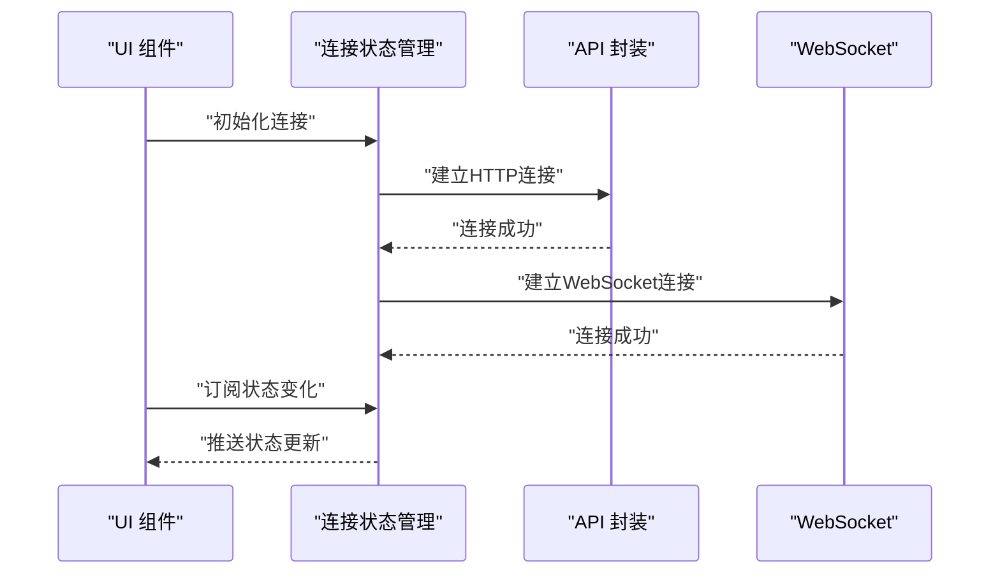

**图表来源** 
- [api.ts](file://modules/web/src/api/api.ts)
- [axios.ts](file://modules/web/src/api/axios.ts)
- [index.ts](file://modules/web/src/api/index.ts)
- [connectionStore.ts](file://modules/web/src/store/connectionStore.ts)
- [bookStore.ts](file://modules/web/src/store/bookStore.ts)

**章节来源**
- [api.ts](file://modules/web/src/api/api.ts)
- [axios.ts](file://modules/web/src/api/axios.ts)
- [index.ts](file://modules/web/src/api/index.ts)
- [connectionStore.ts](file://modules/web/src/store/connectionStore.ts)
- [bookStore.ts](file://modules/web/src/store/bookStore.ts)

### Flutter WebDAV设置界面
**新增** WebDAV设置界面提供了直观的用户交互体验：

- **设备名称输入**：允许用户为当前设备设置唯一的识别名称
- **进度同步开关**：控制是否在不同设备间同步书籍阅读进度
- **增强同步开关**：在基础同步基础上提供更详细的阅读信息同步
- **备份恢复操作**：一键备份书架和书源到WebDAV，或从WebDAV恢复数据
- **最后同步时间**：显示最近一次同步的时间戳

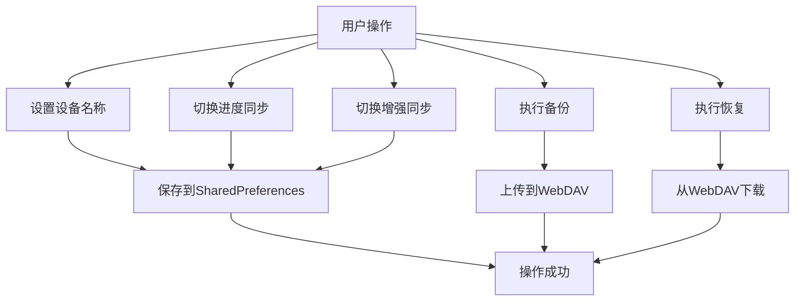

**图表来源** 
- [webdav_settings_screen.dart](file://flutter_legado/lib/src/screens/webdav_settings_screen.dart)
- [settings_service.dart](file://flutter_legado/lib/src/services/settings_service.dart)

**章节来源**
- [webdav_settings_screen.dart](file://flutter_legado/lib/src/screens/webdav_settings_screen.dart)
- [settings_service.dart](file://flutter_legado/lib/src/services/settings_service.dart)

## 依赖关系分析
- 服务端依赖 FFI API 处理器、核心逻辑、网络层与数据库
- 前端依赖 API 封装与连接状态管理
- 自动任务依赖调度器、仓储与下载管理器
- **新增** Flutter 设置服务依赖本地偏好存储和同步提供程序
- **新增** 同步提供程序依赖设置服务和API接口

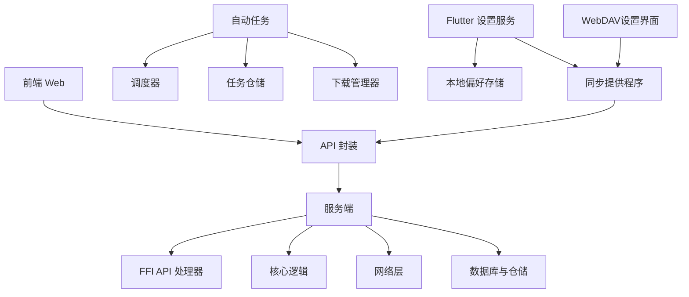

**图表来源** 
- [server.rs](file://rust/legado-server/src/server.rs)
- [backup_api.rs](file://rust/legado-ffi/src/api/backup_api.rs)
- [bookshelf.rs](file://rust/legado-ffi/src/api/bookshelf.rs)
- [config_api.rs](file://rust/legado-ffi/src/api/config_api.rs)
- [user_api.rs](file://rust/legado-ffi/src/api/user_api.rs)
- [source.rs](file://rust/legado-ffi/src/api/source.rs)
- [auto_task_repository.rs](file://rust/legado-db/src/repository/auto_task_repository.rs)
- [auto_task.rs](file://rust/legado-core/src/auto_task.rs)
- [cron.rs](file://rust/legado-core/src/cron.rs)
- [download_manager.rs](file://rust/legado-core/src/download_manager.rs)
- [api.ts](file://modules/web/src/api/api.ts)
- [axios.ts](file://modules/web/src/api/axios.ts)
- [index.ts](file://modules/web/src/api/index.ts)
- [connectionStore.ts](file://modules/web/src/store/connectionStore.ts)
- [bookStore.ts](file://modules/web/src/store/bookStore.ts)
- [settings_service.dart](file://flutter_legado/lib/src/services/settings_service.dart)
- [sync_provider.dart](file://flutter_legado/lib/src/providers/sync_provider.dart)
- [webdav_settings_screen.dart](file://flutter_legado/lib/src/screens/webdav_settings_screen.dart)

**章节来源**
- [server.rs](file://rust/legado-server/src/server.rs)
- [backup_api.rs](file://rust/legado-ffi/src/api/backup_api.rs)
- [bookshelf.rs](file://rust/legado-ffi/src/api/bookshelf.rs)
- [config_api.rs](file://rust/legado-ffi/src/api/config_api.rs)
- [user_api.rs](file://rust/legado-ffi/src/api/user_api.rs)
- [source.rs](file://rust/legado-ffi/src/api/source.rs)
- [auto_task_repository.rs](file://rust/legado-db/src/repository/auto_task_repository.rs)
- [auto_task.rs](file://rust/legado-core/src/auto_task.rs)
- [cron.rs](file://rust/legado-core/src/cron.rs)
- [download_manager.rs](file://rust/legado-core/src/download_manager.rs)
- [api.ts](file://modules/web/src/api/api.ts)
- [axios.ts](file://modules/web/src/api/axios.ts)
- [index.ts](file://modules/web/src/api/index.ts)
- [connectionStore.ts](file://modules/web/src/store/connectionStore.ts)
- [bookStore.ts](file://modules/web/src/store/bookStore.ts)
- [settings_service.dart](file://flutter_legado/lib/src/services/settings_service.dart)
- [sync_provider.dart](file://flutter_legado/lib/src/providers/sync_provider.dart)
- [webdav_settings_screen.dart](file://flutter_legado/lib/src/screens/webdav_settings_screen.dart)

## 性能考量
- 网络层：启用连接池、超时控制、重试退避、限流保护
- 数据库：索引优化、分页查询、事务隔离
- 任务调度：并发控制、优先级队列、失败重试
- 前端：请求去重、缓存策略、增量更新
- **新增** Flutter 设置服务：异步操作避免阻塞UI、异常处理保证稳定性、本地存储优化

[本节为通用指导，不直接分析具体文件]

## 故障排除指南
- 网络连接问题：检查代理、SSL 证书、超时配置
- 认证失败：确认令牌有效性、权限配置
- 同步失败：查看错误日志、重试策略、数据一致性
- WebSocket 断开：检查心跳机制、重连逻辑、防火墙规则
- **新增** WebDAV配置问题：检查设备名称是否正确、进度同步开关状态、SharedPreferences存储权限
- **新增** Flutter设置异常：检查异步操作异常处理、本地存储访问权限、UI线程安全性

**章节来源**
- [error.rs](file://rust/legado-server/src/error.rs)
- [ws_test.rs](file://rust/legado-server/tests/ws_test.rs)
- [integration_test.rs](file://rust/legado-server/tests/integration_test.rs)
- [settings_service.dart](file://flutter_legado/lib/src/services/settings_service.dart)
- [sync_provider_test.dart](file://flutter_legado/test/unit/sync_provider_test.dart)

## 结论
同步服务通过模块化设计与清晰的分层架构，实现了稳定高效的云端同步能力。RESTful API 与 WebSocket 结合，满足数据同步与实时通信需求。网络层与安全机制保障了传输与存储安全，自动任务调度提升了自动化水平。前端与客户端协同工作，确保用户体验一致。

**更新**：新增的Flutter设置服务增强了WebDAV配置管理能力，支持设备标识和精细化的进度同步控制，为用户提供了更灵活和直观的同步配置体验。随着WebDAV配置流程、连接测试、自动同步和SOCKS5代理支持功能的移除，系统架构更加精简，专注于核心的同步功能。

[本节为总结性内容，不直接分析具体文件]

## 附录
- API 调用示例：参考前端 API 封装与后端处理器
- 部署配置：环境变量、SSL 证书、代理设置
- 监控告警：日志收集、指标采集、异常告警
- **新增** Flutter设置配置：WebDAV设备名称设置、进度同步开关配置、本地存储键值说明
- **新增** 测试用例：同步提供程序单元测试、设置服务异常处理测试

[本节为补充信息，不直接分析具体文件]