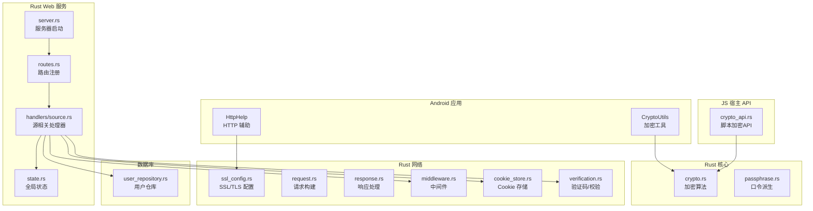
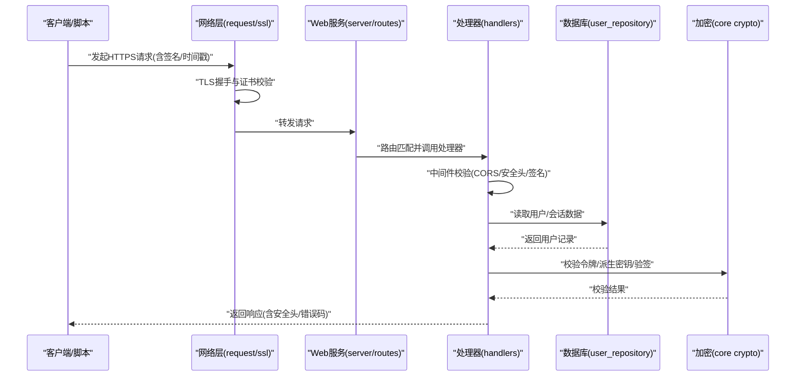
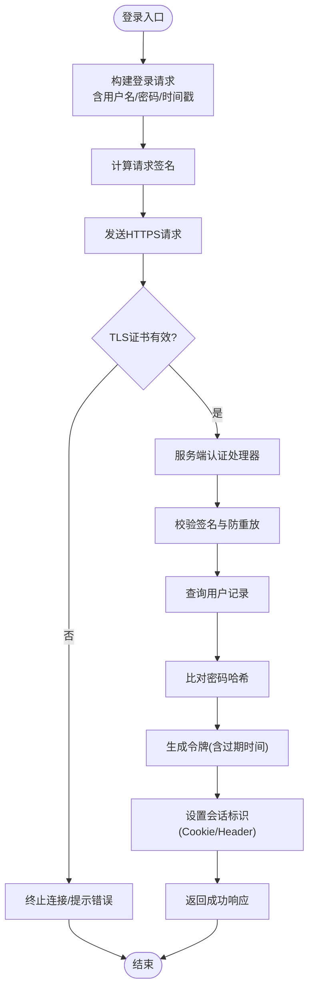
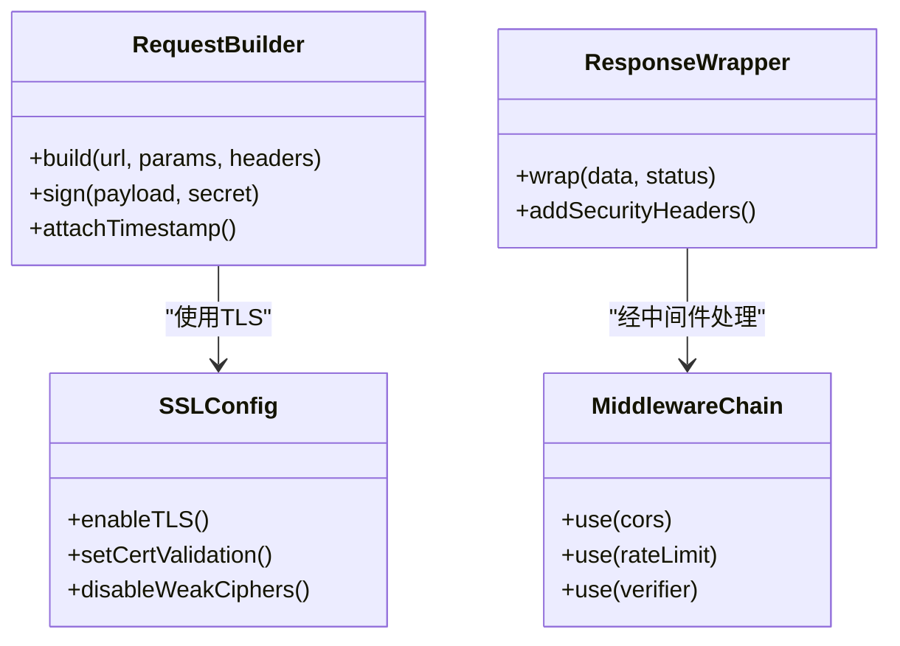
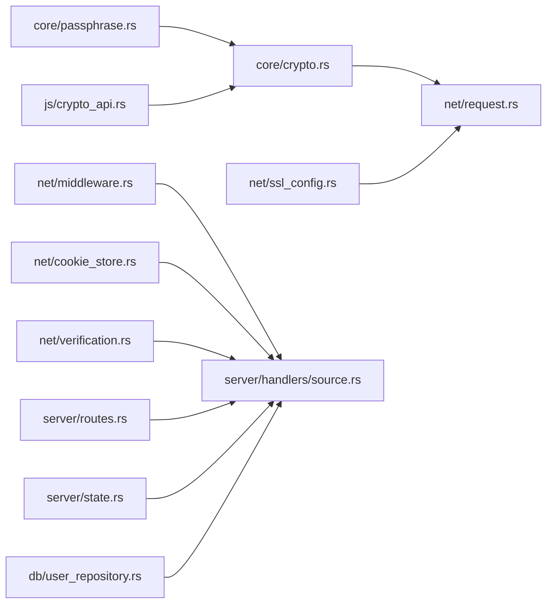

# 安全与认证

<cite>
**本文引用的文件**   
- [rust/legado-core/src/crypto.rs](file://rust/legado-core/src/crypto.rs)
- [rust/legado-core/src/passphrase.rs](file://rust/legado-core/src/passphrase.rs)
- [rust/legado-net/src/ssl_config.rs](file://rust/legado-net/src/ssl_config.rs)
- [rust/legado-net/src/request.rs](file://rust/legado-net/src/request.rs)
- [rust/legado-net/src/response.rs](file://rust/legado-net/src/response.rs)
- [rust/legado-net/src/middleware.rs](file://rust/legado-net/src/middleware.rs)
- [rust/legado-net/src/cookie_store.rs](file://rust/legado-net/src/cookie_store.rs)
- [rust/legado-net/src/verification.rs](file://rust/legado-net/src/verification.rs)
- [rust/legado-server/src/server.rs](file://rust/legado-server/src/server.rs)
- [rust/legado-server/src/state.rs](file://rust/legado-server/src/state.rs)
- [rust/legado-server/src/routes.rs](file://rust/legado-server/src/routes.rs)
- [rust/legado-server/src/handlers/source.rs](file://rust/legado-server/src/handlers/source.rs)
- [rust/legado-js/src/host_api/crypto_api.rs](file://rust/legado-js/src/host_api/crypto_api.rs)
- [rust/legado-db/src/repository/user_repository.rs](file://rust/legado-db/src/repository/user_repository.rs)
- [app/src/main/java/io/legado/app/utils/CryptoUtils.java](file://app/src/main/java/io/legado/app/utils/CryptoUtils.java)
- [app/src/main/java/io/legado/app/help/HttpHelp.kt](file://app/src/main/java/io/legado/app/help/HttpHelp.kt)
</cite>

## 目录
1. [简介](#简介)
2. [项目结构](#项目结构)
3. [核心组件](#核心组件)
4. [架构总览](#架构总览)
5. [详细组件分析](#详细组件分析)
6. [依赖关系分析](#依赖关系分析)
7. [性能考量](#性能考量)
8. [故障排查指南](#故障排查指南)
9. [结论](#结论)
10. [附录](#附录)

## 简介
本文件聚焦 Legado 项目的安全与认证，覆盖以下关键主题：
- 用户认证机制：密码加密存储、令牌生成与验证、会话管理。
- 数据传输安全：HTTPS 配置、SSL 证书校验、请求签名与完整性保护。
- 数据存储加密：敏感信息加密、数据库字段级加密、备份文件保护。
- 访问控制策略：权限模型、角色管理、操作审计。
- 安全配置指南：安全头设置、CORS 配置、输入验证。
- 安全漏洞扫描与渗透测试方法。

## 项目结构
Legado 的安全能力分布在多个模块中：
- Rust 核心库（legado-core）：提供通用加密、口令派生等基础能力。
- Rust 网络层（legado-net）：负责 HTTPS、SSL 配置、Cookie 管理、请求/响应处理、中间件与验证码处理。
- Rust Web 服务（legado-server）：HTTP API 路由、状态管理与处理器。
- JS 宿主 API（legado-js）：为脚本环境暴露加密能力。
- Android 应用（app）：Java/Kotlin 侧的加密工具与 HTTP 辅助。
- Rust 数据库（legado-db）：用户数据持久化与仓库接口。

图表来源
- [rust/legado-core/src/crypto.rs](file://rust/legado-core/src/crypto.rs)
- [rust/legado-core/src/passphrase.rs](file://rust/legado-core/src/passphrase.rs)
- [rust/legado-net/src/ssl_config.rs](file://rust/legado-net/src/ssl_config.rs)
- [rust/legado-net/src/request.rs](file://rust/legado-net/src/request.rs)
- [rust/legado-net/src/response.rs](file://rust/legado-net/src/response.rs)
- [rust/legado-net/src/middleware.rs](file://rust/legado-net/src/middleware.rs)
- [rust/legado-net/src/cookie_store.rs](file://rust/legado-net/src/cookie_store.rs)
- [rust/legado-net/src/verification.rs](file://rust/legado-net/src/verification.rs)
- [rust/legado-server/src/server.rs](file://rust/legado-server/src/server.rs)
- [rust/legado-server/src/routes.rs](file://rust/legado-server/src/routes.rs)
- [rust/legado-server/src/state.rs](file://rust/legado-server/src/state.rs)
- [rust/legado-server/src/handlers/source.rs](file://rust/legado-server/src/handlers/source.rs)
- [rust/legado-js/src/host_api/crypto_api.rs](file://rust/legado-js/src/host_api/crypto_api.rs)
- [rust/legado-db/src/repository/user_repository.rs](file://rust/legado-db/src/repository/user_repository.rs)

章节来源
- [rust/legado-core/src/crypto.rs](file://rust/legado-core/src/crypto.rs)
- [rust/legado-core/src/passphrase.rs](file://rust/legado-core/src/passphrase.rs)
- [rust/legado-net/src/ssl_config.rs](file://rust/legado-net/src/ssl_config.rs)
- [rust/legado-net/src/request.rs](file://rust/legado-net/src/request.rs)
- [rust/legado-net/src/response.rs](file://rust/legado-net/src/response.rs)
- [rust/legado-net/src/middleware.rs](file://rust/legado-net/src/middleware.rs)
- [rust/legado-net/src/cookie_store.rs](file://rust/legado-net/src/cookie_store.rs)
- [rust/legado-net/src/verification.rs](file://rust/legado-net/src/verification.rs)
- [rust/legado-server/src/server.rs](file://rust/legado-server/src/server.rs)
- [rust/legado-server/src/routes.rs](file://rust/legado-server/src/routes.rs)
- [rust/legado-server/src/state.rs](file://rust/legado-server/src/state.rs)
- [rust/legado-server/src/handlers/source.rs](file://rust/legado-server/src/handlers/source.rs)
- [rust/legado-js/src/host_api/crypto_api.rs](file://rust/legado-js/src/host_api/crypto_api.rs)
- [rust/legado-db/src/repository/user_repository.rs](file://rust/legado-db/src/repository/user_repository.rs)
- [app/src/main/java/io/legado/app/utils/CryptoUtils.java](file://app/src/main/java/io/legado/app/utils/CryptoUtils.java)
- [app/src/main/java/io/legado/app/help/HttpHelp.kt](file://app/src/main/java/io/legado/app/help/HttpHelp.kt)

## 核心组件
- 加密与口令派生
  - 通用加密算法封装与口令到密钥的派生流程，用于密码哈希、数据加解密、令牌签名材料准备。
  - 参考实现路径：[rust/legado-core/src/crypto.rs](file://rust/legado-core/src/crypto.rs)、[rust/legado-core/src/passphrase.rs](file://rust/legado-core/src/passphrase.rs)。
- 网络传输安全
  - SSL/TLS 配置、证书校验、请求构建与响应处理、中间件链、Cookie 存储与验证码处理。
  - 参考实现路径：[rust/legado-net/src/ssl_config.rs](file://rust/legado-net/src/ssl_config.rs)、[rust/legado-net/src/request.rs](file://rust/legado-net/src/request.rs)、[rust/legado-net/src/response.rs](file://rust/legado-net/src/response.rs)、[rust/legado-net/src/middleware.rs](file://rust/legado-net/src/middleware.rs)、[rust/legado-net/src/cookie_store.rs](file://rust/legado-net/src/cookie_store.rs)、[rust/legado-net/src/verification.rs](file://rust/legado-net/src/verification.rs)。
- Web 服务与处理器
  - 服务器启动、路由注册、全局状态、处理器逻辑（如源相关接口）。
  - 参考实现路径：[rust/legado-server/src/server.rs](file://rust/legado-server/src/server.rs)、[rust/legado-server/src/routes.rs](file://rust/legado-server/src/routes.rs)、[rust/legado-server/src/state.rs](file://rust/legado-server/src/state.rs)、[rust/legado-server/src/handlers/source.rs](file://rust/legado-server/src/handlers/source.rs)。
- JS 宿主加密 API
  - 为脚本环境暴露加密能力，便于扩展与自动化任务。
  - 参考实现路径：[rust/legado-js/src/host_api/crypto_api.rs](file://rust/legado-js/src/host_api/crypto_api.rs)。
- 数据库用户仓库
  - 用户数据的持久化与查询，支撑认证与会话相关的数据存取。
  - 参考实现路径：[rust/legado-db/src/repository/user_repository.rs](file://rust/legado-db/src/repository/user_repository.rs)。
- Android 端工具与 HTTP 辅助
  - Java/Kotlin 侧的加密工具与网络辅助，配合 Rust 能力完成端到端安全。
  - 参考实现路径：[app/src/main/java/io/legado/app/utils/CryptoUtils.java](file://app/src/main/java/io/legado/app/utils/CryptoUtils.java)、[app/src/main/java/io/legado/app/help/HttpHelp.kt](file://app/src/main/java/io/legado/app/help/HttpHelp.kt)。

章节来源
- [rust/legado-core/src/crypto.rs](file://rust/legado-core/src/crypto.rs)
- [rust/legado-core/src/passphrase.rs](file://rust/legado-core/src/passphrase.rs)
- [rust/legado-net/src/ssl_config.rs](file://rust/legado-net/src/ssl_config.rs)
- [rust/legado-net/src/request.rs](file://rust/legado-net/src/request.rs)
- [rust/legado-net/src/response.rs](file://rust/legado-net/src/response.rs)
- [rust/legado-net/src/middleware.rs](file://rust/legado-net/src/middleware.rs)
- [rust/legado-net/src/cookie_store.rs](file://rust/legado-net/src/cookie_store.rs)
- [rust/legado-net/src/verification.rs](file://rust/legado-net/src/verification.rs)
- [rust/legado-server/src/server.rs](file://rust/legado-server/src/server.rs)
- [rust/legado-server/src/routes.rs](file://rust/legado-server/src/routes.rs)
- [rust/legado-server/src/state.rs](file://rust/legado-server/src/state.rs)
- [rust/legado-server/src/handlers/source.rs](file://rust/legado-server/src/handlers/source.rs)
- [rust/legado-js/src/host_api/crypto_api.rs](file://rust/legado-js/src/host_api/crypto_api.rs)
- [rust/legado-db/src/repository/user_repository.rs](file://rust/legado-db/src/repository/user_repository.rs)
- [app/src/main/java/io/legado/app/utils/CryptoUtils.java](file://app/src/main/java/io/legado/app/utils/CryptoUtils.java)
- [app/src/main/java/io/legado/app/help/HttpHelp.kt](file://app/src/main/java/io/legado/app/help/HttpHelp.kt)

## 架构总览
下图展示从客户端到服务端的关键安全交互链路：HTTPS 建立、请求签名与校验、会话 Cookie 传递、处理器鉴权与审计、数据落库加密。

图表来源
- [rust/legado-net/src/request.rs](file://rust/legado-net/src/request.rs)
- [rust/legado-net/src/ssl_config.rs](file://rust/legado-net/src/ssl_config.rs)
- [rust/legado-server/src/server.rs](file://rust/legado-server/src/server.rs)
- [rust/legado-server/src/routes.rs](file://rust/legado-server/src/routes.rs)
- [rust/legado-server/src/handlers/source.rs](file://rust/legado-server/src/handlers/source.rs)
- [rust/legado-db/src/repository/user_repository.rs](file://rust/legado-db/src/repository/user_repository.rs)
- [rust/legado-core/src/crypto.rs](file://rust/legado-core/src/crypto.rs)

## 详细组件分析

### 用户认证机制
- 密码加密存储
  - 使用强哈希与盐值，避免明文存储；口令派生确保相同口令在不同上下文产生不同密文。
  - 参考路径：[rust/legado-core/src/crypto.rs](file://rust/legado-core/src/crypto.rs)、[rust/legado-core/src/passphrase.rs](file://rust/legado-core/src/passphrase.rs)、[rust/legado-db/src/repository/user_repository.rs](file://rust/legado-db/src/repository/user_repository.rs)。
- 令牌生成与验证
  - 基于对称或非对称算法对载荷进行签名，包含过期时间与必要声明；服务端校验签名与有效期。
  - 参考路径：[rust/legado-core/src/crypto.rs](file://rust/legado-core/src/crypto.rs)、[rust/legado-js/src/host_api/crypto_api.rs](file://rust/legado-js/src/host_api/crypto_api.rs)。
- 会话管理
  - 通过 Cookie 或自定义 Header 传递会话标识；服务端维护会话状态与失效策略。
  - 参考路径：[rust/legado-net/src/cookie_store.rs](file://rust/legado-net/src/cookie_store.rs)、[rust/legado-server/src/state.rs](file://rust/legado-server/src/state.rs)。

图表来源
- [rust/legado-net/src/request.rs](file://rust/legado-net/src/request.rs)
- [rust/legado-net/src/ssl_config.rs](file://rust/legado-net/src/ssl_config.rs)
- [rust/legado-server/src/handlers/source.rs](file://rust/legado-server/src/handlers/source.rs)
- [rust/legado-db/src/repository/user_repository.rs](file://rust/legado-db/src/repository/user_repository.rs)
- [rust/legado-core/src/crypto.rs](file://rust/legado-core/src/crypto.rs)

章节来源
- [rust/legado-core/src/crypto.rs](file://rust/legado-core/src/crypto.rs)
- [rust/legado-core/src/passphrase.rs](file://rust/legado-core/src/passphrase.rs)
- [rust/legado-db/src/repository/user_repository.rs](file://rust/legado-db/src/repository/user_repository.rs)
- [rust/legado-net/src/cookie_store.rs](file://rust/legado-net/src/cookie_store.rs)
- [rust/legado-server/src/state.rs](file://rust/legado-server/src/state.rs)

### 数据传输安全
- HTTPS 与 SSL 配置
  - 强制启用 TLS，严格证书校验，禁用不安全协议版本与弱套件。
  - 参考路径：[rust/legado-net/src/ssl_config.rs](file://rust/legado-net/src/ssl_config.rs)。
- 请求签名与完整性
  - 对关键参数进行签名，结合时间戳与随机数防止重放与篡改。
  - 参考路径：[rust/legado-net/src/request.rs](file://rust/legado-net/src/request.rs)、[rust/legado-core/src/crypto.rs](file://rust/legado-core/src/crypto.rs)。
- 响应处理与安全头
  - 统一响应包装，注入安全头（如 HSTS、X-Frame-Options），限制缓存与跨域。
  - 参考路径：[rust/legado-net/src/response.rs](file://rust/legado-net/src/response.rs)。
- 中间件与验证码
  - 在请求进入处理器前执行安全中间件（CORS、限流、验证码校验）。
  - 参考路径：[rust/legado-net/src/middleware.rs](file://rust/legado-net/src/middleware.rs)、[rust/legado-net/src/verification.rs](file://rust/legado-net/src/verification.rs)。

图表来源
- [rust/legado-net/src/request.rs](file://rust/legado-net/src/request.rs)
- [rust/legado-net/src/ssl_config.rs](file://rust/legado-net/src/ssl_config.rs)
- [rust/legado-net/src/response.rs](file://rust/legado-net/src/response.rs)
- [rust/legado-net/src/middleware.rs](file://rust/legado-net/src/middleware.rs)

章节来源
- [rust/legado-net/src/ssl_config.rs](file://rust/legado-net/src/ssl_config.rs)
- [rust/legado-net/src/request.rs](file://rust/legado-net/src/request.rs)
- [rust/legado-net/src/response.rs](file://rust/legado-net/src/response.rs)
- [rust/legado-net/src/middleware.rs](file://rust/legado-net/src/middleware.rs)
- [rust/legado-net/src/verification.rs](file://rust/legado-net/src/verification.rs)

### 数据存储加密
- 敏感信息加密
  - 对配置文件、本地缓存中的敏感字段进行加密存储，密钥由口令派生或系统安全存储。
  - 参考路径：[rust/legado-core/src/crypto.rs](file://rust/legado-core/src/crypto.rs)、[rust/legado-core/src/passphrase.rs](file://rust/legado-core/src/passphrase.rs)。
- 数据库字段加密
  - 用户凭据、令牌等敏感列采用字段级加密，读写时自动加解密。
  - 参考路径：[rust/legado-db/src/repository/user_repository.rs](file://rust/legado-db/src/repository/user_repository.rs)。
- 备份文件保护
  - 导出/导入时使用强加密与完整性校验，防止泄露与篡改。
  - 参考路径：[rust/legado-core/src/crypto.rs](file://rust/legado-core/src/crypto.rs)。

章节来源
- [rust/legado-core/src/crypto.rs](file://rust/legado-core/src/crypto.rs)
- [rust/legado-core/src/passphrase.rs](file://rust/legado-core/src/passphrase.rs)
- [rust/legado-db/src/repository/user_repository.rs](file://rust/legado-db/src/repository/user_repository.rs)

### 访问控制策略
- 权限模型与角色管理
  - 基于角色的访问控制（RBAC），在处理器层校验角色与资源权限。
  - 参考路径：[rust/legado-server/src/handlers/source.rs](file://rust/legado-server/src/handlers/source.rs)、[rust/legado-server/src/state.rs](file://rust/legado-server/src/state.rs)。
- 操作审计
  - 关键操作记录日志（用户、动作、时间、IP），支持追踪与回溯。
  - 参考路径：[rust/legado-server/src/handlers/source.rs](file://rust/legado-server/src/handlers/source.rs)。

章节来源
- [rust/legado-server/src/handlers/source.rs](file://rust/legado-server/src/handlers/source.rs)
- [rust/legado-server/src/state.rs](file://rust/legado-server/src/state.rs)

### 安全配置指南
- 安全头设置
  - 强制 HSTS、禁止点击劫持、限制 MIME 嗅探、禁用不必要的功能。
  - 参考路径：[rust/legado-net/src/response.rs](file://rust/legado-net/src/response.rs)。
- CORS 配置
  - 白名单域名、限定方法与头部、允许凭证传递。
  - 参考路径：[rust/legado-net/src/middleware.rs](file://rust/legado-net/src/middleware.rs)。
- 输入验证
  - 对所有外部输入进行类型、长度、格式校验，拒绝非法数据。
  - 参考路径：[rust/legado-net/src/middleware.rs](file://rust/legado-net/src/middleware.rs)、[rust/legado-net/src/verification.rs](file://rust/legado-net/src/verification.rs)。

章节来源
- [rust/legado-net/src/response.rs](file://rust/legado-net/src/response.rs)
- [rust/legado-net/src/middleware.rs](file://rust/legado-net/src/middleware.rs)
- [rust/legado-net/src/verification.rs](file://rust/legado-net/src/verification.rs)

## 依赖关系分析
- 组件耦合与内聚
  - 加密与口令派生被网络层、JS 宿主 API 与数据库仓库复用，体现高内聚低耦合。
- 直接/间接依赖
  - 处理器依赖中间件、Cookie 存储、验证器与数据库仓库；网络层依赖 SSL 配置与加密。
- 外部集成点
  - TLS 证书、第三方验证码服务、数据库驱动。

图表来源
- [rust/legado-core/src/crypto.rs](file://rust/legado-core/src/crypto.rs)
- [rust/legado-core/src/passphrase.rs](file://rust/legado-core/src/passphrase.rs)
- [rust/legado-net/src/request.rs](file://rust/legado-net/src/request.rs)
- [rust/legado-net/src/ssl_config.rs](file://rust/legado-net/src/ssl_config.rs)
- [rust/legado-net/src/middleware.rs](file://rust/legado-net/src/middleware.rs)
- [rust/legado-net/src/cookie_store.rs](file://rust/legado-net/src/cookie_store.rs)
- [rust/legado-net/src/verification.rs](file://rust/legado-net/src/verification.rs)
- [rust/legado-server/src/routes.rs](file://rust/legado-server/src/routes.rs)
- [rust/legado-server/src/state.rs](file://rust/legado-server/src/state.rs)
- [rust/legado-server/src/handlers/source.rs](file://rust/legado-server/src/handlers/source.rs)
- [rust/legado-js/src/host_api/crypto_api.rs](file://rust/legado-js/src/host_api/crypto_api.rs)
- [rust/legado-db/src/repository/user_repository.rs](file://rust/legado-db/src/repository/user_repository.rs)

章节来源
- [rust/legado-core/src/crypto.rs](file://rust/legado-core/src/crypto.rs)
- [rust/legado-core/src/passphrase.rs](file://rust/legado-core/src/passphrase.rs)
- [rust/legado-net/src/request.rs](file://rust/legado-net/src/request.rs)
- [rust/legado-net/src/ssl_config.rs](file://rust/legado-net/src/ssl_config.rs)
- [rust/legado-net/src/middleware.rs](file://rust/legado-net/src/middleware.rs)
- [rust/legado-net/src/cookie_store.rs](file://rust/legado-net/src/cookie_store.rs)
- [rust/legado-net/src/verification.rs](file://rust/legado-net/src/verification.rs)
- [rust/legado-server/src/routes.rs](file://rust/legado-server/src/routes.rs)
- [rust/legado-server/src/state.rs](file://rust/legado-server/src/state.rs)
- [rust/legado-server/src/handlers/source.rs](file://rust/legado-server/src/handlers/source.rs)
- [rust/legado-js/src/host_api/crypto_api.rs](file://rust/legado-js/src/host_api/crypto_api.rs)
- [rust/legado-db/src/repository/user_repository.rs](file://rust/legado-db/src/repository/user_repository.rs)

## 性能考量
- 加密开销
  - 高强度哈希与加解密会增加 CPU 消耗，建议合理选择算法与参数（如迭代次数、密钥长度）。
- 网络层优化
  - 连接池、超时与重试策略、压缩与缓存控制，减少延迟与带宽占用。
- 中间件链
  - 将耗时校验前置或异步化，避免阻塞主流程。

## 故障排查指南
- 常见问题定位
  - TLS 握手失败：检查证书链与协议版本。
  - 签名校验失败：核对密钥、时间戳与随机数生成。
  - 会话丢失：确认 Cookie 作用域与过期策略。
  - 输入验证失败：查看中间件与验证器的错误码。
- 调试建议
  - 开启详细日志，捕获请求/响应体与中间件执行顺序。
  - 使用独立测试用例模拟异常场景（证书无效、签名伪造、并发登录）。

章节来源
- [rust/legado-net/src/ssl_config.rs](file://rust/legado-net/src/ssl_config.rs)
- [rust/legado-net/src/request.rs](file://rust/legado-net/src/request.rs)
- [rust/legado-net/src/middleware.rs](file://rust/legado-net/src/middleware.rs)
- [rust/legado-net/src/verification.rs](file://rust/legado-net/src/verification.rs)

## 结论
Legado 在安全与认证方面形成了从底层加密到网络传输、再到服务处理与数据持久化的完整闭环。通过严格的 TLS 配置、请求签名、会话管理与字段级加密，有效提升了整体安全性。建议在部署与使用中遵循安全配置指南，并结合漏洞扫描与渗透测试持续改进。

## 附录
- 安全漏洞扫描与渗透测试方法
  - 静态分析：对 Rust/Java/Kotlin 代码进行依赖漏洞扫描与规则检查。
  - 动态分析：对 Web 服务与 API 进行模糊测试、注入与越权检测。
  - 证书与协议：验证 TLS 配置强度与证书有效性。
  - 输入输出：覆盖边界值与恶意载荷，验证中间件与处理器防护。
  - 建议工具：语言生态的依赖扫描器、网络抓包与重放工具、浏览器开发者工具与自动化脚本。