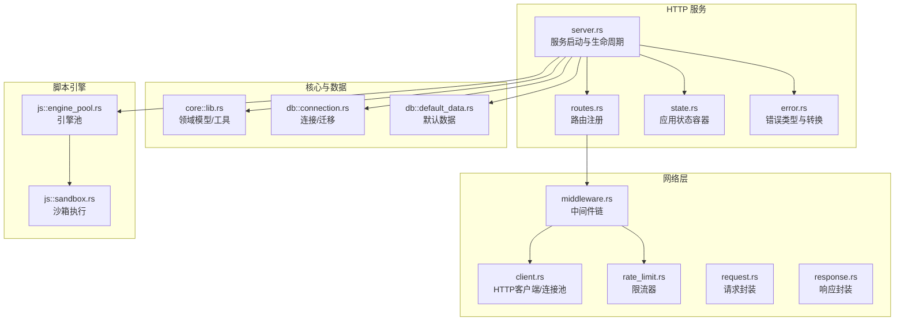
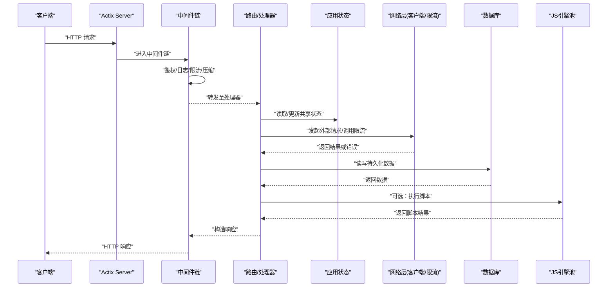
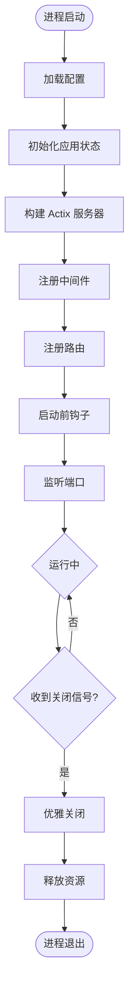
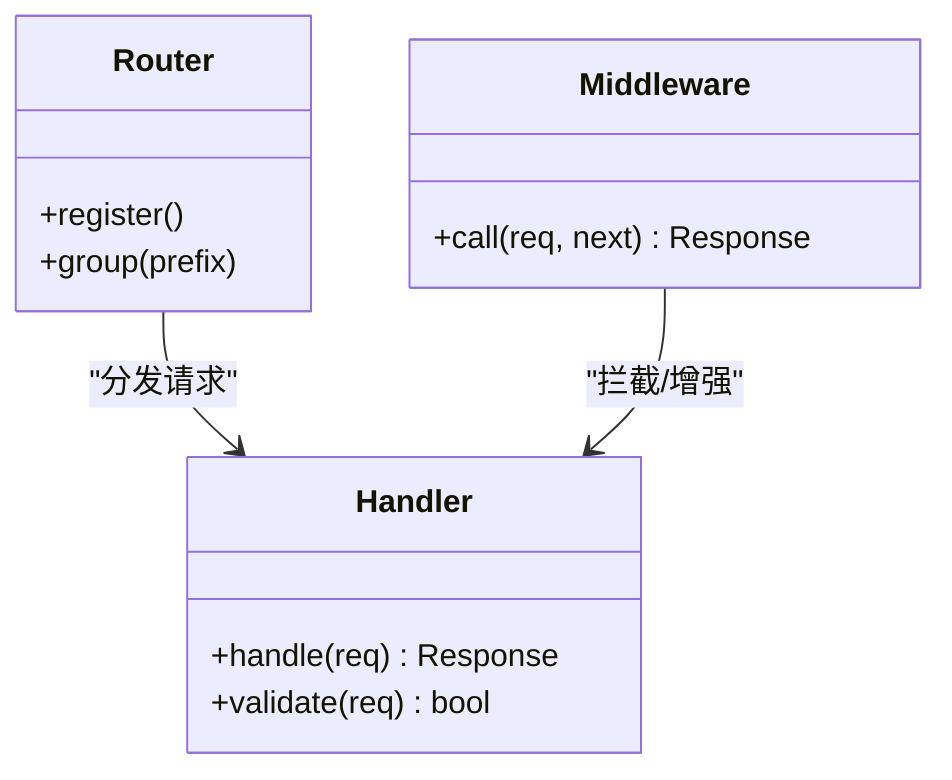
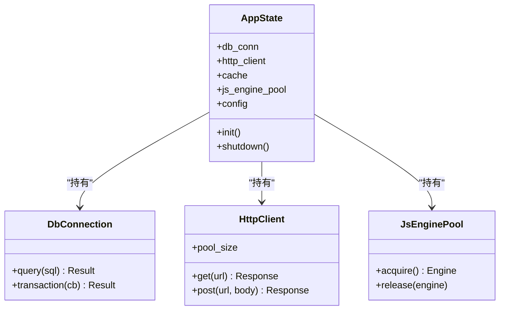
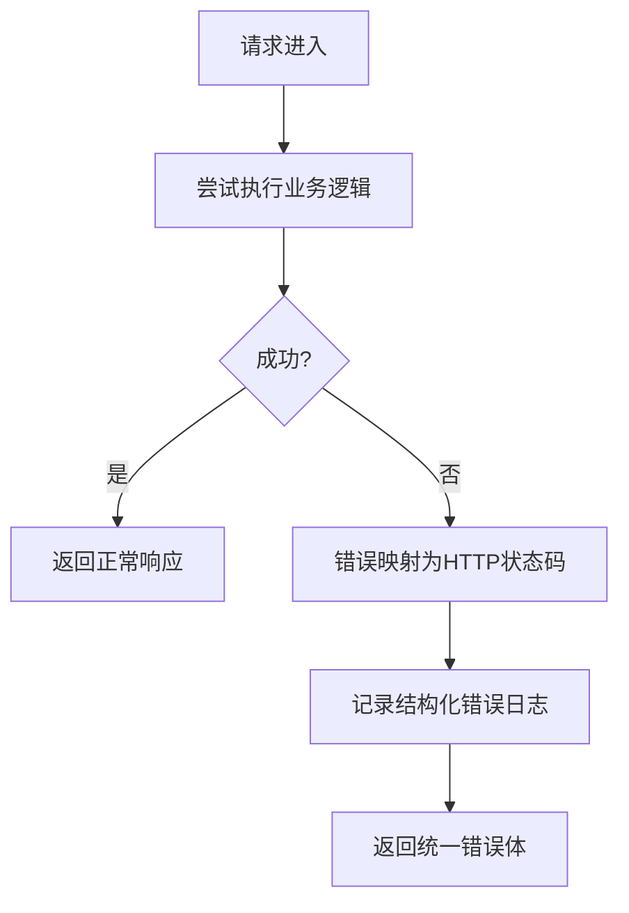
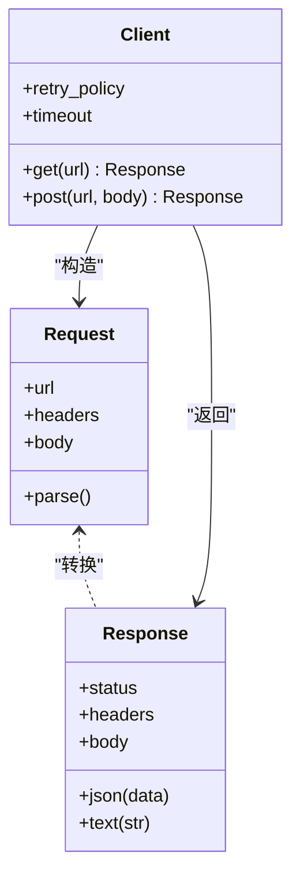
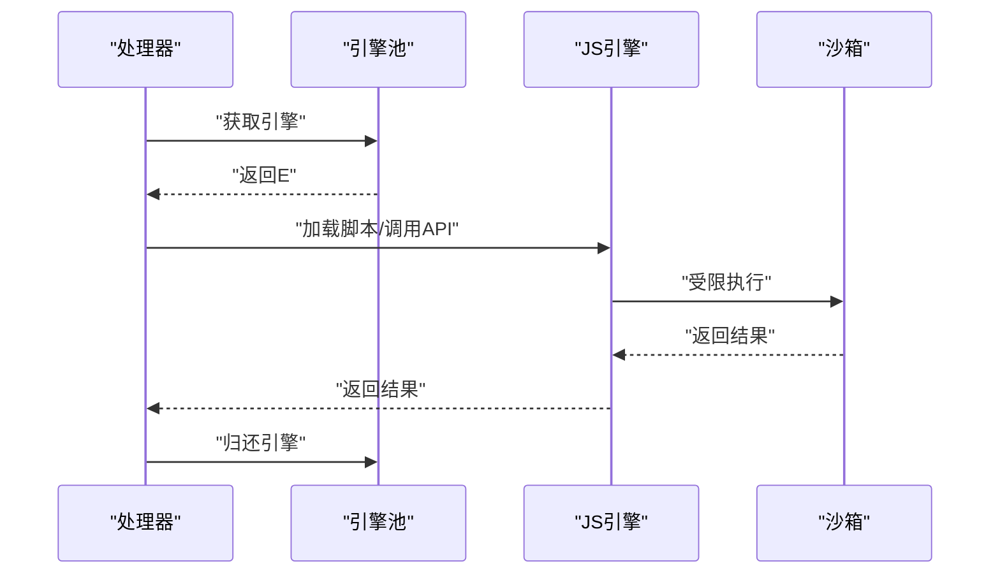
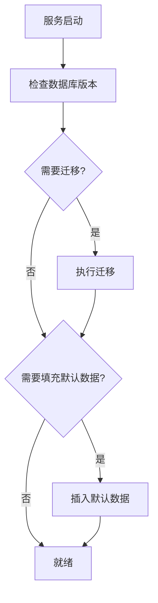
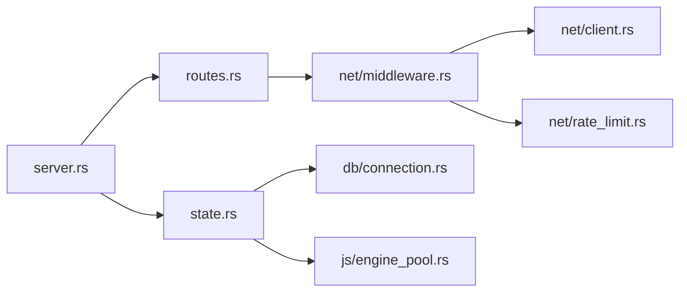

# 服务端架构

<cite>
**本文引用的文件**   
- [rust/legado-server/src/server.rs](file://rust/legado-server/src/server.rs)
- [rust/legado-server/src/routes.rs](file://rust/legado-server/src/routes.rs)
- [rust/legado-server/src/state.rs](file://rust/legado-server/src/state.rs)
- [rust/legado-server/src/error.rs](file://rust/legado-server/src/error.rs)
- [rust/legado-server/src/lib.rs](file://rust/legado-server/src/lib.rs)
- [rust/legado-net/src/middleware.rs](file://rust/legado-net/src/middleware.rs)
- [rust/legado-net/src/client.rs](file://rust/legado-net/src/client.rs)
- [rust/legado-net/src/rate_limit.rs](file://rust/legado-net/src/rate_limit.rs)
- [rust/legado-net/src/request.rs](file://rust/legado-net/src/request.rs)
- [rust/legado-net/src/response.rs](file://rust/legado-net/src/response.rs)
- [rust/legado-core/src/lib.rs](file://rust/legado-core/src/lib.rs)
- [rust/legado-db/src/connection.rs](file://rust/legado-db/src/connection.rs)
- [rust/legado-db/src/default_data.rs](file://rust/legado-db/src/default_data.rs)
- [rust/legado-js/src/engine_pool.rs](file://rust/legado-js/src/engine_pool.rs)
- [rust/legado-js/src/sandbox.rs](file://rust/legado-js/src/sandbox.rs)
- [rust/legado-book/src/lib.rs](file://rust/legado-book/src/lib.rs)
</cite>

## 目录
1. [简介](#简介)
2. [项目结构](#项目结构)
3. [核心组件](#核心组件)
4. [架构总览](#架构总览)
5. [详细组件分析](#详细组件分析)
6. [依赖关系分析](#依赖关系分析)
7. [性能考量](#性能考量)
8. [故障排查指南](#故障排查指南)
9. [结论](#结论)
10. [附录](#附录)

## 简介
本文件面向服务端架构，聚焦于基于 Actix-web 的 HTTP 服务实现。文档覆盖请求处理流程、中间件机制、路由配置、应用状态管理（初始化、并发安全、内存管理）、服务启动与生命周期（依赖注入、配置加载、优雅关闭）、错误处理与日志记录、以及性能优化策略（连接池、缓存、资源清理）。文中所有技术细节均映射到仓库中的实际代码文件，便于读者快速定位源码并深入理解。

## 项目结构
服务端核心位于 Rust 子模块 legado-server，围绕 Actix-web 构建，配合 legado-net（网络层）、legado-core（领域模型与通用逻辑）、legado-db（数据库访问）、legado-js（脚本引擎）等模块协同工作。

图表来源 
- [rust/legado-server/src/server.rs](file://rust/legado-server/src/server.rs)
- [rust/legado-server/src/routes.rs](file://rust/legado-server/src/routes.rs)
- [rust/legado-server/src/state.rs](file://rust/legado-server/src/state.rs)
- [rust/legado-server/src/error.rs](file://rust/legado-server/src/error.rs)
- [rust/legado-net/src/middleware.rs](file://rust/legado-net/src/middleware.rs)
- [rust/legado-net/src/client.rs](file://rust/legado-net/src/client.rs)
- [rust/legado-net/src/rate_limit.rs](file://rust/legado-net/src/rate_limit.rs)
- [rust/legado-net/src/request.rs](file://rust/legado-net/src/request.rs)
- [rust/legado-net/src/response.rs](file://rust/legado-net/src/response.rs)
- [rust/legado-core/src/lib.rs](file://rust/legado-core/src/lib.rs)
- [rust/legado-db/src/connection.rs](file://rust/legado-db/src/connection.rs)
- [rust/legado-db/src/default_data.rs](file://rust/legado-db/src/default_data.rs)
- [rust/legado-js/src/engine_pool.rs](file://rust/legado-js/src/engine_pool.rs)
- [rust/legado-js/src/sandbox.rs](file://rust/legado-js/src/sandbox.rs)

章节来源
- [rust/legado-server/src/lib.rs](file://rust/legado-server/src/lib.rs)

## 核心组件
- 服务启动与生命周期：负责创建 Actix 服务器、绑定端口、注册中间件与路由、启动/停止钩子、优雅关闭。
- 路由与处理器：按功能域划分路由组，统一参数校验、鉴权、日志、限流等横切关注点。
- 应用状态：集中管理数据库连接、外部客户端、缓存、脚本引擎池等共享资源，保证线程安全与生命周期一致。
- 中间件链：请求进入时依次经过认证、日志、限流、压缩、超时等中间件；响应返回时反向处理。
- 错误与日志：定义统一的错误类型、HTTP 状态码映射、结构化日志输出。
- 网络层：HTTP 客户端连接池、重试、代理、SSL、速率限制、Cookie 管理等。
- 数据与脚本：数据库连接与迁移、默认数据初始化；JS 引擎池与沙箱隔离执行。

章节来源
- [rust/legado-server/src/server.rs](file://rust/legado-server/src/server.rs)
- [rust/legado-server/src/routes.rs](file://rust/legado-server/src/routes.rs)
- [rust/legado-server/src/state.rs](file://rust/legado-server/src/state.rs)
- [rust/legado-net/src/middleware.rs](file://rust/legado-net/src/middleware.rs)
- [rust/legado-net/src/client.rs](file://rust/legado-net/src/client.rs)
- [rust/legado-net/src/rate_limit.rs](file://rust/legado-net/src/rate_limit.rs)
- [rust/legado-core/src/lib.rs](file://rust/legado-core/src/lib.rs)
- [rust/legado-db/src/connection.rs](file://rust/legado-db/src/connection.rs)
- [rust/legado-db/src/default_data.rs](file://rust/legado-db/src/default_data.rs)
- [rust/legado-js/src/engine_pool.rs](file://rust/legado-js/src/engine_pool.rs)
- [rust/legado-js/src/sandbox.rs](file://rust/legado-js/src/sandbox.rs)

## 架构总览
下图展示一次典型 HTTP 请求从接入到响应的完整路径，包括中间件、路由、业务处理、数据访问与脚本执行。

图表来源 
- [rust/legado-server/src/server.rs](file://rust/legado-server/src/server.rs)
- [rust/legado-server/src/routes.rs](file://rust/legado-server/src/routes.rs)
- [rust/legado-server/src/state.rs](file://rust/legado-server/src/state.rs)
- [rust/legado-net/src/middleware.rs](file://rust/legado-net/src/middleware.rs)
- [rust/legado-net/src/client.rs](file://rust/legado-net/src/client.rs)
- [rust/legado-net/src/rate_limit.rs](file://rust/legado-net/src/rate_limit.rs)
- [rust/legado-db/src/connection.rs](file://rust/legado-db/src/connection.rs)
- [rust/legado-js/src/engine_pool.rs](file://rust/legado-js/src/engine_pool.rs)

## 详细组件分析

### 服务启动与生命周期
- 启动流程：创建 Actix 服务器实例，设置最大并发、工作线程数、TLS/证书（如启用），注册全局中间件与路由，启动前初始化应用状态（数据库连接、默认数据、脚本引擎池、外部客户端等）。
- 生命周期钩子：提供启动完成回调与优雅关闭信号监听，确保在退出时释放连接池、关闭脚本引擎、刷新持久化数据。
- 配置加载：从环境变量/配置文件加载端口、日志级别、数据库连接串、外部服务地址等，支持热重载关键配置。

图表来源 
- [rust/legado-server/src/server.rs](file://rust/legado-server/src/server.rs)
- [rust/legado-server/src/state.rs](file://rust/legado-server/src/state.rs)
- [rust/legado-db/src/connection.rs](file://rust/legado-db/src/connection.rs)
- [rust/legado-db/src/default_data.rs](file://rust/legado-db/src/default_data.rs)
- [rust/legado-js/src/engine_pool.rs](file://rust/legado-js/src/engine_pool.rs)

章节来源
- [rust/legado-server/src/server.rs](file://rust/legado-server/src/server.rs)
- [rust/legado-server/src/state.rs](file://rust/legado-server/src/state.rs)

### 路由与处理器
- 路由组织：按功能域分组（如用户、书籍、源、RSS、系统信息），每个组内包含 RESTful 接口与 WebSocket 端点。
- 处理器职责：解析请求体与查询参数，调用领域服务，组装响应体，统一错误码与消息。
- 参数校验：使用强类型结构体与验证库进行输入校验，失败直接返回 4xx。

图表来源 
- [rust/legado-server/src/routes.rs](file://rust/legado-server/src/routes.rs)
- [rust/legado-net/src/middleware.rs](file://rust/legado-net/src/middleware.rs)

章节来源
- [rust/legado-server/src/routes.rs](file://rust/legado-server/src/routes.rs)

### 中间件机制
- 中间件链：鉴权、日志、请求追踪、限流、压缩、跨域、超时控制等。
- 执行顺序：入站顺序执行，出站逆序执行，便于统一埋点与度量。
- 扩展性：新增中间件只需实现统一接口，并在注册阶段插入。

图表来源 
- [rust/legado-net/src/middleware.rs](file://rust/legado-net/src/middleware.rs)
- [rust/legado-net/src/rate_limit.rs](file://rust/legado-net/src/rate_limit.rs)

章节来源
- [rust/legado-net/src/middleware.rs](file://rust/legado-net/src/middleware.rs)
- [rust/legado-net/src/rate_limit.rs](file://rust/legado-net/src/rate_limit.rs)

### 应用状态与并发安全
- 状态容器：集中持有数据库连接、外部 HTTP 客户端、缓存、脚本引擎池、配置快照等。
- 并发安全：通过原子引用/不可变共享（如 Arc<Mutex<T>> 或更细粒度的锁）保证多线程访问安全。
- 内存管理：对象池复用、大对象分块处理、及时释放临时缓冲区，避免内存泄漏。

图表来源 
- [rust/legado-server/src/state.rs](file://rust/legado-server/src/state.rs)
- [rust/legado-db/src/connection.rs](file://rust/legado-db/src/connection.rs)
- [rust/legado-net/src/client.rs](file://rust/legado-net/src/client.rs)
- [rust/legado-js/src/engine_pool.rs](file://rust/legado-js/src/engine_pool.rs)

章节来源
- [rust/legado-server/src/state.rs](file://rust/legado-server/src/state.rs)
- [rust/legado-db/src/connection.rs](file://rust/legado-db/src/connection.rs)
- [rust/legado-net/src/client.rs](file://rust/legado-net/src/client.rs)
- [rust/legado-js/src/engine_pool.rs](file://rust/legado-js/src/engine_pool.rs)

### 错误处理与日志记录
- 错误类型：定义领域错误、网络错误、IO 错误、序列化错误，并提供 HTTP 状态码映射。
- 异常捕获：全局错误处理器统一捕获未处理异常，返回标准化 JSON 错误体。
- 日志级别：根据环境（开发/测试/生产）动态调整日志级别，支持结构化字段（trace_id、span_id、user_id）。

图表来源 
- [rust/legado-server/src/error.rs](file://rust/legado-server/src/error.rs)

章节来源
- [rust/legado-server/src/error.rs](file://rust/legado-server/src/error.rs)

### 网络层与请求/响应封装
- 请求封装：统一解析 URL、Header、Body，支持模板变量替换、签名校验。
- 响应封装：统一序列化、分页包装、错误包装、压缩与缓存头。
- 客户端：连接池、重试、退避、代理、SSL 配置、Cookie 存储。

图表来源 
- [rust/legado-net/src/request.rs](file://rust/legado-net/src/request.rs)
- [rust/legado-net/src/response.rs](file://rust/legado-net/src/response.rs)
- [rust/legado-net/src/client.rs](file://rust/legado-net/src/client.rs)

章节来源
- [rust/legado-net/src/request.rs](file://rust/legado-net/src/request.rs)
- [rust/legado-net/src/response.rs](file://rust/legado-net/src/response.rs)
- [rust/legado-net/src/client.rs](file://rust/legado-net/src/client.rs)

### 脚本引擎与沙箱
- 引擎池：预创建多个 JS 引擎实例，按需获取与归还，降低上下文切换开销。
- 沙箱：限制 API 白名单、内存/CPU 配额、执行超时，防止恶意脚本影响服务稳定性。

图表来源 
- [rust/legado-js/src/engine_pool.rs](file://rust/legado-js/src/engine_pool.rs)
- [rust/legado-js/src/sandbox.rs](file://rust/legado-js/src/sandbox.rs)

章节来源
- [rust/legado-js/src/engine_pool.rs](file://rust/legado-js/src/engine_pool.rs)
- [rust/legado-js/src/sandbox.rs](file://rust/legado-js/src/sandbox.rs)

### 数据访问与默认数据
- 连接管理：连接池大小、超时、重试、事务边界清晰。
- 默认数据：首次启动时写入基础字典、主题、规则等，支持增量更新。

图表来源 
- [rust/legado-db/src/connection.rs](file://rust/legado-db/src/connection.rs)
- [rust/legado-db/src/default_data.rs](file://rust/legado-db/src/default_data.rs)

章节来源
- [rust/legado-db/src/connection.rs](file://rust/legado-db/src/connection.rs)
- [rust/legado-db/src/default_data.rs](file://rust/legado-db/src/default_data.rs)

## 依赖关系分析
- 低耦合高内聚：HTTP 层仅依赖状态容器与路由处理器，不直接感知底层实现。
- 明确边界：网络层、数据库层、脚本层通过接口/结构体解耦，便于替换与测试。
- 潜在循环依赖：通过状态容器与事件总线化解，避免模块间直接互相引用。

图表来源 
- [rust/legado-server/src/server.rs](file://rust/legado-server/src/server.rs)
- [rust/legado-server/src/routes.rs](file://rust/legado-server/src/routes.rs)
- [rust/legado-server/src/state.rs](file://rust/legado-server/src/state.rs)
- [rust/legado-net/src/middleware.rs](file://rust/legado-net/src/middleware.rs)
- [rust/legado-net/src/client.rs](file://rust/legado-net/src/client.rs)
- [rust/legado-net/src/rate_limit.rs](file://rust/legado-net/src/rate_limit.rs)
- [rust/legado-db/src/connection.rs](file://rust/legado-db/src/connection.rs)
- [rust/legado-js/src/engine_pool.rs](file://rust/legado-js/src/engine_pool.rs)

章节来源
- [rust/legado-server/src/lib.rs](file://rust/legado-server/src/lib.rs)

## 性能考量
- 连接池管理
  - HTTP 客户端连接池：合理设置最大空闲连接、单主机连接上限、连接超时与保活探测。
  - 数据库连接池：根据 CPU 核数与 I/O 特性调优池大小，避免过多竞争与上下文切换。
- 缓存策略
  - 热点数据本地缓存（TTL、LRU），减少重复计算与远程调用。
  - 静态资源 CDN 与浏览器缓存头优化。
- 资源清理
  - 及时释放临时缓冲区与大对象，避免 GC 压力。
  - 脚本执行设置超时与内存上限，防止长任务阻塞。
- 并发与调度
  - 使用异步 IO 提升吞吐，避免阻塞调用。
  - 批量操作合并请求，减少往返次数。
- 监控与度量
  - 暴露关键指标（QPS、延迟分布、错误率、连接池使用率），结合告警阈值。

[本节为通用指导，无需特定文件引用]

## 故障排查指南
- 常见问题
  - 端口占用：检查端口是否被其他进程占用，确认防火墙与安全组放行。
  - 数据库连接失败：核对连接串、权限、网络可达性与 SSL 配置。
  - 外部服务超时：检查目标服务健康状态、DNS 解析、代理与证书。
  - 脚本执行卡死：查看执行超时与内存限制，定位问题脚本。
- 诊断步骤
  - 开启调试日志与链路追踪，定位请求路径与耗时瓶颈。
  - 检查连接池使用率与等待队列长度，评估容量瓶颈。
  - 使用压测工具模拟峰值流量，观察错误率与延迟变化。
- 恢复策略
  - 自动重试与熔断降级，保护下游服务。
  - 优雅关闭与滚动重启，避免服务中断。

章节来源
- [rust/legado-server/src/error.rs](file://rust/legado-server/src/error.rs)
- [rust/legado-net/src/client.rs](file://rust/legado-net/src/client.rs)
- [rust/legado-js/src/sandbox.rs](file://rust/legado-js/src/sandbox.rs)

## 结论
本服务端架构以 Actix-web 为核心，结合模块化设计实现了高内聚、低耦合的请求处理体系。通过统一的状态容器、中间件链、错误与日志规范，以及完善的网络层与脚本引擎支持，系统在可维护性、可扩展性与性能方面具备良好基础。建议在生产环境中持续完善监控告警、容量规划与自动化运维能力，进一步提升稳定性与可用性。

[本节为总结性内容，无需特定文件引用]

## 附录
- 部署配置要点
  - 环境变量：端口、日志级别、数据库连接串、外部服务地址、密钥等。
  - 资源限制：CPU/内存限制、文件描述符上限、内核参数优化。
  - 安全加固：TLS 证书、最小权限原则、输入校验与输出编码。
- 示例参考
  - 启动脚本与服务管理器（systemd/docker）配置。
  - 健康检查与就绪探针配置。
  - 灰度发布与蓝绿部署策略。

[本节为补充说明，无需特定文件引用]