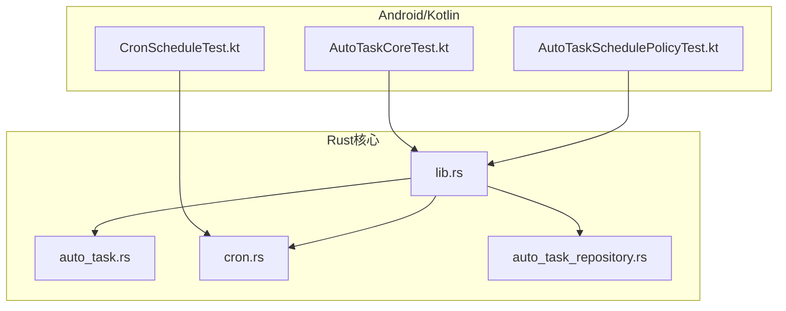
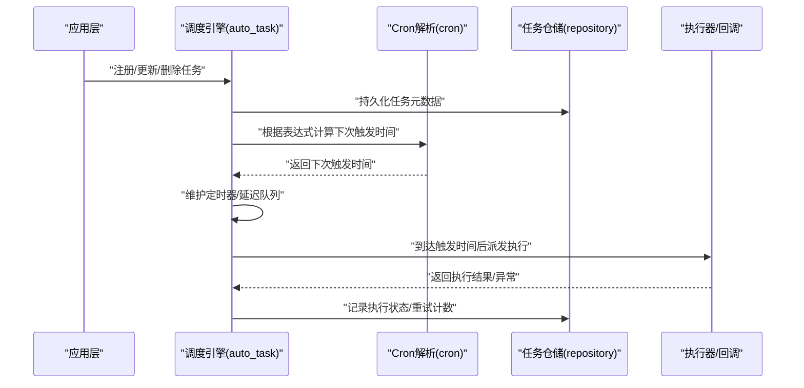
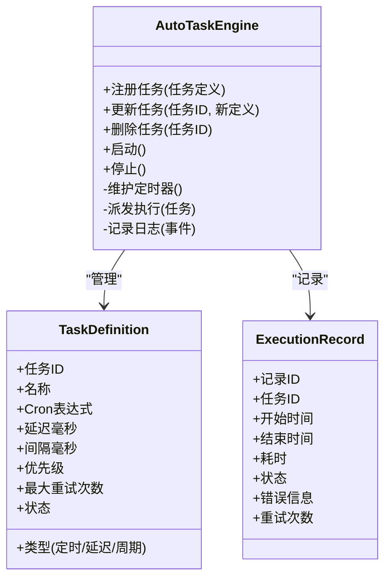
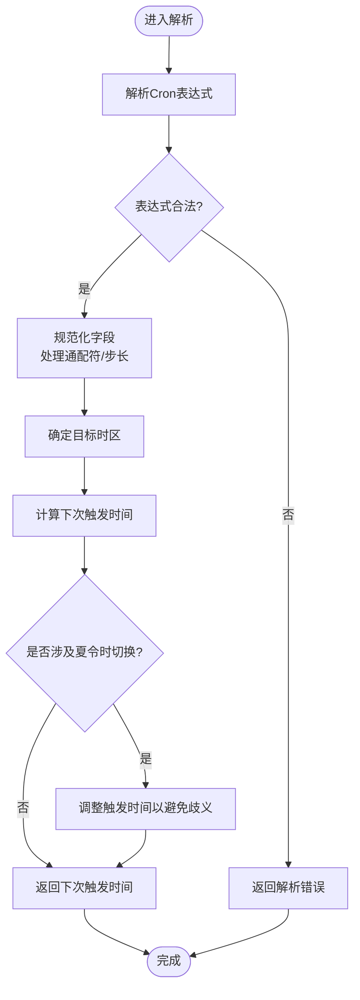
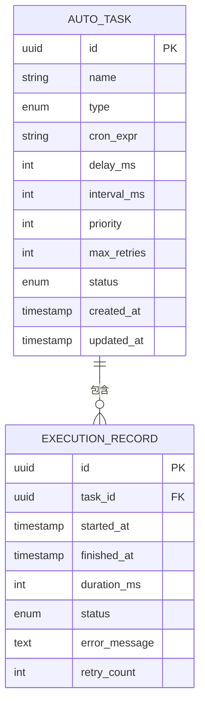
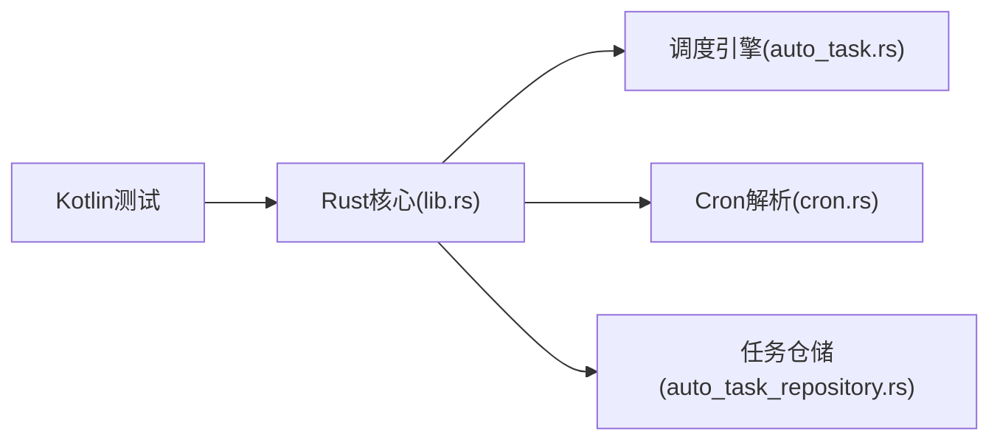

# 自动任务调度

<cite>
**本文引用的文件**   
- [auto_task.rs](file://rust/legado-core/src/auto_task.rs)
- [cron.rs](file://rust/legado-core/src/cron.rs)
- [auto_task_repository.rs](file://rust/legado-db/src/repository/auto_task_repository.rs)
- [lib.rs](file://rust/legado-core/src/lib.rs)
- [AutoTaskCoreTest.kt](file://app/src/test/java/io/legado/app/model/AutoTaskCoreTest.kt)
- [AutoTaskSchedulePolicyTest.kt](file://app/src/test/java/io/legado/app/model/AutoTaskSchedulePolicyTest.kt)
- [CronScheduleTest.kt](file://app/src/test/java/io/legado/app/utils/CronScheduleTest.kt)
</cite>

## 目录
1. [简介](#简介)
2. [项目结构](#项目结构)
3. [核心组件](#核心组件)
4. [架构总览](#架构总览)
5. [详细组件分析](#详细组件分析)
6. [依赖关系分析](#依赖关系分析)
7. [性能考量](#性能考量)
8. [故障排除指南](#故障排除指南)
9. [结论](#结论)
10. [附录](#附录)

## 简介
本文件面向Legado项目的“自动任务调度”子系统，系统性梳理任务调度引擎、队列管理、Cron表达式支持、监控与日志、配置与管理接口以及调试与排障方法。内容覆盖定时任务、延迟执行、周期重复等调度策略，以及任务优先级、并发控制、失败重试等队列处理机制，帮助开发者快速理解并高效使用或扩展该能力。

## 项目结构
自动任务调度由Rust核心库与Android/Kotlin测试用例共同构成：
- Rust核心层提供调度引擎、Cron解析、持久化仓储与对外暴露的API桥接。
- Android/Kotlin侧通过单元测试验证调度策略、Cron时间计算与核心行为。

图表来源 
- [lib.rs](file://rust/legado-core/src/lib.rs)
- [auto_task.rs](file://rust/legado-core/src/auto_task.rs)
- [cron.rs](file://rust/legado-core/src/cron.rs)
- [auto_task_repository.rs](file://rust/legado-db/src/repository/auto_task_repository.rs)
- [AutoTaskCoreTest.kt](file://app/src/test/java/io/legado/app/model/AutoTaskCoreTest.kt)
- [AutoTaskSchedulePolicyTest.kt](file://app/src/test/java/io/legado/app/model/AutoTaskSchedulePolicyTest.kt)
- [CronScheduleTest.kt](file://app/src/test/java/io/legado/app/utils/CronScheduleTest.kt)

章节来源
- [lib.rs](file://rust/legado-core/src/lib.rs)
- [auto_task.rs](file://rust/legado-core/src/auto_task.rs)
- [cron.rs](file://rust/legado-core/src/cron.rs)
- [auto_task_repository.rs](file://rust/legado-db/src/repository/auto_task_repository.rs)
- [AutoTaskCoreTest.kt](file://app/src/test/java/io/legado/app/model/AutoTaskCoreTest.kt)
- [AutoTaskSchedulePolicyTest.kt](file://app/src/test/java/io/legado/app/model/AutoTaskSchedulePolicyTest.kt)
- [CronScheduleTest.kt](file://app/src/test/java/io/legado/app/utils/CronScheduleTest.kt)

## 核心组件
- 调度引擎（auto_task）：负责任务的注册、生命周期管理、触发时机计算、执行派发与结果回传。
- Cron解析器（cron）：实现Cron表达式的解析与下一次触发时间计算，支持时区与夏令时适配。
- 任务仓储（auto_task_repository）：负责任务元数据与执行记录的持久化，包括状态、重试次数、优先级等。
- 上层集成与验证（Kotlin测试）：对调度策略、Cron时间计算进行断言与回归保障。

章节来源
- [auto_task.rs](file://rust/legado-core/src/auto_task.rs)
- [cron.rs](file://rust/legado-core/src/cron.rs)
- [auto_task_repository.rs](file://rust/legado-db/src/repository/auto_task_repository.rs)
- [AutoTaskCoreTest.kt](file://app/src/test/java/io/legado/app/model/AutoTaskCoreTest.kt)
- [AutoTaskSchedulePolicyTest.kt](file://app/src/test/java/io/legado/app/model/AutoTaskSchedulePolicyTest.kt)
- [CronScheduleTest.kt](file://app/src/test/java/io/legado/app/utils/CronScheduleTest.kt)

## 架构总览
下图展示了从上层调用到调度引擎、Cron解析、仓储持久化的整体交互流程。

图表来源 
- [auto_task.rs](file://rust/legado-core/src/auto_task.rs)
- [cron.rs](file://rust/legado-core/src/cron.rs)
- [auto_task_repository.rs](file://rust/legado-db/src/repository/auto_task_repository.rs)

## 详细组件分析

### 调度引擎（auto_task）
职责与要点：
- 任务注册与生命周期：支持新增、启用/禁用、删除；维护任务状态机（待触发、运行中、已完成、失败）。
- 调度策略：
  - 定时任务：基于Cron表达式周期性触发。
  - 延迟执行：在指定延迟后一次性触发。
  - 周期重复：固定间隔重复执行。
- 执行派发：按优先级与并发限制调度执行器，避免资源争用。
- 失败重试：依据策略进行指数退避或固定间隔重试，达到上限后标记失败。
- 监控与日志：记录开始/结束时间、耗时、错误堆栈、重试次数等。

图表来源 
- [auto_task.rs](file://rust/legado-core/src/auto_task.rs)

章节来源
- [auto_task.rs](file://rust/legado-core/src/auto_task.rs)

### Cron解析器（cron）
职责与要点：
- 表达式解析：支持标准Cron字段（分、时、日、月、周），包含通配符与步长。
- 时间计算：计算下一次触发时间，考虑边界条件（月末、闰年、跨月跨年）。
- 时区与夏令时：
  - 明确输入时区，统一转换为UTC进行计算。
  - 处理夏令时切换导致的时钟回拨/跳变，确保触发时间唯一且稳定。
- 校验与容错：非法表达式快速失败，提供友好错误信息。

图表来源 
- [cron.rs](file://rust/legado-core/src/cron.rs)

章节来源
- [cron.rs](file://rust/legado-core/src/cron.rs)
- [CronScheduleTest.kt](file://app/src/test/java/io/legado/app/utils/CronScheduleTest.kt)

### 任务仓储（auto_task_repository）
职责与要点：
- 任务元数据CRUD：创建、查询、更新、删除任务。
- 执行记录写入：每次执行成功/失败均落盘，便于审计与统计。
- 索引与查询优化：按任务ID、状态、更新时间建立索引，提升查询效率。
- 事务与一致性：批量操作保证原子性，避免部分成功导致的状态不一致。

图表来源 
- [auto_task_repository.rs](file://rust/legado-db/src/repository/auto_task_repository.rs)

章节来源
- [auto_task_repository.rs](file://rust/legado-db/src/repository/auto_task_repository.rs)

### 上层集成与验证（Kotlin测试）
- AutoTaskCoreTest：验证任务注册、启停、基本执行路径与状态流转。
- AutoTaskSchedulePolicyTest：验证不同调度策略（定时、延迟、周期）的触发准确性。
- CronScheduleTest：验证Cron表达式解析与下次触发时间计算的正确性，覆盖边界与时区场景。

章节来源
- [AutoTaskCoreTest.kt](file://app/src/test/java/io/legado/app/model/AutoTaskCoreTest.kt)
- [AutoTaskSchedulePolicyTest.kt](file://app/src/test/java/io/legado/app/model/AutoTaskSchedulePolicyTest.kt)
- [CronScheduleTest.kt](file://app/src/test/java/io/legado/app/utils/CronScheduleTest.kt)

## 依赖关系分析
- 模块内依赖：
  - auto_task依赖cron用于时间计算，依赖repository用于持久化。
  - cron为纯时间计算模块，无外部副作用。
  - repository依赖数据库抽象，提供稳定的读写接口。
- 模块间依赖：
  - Kotlin测试通过Rust核心提供的API进行行为验证。
  - 上层服务通过lib.rs暴露的接口访问调度能力。

图表来源 
- [lib.rs](file://rust/legado-core/src/lib.rs)
- [auto_task.rs](file://rust/legado-core/src/auto_task.rs)
- [cron.rs](file://rust/legado-core/src/cron.rs)
- [auto_task_repository.rs](file://rust/legado-db/src/repository/auto_task_repository.rs)

章节来源
- [lib.rs](file://rust/legado-core/src/lib.rs)
- [auto_task.rs](file://rust/legado-core/src/auto_task.rs)
- [cron.rs](file://rust/legado-core/src/cron.rs)
- [auto_task_repository.rs](file://rust/legado-db/src/repository/auto_task_repository.rs)

## 性能考量
- 调度精度：Cron计算采用增量方式，避免全量扫描；必要时使用最小堆维护最近触发时间。
- 并发控制：限制同时运行的任务数，防止CPU/IO瓶颈；对I/O密集型任务使用异步执行。
- 重试策略：指数退避+抖动，降低雪崩风险；设置最大重试次数与冷却时间。
- 存储优化：批量写入执行记录，减少锁竞争；合理设计索引以加速查询。
- 内存占用：任务元数据与执行记录分页加载，避免一次性加载全部数据。

[本节为通用指导，不直接分析具体文件]

## 故障排除指南
常见问题与排查步骤：
- 任务未触发：
  - 检查Cron表达式合法性与时区设置。
  - 确认任务状态为启用，未被暂停或删除。
  - 查看执行记录中的错误信息与重试次数。
- 触发时间异常：
  - 核对系统时间与设备时区设置。
  - 关注夏令时切换前后是否存在重复或缺失触发。
- 执行失败：
  - 检查执行器依赖的资源（网络、文件、权限）。
  - 查看错误堆栈与重试策略是否合理。
- 性能问题：
  - 监控并发度与队列长度，避免拥塞。
  - 评估Cron表达式复杂度，减少不必要的频繁触发。

章节来源
- [auto_task.rs](file://rust/legado-core/src/auto_task.rs)
- [cron.rs](file://rust/legado-core/src/cron.rs)
- [auto_task_repository.rs](file://rust/legado-db/src/repository/auto_task_repository.rs)

## 结论
Legado的自动任务调度子系统以Rust为核心，结合Kotlin测试保障正确性。其调度引擎、Cron解析与仓储模块职责清晰、耦合适度，能够支撑定时、延迟与周期等多种调度策略，并提供可靠的失败重试与执行记录。建议在生产环境中结合监控与告警，持续优化并发与重试策略，确保稳定性与可观测性。

[本节为总结性内容，不直接分析具体文件]

## 附录
- 最佳实践：
  - 使用合理的Cron表达式，避免过于密集的触发。
  - 为关键任务设置独立的优先级与重试策略。
  - 定期清理历史执行记录，保持仓储健康。
- 扩展建议：
  - 增加分布式协调以支持多实例部署。
  - 引入可视化监控面板，实时展示任务状态与性能指标。
  - 提供脚本化配置导入导出，便于批量管理。

[本节为补充说明，不直接分析具体文件]