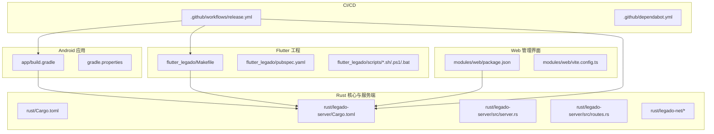
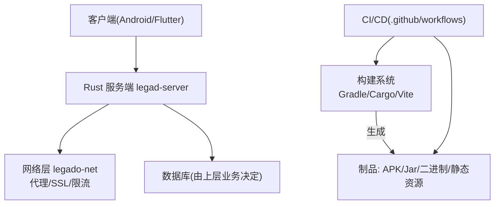
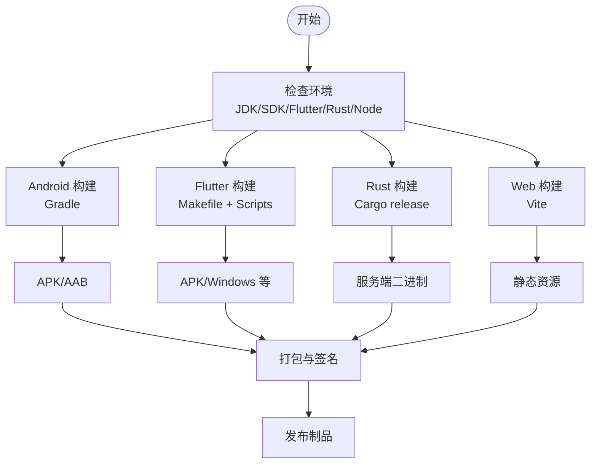
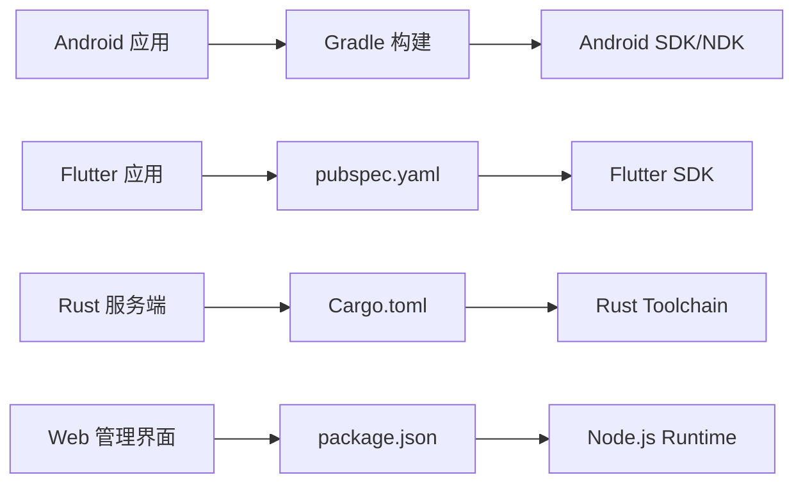

# 部署与配置

<cite>
**本文引用的文件**   
- [README.md](file://README.md)
- [Makefile](file://Makefile)
- [gradle.properties](file://gradle.properties)
- [build.gradle](file://build.gradle)
- [app/build.gradle](file://app/build.gradle)
- [flutter_legado/Makefile](file://flutter_legado/Makefile)
- [flutter_legado/pubspec.yaml](file://flutter_legado/pubspec.yaml)
- [flutter_legado/scripts/build-apk.ps1](file://flutter_legado/scripts/build-apk.ps1)
- [flutter_legado/scripts/build-windows.bat](file://flutter_legado/scripts/build-windows.bat)
- [flutter_legado/scripts/build-windows.ps1](file://flutter_legado/scripts/build-windows.ps1)
- [rust/Cargo.toml](file://rust/Cargo.toml)
- [rust/rust-toolchain.toml](file://rust/rust-toolchain.toml)
- [rust/legado-server/Cargo.toml](file://rust/legado-server/Cargo.toml)
- [rust/legado-server/src/server.rs](file://rust/legado-server/src/server.rs)
- [rust/legado-server/src/routes.rs](file://rust/legado-server/src/routes.rs)
- [rust/legado-net/Cargo.toml](file://rust/legado-net/Cargo.toml)
- [rust/legado-net/src/ssl_config.rs](file://rust/legado-net/src/ssl_config.rs)
- [rust/legado-net/src/proxy.rs](file://rust/legado-net/src/proxy.rs)
- [rust/legado-net/src/rate_limit.rs](file://rust/legado-net/src/rate_limit.rs)
- [modules/web/package.json](file://modules/web/package.json)
- [modules/web/vite.config.ts](file://modules/web/vite.config.ts)
- [.github/workflows/release.yml](file://.github/workflows/release.yml)
- [.github/dependabot.yml](file://.github/dependabot.yml)
</cite>

## 目录
1. [简介](#简介)
2. [项目结构](#项目结构)
3. [核心组件](#核心组件)
4. [架构总览](#架构总览)
5. [详细组件分析](#详细组件分析)
6. [依赖分析](#依赖分析)
7. [性能考虑](#性能考虑)
8. [故障排查指南](#故障排查指南)
9. [结论](#结论)
10. [附录](#附录)

## 简介
本文件面向运维与交付团队，聚焦 Legado 项目的“部署与配置”。内容覆盖：
- 服务器与运行环境要求（操作系统、运行时、网络）
- 配置管理（环境变量、配置文件格式、热更新策略）
- 构建与打包（多平台编译、依赖管理、二进制优化）
- 容器化与编排（Docker 镜像、Kubernetes 部署、微服务拆分）
- 监控与日志（指标采集、日志聚合、告警）
- 性能调优与安全加固最佳实践

说明：本项目为 Android 应用与 Rust 服务端等多技术栈组合。本节文档以仓库中现有的构建脚本、Gradle/Rust/Flutter/Web 配置为依据，给出可操作的部署与配置指引。

## 项目结构
Legado 采用多模块、多语言协作的架构：
- Android 应用层（Kotlin/Java + Gradle）
- Flutter 跨端工程（Android/iOS/Desktop/Web）
- Rust 核心库与服务端（Cargo 多 crate）
- Web 管理界面（Vue/Vite）
- CI/CD 工作流（GitHub Actions）

图表来源
- [build.gradle:1-200](file://build.gradle#L1-L200)
- [gradle.properties:1-200](file://gradle.properties#L1-L200)
- [flutter_legado/Makefile:1-200](file://flutter_legado/Makefile#L1-L200)
- [flutter_legado/pubspec.yaml:1-200](file://flutter_legado/pubspec.yaml#L1-L200)
- [rust/Cargo.toml:1-200](file://rust/Cargo.toml#L1-L200)
- [rust/legado-server/Cargo.toml:1-200](file://rust/legado-server/Cargo.toml#L1-L200)
- [rust/legado-server/src/server.rs:1-200](file://rust/legado-server/src/server.rs#L1-L200)
- [rust/legado-server/src/routes.rs:1-200](file://rust/legado-server/src/routes.rs#L1-L200)
- [modules/web/package.json:1-200](file://modules/web/package.json#L1-L200)
- [modules/web/vite.config.ts:1-200](file://modules/web/vite.config.ts#L1-L200)
- [.github/workflows/release.yml:1-200](file://.github/workflows/release.yml#L1-L200)

章节来源
- [README.md:1-200](file://README.md#L1-L200)
- [build.gradle:1-200](file://build.gradle#L1-L200)
- [gradle.properties:1-200](file://gradle.properties#L1-L200)
- [flutter_legado/Makefile:1-200](file://flutter_legado/Makefile#L1-L200)
- [flutter_legado/pubspec.yaml:1-200](file://flutter_legado/pubspec.yaml#L1-L200)
- [rust/Cargo.toml:1-200](file://rust/Cargo.toml#L1-L200)
- [rust/legado-server/Cargo.toml:1-200](file://rust/legado-server/Cargo.toml#L1-L200)
- [modules/web/package.json:1-200](file://modules/web/package.json#L1-L200)
- [modules/web/vite.config.ts:1-200](file://modules/web/vite.config.ts#L1-L200)
- [.github/workflows/release.yml:1-200](file://.github/workflows/release.yml#L1-L200)

## 核心组件
- Android 构建系统：通过 Gradle 管理依赖、签名、产物输出；支持 debug/release 变体与 ProGuard/R8 混淆压缩。
- Flutter 构建：通过 Makefile 与脚本统一构建 APK/Windows 等目标，依赖 pubspec.yaml 声明。
- Rust 服务端：基于 Cargo 的多 crate 工程，legado-server 提供 HTTP API 与路由，legado-net 负责网络、代理、SSL、限流等能力。
- Web 管理界面：基于 Vite + Vue，package.json 管理依赖，vite.config.ts 控制构建与代理。
- CI/CD：GitHub Actions 发布流程与 Dependabot 依赖更新。

章节来源
- [app/build.gradle:1-200](file://app/build.gradle#L1-L200)
- [flutter_legado/Makefile:1-200](file://flutter_legado/Makefile#L1-L200)
- [rust/legado-server/Cargo.toml:1-200](file://rust/legado-server/Cargo.toml#L1-L200)
- [rust/legado-net/Cargo.toml:1-200](file://rust/legado-net/Cargo.toml#L1-L200)
- [modules/web/package.json:1-200](file://modules/web/package.json#L1-L200)
- [modules/web/vite.config.ts:1-200](file://modules/web/vite.config.ts#L1-L200)
- [.github/workflows/release.yml:1-200](file://.github/workflows/release.yml#L1-L200)

## 架构总览
下图展示从客户端到服务端的关键交互路径，以及构建与发布流水线对产物的影响。

图表来源
- [rust/legado-server/src/server.rs:1-200](file://rust/legado-server/src/server.rs#L1-L200)
- [rust/legado-server/src/routes.rs:1-200](file://rust/legado-server/src/routes.rs#L1-L200)
- [rust/legado-net/Cargo.toml:1-200](file://rust/legado-net/Cargo.toml#L1-L200)
- [build.gradle:1-200](file://build.gradle#L1-L200)
- [flutter_legado/Makefile:1-200](file://flutter_legado/Makefile#L1-L200)
- [modules/web/vite.config.ts:1-200](file://modules/web/vite.config.ts#L1-L200)
- [.github/workflows/release.yml:1-200](file://.github/workflows/release.yml#L1-L200)

## 详细组件分析

### 服务器环境与基础准备
- 操作系统与运行时
  - Rust 服务端：需要 Rust Toolchain（参考 rust-toolchain.toml），推荐稳定版工具链；Linux/Windows/macOS 均可。
  - Android 构建：需要 JDK 与 Android SDK/NDK（由 Gradle 驱动）。
  - Flutter 构建：需要 Flutter SDK 与对应平台工具链（Android/iOS/Windows）。
  - Web 构建：Node.js LTS 与 pnpm/yarn/npm（依据 package.json 锁文件）。
- 网络配置
  - 代理：legado-net 提供代理相关实现，可通过环境变量或配置注入代理地址。
  - SSL/TLS：legado-net 的 SSL 配置用于自定义证书、校验策略等。
  - 速率限制：legado-net 提供限流中间件，建议在生产开启并合理设置阈值。
- 端口与监听
  - 服务端监听端口由 server.rs 配置，默认值与启动参数见源码位置。

章节来源
- [rust/rust-toolchain.toml:1-200](file://rust/rust-toolchain.toml#L1-L200)
- [rust/legado-net/src/proxy.rs:1-200](file://rust/legado-net/src/proxy.rs#L1-L200)
- [rust/legado-net/src/ssl_config.rs:1-200](file://rust/legado-net/src/ssl_config.rs#L1-L200)
- [rust/legado-net/src/rate_limit.rs:1-200](file://rust/legado-net/src/rate_limit.rs#L1-L200)
- [rust/legado-server/src/server.rs:1-200](file://rust/legado-server/src/server.rs#L1-L200)

### 配置管理方案
- 环境变量
  - 服务端启动参数与环境变量（如端口、日志级别、代理、TLS 证书路径等）建议在容器或进程管理器中以环境变量注入。
  - Android/Flutter 构建期变量通过 gradle.properties 与 flutter 构建脚本传入。
- 配置文件格式
  - Rust 侧建议使用 TOML/JSON/YAML 之一作为运行时配置，结合环境变量覆盖。
  - Web 前端通过 vite.config.ts 与 .env 文件区分环境。
- 配置热更新
  - 服务端建议实现配置文件的 watch 机制，在变更时重载关键配置（如日志级别、代理、限流阈值），避免重启。
  - 对于 Android/Flutter，动态配置通常通过远程配置中心或本地 JSON 文件加载，并在应用启动时合并。

章节来源
- [gradle.properties:1-200](file://gradle.properties#L1-L200)
- [modules/web/vite.config.ts:1-200](file://modules/web/vite.config.ts#L1-L200)
- [rust/legado-server/src/server.rs:1-200](file://rust/legado-server/src/server.rs#L1-L200)
- [rust/legado-net/src/proxy.rs:1-200](file://rust/legado-net/src/proxy.rs#L1-L200)
- [rust/legado-net/src/ssl_config.rs:1-200](file://rust/legado-net/src/ssl_config.rs#L1-L200)

### 构建与打包流程
- Android（Gradle）
  - 使用 build.gradle 定义构建变体、签名、混淆与产物输出。
  - 通过 gradle.properties 集中管理版本与构建开关。
- Flutter（Makefile + 脚本）
  - flutter_legado/Makefile 统一入口，调用 scripts 下的构建脚本生成 APK/Windows 等目标。
  - pubspec.yaml 声明 Flutter 依赖与插件。
- Rust（Cargo）
  - rust/Cargo.toml 管理多 crate 与依赖；legado-server 提供服务端二进制。
  - 生产构建启用优化（release profile），必要时裁剪特性集。
- Web（Vite）
  - modules/web/package.json 管理依赖；vite.config.ts 配置构建、代理与输出目录。
- 多平台编译
  - Android：Gradle 输出 APK/AAB。
  - Windows：Flutter 脚本生成 exe。
  - Linux/macOS：Cargo 交叉编译或原生构建。
- 依赖管理与安全
  - Dependabot 自动扫描依赖更新（.github/dependabot.yml）。
  - 锁定依赖版本（pnpm-lock、Cargo.lock、pubspec.lock）确保可重复构建。

图表来源
- [build.gradle:1-200](file://build.gradle#L1-L200)
- [app/build.gradle:1-200](file://app/build.gradle#L1-L200)
- [flutter_legado/Makefile:1-200](file://flutter_legado/Makefile#L1-L200)
- [flutter_legado/scripts/build-apk.ps1:1-200](file://flutter_legado/scripts/build-apk.ps1#L1-L200)
- [flutter_legado/scripts/build-windows.bat:1-200](file://flutter_legado/scripts/build-windows.bat#L1-L200)
- [flutter_legado/scripts/build-windows.ps1:1-200](file://flutter_legado/scripts/build-windows.ps1#L1-L200)
- [rust/Cargo.toml:1-200](file://rust/Cargo.toml#L1-L200)
- [modules/web/package.json:1-200](file://modules/web/package.json#L1-L200)
- [modules/web/vite.config.ts:1-200](file://modules/web/vite.config.ts#L1-L200)

章节来源
- [build.gradle:1-200](file://build.gradle#L1-L200)
- [app/build.gradle:1-200](file://app/build.gradle#L1-L200)
- [flutter_legado/Makefile:1-200](file://flutter_legado/Makefile#L1-L200)
- [flutter_legado/pubspec.yaml:1-200](file://flutter_legado/pubspec.yaml#L1-L200)
- [flutter_legado/scripts/build-apk.ps1:1-200](file://flutter_legado/scripts/build-apk.ps1#L1-L200)
- [flutter_legado/scripts/build-windows.bat:1-200](file://flutter_legado/scripts/build-windows.bat#L1-L200)
- [flutter_legado/scripts/build-windows.ps1:1-200](file://flutter_legado/scripts/build-windows.ps1#L1-L200)
- [rust/Cargo.toml:1-200](file://rust/Cargo.toml#L1-L200)
- [modules/web/package.json:1-200](file://modules/web/package.json#L1-L200)
- [modules/web/vite.config.ts:1-200](file://modules/web/vite.config.ts#L1-L200)

### 容器化与编排
- Docker 镜像构建
  - 服务端：基于官方 Rust 镜像构建最小镜像，仅包含服务端二进制与必要运行时。
  - Web：将 Vite 构建产物放入 Nginx/轻量 HTTP 服务器镜像。
  - Android/Flutter：如需在容器内构建，安装 JDK/Flutter/Android SDK，缓存依赖加速。
- Kubernetes 编排
  - Deployment：定义副本数、资源请求/限制、健康检查探针。
  - Service/Ingress：暴露端口与域名，启用 TLS 终止。
  - ConfigMap/Secret：注入环境变量与敏感信息（证书、密钥）。
  - HPA：根据 CPU/内存或自定义指标自动扩缩容。
- 微服务拆分
  - 将 legado-server 独立部署，与 Web 管理界面解耦。
  - 通过环境变量与配置中心统一管理不同环境差异。

章节来源
- [rust/legado-server/Cargo.toml:1-200](file://rust/legado-server/Cargo.toml#L1-L200)
- [rust/legado-server/src/server.rs:1-200](file://rust/legado-server/src/server.rs#L1-L200)
- [modules/web/package.json:1-200](file://modules/web/package.json#L1-L200)
- [modules/web/vite.config.ts:1-200](file://modules/web/vite.config.ts#L1-L200)

### 监控与日志
- 指标收集
  - 服务端暴露 Prometheus 指标（HTTP 请求计数、延迟、错误率、连接数等）。
  - 使用 cAdvisor/Grafana 采集容器与主机指标。
- 日志聚合
  - 结构化日志（JSON）输出到 stdout/stderr，由 sidecar 或 DaemonSet 采集至 ELK/Loki。
  - 按服务与实例维度打标签，便于检索与告警。
- 告警配置
  - 基于 Prometheus Alertmanager 或云监控规则，设置阈值与通知渠道（邮件/钉钉/企业微信）。
  - 针对错误率、延迟、资源耗尽、证书过期等场景配置告警。

章节来源
- [rust/legado-server/src/server.rs:1-200](file://rust/legado-server/src/server.rs#L1-L200)
- [rust/legado-server/src/routes.rs:1-200](file://rust/legado-server/src/routes.rs#L1-L200)

### 性能调优与安全加固
- 性能调优
  - Rust 服务端：启用 release 构建、按需裁剪特性、调整线程池大小、启用连接复用与 HTTP/2。
  - 网络层：合理设置超时、重试、限流与缓存策略。
  - Android/Flutter：减少包体积、按需加载、启用 R8/ProGuard。
  - Web：静态资源压缩、CDN 缓存、懒加载。
- 安全加固
  - 强制 HTTPS，禁用弱加密套件，定期轮换证书。
  - 输入校验与鉴权，最小权限原则，关闭调试接口。
  - 依赖漏洞扫描（Dependabot）、SBOM 生成与制品签名。

章节来源
- [rust/legado-net/src/rate_limit.rs:1-200](file://rust/legado-net/src/rate_limit.rs#L1-L200)
- [rust/legado-net/src/ssl_config.rs:1-200](file://rust/legado-net/src/ssl_config.rs#L1-L200)
- [app/build.gradle:1-200](file://app/build.gradle#L1-L200)
- [modules/web/vite.config.ts:1-200](file://modules/web/vite.config.ts#L1-L200)
- [.github/dependabot.yml:1-200](file://.github/dependabot.yml#L1-L200)

## 依赖分析
- 直接依赖
  - Android：Gradle 插件、Android SDK/NDK、第三方库（由 app/build.gradle 声明）。
  - Flutter：Flutter SDK、插件（pubspec.yaml）。
  - Rust：Cargo 依赖（Cargo.toml），服务端与网络库分离。
  - Web：Node.js 生态（package.json）。
- 间接依赖与冲突
  - 通过 lock 文件锁定版本，避免漂移。
  - 使用 Dependabot 自动化更新与安全检查。
- 外部集成点
  - 代理与 SSL（legado-net）。
  - CI/CD（GitHub Actions）。

图表来源
- [app/build.gradle:1-200](file://app/build.gradle#L1-L200)
- [flutter_legado/pubspec.yaml:1-200](file://flutter_legado/pubspec.yaml#L1-L200)
- [rust/Cargo.toml:1-200](file://rust/Cargo.toml#L1-L200)
- [modules/web/package.json:1-200](file://modules/web/package.json#L1-L200)

章节来源
- [app/build.gradle:1-200](file://app/build.gradle#L1-L200)
- [flutter_legado/pubspec.yaml:1-200](file://flutter_legado/pubspec.yaml#L1-L200)
- [rust/Cargo.toml:1-200](file://rust/Cargo.toml#L1-L200)
- [modules/web/package.json:1-200](file://modules/web/package.json#L1-L200)
- [.github/dependabot.yml:1-200](file://.github/dependabot.yml#L1-L200)

## 性能考虑
- 构建阶段
  - 并行构建与缓存（Gradle 缓存、Cargo 增量编译、pnpm 缓存）。
  - 产物瘦身（Rust release、R8/ProGuard、Vite 压缩）。
- 运行阶段
  - 服务端：连接池、异步 I/O、限流与熔断、合理 GC 与线程模型。
  - 客户端：按需加载、图片与字体优化、离线缓存。
  - Web：静态资源 CDN、HTTP/2、缓存策略。
- 容量规划
  - 根据 QPS、延迟与资源使用估算 CPU/内存/带宽需求。
  - 水平扩展与负载均衡策略。

[本节为通用指导，不直接分析具体文件]

## 故障排查指南
- 构建失败
  - 检查 JDK/SDK/Flutter/Rust/Node 版本与 PATH。
  - 查看 Gradle/Cargo/Vite 构建日志定位依赖缺失或版本冲突。
- 运行时异常
  - 服务端：检查端口占用、SSL 证书、代理配置、限流阈值。
  - 客户端：检查网络权限、HTTPS 证书信任、代理设置。
- 性能问题
  - 使用 Profiler（Android Studio、Chrome DevTools、pprof）定位热点。
  - 观察指标与日志，确认瓶颈在 CPU、I/O 还是网络。
- 常见问题
  - 证书过期、代理不可用、端口冲突、磁盘空间不足、依赖缓存损坏。

章节来源
- [rust/legado-server/src/server.rs:1-200](file://rust/legado-server/src/server.rs#L1-L200)
- [rust/legado-net/src/ssl_config.rs:1-200](file://rust/legado-net/src/ssl_config.rs#L1-L200)
- [rust/legado-net/src/proxy.rs:1-200](file://rust/legado-net/src/proxy.rs#L1-L200)
- [rust/legado-net/src/rate_limit.rs:1-200](file://rust/legado-net/src/rate_limit.rs#L1-L200)

## 结论
Legado 项目具备完善的构建与部署基础：Gradle/Cargo/Vite 多栈构建、Rust 服务端模块化、Flutter 跨端能力、Web 管理界面与 CI/CD 流水线。通过合理的配置管理、容器化与编排、监控与日志体系，以及性能调优与安全加固，可实现高可用、可扩展、易维护的生产部署。

[本节为总结性内容，不直接分析具体文件]

## 附录
- 快速启动清单
  - 安装并验证各运行时环境。
  - 拉取依赖（Gradle/Cargo/pnpm）。
  - 执行构建（Android/Flutter/Rust/Web）。
  - 启动服务端并验证健康检查。
  - 部署到容器与编排平台，配置监控与告警。
- 参考文件
  - 构建脚本与配置：Makefile、build.gradle、pubspec.yaml、Cargo.toml、package.json、vite.config.ts。
  - 服务端与网络：server.rs、routes.rs、proxy.rs、ssl_config.rs、rate_limit.rs。
  - CI/CD：release.yml、dependabot.yml。

章节来源
- [Makefile:1-200](file://Makefile#L1-L200)
- [build.gradle:1-200](file://build.gradle#L1-L200)
- [flutter_legado/Makefile:1-200](file://flutter_legado/Makefile#L1-L200)
- [flutter_legado/pubspec.yaml:1-200](file://flutter_legado/pubspec.yaml#L1-L200)
- [rust/Cargo.toml:1-200](file://rust/Cargo.toml#L1-L200)
- [rust/legado-server/Cargo.toml:1-200](file://rust/legado-server/Cargo.toml#L1-L200)
- [rust/legado-server/src/server.rs:1-200](file://rust/legado-server/src/server.rs#L1-L200)
- [rust/legado-server/src/routes.rs:1-200](file://rust/legado-server/src/routes.rs#L1-L200)
- [rust/legado-net/src/proxy.rs:1-200](file://rust/legado-net/src/proxy.rs#L1-L200)
- [rust/legado-net/src/ssl_config.rs:1-200](file://rust/legado-net/src/ssl_config.rs#L1-L200)
- [rust/legado-net/src/rate_limit.rs:1-200](file://rust/legado-net/src/rate_limit.rs#L1-L200)
- [modules/web/package.json:1-200](file://modules/web/package.json#L1-L200)
- [modules/web/vite.config.ts:1-200](file://modules/web/vite.config.ts#L1-L200)
- [.github/workflows/release.yml:1-200](file://.github/workflows/release.yml#L1-L200)
- [.github/dependabot.yml:1-200](file://.github/dependabot.yml#L1-L200)