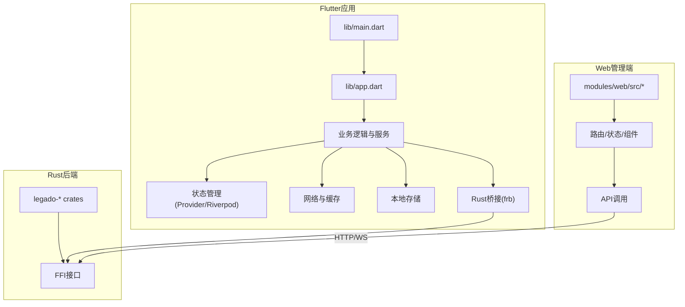
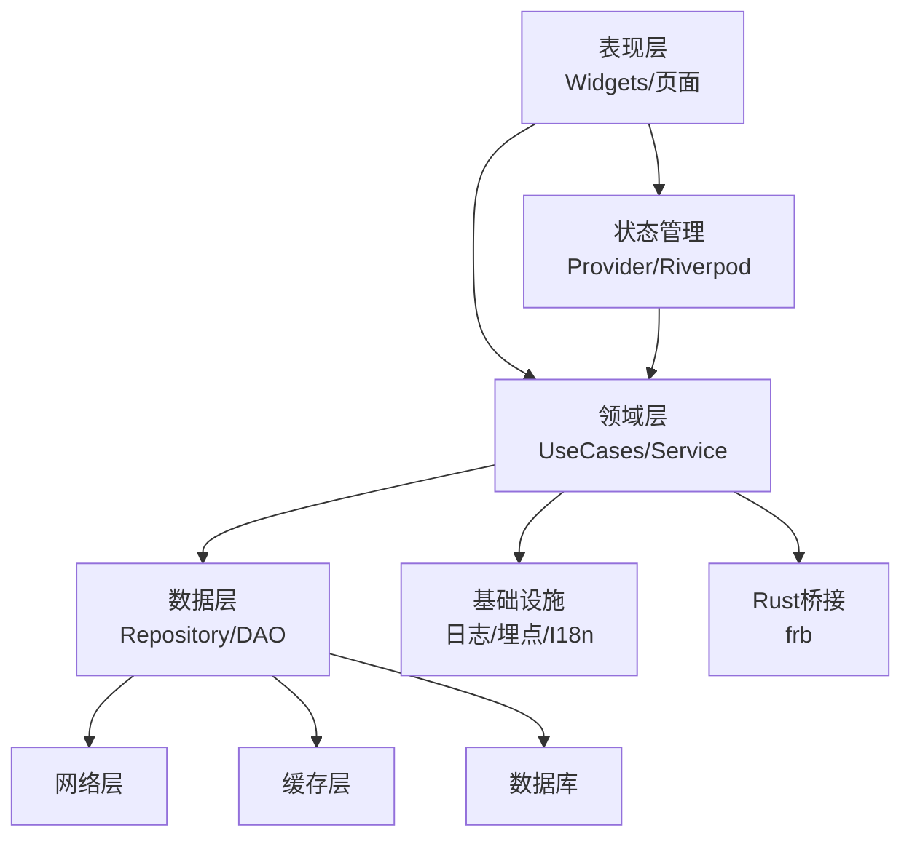
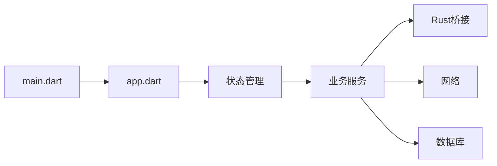

# Dart和Flutter规范

<cite>
**本文档引用的文件**   
- [flutter_legado/pubspec.yaml](file://flutter_legado/pubspec.yaml)
- [flutter_legado/analysis_options.yaml](file://flutter_legado/analysis_options.yaml)
- [flutter_legado/lib/main.dart](file://flutter_legado/lib/main.dart)
- [flutter_legado/lib/app.dart](file://flutter_legado/lib/app.dart)
- [flutter_legado/flutter_rust_bridge.yaml](file://flutter_legado/flutter_rust_bridge.yaml)
- [flutter_legado/test/unit/bookshelf_provider_test.dart](file://flutter_legado/test/unit/bookshelf_provider_test.dart)
- [flutter_legado/test/widget/bookshelf_test.dart](file://flutter_legado/test/widget/bookshelf_test.dart)
- [modules/web/package.json](file://modules/web/package.json)
- [modules/web/eslint.config.mjs](file://modules/web/eslint.config.mjs)
- [modules/web/.prettierrc.json](file://modules/web/.prettierrc.json)
</cite>

## 目录
1. [简介](#简介)
2. [项目结构](#项目结构)
3. [核心组件](#核心组件)
4. [架构总览](#架构总览)
5. [详细组件分析](#详细组件分析)
6. [依赖分析](#依赖分析)
7. [性能考虑](#性能考虑)
8. [故障排查指南](#故障排查指南)
9. [结论](#结论)
10. [附录](#附录)

## 简介
本规范面向Dart与Flutter开发团队，统一编码风格、异步模式、错误处理、测试策略与Flutter工程化实践。结合Legado仓库中的Flutter子模块（flutter_legado）与Web管理端（modules/web），给出可落地的约定与最佳实践，帮助团队在跨平台与多语言混合工程中保持一致性与高质量交付。

## 项目结构
- Flutter应用位于 flutter_legado 目录，包含Android/iOS/Linux/macOS/Windows/Web等目标平台配置与源码。
- Web管理端位于 modules/web，使用Vue生态与前端工具链进行代码检查与格式化。
- Rust后端通过 flutter_rust_bridge 与Flutter交互，提供高性能能力与数据访问。

图表来源
- [flutter_legado/lib/main.dart](file://flutter_legado/lib/main.dart)
- [flutter_legado/lib/app.dart](file://flutter_legado/lib/app.dart)
- [flutter_legado/flutter_rust_bridge.yaml](file://flutter_legado/flutter_rust_bridge.yaml)
- [modules/web/package.json](file://modules/web/package.json)

章节来源
- [flutter_legado/pubspec.yaml](file://flutter_legado/pubspec.yaml)
- [flutter_legado/lib/main.dart](file://flutter_legado/lib/main.dart)
- [flutter_legado/lib/app.dart](file://flutter_legado/lib/app.dart)
- [flutter_legado/flutter_rust_bridge.yaml](file://flutter_legado/flutter_rust_bridge.yaml)
- [modules/web/package.json](file://modules/web/package.json)

## 核心组件
- 入口与应用初始化：main.dart负责启动Flutter引擎、设置全局配置；app.dart定义应用主题、路由与根Widget树。
- 状态管理：推荐使用Provider或Riverpod进行UI状态与业务状态解耦，避免在Widget中直接持有复杂状态。
- 网络与缓存：封装HTTP客户端，统一错误码与重试策略，结合缓存层提升体验。
- 本地存储：使用共享偏好、数据库或文件系统，按功能域划分存储键空间。
- Rust桥接：通过flutter_rust_bridge暴露稳定API，将计算密集或系统级能力下沉至Rust。

章节来源
- [flutter_legado/lib/main.dart](file://flutter_legado/lib/main.dart)
- [flutter_legado/lib/app.dart](file://flutter_legado/lib/app.dart)
- [flutter_legado/flutter_rust_bridge.yaml](file://flutter_legado/flutter_rust_bridge.yaml)

## 架构总览
Flutter应用采用分层架构：
- 表现层：页面与组件，仅负责展示与用户交互。
- 领域层：业务规则与用例编排，不依赖UI框架。
- 数据层：网络、缓存、数据库与外部服务抽象。
- 基础设施：日志、埋点、国际化、Rust桥接等横切关注点。

图表来源
- [flutter_legado/lib/app.dart](file://flutter_legado/lib/app.dart)
- [flutter_legado/flutter_rust_bridge.yaml](file://flutter_legado/flutter_rust_bridge.yaml)

## 详细组件分析

### Dart语言编码标准
- 命名约定
  - 类与类型使用大驼峰；变量、函数、常量使用小驼峰；静态常量使用全大写加下划线分隔。
  - 包与文件使用下划线分隔的短名；测试文件以 _test.dart 结尾。
- 异步编程模式
  - 优先使用 async/await 表达异步流程；避免嵌套回调；对长耗时任务使用 Isolate 或 compute。
  - 统一错误返回策略：抛出异常或使用 Result/Either 包装；对外暴露明确的错误类型。
- 错误处理
  - 区分可恢复与不可恢复错误；记录上下文信息；对用户可见的错误提供友好提示。
  - 网络请求统一拦截器处理超时、重试、鉴权失败等场景。
- 集合与数据结构
  - 合理使用 List/Set/Map；避免频繁扩容；大数据集使用流式处理。
- 文档与注释
  - 公共API需添加文档注释；复杂逻辑补充行内注释说明意图而非实现细节。

章节来源
- [flutter_legado/analysis_options.yaml](file://flutter_legado/analysis_options.yaml)

### Flutter开发规范
- 组件设计原则
  - 单一职责：组件只负责一个功能；组合优于继承；保持Widget轻量。
  - 不可变状态：通过状态提升与不可变数据更新减少副作用。
  - 可测试性：将业务逻辑下沉到纯函数或服务类，便于单元测试。
- 状态管理模式
  - Provider：适合简单到中等复杂度状态；使用 ChangeNotifier 或 Riverpod 的 StateNotifier。
  - Riverpod：推荐用于大型应用；强类型、易测试、支持异步与依赖注入。
  - 避免在Widget中直接操作全局单例；通过Provider/Riverpod暴露状态。
- UI布局最佳实践
  - 使用 LayoutBuilder、MediaQuery、Theme 适配不同屏幕；避免硬编码尺寸。
  - 列表优化：使用 ListView.builder 或 Sliver 系列；分页加载与预取。
  - 图片与资源：按需加载、缓存、占位图与错误图处理。
- 性能优化技巧
  - 避免不必要的 rebuild：使用 const、Selector、select 精确订阅。
  - 动画与渲染：合并动画、减少重绘；使用 RepaintBoundary 隔离区域。
  - 内存管理：及时释放监听器与定时器；避免闭包捕获大对象。

章节来源
- [flutter_legado/lib/app.dart](file://flutter_legado/lib/app.dart)
- [flutter_legado/analysis_options.yaml](file://flutter_legado/analysis_options.yaml)

### 跨平台开发注意事项
- 平台特定代码处理
  - 使用 platform_channel 或 flutter_rust_bridge 调用原生能力；封装平台差异为统一接口。
  - 条件编译：根据 targetPlatform 分支处理平台差异。
- 资源管理
  - 资源按平台组织；字体、图片、音频等资源路径统一；动态资源下载后缓存。
- 构建配置
  - Android/iOS 签名与混淆；Web打包优化；各平台环境变量注入。

章节来源
- [flutter_legado/flutter_rust_bridge.yaml](file://flutter_legado/flutter_rust_bridge.yaml)

### Flutter应用架构建议
- 模块化组织
  - 按功能域划分模块：book、reader、source、settings等；模块间通过接口通信。
  - 公共库抽取：utils、network、storage、theme等复用组件。
- 依赖注入
  - 使用Riverpod或自定义容器管理依赖；避免全局单例耦合。
- 路由管理
  - 集中式路由配置；参数校验与守卫；深度链接支持。

章节来源
- [flutter_legado/lib/app.dart](file://flutter_legado/lib/app.dart)

### 代码检查与格式化配置
- Flutter/Dart
  - analysis_options.yaml 启用严格规则；统一导入顺序与命名警告。
  - 使用 dart format 与 dart analyze 集成CI。
- Web管理端
  - ESLint与Prettier统一JS/TS代码风格；提交前钩子执行检查。

章节来源
- [flutter_legado/analysis_options.yaml](file://flutter_legado/analysis_options.yaml)
- [modules/web/eslint.config.mjs](file://modules/web/eslint.config.mjs)
- [modules/web/.prettierrc.json](file://modules/web/.prettierrc.json)

## 依赖分析
Flutter应用依赖关系清晰：
- main.dart 启动应用并挂载 app.dart。
- app.dart 定义主题、路由与根Widget树。
- 业务逻辑通过Provider/Riverpod暴露状态。
- Rust桥接通过frb生成绑定，调用底层能力。

图表来源
- [flutter_legado/lib/main.dart](file://flutter_legado/lib/main.dart)
- [flutter_legado/lib/app.dart](file://flutter_legado/lib/app.dart)
- [flutter_legado/flutter_rust_bridge.yaml](file://flutter_legado/flutter_rust_bridge.yaml)

章节来源
- [flutter_legado/pubspec.yaml](file://flutter_legado/pubspec.yaml)
- [flutter_legado/lib/main.dart](file://flutter_legado/lib/main.dart)
- [flutter_legado/lib/app.dart](file://flutter_legado/lib/app.dart)
- [flutter_legado/flutter_rust_bridge.yaml](file://flutter_legado/flutter_rust_bridge.yaml)

## 性能考虑
- 渲染性能
  - 使用 const Widget 减少重建；避免在 build 中执行耗时操作。
  - 列表虚拟化与分页加载；图片懒加载与缓存。
- 内存与CPU
  - 及时释放监听器与定时器；避免闭包捕获大对象。
  - 计算密集型任务下沉至Rust或Isolate。
- 网络与IO
  - 连接池与请求去重；合理缓存策略；错误重试与降级。

[本节为通用指导，无需特定文件引用]

## 故障排查指南
- 常见问题定位
  - 使用 debugPrint 与日志库记录关键路径；生产环境关闭详细日志。
  - 网络请求失败：检查超时、重试、鉴权与错误码映射。
  - 状态更新异常：确认Provider/Riverpod订阅范围与更新时机。
- 测试策略
  - 单元测试：覆盖业务逻辑与工具函数；模拟网络与数据库。
  - Widget测试：验证UI行为与交互；使用Mock对象隔离依赖。
  - 集成测试：端到端流程验证；确保环境一致性。

章节来源
- [flutter_legado/test/unit/bookshelf_provider_test.dart](file://flutter_legado/test/unit/bookshelf_provider_test.dart)
- [flutter_legado/test/widget/bookshelf_test.dart](file://flutter_legado/test/widget/bookshelf_test.dart)

## 结论
本规范基于Legado项目的实际结构与依赖，提供了Dart与Flutter开发的统一标准与实践建议。通过分层架构、状态管理、性能优化与测试策略，确保代码质量与可维护性。团队应遵循命名约定、异步模式、错误处理与代码检查配置，持续提升开发效率与产品稳定性。

[本节为总结性内容，无需特定文件引用]

## 附录
- 参考文件
  - Flutter应用入口与配置：main.dart、app.dart、pubspec.yaml
  - Rust桥接配置：flutter_rust_bridge.yaml
  - 代码检查与格式化：analysis_options.yaml、eslint.config.mjs、.prettierrc.json
  - 测试示例：unit与widget测试文件

章节来源
- [flutter_legado/lib/main.dart](file://flutter_legado/lib/main.dart)
- [flutter_legado/lib/app.dart](file://flutter_legado/lib/app.dart)
- [flutter_legado/pubspec.yaml](file://flutter_legado/pubspec.yaml)
- [flutter_legado/flutter_rust_bridge.yaml](file://flutter_legado/flutter_rust_bridge.yaml)
- [flutter_legado/analysis_options.yaml](file://flutter_legado/analysis_options.yaml)
- [modules/web/eslint.config.mjs](file://modules/web/eslint.config.mjs)
- [modules/web/.prettierrc.json](file://modules/web/.prettierrc.json)
- [flutter_legado/test/unit/bookshelf_provider_test.dart](file://flutter_legado/test/unit/bookshelf_provider_test.dart)
- [flutter_legado/test/widget/bookshelf_test.dart](file://flutter_legado/test/widget/bookshelf_test.dart)