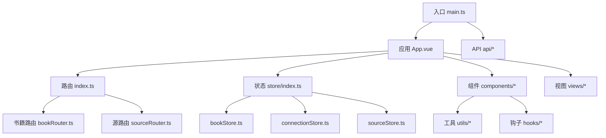
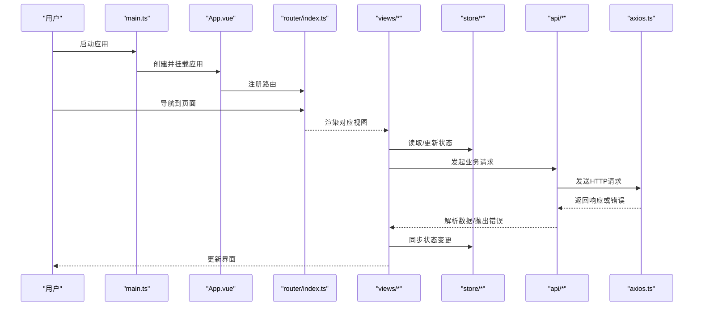
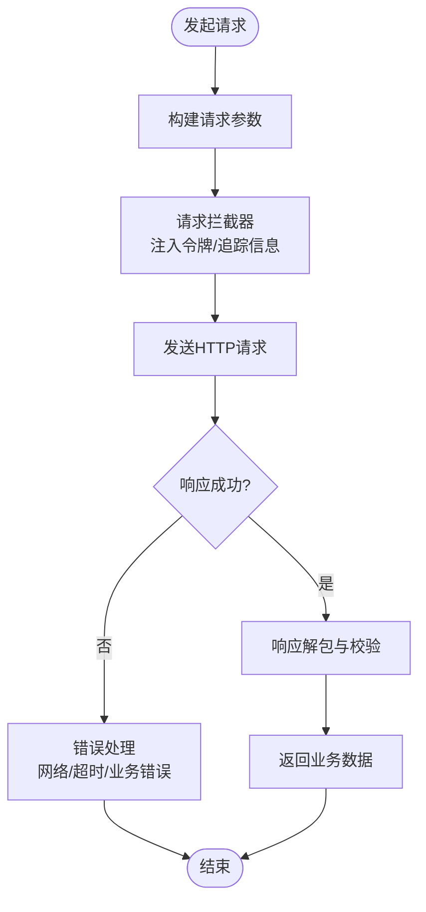
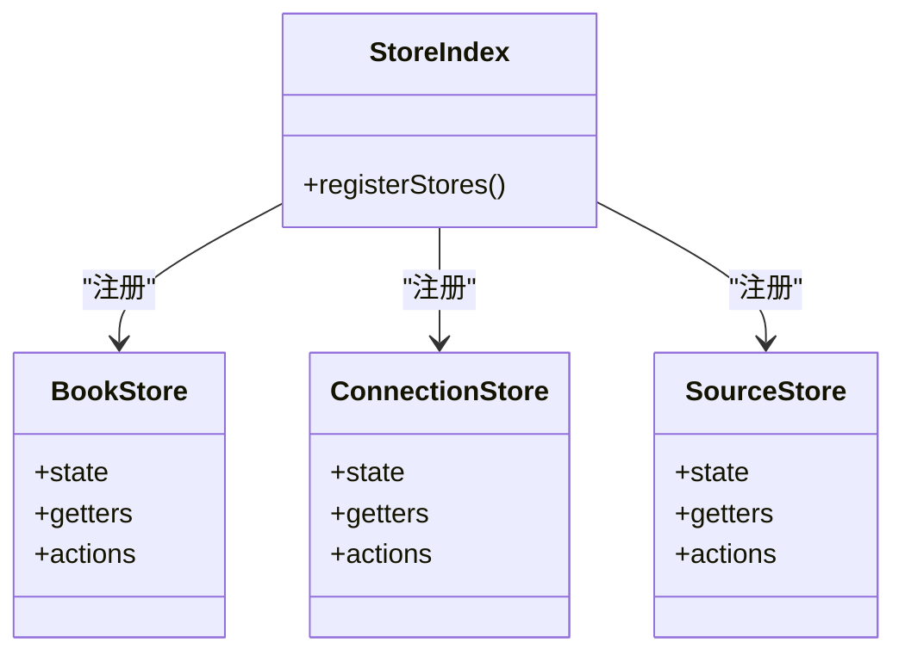
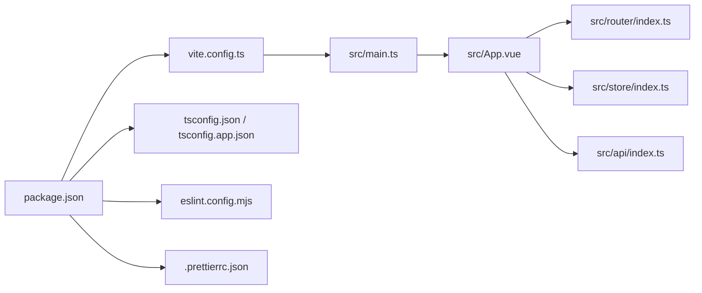

# JavaScript和TypeScript规范

<cite>
**本文档引用的文件**
- [package.json](file://modules/web/package.json)
- [vite.config.ts](file://modules/web/vite.config.ts)
- [tsconfig.json](file://modules/web/tsconfig.json)
- [tsconfig.app.json](file://modules/web/tsconfig.app.json)
- [eslint.config.mjs](file://modules/web/eslint.config.mjs)
- [.prettierrc.json](file://modules/web/.prettierrc.json)
- [.prettierignore](file://modules/web/.prettierignore)
- [main.ts](file://modules/web/src/main.ts)
- [App.vue](file://modules/web/src/App.vue)
- [index.ts](file://modules/web/src/router/index.ts)
- [bookRouter.ts](file://modules/web/src/router/bookRouter.ts)
- [sourceRouter.ts](file://modules/web/src/router/sourceRouter.ts)
- [api.ts](file://modules/web/src/api/api.ts)
- [axios.ts](file://modules/web/src/api/axios.ts)
- [index.ts](file://modules/web/src/api/index.ts)
- [sourceToken.ts](file://modules/web/src/api/sourceToken.ts)
- [bookStore.ts](file://modules/web/src/store/bookStore.ts)
- [connectionStore.ts](file://modules/web/src/store/connectionStore.ts)
- [sourceStore.ts](file://modules/web/src/store/sourceStore.ts)
- [index.ts](file://modules/web/src/store/index.ts)
- [BookChapter.vue](file://modules/web/src/views/BookChapter.vue)
- [BookShelf.vue](file://modules/web/src/views/BookShelf.vue)
- [SourceEditor.vue](file://modules/web/src/views/SourceEditor.vue)
- [BookItems.vue](file://modules/web/src/components/BookItems.vue)
- [CatalogItem.vue](file://modules/web/src/components/CatalogItem.vue)
- [ChapterContent.vue](file://modules/web/src/components/ChapterContent.vue)
- [PopCatalog.vue](file://modules/web/src/components/PopCatalog.vue)
- [ReadSettings.vue](file://modules/web/src/components/ReadSettings.vue)
- [SourceDebug.vue](file://modules/web/src/components/SourceDebug.vue)
- [SourceHelp.vue](file://modules/web/src/components/SourceHelp.vue)
- [SourceItem.vue](file://modules/web/src/components/SourceItem.vue)
- [SourceJson.vue](file://modules/web/src/components/SourceJson.vue)
- [SourceList.vue](file://modules/web/src/components/SourceList.vue)
- [SourceTabForm.vue](file://modules/web/src/components/SourceTabForm.vue)
- [SourceTabTools.vue](file://modules/web/src/components/SourceTabTools.vue)
- [ToolBar.vue](file://modules/web/src/components/ToolBar.vue)
- [loading.ts](file://modules/web/src/hooks/loading.ts)
- [souce.ts](file://modules/web/src/utils/souce.ts)
- [utils.ts](file://modules/web/src/utils/utils.ts)
- [env.d.ts](file://modules/web/env.d.ts)
- [book.d.ts](file://modules/web/src/book.d.ts)
- [source.d.ts](file://modules/web/src/source.d.ts)
- [web.d.ts](file://modules/web/src/web.d.ts)
</cite>

## 目录
1. [简介](#简介)
2. [项目结构](#项目结构)
3. [核心组件](#核心组件)
4. [架构总览](#架构总览)
5. [详细组件分析](#详细组件分析)
6. [依赖关系分析](#依赖关系分析)
7. [性能考虑](#性能考虑)
8. [故障排查指南](#故障排查指南)
9. [结论](#结论)
10. [附录](#附录)

## 简介
本规范面向Legado项目的Web前端（Vue 3 + TypeScript + Vite），统一JavaScript与TypeScript开发约定，覆盖：
- Vue.js单文件组件设计原则、模板语法、脚本编写规范
- TypeScript类型系统最佳实践（接口、泛型、推断、联合类型）
- API调用规范（HTTP封装、错误处理、响应拦截器）
- 状态管理（Pinia数据流、副作用处理）
- 工程化规范（代码分割、懒加载、构建优化）
- ESLint与Prettier配置与使用

## 项目结构
Web端位于 modules/web 目录，采用Vite驱动的Vue 3应用。关键目录与职责：
- src/api：HTTP请求封装、Axios实例、API路由与令牌管理
- src/store：Pinia状态管理模块（书籍、连接、源编辑等）
- src/router：路由定义（书籍、源编辑器等）
- src/components：可复用UI组件（书架、章节内容、工具栏等）
- src/views：页面级视图（书架、阅读器、源码编辑器）
- src/utils：通用工具函数与业务辅助方法
- src/hooks：组合式Hook（如加载态）
- 根级配置文件：Vite、TypeScript、ESLint、Prettier、包管理

图表来源
- [main.ts:1-200](file://modules/web/src/main.ts#L1-L200)
- [App.vue:1-200](file://modules/web/src/App.vue#L1-L200)
- [index.ts](file://modules/web/src/router/index.ts)
- [bookRouter.ts](file://modules/web/src/router/bookRouter.ts)
- [sourceRouter.ts](file://modules/web/src/router/sourceRouter.ts)
- [index.ts](file://modules/web/src/store/index.ts)
- [bookStore.ts](file://modules/web/src/store/bookStore.ts)
- [connectionStore.ts](file://modules/web/src/store/connectionStore.ts)
- [sourceStore.ts](file://modules/web/src/store/sourceStore.ts)
- [api.ts](file://modules/web/src/api/api.ts)
- [axios.ts](file://modules/web/src/api/axios.ts)
- [index.ts](file://modules/web/src/api/index.ts)
- [sourceToken.ts](file://modules/web/src/api/sourceToken.ts)

章节来源
- [package.json](file://modules/web/package.json)
- [vite.config.ts](file://modules/web/vite.config.ts)
- [tsconfig.json](file://modules/web/tsconfig.json)
- [tsconfig.app.json](file://modules/web/tsconfig.app.json)
- [eslint.config.mjs](file://modules/web/eslint.config.mjs)
- [.prettierrc.json](file://modules/web/.prettierrc.json)
- [.prettierignore](file://modules/web/.prettierignore)

## 核心组件
- 应用入口与初始化
  - 入口文件负责创建Vue应用、注册插件、挂载路由与状态管理
  - 应用根组件承载全局布局、主题与基础样式
- 路由组织
  - 按功能域划分路由（书籍、源编辑器），便于权限控制与懒加载
- 状态管理
  - 使用Pinia模块化store，按领域拆分（书籍、连接、源编辑）
- API层
  - 基于Axios封装统一请求、拦截器、错误处理与令牌刷新
- 组件体系
  - 视图组件（页面级）与原子组件（UI块）分离，遵循单一职责
- 工具与钩子
  - 工具函数保持无副作用；复杂逻辑通过组合式Hook暴露响应式能力

章节来源
- [main.ts:1-200](file://modules/web/src/main.ts#L1-L200)
- [App.vue:1-200](file://modules/web/src/App.vue#L1-L200)
- [index.ts](file://modules/web/src/router/index.ts)
- [index.ts](file://modules/web/src/store/index.ts)
- [axios.ts](file://modules/web/src/api/axios.ts)
- [api.ts](file://modules/web/src/api/api.ts)

## 架构总览
下图展示从入口到视图、状态、API的完整调用链与数据流向。

图表来源
- [main.ts:1-200](file://modules/web/src/main.ts#L1-L200)
- [App.vue:1-200](file://modules/web/src/App.vue#L1-L200)
- [index.ts](file://modules/web/src/router/index.ts)
- [BookShelf.vue](file://modules/web/src/views/BookShelf.vue)
- [BookChapter.vue](file://modules/web/src/views/BookChapter.vue)
- [index.ts](file://modules/web/src/store/index.ts)
- [bookStore.ts](file://modules/web/src/store/bookStore.ts)
- [axios.ts](file://modules/web/src/api/axios.ts)
- [api.ts](file://modules/web/src/api/api.ts)

## 详细组件分析

### Vue单文件组件规范
- 命名与组织
  - 组件名使用PascalCase，文件名与组件名一致
  - 视图组件放在src/views，可复用组件放在src/components
- 模板语法
  - 优先使用Composition API模板语法，避免过度依赖this
  - 列表渲染使用key，条件渲染合理使用v-if/v-show
- 脚本编写
  - 使用<script setup>，明确props与emits类型
  - 将副作用集中在onMounted/onUnmounted等生命周期中
- 样式
  - 推荐使用scoped样式，必要时使用CSS Modules或Tailwind类名
- 示例参考路径
  - [BookItems.vue](file://modules/web/src/components/BookItems.vue)
  - [ChapterContent.vue](file://modules/web/src/components/ChapterContent.vue)
  - [ReadSettings.vue](file://modules/web/src/components/ReadSettings.vue)

章节来源
- [BookItems.vue](file://modules/web/src/components/BookItems.vue)
- [ChapterContent.vue](file://modules/web/src/components/ChapterContent.vue)
- [ReadSettings.vue](file://modules/web/src/components/ReadSettings.vue)

### TypeScript类型系统最佳实践
- 接口定义
  - 为API响应、组件Props、Store状态建立独立接口文件
  - 使用partial/required等工具类型增强复用性
- 泛型使用
  - 对通用请求、缓存、分页等场景使用泛型约束
- 类型推断
  - 充分利用TS推断，减少冗余显式类型标注
- 联合类型与字面量类型
  - 使用联合类型表达多态状态，结合字面量类型提升可读性
- 声明文件
  - 第三方库扩展与全局类型在*.d.ts中集中管理
- 示例参考路径
  - [book.d.ts](file://modules/web/src/book.d.ts)
  - [source.d.ts](file://modules/web/src/source.d.ts)
  - [web.d.ts](file://modules/web/src/web.d.ts)
  - [env.d.ts](file://modules/web/env.d.ts)

章节来源
- [book.d.ts](file://modules/web/src/book.d.ts)
- [source.d.ts](file://modules/web/src/source.d.ts)
- [web.d.ts](file://modules/web/src/web.d.ts)
- [env.d.ts](file://modules/web/env.d.ts)

### API调用规范
- HTTP封装
  - 基于Axios创建实例，统一设置超时、基础URL、请求头
- 请求拦截器
  - 注入认证令牌、追踪ID、请求时间戳
- 响应拦截器
  - 统一解包数据、错误码映射、重试策略
- 错误处理
  - 区分网络错误、业务错误、超时错误，提供用户友好提示
- 令牌管理
  - 集中管理token获取、刷新与失效处理
- 示例参考路径
  - [axios.ts](file://modules/web/src/api/axios.ts)
  - [api.ts](file://modules/web/src/api/api.ts)
  - [index.ts](file://modules/web/src/api/index.ts)
  - [sourceToken.ts](file://modules/web/src/api/sourceToken.ts)

图表来源
- [axios.ts](file://modules/web/src/api/axios.ts)
- [api.ts](file://modules/web/src/api/api.ts)
- [index.ts](file://modules/web/src/api/index.ts)
- [sourceToken.ts](file://modules/web/src/api/sourceToken.ts)

章节来源
- [axios.ts](file://modules/web/src/api/axios.ts)
- [api.ts](file://modules/web/src/api/api.ts)
- [index.ts](file://modules/web/src/api/index.ts)
- [sourceToken.ts](file://modules/web/src/api/sourceToken.ts)

### 状态管理（Pinia）
- 模块划分
  - 按领域拆分store（书籍、连接、源编辑），避免单例膨胀
- 数据流设计
  - state描述状态，getters计算派生值，actions处理异步与副作用
- 副作用处理
  - 在actions中集中处理API调用、缓存更新、事件订阅
- 持久化
  - 对必要状态进行本地持久化，注意版本兼容与迁移
- 示例参考路径
  - [index.ts](file://modules/web/src/store/index.ts)
  - [bookStore.ts](file://modules/web/src/store/bookStore.ts)
  - [connectionStore.ts](file://modules/web/src/store/connectionStore.ts)
  - [sourceStore.ts](file://modules/web/src/store/sourceStore.ts)

图表来源
- [index.ts](file://modules/web/src/store/index.ts)
- [bookStore.ts](file://modules/web/src/store/bookStore.ts)
- [connectionStore.ts](file://modules/web/src/store/connectionStore.ts)
- [sourceStore.ts](file://modules/web/src/store/sourceStore.ts)

章节来源
- [index.ts](file://modules/web/src/store/index.ts)
- [bookStore.ts](file://modules/web/src/store/bookStore.ts)
- [connectionStore.ts](file://modules/web/src/store/connectionStore.ts)
- [sourceStore.ts](file://modules/web/src/store/sourceStore.ts)

### 路由与页面
- 路由组织
  - 按功能域拆分路由文件，便于权限与懒加载
- 懒加载
  - 使用动态导入实现页面级代码分割
- 导航守卫
  - 在路由层面做鉴权、参数校验与埋点
- 示例参考路径
  - [index.ts](file://modules/web/src/router/index.ts)
  - [bookRouter.ts](file://modules/web/src/router/bookRouter.ts)
  - [sourceRouter.ts](file://modules/web/src/router/sourceRouter.ts)
  - [BookShelf.vue](file://modules/web/src/views/BookShelf.vue)
  - [BookChapter.vue](file://modules/web/src/views/BookChapter.vue)
  - [SourceEditor.vue](file://modules/web/src/views/SourceEditor.vue)

章节来源
- [index.ts](file://modules/web/src/router/index.ts)
- [bookRouter.ts](file://modules/web/src/router/bookRouter.ts)
- [sourceRouter.ts](file://modules/web/src/router/sourceRouter.ts)
- [BookShelf.vue](file://modules/web/src/views/BookShelf.vue)
- [BookChapter.vue](file://modules/web/src/views/BookChapter.vue)
- [SourceEditor.vue](file://modules/web/src/views/SourceEditor.vue)

### 工具与钩子
- 工具函数
  - 纯函数优先，避免隐式副作用；按领域分文件组织
- 组合式Hook
  - 将复杂交互逻辑抽象为Hook，提高复用性与可测试性
- 示例参考路径
  - [utils.ts](file://modules/web/src/utils/utils.ts)
  - [souce.ts](file://modules/web/src/utils/souce.ts)
  - [loading.ts](file://modules/web/src/hooks/loading.ts)

章节来源
- [utils.ts](file://modules/web/src/utils/utils.ts)
- [souce.ts](file://modules/web/src/utils/souce.ts)
- [loading.ts](file://modules/web/src/hooks/loading.ts)

## 依赖关系分析
- 构建与类型
  - Vite作为构建工具，TypeScript用于类型检查与编译
  - ESLint与Prettier保证代码风格与质量
- 运行时依赖
  - Vue 3、Vue Router、Pinia、Axios为核心运行时库
- 配置优先级
  - tsconfig.app.json针对应用代码，tsconfig.node.json针对构建脚本

图表来源
- [package.json](file://modules/web/package.json)
- [vite.config.ts](file://modules/web/vite.config.ts)
- [tsconfig.json](file://modules/web/tsconfig.json)
- [tsconfig.app.json](file://modules/web/tsconfig.app.json)
- [eslint.config.mjs](file://modules/web/eslint.config.mjs)
- [.prettierrc.json](file://modules/web/.prettierrc.json)
- [main.ts](file://modules/web/src/main.ts)
- [App.vue](file://modules/web/src/App.vue)
- [index.ts](file://modules/web/src/router/index.ts)
- [index.ts](file://modules/web/src/store/index.ts)
- [index.ts](file://modules/web/src/api/index.ts)

章节来源
- [package.json](file://modules/web/package.json)
- [vite.config.ts](file://modules/web/vite.config.ts)
- [tsconfig.json](file://modules/web/tsconfig.json)
- [tsconfig.app.json](file://modules/web/tsconfig.app.json)
- [eslint.config.mjs](file://modules/web/eslint.config.mjs)
- [.prettierrc.json](file://modules/web/.prettierrc.json)

## 性能考虑
- 代码分割与懒加载
  - 页面级路由使用动态导入，组件按需加载
- 构建优化
  - 启用Vite生产模式优化、Tree Shaking、资源压缩
- 缓存策略
  - 静态资源使用强缓存，API响应合理设置缓存头
- 渲染优化
  - 列表虚拟化、防抖节流、避免不必要的重渲染
- 监控与度量
  - 接入性能埋点，监控首屏时间与关键指标

[本节为通用指导，不直接分析具体文件]

## 故障排查指南
- 常见问题定位
  - 网络请求失败：检查Axios拦截器、错误码映射与重试策略
  - 类型错误：核对接口定义与泛型约束，确保d.ts声明完整
  - 状态不一致：审查store actions中的副作用与异步流程
  - 路由跳转异常：确认路由配置与导航守卫逻辑
- 调试建议
  - 使用浏览器开发者工具Network面板查看请求详情
  - 在store与组件中添加日志输出，定位数据流断点
- 相关参考路径
  - [axios.ts](file://modules/web/src/api/axios.ts)
  - [api.ts](file://modules/web/src/api/api.ts)
  - [bookStore.ts](file://modules/web/src/store/bookStore.ts)
  - [index.ts](file://modules/web/src/router/index.ts)

章节来源
- [axios.ts](file://modules/web/src/api/axios.ts)
- [api.ts](file://modules/web/src/api/api.ts)
- [bookStore.ts](file://modules/web/src/store/bookStore.ts)
- [index.ts](file://modules/web/src/router/index.ts)

## 结论
本规范围绕Vue 3 + TypeScript + Vite技术栈，明确了组件设计、类型系统、API封装、状态管理与工程化实践。遵循上述规范有助于提升代码质量、可维护性与团队协作效率。建议在团队内推广并定期回顾更新。

[本节为总结性内容，不直接分析具体文件]

## 附录
- 工程化工具配置说明
  - ESLint：规则集与自定义规则，配合IDE实时检查
  - Prettier：统一格式化配置，忽略特定文件
  - TypeScript：严格模式、路径别名、模块解析策略
- 常用命令
  - 开发、构建、类型检查、代码格式化与校验
- 参考路径
  - [eslint.config.mjs](file://modules/web/eslint.config.mjs)
  - [.prettierrc.json](file://modules/web/.prettierrc.json)
  - [.prettierignore](file://modules/web/.prettierignore)
  - [tsconfig.json](file://modules/web/tsconfig.json)
  - [tsconfig.app.json](file://modules/web/tsconfig.app.json)
  - [package.json](file://modules/web/package.json)

章节来源
- [eslint.config.mjs](file://modules/web/eslint.config.mjs)
- [.prettierrc.json](file://modules/web/.prettierrc.json)
- [.prettierignore](file://modules/web/.prettierignore)
- [tsconfig.json](file://modules/web/tsconfig.json)
- [tsconfig.app.json](file://modules/web/tsconfig.app.json)
- [package.json](file://modules/web/package.json)