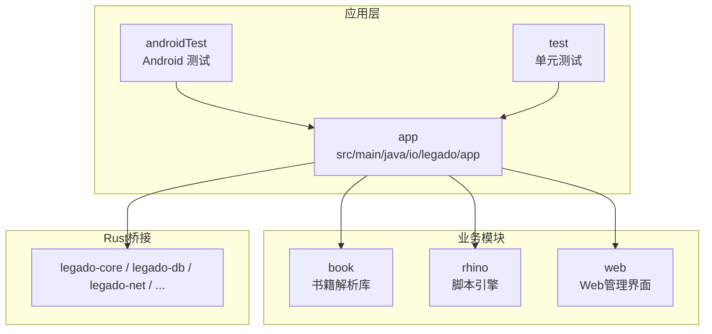
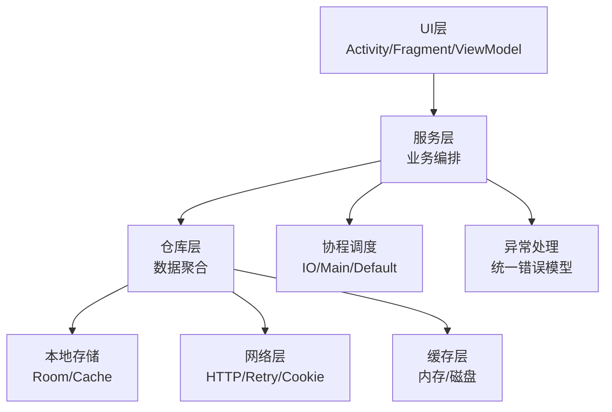
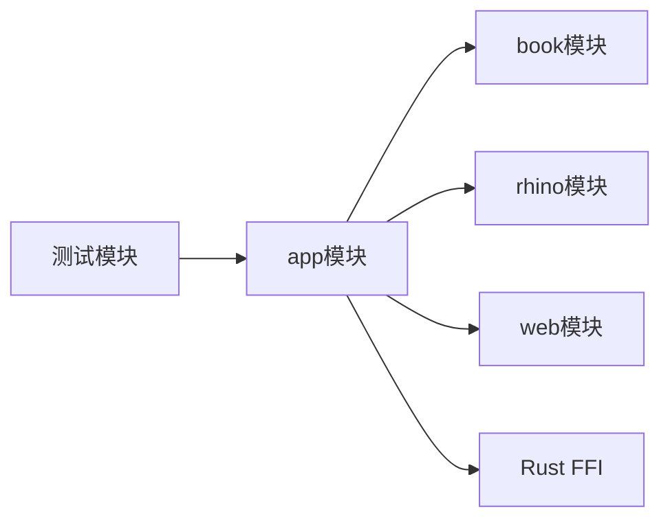

# Kotlin编码规范

<cite>
**本文引用的文件**   
- [App.kt](file://app/src/main/java/io/legado/app/App.kt)
- [README.md](file://app/src/main/java/io/legado/app/README.md)
- [build.gradle](file://app/build.gradle)
- [gradle.properties](file://gradle.properties)
- [settings.gradle](file://settings.gradle)
</cite>

## 目录
1. [简介](#简介)
2. [项目结构](#项目结构)
3. [核心组件](#核心组件)
4. [架构总览](#架构总览)
5. [详细组件分析](#详细组件分析)
6. [依赖分析](#依赖分析)
7. [性能考虑](#性能考虑)
8. [故障排查指南](#故障排查指南)
9. [结论](#结论)
10. [附录](#附录) 

## 简介
本规范面向Android项目的Kotlin代码，目标是统一命名、文件组织、包结构、注释风格与异常处理实践，并覆盖协程、空安全、扩展函数、数据类等现代Kotlin特性。文档同时提供重构建议与性能优化技巧，帮助团队在大型多模块项目中保持一致性与可维护性。

## 项目结构
本项目采用多模块结构：应用层位于 app 模块，业务逻辑分布在多个子模块（如 book、rhino、web 等），Rust 侧通过 FFI 暴露能力给上层。Kotlin代码集中在 app/src/main/java/io/legado/app 下，按功能域划分为 base、constant、data、exception、help、lib、model、receiver、service、ui、utils、web 等包。测试代码分别位于 androidTest 与 test 目录。

图表来源 
- [App.kt](file://app/src/main/java/io/legado/app/App.kt)
- [build.gradle](file://app/build.gradle)
- [settings.gradle](file://settings.gradle)

章节来源
- [App.kt](file://app/src/main/java/io/legado/app/App.kt)
- [README.md](file://app/src/main/java/io/legado/app/README.md)
- [build.gradle](file://app/build.gradle)
- [gradle.properties](file://gradle.properties)
- [settings.gradle](file://settings.gradle)

## 核心组件
- 应用入口与初始化：Application子类负责全局配置、日志、第三方SDK初始化、数据库与网络栈准备。
- 常量与配置：集中定义应用级常量、默认值、开关与版本信息。
- 数据层：Entity、DAO、Repository分层，配合Room与本地缓存。
- 网络层：HTTP客户端封装、重试、代理、Cookie存储、速率限制。
- UI层：Activity/Fragment/ViewModel分离，遵循MVVM模式。
- 工具与扩展：通用工具类与Kotlin扩展函数，提升可读性与复用性。
- 异常体系：自定义异常类型、错误码与传播策略。

章节来源
- [App.kt](file://app/src/main/java/io/legado/app/App.kt)
- [build.gradle](file://app/build.gradle)

## 架构总览
整体采用分层架构与模块化设计：UI层通过ViewModel调用Service/Repository，Repository协调数据源（本地数据库、网络、缓存）。协程贯穿异步流程，异常统一收敛到顶层处理器进行记录与提示。

图表来源 
- [App.kt](file://app/src/main/java/io/legado/app/App.kt)
- [build.gradle](file://app/build.gradle)

## 详细组件分析

### 命名约定
- 类名：使用大驼峰（UpperCamelCase），语义清晰且简洁，避免缩写。
- 方法名：小驼峰（lowerCamelCase），动词开头表达行为；布尔方法以 is/has/can 前缀。
- 变量名：小驼峰，语义明确；集合以复数形式命名。
- 常量名：全大写加下划线（UPPER_SNAKE_CASE），集中声明于 companion object 或独立常量文件。
- 包名：全小写，按功能域划分，避免层级过深。
- 文件名：与主类同名，使用大驼峰；工具类以 Utils/Helper 结尾。

章节来源
- [App.kt](file://app/src/main/java/io/legado/app/App.kt)

### 文件组织结构
- 单一职责：每个文件聚焦一个类或一组紧密相关的扩展函数。
- 分层清晰：UI、Service、Repository、Data、Utils 分目录存放。
- 资源隔离：字符串、颜色、样式等资源按功能分组，避免混放。
- 测试对齐：测试文件与源码结构对应，便于定位与维护。

章节来源
- [build.gradle](file://app/build.gradle)
- [settings.gradle](file://settings.gradle)

### 包命名规范
- 基础包：io.legado.app
- 子包：base、constant、data、exception、help、lib、model、receiver、service、ui、utils、web
- 包内组织：按领域或功能划分，避免跨层耦合；公共接口放在顶层包，实现下沉至具体包。

章节来源
- [App.kt](file://app/src/main/java/io/legado/app/App.kt)

### 注释标准
- 类注释：说明用途、关键约束、线程安全性与生命周期注意事项。
- 方法注释：参数含义、返回值、异常抛出条件、副作用与并发要求。
- 复杂逻辑注释：解释算法思路、边界条件、性能考量与替代方案。
- 行内注释：仅用于解释“为什么”，而非“是什么”；避免冗余注释。

章节来源
- [App.kt](file://app/src/main/java/io/legado/app/App.kt)

### 异常处理最佳实践
- 自定义异常：区分业务异常与系统异常，携带错误码与上下文信息。
- 错误传播：优先使用 Result/Flow 传递错误，避免吞掉异常；在边界处转换为用户可见消息。
- 日志记录：分级记录（debug/info/warn/error），包含必要上下文但不泄露敏感信息。
- 恢复策略：对可恢复错误提供重试、降级与回退路径。

章节来源
- [App.kt](file://app/src/main/java/io/legado/app/App.kt)

### 协程使用规范
- 调度器选择：IO密集型使用 IO，CPU密集型使用 Default，UI更新使用 Main。
- 作用域管理：使用 viewModelScope/lifecycleScope，避免泄漏；取消传播要正确。
- 超时与取消：为长时间任务设置超时；监听取消信号并及时退出。
- 结构化并发：用 coroutineScope/supervisorScope 组合任务，保证错误隔离。

章节来源
- [App.kt](file://app/src/main/java/io/legado/app/App.kt)

### 空安全处理
- 优先使用非空类型；必要时使用 ? 与 !! 谨慎操作。
- 使用 let/apply/also/run 简化空检查与链式调用。
- 默认值与空合并运算符 ?: 提高可读性。
- 对外API明确标注可空性，避免隐式 null。

章节来源
- [App.kt](file://app/src/main/java/io/legado/app/App.kt)

### 扩展函数编写
- 单一职责：每个扩展函数只做一件事，保持短小精悍。
- 命名清晰：动词+名词，体现行为意图；避免歧义。
- 可组合性：支持链式调用与高阶函数组合。
- 文档完善：说明适用场景、前置条件与副作用。

章节来源
- [App.kt](file://app/src/main/java/io/legado/app/App.kt)

### 数据类设计
- 不可变性：使用 data class + val 字段；必要时提供 copy 方法。
- 序列化：与JSON/Protobuf映射一致，避免循环引用。
- 校验：在构造时进行基本校验，失败抛出自定义异常。
- 性能：避免不必要的对象创建，合理使用单例与缓存。

章节来源
- [App.kt](file://app/src/main/java/io/legado/app/App.kt)

### 代码重构建议
- 提取公共逻辑：将重复代码抽取为工具函数或基类。
- 解耦依赖：通过接口与依赖注入降低耦合度。
- 简化控制流：用高阶函数与集合操作替代冗长循环。
- 增强可测试性：拆分纯函数与副作用，便于单元测试。

章节来源
- [App.kt](file://app/src/main/java/io/legado/app/App.kt)

### 性能优化技巧
- 减少GC压力：重用对象、避免频繁装箱、使用数组替代List。
- I/O优化：批量读写、连接池、压缩传输。
- 计算优化：懒加载、缓存结果、并行化独立任务。
- UI优化：延迟加载、分页渲染、避免主线程阻塞。

章节来源
- [App.kt](file://app/src/main/java/io/legado/app/App.kt)

## 依赖分析
项目依赖关系清晰：应用层依赖业务模块与Rust桥接；模块间通过接口通信，避免循环依赖。构建配置统一管理依赖版本与编译选项。

图表来源 
- [build.gradle](file://app/build.gradle)
- [settings.gradle](file://settings.gradle)

章节来源
- [build.gradle](file://app/build.gradle)
- [settings.gradle](file://settings.gradle)

## 性能考虑
- 启动优化：延迟初始化非必要组件，使用按需加载。
- 内存管理：及时释放资源，避免持有长生命周期引用。
- 网络优化：启用HTTP/2、连接复用、合理超时与重试。
- 数据库优化：索引设计、批量操作、事务最小化。
- 监控与埋点：收集关键指标，定位瓶颈。

[本节为通用指导，不直接分析具体文件]

## 故障排查指南
- 日志定位：确保关键路径有足够日志，包含上下文与堆栈。
- 异常捕获：在边界处捕获并转换异常，避免崩溃。
- 调试工具：使用断点、日志与性能分析器定位问题。
- 回归测试：修复后补充用例，防止复发。

章节来源
- [App.kt](file://app/src/main/java/io/legado/app/App.kt)

## 结论
本规范从命名、结构、注释、异常、协程、空安全、扩展函数、数据类等方面提供了全面的Kotlin编码指导。结合重构建议与性能优化技巧，有助于提升代码质量与开发效率。建议在团队内推广并定期审查执行情况。

[本节为总结性内容，不直接分析具体文件]

## 附录
- 常用工具集：日期、加密、网络、文件、UI辅助等。
- 模板与脚手架：快速生成类、接口与测试文件。
- 持续集成：自动化构建、测试与发布流程。

[本节为补充信息，不直接分析具体文件]