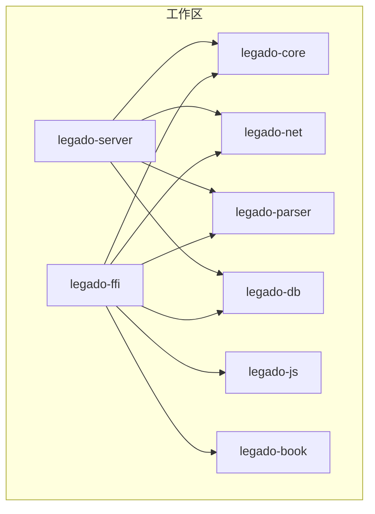
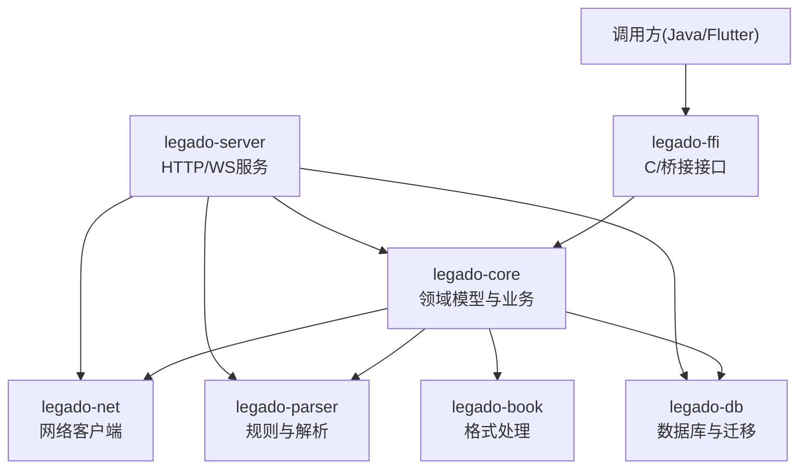
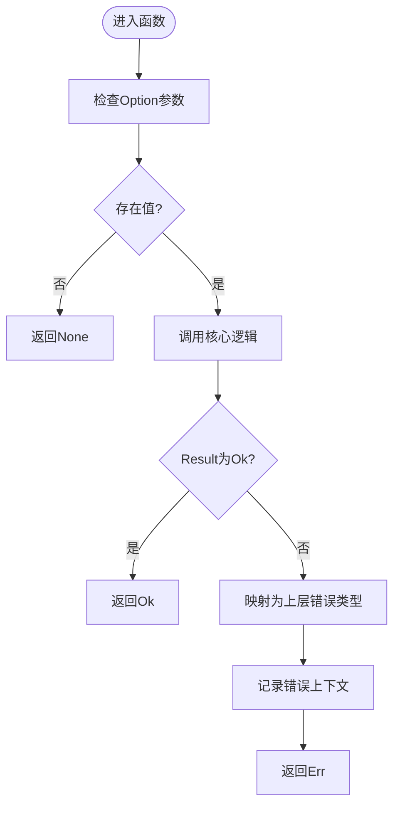
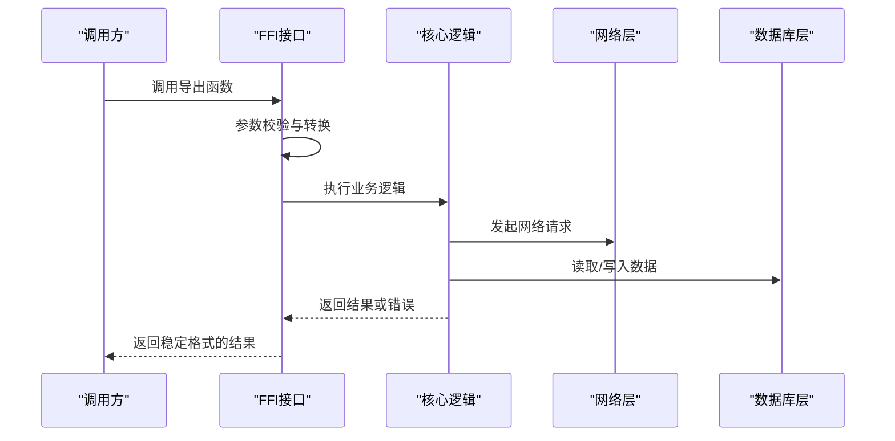
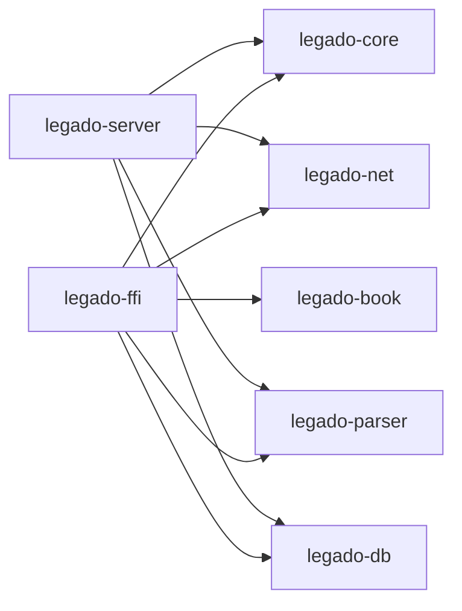

# Rust编程规范

<cite>
**本文档引用的文件**
- [rust/Cargo.toml](file://rust/Cargo.toml)
- [rust/legado-core/src/lib.rs](file://rust/legado-core/src/lib.rs)
- [rust/legado-core/src/error.rs](file://rust/legado-core/src/error.rs)
- [rust/legado-core/src/types.rs](file://rust/legado-core/src/types.rs)
- [rust/legado-ffi/src/lib.rs](file://rust/legado-ffi/src/lib.rs)
- [rust/legado-ffi/src/ffi.rs](file://rust/legado-ffi/src/ffi.rs)
- [rust/legado-ffi/src/error.rs](file://rust/legado-ffi/src/error.rs)
- [rust/legado-net/src/lib.rs](file://rust/legado-net/src/lib.rs)
- [rust/legado-parser/src/lib.rs](file://rust/legado-parser/src/lib.rs)
- [rust/legado-db/src/lib.rs](file://rust/legado-db/src/lib.rs)
- [rust/legado-js/src/lib.rs](file://rust/legado-js/src/lib.rs)
- [rust/legado-book/src/lib.rs](file://rust/legado-book/src/lib.rs)
- [rust/legado-server/src/lib.rs](file://rust/legado-server/src/lib.rs)
- [rust/rust-toolchain.toml](file://rust/rust-toolchain.toml)
</cite>

## 目录
1. [简介](#简介)
2. [项目结构](#项目结构)
3. [核心组件](#核心组件)
4. [架构总览](#架构总览)
5. [详细组件分析](#详细组件分析)
6. [依赖关系分析](#依赖关系分析)
7. [性能考虑](#性能考虑)
8. [故障排查指南](#故障排查指南)
9. [结论](#结论)
10. [附录](#附录)

## 简介
本规范面向Legado项目的Rust代码，目标是统一代码风格、错误处理、内存与所有权模型、并发与异步、FFI接口设计以及性能优化策略。文档基于仓库中的实际Rust模块与实现进行提炼，确保可落地执行，并兼顾初学者与资深开发者的阅读需求。

## 项目结构
仓库的Rust部分位于 rust 目录下，采用多crate（库）组织，按职责划分：
- legado-core：核心数据模型、通用工具、业务逻辑
- legado-ffi：对外暴露的C/Flutter Bridge接口
- legado-net：网络请求、重试、代理、SSL配置等
- legado-parser：规则解析、HTML/XPath/JSONPath等
- legado-db：数据库连接、迁移、仓储层
- legado-js：JS引擎集成与沙箱
- legado-book：电子书格式处理（EPUB/MOBI/PDF/TXT/UMD）
- legado-server：HTTP/WebSocket服务与路由
- 根Cargo.toml：工作区定义与依赖管理

图表来源
- [rust/Cargo.toml](file://rust/Cargo.toml)

章节来源
- [rust/Cargo.toml](file://rust/Cargo.toml)

## 核心组件
- 错误处理：统一使用Result/Option，并在核心层定义自定义错误类型，便于跨层传播与诊断。
- 类型系统：在core中集中定义领域类型，避免重复与不一致。
- FFI边界：在ffi层提供稳定C/桥接接口，严格隔离内部实现细节。
- 网络与解析：net与parser解耦，通过清晰的数据结构交互。
- 存储：db层封装SQLite访问与迁移，repository模式抽象数据操作。
- JS集成：js层提供沙箱化执行环境，限制能力边界。
- 书格式：book层专注格式转换与内容提取。
- 服务端：server层暴露HTTP/WS接口，复用core/net/parser/db能力。

章节来源
- [rust/legado-core/src/lib.rs](file://rust/legado-core/src/lib.rs)
- [rust/legado-core/src/error.rs](file://rust/legado-core/src/error.rs)
- [rust/legado-core/src/types.rs](file://rust/legado-core/src/types.rs)
- [rust/legado-ffi/src/lib.rs](file://rust/legado-ffi/src/lib.rs)
- [rust/legado-ffi/src/ffi.rs](file://rust/legado-ffi/src/ffi.rs)
- [rust/legado-net/src/lib.rs](file://rust/legado-net/src/lib.rs)
- [rust/legado-parser/src/lib.rs](file://rust/legado-parser/src/lib.rs)
- [rust/legado-db/src/lib.rs](file://rust/legado-db/src/lib.rs)
- [rust/legado-js/src/lib.rs](file://rust/legado-js/src/lib.rs)
- [rust/legado-book/src/lib.rs](file://rust/legado-book/src/lib.rs)
- [rust/legado-server/src/lib.rs](file://rust/legado-server/src/lib.rs)

## 架构总览
整体分层遵循“FFI入口 -> 业务核心 -> 基础设施”的分层原则，保证高内聚低耦合。

图表来源
- [rust/legado-ffi/src/lib.rs](file://rust/legado-ffi/src/lib.rs)
- [rust/legado-core/src/lib.rs](file://rust/legado-core/src/lib.rs)
- [rust/legado-net/src/lib.rs](file://rust/legado-net/src/lib.rs)
- [rust/legado-parser/src/lib.rs](file://rust/legado-parser/src/lib.rs)
- [rust/legado-db/src/lib.rs](file://rust/legado-db/src/lib.rs)
- [rust/legado-book/src/lib.rs](file://rust/legado-book/src/lib.rs)
- [rust/legado-server/src/lib.rs](file://rust/legado-server/src/lib.rs)

## 详细组件分析

### 命名约定与模块组织
- 包名与模块名：全小写，使用下划线分隔；公共API以语义清晰的短名暴露。
- 类型与字段：PascalCase；常量使用SCREAMING_SNAKE_CASE。
- 函数与方法：snake_case；避免缩写，保持可读性。
- 模块组织：按功能域拆分，每个crate聚焦单一职责；公共类型集中在lib.rs或types.rs。

章节来源
- [rust/legado-core/src/lib.rs](file://rust/legado-core/src/lib.rs)
- [rust/legado-core/src/types.rs](file://rust/legado-core/src/types.rs)
- [rust/legado-ffi/src/lib.rs](file://rust/legado-ffi/src/lib.rs)

### 错误处理模式
- 优先使用Result<T, E>表达可恢复错误，Option<T>表达可选值。
- 自定义错误类型集中在core层，提供From/Into实现以便自动转换。
- FFI层将内部错误转换为稳定的C/桥接错误码或字符串，避免泄露实现细节。
- 日志与上下文：关键路径记录错误上下文，便于定位问题。

图表来源
- [rust/legado-core/src/error.rs](file://rust/legado-core/src/error.rs)
- [rust/legado-ffi/src/error.rs](file://rust/legado-ffi/src/error.rs)

章节来源
- [rust/legado-core/src/error.rs](file://rust/legado-core/src/error.rs)
- [rust/legado-ffi/src/error.rs](file://rust/legado-ffi/src/error.rs)

### 内存安全与所有权最佳实践
- 生命周期：明确标注&'a引用，避免悬垂指针；优先使用Owned类型减少借用复杂度。
- 借用检查：尽量使用不可变引用；可变借用最小化作用域，避免同时存在多个可变引用。
- 智能指针：
  - Rc/Arc用于共享所有权；Arc配合Mutex/RwLock用于多线程共享。
  - Box用于堆分配大对象或递归类型。
  - Cow用于读写分离场景，减少不必要的拷贝。
- 零拷贝：在解析与IO路径尽量使用切片与流式处理，避免中间拷贝。

章节来源
- [rust/legado-core/src/types.rs](file://rust/legado-core/src/types.rs)
- [rust/legado-parser/src/lib.rs](file://rust/legado-parser/src/lib.rs)
- [rust/legado-net/src/lib.rs](file://rust/legado-net/src/lib.rs)

### 并发编程规范
- 线程安全：Send/Sync显式约束；共享状态使用Arc<Mutex<T>>或Arc<RwLock<T>>。
- 异步编程：使用tokio运行时；避免阻塞调用；合理设置超时与取消。
- 锁机制：细粒度锁，缩短临界区；优先无锁数据结构或消息传递。
- 任务调度：区分CPU密集与IO密集任务，合理设置线程池大小。

章节来源
- [rust/legado-net/src/lib.rs](file://rust/legado-net/src/lib.rs)
- [rust/legado-server/src/lib.rs](file://rust/legado-server/src/lib.rs)
- [rust/legado-js/src/lib.rs](file://rust/legado-js/src/lib.rs)

### FFI接口设计规范
- C接口：仅暴露稳定、无内部状态的函数；输入输出使用基本类型或明确布局的结构体。
- 数据类型映射：字符串使用固定编码（如UTF-8），避免平台差异；指针与缓冲区长度成对传递。
- 错误传播：统一错误码或错误字符串；禁止抛出异常到外部语言。
- 资源管理：明确所有权转移与释放时机，避免内存泄漏。

图表来源
- [rust/legado-ffi/src/ffi.rs](file://rust/legado-ffi/src/ffi.rs)
- [rust/legado-core/src/lib.rs](file://rust/legado-core/src/lib.rs)
- [rust/legado-net/src/lib.rs](file://rust/legado-net/src/lib.rs)
- [rust/legado-db/src/lib.rs](file://rust/legado-db/src/lib.rs)

章节来源
- [rust/legado-ffi/src/ffi.rs](file://rust/legado-ffi/src/ffi.rs)
- [rust/legado-ffi/src/lib.rs](file://rust/legado-ffi/src/lib.rs)

### 代码格式化与静态分析
- 格式化：统一使用rustfmt，配置在工程根或工作区级别，CI强制检查。
- 静态分析：启用clippy，配置deny/warn级别规则，避免常见陷阱。
- 版本锁定：通过rust-toolchain.toml锁定工具链版本，确保一致性。

章节来源
- [rust/rust-toolchain.toml](file://rust/rust-toolchain.toml)

## 依赖关系分析
各crate之间依赖清晰，FFI作为唯一对外边界，核心逻辑集中在core，基础设施按需引入。

图表来源
- [rust/Cargo.toml](file://rust/Cargo.toml)

章节来源
- [rust/Cargo.toml](file://rust/Cargo.toml)

## 性能考虑
- 零成本抽象：优先使用栈上分配与视图（&[T]、Cow），避免不必要的克隆。
- 内存布局：结构体字段按访问顺序排列，提升缓存命中率；必要时使用#[repr(C)]对齐。
- IO与解析：流式处理大文件，延迟加载与分页读取；正则与XPath规则预编译。
- 并发优化：批处理与合并请求；合理设置超时与重试退避；避免热点锁竞争。
- 测量与基准：使用criterion进行基准测试，识别瓶颈并持续优化。

## 故障排查指南
- 错误分类：区分业务错误、系统错误与网络错误，分别记录不同上下文。
- 日志策略：关键路径记录入参、出参与耗时；敏感信息脱敏。
- 调试技巧：启用断言与panic钩子；在FFI层增加边界检查与回滚。
- 常见问题：
  - 死锁：检查锁顺序与作用域，优先使用RAII与超时。
  - 内存泄漏：使用工具检测未释放资源，审查所有权转移。
  - 异步竞态：确保共享状态同步，避免数据竞争。

章节来源
- [rust/legado-core/src/error.rs](file://rust/legado-core/src/error.rs)
- [rust/legado-ffi/src/error.rs](file://rust/legado-ffi/src/error.rs)

## 结论
本规范围绕Legado的Rust代码现状，系统化地定义了风格、错误处理、内存与并发、FFI设计与性能优化策略。通过严格执行这些规范，可显著提升代码质量、可维护性与运行效率。建议结合CI自动化检查与定期评审，持续改进。

## 附录
- 工具链与配置：参考rust-toolchain.toml与工作区Cargo配置。
- 示例与模板：在core与ffi层新增功能时，参照现有模块的组织方式与错误处理模式。
- 参考资料：Rust官方文档、Tokio手册、SQLite与网络库最佳实践。