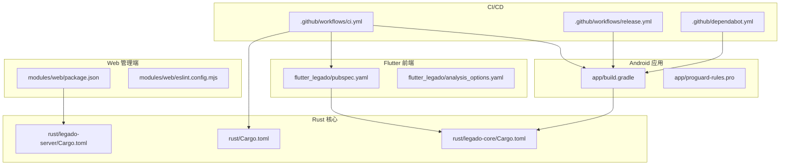
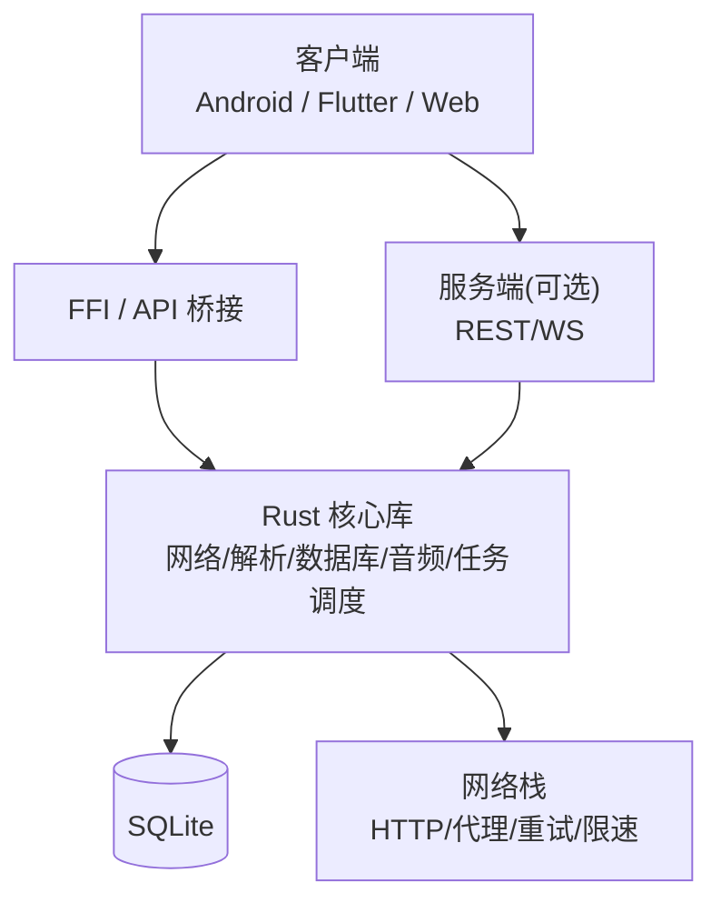
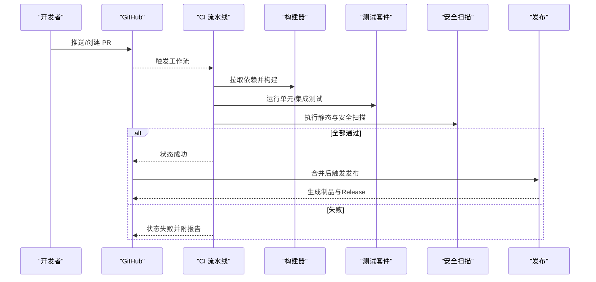
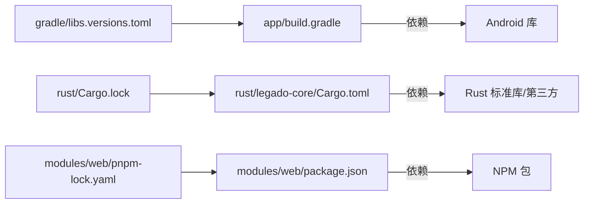

# 代码审查清单

<cite>
**本文引用的文件**   
- [README.md](file://README.md)
- [.github/workflows/ci.yml](file://.github/workflows/ci.yml)
- [.github/workflows/release.yml](file://.github/workflows/release.yml)
- [.github/dependabot.yml](file://.github/dependabot.yml)
- [app/build.gradle](file://app/build.gradle)
- [gradle/libs.versions.toml](file://gradle/libs.versions.toml)
- [app/proguard-rules.pro](file://app/proguard-rules.pro)
- [flutter_legado/analysis_options.yaml](file://flutter_legado/analysis_options.yaml)
- [flutter_legado/pubspec.yaml](file://flutter_legado/pubspec.yaml)
- [modules/web/package.json](file://modules/web/package.json)
- [modules/web/eslint.config.mjs](file://modules/web/eslint.config.mjs)
- [rust/Cargo.toml](file://rust/Cargo.toml)
- [rust/legado-core/Cargo.toml](file://rust/legado-core/Cargo.toml)
- [rust/legado-server/Cargo.toml](file://rust/legado-server/Cargo.toml)
- [Makefile](file://Makefile)
</cite>

## 目录
1. [简介](#简介)
2. [项目结构](#项目结构)
3. [核心组件](#核心组件)
4. [架构总览](#架构总览)
5. [详细组件分析](#详细组件分析)
6. [依赖分析](#依赖分析)
7. [性能考量](#性能考量)
8. [故障排查指南](#故障排查指南)
9. [结论](#结论)
10. [附录](#附录)

## 简介
本文件为 Legado 项目的代码审查清单与流程规范，覆盖代码质量、安全性、性能、可维护性等关键维度；定义 Pull Request 流程（分支策略、合并要求、审批流程）；说明持续集成配置（自动化测试、构建验证、部署检查）；提供常见问题排查指南；并给出代码质量度量指标与报告生成方法。目标是让不同技术背景的协作者都能高效参与高质量评审与交付。

## 项目结构
Legado 采用多模块、多语言工程结构：
- Android 应用层（Kotlin/Java）位于 app 模块，包含 UI、服务、数据层与资源。
- Flutter 跨平台界面位于 flutter_legado 模块，用于多端统一体验。
- Rust 核心库位于 rust 目录，包含网络、解析、数据库、FFI 桥接与服务端等子模块。
- Web 管理端位于 modules/web，基于 Vue/TS 生态。
- Gradle/Kotlin 版本管理与依赖锁定在 gradle/libs.versions.toml。
- CI/CD 与发布脚本位于 .github/workflows 与根 Makefile。

图表来源
- [app/build.gradle](file://app/build.gradle)
- [flutter_legado/pubspec.yaml](file://flutter_legado/pubspec.yaml)
- [rust/Cargo.toml](file://rust/Cargo.toml)
- [modules/web/package.json](file://modules/web/package.json)
- [.github/workflows/ci.yml](file://.github/workflows/ci.yml)
- [.github/workflows/release.yml](file://.github/workflows/release.yml)
- [.github/dependabot.yml](file://.github/dependabot.yml)

章节来源
- [README.md](file://README.md)
- [app/build.gradle](file://app/build.gradle)
- [flutter_legado/pubspec.yaml](file://flutter_legado/pubspec.yaml)
- [rust/Cargo.toml](file://rust/Cargo.toml)
- [modules/web/package.json](file://modules/web/package.json)
- [.github/workflows/ci.yml](file://.github/workflows/ci.yml)
- [.github/workflows/release.yml](file://.github/workflows/release.yml)
- [.github/dependabot.yml](file://.github/dependabot.yml)

## 核心组件
- Android 应用模块：负责 UI、业务逻辑、本地存储、网络请求与系统能力调用。
- Flutter 模块：提供跨平台界面与交互，通过 Rust FFI 与核心能力互通。
- Rust 核心库：实现高性能数据处理、网络、解析、数据库访问与 FFI 暴露。
- Web 管理端：提供源码编辑、书架管理等 Web 功能。
- CI/CD：GitHub Actions 驱动构建、测试、扫描与发布。

章节来源
- [app/build.gradle](file://app/build.gradle)
- [flutter_legado/pubspec.yaml](file://flutter_legado/pubspec.yaml)
- [rust/Cargo.toml](file://rust/Cargo.toml)
- [modules/web/package.json](file://modules/web/package.json)
- [.github/workflows/ci.yml](file://.github/workflows/ci.yml)

## 架构总览
整体架构遵循“前端（Android/Flutter/Web）—Ffi/桥接—Rust 核心”的分层模式，配合 CI/CD 流水线保障质量与一致性。

图表来源
- [rust/legado-core/Cargo.toml](file://rust/legado-core/Cargo.toml)
- [rust/legado-net/src/lib.rs](file://rust/legado-net/src/lib.rs)
- [rust/legado-db/src/lib.rs](file://rust/legado-db/src/lib.rs)
- [rust/legado-server/Cargo.toml](file://rust/legado-server/Cargo.toml)

## 详细组件分析

### 代码审查清单（通用）
- 代码质量
  - 命名清晰、职责单一、函数短小、避免深层嵌套。
  - 注释与文档完善，复杂逻辑有设计说明。
  - 常量与配置集中管理，避免魔法值。
- 安全性
  - 输入校验与白名单，拒绝非法参数。
  - 敏感信息不硬编码，使用安全存储与最小权限原则。
  - 依赖版本受控，定期更新漏洞修复。
- 性能
  - I/O 异步化，避免主线程阻塞。
  - 缓存与分页合理，减少重复计算与内存占用。
  - 日志级别恰当，避免过多打印影响性能。
- 可维护性
  - 模块化与接口抽象，降低耦合。
  - 错误处理一致，异常分类明确。
  - 单元测试与集成测试覆盖关键路径。

章节来源
- [app/build.gradle](file://app/build.gradle)
- [flutter_legado/analysis_options.yaml](file://flutter_legado/analysis_options.yaml)
- [modules/web/eslint.config.mjs](file://modules/web/eslint.config.mjs)
- [rust/Cargo.toml](file://rust/Cargo.toml)

### 静态分析与代码风格
- Kotlin/Android
  - 启用 lint 与 ktlint/detekt（如存在），在 CI 中执行。
  - ProGuard/R8 规则需保持必要类与方法。
- Flutter/Dart
  - analysis_options.yaml 统一分析选项，CI 执行 dart analyze。
  - pubspec 依赖版本锁定，避免漂移。
- Web（Vue/TS）
  - ESLint/Prettier 统一风格，CI 执行 lint 与 build。
- Rust
  - clippy 与 cargo fmt 在 CI 执行，确保代码风格与潜在问题检查。

章节来源
- [app/proguard-rules.pro](file://app/proguard-rules.pro)
- [flutter_legado/analysis_options.yaml](file://flutter_legado/analysis_options.yaml)
- [flutter_legado/pubspec.yaml](file://flutter_legado/pubspec.yaml)
- [modules/web/eslint.config.mjs](file://modules/web/eslint.config.mjs)
- [rust/Cargo.toml](file://rust/Cargo.toml)

### 单元测试与覆盖率
- Android（JUnit/Espresso）
  - 单测位于 app/src/test 与 app/src/androidTest，CI 执行 assemble + test。
- Flutter（Dart Test）
  - 单测位于 flutter_legado/test，CI 执行 flutter test。
- Rust（cargo test）
  - 单测与集成测试位于各 crate tests 目录，CI 执行 cargo test。
- 覆盖率
  - Android：JaCoCo 或 Kover（若启用）。
  - Flutter：coverage 包生成 lcov/html。
  - Rust：cargo-tarpaulin 或 llvm-cov。

章节来源
- [app/build.gradle](file://app/build.gradle)
- [flutter_legado/pubspec.yaml](file://flutter_legado/pubspec.yaml)
- [rust/Cargo.toml](file://rust/Cargo.toml)

### 依赖安全检查
- Dependabot
  - 自动检测依赖漏洞与更新，按策略创建 PR。
- 工具链
  - npm audit（Web）、cargo audit（Rust）、Gradle 依赖审计（如适用）。
- 策略
  - 高危漏洞必须修复方可合并；中低危设置阈值与告警。

章节来源
- [.github/dependabot.yml](file://.github/dependabot.yml)
- [modules/web/package.json](file://modules/web/package.json)
- [rust/Cargo.toml](file://rust/Cargo.toml)
- [gradle/libs.versions.toml](file://gradle/libs.versions.toml)

### 持续集成与发布
- CI 流水线
  - 触发条件：push/PR；执行 lint、test、build、扫描。
  - 缓存依赖加速构建（Gradle、Cargo、npm）。
- 发布流程
  - 标签触发 release workflow，构建产物上传至 Release。
  - 签名与校验，生成变更日志。

图表来源
- [.github/workflows/ci.yml](file://.github/workflows/ci.yml)
- [.github/workflows/release.yml](file://.github/workflows/release.yml)

章节来源
- [.github/workflows/ci.yml](file://.github/workflows/ci.yml)
- [.github/workflows/release.yml](file://.github/workflows/release.yml)

### Pull Request 流程规范
- 分支策略
  - main：稳定分支，仅接受经过完整 CI 的合并。
  - develop：集成分支，日常开发合并。
  - feature/*：功能分支，从 develop 切出。
  - hotfix/*：紧急修复分支，从 main 切出。
- 合并要求
  - CI 全绿（构建、测试、扫描）。
  - 至少 1 名 Maintainer 批准。
  - 变更描述清晰，关联 Issue 编号。
- 审批流程
  - 提交前自测通过，附带必要截图/日志。
  - 评审关注点：正确性、性能、安全、可维护性。
  - 合并后回归测试与发布检查。

章节来源
- [.github/workflows/ci.yml](file://.github/workflows/ci.yml)
- [.github/workflows/release.yml](file://.github/workflows/release.yml)

### 持续集成配置要点
- 环境准备
  - JDK、Android SDK、Flutter、Rust Toolchain、Node.js。
  - 缓存 Gradle/Cargo/npm 依赖。
- 步骤
  - 安装依赖 → 静态分析 → 单元测试 → 构建 → 安全扫描 → 产物归档。
- 报告
  - 测试报告、覆盖率报告、扫描结果作为工件保存。

章节来源
- [.github/workflows/ci.yml](file://.github/workflows/ci.yml)
- [Makefile](file://Makefile)

### 代码质量度量指标与报告
- 指标建议
  - 复杂度：圈复杂度、认知复杂度。
  - 重复率：代码重复比例。
  - 覆盖率：行覆盖率、分支覆盖率。
  - 缺陷密度：每千行缺陷数。
  - 安全：漏洞数量与严重等级分布。
- 报告生成
  - Android：JaCoCo/Kover 生成 HTML。
  - Flutter：coverage 生成 lcov/html。
  - Rust：cargo-tarpaulin 或 llvm-cov。
  - Web：ESLint 报告、SonarQube（可选）。
  - 汇总：将各模块报告聚合到统一看板。

章节来源
- [app/build.gradle](file://app/build.gradle)
- [flutter_legado/pubspec.yaml](file://flutter_legado/pubspec.yaml)
- [rust/Cargo.toml](file://rust/Cargo.toml)
- [modules/web/eslint.config.mjs](file://modules/web/eslint.config.mjs)

## 依赖分析
- 版本管理
  - Gradle Version Catalog（libs.versions.toml）统一管理 Android 依赖。
  - Cargo.lock 锁定 Rust 依赖版本。
  - pnpm-lock.yaml 锁定 Web 依赖。
- 风险点
  - 第三方库漏洞与许可证合规。
  - 大体积依赖导致构建缓慢与包体膨胀。
- 优化建议
  - 按需引入依赖，移除未使用依赖。
  - 使用镜像源与缓存加速下载。
  - 定期升级依赖并评估兼容性。

图表来源
- [gradle/libs.versions.toml](file://gradle/libs.versions.toml)
- [app/build.gradle](file://app/build.gradle)
- [rust/Cargo.lock](file://rust/Cargo.lock)
- [rust/legado-core/Cargo.toml](file://rust/legado-core/Cargo.toml)
- [modules/web/pnpm-lock.yaml](file://modules/web/pnpm-lock.yaml)
- [modules/web/package.json](file://modules/web/package.json)

章节来源
- [gradle/libs.versions.toml](file://gradle/libs.versions.toml)
- [app/build.gradle](file://app/build.gradle)
- [rust/Cargo.lock](file://rust/Cargo.lock)
- [rust/legado-core/Cargo.toml](file://rust/legado-core/Cargo.toml)
- [modules/web/pnpm-lock.yaml](file://modules/web/pnpm-lock.yaml)
- [modules/web/package.json](file://modules/web/package.json)

## 性能考量
- Android
  - 避免主线程 I/O，使用协程/线程池。
  - 图片与资源按需加载，启用压缩与缓存。
  - ProGuard/R8 优化与混淆。
- Flutter
  - 避免频繁重建 Widget，合理使用 const。
  - 长列表虚拟化，减少内存峰值。
- Rust
  - 避免不必要的分配与拷贝，使用引用与零拷贝。
  - 并发模型合理，避免锁竞争。
- Web
  - 路由懒加载，分包与 Tree-shaking。
  - 静态资源 CDN 与缓存策略。

章节来源
- [app/proguard-rules.pro](file://app/proguard-rules.pro)
- [flutter_legado/analysis_options.yaml](file://flutter_legado/analysis_options.yaml)
- [modules/web/package.json](file://modules/web/package.json)
- [rust/Cargo.toml](file://rust/Cargo.toml)

## 故障排查指南
- 编译错误
  - Android：检查 JDK/SDK 版本与依赖冲突，清理缓存重新构建。
  - Flutter：pub get 失败时检查网络与镜像源。
  - Rust：cargo build 失败时查看依赖版本与特性开关。
  - Web：pnpm install 失败时检查 Node 版本与锁文件一致性。
- 运行时异常
  - Android：Logcat 过滤关键字，定位崩溃堆栈。
  - Flutter：DevTools 调试，检查 Provider/State 变化。
  - Rust：启用 backtrace 与日志，定位 panic 位置。
  - Web：浏览器控制台与 Network 面板排查。
- 性能问题
  - Android：Systrace/Profiler 分析 CPU/内存/IO。
  - Flutter：Performance Overlay 与 DevTools。
  - Rust：perf/FlameGraph 分析热点。
  - Web：Lighthouse/Chrome DevTools 分析加载与渲染。

章节来源
- [app/build.gradle](file://app/build.gradle)
- [flutter_legado/pubspec.yaml](file://flutter_legado/pubspec.yaml)
- [rust/Cargo.toml](file://rust/Cargo.toml)
- [modules/web/package.json](file://modules/web/package.json)

## 结论
通过统一的代码审查清单、严格的 PR 流程与完善的 CI/CD 流水线，Legado 能够在多模块、多语言的复杂工程中保持高质量与高稳定性。建议持续完善静态分析、覆盖率与安全扫描，形成闭环的质量保障体系。

## 附录
- 常用命令
  - Android：./gradlew assembleDebug test
  - Flutter：flutter test --coverage
  - Rust：cargo test && cargo clippy
  - Web：pnpm lint && pnpm build
- 参考文件
  - README 与 Makefile 中的构建与使用说明。

章节来源
- [README.md](file://README.md)
- [Makefile](file://Makefile)