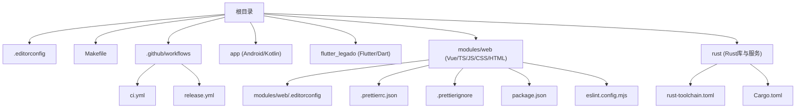
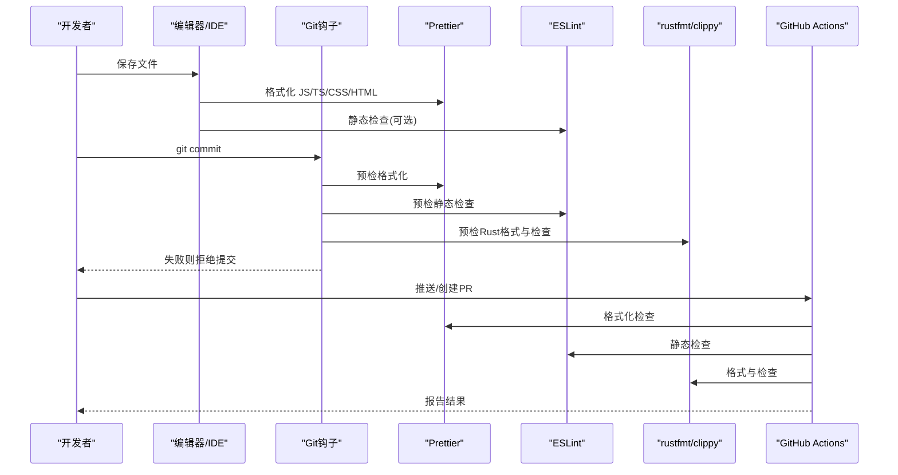
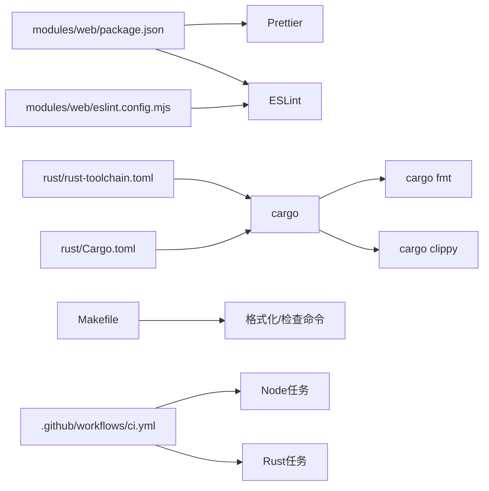

# 代码格式化工具

<cite>
**本文引用的文件**   
- [.editorconfig](file://.editorconfig)
- [modules/web/.editorconfig](file://modules/web/.editorconfig)
- [modules/web/.prettierrc.json](file://modules/web/.prettierrc.json)
- [modules/web/.prettierignore](file://modules/web/.prettierignore)
- [modules/web/package.json](file://modules/web/package.json)
- [modules/web/eslint.config.mjs](file://modules/web/eslint.config.mjs)
- [rust/rust-toolchain.toml](file://rust/rust-toolchain.toml)
- [rust/Cargo.toml](file://rust/Cargo.toml)
- [.github/workflows/ci.yml](file://.github/workflows/ci.yml)
- [.github/workflows/release.yml](file://.github/workflows/release.yml)
- [Makefile](file://Makefile)
</cite>

## 目录
1. [简介](#简介)
2. [项目结构](#项目结构)
3. [核心组件](#核心组件)
4. [架构总览](#架构总览)
5. [详细组件分析](#详细组件分析)
6. [依赖分析](#依赖分析)
7. [性能考虑](#性能考虑)
8. [故障排查指南](#故障排查指南)
9. [结论](#结论)
10. [附录](#附录)

## 简介
本规范旨在统一仓库内多语言、多模块的代码风格与质量检查流程，确保不同编辑器与IDE的一致性体验，并通过Git钩子与CI流水线在提交与合并前自动执行格式化与静态检查。覆盖范围包括：
- EditorConfig：跨编辑器的基础编码与缩进规则
- Prettier：JavaScript/TypeScript、CSS、HTML等前端文件的格式化
- Rust工具链：rustfmt、clippy的规则与集成
- Git钩子：提交前自动格式化与检查
- IDE集成：VS Code、Android Studio、IntelliJ IDEA的插件与设置
- CI/CD：GitHub Actions中的代码质量检查

## 项目结构
本项目为多技术栈混合工程，包含Android/Kotlin、Flutter/Dart、Rust以及Web前端（Vue+TS）等。各子模块各自维护其格式化与检查配置，根目录提供统一的EditorConfig与构建脚本，GitHub Actions负责CI流水线。

图表来源
- [.editorconfig](file://.editorconfig)
- [modules/web/.editorconfig](file://modules/web/.editorconfig)
- [modules/web/.prettierrc.json](file://modules/web/.prettierrc.json)
- [modules/web/.prettierignore](file://modules/web/.prettierignore)
- [modules/web/package.json](file://modules/web/package.json)
- [modules/web/eslint.config.mjs](file://modules/web/eslint.config.mjs)
- [rust/rust-toolchain.toml](file://rust/rust-toolchain.toml)
- [rust/Cargo.toml](file://rust/Cargo.toml)
- [.github/workflows/ci.yml](file://.github/workflows/ci.yml)
- [.github/workflows/release.yml](file://.github/workflows/release.yml)
- [Makefile](file://Makefile)

章节来源
- [.editorconfig](file://.editorconfig)
- [modules/web/.editorconfig](file://modules/web/.editorconfig)
- [modules/web/.prettierrc.json](file://modules/web/.prettierrc.json)
- [modules/web/.prettierignore](file://modules/web/.prettierignore)
- [modules/web/package.json](file://modules/web/package.json)
- [modules/web/eslint.config.mjs](file://modules/web/eslint.config.mjs)
- [rust/rust-toolchain.toml](file://rust/rust-toolchain.toml)
- [rust/Cargo.toml](file://rust/Cargo.toml)
- [.github/workflows/ci.yml](file://.github/workflows/ci.yml)
- [.github/workflows/release.yml](file://.github/workflows/release.yml)
- [Makefile](file://Makefile)

## 核心组件
- EditorConfig：定义全局编码、换行符、缩进、尾随空格等基础样式，保证跨编辑器一致性。
- Prettier：统一JS/TS、CSS、HTML等前端代码的格式化规则，支持忽略文件与扩展名匹配。
- Rust工具链：通过rust-toolchain锁定版本，配合cargo fmt与cargo clippy进行格式与静态检查。
- Git钩子：在提交前运行格式化与检查命令，阻止不合规代码进入分支。
- IDE集成：在各IDE中启用对应插件并加载仓库级配置，实现保存时自动格式化。
- CI/CD：在GitHub Actions中执行Prettier、ESLint、Rust格式化与检查，确保合并前质量。

章节来源
- [.editorconfig](file://.editorconfig)
- [modules/web/.prettierrc.json](file://modules/web/.prettierrc.json)
- [modules/web/.prettierignore](file://modules/web/.prettierignore)
- [modules/web/package.json](file://modules/web/package.json)
- [modules/web/eslint.config.mjs](file://modules/web/eslint.config.mjs)
- [rust/rust-toolchain.toml](file://rust/rust-toolchain.toml)
- [rust/Cargo.toml](file://rust/Cargo.toml)
- [.github/workflows/ci.yml](file://.github/workflows/ci.yml)

## 架构总览
下图展示了从开发者本地到CI流水线的完整质量保障链路：编辑器保存触发Prettier与ESLint；Git钩子在提交前再次校验；CI在推送与合并请求中重复检查。

图表来源
- [modules/web/.prettierrc.json](file://modules/web/.prettierrc.json)
- [modules/web/eslint.config.mjs](file://modules/web/eslint.config.mjs)
- [rust/rust-toolchain.toml](file://rust/rust-toolchain.toml)
- [.github/workflows/ci.yml](file://.github/workflows/ci.yml)

## 详细组件分析

### EditorConfig 配置规范
- 目标：统一编码、换行、缩进、尾随空格、行尾换行等基础样式，适用于所有编辑器与IDE。
- 建议规则要点：
  - charset 设为 utf-8
  - end_of_line lf
  - indent_style space
  - indent_size 与 tab_width 保持一致（常见为2或4）
  - trim_trailing_whitespace true
  - insert_final_newline true
  - 使用 root=true 声明根配置
- 多模块适配：
  - 根目录 .editorconfig 作为全局默认
  - modules/web 可保留独立 .editorconfig 以覆盖特定规则（如针对Vue/TS的额外偏好）

章节来源
- [.editorconfig](file://.editorconfig)
- [modules/web/.editorconfig](file://modules/web/.editorconfig)

### Prettier 配置与使用
- 配置文件：
  - modules/web/.prettierrc.json：集中管理JS/TS、CSS、HTML等语言的格式化规则
  - modules/web/.prettierignore：排除不需要格式化的文件与目录
- 关键规则建议：
  - printWidth、tabWidth、useTabs、semi、singleQuote、trailingComma、bracketSpacing、arrowParens、quoteProps、endOfLine、jsxSingleQuote、htmlWhitespaceSensitivity 等
  - 对CSS/SCSS/SASS、JSON、Markdown、YAML等启用相应解析器
- 使用方式：
  - 命令行：npx prettier --write "路径/**/*.{js,ts,css,html,json,md,yaml}"
  - 编辑器集成：安装Prettier插件，启用“保存时格式化”，选择项目Prettier实例
  - 与ESLint集成：避免冲突，优先由Prettier处理格式，ESLint专注语义规则

章节来源
- [modules/web/.prettierrc.json](file://modules/web/.prettierrc.json)
- [modules/web/.prettierignore](file://modules/web/.prettierignore)
- [modules/web/package.json](file://modules/web/package.json)

### Rust 工具链配置
- rust-toolchain.toml：锁定Rust版本与组件，确保团队一致环境
- Cargo.toml：定义包元数据与依赖，便于cargo fmt与cargo clippy运行
- 常用命令：
  - cargo fmt：按rustfmt规则格式化
  - cargo clippy：静态分析与建议修复
- 建议：
  - 在提交前运行 cargo fmt --check 与 cargo clippy --all-targets --all-features
  - 将rustfmt与clippy纳入Git钩子与CI

章节来源
- [rust/rust-toolchain.toml](file://rust/rust-toolchain.toml)
- [rust/Cargo.toml](file://rust/Cargo.toml)

### Git 钩子配置（提交前自动格式化与检查）
- 目标：在git commit阶段自动执行Prettier、ESLint、Rust格式化与检查，失败则阻止提交
- 推荐步骤：
  - 安装husky与lint-staged（Node.js环境）
  - 配置.husky/pre-commit钩子，调用lint-staged对不同文件类型执行对应命令
  - lint-staged规则示例：
    - *.js,*.ts,*.css,*.html -> npx prettier --write
    - *.js,*.ts -> npx eslint --fix
    - rust/**/* -> cargo fmt --check && cargo clippy --all-targets --all-features
  - 若仓库未包含.husky目录，可在本地初始化并添加钩子脚本

章节来源
- [modules/web/package.json](file://modules/web/package.json)
- [Makefile](file://Makefile)

### IDE 集成配置
- VS Code：
  - 安装插件：Prettier、ESLint、Rust Analyzer
  - 设置工作区：
    - editor.formatOnSave: true
    - editor.defaultFormatter: esbenp.prettier-vscode
    - [javascriptreact,typescript,css,html] 指定默认格式化器为Prettier
    - rust-analyzer.cargo.features: all
- Android Studio / IntelliJ IDEA：
  - Kotlin/Java：启用内置格式化与保存时格式化
  - 安装Prettier插件（如需），并指向项目根或modules/web下的Prettier配置
  - 导入EditorConfig支持（通常内置）
- Flutter：
  - 启用dart format与analysis选项（analysis_options.yaml）
  - 保存时自动格式化

章节来源
- [modules/web/.prettierrc.json](file://modules/web/.prettierrc.json)
- [modules/web/eslint.config.mjs](file://modules/web/eslint.config.mjs)
- [rust/rust-toolchain.toml](file://rust/rust-toolchain.toml)

### CI/CD 流水线中的代码质量检查
- GitHub Actions：
  - .github/workflows/ci.yml：定义构建、测试、格式化与检查任务
  - 典型步骤：
    - 设置Node.js与Rust环境
    - 安装依赖（pnpm/npm/yarn）
    - 运行Prettier检查（--check）
    - 运行ESLint检查
    - 运行cargo fmt --check与cargo clippy
- release.yml：发布相关任务，可复用质量检查步骤

章节来源
- [.github/workflows/ci.yml](file://.github/workflows/ci.yml)
- [.github/workflows/release.yml](file://.github/workflows/release.yml)

## 依赖分析
- 前端模块依赖：
  - package.json声明Prettier、ESLint及相关插件
  - eslint.config.mjs集中ESLint规则
- Rust模块依赖：
  - Cargo.toml声明依赖与特性
  - rust-toolchain.toml锁定工具链版本
- 构建与自动化：
  - Makefile封装常用命令（如格式化、检查、构建）
  - GitHub Actions串联Node与Rust任务

图表来源
- [modules/web/package.json](file://modules/web/package.json)
- [modules/web/eslint.config.mjs](file://modules/web/eslint.config.mjs)
- [rust/rust-toolchain.toml](file://rust/rust-toolchain.toml)
- [rust/Cargo.toml](file://rust/Cargo.toml)
- [Makefile](file://Makefile)
- [.github/workflows/ci.yml](file://.github/workflows/ci.yml)

章节来源
- [modules/web/package.json](file://modules/web/package.json)
- [modules/web/eslint.config.mjs](file://modules/web/eslint.config.mjs)
- [rust/rust-toolchain.toml](file://rust/rust-toolchain.toml)
- [rust/Cargo.toml](file://rust/Cargo.toml)
- [Makefile](file://Makefile)
- [.github/workflows/ci.yml](file://.github/workflows/ci.yml)

## 性能考虑
- 增量检查：使用lint-staged仅对变更文件执行Prettier与ESLint，减少耗时
- 并行化：在CI中将Node与Rust任务并行执行，缩短流水线时间
- 缓存：缓存node_modules与cargo registry，加速依赖安装与编译
- 选择性检查：对大型仓库可按模块启用检查，避免全量扫描

## 故障排查指南
- Prettier报错：
  - 确认已安装依赖且版本兼容
  - 检查.prettierrc.json语法与解析器配置
  - 使用npx prettier --check定位问题文件
- ESLint冲突：
  - 禁用ESLint的格式规则，交由Prettier处理
  - 确保.eslintrc或eslint.config.mjs正确引用Prettier插件
- Rust检查失败：
  - 使用cargo fmt --check与cargo clippy --message-format=json获取详细信息
  - 更新rust-toolchain.toml至团队共识版本
- Git钩子未生效：
  - 确认.husky目录与pre-commit脚本存在且可执行
  - 在Windows下注意换行符与权限问题

章节来源
- [modules/web/.prettierrc.json](file://modules/web/.prettierrc.json)
- [modules/web/eslint.config.mjs](file://modules/web/eslint.config.mjs)
- [rust/rust-toolchain.toml](file://rust/rust-toolchain.toml)
- [Makefile](file://Makefile)

## 结论
通过统一的EditorConfig、Prettier、Rust工具链、Git钩子与CI流水线，本项目实现了端到端的代码质量保障。建议在团队内推广该规范，并在新增模块时同步引入相应的格式化与检查配置，确保整体风格一致性与可维护性。

## 附录
- 快速上手清单：
  - 安装编辑器插件（Prettier、ESLint、Rust Analyzer）
  - 启用保存时格式化
  - 本地运行Prettier与ESLint检查
  - 安装Git钩子（husky + lint-staged）
  - 在CI中验证流水线通过