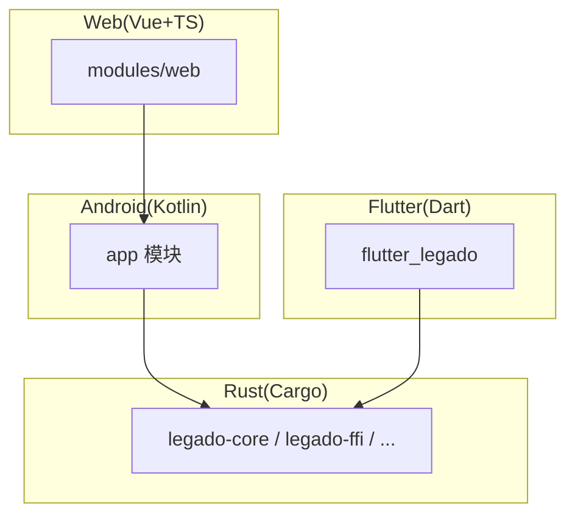
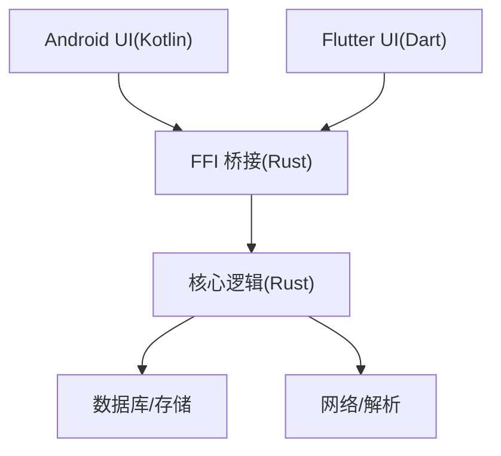
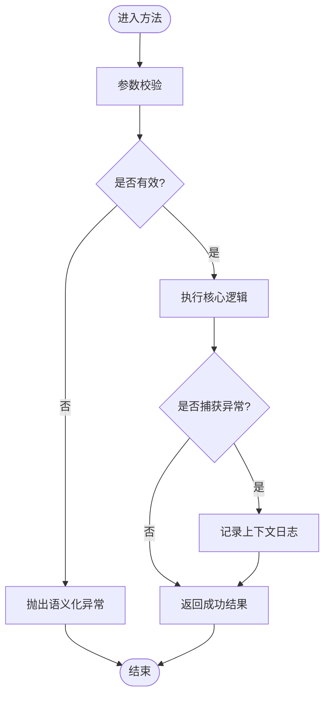
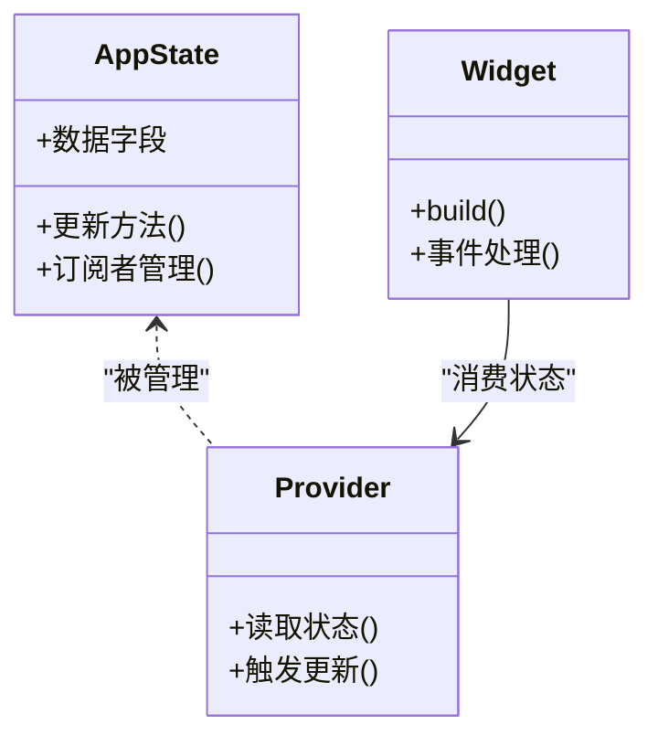
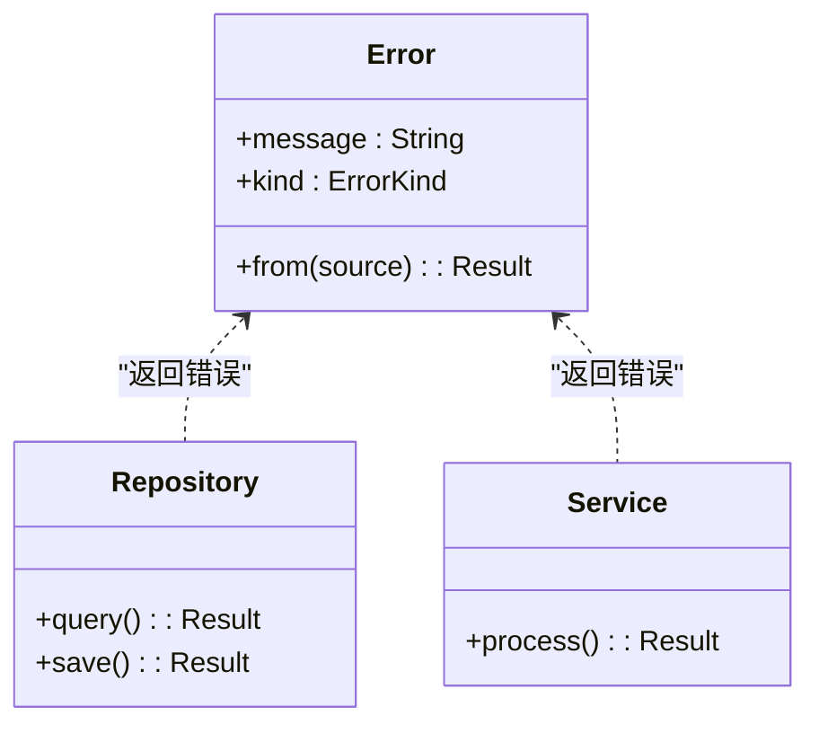
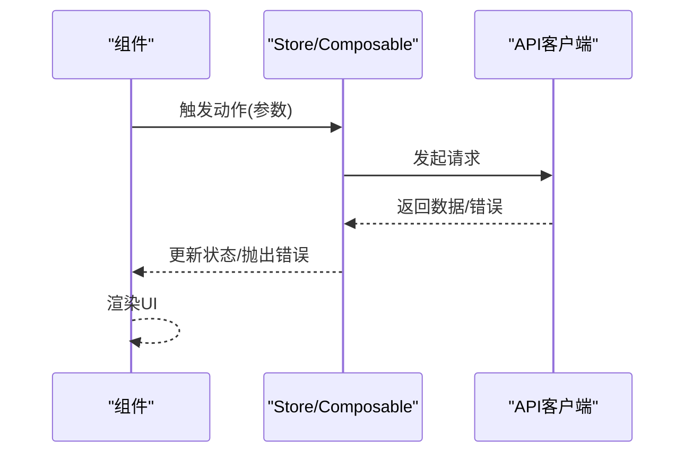
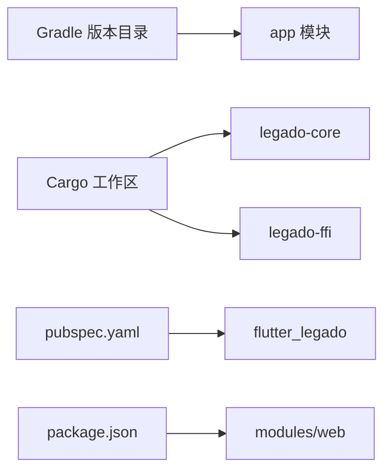

# 代码规范

<cite>
**本文引用的文件**   
- [app/build.gradle](file://app/build.gradle)
- [app/src/main/java/io/legado/app/App.kt](file://app/src/main/java/io/legado/app/App.kt)
- [app/src/main/java/io/legado/app/exception/ExceptionUtil.kt](file://app/src/main/java/io/legado/app/exception/ExceptionUtil.kt)
- [flutter_legado/analysis_options.yaml](file://flutter_legado/analysis_options.yaml)
- [flutter_legado/pubspec.yaml](file://flutter_legado/pubspec.yaml)
- [flutter_legado/lib/main.dart](file://flutter_legado/lib/main.dart)
- [modules/web/package.json](file://modules/web/package.json)
- [modules/web/eslint.config.mjs](file://modules/web/eslint.config.mjs)
- [modules/web/.prettierrc.json](file://modules/web/.prettierrc.json)
- [modules/web/tsconfig.app.json](file://modules/web/tsconfig.app.json)
- [rust/Cargo.toml](file://rust/Cargo.toml)
- [rust/legado-core/Cargo.toml](file://rust/legado-core/Cargo.toml)
- [rust/legado-core/src/error.rs](file://rust/legado-core/src/error.rs)
- [rust/legado-core/src/lib.rs](file://rust/legado-core/src/lib.rs)
- [rust/legado-ffi/src/lib.rs](file://rust/legado-ffi/src/lib.rs)
- [gradle/libs.versions.toml](file://gradle/libs.versions.toml)
</cite>

## 目录
1. [简介](#简介)
2. [项目结构](#项目结构)
3. [核心组件](#核心组件)
4. [架构总览](#架构总览)
5. [详细组件分析](#详细组件分析)
6. [依赖分析](#依赖分析)
7. [性能考虑](#性能考虑)
8. [故障排查指南](#故障排查指南)
9. [结论](#结论)
10. [附录](#附录)

## 简介
本规范面向Legado多语言、多模块工程，统一Kotlin（Android）、Dart/Flutter、Rust与JavaScript/TypeScript（Vue.js）的编码约定与最佳实践。目标包括：
- 命名约定、文件组织、注释标准、异常处理
- Flutter状态管理、组件设计原则
- Rust模块组织、错误处理、性能与安全
- Vue.js组件开发、API调用、状态管理
- 统一的代码检查与格式化配置，保障团队一致性

## 项目结构
Legado采用多模块、多语言协作：
- Android/Kotlin主应用位于 app 模块
- Flutter跨端界面位于 flutter_legado
- Web前端位于 modules/web（Vue3 + TypeScript）
- 高性能核心与FFI桥接位于 rust（Cargo工作区）
- Gradle版本目录集中管理依赖版本

**图表来源** 
- [app/build.gradle](file://app/build.gradle)
- [flutter_legado/pubspec.yaml](file://flutter_legado/pubspec.yaml)
- [modules/web/package.json](file://modules/web/package.json)
- [rust/Cargo.toml](file://rust/Cargo.toml)

**章节来源**
- [app/build.gradle](file://app/build.gradle)
- [flutter_legado/pubspec.yaml](file://flutter_legado/pubspec.yaml)
- [modules/web/package.json](file://modules/web/package.json)
- [rust/Cargo.toml](file://rust/Cargo.toml)

## 核心组件
- Kotlin（Android）
  - 入口与应用初始化：参考 [App.kt](file://app/src/main/java/io/legado/app/App.kt)
  - 异常工具与统一处理：参考 [ExceptionUtil.kt](file://app/src/main/java/io/legado/app/exception/ExceptionUtil.kt)
- Flutter（Dart）
  - 应用入口与插件注册：参考 [main.dart](file://flutter_legado/lib/main.dart)
  - 静态分析与规则：参考 [analysis_options.yaml](file://flutter_legado/analysis_options.yaml)、[pubspec.yaml](file://flutter_legado/pubspec.yaml)
- Web（Vue3 + TS）
  - 构建与依赖：参考 [package.json](file://modules/web/package.json)
  - ESLint规则：参考 [eslint.config.mjs](file://modules/web/eslint.config.mjs)
  - Prettier格式化：参考 [.prettierrc.json](file://modules/web/.prettierrc.json)
  - TS编译选项：参考 [tsconfig.app.json](file://modules/web/tsconfig.app.json)
- Rust（Cargo工作区）
  - 顶层工作区与包：参考 [Cargo.toml](file://rust/Cargo.toml)、[legado-core/Cargo.toml](file://rust/legado-core/Cargo.toml)
  - 错误模型与类型：参考 [error.rs](file://rust/legado-core/src/error.rs)
  - 库入口与导出：参考 [lib.rs](file://rust/legado-core/src/lib.rs)
  - FFI桥接入口：参考 [lib.rs](file://rust/legado-ffi/src/lib.rs)

**章节来源**
- [app/src/main/java/io/legado/app/App.kt](file://app/src/main/java/io/legado/app/App.kt)
- [app/src/main/java/io/legado/app/exception/ExceptionUtil.kt](file://app/src/main/java/io/legado/app/exception/ExceptionUtil.kt)
- [flutter_legado/lib/main.dart](file://flutter_legado/lib/main.dart)
- [flutter_legado/analysis_options.yaml](file://flutter_legado/analysis_options.yaml)
- [flutter_legado/pubspec.yaml](file://flutter_legado/pubspec.yaml)
- [modules/web/package.json](file://modules/web/package.json)
- [modules/web/eslint.config.mjs](file://modules/web/eslint.config.mjs)
- [modules/web/.prettierrc.json](file://modules/web/.prettierrc.json)
- [modules/web/tsconfig.app.json](file://modules/web/tsconfig.app.json)
- [rust/Cargo.toml](file://rust/Cargo.toml)
- [rust/legado-core/Cargo.toml](file://rust/legado-core/Cargo.toml)
- [rust/legado-core/src/error.rs](file://rust/legado-core/src/error.rs)
- [rust/legado-core/src/lib.rs](file://rust/legado-core/src/lib.rs)
- [rust/legado-ffi/src/lib.rs](file://rust/legado-ffi/src/lib.rs)

## 架构总览
Legado通过Rust提供高性能核心能力，Android与Flutter通过FFI调用；Web层通过Android API或本地服务交互。

**图表来源** 
- [rust/legado-ffi/src/lib.rs](file://rust/legado-ffi/src/lib.rs)
- [rust/legado-core/src/lib.rs](file://rust/legado-core/src/lib.rs)

## 详细组件分析

### Kotlin（Android）编码规范
- 命名约定
  - 类名使用大驼峰；常量全大写加下划线；函数与变量小驼峰；包名全小写
  - 单例对象使用 object 关键字，避免滥用全局状态
- 文件结构
  - 按功能域分包：ui、model、service、utils、exception、data等
  - 每个文件职责单一，优先拆分大文件
- 注释标准
  - 公开API必须包含KDoc：@param、@return、@throws
  - 复杂业务逻辑在关键分支添加行内注释说明意图
- 异常处理
  - 使用受检/非受检异常明确边界，对外暴露语义化异常类型
  - 统一异常转换与日志记录，避免吞异常
  - 参考实现位置：[ExceptionUtil.kt](file://app/src/main/java/io/legado/app/exception/ExceptionUtil.kt)
- 协程与并发
  - 使用结构化并发，指定合适的调度器（IO/Main/Default）
  - 避免在UI线程执行阻塞操作，使用异步流与取消机制
- 示例入口
  - 应用初始化与依赖注入参考：[App.kt](file://app/src/main/java/io/legado/app/App.kt)

**图表来源** 
- [app/src/main/java/io/legado/app/exception/ExceptionUtil.kt](file://app/src/main/java/io/legado/app/exception/ExceptionUtil.kt)

**章节来源**
- [app/src/main/java/io/legado/app/App.kt](file://app/src/main/java/io/legado/app/App.kt)
- [app/src/main/java/io/legado/app/exception/ExceptionUtil.kt](file://app/src/main/java/io/legado/app/exception/ExceptionUtil.kt)

### Dart/Flutter（Dart）风格指南
- 文件组织
  - lib 下按功能划分：src、pages、widgets、services、models、providers
  - 每个文件单一职责，避免巨型文件
- 命名约定
  - 类/枚举/扩展名大驼峰；文件与包小写下划线；常量全大写
- 状态管理模式
  - 推荐使用Provider/Riverpod/Bloc之一并保持一致
  - 将业务逻辑下沉至Service/Repository，UI仅负责展示与交互
- 组件设计原则
  - 无状态优先，必要时使用有状态组件
  - 组件粒度适中，复用性高，避免深层嵌套
- 静态分析与规则
  - 参考 [analysis_options.yaml](file://flutter_legado/analysis_options.yaml) 启用严格模式
  - 依赖管理与插件声明参考 [pubspec.yaml](file://flutter_legado/pubspec.yaml)
- 入口与启动
  - 应用入口参考 [main.dart](file://flutter_legado/lib/main.dart)

**图表来源** 
- [flutter_legado/lib/main.dart](file://flutter_legado/lib/main.dart)
- [flutter_legado/analysis_options.yaml](file://flutter_legado/analysis_options.yaml)
- [flutter_legado/pubspec.yaml](file://flutter_legado/pubspec.yaml)

**章节来源**
- [flutter_legado/lib/main.dart](file://flutter_legado/lib/main.dart)
- [flutter_legado/analysis_options.yaml](file://flutter_legado/analysis_options.yaml)
- [flutter_legado/pubspec.yaml](file://flutter_legado/pubspec.yaml)

### Rust编程约定
- 模块组织
  - 按功能划分crate：core、ffi、net、parser、db等
  - 公共API通过lib.rs导出，内部模块私有化
- 错误处理
  - 使用Result/thiserror定义领域错误类型，避免panic
  - 错误信息需包含上下文与可恢复策略
  - 参考实现位置：[error.rs](file://rust/legado-core/src/error.rs)
- 性能优化
  - 避免不必要的克隆与分配，使用引用与零拷贝
  - I/O与CPU密集任务分离，合理并行化
- 安全考虑
  - 遵循Rust所有权与借用规则，避免未定义行为
  - 对外暴露的FFI接口进行输入校验与边界检查
- 入口与导出
  - 核心库入口参考：[lib.rs](file://rust/legado-core/src/lib.rs)
  - FFI桥接入口参考：[lib.rs](file://rust/legado-ffi/src/lib.rs)

**图表来源** 
- [rust/legado-core/src/error.rs](file://rust/legado-core/src/error.rs)
- [rust/legado-core/src/lib.rs](file://rust/legado-core/src/lib.rs)
- [rust/legado-ffi/src/lib.rs](file://rust/legado-ffi/src/lib.rs)

**章节来源**
- [rust/Cargo.toml](file://rust/Cargo.toml)
- [rust/legado-core/Cargo.toml](file://rust/legado-core/Cargo.toml)
- [rust/legado-core/src/error.rs](file://rust/legado-core/src/error.rs)
- [rust/legado-core/src/lib.rs](file://rust/legado-core/src/lib.rs)
- [rust/legado-ffi/src/lib.rs](file://rust/legado-ffi/src/lib.rs)

### JavaScript/TypeScript（Vue.js）代码规范
- 组件开发
  - 使用Composition API，逻辑复用通过composables
  - 组件命名PascalCase，文件与组件名一致
- API调用
  - 统一封装HTTP客户端，集中处理错误与重试
  - 请求拦截与响应拦截用于鉴权与缓存
- 状态管理
  - 使用Pinia管理全局状态，避免过度分散
  - 将副作用与数据获取放入actions/composables
- 代码检查与格式化
  - ESLint规则参考：[eslint.config.mjs](file://modules/web/eslint.config.mjs)
  - Prettier格式化参考：[.prettierrc.json](file://modules/web/.prettierrc.json)
  - TS编译选项参考：[tsconfig.app.json](file://modules/web/tsconfig.app.json)
  - 依赖与脚本参考：[package.json](file://modules/web/package.json)

**图表来源** 
- [modules/web/eslint.config.mjs](file://modules/web/eslint.config.mjs)
- [modules/web/.prettierrc.json](file://modules/web/.prettierrc.json)
- [modules/web/tsconfig.app.json](file://modules/web/tsconfig.app.json)
- [modules/web/package.json](file://modules/web/package.json)

**章节来源**
- [modules/web/package.json](file://modules/web/package.json)
- [modules/web/eslint.config.mjs](file://modules/web/eslint.config.mjs)
- [modules/web/.prettierrc.json](file://modules/web/.prettierrc.json)
- [modules/web/tsconfig.app.json](file://modules/web/tsconfig.app.json)

## 依赖分析
- Gradle版本目录统一管理Android与Kotlin依赖版本
- Cargo工作区管理Rust各crate依赖与特性
- Flutter与Web分别通过pub与pnpm管理依赖

**图表来源** 
- [gradle/libs.versions.toml](file://gradle/libs.versions.toml)
- [rust/Cargo.toml](file://rust/Cargo.toml)
- [flutter_legado/pubspec.yaml](file://flutter_legado/pubspec.yaml)
- [modules/web/package.json](file://modules/web/package.json)

**章节来源**
- [gradle/libs.versions.toml](file://gradle/libs.versions.toml)
- [rust/Cargo.toml](file://rust/Cargo.toml)
- [flutter_legado/pubspec.yaml](file://flutter_legado/pubspec.yaml)
- [modules/web/package.json](file://modules/web/package.json)

## 性能考虑
- Kotlin
  - 减少主线程阻塞，合理使用协程与缓存
  - 避免频繁创建对象，使用对象池与复用
- Flutter
  - 使用const构造与不可变数据提升渲染性能
  - 避免重建不必要的Widget，合理使用Provider选择器
- Rust
  - 使用零拷贝解析与内存映射，减少GC压力
  - 合理并行与批处理，避免锁竞争
- Web
  - 懒加载与代码分割，减少首屏体积
  - 使用虚拟滚动与分页加载大数据列表

## 故障排查指南
- Kotlin
  - 统一异常日志输出，包含堆栈与上下文
  - 使用崩溃上报与远程日志定位问题
- Flutter
  - 开启调试模式打印Widget树与状态变化
  - 使用DevTools分析性能与内存泄漏
- Rust
  - 使用tracing/logging记录关键路径
  - 通过单元测试与集成测试覆盖边界条件
- Web
  - 使用浏览器开发者工具与Network面板排查API问题
  - 通过ESLint与Prettier提前发现语法与风格问题

**章节来源**
- [app/src/main/java/io/legado/app/exception/ExceptionUtil.kt](file://app/src/main/java/io/legado/app/exception/ExceptionUtil.kt)
- [flutter_legado/analysis_options.yaml](file://flutter_legado/analysis_options.yaml)
- [modules/web/eslint.config.mjs](file://modules/web/eslint.config.mjs)
- [modules/web/.prettierrc.json](file://modules/web/.prettierrc.json)

## 结论
本规范为Legado多语言工程提供了统一的编码约定与最佳实践，涵盖命名、结构、注释、异常、状态管理、性能与安全等方面。通过统一的检查与格式化配置，确保团队协作效率与代码质量。建议在新功能开发与重构中持续遵循本规范，并结合CI自动化检查与测试保障交付质量。

## 附录
- 推荐工具链
  - Kotlin/Android：Ktlint、Detekt、KDoc
  - Flutter/Dart：dart analyze、flutter test
  - Rust：clippy、cargo test、tracing
  - Web：ESLint、Prettier、Vitest
- 常用命令
  - Flutter：flutter analyze、flutter test
  - Rust：cargo clippy、cargo test
  - Web：pnpm lint、pnpm format、pnpm test