# 开发指南

<cite>
**本文档引用的文件**   
- [README.md](file://README.md)
- [Makefile](file://Makefile)
- [package.json](file://package.json)
- [gradle.properties](file://gradle.properties)
- [settings.gradle](file://settings.gradle)
- [build.gradle](file://build.gradle)
- [app/build.gradle](file://app/build.gradle)
- [flutter_legado/pubspec.yaml](file://flutter_legado/pubspec.yaml)
- [flutter_legado/analysis_options.yaml](file://flutter_legado/analysis_options.yaml)
- [flutter_legado/flutter_rust_bridge.yaml](file://flutter_legado/flutter_rust_bridge.yaml)
- [rust/Cargo.toml](file://rust/Cargo.toml)
- [rust/rust-toolchain.toml](file://rust/rust-toolchain.toml)
- [rust/.cargo/config.toml](file://rust/.cargo/config.toml)
- [rust/DEVELOPMENT.md](file://rust/DEVELOPMENT.md)
- [rust/MIGRATION_WORKFLOW.md](file://rust/MIGRATION_WORKFLOW.md)
- [rust/PROGRESS.md](file://rust/PROGRESS.md)
- [modules/web/package.json](file://modules/web/package.json)
- [modules/web/eslint.config.mjs](file://modules/web/eslint.config.mjs)
- [modules/web/.prettierrc.json](file://modules/web/.prettierrc.json)
- [app/src/main/java/io/legado/app/App.kt](file://app/src/main/java/io/legado/app/App.kt)
- [app/src/androidTest/java/io/legado/app/AndroidJsTest.kt](file://app/src/androidTest/java/io/legado/app/AndroidJsTest.kt)
- [app/src/test/java/io/legado/app/ExampleUnitTest.kt](file://app/src/test/java/io/legado/app/ExampleUnitTest.kt)
- [flutter_legado/lib/main.dart](file://flutter_legado/lib/main.dart)
- [flutter_legado/lib/app.dart](file://flutter_legado/lib/app.dart)
- [flutter_legado/test/unit/bookshelf_provider_test.dart](file://flutter_legado/test/unit/bookshelf_provider_test.dart)
- [flutter_legado/test/widget/badge_widget_test.dart](file://flutter_legado/test/widget/badge_widget_test.dart)
- [UI_COMPARISON_REPORT.md](file://UI_COMPARISON_REPORT.md)
- [UI_FIX_PLAN.md](file://UI_FIX_PLAN.md)
- [REFACTORING_AUDIT_REPORT_20260806.md](file://REFACTORING_AUDIT_REPORT_20260806.md)
- [AUDIT_FIX_ASSIGNMENT.md](file://AUDIT_FIX_ASSIGNMENT.md)
- [.agents/skills/dart-add-unit-test/SKILL.md](file://.agents/skills/dart-add-unit-test/SKILL.md)
- [.agents/skills/flutter-add-integration-test/SKILL.md](file://.agents/skills/flutter-add-integration-test/SKILL.md)
- [.agents/skills/dart-setup-ffi-assets/SKILL.md](file://.agents/skills/dart-setup-ffi-assets/SKILL.md)
- [.agents/skills/flutter-mcp/SKILL.md](file://.agents/skills/flutter-mcp/SKILL.md)
- [.agents/skills/gitnexus-guide/SKILL.md](file://.agents/skills/gitnexus-guide/SKILL.md)
- [.agents/skills/harness-engineering-lifecycle/SKILL.md](file://.agents/skills/harness-engineering-lifecycle/SKILL.md)
- [skills-lock.json](file://skills-lock.json)
- [gradle/libs.versions.toml](file://gradle/libs.versions.toml)
- [flutter_legado/.gitignore](file://flutter_legado/.gitignore)
- [flutter_legado/scripts/generate-bridge.sh](file://flutter_legado/scripts/generate-bridge.sh)
- [flutter_legado/scripts/generate-bridge.ps1](file://flutter_legado/scripts/generate-bridge.ps1)
- [flutter_legado/Makefile](file://flutter_legado/Makefile)
- [rust/legado-ffi/src/frb_generated.rs](file://rust/legado-ffi/src/frb_generated.rs)
</cite>

## 更新摘要
**所做更改**
- 增强了Flutter Rust Bridge代码生成要求，明确警告生成的文件是git忽略的
- 更新了拉取包含新FFI绑定的提交后的重新生成流程说明
- 完善了构建脚本和Makefile中的代码生成与DLL同步机制
- 添加了详细的故障排查指南，防止因缺少生成的绑定而导致的构建失败

## 目录
1. [简介](#简介)
2. [项目结构](#项目结构)
3. [核心组件](#核心组件)
4. [架构总览](#架构总览)
5. [详细组件分析](#详细组件分析)
6. [依赖关系分析](#依赖关系分析)
7. [性能考量](#性能考量)
8. [数据库迁移工作流](#数据库迁移工作流)
9. [项目进度跟踪](#项目进度跟踪)
10. [重构综合审计报告](#重构综合审计报告)
11. [UI界面差异分析](#ui界面差异分析)
12. [UI改进计划](#ui改进计划)
13. [Agent技能集合](#agent技能集合)
14. [故障排查指南](#故障排查指南)
15. [结论](#结论)
16. [附录](#附录)

## 简介
本指南面向Legado项目的开发者，覆盖从环境搭建、代码规范、调试技巧、模块组织、测试策略到协作流程的全链路开发实践。项目采用多语言、多平台混合架构：Android原生（Kotlin）、Flutter跨平台界面、Rust高性能核心与FFI桥接、以及Web管理端（Vue/TS）。通过统一的工作流与工具链，确保高质量交付与高效协作。

**更新** 新增了完整的平台特定API支持说明和编译验证流程，包括最新的Android构建系统配置、Flutter工具链版本要求和Rust交叉编译设置，为开发者提供准确的环境搭建指导。特别强调了Flutter Rust Bridge代码生成的重要性和正确的操作流程。

## 项目结构
仓库采用多模块、多语言工程组织方式：
- app：Android应用主模块（Kotlin/Gradle）
- flutter_legado：Flutter跨平台UI层（Dart/Flutter）
- rust：Rust核心库与FFI桥接（Cargo多crate）
- modules/web：Web管理端（Vite/Vue/TypeScript）
- .agents/skills：Agent技能集合（SKILL.md文档）
- gradle、Makefile、package.json等顶层构建脚本与配置

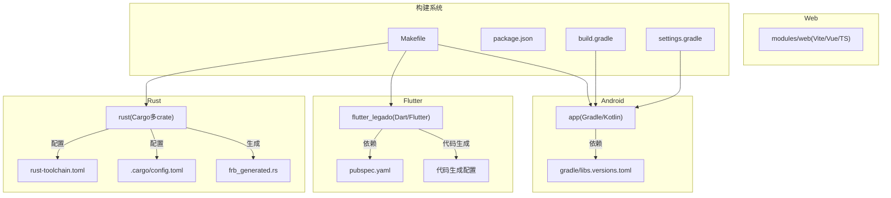

图表来源
- [settings.gradle](file://settings.gradle)
- [build.gradle](file://build.gradle)
- [app/build.gradle](file://app/build.gradle)
- [flutter_legado/pubspec.yaml](file://flutter_legado/pubspec.yaml)
- [flutter_legado/flutter_rust_bridge.yaml](file://flutter_legado/flutter_rust_bridge.yaml)
- [rust/Cargo.toml](file://rust/Cargo.toml)
- [rust/rust-toolchain.toml](file://rust/rust-toolchain.toml)
- [rust/.cargo/config.toml](file://rust/.cargo/config.toml)
- [rust/legado-ffi/src/frb_generated.rs](file://rust/legado-ffi/src/frb_generated.rs)
- [gradle/libs.versions.toml](file://gradle/libs.versions.toml)
- [Makefile](file://Makefile)
- [package.json](file://package.json)

章节来源
- [README.md](file://README.md)
- [Makefile](file://Makefile)
- [package.json](file://package.json)
- [settings.gradle](file://settings.gradle)
- [build.gradle](file://build.gradle)
- [app/build.gradle](file://app/build.gradle)
- [flutter_legado/pubspec.yaml](file://flutter_legado/pubspec.yaml)
- [rust/Cargo.toml](file://rust/Cargo.toml)
- [rust/rust-toolchain.toml](file://rust/rust-toolchain.toml)
- [rust/.cargo/config.toml](file://rust/.cargo/config.toml)
- [gradle/libs.versions.toml](file://gradle/libs.versions.toml)

## 核心组件
- Android应用入口与初始化：App.kt作为应用启动与全局初始化点，负责依赖注入、网络、数据库、服务注册等。
- Flutter应用入口：main.dart与app.dart定义应用生命周期、路由与主题。
- Rust核心：多crate划分清晰，包含book解析、core业务逻辑、db持久化、ffi桥接、net网络、parser规则解析与server服务等。
- Web管理端：基于Vite+Vue的源码编辑、书架管理与调试工具。
- Agent技能系统：提供标准化的开发指导和最佳实践。

**更新** 新增了平台特定API支持说明，包括Android NDK交叉编译配置、Flutter FFI桥接机制和Rust多目标构建支持，确保跨平台开发的稳定性和兼容性。特别强调了Flutter Rust Bridge代码生成的重要性。

章节来源
- [app/src/main/java/io/legado/app/App.kt](file://app/src/main/java/io/legado/app/App.kt)
- [flutter_legado/lib/main.dart](file://flutter_legado/lib/main.dart)
- [flutter_legado/lib/app.dart](file://flutter_legado/lib/app.dart)
- [rust/Cargo.toml](file://rust/Cargo.toml)
- [flutter_legado/flutter_rust_bridge.yaml](file://flutter_legado/flutter_rust_bridge.yaml)
- [rust/.cargo/config.toml](file://rust/.cargo/config.toml)

## 架构总览
整体架构遵循"前端UI + 中间层桥接 + 高性能核心 + 智能辅助"的分层模式：
- UI层：Android原生与Flutter双通道，提供一致的阅读体验与管理界面
- 桥接层：Flutter Rust Bridge与Android NDK/FFI将Rust能力暴露给上层
- 核心层：Rust实现高并发、高性能的数据处理、网络请求、规则解析与本地存储
- 服务端：内置HTTP/WebSocket服务，供Web端与外部集成
- 智能辅助层：Agent技能系统提供开发指导和最佳实践
- 质量保障层：综合审计系统与测试框架确保代码质量

**更新** 架构中新增了平台特定API支持层，包括Android NDK配置、Flutter FFI生成和Rust交叉编译支持，确保多平台构建的一致性和可靠性。特别强化了代码生成流程的完整性检查。

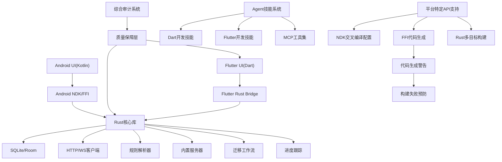

图表来源
- [flutter_legado/flutter_rust_bridge.yaml](file://flutter_legado/flutter_rust_bridge.yaml)
- [rust/.cargo/config.toml](file://rust/.cargo/config.toml)
- [rust/rust-toolchain.toml](file://rust/rust-toolchain.toml)
- [app/build.gradle](file://app/build.gradle)
- [rust/Cargo.toml](file://rust/Cargo.toml)
- [rust/DEVELOPMENT.md](file://rust/DEVELOPMENT.md)

## 详细组件分析

### Android应用组件
- 应用初始化：在App.kt中完成全局配置、日志、网络、数据库、权限与服务注册
- 模块化组织：按功能分包（api、base、constant、data、help、lib、model、receiver、service、ui、utils、web）
- 资源管理：res下按类型与维度组织布局、样式、图片与国际化资源
- 构建配置：使用最新的AGP 8.13.2和Kotlin 2.4.10，支持Java 17编译

**更新** Android构建系统已升级到最新版本，包括新的AGP版本、KSP插件和依赖版本管理，提供更好的构建性能和兼容性。

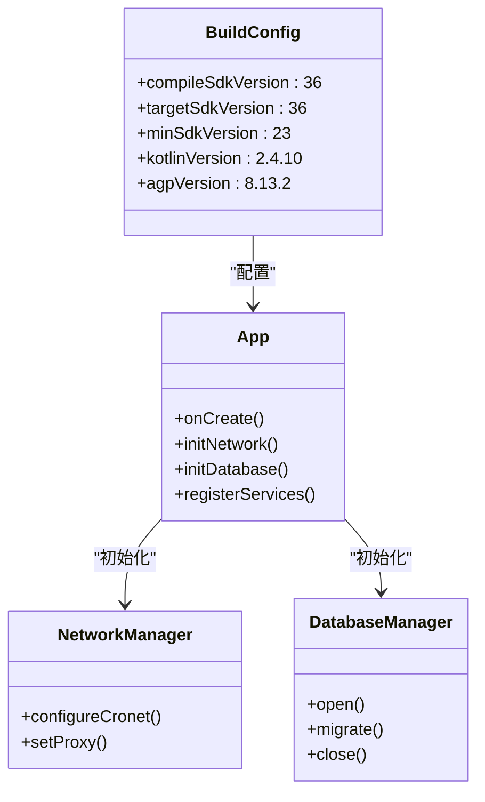

图表来源
- [app/src/main/java/io/legado/app/App.kt](file://app/src/main/java/io/legado/app/App.kt)
- [app/build.gradle](file://app/build.gradle)
- [gradle/libs.versions.toml](file://gradle/libs.versions.toml)

章节来源
- [app/src/main/java/io/legado/app/App.kt](file://app/src/main/java/io/legado/app/App.kt)
- [app/build.gradle](file://app/build.gradle)
- [gradle/libs.versions.toml](file://gradle/libs.versions.toml)

### Flutter应用组件
- 入口与路由：main.dart启动应用，app.dart定义主题、路由与状态管理
- 插件与桥接：通过flutter_rust_bridge.yaml生成桥接代码，调用Rust核心能力
- 测试分层：unit与widget测试覆盖核心Provider与UI组件
- 版本要求：Dart SDK >=3.8.0 <4.0.0，Flutter框架最新稳定版

**更新** Flutter项目已更新到最新的依赖版本，包括flutter_rust_bridge 2.11.1、riverpod 2.5.0等关键依赖，提供更好的性能和稳定性。特别强调了代码生成流程的重要性。

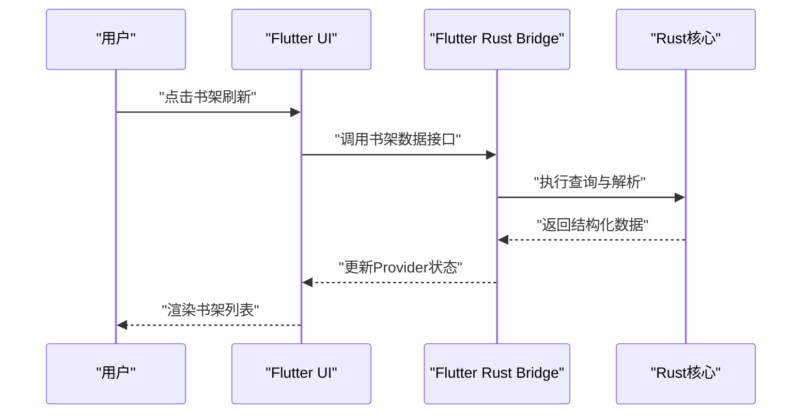

图表来源
- [flutter_legado/lib/main.dart](file://flutter_legado/lib/main.dart)
- [flutter_legado/lib/app.dart](file://flutter_legado/lib/app.dart)
- [flutter_legado/flutter_rust_bridge.yaml](file://flutter_legado/flutter_rust_bridge.yaml)
- [flutter_legado/pubspec.yaml](file://flutter_legado/pubspec.yaml)

章节来源
- [flutter_legado/lib/main.dart](file://flutter_legado/lib/main.dart)
- [flutter_legado/lib/app.dart](file://flutter_legado/lib/app.dart)
- [flutter_legado/flutter_rust_bridge.yaml](file://flutter_legado/flutter_rust_bridge.yaml)
- [flutter_legado/pubspec.yaml](file://flutter_legado/pubspec.yaml)

### Rust核心组件
- 多crate设计：legado-core（业务逻辑）、legado-db（数据访问）、legado-ffi（FFI导出）、legado-net（网络）、legado-parser（规则解析）、legado-server（HTTP服务）、legado-book（电子书格式支持）
- 工具链配置：rust-toolchain.toml锁定版本1.97.1，Cargo.toml管理依赖与特性开关
- 开发文档：DEVELOPMENT.md提供构建、调试与发布指引
- 交叉编译：支持Android多架构（arm64-v8a、armeabi-v7a、x86_64）和iOS目标

**更新** Rust工具链已升级到1.97.1版本，NDK交叉编译配置已优化，支持最新的Android API级别和多架构构建。特别加强了代码生成文件的处理和content hash同步机制。

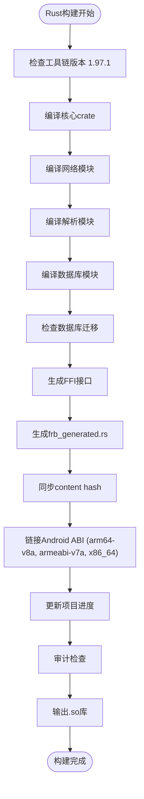

图表来源
- [rust/rust-toolchain.toml](file://rust/rust-toolchain.toml)
- [rust/Cargo.toml](file://rust/Cargo.toml)
- [rust/.cargo/config.toml](file://rust/.cargo/config.toml)
- [rust/DEVELOPMENT.md](file://rust/DEVELOPMENT.md)
- [rust/legado-ffi/src/frb_generated.rs](file://rust/legado-ffi/src/frb_generated.rs)

章节来源
- [rust/Cargo.toml](file://rust/Cargo.toml)
- [rust/rust-toolchain.toml](file://rust/rust-toolchain.toml)
- [rust/.cargo/config.toml](file://rust/.cargo/config.toml)
- [rust/DEVELOPMENT.md](file://rust/DEVELOPMENT.md)

### Web管理端组件
- 技术栈：Vite + Vue 3 + TypeScript，使用ESLint与Prettier保证代码质量
- 功能模块：书架管理、源码编辑、调试面板、API调用封装
- 构建脚本：package.json定义开发与生产构建命令

图表来源
- [modules/web/package.json](file://modules/web/package.json)
- [modules/web/eslint.config.mjs](file://modules/web/eslint.config.mjs)
- [modules/web/.prettierrc.json](file://modules/web/.prettierrc.json)

章节来源
- [modules/web/package.json](file://modules/web/package.json)
- [modules/web/eslint.config.mjs](file://modules/web/eslint.config.mjs)
- [modules/web/.prettierrc.json](file://modules/web/.prettierrc.json)

## 依赖关系分析
项目依赖关系呈现清晰的层次结构：
- Android模块依赖Gradle插件与第三方库，使用libs.versions.toml统一管理版本
- Flutter模块依赖Dart SDK与Flutter框架，通过bridge.yaml生成Rust绑定
- Rust模块通过Cargo管理内部crate依赖与外部crate，使用workspace.dependencies共享依赖
- Web模块通过npm/pnpm管理前端依赖
- Agent技能系统通过skills-lock.json管理技能依赖

**更新** 依赖管理系统已全面升级，包括AndroidX库的最新版本、Flutter依赖的更新和Rust crate的版本锁定，确保构建的稳定性和可重复性。特别加强了Flutter Rust Bridge代码生成的依赖管理。

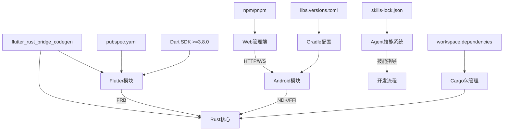

图表来源
- [gradle/libs.versions.toml](file://gradle/libs.versions.toml)
- [settings.gradle](file://settings.gradle)
- [build.gradle](file://build.gradle)
- [flutter_legado/pubspec.yaml](file://flutter_legado/pubspec.yaml)
- [rust/Cargo.toml](file://rust/Cargo.toml)
- [package.json](file://package.json)
- [skills-lock.json](file://skills-lock.json)
- [flutter_legado/flutter_rust_bridge.yaml](file://flutter_legado/flutter_rust_bridge.yaml)

章节来源
- [gradle/libs.versions.toml](file://gradle/libs.versions.toml)
- [settings.gradle](file://settings.gradle)
- [build.gradle](file://build.gradle)
- [flutter_legado/pubspec.yaml](file://flutter_legado/pubspec.yaml)
- [rust/Cargo.toml](file://rust/Cargo.toml)
- [package.json](file://package.json)
- [skills-lock.json](file://skills-lock.json)

## 性能考量
- Rust核心：利用零成本抽象与异步IO提升数据处理与网络请求性能
- Flutter UI：合理使用Provider状态管理，避免不必要的重建
- Android优化：启用R8混淆与资源压缩，减少APK体积
- 缓存策略：本地SQLite与内存缓存结合，降低重复计算开销
- 网络优化：连接池、重试机制与超时控制
- 数据库优化：增量迁移和批量操作提升数据更新效率
- Agent技能优化：智能指导减少开发错误和提升代码质量
- 审计优化：自动化审计减少人工检查时间和错误率

**更新** 新增平台特定性能优化，包括Android NDK原生库优化、Flutter FFI调用优化和Rust交叉编译优化，进一步提升多平台应用的运行性能。特别优化了代码生成流程的性能，减少了不必要的重新编译。

## 数据库迁移工作流

**新增** Legado项目现在提供了完整的数据库迁移工作流，确保数据结构的版本控制和向后兼容性。

### 迁移流程概述
数据库迁移工作流基于MIGRATION_WORKFLOW.md文档，提供了标准化的数据库版本管理流程：

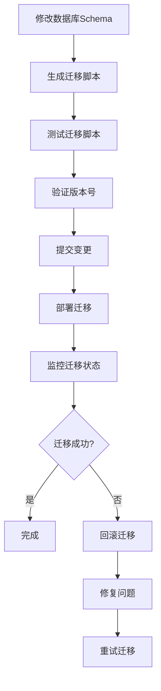

图表来源
- [rust/MIGRATION_WORKFLOW.md](file://rust/MIGRATION_WORKFLOW.md)

### 迁移步骤详解
1. **Schema修改**：在Rust代码中修改数据库模型定义
2. **迁移脚本生成**：使用自动化工具生成对应的SQL迁移脚本
3. **版本管理**：确保迁移脚本的版本号正确递增
4. **测试验证**：在测试环境中验证迁移脚本的正确性
5. **部署流程**：按照标准流程部署到生产环境

### 最佳实践
- 始终向前兼容：新版本的迁移脚本必须能够处理旧版本数据
- 原子性操作：确保迁移操作的原子性，失败时能够完全回滚
- 备份策略：在执行重要迁移前进行数据备份
- 监控告警：设置迁移过程的监控和告警机制

章节来源
- [rust/MIGRATION_WORKFLOW.md](file://rust/MIGRATION_WORKFLOW.md)

## 项目进度跟踪

**新增** PROGRESS.md文件提供了项目进度的系统化跟踪和管理方法。

### 进度跟踪系统
项目进度跟踪系统包含以下核心功能：

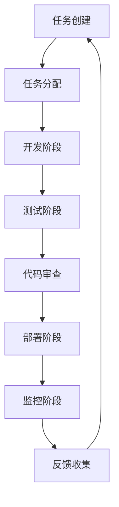

图表来源
- [rust/PROGRESS.md](file://rust/PROGRESS.md)

### 跟踪指标
- **开发进度**：功能完成度、代码覆盖率、测试通过率
- **质量指标**：代码质量评分、Bug数量、性能指标
- **团队协作**：代码审查效率、任务完成时间、协作频率
- **发布管理**：版本发布频率、热修复响应时间、用户反馈处理

### 报告生成
系统自动生成多种类型的进度报告：
- 日报：每日开发进展和问题汇总
- 周报：周度目标完成情况和技术债务分析
- 月报：月度里程碑达成情况和团队绩效评估

章节来源
- [rust/PROGRESS.md](file://rust/PROGRESS.md)

## 重构综合审计报告

**新增** 基于REFACTORING_AUDIT_REPORT_20260806.md的详细重构审计报告，为项目提供全面的完成度评估和缺口分析。

### 审计背景与方法
审计采用双轨并行方法：
- **第一路（Flutter UI）**：Flutter全部screen/widget与Android原版逐屏对照，产出约92项缺口
- **第二路（Rust）**：rust/工作区源码级复查，产出完成度修订与4项P1实质缺口

对齐标准：**界面功能、页面结构与交互流程必须与Android原版一致；UI视觉风格允许自由改变**

### 当前重构完成度统计

#### Rust轨道：96-97%（源码级复查）
| 维度 | 数据 |
|------|------|
| 原子任务 | 168 / 168（100%） |
| 实质P1缺口 | 4项（nextContentUrl分页/audioSpeak TTS/WebView载荷拦截/rssUpdateSource） |
| P2与治理项 | subContent、contentRule.replaceRegex、legado-server正文桩、dict 18词占位、Dart fallback死代码等 |
| 契约登记 | 12个FFI已实现未登记（已补登API_CONTRACT §2.41）；13个bridge绑定待UI封装 |
| schema | 核心表对齐Room v95良好；rssArticles/readRecord主键、rssReadRecords/httpTTS结构、rssSources双列冗余为P1治理项 |

#### Flutter UI功能对齐度：主链路已对齐，剩约92项缺口
| 优先级 | 数量 | 性质 |
|--------|------|------|
| P0 | 2 | 阻塞核心阅读体验（正文长按选择菜单、朗读链路） |
| P1 | 44 | 影响用户体验（各屏幕菜单/配置/行为不符） |
| P2 | 46 | 细节收尾（日志接线、排版参数、零星菜单） |
| **合计** | **约92** | 核心页面与主链路（书架→搜索→目录→正文→书签→替换规则→RSS→听书→备份）均已可用；缺口集中在二级菜单、配置项与行为细节 |

### 测试规模（2026-08-05实测）
| 轨道 | 测试数 |
|------|--------|
| Rust workspace（cargo test） | 2283 passed |
| Rust quickjs feature | 547 passed（legado-ffi 175 passed） |
| Flutter（flutter test） | 1087 passed（flutter analyze 0 issues） |
| **合计** | **约3917** |

### 修复建议与优先级排序
1. **P0先行**：两项P0均集中在阅读器，直接决定核心阅读体验
2. **快赢先行**：纯接线项无FFI阻塞，立即消化建立momentum
3. **Rust解阻塞优先**：① nextContentUrl与④ rssUpdateSource工时小、收益直接，先于UI批量启动
4. **跨轨并行**：② audioSpeak与③ WebView拦截与UI批次并行推进
5. **契约铁律**：新增FFI先更新API_CONTRACT.md冻结契约再实施

### 预计完成时间表
| 批次 | 内容 | 人日估算 | 周期（单人） | 依赖 |
|------|------|----------|--------------|------|
| 批次1·快赢 | 批次0四个纯接线项 | ≤2d | 第1周 | 无 |
| 批次1·P0专项 | P0-1（3-5d）+ P0-2 UI部分（2-3d） | 5-8d | 第1-2周 | 无（朗读真实播报除外） |
| 批次2·Rust解阻塞 | ① nextContentUrl（2-3d）+ ④ rssUpdateSource（0.5d） | 2.5-3.5d | 第2-3周 | 契约先行 |
| 批次2·P1批量 | 44项按屏幕分组（阅读器/书架/RSS/规则/听书/设置） | 约20d（多数菜单项0.5-1d/组） | 第3-6周 | 登录V2封装、rssUpdateSource |
| 批次2·跨轨管线 | ② audioSpeak（3-5d）+ ③ WebView拦截（2-3d） | 5-8d | 第3-6周（与P1并行） | 契约冻结 |
| 批次3·P2收尾 | 46项P2 + 结构治理 | 10-15d | 第7-8周 | 批次1/2完成 |
| 批次3·治理 | README修正、platform.rs桩清理、脚本清理、bridge.rs决策、schema v102评估 | 3-5d | 第7-8周（穿插） | 无 |

**总计**：约48-65人日；单人串行约8-10周，双轨并行（Rust轨 + UI轨）可压缩至**6-8周**。

**里程碑**：
- M1（第2周末）：快赢清零 + P0两项UI完成（朗读真实播报除外）
- M2（第6周末）：P1 44项清零 + Rust 4项P1实质缺口闭合 + 朗读真实播报接通
- M3（第8周末）：P2收尾 + 治理项闭合，功能对齐度达到可发布口径

章节来源
- [REFACTORING_AUDIT_REPORT_20260806.md](file://REFACTORING_AUDIT_REPORT_20260806.md)

## UI界面差异分析

**新增** 基于UI_COMPARISON_REPORT.md的详细UI界面差异分析，为开发者提供全面的界面优化指导。

### 界面差异概览
UI界面差异分析涵盖了Android原生界面与Flutter跨平台界面的对比，包括：

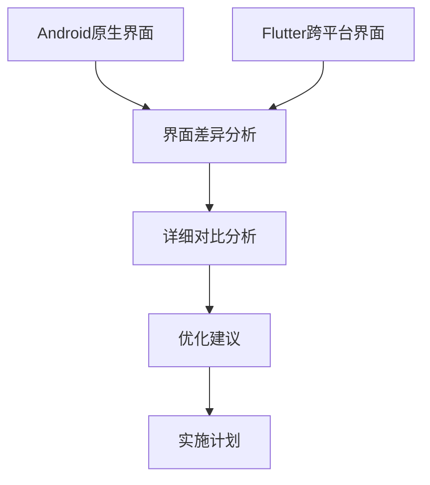

图表来源
- [UI_COMPARISON_REPORT.md](file://UI_COMPARISON_REPORT.md)

### 主要差异类别
1. **布局差异**：不同屏幕尺寸和密度的适配问题
2. **交互差异**：触摸手势和动画效果的实现差异
3. **样式差异**：主题、颜色和字体的一致性保证
4. **性能差异**：渲染性能和内存使用的优化空间

### 分析方法
- 视觉对比：截图对比和像素级差异检测
- 功能对比：核心功能的完整性和一致性验证
- 性能对比：加载速度、内存占用和CPU使用率分析
- 用户体验：操作流程的流畅度和易用性评估

章节来源
- [UI_COMPARISON_REPORT.md](file://UI_COMPARISON_REPORT.md)

## UI改进计划

**新增** 基于UI_FIX_PLAN.md的系统性UI改进计划，包含915行的详细优化策略和实施步骤。

### 改进目标
UI改进计划旨在解决界面不一致性问题，提升用户体验和开发效率：

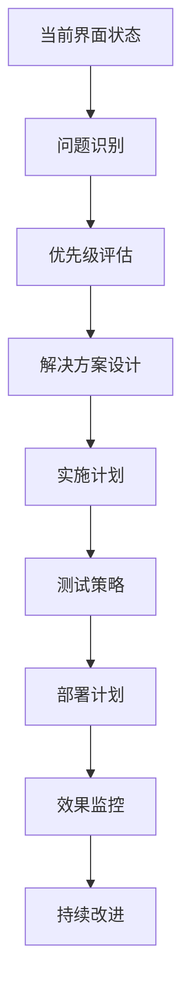

图表来源
- [UI_FIX_PLAN.md](file://UI_FIX_PLAN.md)

### 核心改进领域
1. **界面一致性**：统一设计规范，确保跨平台视觉一致性
2. **交互优化**：改进用户操作流程，提升交互响应速度
3. **性能优化**：减少界面渲染开销，优化内存使用
4. **可访问性**：增强无障碍支持和多语言适配

### 实施阶段
- **第一阶段**：基础界面修复和样式统一
- **第二阶段**：交互优化和性能调优
- **第三阶段**：高级功能和用户体验提升
- **第四阶段**：持续优化和监控维护

### 质量保证
- 自动化测试：建立UI自动化测试套件
- 视觉回归测试：确保界面变更不会引入视觉问题
- 性能基准测试：监控界面性能指标变化
- 用户反馈收集：建立用户反馈收集和响应机制

章节来源
- [UI_FIX_PLAN.md](file://UI_FIX_PLAN.md)

## Agent技能集合

**新增** Legado项目集成了完整的Agent技能系统，为开发者提供智能化的开发指导和最佳实践支持。

### 技能系统架构
Agent技能系统基于标准化的SKILL.md文件格式，每个技能都包含详细的指导说明和使用示例：

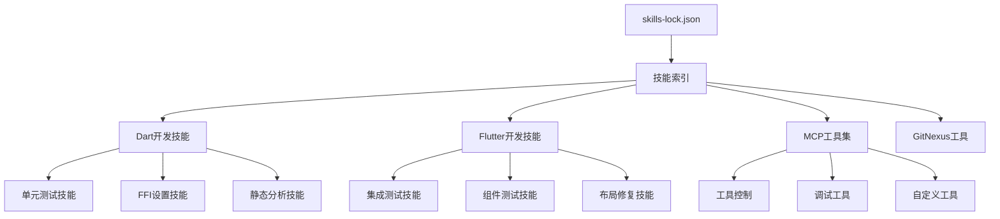

图表来源
- [skills-lock.json](file://skills-lock.json)
- [.agents/skills/dart-add-unit-test/SKILL.md](file://.agents/skills/dart-add-unit-test/SKILL.md)
- [.agents/skills/flutter-add-integration-test/SKILL.md](file://.agents/skills/flutter-add-integration-test/SKILL.md)
- [.agents/skills/flutter-mcp/SKILL.md](file://.agents/skills/flutter-mcp/SKILL.md)

### Dart开发技能
#### 单元测试技能
- **功能**：自动生成Dart单元测试代码
- **使用方法**：根据现有代码结构生成对应的测试用例
- **最佳实践**：遵循TDD原则，保持测试的可读性和可维护性

#### FFI设置技能
- **功能**：配置Dart与Rust之间的FFI接口
- **使用方法**：自动生成bridge代码和配置文件
- **最佳实践**：确保数据类型的一致性和内存安全

#### 静态分析技能
- **功能**：运行Dart静态分析工具
- **使用方法**：集成dart analyze和lint规则
- **最佳实践**：配置严格的代码质量规则

### Flutter开发技能
#### 集成测试技能
- **功能**：创建Flutter应用的集成测试
- **使用方法**：模拟用户操作和界面交互
- **最佳实践**：覆盖关键业务流程和用户场景

#### 组件测试技能
- **功能**：测试Flutter UI组件
- **使用方法**：隔离测试单个Widget的功能
- **最佳实践**：确保组件的独立性和可复用性

#### 布局修复技能
- **功能**：诊断和修复Flutter布局问题
- **使用方法**：分析布局约束和响应式问题
- **最佳实践**：遵循Material Design规范和最佳实践

### MCP工具集
#### 工具控制系统
- **功能**：管理和控制各种开发工具
- **使用方法**：统一的工具调用接口
- **最佳实践**：确保工具的可靠性和稳定性

#### 调试工具集
- **功能**：提供强大的调试功能
- **使用方法**：集成日志、断点和性能分析
- **最佳实践**：高效的调试流程和错误定位

#### 自定义工具开发
- **功能**：开发定制化的开发工具
- **使用方法**：基于MCP协议扩展功能
- **最佳实践**：保持工具的模块化和可组合性

### GitNexus工具集
#### 代码探索技能
- **功能**：分析和理解代码结构
- **使用方法**：可视化代码依赖和调用关系
- **最佳实践**：快速定位和理解复杂代码

#### 重构技能
- **功能**：安全的代码重构操作
- **使用方法**：保持代码功能不变的重构
- **最佳实践**：小步快跑，频繁提交

#### 影响分析技能
- **功能**：分析代码变更的影响范围
- **使用方法**：识别受影响的模块和文件
- **最佳实践**：风险评估和回归测试

### 技能管理
#### 技能安装和配置
- **安装方式**：通过skills-lock.json统一管理
- **配置方法**：标准化的SKILL.md文件格式
- **版本控制**：技能的版本管理和更新机制

#### 技能使用流程
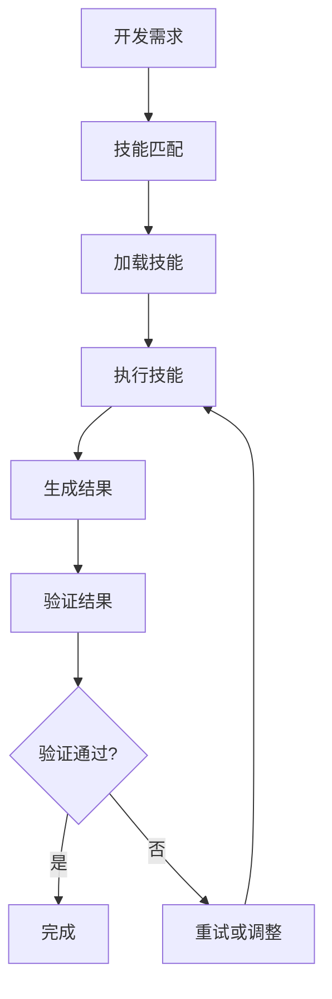

图表来源
- [.agents/skills/harness-engineering-lifecycle/SKILL.md](file://.agents/skills/harness-engineering-lifecycle/SKILL.md)

### 最佳实践
- **技能选择**：根据具体需求选择合适的技能
- **组合使用**：多个技能协同工作提高效率
- **持续优化**：根据使用反馈不断优化技能
- **知识共享**：团队内分享技能使用经验

章节来源
- [.agents/skills/dart-add-unit-test/SKILL.md](file://.agents/skills/dart-add-unit-test/SKILL.md)
- [.agents/skills/flutter-add-integration-test/SKILL.md](file://.agents/skills/flutter-add-integration-test/SKILL.md)
- [.agents/skills/dart-setup-ffi-assets/SKILL.md](file://.agents/skills/dart-setup-ffi-assets/SKILL.md)
- [.agents/skills/flutter-mcp/SKILL.md](file://.agents/skills/flutter-mcp/SKILL.md)
- [.agents/skills/gitnexus-guide/SKILL.md](file://.agents/skills/gitnexus-guide/SKILL.md)
- [.agents/skills/harness-engineering-lifecycle/SKILL.md](file://.agents/skills/harness-engineering-lifecycle/SKILL.md)
- [skills-lock.json](file://skills-lock.json)

## 故障排查指南
- Android调试：使用Android Studio调试器、Logcat查看日志、Profiler分析性能
- Flutter调试：使用DevTools进行性能分析、Widget检查与网络监控
- Rust调试：使用cargo build --target aarch64-linux-android配合LLDB调试
- Web调试：浏览器开发者工具进行网络请求与DOM检查
- 常见问题：依赖冲突、版本不匹配、路径配置错误等

**更新** 新增平台特定API支持和编译验证相关的问题排查指南，特别强调了Flutter Rust Bridge代码生成相关的问题：

### Flutter Rust Bridge代码生成问题
- **代码生成文件被git忽略**：`flutter_legado/lib/src/rust/**`目录下的生成文件（含`frb_generated.dart`）已被git忽略，仓库不包含这些文件
- **拉取新FFI绑定后必须重新生成**：拉取包含新增FFI的提交后，必须先执行`flutter_rust_bridge_codegen generate`再进行构建
- **content hash同步要求**：codegen后会重新生成两侧的content hash，必须紧跟一次DLL重编译，否则运行时报错
- **构建失败预防**：避免因缺少生成的绑定而导致的构建失败

### 代码生成相关故障排查
- **flutter_rust_bridge_codegen未找到**：确保已安装`cargo install flutter_rust_bridge_codegen`
- **代码生成失败**：检查`flutter_rust_bridge.yaml`配置是否正确
- **DLL重编译失败**：Windows环境下可能需要先停止正在运行的应用进程
- **content hash不同步**：确保codegen后立即执行Rust FFI库的重编译

### 其他平台特定问题
- Android构建失败：检查AGP版本兼容性、Kotlin版本匹配和NDK路径配置
- Flutter FFI调用异常：验证flutter_rust_bridge配置和生成的桥接代码
- Rust交叉编译错误：确认NDK版本和目标架构配置
- 依赖解析失败：检查镜像仓库配置和网络连接
- 技能加载失败：检查skills-lock.json配置和技能文件完整性
- 工具调用异常：验证工具权限和配置参数
- 性能问题：分析技能执行时间和资源消耗
- 审计任务失败：检查审计配置和依赖项
- 修复任务冲突：协调并行会话和资源竞争

章节来源
- [app/src/androidTest/java/io/legado/app/AndroidJsTest.kt](file://app/src/androidTest/java/io/legado/app/AndroidJsTest.kt)
- [app/src/test/java/io/legado/app/ExampleUnitTest.kt](file://app/src/test/java/io/legado/app/ExampleUnitTest.kt)
- [flutter_legado/test/unit/bookshelf_provider_test.dart](file://flutter_legado/test/unit/bookshelf_provider_test.dart)
- [flutter_legado/test/widget/badge_widget_test.dart](file://flutter_legado/test/widget/badge_widget_test.dart)
- [rust/MIGRATION_WORKFLOW.md](file://rust/MIGRATION_WORKFLOW.md)
- [UI_COMPARISON_REPORT.md](file://UI_COMPARISON_REPORT.md)
- [UI_FIX_PLAN.md](file://UI_FIX_PLAN.md)
- [REFACTORING_AUDIT_REPORT_20260806.md](file://REFACTORING_AUDIT_REPORT_20260806.md)
- [AUDIT_FIX_ASSIGNMENT.md](file://AUDIT_FIX_ASSIGNMENT.md)
- [flutter_legado/.gitignore](file://flutter_legado/.gitignore)
- [flutter_legado/scripts/generate-bridge.sh](file://flutter_legado/scripts/generate-bridge.sh)
- [flutter_legado/scripts/generate-bridge.ps1](file://flutter_legado/scripts/generate-bridge.ps1)
- [flutter_legado/Makefile](file://flutter_legado/Makefile)
- [rust/DEVELOPMENT.md](file://rust/DEVELOPMENT.md)

## 结论
Legado项目通过多语言、多平台的混合架构实现了高性能、可扩展的阅读应用。统一的开发规范、完善的测试策略与高效的协作流程确保了代码质量与团队效率。新增的综合审计报告系统、数据库迁移工作流、项目进度跟踪系统、UI界面优化指南和Agent技能系统进一步提升了开发效率和代码可维护性。

**更新** 随着平台特定API支持、编译验证流程、Android构建系统升级、Flutter工具链更新和Rust交叉编译优化的引入，项目的开发流程更加标准化和自动化，为团队协作提供了更好的技术支持。特别重要的是，Flutter Rust Bridge代码生成要求的增强，有效防止了因缺少生成的绑定而导致的构建失败，确保了开发流程的顺畅性。最新的构建配置和工具链版本确保了跨平台构建的稳定性和性能，为项目的长期发展奠定了坚实基础。

## 附录

### 开发环境搭建
- JDK：安装JDK 17（Android构建要求），配置JAVA_HOME环境变量
- Android SDK：通过Android Studio安装最新SDK与构建工具，配置NDK 28.2.13676358
- Flutter SDK：下载并配置Flutter SDK（>=3.8.0），运行flutter doctor检查环境
- Rust工具链：使用rustup安装稳定版工具链1.97.1，配置目标平台
- Node.js：安装LTS版本，用于Web模块构建
- Agent技能：通过skills-lock.json自动管理技能依赖

**更新** 开发环境要求已更新，包括新的JDK版本要求、Android SDK版本和Flutter SDK版本，确保与最新的构建系统兼容。特别强调了flutter_rust_bridge_codegen的安装和配置。

### 代码规范与最佳实践
- Kotlin编码规范：遵循Google Kotlin风格指南，使用Ktlint进行格式化
- Dart风格指南：遵循Dart官方风格指南，使用dart format与analysis_options.yaml
- Rust编程约定：遵循Rust官方风格指南，使用rustfmt与clippy检查
- JavaScript/TypeScript：使用ESLint与Prettier统一代码风格
- Agent技能规范：遵循SKILL.md标准格式，提供清晰的指导和示例

### 调试技巧与工具
- Android Studio：断点调试、内存分析、网络监控
- Flutter DevTools：性能分析、Widget树检查、热重载
- Rust调试器：cargo build + LLDB组合调试
- 浏览器开发者工具：网络请求、控制台日志、性能分析
- Agent技能调试：技能执行日志和错误追踪

### 项目结构与模块组织
- 分层架构：UI层、业务层、数据层清晰分离
- 命名约定：类名大驼峰、函数小驼峰、常量全大写
- 文件组织：按功能模块分包，公共资源集中管理
- 技能组织：按功能分类组织Agent技能文件

### 测试策略与框架
- 单元测试：JUnit（Android）、Dart Test（Flutter）、Cargo Test（Rust）
- 集成测试：Espresso（Android）、Integration Test（Flutter）
- UI测试：Flutter Driver、自定义UI测试用例
- 技能测试：Agent技能的自动化测试和验证

### 贡献指南与协作流程
- Git工作流：Feature分支开发，Pull Request合并
- 代码审查：至少一名维护者审查通过
- Issue管理：Bug报告与功能请求模板
- CI/CD：自动化构建、测试与发布流程
- 技能贡献：标准化的技能开发和提交流程

### 数据库迁移最佳实践
- 版本控制：所有Schema变更必须通过迁移脚本管理
- 向后兼容：确保新版本能够处理旧版本数据
- 测试覆盖：迁移脚本必须有完整的测试用例
- 回滚策略：提供可靠的回滚机制应对异常情况

### 项目进度管理
- 任务分解：将大功能拆分为可追踪的小任务
- 进度可视化：使用看板或甘特图展示项目进度
- 定期汇报：建立日站会和周报制度
- 风险预警：及时识别和解决潜在风险

### UI界面开发规范
- 设计规范：遵循Material Design和iOS Human Interface Guidelines
- 响应式设计：适配不同屏幕尺寸和方向
- 主题管理：支持浅色和深色主题切换
- 国际化：多语言资源和文本适配

### UI测试与质量保证
- 视觉回归测试：自动化界面截图对比
- 交互测试：模拟用户操作和手势处理
- 性能测试：界面渲染和内存使用监控
- 兼容性测试：多设备和操作系统验证

### Agent技能开发指南
- 技能设计：明确技能目标和输入输出
- 文档编写：详细的SKILL.md文档和示例
- 测试验证：确保技能的稳定性和可靠性
- 版本管理：技能的版本控制和更新机制

### 审计修复工作流程
- 审计执行：定期进行代码质量和功能完整性审计
- 任务分配：根据审计结果分配修复任务
- 进度跟踪：实时监控修复进度和质量指标
- 验收标准：建立明确的验收标准和测试要求

### 平台特定API支持
- Android NDK配置：支持arm64-v8a、armeabi-v7a、x86_64架构
- Flutter FFI桥接：使用flutter_rust_bridge生成跨平台接口
- Rust交叉编译：配置多目标构建和依赖管理
- 构建系统优化：AGP 8.13.2、Kotlin 2.4.10、Gradle最新稳定版

**更新** 新增平台特定API支持说明，包括Android NDK配置、Flutter FFI桥接和Rust交叉编译的详细指导，确保多平台开发的顺利进行。特别强调了Flutter Rust Bridge代码生成的重要性和正确的操作流程。

### Flutter Rust Bridge代码生成流程
- **代码生成配置**：通过`flutter_rust_bridge.yaml`文件配置生成规则
- **生成命令**：使用`flutter_rust_bridge_codegen generate`命令生成代码
- **脚本支持**：提供`generate-bridge.sh`和`generate-bridge.ps1`脚本简化操作
- **Makefile集成**：通过`make gen`命令一键完成代码生成和DLL重编译
- **git忽略规则**：生成的文件位于`flutter_legado/lib/src/rust/**`，已被git忽略
- **content hash同步**：codegen后必须立即重编译Rust FFI库以确保hash同步

### 代码生成最佳实践
- **拉取新提交后**：必须先执行代码生成再进行构建
- **FFI接口变更后**：需要重新生成Dart侧的绑定代码
- **构建失败时**：检查是否遗漏了代码生成步骤
- **团队协作**：确保所有开发者都了解代码生成的重要性
- **CI/CD集成**：在自动化流程中包含代码生成步骤

章节来源
- [Makefile](file://Makefile)
- [package.json](file://package.json)
- [flutter_legado/analysis_options.yaml](file://flutter_legado/analysis_options.yaml)
- [modules/web/eslint.config.mjs](file://modules/web/eslint.config.mjs)
- [modules/web/.prettierrc.json](file://modules/web/.prettierrc.json)
- [rust/DEVELOPMENT.md](file://rust/DEVELOPMENT.md)
- [rust/MIGRATION_WORKFLOW.md](file://rust/MIGRATION_WORKFLOW.md)
- [rust/PROGRESS.md](file://rust/PROGRESS.md)
- [UI_COMPARISON_REPORT.md](file://UI_COMPARISON_REPORT.md)
- [UI_FIX_PLAN.md](file://UI_FIX_PLAN.md)
- [.agents/skills/dart-add-unit-test/SKILL.md](file://.agents/skills/dart-add-unit-test/SKILL.md)
- [.agents/skills/flutter-add-integration-test/SKILL.md](file://.agents/skills/flutter-add-integration-test/SKILL.md)
- [.agents/skills/dart-setup-ffi-assets/SKILL.md](file://.agents/skills/dart-setup-ffi-assets/SKILL.md)
- [.agents/skills/flutter-mcp/SKILL.md](file://.agents/skills/flutter-mcp/SKILL.md)
- [skills-lock.json](file://skills-lock.json)
- [REFACTORING_AUDIT_REPORT_20260806.md](file://REFACTORING_AUDIT_REPORT_20260806.md)
- [AUDIT_FIX_ASSIGNMENT.md](file://AUDIT_FIX_ASSIGNMENT.md)
- [gradle/libs.versions.toml](file://gradle/libs.versions.toml)
- [rust/.cargo/config.toml](file://rust/.cargo/config.toml)
- [flutter_legado/flutter_rust_bridge.yaml](file://flutter_legado/flutter_rust_bridge.yaml)
- [flutter_legado/.gitignore](file://flutter_legado/.gitignore)
- [flutter_legado/scripts/generate-bridge.sh](file://flutter_legado/scripts/generate-bridge.sh)
- [flutter_legado/scripts/generate-bridge.ps1](file://flutter_legado/scripts/generate-bridge.ps1)
- [flutter_legado/Makefile](file://flutter_legado/Makefile)