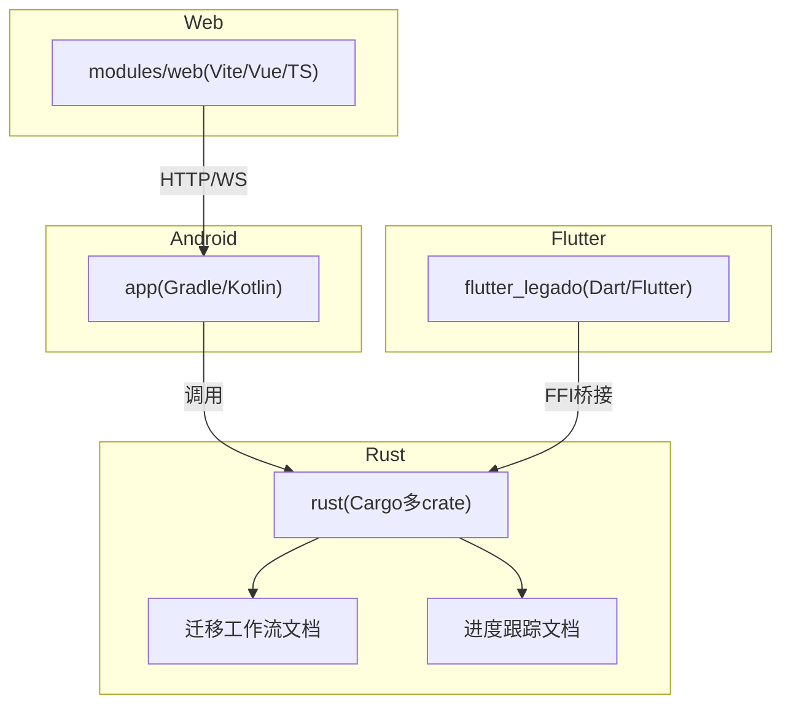
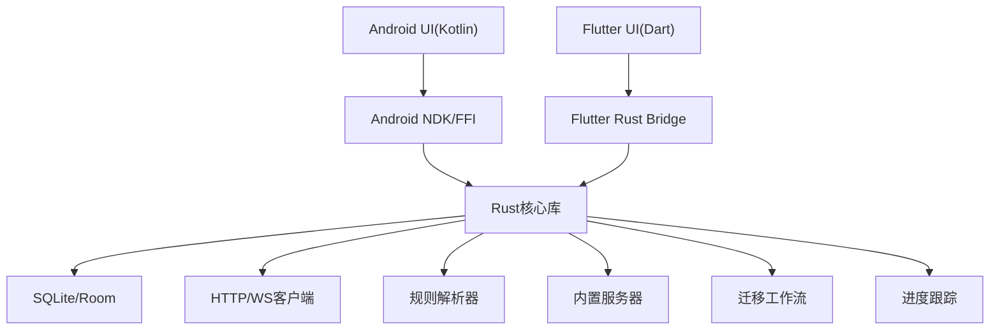
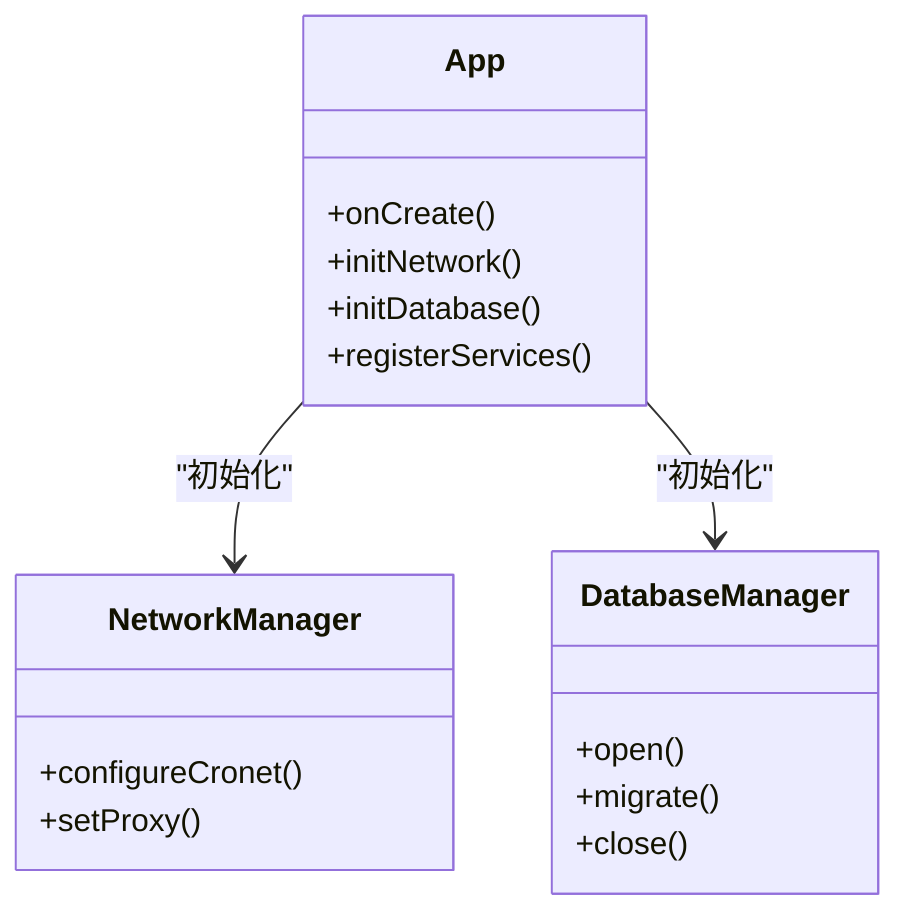
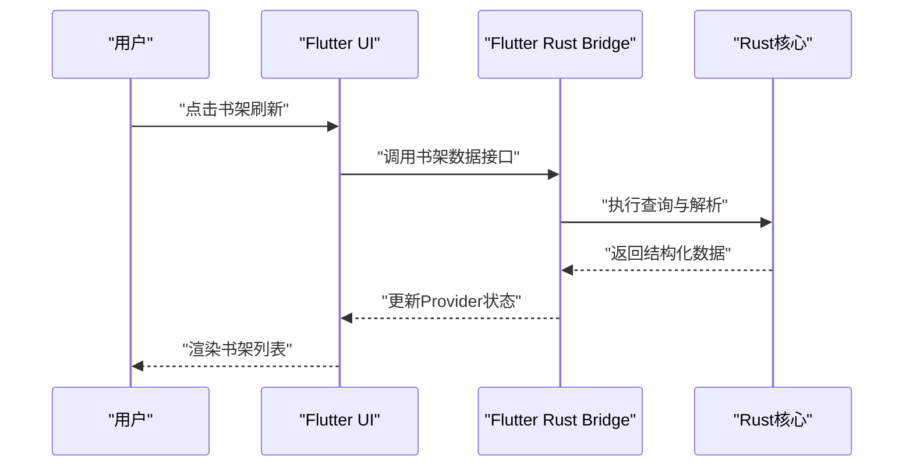
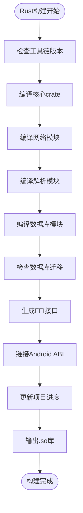
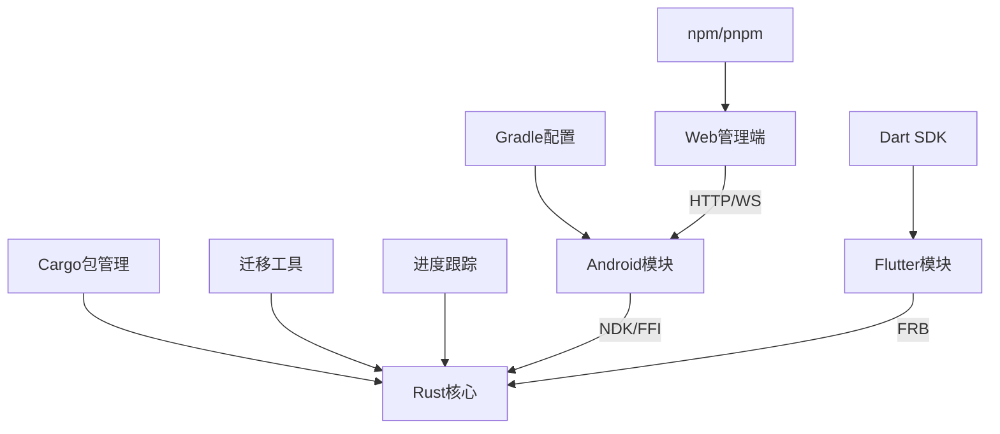
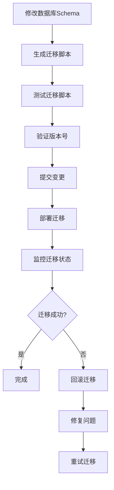
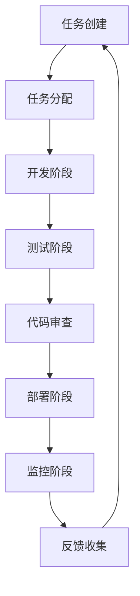
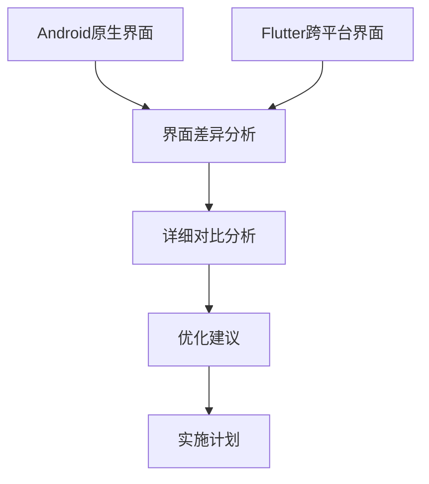
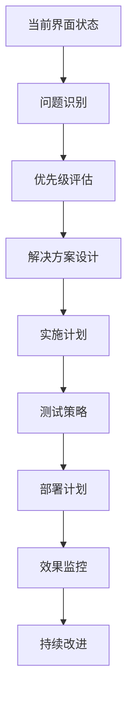

# 开发指南

<cite>
**本文档引用的文件**   
- [README.md](file://README.md)
- [Makefile](file://Makefile)
- [package.json](file://package.json)
- [gradle.properties](file://gradle.properties)
- [settings.gradle](file://settings.gradle)
- [build.gradle](file://build.gradle)
- [app/build.gradle](file://app/build.gradle)
- [flutter_legado/pubspec.yaml](file://flutter_legado/pubspec.yaml)
- [flutter_legado/analysis_options.yaml](file://flutter_legado/analysis_options.yaml)
- [flutter_legado/flutter_rust_bridge.yaml](file://flutter_legado/flutter_rust_bridge.yaml)
- [rust/Cargo.toml](file://rust/Cargo.toml)
- [rust/rust-toolchain.toml](file://rust/rust-toolchain.toml)
- [rust/DEVELOPMENT.md](file://rust/DEVELOPMENT.md)
- [rust/MIGRATION_WORKFLOW.md](file://rust/MIGRATION_WORKFLOW.md)
- [rust/PROGRESS.md](file://rust/PROGRESS.md)
- [modules/web/package.json](file://modules/web/package.json)
- [modules/web/eslint.config.mjs](file://modules/web/eslint.config.mjs)
- [modules/web/.prettierrc.json](file://modules/web/.prettierrc.json)
- [app/src/main/java/io/legado/app/App.kt](file://app/src/main/java/io/legado/app/App.kt)
- [app/src/androidTest/java/io/legado/app/AndroidJsTest.kt](file://app/src/androidTest/java/io/legado/app/AndroidJsTest.kt)
- [app/src/test/java/io/legado/app/ExampleUnitTest.kt](file://app/src/test/java/io/legado/app/ExampleUnitTest.kt)
- [flutter_legado/lib/main.dart](file://flutter_legado/lib/main.dart)
- [flutter_legado/lib/app.dart](file://flutter_legado/lib/app.dart)
- [flutter_legado/test/unit/bookshelf_provider_test.dart](file://flutter_legado/test/unit/bookshelf_provider_test.dart)
- [flutter_legado/test/widget/badge_widget_test.dart](file://flutter_legado/test/widget/badge_widget_test.dart)
- [UI_COMPARISON_REPORT.md](file://UI_COMPARISON_REPORT.md)
- [UI_FIX_PLAN.md](file://UI_FIX_PLAN.md)
</cite>

## 更新摘要
**所做更改**
- 新增UI界面差异分析章节，基于UI_COMPARISON_REPORT.md的476行详细分析
- 添加UI改进计划章节，包含UI_FIX_PLAN.md中的915行系统性改进方案
- 增强UI开发规范部分，整合界面优化策略和实施步骤
- 更新调试技巧指南，包含UI相关的调试方法和工具使用

## 目录
1. [简介](#简介)
2. [项目结构](#项目结构)
3. [核心组件](#核心组件)
4. [架构总览](#架构总览)
5. [详细组件分析](#详细组件分析)
6. [依赖关系分析](#依赖关系分析)
7. [性能考量](#性能考量)
8. [数据库迁移工作流](#数据库迁移工作流)
9. [项目进度跟踪](#项目进度跟踪)
10. [UI界面差异分析](#ui界面差异分析)
11. [UI改进计划](#ui改进计划)
12. [故障排查指南](#故障排查指南)
13. [结论](#结论)
14. [附录](#附录)

## 简介
本指南面向Legado项目的开发者，覆盖从环境搭建、代码规范、调试技巧、模块组织、测试策略到协作流程的全链路开发实践。项目采用多语言、多平台混合架构：Android原生（Kotlin）、Flutter跨平台界面、Rust高性能核心与FFI桥接、以及Web管理端（Vue/TS）。通过统一的工作流与工具链，确保高质量交付与高效协作。

**更新** 新增了UI界面差异分析和改进计划，提供更全面的界面开发指导和质量保证流程。

## 项目结构
仓库采用多模块、多语言工程组织方式：
- app：Android应用主模块（Kotlin/Gradle）
- flutter_legado：Flutter跨平台UI层（Dart/Flutter）
- rust：Rust核心库与FFI桥接（Cargo多crate）
- modules/web：Web管理端（Vite/Vue/TypeScript）
- gradle、Makefile、package.json等顶层构建脚本与配置

图表来源
- [settings.gradle](file://settings.gradle)
- [build.gradle](file://build.gradle)
- [app/build.gradle](file://app/build.gradle)
- [flutter_legado/pubspec.yaml](file://flutter_legado/pubspec.yaml)
- [rust/Cargo.toml](file://rust/Cargo.toml)
- [rust/MIGRATION_WORKFLOW.md](file://rust/MIGRATION_WORKFLOW.md)
- [rust/PROGRESS.md](file://rust/PROGRESS.md)
- [modules/web/package.json](file://modules/web/package.json)

章节来源
- [README.md](file://README.md)
- [Makefile](file://Makefile)
- [package.json](file://package.json)
- [settings.gradle](file://settings.gradle)
- [build.gradle](file://build.gradle)
- [app/build.gradle](file://app/build.gradle)
- [flutter_legado/pubspec.yaml](file://flutter_legado/pubspec.yaml)
- [rust/Cargo.toml](file://rust/Cargo.toml)
- [rust/MIGRATION_WORKFLOW.md](file://rust/MIGRATION_WORKFLOW.md)
- [rust/PROGRESS.md](file://rust/PROGRESS.md)
- [modules/web/package.json](file://modules/web/package.json)

## 核心组件
- Android应用入口与初始化：App.kt作为应用启动与全局初始化点，负责依赖注入、网络、数据库、服务注册等。
- Flutter应用入口：main.dart与app.dart定义应用生命周期、路由与主题。
- Rust核心：多crate划分清晰，包含book解析、core业务逻辑、db持久化、ffi桥接、net网络、parser规则解析、server服务等。
- Web管理端：基于Vite+Vue的源码编辑、书架管理与调试工具。

**更新** Rust核心组件现在包含完整的数据库迁移工作流和进度跟踪系统，提供更好的开发体验。

章节来源
- [app/src/main/java/io/legado/app/App.kt](file://app/src/main/java/io/legado/app/App.kt)
- [flutter_legado/lib/main.dart](file://flutter_legado/lib/main.dart)
- [flutter_legado/lib/app.dart](file://flutter_legado/lib/app.dart)
- [rust/Cargo.toml](file://rust/Cargo.toml)
- [rust/MIGRATION_WORKFLOW.md](file://rust/MIGRATION_WORKFLOW.md)
- [rust/PROGRESS.md](file://rust/PROGRESS.md)
- [modules/web/package.json](file://modules/web/package.json)

## 架构总览
整体架构遵循"前端UI + 中间层桥接 + 高性能核心"的分层模式：
- UI层：Android原生与Flutter双通道，提供一致的阅读体验与管理界面
- 桥接层：Flutter Rust Bridge与Android NDK/FFI将Rust能力暴露给上层
- 核心层：Rust实现高并发、高性能的数据处理、网络请求、规则解析与本地存储
- 服务端：内置HTTP/WebSocket服务，供Web端与外部集成

**更新** 架构中新增了数据库迁移工作流管理和项目进度跟踪系统，确保数据一致性和开发效率。

图表来源
- [flutter_legado/flutter_rust_bridge.yaml](file://flutter_legado/flutter_rust_bridge.yaml)
- [rust/DEVELOPMENT.md](file://rust/DEVELOPMENT.md)
- [app/build.gradle](file://app/build.gradle)
- [rust/Cargo.toml](file://rust/Cargo.toml)
- [rust/MIGRATION_WORKFLOW.md](file://rust/MIGRATION_WORKFLOW.md)
- [rust/PROGRESS.md](file://rust/PROGRESS.md)

## 详细组件分析

### Android应用组件
- 应用初始化：在App.kt中完成全局配置、日志、网络、数据库、权限与服务注册
- 模块化组织：按功能分包（api、base、constant、data、help、lib、model、receiver、service、ui、utils、web）
- 资源管理：res下按类型与维度组织布局、样式、图片与国际化资源

图表来源
- [app/src/main/java/io/legado/app/App.kt](file://app/src/main/java/io/legado/app/App.kt)
- [app/build.gradle](file://app/build.gradle)

章节来源
- [app/src/main/java/io/legado/app/App.kt](file://app/src/main/java/io/legado/app/App.kt)
- [app/build.gradle](file://app/build.gradle)

### Flutter应用组件
- 入口与路由：main.dart启动应用，app.dart定义主题、路由与状态管理
- 插件与桥接：通过flutter_rust_bridge.yaml生成桥接代码，调用Rust核心能力
- 测试分层：unit与widget测试覆盖核心Provider与UI组件

图表来源
- [flutter_legado/lib/main.dart](file://flutter_legado/lib/main.dart)
- [flutter_legado/lib/app.dart](file://flutter_legado/lib/app.dart)
- [flutter_legado/flutter_rust_bridge.yaml](file://flutter_legado/flutter_rust_bridge.yaml)

章节来源
- [flutter_legado/lib/main.dart](file://flutter_legado/lib/main.dart)
- [flutter_legado/lib/app.dart](file://flutter_legado/lib/app.dart)
- [flutter_legado/flutter_rust_bridge.yaml](file://flutter_legado/flutter_rust_bridge.yaml)

### Rust核心组件
- 多crate设计：legado-core（业务逻辑）、legado-db（数据访问）、legado-ffi（FFI导出）、legado-net（网络）、legado-parser（规则解析）、legado-server（HTTP服务）、legado-book（电子书格式支持）
- 工具链配置：rust-toolchain.toml锁定版本，Cargo.toml管理依赖与特性开关
- 开发文档：DEVELOPMENT.md提供构建、调试与发布指引

**更新** Rust核心组件现在包含完整的数据库迁移工作流管理系统和项目进度跟踪功能，提供更好的开发体验和维护性。

图表来源
- [rust/rust-toolchain.toml](file://rust/rust-toolchain.toml)
- [rust/Cargo.toml](file://rust/Cargo.toml)
- [rust/DEVELOPMENT.md](file://rust/DEVELOPMENT.md)
- [rust/MIGRATION_WORKFLOW.md](file://rust/MIGRATION_WORKFLOW.md)
- [rust/PROGRESS.md](file://rust/PROGRESS.md)

章节来源
- [rust/Cargo.toml](file://rust/Cargo.toml)
- [rust/rust-toolchain.toml](file://rust/rust-toolchain.toml)
- [rust/DEVELOPMENT.md](file://rust/DEVELOPMENT.md)
- [rust/MIGRATION_WORKFLOW.md](file://rust/MIGRATION_WORKFLOW.md)
- [rust/PROGRESS.md](file://rust/PROGRESS.md)

### Web管理端组件
- 技术栈：Vite + Vue 3 + TypeScript，使用ESLint与Prettier保证代码质量
- 功能模块：书架管理、源码编辑、调试面板、API调用封装
- 构建脚本：package.json定义开发与生产构建命令

图表来源
- [modules/web/package.json](file://modules/web/package.json)
- [modules/web/eslint.config.mjs](file://modules/web/eslint.config.mjs)
- [modules/web/.prettierrc.json](file://modules/web/.prettierrc.json)

章节来源
- [modules/web/package.json](file://modules/web/package.json)
- [modules/web/eslint.config.mjs](file://modules/web/eslint.config.mjs)
- [modules/web/.prettierrc.json](file://modules/web/.prettierrc.json)

## 依赖关系分析
项目依赖关系呈现清晰的层次结构：
- Android模块依赖Gradle插件与第三方库
- Flutter模块依赖Dart SDK与Flutter框架，通过bridge.yaml生成Rust绑定
- Rust模块通过Cargo管理内部crate依赖与外部crate
- Web模块通过npm/pnpm管理前端依赖

**更新** Rust模块现在包含数据库迁移工作流依赖和项目进度跟踪系统的依赖管理。

图表来源
- [gradle.properties](file://gradle.properties)
- [settings.gradle](file://settings.gradle)
- [build.gradle](file://build.gradle)
- [flutter_legado/pubspec.yaml](file://flutter_legado/pubspec.yaml)
- [rust/Cargo.toml](file://rust/Cargo.toml)
- [rust/MIGRATION_WORKFLOW.md](file://rust/MIGRATION_WORKFLOW.md)
- [rust/PROGRESS.md](file://rust/PROGRESS.md)
- [modules/web/package.json](file://modules/web/package.json)

章节来源
- [gradle.properties](file://gradle.properties)
- [settings.gradle](file://settings.gradle)
- [build.gradle](file://build.gradle)
- [flutter_legado/pubspec.yaml](file://flutter_legado/pubspec.yaml)
- [rust/Cargo.toml](file://rust/Cargo.toml)
- [rust/MIGRATION_WORKFLOW.md](file://rust/MIGRATION_WORKFLOW.md)
- [rust/PROGRESS.md](file://rust/PROGRESS.md)
- [modules/web/package.json](file://modules/web/package.json)

## 性能考量
- Rust核心：利用零成本抽象与异步IO提升数据处理与网络请求性能
- Flutter UI：合理使用Provider状态管理，避免不必要的重建
- Android优化：启用R8混淆与资源压缩，减少APK体积
- 缓存策略：本地SQLite与内存缓存结合，降低重复计算开销
- 网络优化：连接池、重试机制与超时控制
- 数据库优化：增量迁移和批量操作提升数据更新效率

## 数据库迁移工作流

**新增** Legado项目现在提供了完整的数据库迁移工作流，确保数据结构的版本控制和向后兼容性。

### 迁移流程概述
数据库迁移工作流基于MIGRATION_WORKFLOW.md文档，提供了标准化的数据库版本管理流程：

图表来源
- [rust/MIGRATION_WORKFLOW.md](file://rust/MIGRATION_WORKFLOW.md)

### 迁移步骤详解
1. **Schema修改**：在Rust代码中修改数据库模型定义
2. **迁移脚本生成**：使用自动化工具生成对应的SQL迁移脚本
3. **版本管理**：确保迁移脚本的版本号正确递增
4. **测试验证**：在测试环境中验证迁移脚本的正确性
5. **部署流程**：按照标准流程部署到生产环境

### 最佳实践
- 始终向前兼容：新版本的迁移脚本必须能够处理旧版本数据
- 原子性操作：确保迁移操作的原子性，失败时能够完全回滚
- 备份策略：在执行重要迁移前进行数据备份
- 监控告警：设置迁移过程的监控和告警机制

章节来源
- [rust/MIGRATION_WORKFLOW.md](file://rust/MIGRATION_WORKFLOW.md)

## 项目进度跟踪

**新增** PROGRESS.md文件提供了项目进度的系统化跟踪和管理方法。

### 进度跟踪系统
项目进度跟踪系统包含以下核心功能：

图表来源
- [rust/PROGRESS.md](file://rust/PROGRESS.md)

### 跟踪指标
- **开发进度**：功能完成度、代码覆盖率、测试通过率
- **质量指标**：代码质量评分、Bug数量、性能指标
- **团队协作**：代码审查效率、任务完成时间、协作频率
- **发布管理**：版本发布频率、热修复响应时间、用户反馈处理

### 报告生成
系统自动生成多种类型的进度报告：
- 日报：每日开发进展和问题汇总
- 周报：周度目标完成情况和技术债务分析
- 月报：月度里程碑达成情况和团队绩效评估

章节来源
- [rust/PROGRESS.md](file://rust/PROGRESS.md)

## UI界面差异分析

**新增** 基于UI_COMPARISON_REPORT.md的详细UI界面差异分析，为开发者提供全面的界面优化指导。

### 界面差异概览
UI界面差异分析涵盖了Android原生界面与Flutter跨平台界面的对比，包括：

图表来源
- [UI_COMPARISON_REPORT.md](file://UI_COMPARISON_REPORT.md)

### 主要差异类别
1. **布局差异**：不同屏幕尺寸和密度的适配问题
2. **交互差异**：触摸手势和动画效果的实现差异
3. **样式差异**：主题、颜色和字体的一致性保证
4. **性能差异**：渲染性能和内存使用的优化空间

### 分析方法
- 视觉对比：截图对比和像素级差异检测
- 功能对比：核心功能的完整性和一致性验证
- 性能对比：加载速度、内存占用和CPU使用率分析
- 用户体验：操作流程的流畅度和易用性评估

章节来源
- [UI_COMPARISON_REPORT.md](file://UI_COMPARISON_REPORT.md)

## UI改进计划

**新增** 基于UI_FIX_PLAN.md的系统性UI改进计划，包含915行的详细优化策略和实施步骤。

### 改进目标
UI改进计划旨在解决界面不一致性问题，提升用户体验和开发效率：

图表来源
- [UI_FIX_PLAN.md](file://UI_FIX_PLAN.md)

### 核心改进领域
1. **界面一致性**：统一设计规范，确保跨平台视觉一致性
2. **交互优化**：改进用户操作流程，提升交互响应速度
3. **性能优化**：减少界面渲染开销，优化内存使用
4. **可访问性**：增强无障碍支持和多语言适配

### 实施阶段
- **第一阶段**：基础界面修复和样式统一
- **第二阶段**：交互优化和性能调优
- **第三阶段**：高级功能和用户体验提升
- **第四阶段**：持续优化和监控维护

### 质量保证
- 自动化测试：建立UI自动化测试套件
- 视觉回归测试：确保界面变更不会引入视觉问题
- 性能基准测试：监控界面性能指标变化
- 用户反馈收集：建立用户反馈收集和响应机制

章节来源
- [UI_FIX_PLAN.md](file://UI_FIX_PLAN.md)

## 故障排查指南
- Android调试：使用Android Studio调试器、Logcat查看日志、Profiler分析性能
- Flutter调试：使用DevTools进行性能分析、Widget检查与网络监控
- Rust调试：使用cargo build --target aarch64-linux-android配合LLDB调试
- Web调试：浏览器开发者工具进行网络请求与DOM检查
- 常见问题：依赖冲突、版本不匹配、路径配置错误等

**更新** 新增UI相关的问题排查指南：
- 界面不一致：检查不同平台的样式适配和主题配置
- 性能问题：分析界面渲染瓶颈和内存泄漏
- 交互异常：调试手势处理和事件冒泡机制
- 布局错乱：检查响应式布局和约束条件

章节来源
- [app/src/androidTest/java/io/legado/app/AndroidJsTest.kt](file://app/src/androidTest/java/io/legado/app/AndroidJsTest.kt)
- [app/src/test/java/io/legado/app/ExampleUnitTest.kt](file://app/src/test/java/io/legado/app/ExampleUnitTest.kt)
- [flutter_legado/test/unit/bookshelf_provider_test.dart](file://flutter_legado/test/unit/bookshelf_provider_test.dart)
- [flutter_legado/test/widget/badge_widget_test.dart](file://flutter_legado/test/widget/badge_widget_test.dart)
- [rust/MIGRATION_WORKFLOW.md](file://rust/MIGRATION_WORKFLOW.md)
- [UI_COMPARISON_REPORT.md](file://UI_COMPARISON_REPORT.md)
- [UI_FIX_PLAN.md](file://UI_FIX_PLAN.md)

## 结论
Legado项目通过多语言、多平台的混合架构实现了高性能、可扩展的阅读应用。统一的开发规范、完善的测试策略与高效的协作流程确保了代码质量与团队效率。新增的数据库迁移工作流、项目进度跟踪系统和UI界面优化指南进一步提升了开发效率和代码可维护性。建议开发者严格遵循本指南的环境配置、编码规范与调试方法，以获得最佳开发体验。

**更新** 随着数据库迁移工作流、进度跟踪系统和UI优化指南的引入，项目的开发流程更加标准化和自动化，为团队协作提供了更好的技术支持。

## 附录

### 开发环境搭建
- JDK：安装JDK 11或更高版本，配置JAVA_HOME环境变量
- Android SDK：通过Android Studio安装最新SDK与构建工具
- Flutter SDK：下载并配置Flutter SDK，运行flutter doctor检查环境
- Rust工具链：使用rustup安装稳定版工具链，配置目标平台
- Node.js：安装LTS版本，用于Web模块构建

### 代码规范与最佳实践
- Kotlin编码规范：遵循Google Kotlin风格指南，使用Ktlint进行格式化
- Dart风格指南：遵循Dart官方风格指南，使用dart format与analysis_options.yaml
- Rust编程约定：遵循Rust官方风格指南，使用rustfmt与clippy检查
- JavaScript/TypeScript：使用ESLint与Prettier统一代码风格

### 调试技巧与工具
- Android Studio：断点调试、内存分析、网络监控
- Flutter DevTools：性能分析、Widget树检查、热重载
- Rust调试器：cargo build + LLDB组合调试
- 浏览器开发者工具：网络请求、控制台日志、性能分析

### 项目结构与模块组织
- 分层架构：UI层、业务层、数据层清晰分离
- 命名约定：类名大驼峰、函数小驼峰、常量全大写
- 文件组织：按功能模块分包，公共资源集中管理

### 测试策略与框架
- 单元测试：JUnit（Android）、Dart Test（Flutter）、Cargo Test（Rust）
- 集成测试：Espresso（Android）、Integration Test（Flutter）
- UI测试：Flutter Driver、自定义UI测试用例

### 贡献指南与协作流程
- Git工作流：Feature分支开发，Pull Request合并
- 代码审查：至少一名维护者审查通过
- Issue管理：Bug报告与功能请求模板
- CI/CD：自动化构建、测试与发布流程

### 数据库迁移最佳实践
- 版本控制：所有Schema变更必须通过迁移脚本管理
- 向后兼容：确保新版本能够处理旧版本数据
- 测试覆盖：迁移脚本必须有完整的测试用例
- 回滚策略：提供可靠的回滚机制应对异常情况

### 项目进度管理
- 任务分解：将大功能拆分为可追踪的小任务
- 进度可视化：使用看板或甘特图展示项目进度
- 定期汇报：建立日站会和周报制度
- 风险预警：及时识别和解决潜在风险

### UI界面开发规范
- 设计规范：遵循Material Design和iOS Human Interface Guidelines
- 响应式设计：适配不同屏幕尺寸和方向
- 主题管理：支持浅色和深色主题切换
- 国际化：多语言资源和文本适配

### UI测试与质量保证
- 视觉回归测试：自动化界面截图对比
- 交互测试：模拟用户操作和手势处理
- 性能测试：界面渲染和内存使用监控
- 兼容性测试：多设备和操作系统验证

章节来源
- [Makefile](file://Makefile)
- [package.json](file://package.json)
- [flutter_legado/analysis_options.yaml](file://flutter_legado/analysis_options.yaml)
- [modules/web/eslint.config.mjs](file://modules/web/eslint.config.mjs)
- [modules/web/.prettierrc.json](file://modules/web/.prettierrc.json)
- [rust/DEVELOPMENT.md](file://rust/DEVELOPMENT.md)
- [rust/MIGRATION_WORKFLOW.md](file://rust/MIGRATION_WORKFLOW.md)
- [rust/PROGRESS.md](file://rust/PROGRESS.md)
- [UI_COMPARISON_REPORT.md](file://UI_COMPARISON_REPORT.md)
- [UI_FIX_PLAN.md](file://UI_FIX_PLAN.md)