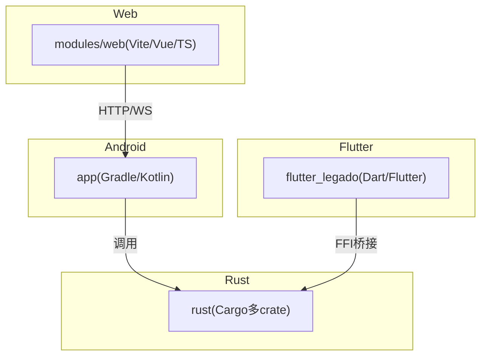
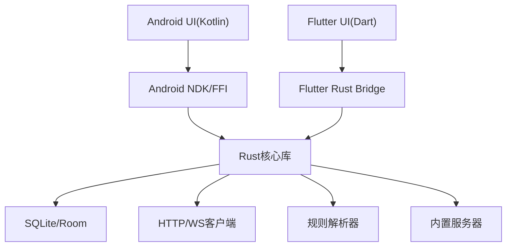
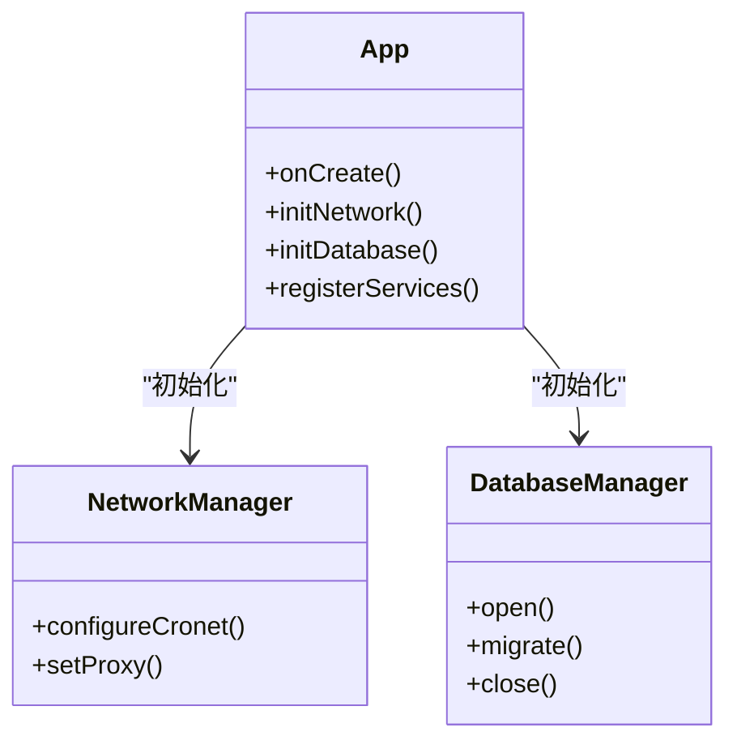
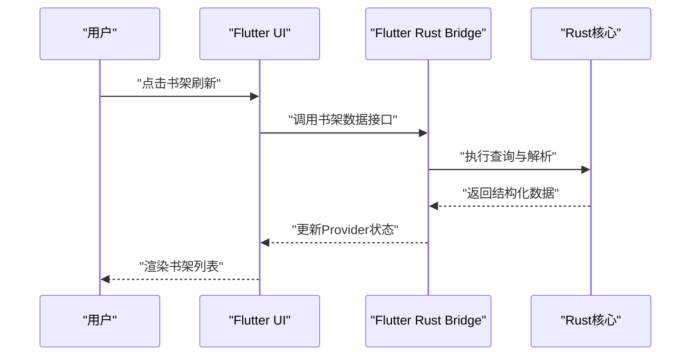
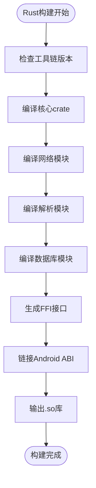
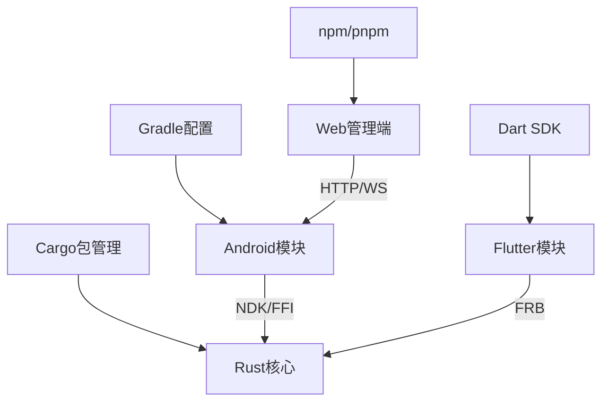

# 开发指南

<cite>
**本文档引用的文件**   
- [README.md](file://README.md)
- [Makefile](file://Makefile)
- [package.json](file://package.json)
- [gradle.properties](file://gradle.properties)
- [settings.gradle](file://settings.gradle)
- [build.gradle](file://build.gradle)
- [app/build.gradle](file://app/build.gradle)
- [flutter_legado/pubspec.yaml](file://flutter_legado/pubspec.yaml)
- [flutter_legado/analysis_options.yaml](file://flutter_legado/analysis_options.yaml)
- [flutter_legado/flutter_rust_bridge.yaml](file://flutter_legado/flutter_rust_bridge.yaml)
- [rust/Cargo.toml](file://rust/Cargo.toml)
- [rust/rust-toolchain.toml](file://rust/rust-toolchain.toml)
- [rust/DEVELOPMENT.md](file://rust/DEVELOPMENT.md)
- [modules/web/package.json](file://modules/web/package.json)
- [modules/web/eslint.config.mjs](file://modules/web/eslint.config.mjs)
- [modules/web/.prettierrc.json](file://modules/web/.prettierrc.json)
- [app/src/main/java/io/legado/app/App.kt](file://app/src/main/java/io/legado/app/App.kt)
- [app/src/androidTest/java/io/legado/app/AndroidJsTest.kt](file://app/src/androidTest/java/io/legado/app/AndroidJsTest.kt)
- [app/src/test/java/io/legado/app/ExampleUnitTest.kt](file://app/src/test/java/io/legado/app/ExampleUnitTest.kt)
- [flutter_legado/lib/main.dart](file://flutter_legado/lib/main.dart)
- [flutter_legado/lib/app.dart](file://flutter_legado/lib/app.dart)
- [flutter_legado/test/unit/bookshelf_provider_test.dart](file://flutter_legado/test/unit/bookshelf_provider_test.dart)
- [flutter_legado/test/widget/badge_widget_test.dart](file://flutter_legado/test/widget/badge_widget_test.dart)
</cite>

## 目录
1. [简介](#简介)
2. [项目结构](#项目结构)
3. [核心组件](#核心组件)
4. [架构总览](#架构总览)
5. [详细组件分析](#详细组件分析)
6. [依赖关系分析](#依赖关系分析)
7. [性能考量](#性能考量)
8. [故障排查指南](#故障排查指南)
9. [结论](#结论)
10. [附录](#附录)

## 简介
本指南面向Legado项目的开发者，覆盖从环境搭建、代码规范、调试技巧、模块组织、测试策略到协作流程的全链路开发实践。项目采用多语言、多平台混合架构：Android原生（Kotlin）、Flutter跨平台界面、Rust高性能核心与FFI桥接、以及Web管理端（Vue/TS）。通过统一的工作流与工具链，确保高质量交付与高效协作。

## 项目结构
仓库采用多模块、多语言工程组织方式：
- app：Android应用主模块（Kotlin/Gradle）
- flutter_legado：Flutter跨平台UI层（Dart/Flutter）
- rust：Rust核心库与FFI桥接（Cargo多crate）
- modules/web：Web管理端（Vite/Vue/TypeScript）
- gradle、Makefile、package.json等顶层构建脚本与配置

图表来源
- [settings.gradle](file://settings.gradle)
- [build.gradle](file://build.gradle)
- [app/build.gradle](file://app/build.gradle)
- [flutter_legado/pubspec.yaml](file://flutter_legado/pubspec.yaml)
- [rust/Cargo.toml](file://rust/Cargo.toml)
- [modules/web/package.json](file://modules/web/package.json)

章节来源
- [README.md](file://README.md)
- [Makefile](file://Makefile)
- [package.json](file://package.json)
- [settings.gradle](file://settings.gradle)
- [build.gradle](file://build.gradle)
- [app/build.gradle](file://app/build.gradle)
- [flutter_legado/pubspec.yaml](file://flutter_legado/pubspec.yaml)
- [rust/Cargo.toml](file://rust/Cargo.toml)
- [modules/web/package.json](file://modules/web/package.json)

## 核心组件
- Android应用入口与初始化：App.kt作为应用启动与全局初始化点，负责依赖注入、网络、数据库、服务注册等。
- Flutter应用入口：main.dart与app.dart定义应用生命周期、路由与主题。
- Rust核心：多crate划分清晰，包含book解析、core业务逻辑、db持久化、ffi桥接、net网络、parser规则解析、server服务等。
- Web管理端：基于Vite+Vue的源码编辑、书架管理与调试工具。

章节来源
- [app/src/main/java/io/legado/app/App.kt](file://app/src/main/java/io/legado/app/App.kt)
- [flutter_legado/lib/main.dart](file://flutter_legado/lib/main.dart)
- [flutter_legado/lib/app.dart](file://flutter_legado/lib/app.dart)
- [rust/Cargo.toml](file://rust/Cargo.toml)
- [modules/web/package.json](file://modules/web/package.json)

## 架构总览
整体架构遵循“前端UI + 中间层桥接 + 高性能核心”的分层模式：
- UI层：Android原生与Flutter双通道，提供一致的阅读体验与管理界面
- 桥接层：Flutter Rust Bridge与Android NDK/FFI将Rust能力暴露给上层
- 核心层：Rust实现高并发、高性能的数据处理、网络请求、规则解析与本地存储
- 服务端：内置HTTP/WebSocket服务，供Web端与外部集成

图表来源
- [flutter_legado/flutter_rust_bridge.yaml](file://flutter_legado/flutter_rust_bridge.yaml)
- [rust/DEVELOPMENT.md](file://rust/DEVELOPMENT.md)
- [app/build.gradle](file://app/build.gradle)
- [rust/Cargo.toml](file://rust/Cargo.toml)

## 详细组件分析

### Android应用组件
- 应用初始化：在App.kt中完成全局配置、日志、网络、数据库、权限与服务注册
- 模块化组织：按功能分包（api、base、constant、data、help、lib、model、receiver、service、ui、utils、web）
- 资源管理：res下按类型与维度组织布局、样式、图片与国际化资源

图表来源
- [app/src/main/java/io/legado/app/App.kt](file://app/src/main/java/io/legado/app/App.kt)
- [app/build.gradle](file://app/build.gradle)

章节来源
- [app/src/main/java/io/legado/app/App.kt](file://app/src/main/java/io/legado/app/App.kt)
- [app/build.gradle](file://app/build.gradle)

### Flutter应用组件
- 入口与路由：main.dart启动应用，app.dart定义主题、路由与状态管理
- 插件与桥接：通过flutter_rust_bridge.yaml生成桥接代码，调用Rust核心能力
- 测试分层：unit与widget测试覆盖核心Provider与UI组件

图表来源
- [flutter_legado/lib/main.dart](file://flutter_legado/lib/main.dart)
- [flutter_legado/lib/app.dart](file://flutter_legado/lib/app.dart)
- [flutter_legado/flutter_rust_bridge.yaml](file://flutter_legado/flutter_rust_bridge.yaml)

章节来源
- [flutter_legado/lib/main.dart](file://flutter_legado/lib/main.dart)
- [flutter_legado/lib/app.dart](file://flutter_legado/lib/app.dart)
- [flutter_legado/flutter_rust_bridge.yaml](file://flutter_legado/flutter_rust_bridge.yaml)

### Rust核心组件
- 多crate设计：legado-core（业务逻辑）、legado-db（数据访问）、legado-ffi（FFI导出）、legado-net（网络）、legado-parser（规则解析）、legado-server（HTTP服务）、legado-book（电子书格式支持）
- 工具链配置：rust-toolchain.toml锁定版本，Cargo.toml管理依赖与特性开关
- 开发文档：DEVELOPMENT.md提供构建、调试与发布指引

图表来源
- [rust/rust-toolchain.toml](file://rust/rust-toolchain.toml)
- [rust/Cargo.toml](file://rust/Cargo.toml)
- [rust/DEVELOPMENT.md](file://rust/DEVELOPMENT.md)

章节来源
- [rust/Cargo.toml](file://rust/Cargo.toml)
- [rust/rust-toolchain.toml](file://rust/rust-toolchain.toml)
- [rust/DEVELOPMENT.md](file://rust/DEVELOPMENT.md)

### Web管理端组件
- 技术栈：Vite + Vue 3 + TypeScript，使用ESLint与Prettier保证代码质量
- 功能模块：书架管理、源码编辑、调试面板、API调用封装
- 构建脚本：package.json定义开发与生产构建命令

图表来源
- [modules/web/package.json](file://modules/web/package.json)
- [modules/web/eslint.config.mjs](file://modules/web/eslint.config.mjs)
- [modules/web/.prettierrc.json](file://modules/web/.prettierrc.json)

章节来源
- [modules/web/package.json](file://modules/web/package.json)
- [modules/web/eslint.config.mjs](file://modules/web/eslint.config.mjs)
- [modules/web/.prettierrc.json](file://modules/web/.prettierrc.json)

## 依赖关系分析
项目依赖关系呈现清晰的层次结构：
- Android模块依赖Gradle插件与第三方库
- Flutter模块依赖Dart SDK与Flutter框架，通过bridge.yaml生成Rust绑定
- Rust模块通过Cargo管理内部crate依赖与外部crate
- Web模块通过npm/pnpm管理前端依赖

图表来源
- [gradle.properties](file://gradle.properties)
- [settings.gradle](file://settings.gradle)
- [build.gradle](file://build.gradle)
- [flutter_legado/pubspec.yaml](file://flutter_legado/pubspec.yaml)
- [rust/Cargo.toml](file://rust/Cargo.toml)
- [modules/web/package.json](file://modules/web/package.json)

章节来源
- [gradle.properties](file://gradle.properties)
- [settings.gradle](file://settings.gradle)
- [build.gradle](file://build.gradle)
- [flutter_legado/pubspec.yaml](file://flutter_legado/pubspec.yaml)
- [rust/Cargo.toml](file://rust/Cargo.toml)
- [modules/web/package.json](file://modules/web/package.json)

## 性能考量
- Rust核心：利用零成本抽象与异步IO提升数据处理与网络请求性能
- Flutter UI：合理使用Provider状态管理，避免不必要的重建
- Android优化：启用R8混淆与资源压缩，减少APK体积
- 缓存策略：本地SQLite与内存缓存结合，降低重复计算开销
- 网络优化：连接池、重试机制与超时控制

## 故障排查指南
- Android调试：使用Android Studio调试器、Logcat查看日志、Profiler分析性能
- Flutter调试：使用DevTools进行性能分析、Widget检查与网络监控
- Rust调试：使用cargo build --target aarch64-linux-android配合LLDB调试
- Web调试：浏览器开发者工具进行网络请求与DOM检查
- 常见问题：依赖冲突、版本不匹配、路径配置错误等

章节来源
- [app/src/androidTest/java/io/legado/app/AndroidJsTest.kt](file://app/src/androidTest/java/io/legado/app/AndroidJsTest.kt)
- [app/src/test/java/io/legado/app/ExampleUnitTest.kt](file://app/src/test/java/io/legado/app/ExampleUnitTest.kt)
- [flutter_legado/test/unit/bookshelf_provider_test.dart](file://flutter_legado/test/unit/bookshelf_provider_test.dart)
- [flutter_legado/test/widget/badge_widget_test.dart](file://flutter_legado/test/widget/badge_widget_test.dart)

## 结论
Legado项目通过多语言、多平台的混合架构实现了高性能、可扩展的阅读应用。统一的开发规范、完善的测试策略与高效的协作流程确保了代码质量与团队效率。建议开发者严格遵循本指南的环境配置、编码规范与调试方法，以获得最佳开发体验。

## 附录

### 开发环境搭建
- JDK：安装JDK 11或更高版本，配置JAVA_HOME环境变量
- Android SDK：通过Android Studio安装最新SDK与构建工具
- Flutter SDK：下载并配置Flutter SDK，运行flutter doctor检查环境
- Rust工具链：使用rustup安装稳定版工具链，配置目标平台
- Node.js：安装LTS版本，用于Web模块构建

### 代码规范与最佳实践
- Kotlin编码规范：遵循Google Kotlin风格指南，使用Ktlint进行格式化
- Dart风格指南：遵循Dart官方风格指南，使用dart format与analysis_options.yaml
- Rust编程约定：遵循Rust官方风格指南，使用rustfmt与clippy检查
- JavaScript/TypeScript：使用ESLint与Prettier统一代码风格

### 调试技巧与工具
- Android Studio：断点调试、内存分析、网络监控
- Flutter DevTools：性能分析、Widget树检查、热重载
- Rust调试器：cargo build + LLDB组合调试
- 浏览器开发者工具：网络请求、控制台日志、性能分析

### 项目结构与模块组织
- 分层架构：UI层、业务层、数据层清晰分离
- 命名约定：类名大驼峰、函数小驼峰、常量全大写
- 文件组织：按功能模块分包，公共资源集中管理

### 测试策略与框架
- 单元测试：JUnit（Android）、Dart Test（Flutter）、Cargo Test（Rust）
- 集成测试：Espresso（Android）、Integration Test（Flutter）
- UI测试：Flutter Driver、自定义UI测试用例

### 贡献指南与协作流程
- Git工作流：Feature分支开发，Pull Request合并
- 代码审查：至少一名维护者审查通过
- Issue管理：Bug报告与功能请求模板
- CI/CD：自动化构建、测试与发布流程

章节来源
- [Makefile](file://Makefile)
- [package.json](file://package.json)
- [flutter_legado/analysis_options.yaml](file://flutter_legado/analysis_options.yaml)
- [modules/web/eslint.config.mjs](file://modules/web/eslint.config.mjs)
- [modules/web/.prettierrc.json](file://modules/web/.prettierrc.json)
- [rust/DEVELOPMENT.md](file://rust/DEVELOPMENT.md)