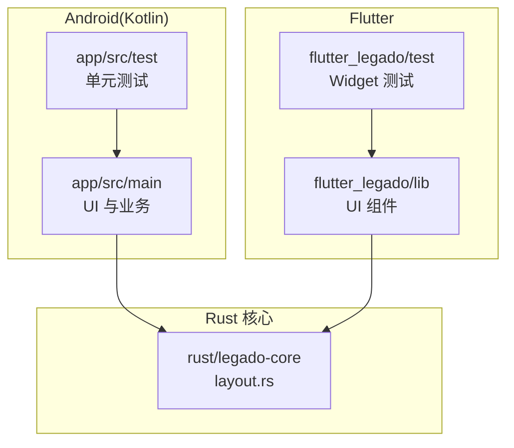
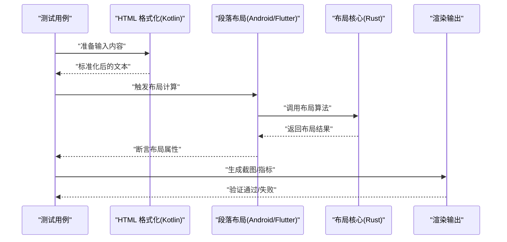
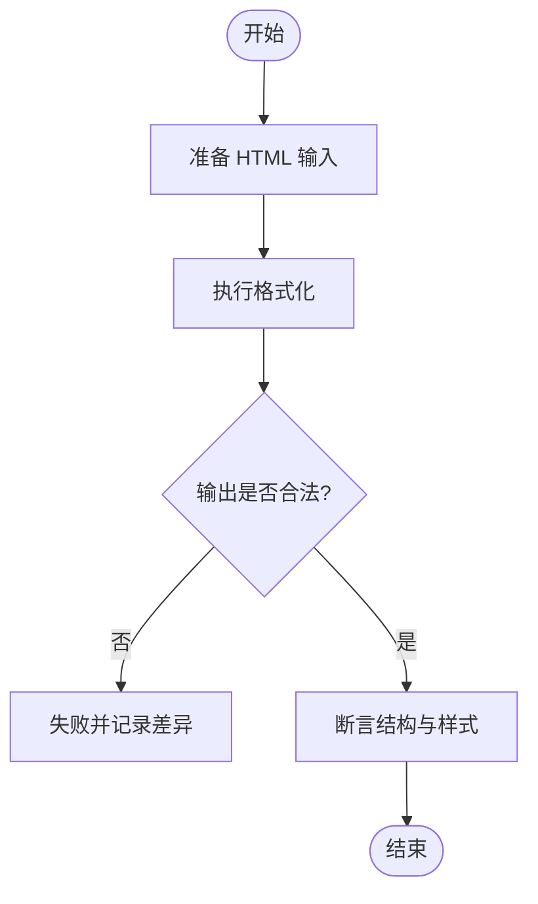
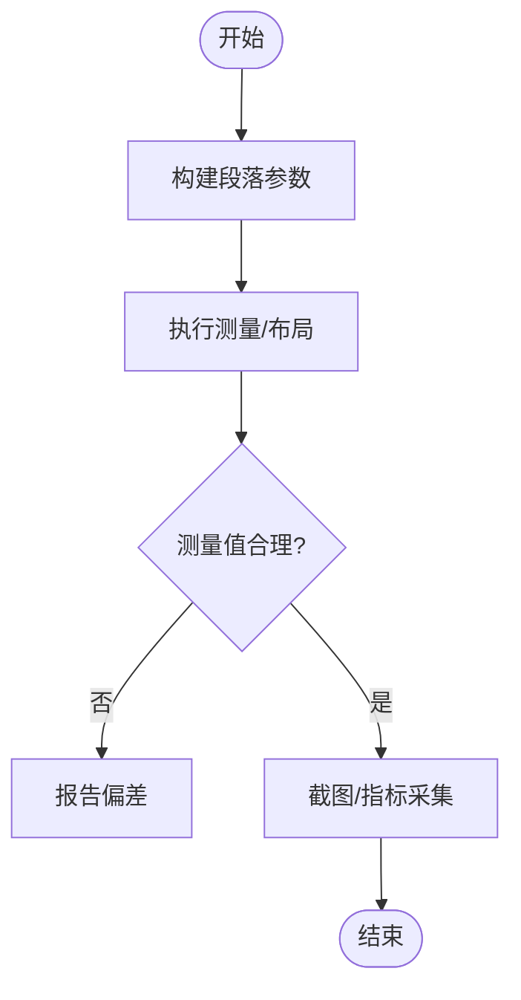
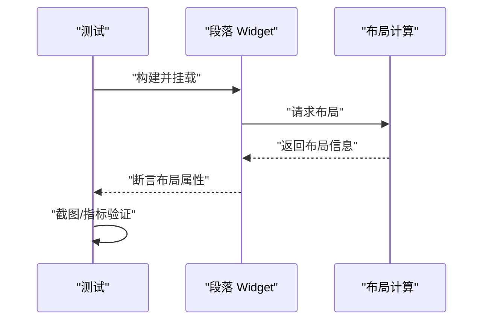
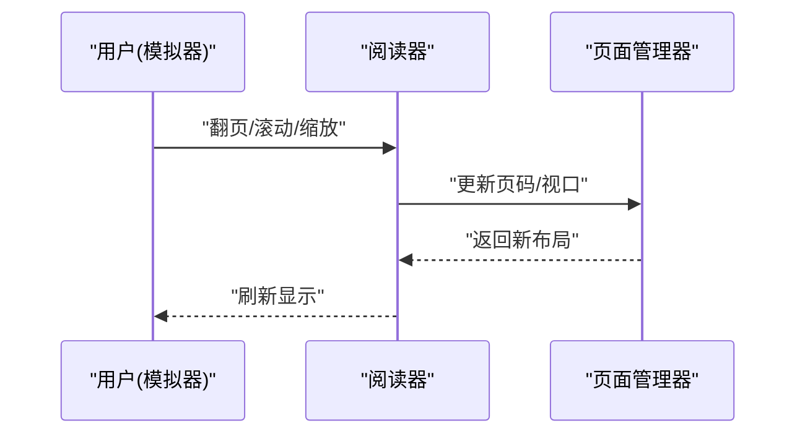
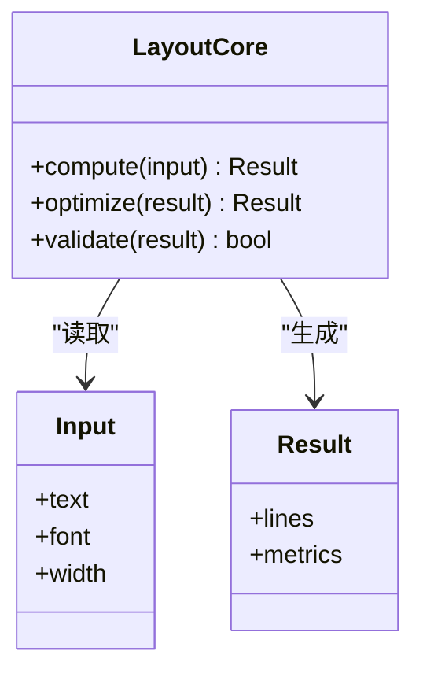
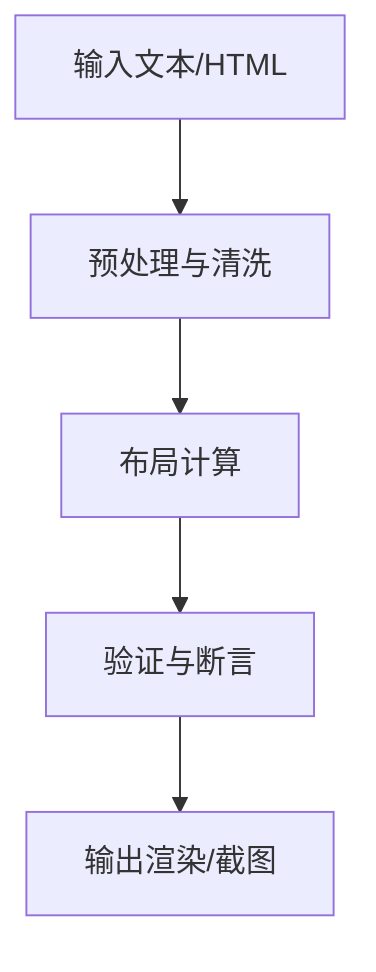
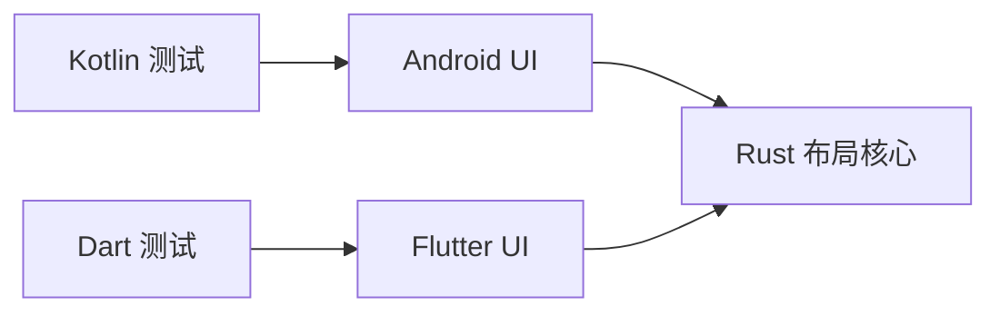

# 排版引擎测试框架

<cite>
**本文引用的文件**   
- [KOTLIN_LAYOUT_ANALYSIS.md](file://KOTLIN_LAYOUT_ANALYSIS.md)
- [README.md](file://README.md)
- [app/src/test/java/io/legado/app/utils/HtmlFormatterTest.kt](file://app/src/test/java/io/legado/app/utils/HtmlFormatterTest.kt)
- [app/src/test/java/io/legado/app/ui/widget/paragraph/ParagraphLayoutTest.kt](file://app/src/test/java/io/legado/app/ui/widget/paragraph/ParagraphLayoutTest.kt)
- [flutter_legado/test/widget/paragraph_layout_test.dart](file://flutter_legado/test/widget/paragraph_layout_test.dart)
- [flutter_legado/test/widget/reader_test.dart](file://flutter_legado/test/widget/reader_test.dart)
- [rust/legado-core/src/layout.rs](file://rust/legado-core/src/layout.rs)
</cite>

## 目录
1. [简介](#简介)
2. [项目结构](#项目结构)
3. [核心组件](#核心组件)
4. [架构总览](#架构总览)
5. [详细组件分析](#详细组件分析)
6. [依赖关系分析](#依赖关系分析)
7. [性能考量](#性能考量)
8. [故障排查指南](#故障排查指南)
9. [结论](#结论)
10. [附录](#附录)

## 简介
本文件围绕“排版引擎测试框架”展开，聚焦 Legado 项目中与文本排版、渲染和阅读体验相关的测试体系。内容涵盖 Android/Kotlin 侧的单元测试、Flutter 侧的 Widget 测试，以及 Rust 核心库中的布局模块。文档旨在帮助读者理解：
- 排版相关能力在哪些层被测试覆盖
- 测试如何组织与运行
- 关键数据流与调用链
- 常见问题定位与优化建议

## 项目结构
Legado 采用多语言、多模块协作：
- Android（Kotlin）：应用层 UI 与业务逻辑，包含大量单元测试与仪器化测试
- Flutter：跨平台 UI 层，提供 Widget 级测试
- Rust：核心能力（如布局、网络、数据库等），通过 FFI 暴露给上层

与排版引擎测试直接相关的目录与文件包括：
- app/src/test 下的 Kotlin 单元测试（HTML 格式化、UI 组件等）
- flutter_legado/test 下的 Dart 测试（段落布局、阅读器组件等）
- rust/legado-core 中的 layout.rs（布局核心实现）

图表来源
- [app/src/test/java/io/legado/app/utils/HtmlFormatterTest.kt](file://app/src/test/java/io/legado/app/utils/HtmlFormatterTest.kt)
- [flutter_legado/test/widget/paragraph_layout_test.dart](file://flutter_legado/test/widget/paragraph_layout_test.dart)
- [rust/legado-core/src/layout.rs](file://rust/legado-core/src/layout.rs)

章节来源
- [README.md](file://README.md)
- [KOTLIN_LAYOUT_ANALYSIS.md](file://KOTLIN_LAYOUT_ANALYSIS.md)

## 核心组件
- HTML 格式化测试（Kotlin）：验证 HTML 内容的清洗、格式化与输出一致性，确保后续排版输入稳定可靠
- 段落布局测试（Kotlin）：针对 UI 层的段落渲染进行断言，保证换行、对齐、间距等符合预期
- 段落布局测试（Dart/Flutter）：对 Flutter 端的段落布局组件进行单元级验证，覆盖不同屏幕尺寸与字体场景
- 阅读器组件测试（Dart/Flutter）：模拟翻页、滚动、缩放等交互，保障阅读体验稳定性
- 布局核心（Rust）：提供高性能的布局计算能力，供 Android 与 Flutter 共同调用

章节来源
- [app/src/test/java/io/legado/app/utils/HtmlFormatterTest.kt](file://app/src/test/java/io/legado/app/utils/HtmlFormatterTest.kt)
- [app/src/test/java/io/legado/app/ui/widget/paragraph/ParagraphLayoutTest.kt](file://app/src/test/java/io/legado/app/ui/widget/paragraph/ParagraphLayoutTest.kt)
- [flutter_legado/test/widget/paragraph_layout_test.dart](file://flutter_legado/test/widget/paragraph_layout_test.dart)
- [flutter_legado/test/widget/reader_test.dart](file://flutter_legado/test/widget/reader_test.dart)
- [rust/legado-core/src/layout.rs](file://rust/legado-core/src/layout.rs)

## 架构总览
排版引擎测试贯穿三层：
- 输入层：HTML/富文本预处理与校验（Kotlin）
- 展示层：Android 与 Flutter 的段落与阅读器组件（Kotlin/Dart）
- 计算层：Rust 布局算法（layout.rs）

图表来源
- [app/src/test/java/io/legado/app/utils/HtmlFormatterTest.kt](file://app/src/test/java/io/legado/app/utils/HtmlFormatterTest.kt)
- [flutter_legado/test/widget/paragraph_layout_test.dart](file://flutter_legado/test/widget/paragraph_layout_test.dart)
- [rust/legado-core/src/layout.rs](file://rust/legado-core/src/layout.rs)

## 详细组件分析

### HTML 格式化测试（Kotlin）
- 目标：确保 HTML 输入经过清洗与格式化后，具备稳定的结构与样式，避免影响后续排版
- 关注点：标签清理、属性规范化、空白处理、编码一致性
- 典型流程：构造输入 -> 执行格式化 -> 断言输出结构 -> 对比基准

图表来源
- [app/src/test/java/io/legado/app/utils/HtmlFormatterTest.kt](file://app/src/test/java/io/legado/app/utils/HtmlFormatterTest.kt)

章节来源
- [app/src/test/java/io/legado/app/utils/HtmlFormatterTest.kt](file://app/src/test/java/io/legado/app/utils/HtmlFormatterTest.kt)

### 段落布局测试（Kotlin）
- 目标：验证 Android 端段落渲染的换行、对齐、行高、边距等是否符合设计
- 关注点：字体、字号、屏幕密度、文本长度变化
- 典型流程：构建段落 -> 触发布局 -> 断言测量结果 -> 截图比对

图表来源
- [app/src/test/java/io/legado/app/ui/widget/paragraph/ParagraphLayoutTest.kt](file://app/src/test/java/io/legado/app/ui/widget/paragraph/ParagraphLayoutTest.kt)

章节来源
- [app/src/test/java/io/legado/app/ui/widget/paragraph/ParagraphLayoutTest.kt](file://app/src/test/java/io/legado/app/ui/widget/paragraph/ParagraphLayoutTest.kt)

### 段落布局测试（Dart/Flutter）
- 目标：在 Flutter 端验证段落布局在不同设备与主题下的一致性
- 关注点：响应式布局、主题切换、字体加载
- 典型流程：初始化 Widget -> 触发重绘 -> 断言布局树 -> 截图比对

图表来源
- [flutter_legado/test/widget/paragraph_layout_test.dart](file://flutter_legado/test/widget/paragraph_layout_test.dart)

章节来源
- [flutter_legado/test/widget/paragraph_layout_test.dart](file://flutter_legado/test/widget/paragraph_layout_test.dart)

### 阅读器组件测试（Dart/Flutter）
- 目标：验证翻页、滚动、缩放等交互行为与视觉表现
- 关注点：状态管理、事件分发、性能指标
- 典型流程：模拟用户操作 -> 检查状态变化 -> 断言渲染结果

图表来源
- [flutter_legado/test/widget/reader_test.dart](file://flutter_legado/test/widget/reader_test.dart)

章节来源
- [flutter_legado/test/widget/reader_test.dart](file://flutter_legado/test/widget/reader_test.dart)

### 布局核心（Rust）
- 目标：提供高效、可复用的布局算法，支撑 Android 与 Flutter 的渲染需求
- 关注点：时间复杂度、内存占用、边界条件处理
- 典型流程：接收输入 -> 计算行/列布局 -> 返回布局结果

图表来源
- [rust/legado-core/src/layout.rs](file://rust/legado-core/src/layout.rs)

章节来源
- [rust/legado-core/src/layout.rs](file://rust/legado-core/src/layout.rs)

### 概念性总览
以下流程图展示了从输入到输出的端到端排版测试路径，不绑定具体代码文件：

[本图为概念性示意，无需图表来源]

## 依赖关系分析
- Kotlin 测试依赖 Android UI 框架与工具库，用于测量与断言
- Dart 测试依赖 Flutter 测试框架与 Widget 树
- Rust 布局核心通过 FFI 被上层调用，需保证接口稳定与性能

图表来源
- [app/src/test/java/io/legado/app/utils/HtmlFormatterTest.kt](file://app/src/test/java/io/legado/app/utils/HtmlFormatterTest.kt)
- [flutter_legado/test/widget/paragraph_layout_test.dart](file://flutter_legado/test/widget/paragraph_layout_test.dart)
- [rust/legado-core/src/layout.rs](file://rust/legado-core/src/layout.rs)

章节来源
- [KOTLIN_LAYOUT_ANALYSIS.md](file://KOTLIN_LAYOUT_ANALYSIS.md)

## 性能考量
- 布局计算复杂度：优先使用线性或近似线性算法，避免 O(n^2) 的嵌套循环
- 内存占用：减少中间对象创建，复用缓冲区，及时释放大对象
- 渲染频率：合并多次布局请求，避免频繁重排
- 测试隔离：确保测试环境独立，避免共享状态导致的不稳定

[本节为通用指导，无需章节来源]

## 故障排查指南
- 格式化不一致：检查输入编码、标签闭合、属性合法性；对比基准输出
- 布局偏差：确认字体加载、字号、屏幕密度；检查约束条件（宽度、高度）
- 阅读器交互异常：验证事件监听、状态同步、异步回调
- 性能退化：使用 Profiler 定位热点函数，优化关键路径

[本节为通用指导，无需章节来源]

## 结论
Legado 的排版引擎测试框架覆盖了从输入处理到渲染输出的全链路，结合 Kotlin、Dart 与 Rust 的优势，形成多层次、高内聚的测试体系。通过严格的断言与截图比对，能够有效保障排版质量与用户体验。建议在持续集成中引入自动化回归测试，进一步提升稳定性与交付效率。

[本节为总结性内容，无需章节来源]

## 附录
- 参考文档：README.md、KOTLIN_LAYOUT_ANALYSIS.md
- 测试入口：各模块 test 目录下的对应测试文件
- 核心实现：rust/legado-core/src/layout.rs

[本节为补充信息，无需章节来源]