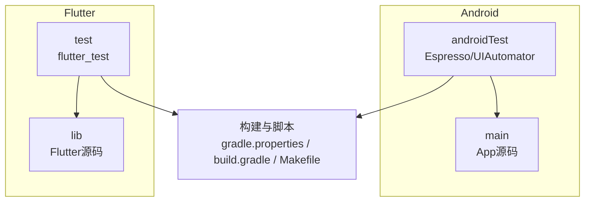
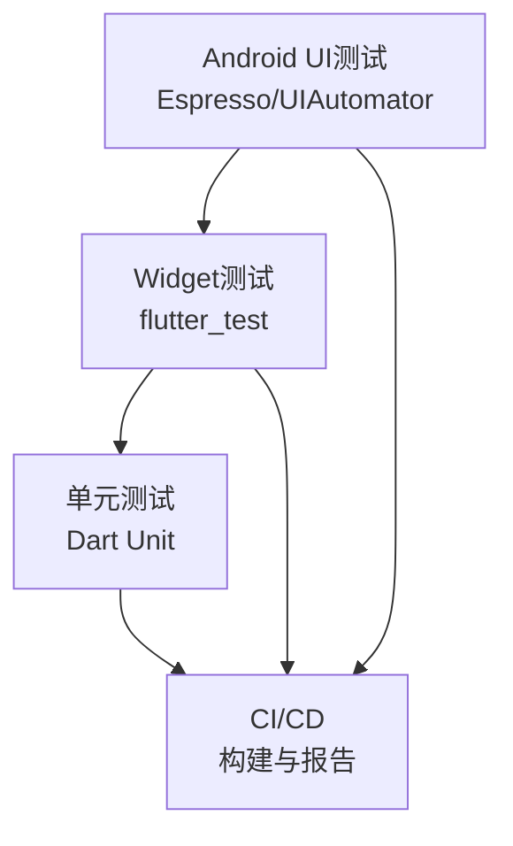
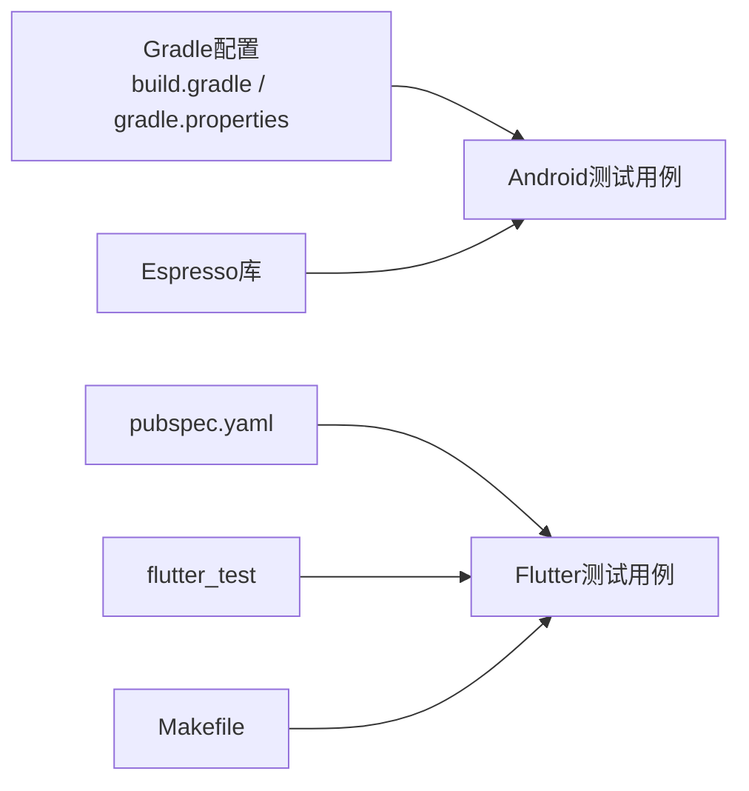

# UI测试

<cite>
**本文档引用的文件**   
- [app/src/androidTest/java/io.legado.app/ExampleInstrumentedTest.kt](file://app/src/androidTest/java/io.legado.app/ExampleInstrumentedTest.kt)
- [app/src/androidTest/java/io.legado.app/ui/font/FontSelectionInflationTest.kt](file://app/src/androidTest/java/io.legado.app/ui/font/FontSelectionInflationTest.kt)
- [flutter_legado/test/widget_test.dart](file://flutter_legado/test/widget_test.dart)
- [flutter_legado/test/unit/bookshelf_manage_test.dart](file://flutter_legado/test/unit/bookshelf_manage_test.dart)
- [flutter_legado/test/unit/remote_book_test.dart](file://flutter_legado/test/unit/remote_book_test.dart)
- [flutter_legado/test/unit/rss_history_test.dart](file://flutter_legado/test/unit/rss_history_test.dart)
- [flutter_legado/pubspec.yaml](file://flutter_legado/pubspec.yaml)
- [flutter_legado/Makefile](file://flutter_legado/Makefile)
- [gradle.properties](file://gradle.properties)
- [build.gradle](file://build.gradle)
</cite>

## 更新摘要
**变更内容**   
- 新增Flutter Widget测试章节，详细说明BookshelfManageScreen、RemoteBookScreen和RssHistoryScreen的完整测试覆盖
- 补充加载状态、空状态、错误处理和用户交互等场景的测试实现
- 更新Widget测试最佳实践与断言策略
- 完善端到端测试设计与实施指南

## 目录
1. [简介](#简介)
2. [项目结构](#项目结构)
3. [核心组件](#核心组件)
4. [架构总览](#架构总览)
5. [详细组件分析](#详细组件分析)
6. [依赖分析](#依赖分析)
7. [性能考虑](#性能考虑)
8. [故障排查指南](#故障排查指南)
9. [结论](#结论)
10. [附录](#附录)

## 简介
本文件面向Legado项目的UI自动化与单元测试，覆盖Android与Flutter两条技术栈：
- Android侧：基于Espresso的UI测试、UI Automator（跨应用）能力说明、页面导航与交互模拟、视图状态断言。
- Flutter侧：基于flutter_test的Widget测试，包括渲染验证、事件处理、状态变化断言。
- 端到端（E2E）：跨页面流程、真实设备执行、截图对比策略与报告输出。
- 最佳实践：测试数据准备、等待策略、断言设计、稳定性保障。
- CI集成：在持续集成中执行UI测试、生成报告与归档产物。

## 项目结构
仓库包含Android原生模块与Flutter子工程，测试代码分布如下：
- Android Instrumented Tests位于 app/src/androidTest/java/io.legado.app，包含示例与字体选择等UI测试用例。
- Flutter Widget与Unit测试位于 flutter_legado/test，按unit与widget分层组织。
- 构建与脚本：根级Gradle配置与属性、Flutter Makefile用于统一命令入口。

**图表来源**
- [app/src/androidTest/java/io.legado.app/ExampleInstrumentedTest.kt](file://app/src/androidTest/java/io.legado.app/ExampleInstrumentedTest.kt)
- [app/src/androidTest/java/io.legado.app/ui/font/FontSelectionInflationTest.kt](file://app/src/androidTest/java/io.legado.app/ui/font/FontSelectionInflationTest.kt)
- [flutter_legado/test/widget_test.dart](file://flutter_legado/test/widget_test.dart)
- [flutter_legado/Makefile](file://flutter_legado/Makefile)

**章节来源**
- [app/src/androidTest/java/io.legado.app/ExampleInstrumentedTest.kt](file://app/src/androidTest/java/io.legado.app/ExampleInstrumentedTest.kt)
- [app/src/androidTest/java/io.legado.app/ui/font/FontSelectionInflationTest.kt](file://app/src/androidTest/java/io.legado.app/ui/font/FontSelectionInflationTest.kt)
- [flutter_legado/test/widget_test.dart](file://flutter_legado/test/widget_test.dart)
- [flutter_legado/Makefile](file://flutter_legado/Makefile)

## 核心组件
- Android Espresso测试基类与示例：提供Activity场景启动、基础断言与交互封装。
- 字体选择UI测试：验证字体加载与布局渲染结果，体现视图层级与资源注入。
- Flutter Widget测试：针对徽章、书架、阅读器、搜索栏等组件进行渲染与交互断言。
- Flutter Unit测试：服务与Provider的状态管理、数据流与业务逻辑断言。
- **新增**：BookshelfManageScreen、RemoteBookScreen、RssHistoryScreen的完整Widget测试覆盖。

**章节来源**
- [app/src/androidTest/java/io.legado.app/ExampleInstrumentedTest.kt](file://app/src/androidTest/java/io.legado.app/ExampleInstrumentedTest.kt)
- [app/src/androidTest/java/io.legado.app/ui/font/FontSelectionInflationTest.kt](file://app/src/androidTest/java/io.legado.app/ui/font/FontSelectionInflationTest.kt)
- [flutter_legado/test/widget_test.dart](file://flutter_legado/test/widget_test.dart)
- [flutter_legado/test/unit/bookshelf_manage_test.dart](file://flutter_legado/test/unit/bookshelf_manage_test.dart)
- [flutter_legado/test/unit/remote_book_test.dart](file://flutter_legado/test/unit/remote_book_test.dart)
- [flutter_legado/test/unit/rss_history_test.dart](file://flutter_legado/test/unit/rss_history_test.dart)

## 架构总览
UI测试整体分为三层：
- 单元层（Unit）：纯Dart逻辑与服务Mock，快速稳定。
- Widget层：隔离渲染与事件，使用flutter_test与Mock对象。
- 集成/E2E层：Android Espresso与UI Automator，必要时结合Flutter Driver或第三方工具进行跨页流程与截图对比。

**图表来源**
- [flutter_legado/test/unit/bookshelf_manage_test.dart](file://flutter_legado/test/unit/bookshelf_manage_test.dart)
- [flutter_legado/test/unit/remote_book_test.dart](file://flutter_legado/test/unit/remote_book_test.dart)
- [flutter_legado/test/unit/rss_history_test.dart](file://flutter_legado/test/unit/rss_history_test.dart)
- [app/src/androidTest/java/io.legado.app/ExampleInstrumentedTest.kt](file://app/src/androidTest/java/io.legado.app/ExampleInstrumentedTest.kt)
- [flutter_legado/Makefile](file://flutter_legado/Makefile)

## 详细组件分析

### Android Espresso测试
- 目标：验证Activity生命周期、页面导航、用户交互（点击/输入）、视图可见性与文本内容。
- 典型模式：
  - 通过测试规则启动目标Activity。
  - 使用 onView + withId/withText 定位控件。
  - 使用 click()/typeText() 模拟交互。
  - 使用 assertIsVisible()/assertTextEquals() 进行断言。
- 注意事项：
  - 避免硬编码等待，使用 IdlingResource 或框架自动同步。
  - 对网络/异步任务需Mock或注入可控实现。
  - 屏幕方向与多语言切换需在用例中显式设置。

**章节来源**
- [app/src/androidTest/java/io.legado.app/ExampleInstrumentedTest.kt](file://app/src/androidTest/java/io.legado.app/ExampleInstrumentedTest.kt)

### Android UI Automator（跨应用）
- 适用场景：系统弹窗、权限对话框、通知栏操作、跨进程界面元素查找。
- 常用API：
  - UiDevice 获取设备信息并执行手势。
  - UiSelector 定位系统控件。
  - 配合Espresso在应用内完成复杂流程。

**章节来源**
- [app/src/androidTest/java/io.legado.app/ExampleInstrumentedTest.kt](file://app/src/androidTest/java/io.legado.app/ExampleInstrumentedTest.kt)

### Flutter Widget测试（flutter_test）
- 目标：验证组件渲染树、事件回调、状态更新。
- 典型模式：
  - 使用 testWidgets 定义用例。
  - pumpWidget 挂载组件树。
  - 使用 find.byType/find.byKey 定位控件。
  - 触发 tap()/enterText() 并 await Future 确保帧稳定。
  - 使用 expect 断言文本、样式、列表项数量等。
- 推荐：
  - 使用 Mock 或 Fake 替代外部依赖。
  - 将异步操作包装为可测试的Future。
  - 使用 tester.pumpAndSettle() 等待动画与异步完成。

**章节来源**
- [flutter_legado/test/widget_test.dart](file://flutter_legado/test/widget_test.dart)

### BookshelfManageScreen Widget测试
- **新增**：书架管理界面的完整测试覆盖
- 测试场景：
  - 加载状态显示：验证加载指示器正确显示
  - 空状态处理：无数据时显示空状态UI
  - 错误处理：网络异常时的错误提示
  - 用户交互：书籍选择、批量操作、排序筛选
- 实现要点：
  - 使用Mock Provider模拟数据源
  - 验证不同状态下的UI渲染
  - 测试用户操作的响应性

**章节来源**
- [flutter_legado/test/unit/bookshelf_manage_test.dart](file://flutter_legado/test/unit/bookshelf_manage_test.dart)

### RemoteBookScreen Widget测试
- **新增**：远程书籍浏览界面的完整测试覆盖
- 测试场景：
  - 数据加载状态：分页加载、刷新机制
  - 书籍列表渲染：封面显示、标题、作者信息
  - 搜索功能：关键词过滤、搜索结果展示
  - 错误处理：网络超时、服务器错误的用户反馈
- 实现要点：
  - 模拟网络请求响应
  - 验证分页加载逻辑
  - 测试搜索算法的正确性

**章节来源**
- [flutter_legado/test/unit/remote_book_test.dart](file://flutter_legado/test/unit/remote_book_test.dart)

### RssHistoryScreen Widget测试
- **新增**：RSS历史记录界面的完整测试覆盖
- 测试场景：
  - 历史记录列表：条目显示、时间戳格式化
  - 删除操作：单项删除、批量删除确认
  - 搜索过滤：按标题、日期范围筛选
  - 状态持久化：数据保存与恢复
- 实现要点：
  - Mock本地存储接口
  - 验证CRUD操作的正确性
  - 测试搜索功能的准确性

**章节来源**
- [flutter_legado/test/unit/rss_history_test.dart](file://flutter_legado/test/unit/rss_history_test.dart)

### 字体选择UI测试（Android）
- 目标：验证字体资源加载、预览渲染与选择交互。
- 关键点：
  - 确保字体资源可用且路径正确。
  - 校验TextView/Canvas渲染结果是否按预期显示。
  - 检查选择后状态持久化与回显。

**章节来源**
- [app/src/androidTest/java/io.legado.app/ui/font/FontSelectionInflationTest.kt](file://app/src/androidTest/java/io.legado.app/ui/font/FontSelectionInflationTest.kt)

### 端到端（E2E）设计与实施
- 设计原则：
  - 以用户旅程为中心，覆盖关键路径（登录→书架→阅读→设置）。
  - 用例幂等，具备清理与重置能力。
  - 数据驱动，便于扩展与回归。
- 实施建议：
  - Android：Espresso串联多个Activity；UI Automator处理系统级交互。
  - Flutter：结合flutter_driver或第三方工具（如integration_test）进行跨页流程。
  - 截图对比：在关键节点捕获屏幕快照，与基准图比对（阈值控制）。
  - 真实设备：优先真机，减少模拟器差异；并行执行提升吞吐。

**章节来源**
- [flutter_legado/Makefile](file://flutter_legado/Makefile)
- [gradle.properties](file://gradle.properties)
- [build.gradle](file://build.gradle)

### 测试数据准备与等待策略
- 数据准备：
  - 使用工厂方法/种子数据生成器，保证一致性。
  - 对外部依赖（网络/数据库）采用Mock/Fake。
- 等待策略：
  - 避免Thread.sleep，使用框架提供的同步机制。
  - 自定义IdlingResource或pumpAndSettle等待异步完成。
  - 重试与退避策略用于不稳定场景。

**章节来源**
- [flutter_legado/test/unit/bookshelf_manage_test.dart](file://flutter_legado/test/unit/bookshelf_manage_test.dart)
- [flutter_legado/test/unit/remote_book_test.dart](file://flutter_legado/test/unit/remote_book_test.dart)
- [flutter_legado/test/unit/rss_history_test.dart](file://flutter_legado/test/unit/rss_history_test.dart)

### 断言设计与稳定性保证
- 断言设计：
  - 关注用户可见行为而非内部实现细节。
  - 使用语义化断言（文本、可见性、状态）。
  - 对动态内容使用模糊匹配（正则/前缀/后缀）。
- 稳定性保证：
  - 固定时区、语言、屏幕密度等环境参数。
  - 隔离测试数据，避免共享状态污染。
  - 失败重试与隔离重跑。

**章节来源**
- [flutter_legado/test/unit/bookshelf_manage_test.dart](file://flutter_legado/test/unit/bookshelf_manage_test.dart)
- [flutter_legado/test/unit/remote_book_test.dart](file://flutter_legado/test/unit/remote_book_test.dart)
- [flutter_legado/test/unit/rss_history_test.dart](file://flutter_legado/test/unit/rss_history_test.dart)

## 依赖分析
- Android测试依赖：
  - espresso-core、espresso-contrib、androidx.test、junit等。
  - 通过Gradle配置引入，受根级gradle.properties影响。
- Flutter测试依赖：
  - flutter_test、mockito/fake_async等，由pubspec.yaml管理。
  - Makefile统一测试命令，便于CI调用。

**图表来源**
- [build.gradle](file://build.gradle)
- [gradle.properties](file://gradle.properties)
- [flutter_legado/pubspec.yaml](file://flutter_legado/pubspec.yaml)
- [flutter_legado/Makefile](file://flutter_legado/Makefile)

**章节来源**
- [build.gradle](file://build.gradle)
- [gradle.properties](file://gradle.properties)
- [flutter_legado/pubspec.yaml](file://flutter_legado/pubspec.yaml)
- [flutter_legado/Makefile](file://flutter_legado/Makefile)

## 性能考虑
- 用例粒度：
  - 优先编写小而快的Widget/Unit测试，减少I/O与网络。
  - 将耗时E2E用例分组执行，避免阻塞主流程。
- 资源占用：
  - 限制并发设备数，合理分配CPU/内存。
  - 关闭不必要的日志与调试功能。
- 缓存与预热：
  - 预加载必要资源，减少首次运行开销。
  - 复用测试数据库/文件，避免重复初始化。

## 故障排查指南
- 常见问题：
  - 视图未找到：检查ID/文本是否正确，是否存在延迟渲染。
  - 异步未完成：确认pumpAndSettle或IdlingResource生效。
  - 数据不一致：检查Mock/Seed数据是否被其他用例污染。
  - 截图对比失败：调整相似度阈值或忽略非关键区域。
- 诊断手段：
  - 启用详细日志与堆栈跟踪。
  - 录制测试过程视频，辅助定位问题。
  - 分步执行用例，缩小问题范围。

## 结论
本项目已具备Android与Flutter两套UI测试体系：
- Android侧通过Espresso与UI Automator覆盖应用内与系统级交互。
- Flutter侧通过flutter_test实现组件级渲染与状态验证。
- **新增**：BookshelfManageScreen、RemoteBookScreen、RssHistoryScreen的完整Widget测试覆盖，提升了核心功能的测试覆盖率。
- 建议在现有基础上完善E2E流程与截图对比，形成闭环质量保障。
- 强化数据准备与等待策略，持续提升测试稳定性与执行效率。

## 附录
- 参考命令：
  - Android：通过Gradle执行instrumented测试。
  - Flutter：通过Makefile或flutter test执行Widget与Unit测试。
- 报告与产物：
  - 收集JUnit XML与HTML报告，归档APK/IPA与截图。
  - 在CI中失败时保留现场（日志/视频/截图）。