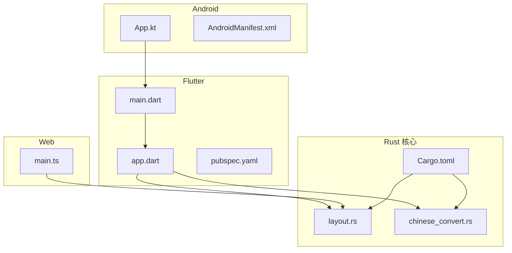
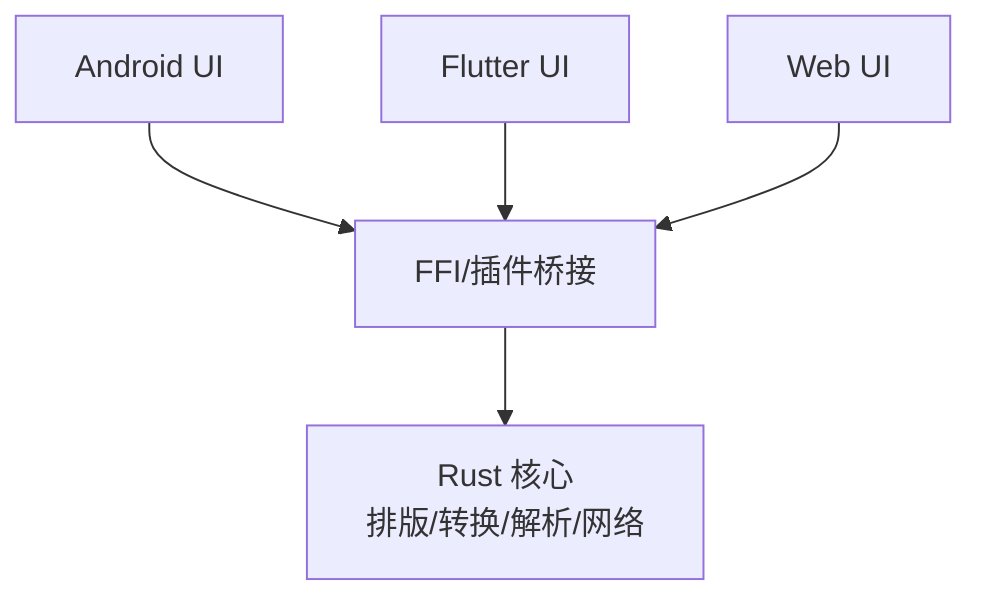
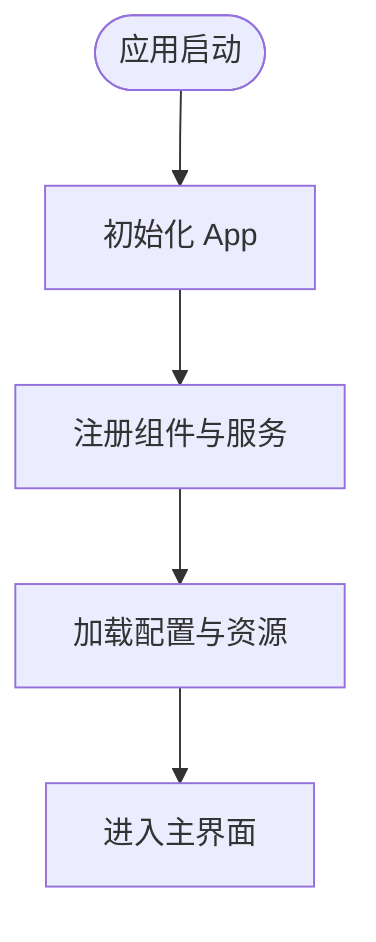
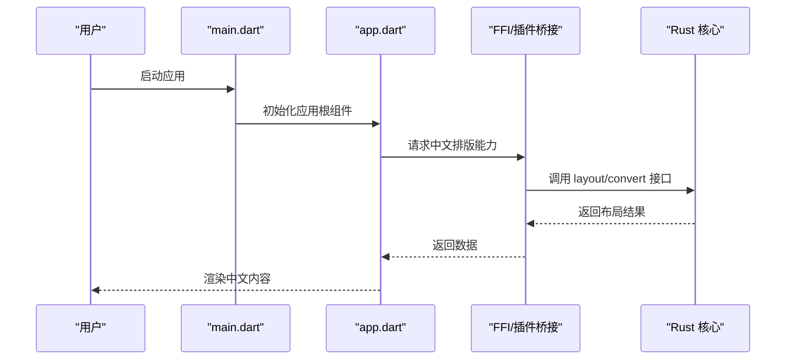
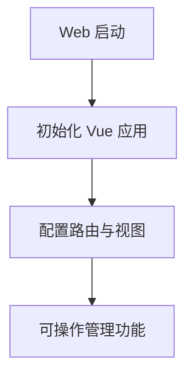
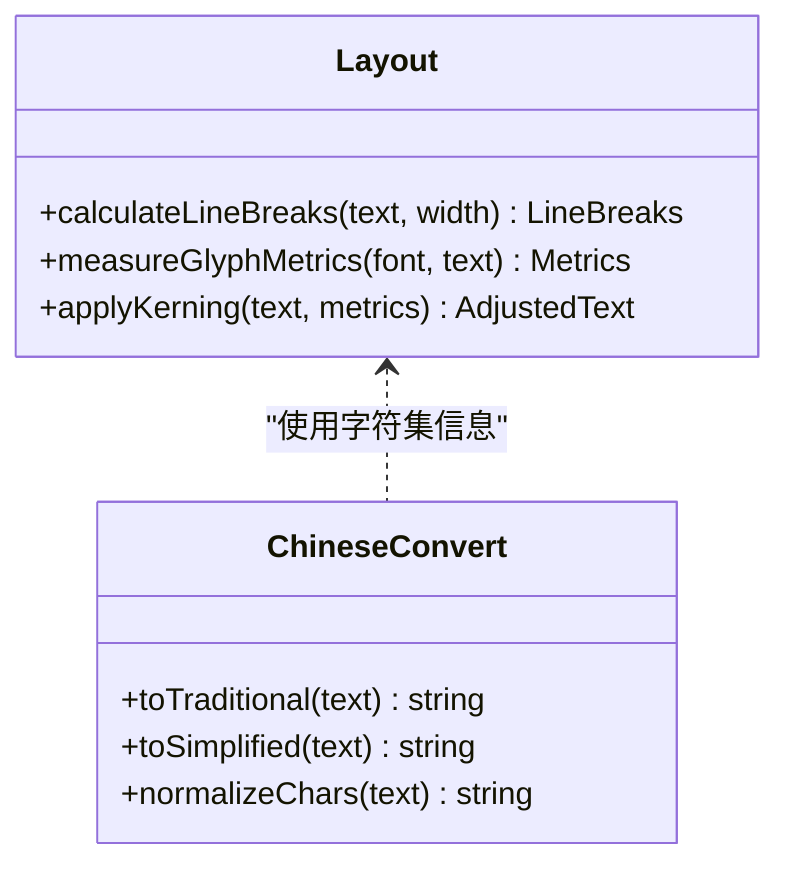
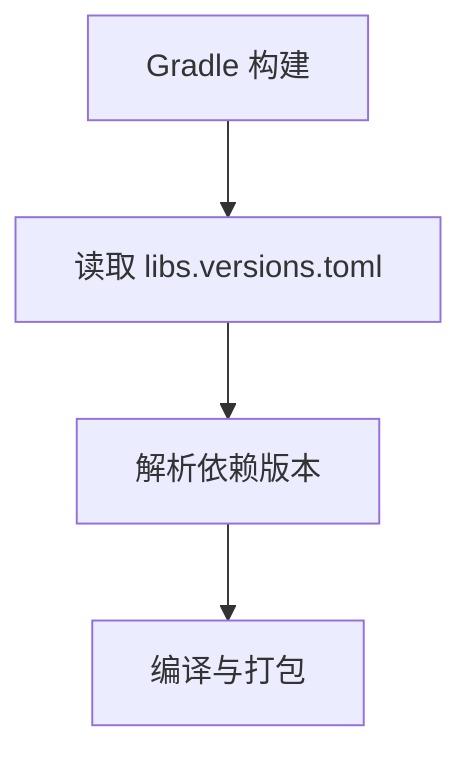
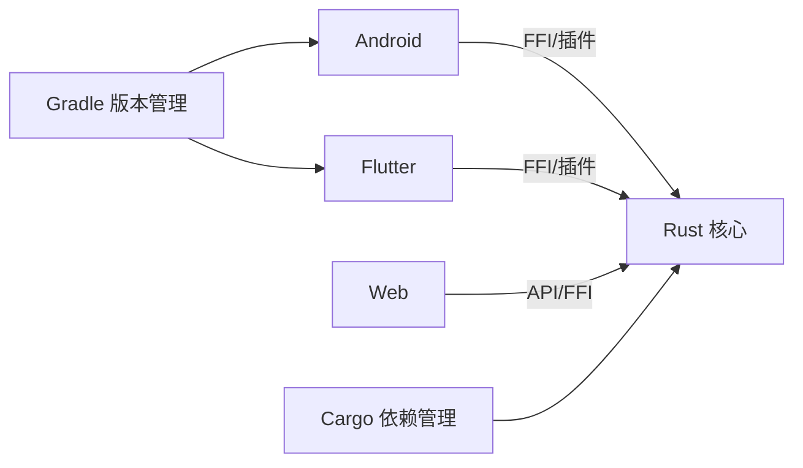

# 中文排版测试

<cite>
**本文档引用的文件**   
- [README.md](file://README.md)
- [KOTLIN_LAYOUT_ANALYSIS.md](file://KOTLIN_LAYOUT_ANALYSIS.md)
- [REFACTORING_FIX_REPORT.md](file://REFACTORING_FIX_REPORT.md)
- [VERSION_CONTROL.md](file://VERSION_CONTROL.md)
- [app/src/main/java/io/legado/app/App.kt](file://app/src/main/java/io/legado/app/App.kt)
- [app/src/main/AndroidManifest.xml](file://app/src/main/AndroidManifest.xml)
- [flutter_legado/lib/main.dart](file://flutter_legado/lib/main.dart)
- [flutter_legado/lib/app.dart](file://flutter_legado/lib/app.dart)
- [flutter_legado/pubspec.yaml](file://flutter_legado/pubspec.yaml)
- [modules/web/src/main.ts](file://modules/web/src/main.ts)
- [rust/legado-core/src/layout.rs](file://rust/legado-core/src/layout.rs)
- [rust/legado-core/src/chinese_convert.rs](file://rust/legado-core/src/chinese_convert.rs)
- [rust/legado-core/Cargo.toml](file://rust/legado-core/Cargo.toml)
- [gradle/libs.versions.toml](file://gradle/libs.versions.toml)
</cite>

## 目录
1. [简介](#简介)
2. [项目结构](#项目结构)
3. [核心组件](#核心组件)
4. [架构总览](#架构总览)
5. [详细组件分析](#详细组件分析)
6. [依赖分析](#依赖分析)
7. [性能考虑](#性能考虑)
8. [故障排查指南](#故障排查指南)
9. [结论](#结论)
10. [附录](#附录)

## 简介
本仓库是一个跨端阅读与内容处理应用，包含 Android 原生模块、Flutter 跨平台界面、Web 管理端以及 Rust 核心库。文档聚焦“中文排版”相关能力：文本布局、字体与字形处理、繁简转换、渲染管线与多端一致性。面向不同技术背景的读者提供由浅入深的说明、架构图与排障建议。

## 项目结构
- app（Android）：应用入口、资源、UI 与业务逻辑，负责集成底层能力并呈现用户界面。
- flutter_legado（Flutter）：跨平台 UI 层，统一体验，调用桥接层访问 Rust 能力。
- modules/web（Vue 前端）：Web 管理端，用于配置与管理。
- rust（Rust 核心）：提供高性能的解析、网络、数据库、音频、排版与本地化等能力，并通过 FFI 暴露给上层。
- gradle 与构建脚本：版本管理与构建配置。

**图示来源** 
- [app/src/main/java/io/legado/app/App.kt](file://app/src/main/java/io/legado/app/App.kt)
- [app/src/main/AndroidManifest.xml](file://app/src/main/AndroidManifest.xml)
- [flutter_legado/lib/main.dart](file://flutter_legado/lib/main.dart)
- [flutter_legado/lib/app.dart](file://flutter_legado/lib/app.dart)
- [flutter_legado/pubspec.yaml](file://flutter_legado/pubspec.yaml)
- [modules/web/src/main.ts](file://modules/web/src/main.ts)
- [rust/legado-core/src/layout.rs](file://rust/legado-core/src/layout.rs)
- [rust/legado-core/src/chinese_convert.rs](file://rust/legado-core/src/chinese_convert.rs)
- [rust/legado-core/Cargo.toml](file://rust/legado-core/Cargo.toml)

**章节来源**
- [README.md](file://README.md)
- [KOTLIN_LAYOUT_ANALYSIS.md](file://KOTLIN_LAYOUT_ANALYSIS.md)
- [REFACTORING_FIX_REPORT.md](file://REFACTORING_FIX_REPORT.md)
- [VERSION_CONTROL.md](file://VERSION_CONTROL.md)

## 核心组件
- 应用启动与初始化：Android App 入口负责全局初始化与能力注册；Flutter main 作为跨端入口；Web main 初始化 Web 环境。
- 中文排版核心（Rust）：提供文本布局计算、字体查询与繁简转换等能力，供 Flutter/Web/Android 调用。
- 构建与依赖：Gradle 与 Cargo 管理依赖版本与构建流程。

**章节来源**
- [app/src/main/java/io/legado/app/App.kt](file://app/src/main/java/io/legado/app/App.kt)
- [flutter_legado/lib/main.dart](file://flutter_legado/lib/main.dart)
- [flutter_legado/lib/app.dart](file://flutter_legado/lib/app.dart)
- [modules/web/src/main.ts](file://modules/web/src/main.ts)
- [rust/legado-core/src/layout.rs](file://rust/legado-core/src/layout.rs)
- [rust/legado-core/src/chinese_convert.rs](file://rust/legado-core/src/chinese_convert.rs)
- [gradle/libs.versions.toml](file://gradle/libs.versions.toml)

## 架构总览
整体采用“多端 UI + Rust 核心”的分层架构：
- 表现层：Android、Flutter、Web 分别实现各自平台的 UI。
- 桥接层：通过 FFI 或插件机制将 Rust 能力暴露给上层。
- 核心层：Rust 模块提供排版、语言转换、解析与网络等通用能力。

[此图为概念性架构示意，不直接映射具体源码文件]

## 详细组件分析

### Android 应用入口与清单
- App.kt：应用级初始化、依赖注入、服务注册与能力准备。
- AndroidManifest.xml：声明权限、组件、启动项与运行时特性。

**图示来源** 
- [app/src/main/java/io/legado/app/App.kt](file://app/src/main/java/io/legado/app/App.kt)
- [app/src/main/AndroidManifest.xml](file://app/src/main/AndroidManifest.xml)

**章节来源**
- [app/src/main/java/io/legado/app/App.kt](file://app/src/main/java/io/legado/app/App.kt)
- [app/src/main/AndroidManifest.xml](file://app/src/main/AndroidManifest.xml)

### Flutter 跨端入口与页面
- main.dart：Flutter 应用入口，设置主题、路由与初始化。
- app.dart：应用根组件，组织页面与状态。
- pubspec.yaml：声明依赖与构建配置。

**图示来源** 
- [flutter_legado/lib/main.dart](file://flutter_legado/lib/main.dart)
- [flutter_legado/lib/app.dart](file://flutter_legado/lib/app.dart)
- [flutter_legado/pubspec.yaml](file://flutter_legado/pubspec.yaml)

**章节来源**
- [flutter_legado/lib/main.dart](file://flutter_legado/lib/main.dart)
- [flutter_legado/lib/app.dart](file://flutter_legado/lib/app.dart)
- [flutter_legado/pubspec.yaml](file://flutter_legado/pubspec.yaml)

### Web 管理端入口
- main.ts：Web 应用初始化、路由与 API 接入。

**图示来源** 
- [modules/web/src/main.ts](file://modules/web/src/main.ts)

**章节来源**
- [modules/web/src/main.ts](file://modules/web/src/main.ts)

### Rust 核心：中文排版与转换
- layout.rs：文本布局算法、行高与字距控制、断行策略等。
- chinese_convert.rs：繁简转换、字符规范化与兼容处理。
- Cargo.toml：核心库依赖与编译选项。

**图示来源** 
- [rust/legado-core/src/layout.rs](file://rust/legado-core/src/layout.rs)
- [rust/legado-core/src/chinese_convert.rs](file://rust/legado-core/src/chinese_convert.rs)
- [rust/legado-core/Cargo.toml](file://rust/legado-core/Cargo.toml)

**章节来源**
- [rust/legado-core/src/layout.rs](file://rust/legado-core/src/layout.rs)
- [rust/legado-core/src/chinese_convert.rs](file://rust/legado-core/src/chinese_convert.rs)
- [rust/legado-core/Cargo.toml](file://rust/legado-core/Cargo.toml)

### 构建与依赖管理
- libs.versions.toml：集中管理第三方库版本，确保各模块一致性与可复现构建。

**图示来源** 
- [gradle/libs.versions.toml](file://gradle/libs.versions.toml)

**章节来源**
- [gradle/libs.versions.toml](file://gradle/libs.versions.toml)

## 依赖分析
- Android 与 Flutter 均依赖 Rust 核心提供的排版与转换能力，通过 FFI/插件桥接。
- Web 端可能通过 API 或直接调用 Rust 能力（取决于部署方式）。
- 构建系统统一版本管理，降低依赖冲突风险。

**图示来源** 
- [gradle/libs.versions.toml](file://gradle/libs.versions.toml)
- [rust/legado-core/Cargo.toml](file://rust/legado-core/Cargo.toml)

**章节来源**
- [gradle/libs.versions.toml](file://gradle/libs.versions.toml)
- [rust/legado-core/Cargo.toml](file://rust/legado-core/Cargo.toml)

## 性能考虑
- 文本布局与测量应在后台线程执行，避免阻塞 UI。
- 缓存常用字体的度量信息与断行结果，减少重复计算。
- 批量处理长文本，分块渲染以提升响应速度。
- 合理选择字体与字号，避免过大字形导致的重绘开销。

[本节为通用指导，不直接分析具体文件]

## 故障排查指南
- 中文显示异常：检查字体加载与字符集支持，确认繁简转换是否启用。
- 排版错位：核对行宽、字距与断行策略参数，验证输入文本编码。
- 跨端不一致：对比各端使用的 Rust 接口版本与参数，确保对齐。
- 构建失败：检查 libs.versions.toml 与 Cargo.toml 的版本一致性。

**章节来源**
- [KOTLIN_LAYOUT_ANALYSIS.md](file://KOTLIN_LAYOUT_ANALYSIS.md)
- [REFACTORING_FIX_REPORT.md](file://REFACTORING_FIX_REPORT.md)
- [VERSION_CONTROL.md](file://VERSION_CONTROL.md)

## 结论
本项目以 Rust 为核心，结合 Android、Flutter 与 Web 多端 UI，形成统一的中文排版与处理能力。通过清晰的层次划分与依赖管理，既保证了性能与稳定性，也提升了跨端一致性。建议在开发中持续关注字体与布局参数的调优，完善错误处理与日志记录，以提升用户体验与可维护性。

[本节为总结性内容，不直接分析具体文件]

## 附录
- 参考文档：README、Kotlin 布局分析、重构修复报告、版本控制规范。
- 关键路径：Android 入口、Flutter 入口、Web 入口、Rust 核心模块。

**章节来源**
- [README.md](file://README.md)
- [KOTLIN_LAYOUT_ANALYSIS.md](file://KOTLIN_LAYOUT_ANALYSIS.md)
- [REFACTORING_FIX_REPORT.md](file://REFACTORING_FIX_REPORT.md)
- [VERSION_CONTROL.md](file://VERSION_CONTROL.md)