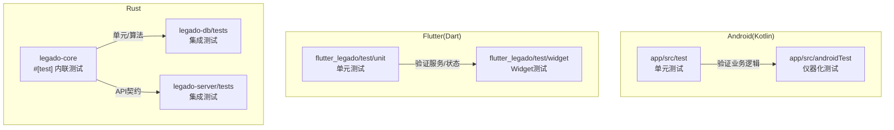
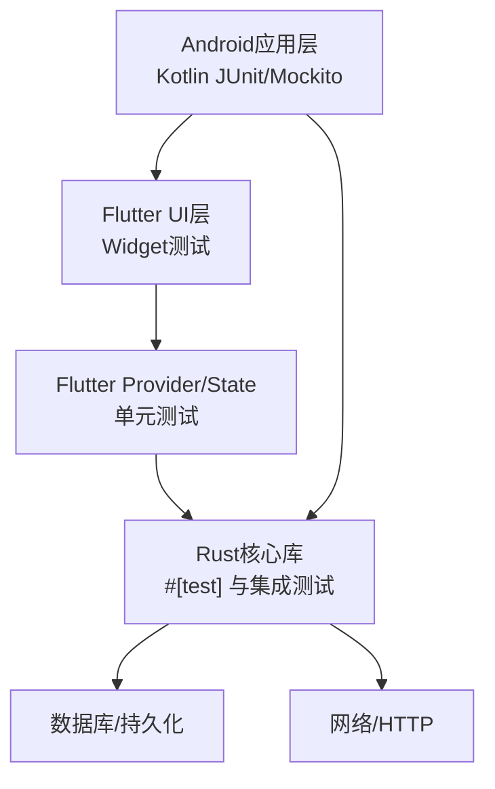
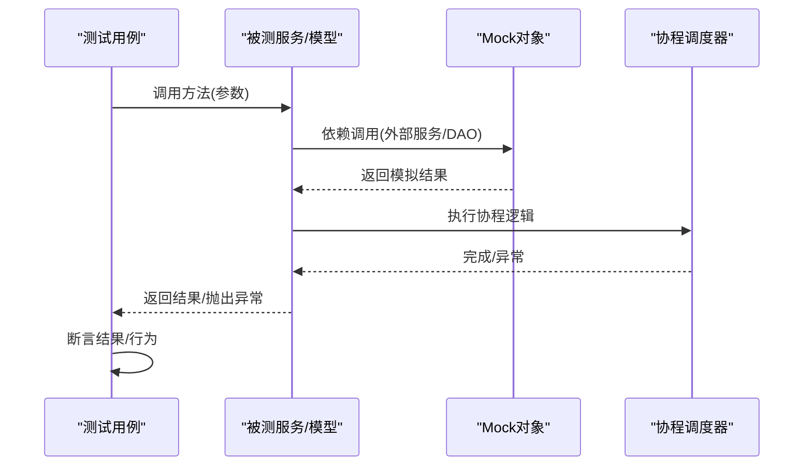
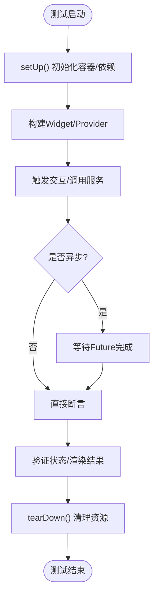
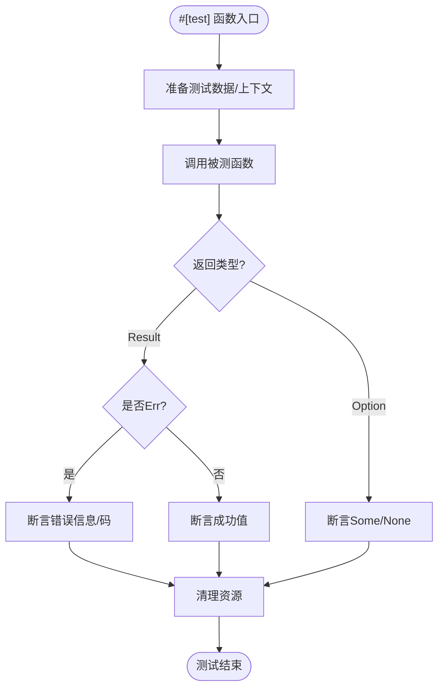
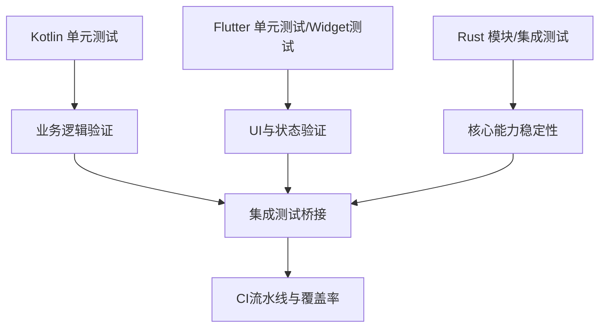
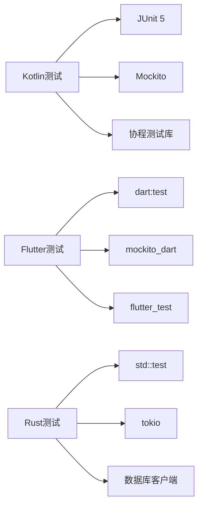

# 单元测试

<cite>
**本文引用的文件**   
- [app/src/test/java/io/legado/app/ExampleUnitTest.kt](file://app/src/test/java/io/legado/app/ExampleUnitTest.kt)
- [app/src/androidTest/java/io/legado/app/ExampleInstrumentedTest.kt](file://app/src/androidTest/java/io/legado/app/ExampleInstrumentedTest.kt)
- [app/src/test/java/io/legado/app/utils/CoroutineExtensionsTest.kt](file://app/src/test/java/io/legado/app/utils/CoroutineExtensionsTest.kt)
- [app/src/test/java/io/legado/app/model/AutoTaskCoreTest.kt](file://app/src/test/java/io/legado/app/model/AutoTaskCoreTest.kt)
- [app/src/test/java/io/legado/app/service/AudioCacheServiceQueueTest.kt](file://app/src/test/java/io/legado/app/service/AudioCacheServiceQueueTest.kt)
- [app/src/test/java/io/legado/app/web/mcp/McpApplicationTest.kt](file://app/src/test/java/io/legado/app/web/mcp/McpApplicationTest.kt)
- [flutter_legado/pubspec.yaml](file://flutter_legado/pubspec.yaml)
- [flutter_legado/test/unit/bookshelf_provider_test.dart](file://flutter_legado/test/unit/bookshelf_provider_test.dart)
- [flutter_legado/test/unit/settings_service_test.dart](file://flutter_legado/test/unit/settings_service_test.dart)
- [flutter_legado/test/widget/badge_widget_test.dart](file://flutter_legado/test/widget/badge_widget_test.dart)
- [rust/legado-core/Cargo.toml](file://rust/legado-core/Cargo.toml)
- [rust/legado-db/tests/integration_test.rs](file://rust/legado-db/tests/integration_test.rs)
- [rust/legado-server/tests/integration_test.rs](file://rust/legado-server/tests/integration_test.rs)
</cite>

## 目录
1. [简介](#简介)
2. [项目结构](#项目结构)
3. [核心组件](#核心组件)
4. [架构总览](#架构总览)
5. [详细组件分析](#详细组件分析)
6. [依赖分析](#依赖分析)
7. [性能考虑](#性能考虑)
8. [故障排查指南](#故障排查指南)
9. [结论](#结论)
10. [附录](#附录)

## 简介
本文件面向Kotlin、Dart与Rust三种语言的单元测试编写规范与实践，结合Legado项目的实际测试代码，系统讲解Android单元测试（JUnit、Mockito）与集成测试、Flutter单元测试与Widget测试、以及Rust的模块测试与集成测试。文档涵盖测试类结构、断言方法、Mock对象创建、异步与并发测试、Provider状态测试、错误处理测试、测试数据生成策略、测试环境配置与覆盖率收集方法，并提供最佳实践指导与可操作的示例路径。

## 项目结构
Legado项目在三个主要子系统中组织测试：
- Android/Kotlin：单元测试位于 app/src/test，仪器化测试位于 app/src/androidTest
- Flutter/Dart：单元测试位于 flutter_legado/test/unit，Widget测试位于 flutter_legado/test/widget
- Rust：模块级测试通过 #[test] 内联于源码中，集成测试位于各crate的 tests 目录

**图表来源**
- [app/src/test/java/io/legado/app/ExampleUnitTest.kt](file://app/src/test/java/io/legado/app/ExampleUnitTest.kt)
- [app/src/androidTest/java/io/legado/app/ExampleInstrumentedTest.kt](file://app/src/androidTest/java/io/legado/app/ExampleInstrumentedTest.kt)
- [flutter_legado/test/unit/bookshelf_provider_test.dart](file://flutter_legado/test/unit/bookshelf_provider_test.dart)
- [flutter_legado/test/widget/badge_widget_test.dart](file://flutter_legado/test/widget/badge_widget_test.dart)
- [rust/legado-db/tests/integration_test.rs](file://rust/legado-db/tests/integration_test.rs)
- [rust/legado-server/tests/integration_test.rs](file://rust/legado-server/tests/integration_test.rs)

**章节来源**
- [app/src/test/java/io/legado/app/ExampleUnitTest.kt](file://app/src/test/java/io/legado/app/ExampleUnitTest.kt)
- [app/src/androidTest/java/io/legado/app/ExampleInstrumentedTest.kt](file://app/src/androidTest/java/io/legado/app/ExampleInstrumentedTest.kt)
- [flutter_legado/test/unit/bookshelf_provider_test.dart](file://flutter_legado/test/unit/bookshelf_provider_test.dart)
- [flutter_legado/test/widget/badge_widget_test.dart](file://flutter_legado/test/widget/badge_widget_test.dart)
- [rust/legado-db/tests/integration_test.rs](file://rust/legado-db/tests/integration_test.rs)
- [rust/legado-server/tests/integration_test.rs](file://rust/legado-server/tests/integration_test.rs)

## 核心组件
- Kotlin/JUnit 5 + Mockito：用于Android应用层与业务逻辑的单元测试与部分仪器化测试
- Flutter test包 + mockito_dart：用于服务、Provider状态与Widget的单元测试与Widget测试
- Rust #[test] 与 assert_eq!：用于核心库与服务的模块测试；tests目录用于集成测试

关键测试文件与作用：
- Kotlin单元测试示例：协程扩展、模型与服务行为验证
- Flutter单元测试示例：书架Provider、设置服务等状态与异步流程
- Flutter Widget测试示例：UI组件渲染与交互
- Rust集成测试示例：数据库与服务端HTTP接口

**章节来源**
- [app/src/test/java/io/legado/app/utils/CoroutineExtensionsTest.kt](file://app/src/test/java/io/legado/app/utils/CoroutineExtensionsTest.kt)
- [app/src/test/java/io/legado/app/model/AutoTaskCoreTest.kt](file://app/src/test/java/io/legado/app/model/AutoTaskCoreTest.kt)
- [app/src/test/java/io/legado/app/service/AudioCacheServiceQueueTest.kt](file://app/src/test/java/io/legado/app/service/AudioCacheServiceQueueTest.kt)
- [flutter_legado/test/unit/bookshelf_provider_test.dart](file://flutter_legado/test/unit/bookshelf_provider_test.dart)
- [flutter_legado/test/unit/settings_service_test.dart](file://flutter_legado/test/unit/settings_service_test.dart)
- [flutter_legado/test/widget/badge_widget_test.dart](file://flutter_legado/test/widget/badge_widget_test.dart)
- [rust/legado-db/tests/integration_test.rs](file://rust/legado-db/tests/integration_test.rs)
- [rust/legado-server/tests/integration_test.rs](file://rust/legado-server/tests/integration_test.rs)

## 架构总览
下图展示三类语言在Legado中的测试分层与协作关系：Kotlin负责Android侧业务与工具函数验证，Flutter负责跨平台UI与状态管理验证，Rust负责底层核心能力与网络/解析/存储等能力的稳定性保障。

[该图为概念性架构图，不直接映射具体源文件，故无“图表来源”标注]

## 详细组件分析

### Kotlin 单元测试（JUnit 5 + Mockito）
- 测试类结构：使用 @RunWith(AndroidJUnit4::class) 或默认Jupiter运行器；测试方法以 @Test 标注；必要时使用 @Before/@After 进行初始化与清理
- 断言方法：assertThat、assertEquals、assertTrue/False、assertThrows等
- Mock对象：使用 Mockito.mock、doReturn/doThrow、verify等；对协程可使用 runBlockingTest 或指定调度器
- 异步与并发：使用协程测试框架（如 kotlinx-coroutines-test），确保测试确定性
- 典型用例：
  - 协程扩展测试：验证挂起函数的异常与返回值
  - 模型与服务测试：验证自动任务、音频缓存队列等行为
  - Web/MCP应用测试：验证路由与请求处理

**图表来源**
- [app/src/test/java/io/legado/app/utils/CoroutineExtensionsTest.kt](file://app/src/test/java/io/legado/app/utils/CoroutineExtensionsTest.kt)
- [app/src/test/java/io/legado/app/model/AutoTaskCoreTest.kt](file://app/src/test/java/io/legado/app/model/AutoTaskCoreTest.kt)
- [app/src/test/java/io/legado/app/service/AudioCacheServiceQueueTest.kt](file://app/src/test/java/io/legado/app/service/AudioCacheServiceQueueTest.kt)

**章节来源**
- [app/src/test/java/io/legado/app/utils/CoroutineExtensionsTest.kt](file://app/src/test/java/io/legado/app/utils/CoroutineExtensionsTest.kt)
- [app/src/test/java/io/legado/app/model/AutoTaskCoreTest.kt](file://app/src/test/java/io/legado/app/model/AutoTaskCoreTest.kt)
- [app/src/test/java/io/legado/app/service/AudioCacheServiceQueueTest.kt](file://app/src/test/java/io/legado/app/service/AudioCacheServiceQueueTest.kt)
- [app/src/test/java/io/legado/app/web/mcp/McpApplicationTest.kt](file://app/src/test/java/io/legado/app/web/mcp/McpApplicationTest.kt)

### Flutter 单元测试（test包 + mockito_dart）
- 测试类结构：使用 test() 定义用例；setUp()/tearDown() 管理生命周期；使用 expect() 进行断言
- Provider状态测试：使用 ProviderContainer 或 MockProviderScope 注入依赖，验证状态变化与副作用
- Widget测试：使用 WidgetTester 驱动界面，模拟用户交互并断言渲染结果
- 异步操作测试：使用 FutureBuilder、async/await 与测试调度器控制时间推进
- 典型用例：
  - 书架Provider测试：验证数据加载、更新与错误处理
  - 设置服务测试：验证配置读写与默认值
  - Badge Widget测试：验证徽章显示与交互

**图表来源**
- [flutter_legado/test/unit/bookshelf_provider_test.dart](file://flutter_legado/test/unit/bookshelf_provider_test.dart)
- [flutter_legado/test/unit/settings_service_test.dart](file://flutter_legado/test/unit/settings_service_test.dart)
- [flutter_legado/test/widget/badge_widget_test.dart](file://flutter_legado/test/widget/badge_widget_test.dart)

**章节来源**
- [flutter_legado/test/unit/bookshelf_provider_test.dart](file://flutter_legado/test/unit/bookshelf_provider_test.dart)
- [flutter_legado/test/unit/settings_service_test.dart](file://flutter_legado/test/unit/settings_service_test.dart)
- [flutter_legado/test/widget/badge_widget_test.dart](file://flutter_legado/test/widget/badge_widget_test.dart)

### Rust 单元测试（#[test] 属性与 assert_eq! 宏）
- 模块测试：在源码中使用 #[cfg(test)] 与 mod tests 组织测试；使用 #[test] 标注测试函数
- 断言宏：assert_eq!、assert_ne!、assert!、panic! 等
- 错误处理测试：验证 Result 与 Option 分支，包括 Err 路径
- 并发测试：使用 tokio::test 或 std::thread 进行并发场景验证
- 集成测试：在 tests 目录下编写端到端或跨模块测试，连接真实数据库或服务

**图表来源**
- [rust/legado-core/Cargo.toml](file://rust/legado-core/Cargo.toml)
- [rust/legado-db/tests/integration_test.rs](file://rust/legado-db/tests/integration_test.rs)
- [rust/legado-server/tests/integration_test.rs](file://rust/legado-server/tests/integration_test.rs)

**章节来源**
- [rust/legado-core/Cargo.toml](file://rust/legado-core/Cargo.toml)
- [rust/legado-db/tests/integration_test.rs](file://rust/legado-db/tests/integration_test.rs)
- [rust/legado-server/tests/integration_test.rs](file://rust/legado-server/tests/integration_test.rs)

### 概念性总览
以下流程图展示三类语言测试在Legado中的协作关系与数据流向，帮助理解整体测试策略。

[该图为概念性流程图，不直接映射具体源文件，故无“图表来源”标注]

## 依赖分析
- Kotlin测试依赖：JUnit 5、Mockito、协程测试库；Android仪器化测试依赖AndroidX Test
- Flutter测试依赖：test包、mockito_dart、flutter_test；Provider测试需注入容器
- Rust测试依赖：标准库测试框架、tokio（异步）、数据库客户端（如SQLite）

**图表来源**
- [app/src/test/java/io/legado/app/ExampleUnitTest.kt](file://app/src/test/java/io/legado/app/ExampleUnitTest.kt)
- [flutter_legado/pubspec.yaml](file://flutter_legado/pubspec.yaml)
- [rust/legado-core/Cargo.toml](file://rust/legado-core/Cargo.toml)

**章节来源**
- [app/src/test/java/io/legado/app/ExampleUnitTest.kt](file://app/src/test/java/io/legado/app/ExampleUnitTest.kt)
- [flutter_legado/pubspec.yaml](file://flutter_legado/pubspec.yaml)
- [rust/legado-core/Cargo.toml](file://rust/legado-core/Cargo.toml)

## 性能考虑
- 避免在单元测试中执行真实I/O：使用内存数据库、内存文件系统或Mock替代
- 控制协程调度器：使用测试专用调度器确保确定性与时序可控
- 减少Widget树构建开销：在Widget测试中仅构建必要组件，避免全量渲染
- Rust测试隔离：每个测试独立上下文，避免共享状态导致竞态条件
- 并行执行：合理拆分测试套件，利用CI并行加速反馈

[本节为通用指导，不直接分析具体文件，故无“章节来源”标注]

## 故障排查指南
- Kotlin测试失败：检查Mock是否正确设置返回值/异常；确认协程调度器与超时设置；查看日志输出定位断言失败点
- Flutter测试问题：确认Provider容器正确注入；检查异步Future是否被正确等待；Widget测试中注意帧同步与动画跳过
- Rust测试异常：检查#[test]函数签名与返回类型；确认测试数据初始化与清理；集成测试中检查数据库迁移与服务端口占用

**章节来源**
- [app/src/androidTest/java/io/legado/app/ExampleInstrumentedTest.kt](file://app/src/androidTest/java/io/legado/app/ExampleInstrumentedTest.kt)
- [flutter_legado/test/unit/bookshelf_provider_test.dart](file://flutter_legado/test/unit/bookshelf_provider_test.dart)
- [rust/legado-db/tests/integration_test.rs](file://rust/legado-db/tests/integration_test.rs)

## 结论
Legado项目在Kotlin、Dart与Rust三套测试体系中形成了清晰的职责划分与协作关系：Kotlin聚焦业务逻辑与工具函数验证，Flutter覆盖UI与状态管理，Rust保障核心能力稳定性。通过合理的Mock策略、异步测试设计与集成测试覆盖，能够有效提升代码质量与交付信心。建议持续完善测试覆盖率指标，并在CI中自动化执行各类测试，形成快速反馈闭环。

[本节为总结性内容，不直接分析具体文件，故无“章节来源”标注]

## 附录
- 测试数据生成策略：
  - Kotlin：使用数据类工厂函数或第三方库（如 Bogus、Faker）生成随机但合法的数据
  - Flutter：在setUp中构造固定数据或使用JSON fixture文件
  - Rust：使用构造函数或builder模式生成测试数据，必要时使用快照测试
- 测试环境配置：
  - Kotlin：通过Gradle配置测试依赖与运行参数；Android仪器化测试需配置设备或模拟器
  - Flutter：通过pubspec.yaml管理测试依赖；使用--coverage收集覆盖率
  - Rust：通过Cargo.toml配置测试依赖与features；使用cargo test执行测试
- 覆盖率收集方法：
  - Kotlin：JaCoCo插件集成，生成HTML报告
  - Flutter：dart test --coverage 与 coverage/lcov.info 转换
  - Rust：llvm-cov或grcov生成覆盖率报告

[本节为通用指导，不直接分析具体文件，故无“章节来源”标注]