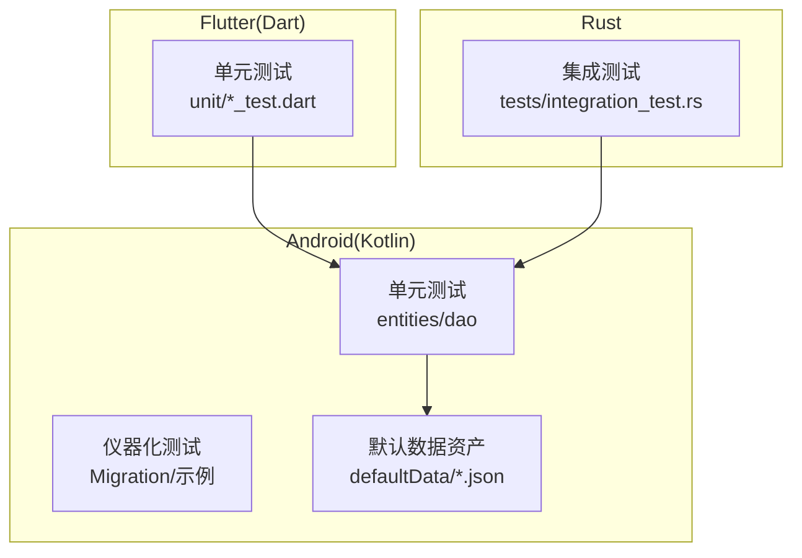
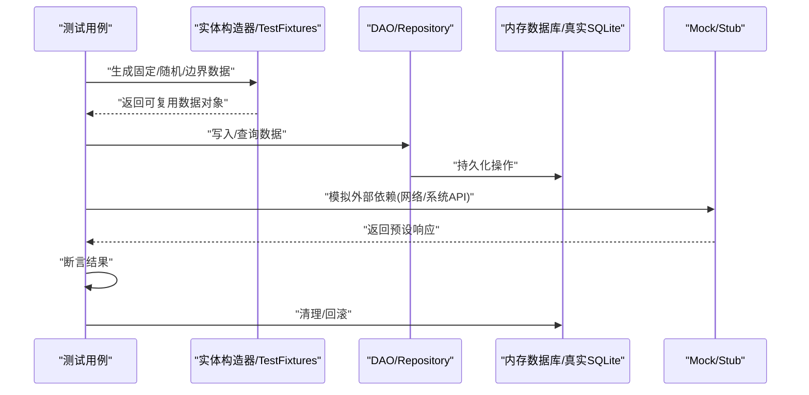
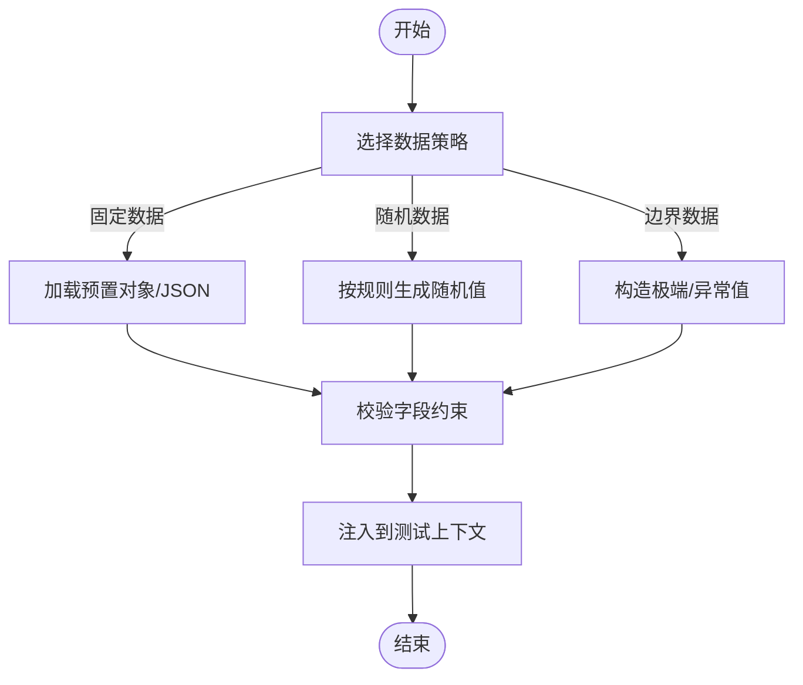
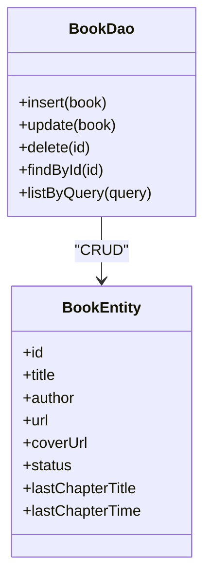
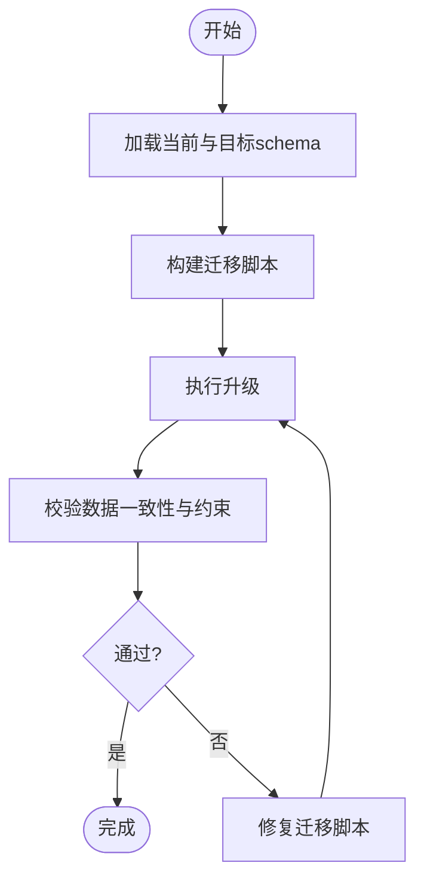
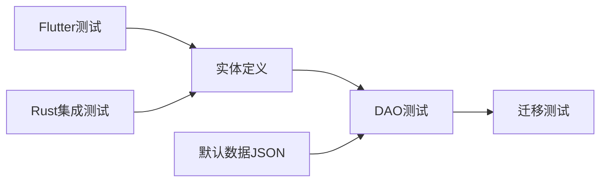

# 测试数据管理

<cite>
**本文引用的文件**   
- [app/src/test/java/io/legado/app/data/entities/BookTest.kt](file://app/src/test/java/io/legado/app/data/entities/BookTest.kt)
- [app/src/test/java/io/legado/app/data/entities/BookChapterTest.kt](file://app/src/test/java/io/legado/app/data/entities/BookChapterTest.kt)
- [app/src/test/java/io/legado/app/data/entities/BookmarkTest.kt](file://app/src/test/java/io/legado/app/data/entities/BookmarkTest.kt)
- [app/src/test/java/io/legado/app/data/entities/CacheBookTest.kt](file://app/src/test/java/io/legado/app/data/entities/CacheBookTest.kt)
- [app/src/test/java/io/legado/app/data/entities/HttpTtsTest.kt](file://app/src/test/java/io/legado/app/data/entities/HttpTtsTest.kt)
- [app/src/test/java/io/legado/app/data/entities/ReadRecordTest.kt](file://app/src/test/java/io/legado/app/data/entities/ReadRecordTest.kt)
- [app/src/test/java/io/legado/app/data/dao/BookDaoTest.kt](file://app/src/test/java/io/legado/app/data/dao/BookDaoTest.kt)
- [app/src/test/java/io/legado/app/data/dao/BookChapterDaoTest.kt](file://app/src/test/java/io/legado/app/data/dao/BookChapterDaoTest.kt)
- [app/src/test/java/io/legado/app/data/dao/BookmarkDaoTest.kt](file://app/src/test/java/io/legado/app/data/dao/BookmarkDaoTest.kt)
- [app/src/test/java/io/legado/app/data/dao/CacheBookDaoTest.kt](file://app/src/test/java/io/legado/app/data/dao/CacheBookDaoTest.kt)
- [app/src/test/java/io/legado/app/data/dao/HttpTtsDaoTest.kt](file://app/src/test/java/io/legado/app/data/dao/HttpTtsDaoTest.kt)
- [app/src/test/java/io/legado/app/data/dao/ReadRecordDaoTest.kt](file://app/src/test/java/io/legado/app/data/dao/ReadRecordDaoTest.kt)
- [app/src/androidTest/java/io/legado/app/MigrationTest.kt](file://app/src/androidTest/java/io/legado/app/MigrationTest.kt)
- [app/src/androidTest/java/io/legado/app/ExampleInstrumentedTest.kt](file://app/src/androidTest/java/io/legado/app/ExampleInstrumentedTest.kt)
- [app/src/main/assets/defaultData/bookSource.json](file://app/src/main/assets/defaultData/bookSource.json)
- [app/src/main/assets/defaultData/rssSource.json](file://app/src/main/assets/defaultData/rssSource.json)
- [flutter_legado/test/unit/bookshelf_provider_test.dart](file://flutter_legado/test/unit/bookshelf_provider_test.dart)
- [flutter_legado/test/unit/settings_service_test.dart](file://flutter_legado/test/unit/settings_service_test.dart)
- [rust/legado-db/tests/integration_test.rs](file://rust/legado-db/tests/integration_test.rs)
</cite>

## 目录
1. [简介](#简介)
2. [项目结构](#项目结构)
3. [核心组件](#核心组件)
4. [架构总览](#架构总览)
5. [详细组件分析](#详细组件分析)
6. [依赖关系分析](#依赖关系分析)
7. [性能考虑](#性能考虑)
8. [故障排查指南](#故障排查指南)
9. [结论](#结论)
10. [附录](#附录)

## 简介
本文件面向Legado项目的测试数据管理与实施方案，覆盖以下目标：
- 系统化地设计测试数据的生成策略（固定数据、随机数据、边界数据）
- 明确Mock与Stub的区别及适用场景（外部服务模拟、数据库状态模拟、网络响应模拟）
- 建立测试数据生命周期管理机制（初始化、清理、隔离）
- 提供多语言实践参考（Kotlin TestFixtures、Dart fake_data、Rust testcontainers）
- 处理大数据量测试、并发测试数据管理与数据安全
- 制定测试数据版本控制与迁移策略

## 项目结构
本项目包含Android/Kotlin单元测试与仪器化测试、Flutter/Dart单元测试以及Rust集成测试。测试数据主要分布在：
- Kotlin单元测试：entities与dao层测试用例，使用Room内存数据库或纯对象构造
- Android仪器化测试：数据库迁移验证与设备级行为测试
- Flutter单元测试：Provider与服务层的单测，常以fake数据构造输入
- Rust集成测试：基于真实SQLite的端到端数据流验证

图表来源
- [app/src/test/java/io/legado/app/data/entities/BookTest.kt](file://app/src/test/java/io/legado/app/data/entities/BookTest.kt)
- [app/src/test/java/io/legado/app/data/dao/BookDaoTest.kt](file://app/src/test/java/io/legado/app/data/dao/BookDaoTest.kt)
- [app/src/androidTest/java/io/legado/app/MigrationTest.kt](file://app/src/androidTest/java/io/legado/app/MigrationTest.kt)
- [app/src/main/assets/defaultData/bookSource.json](file://app/src/main/assets/defaultData/bookSource.json)
- [flutter_legado/test/unit/bookshelf_provider_test.dart](file://flutter_legado/test/unit/bookshelf_provider_test.dart)
- [rust/legado-db/tests/integration_test.rs](file://rust/legado-db/tests/integration_test.rs)

章节来源
- [app/src/test/java/io/legado/app/data/entities/BookTest.kt](file://app/src/test/java/io/legado/app/data/entities/BookTest.kt)
- [app/src/test/java/io/legado/app/data/dao/BookDaoTest.kt](file://app/src/test/java/io/legado/app/data/dao/BookDaoTest.kt)
- [app/src/androidTest/java/io/legado/app/MigrationTest.kt](file://app/src/androidTest/java/io/legado/app/MigrationTest.kt)
- [app/src/main/assets/defaultData/bookSource.json](file://app/src/main/assets/defaultData/bookSource.json)
- [flutter_legado/test/unit/bookshelf_provider_test.dart](file://flutter_legado/test/unit/bookshelf_provider_test.dart)
- [rust/legado-db/tests/integration_test.rs](file://rust/legado-db/tests/integration_test.rs)

## 核心组件
- 实体层测试（entities）：用于校验数据模型序列化、字段约束与业务规则
- DAO层测试（dao）：基于Room内存数据库验证CRUD、查询条件、事务与索引
- 迁移测试（androidTest）：验证数据库schema演进的正确性
- Flutter Provider/Service测试：以fake数据驱动UI逻辑与状态更新
- Rust集成测试：通过真实SQLite验证跨层数据一致性

章节来源
- [app/src/test/java/io/legado/app/data/entities/BookTest.kt](file://app/src/test/java/io/legado/app/data/entities/BookTest.kt)
- [app/src/test/java/io/legado/app/data/dao/BookDaoTest.kt](file://app/src/test/java/io/legado/app/data/dao/BookDaoTest.kt)
- [app/src/androidTest/java/io/legado/app/MigrationTest.kt](file://app/src/androidTest/java/io/legado/app/MigrationTest.kt)
- [flutter_legado/test/unit/bookshelf_provider_test.dart](file://flutter_legado/test/unit/bookshelf_provider_test.dart)
- [rust/legado-db/tests/integration_test.rs](file://rust/legado-db/tests/integration_test.rs)

## 架构总览
测试数据在多层之间流转，关键路径包括：
- 固定数据：从assets默认JSON导入，作为稳定基线
- 随机数据：在测试中动态生成，提升覆盖率并避免硬编码耦合
- 边界数据：针对空值、极值、特殊字符等构造用例
- Mock/Stub：对外部HTTP、第三方库进行替换，保证测试确定性
- 数据生命周期：每个测试用例独立初始化、执行后清理，确保隔离

图表来源
- [app/src/test/java/io/legado/app/data/dao/BookDaoTest.kt](file://app/src/test/java/io/legado/app/data/dao/BookDaoTest.kt)
- [app/src/test/java/io/legado/app/data/entities/BookTest.kt](file://app/src/test/java/io/legado/app/data/entities/BookTest.kt)
- [rust/legado-db/tests/integration_test.rs](file://rust/legado-db/tests/integration_test.rs)

## 详细组件分析

### 实体层测试与数据构造
- 固定数据：为常见场景准备最小可用对象集合，便于快速回归
- 随机数据：对字符串长度、数值范围、枚举组合进行随机化，增强鲁棒性
- 边界数据：重点覆盖空串、超长文本、非法日期、负数、极大ID等

章节来源
- [app/src/test/java/io/legado/app/data/entities/BookTest.kt](file://app/src/test/java/io/legado/app/data/entities/BookTest.kt)
- [app/src/test/java/io/legado/app/data/entities/BookChapterTest.kt](file://app/src/test/java/io/legado/app/data/entities/BookChapterTest.kt)
- [app/src/test/java/io/legado/app/data/entities/BookmarkTest.kt](file://app/src/test/java/io/legado/app/data/entities/BookmarkTest.kt)
- [app/src/test/java/io/legado/app/data/entities/CacheBookTest.kt](file://app/src/test/java/io/legado/app/data/entities/CacheBookTest.kt)
- [app/src/test/java/io/legado/app/data/entities/HttpTtsTest.kt](file://app/src/test/java/io/legado/app/data/entities/HttpTtsTest.kt)
- [app/src/test/java/io/legado/app/data/entities/ReadRecordTest.kt](file://app/src/test/java/io/legado/app/data/entities/ReadRecordTest.kt)

### DAO层测试与数据库状态模拟
- 使用内存数据库实例，确保每次测试独立环境
- 通过批量插入构建复杂查询场景
- 利用事务与回滚保障数据一致性

图表来源
- [app/src/test/java/io/legado/app/data/dao/BookDaoTest.kt](file://app/src/test/java/io/legado/app/data/dao/BookDaoTest.kt)
- [app/src/test/java/io/legado/app/data/entities/BookTest.kt](file://app/src/test/java/io/legado/app/data/entities/BookTest.kt)

章节来源
- [app/src/test/java/io/legado/app/data/dao/BookDaoTest.kt](file://app/src/test/java/io/legado/app/data/dao/BookDaoTest.kt)
- [app/src/test/java/io/legado/app/data/dao/BookChapterDaoTest.kt](file://app/src/test/java/io/legado/app/data/dao/BookChapterDaoTest.kt)
- [app/src/test/java/io/legado/app/data/dao/BookmarkDaoTest.kt](file://app/src/test/java/io/legado/app/data/dao/BookmarkDaoTest.kt)
- [app/src/test/java/io/legado/app/data/dao/CacheBookDaoTest.kt](file://app/src/test/java/io/legado/app/data/dao/CacheBookDaoTest.kt)
- [app/src/test/java/io/legado/app/data/dao/HttpTtsDaoTest.kt](file://app/src/test/java/io/legado/app/data/dao/HttpTtsDaoTest.kt)
- [app/src/test/java/io/legado/app/data/dao/ReadRecordDaoTest.kt](file://app/src/test/java/io/legado/app/data/dao/ReadRecordDaoTest.kt)

### 迁移测试与数据版本控制
- 使用Room schema JSON描述各版本结构
- 迁移测试验证升级路径正确性与数据完整性
- 建议将迁移脚本纳入版本控制并与代码同步评审

章节来源
- [app/src/androidTest/java/io/legado/app/MigrationTest.kt](file://app/src/androidTest/java/io/legado/app/MigrationTest.kt)
- [app/src/main/assets/defaultData/bookSource.json](file://app/src/main/assets/defaultData/bookSource.json)
- [app/src/main/assets/defaultData/rssSource.json](file://app/src/main/assets/defaultData/rssSource.json)

### Flutter侧测试数据与Fake数据
- 使用fake数据构造Provider/Service输入，避免UI层耦合真实后端
- 针对列表、分页、搜索等场景构造不同规模数据集
- 结合异步断言验证状态变化与错误分支

章节来源
- [flutter_legado/test/unit/bookshelf_provider_test.dart](file://flutter_legado/test/unit/bookshelf_provider_test.dart)
- [flutter_legado/test/unit/settings_service_test.dart](file://flutter_legado/test/unit/settings_service_test.dart)

### Rust集成测试与容器化数据环境
- 通过真实SQLite运行端到端数据流程
- 可使用testcontainers思想（如临时数据库实例）实现隔离
- 适合验证ORM映射、迁移与复杂查询

章节来源
- [rust/legado-db/tests/integration_test.rs](file://rust/legado-db/tests/integration_test.rs)

## 依赖关系分析
- 测试用例依赖实体定义与DAO接口
- 默认数据资产为测试提供稳定基线
- Flutter测试依赖Kotlin/Rust的数据模型契约
- 迁移测试依赖schema JSON与迁移脚本

图表来源
- [app/src/test/java/io/legado/app/data/entities/BookTest.kt](file://app/src/test/java/io/legado/app/data/entities/BookTest.kt)
- [app/src/test/java/io/legado/app/data/dao/BookDaoTest.kt](file://app/src/test/java/io/legado/app/data/dao/BookDaoTest.kt)
- [app/src/main/assets/defaultData/bookSource.json](file://app/src/main/assets/defaultData/bookSource.json)
- [flutter_legado/test/unit/bookshelf_provider_test.dart](file://flutter_legado/test/unit/bookshelf_provider_test.dart)
- [rust/legado-db/tests/integration_test.rs](file://rust/legado-db/tests/integration_test.rs)

章节来源
- [app/src/test/java/io/legado/app/data/entities/BookTest.kt](file://app/src/test/java/io/legado/app/data/entities/BookTest.kt)
- [app/src/test/java/io/legado/app/data/dao/BookDaoTest.kt](file://app/src/test/java/io/legado/app/data/dao/BookDaoTest.kt)
- [app/src/main/assets/defaultData/bookSource.json](file://app/src/main/assets/defaultData/bookSource.json)
- [flutter_legado/test/unit/bookshelf_provider_test.dart](file://flutter_legado/test/unit/bookshelf_provider_test.dart)
- [rust/legado-db/tests/integration_test.rs](file://rust/legado-db/tests/integration_test.rs)

## 性能考虑
- 大数据量测试：分批插入、分页查询、索引命中验证；避免一次性加载超大对象
- 并发测试：使用独立数据库实例或事务隔离，防止竞态条件影响断言
- 资源占用：限制随机数据规模，合理设置超时与重试
- 缓存策略：在测试中禁用或清空缓存，确保可重复性

[本节为通用指导，不直接分析具体文件]

## 故障排查指南
- 常见问题
  - 测试间数据污染：检查是否在每个测试前重置数据库或回滚事务
  - 迁移失败：核对schema JSON与迁移脚本顺序，确认字段类型兼容
  - 外部依赖不稳定：使用Mock/Stub替代网络调用，固定响应时间
  - Flutter状态不一致：确保Provider/Service的fake数据与断言时序匹配
- 定位步骤
  - 缩小范围：先跑最小复现用例，逐步扩大数据规模
  - 日志输出：打印关键SQL与中间状态，定位失败阶段
  - 隔离环境：使用内存数据库或临时实例，排除外部干扰

章节来源
- [app/src/androidTest/java/io/legado/app/MigrationTest.kt](file://app/src/androidTest/java/io/legado/app/MigrationTest.kt)
- [app/src/androidTest/java/io/legado/app/ExampleInstrumentedTest.kt](file://app/src/androidTest/java/io/legado/app/ExampleInstrumentedTest.kt)

## 结论
通过分层测试数据策略（固定/随机/边界）、明确的Mock/Stub使用规范、严格的生命周期管理以及多语言工具链（Kotlin、Dart、Rust），可以显著提升测试稳定性与覆盖率。配合版本化的schema与迁移脚本，能够保障数据演进的可靠性。建议在CI中自动化执行各类测试，确保数据质量持续受控。

[本节为总结性内容，不直接分析具体文件]

## 附录
- 多语言测试数据工具与实践要点
  - Kotlin
    - 使用TestFixtures集中管理固定数据，减少重复构造
    - 借助Room内存数据库进行DAO测试，避免真实存储开销
    - 使用协程与测试调度器控制异步行为
  - Dart
    - 使用fake_data包或自定义工厂函数生成稳定随机数据
    - 在Provider/Service层注入mock依赖，隔离外部状态
  - Rust
    - 使用testcontainers思想启动临时数据库实例，确保隔离
    - 通过SQLite进行集成测试，验证ORM与迁移
- 数据安全与合规
  - 测试数据脱敏：避免使用生产敏感信息
  - 权限与沙箱：在仪器化测试中谨慎申请权限，必要时使用白名单
  - 清理策略：测试结束后彻底删除临时数据，避免泄露

[本节为通用指导，不直接分析具体文件]