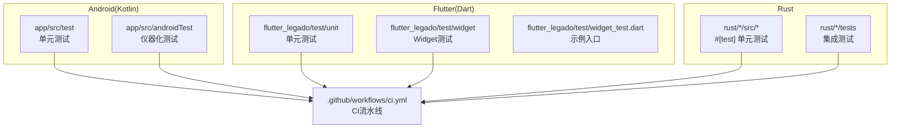
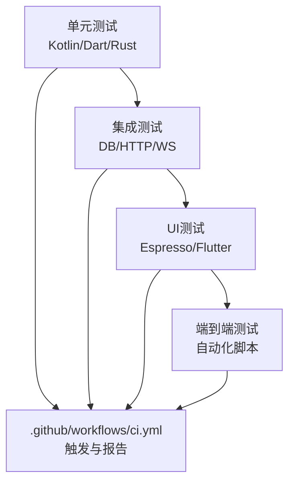
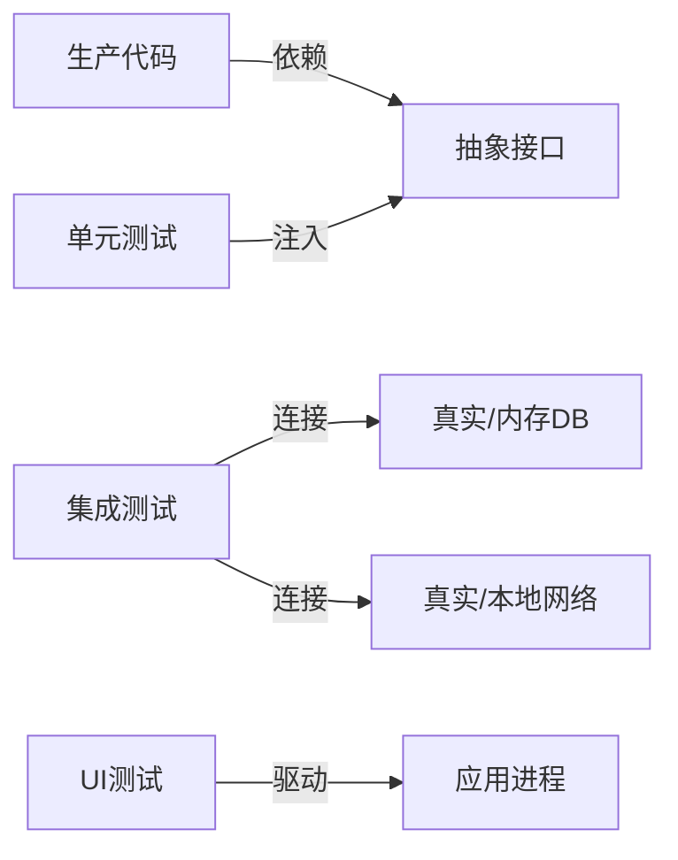
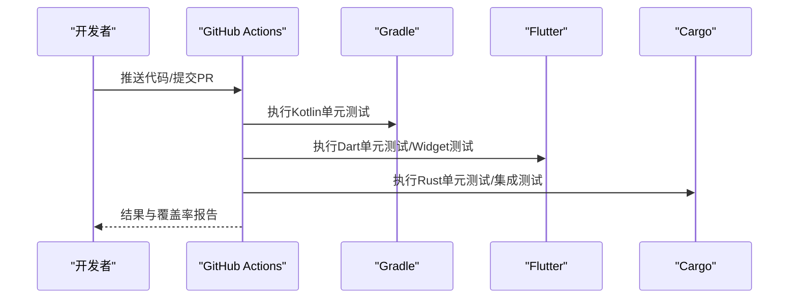

# 测试策略

<cite>
**本文引用的文件**   
- [app/src/test/java/io/legado/app/ExampleUnitTest.kt](file://app/src/test/java/io/legado/app/ExampleUnitTest.kt)
- [app/src/androidTest/java/io/legado/app/AndroidJsTest.kt](file://app/src/androidTest/java/io/legado/app/AndroidJsTest.kt)
- [app/src/androidTest/java/io/legado/app/HttpTest.kt](file://app/src/androidTest/java/io/legado/app/HttpTest.kt)
- [app/src/androidTest/java/io/legado/app/MigrationTest.kt](file://app/src/androidTest/java/io/legado/app/MigrationTest.kt)
- [app/src/androidTest/java/io/legado/app/ui/font/FontSelectionInflationTest.kt](file://app/src/androidTest/java/io/legado/app/ui/font/FontSelectionInflationTest.kt)
- [flutter_legado/pubspec.yaml](file://flutter_legado/pubspec.yaml)
- [flutter_legado/test/unit/bookshelf_provider_test.dart](file://flutter_legado/test/unit/bookshelf_provider_test.dart)
- [flutter_legado/test/widget/badge_widget_test.dart](file://flutter_legado/test/widget/badge_widget_test.dart)
- [flutter_legado/test/widget_test.dart](file://flutter_legado/test/widget_test.dart)
- [rust/Cargo.toml](file://rust/Cargo.toml)
- [rust/legado-db/tests/integration_test.rs](file://rust/legado-db/tests/integration_test.rs)
- [rust/legado-server/tests/integration_test.rs](file://rust/legado-server/tests/integration_test.rs)
- [rust/legado-server/tests/ws_test.rs](file://rust/legado-server/tests/ws_test.rs)
- [.github/workflows/ci.yml](file://.github/workflows/ci.yml)
</cite>

## 目录
1. [简介](#简介)
2. [项目结构](#项目结构)
3. [核心组件](#核心组件)
4. [架构总览](#架构总览)
5. [详细组件分析](#详细组件分析)
6. [依赖关系分析](#依赖关系分析)
7. [性能考量](#性能考量)
8. [故障排查指南](#故障排查指南)
9. [结论](#结论)
10. [附录](#附录)

## 简介
本文件面向Legado项目的测试策略与框架使用，覆盖Kotlin（Android）、Dart（Flutter）与Rust三端的单元测试、集成测试与UI测试规范；同时给出测试数据管理、Mock策略、异步测试要点、覆盖率要求以及持续集成中的执行流程。目标是让不同技术背景的读者都能快速上手并落地可维护的测试体系。

## 项目结构
仓库包含三大测试域：
- Android端（Kotlin）：单元测试位于 app/src/test，仪器化测试位于 app/src/androidTest
- Flutter端（Dart）：单元测试与Widget测试位于 flutter_legado/test
- Rust端：单元测试与集成测试位于 rust/*/tests 及模块内 tests 目录

图表来源
- [app/src/test/java/io/legado/app/ExampleUnitTest.kt](file://app/src/test/java/io/legado/app/ExampleUnitTest.kt)
- [app/src/androidTest/java/io/legado/app/AndroidJsTest.kt](file://app/src/androidTest/java/io/legado/app/AndroidJsTest.kt)
- [flutter_legado/test/unit/bookshelf_provider_test.dart](file://flutter_legado/test/unit/bookshelf_provider_test.dart)
- [flutter_legado/test/widget/badge_widget_test.dart](file://flutter_legado/test/widget/badge_widget_test.dart)
- [rust/Cargo.toml](file://rust/Cargo.toml)
- [rust/legado-db/tests/integration_test.rs](file://rust/legado-db/tests/integration_test.rs)
- [.github/workflows/ci.yml](file://.github/workflows/ci.yml)

章节来源
- [app/src/test/java/io/legado/app/ExampleUnitTest.kt](file://app/src/test/java/io/legado/app/ExampleUnitTest.kt)
- [app/src/androidTest/java/io/legado/app/AndroidJsTest.kt](file://app/src/androidTest/java/io/legado/app/AndroidJsTest.kt)
- [flutter_legado/test/unit/bookshelf_provider_test.dart](file://flutter_legado/test/unit/bookshelf_provider_test.dart)
- [flutter_legado/test/widget/badge_widget_test.dart](file://flutter_legado/test/widget/badge_widget_test.dart)
- [rust/Cargo.toml](file://rust/Cargo.toml)
- [rust/legado-db/tests/integration_test.rs](file://rust/legado-db/tests/integration_test.rs)
- [.github/workflows/ci.yml](file://.github/workflows/ci.yml)

## 核心组件
- Kotlin 单元测试（JUnit + Kotlin Test）
  - 位置：app/src/test/java/io/legado/app/**
  - 用途：验证纯逻辑、工具类、规则解析、配置校验等
- Kotlin 仪器化测试（AndroidX Test / Espresso）
  - 位置：app/src/androidTest/java/io/legado/app/**
  - 用途：数据库迁移、网络请求、JS引擎交互、UI渲染等
- Dart 单元测试（dart:test）
  - 位置：flutter_legado/test/unit/**
  - 用途：Provider/Service/模型层逻辑、状态流转
- Dart Widget测试（flutter_test）
  - 位置：flutter_legado/test/widget/**
  - 用途：组件渲染、交互事件、主题/语言切换
- Rust 单元测试（内置 #[test]）
  - 位置：各 crate 源码中或 tests 目录
  - 用途：算法、解析器、加密、网络中间件等
- Rust 集成测试（cargo test --test）
  - 位置：rust/*/tests/**
  - 用途：数据库迁移、HTTP/WebSocket服务、跨模块协作

章节来源
- [app/src/test/java/io/legado/app/ExampleUnitTest.kt](file://app/src/test/java/io/legado/app/ExampleUnitTest.kt)
- [app/src/androidTest/java/io/legado/app/AndroidJsTest.kt](file://app/src/androidTest/java/io/legado/app/AndroidJsTest.kt)
- [flutter_legado/test/unit/bookshelf_provider_test.dart](file://flutter_legado/test/unit/bookshelf_provider_test.dart)
- [flutter_legado/test/widget/badge_widget_test.dart](file://flutter_legado/test/widget/badge_widget_test.dart)
- [rust/Cargo.toml](file://rust/Cargo.toml)
- [rust/legado-db/tests/integration_test.rs](file://rust/legado-db/tests/integration_test.rs)

## 架构总览
测试分层与职责边界：
- 单元测试：隔离外部依赖，聚焦函数/方法正确性
- 集成测试：验证模块间协作、数据库、网络、持久化
- UI测试：验证用户界面行为与交互
- 端到端测试：模拟真实用户路径，覆盖关键业务流

图表来源
- [.github/workflows/ci.yml](file://.github/workflows/ci.yml)

## 详细组件分析

### Kotlin 单元测试（JUnit + Kotlin Test）
- 编写规范
  - 每个测试用例只断言一个关注点，命名遵循“方法_场景_期望”
  - 使用 @Test 标注，必要时配合 @Before/@After 或测试夹具
  - 对协程/异步逻辑，使用 runTest 或对应测试调度器
- Mock策略
  - 使用接口抽象与依赖注入，便于替换为测试实现
  - 第三方库可通过代理或封装层进行Mock
- 数据管理
  - 使用工厂方法生成最小可用数据
  - 避免在测试中硬编码敏感信息

章节来源
- [app/src/test/java/io/legado/app/ExampleUnitTest.kt](file://app/src/test/java/io/legado/app/ExampleUnitTest.kt)

### Kotlin 仪器化测试（AndroidX Test / Espresso）
- 适用场景
  - 数据库迁移：确保版本升级无损
  - 网络请求：通过OkHttp/TLS/Cronet栈验证
  - JS引擎交互：验证脚本执行环境
  - UI渲染：字体选择、布局膨胀等
- 最佳实践
  - 使用独立测试数据库与沙箱存储
  - 网络测试优先使用本地Mock服务器或拦截器
  - UI测试尽量稳定，避免时间相关断言

章节来源
- [app/src/androidTest/java/io/legado/app/MigrationTest.kt](file://app/src/androidTest/java/io/legado/app/MigrationTest.kt)
- [app/src/androidTest/java/io/legado/app/HttpTest.kt](file://app/src/androidTest/java/io/legado/app/HttpTest.kt)
- [app/src/androidTest/java/io/legado/app/AndroidJsTest.kt](file://app/src/androidTest/java/io/legado/app/AndroidJsTest.kt)
- [app/src/androidTest/java/io/legado/app/ui/font/FontSelectionInflationTest.kt](file://app/src/androidTest/java/io/legado/app/ui/font/FontSelectionInflationTest.kt)

### Dart 单元测试（dart:test）
- 编写规范
  - 使用 group/test 组织用例，命名清晰
  - 对异步操作使用 expect 与 Future 断言
- Mock策略
  - 使用自定义Fake/Stub替代外部依赖
  - 对Provider/State进行测试时，使用测试容器注入
- 数据管理
  - 使用JSON文件或工厂构造最小数据集

章节来源
- [flutter_legado/test/unit/bookshelf_provider_test.dart](file://flutter_legado/test/unit/bookshelf_provider_test.dart)

### Dart Widget测试（flutter_test）
- 编写规范
  - 使用 tester.pumpWidget 构建UI，tester.tap/tester.enterText 模拟交互
  - 使用 find.byType/find.text 定位元素并断言
- 最佳实践
  - 避免真实网络调用，使用Mock或内存数据源
  - 针对主题、语言、响应式布局分别设计用例

章节来源
- [flutter_legado/test/widget/badge_widget_test.dart](file://flutter_legado/test/widget/badge_widget_test.dart)
- [flutter_legado/test/widget_test.dart](file://flutter_legado/test/widget_test.dart)

### Rust 单元测试（#[test]）
- 编写规范
  - 使用 #[test] 标注函数，assert! 宏断言
  - 对并发/异步代码使用 tokio::runtime 或 async 测试
- 数据管理
  - 使用固定常量或构造器生成输入输出
- 性能与安全
  - 对热点路径添加基准测试（可选）

章节来源
- [rust/Cargo.toml](file://rust/Cargo.toml)

### Rust 集成测试（cargo test --test）
- 适用场景
  - 数据库迁移：验证schema变更与默认数据导入
  - HTTP/WebSocket服务：验证路由、鉴权、消息协议
- 最佳实践
  - 使用内存数据库或临时SQLite文件
  - 启动本地测试服务器，使用闭端口避免冲突

章节来源
- [rust/legado-db/tests/integration_test.rs](file://rust/legado-db/tests/integration_test.rs)
- [rust/legado-server/tests/integration_test.rs](file://rust/legado-server/tests/integration_test.rs)
- [rust/legado-server/tests/ws_test.rs](file://rust/legado-server/tests/ws_test.rs)

### 端到端测试（概念性说明）
- 目标：覆盖关键用户路径，如登录、搜索、阅读、设置同步
- 实施建议
  - Android：使用uiautomator或Compose Testing
  - Flutter：使用integration_test包
  - Web：使用Playwright/Cypress
- 数据与环境
  - 预置测试账号与种子数据
  - 使用Mock后端或本地服务

[本节为概念性说明，不直接分析具体文件]

## 依赖关系分析
测试与生产代码的解耦方式：
- 通过接口/抽象层隔离外部依赖（网络、数据库、文件系统）
- 使用依赖注入将Mock实现注入到被测单元
- 在CI中按层级运行测试，保证快速反馈

图表来源
- [app/src/test/java/io/legado/app/ExampleUnitTest.kt](file://app/src/test/java/io/legado/app/ExampleUnitTest.kt)
- [app/src/androidTest/java/io/legado/app/HttpTest.kt](file://app/src/androidTest/java/io/legado/app/HttpTest.kt)
- [flutter_legado/test/unit/bookshelf_provider_test.dart](file://flutter_legado/test/unit/bookshelf_provider_test.dart)
- [rust/legado-db/tests/integration_test.rs](file://rust/legado-db/tests/integration_test.rs)

章节来源
- [app/src/test/java/io/legado/app/ExampleUnitTest.kt](file://app/src/test/java/io/legado/app/ExampleUnitTest.kt)
- [app/src/androidTest/java/io/legado/app/HttpTest.kt](file://app/src/androidTest/java/io/legado/app/HttpTest.kt)
- [flutter_legado/test/unit/bookshelf_provider_test.dart](file://flutter_legado/test/unit/bookshelf_provider_test.dart)
- [rust/legado-db/tests/integration_test.rs](file://rust/legado-db/tests/integration_test.rs)

## 性能考量
- 单元测试：保持轻量，避免IO与网络；批量运行以提升速度
- 集成测试：使用内存数据库、本地回环地址、短超时
- UI测试：减少页面跳转，复用已初始化状态；避免动画等待
- Rust测试：对热点路径使用基准测试；避免全局状态污染

[本节提供通用指导，不直接分析具体文件]

## 故障排查指南
- 常见失败原因
  - 异步未正确等待：检查Future/协程/async await的断言时机
  - 资源未释放：确保关闭数据库连接、HTTP客户端、文件句柄
  - 随机性：避免基于时间的断言，使用确定性输入
  - 环境差异：统一JDK/Flutter/Rust版本，锁定依赖
- 调试技巧
  - 打印日志与堆栈，缩小问题范围
  - 使用IDE单步调试与断点
  - 在CI中保留测试产物与日志

章节来源
- [app/src/androidTest/java/io/legado/app/HttpTest.kt](file://app/src/androidTest/java/io/legado/app/HttpTest.kt)
- [rust/legado-server/tests/integration_test.rs](file://rust/legado-server/tests/integration_test.rs)

## 结论
通过分层测试策略与严格的Mock/数据管理，Legado在多端（Kotlin/Dart/Rust）实现了高可靠的质量保障。建议在CI中固化测试流程，逐步提升覆盖率，并以集成与UI测试作为回归防线。

[本节为总结性内容，不直接分析具体文件]

## 附录

### 测试数据管理与Mock策略
- 测试数据
  - 使用工厂/Builder模式生成最小可用对象
  - 将静态数据置于测试资源目录，避免硬编码
- Mock策略
  - 对外部依赖定义接口，测试中注入Fake实现
  - 网络层使用拦截器或本地服务器返回固定响应
- 异步测试
  - 明确等待条件，避免竞态；使用计时器或信号量协调

[本节为通用指导，不直接分析具体文件]

### 覆盖率要求
- 建议目标
  - 单元测试行覆盖率≥80%
  - 关键模块（解析、网络、数据库）≥90%
  - UI测试覆盖核心用户路径
- 统计工具
  - Kotlin：JaCoCo
  - Dart：coverage
  - Rust：cargo-tarpaulin

[本节为通用指导，不直接分析具体文件]

### 持续集成中的测试执行流程
- 触发条件
  - Push/Pull Request事件
- 执行步骤
  - 安装依赖（Gradle/Flutter/Rust）
  - 运行单元测试（Kotlin/Dart/Rust）
  - 运行集成测试（Rust DB/Server）
  - 运行UI测试（Android/Flutter）
  - 生成覆盖率报告与测试结果归档

图表来源
- [.github/workflows/ci.yml](file://.github/workflows/ci.yml)

章节来源
- [.github/workflows/ci.yml](file://.github/workflows/ci.yml)