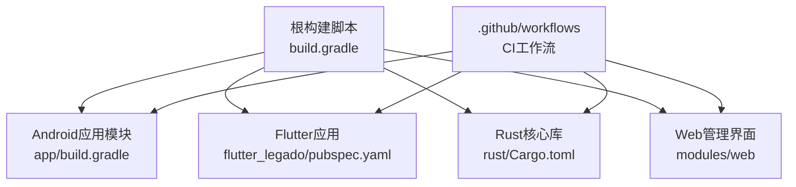
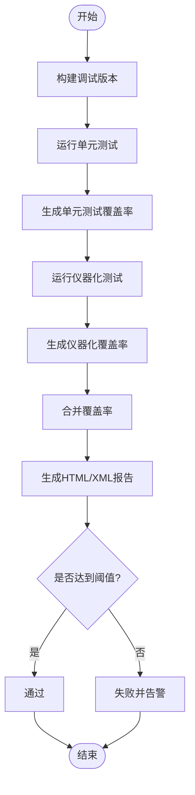
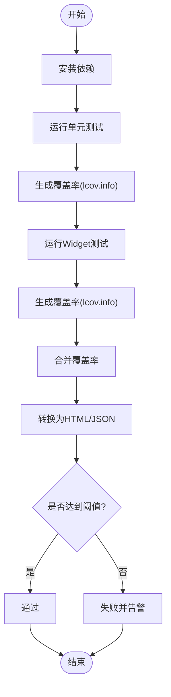
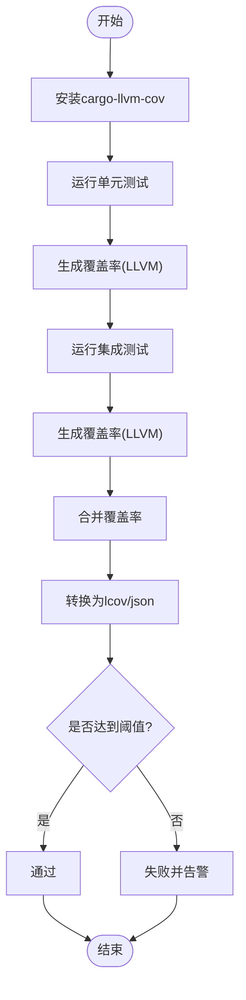
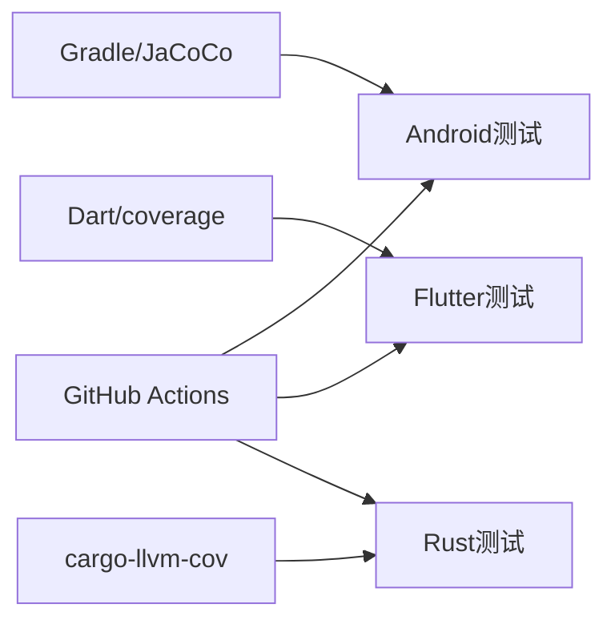

# 测试覆盖率与持续集成

<cite>
**本文引用的文件**   
- [README.md](file://README.md)
- [build.gradle](file://build.gradle)
- [app/build.gradle](file://app/build.gradle)
- [flutter_legado/pubspec.yaml](file://flutter_legado/pubspec.yaml)
- [rust/Cargo.toml](file://rust/Cargo.toml)
- [.github/workflows/ci.yml](file://.github/workflows/ci.yml)
- [.github/workflows/release.yml](file://.github/workflows/release.yml)
- [.github/dependabot.yml](file://.github/dependabot.yml)
</cite>

## 目录
1. [简介](#简介)
2. [项目结构](#项目结构)
3. [核心组件](#核心组件)
4. [架构总览](#架构总览)
5. [详细组件分析](#详细组件分析)
6. [依赖关系分析](#依赖关系分析)
7. [性能考量](#性能考量)
8. [故障排查指南](#故障排查指南)
9. [结论](#结论)
10. [附录](#附录)

## 简介
本文件围绕Legado项目的测试覆盖率监控与持续集成（CI）流程，给出可落地的方案与实践建议。内容覆盖：
- 指标定义与采集方法：行覆盖率、分支覆盖率、函数覆盖率等
- 多语言/平台工具链：Android（JaCoCo）、Flutter（coverage包）、Rust（cargo-llvm-cov）
- CI策略：并行测试、分组执行、失败重试、报告聚合
- GitHub Actions工作流：多平台测试、报告生成、阈值检查与告警
- 性能优化、内存泄漏检测与长期稳定性测试
- 结果可视化与告警机制配置

说明：本文基于仓库现有结构与常见工程实践进行系统化整理，确保对非专业读者同样友好。

## 项目结构
Legado为多模块、多语言混合工程，主要包含：
- Android应用与Kotlin测试（app模块）
- Flutter跨平台应用（flutter_legado）
- Rust核心库与FFI（rust子仓）
- Web管理界面（modules/web）
- GitHub Actions工作流（.github/workflows）



图表来源
- [build.gradle](file://build.gradle)
- [app/build.gradle](file://app/build.gradle)
- [flutter_legado/pubspec.yaml](file://flutter_legado/pubspec.yaml)
- [rust/Cargo.toml](file://rust/Cargo.toml)
- [.github/workflows/ci.yml](file://.github/workflows/ci.yml)

章节来源
- [README.md](file://README.md)
- [build.gradle](file://build.gradle)
- [app/build.gradle](file://app/build.gradle)
- [flutter_legado/pubspec.yaml](file://flutter_legado/pubspec.yaml)
- [rust/Cargo.toml](file://rust/Cargo.toml)

## 核心组件
- Android测试与覆盖率
  - 单元测试位于 app/src/test/java/io/legado/app/**
  - 仪器化测试位于 app/src/androidTest/java/io/legado/app/**
  - 覆盖率通常通过JaCoCo在Gradle任务中生成
- Flutter测试与覆盖率
  - 单元测试位于 flutter_legado/test/unit/**
  - Widget测试位于 flutter_legado/test/widget/**
  - 覆盖率通过coverage包生成lcov/html/json等格式
- Rust测试与覆盖率
  - 单元测试与集成测试位于 rust/*/tests/** 或 src中的#[test]
  - 覆盖率通过cargo-llvm-cov生成LLVM覆盖率数据并转换为标准格式

章节来源
- [app/build.gradle](file://app/build.gradle)
- [flutter_legado/pubspec.yaml](file://flutter_legado/pubspec.yaml)
- [rust/Cargo.toml](file://rust/Cargo.toml)

## 架构总览
下图展示从代码提交到覆盖率报告产出的端到端流水线，涵盖多语言测试执行、覆盖率收集、阈值校验与报告归档。

```mermaid
sequenceDiagram
participant Dev as "开发者"
participant GH as "GitHub Actions"
participant And as "Android/JaCoCo"
participant Flt as "Flutter/coverage"
participant Rus as "Rust/cargo-llvm-cov"
participant Repo as "仓库/制品"
Dev->>GH : 推送/PR触发工作流
GH->>And : 运行单元测试与仪器化测试
And-->>GH : JaCoCo XML/HTML报告
GH->>Flt : 运行unit与widget测试
Flt-->>GH : lcov/html/json覆盖率
GH->>Rus : 运行单元/集成测试并生成覆盖率
Rus-->>GH : LLVM覆盖率数据(转lcov/json)
GH->>GH : 合并多源覆盖率并阈值检查
GH-->>Repo : 上传报告与发布制品
```

图表来源
- [.github/workflows/ci.yml](file://.github/workflows/ci.yml)
- [.github/workflows/release.yml](file://.github/workflows/release.yml)

## 详细组件分析

### Android测试与覆盖率（JaCoCo）
- 指标定义
  - 行覆盖率：被执行的字节码行数占比
  - 分支覆盖率：条件分支被覆盖的比例
  - 函数覆盖率：被调用的函数数量占比
- 采集方式
  - 在Gradle中启用JaCoCo插件，分别对单元测试与仪器化测试生成覆盖率
  - 典型任务包括 assembleDebugUnitTest、connectedAndroidTest、jacocoTestReport
- 最佳实践
  - 将单元测试与仪器化测试分开执行，避免环境差异影响
  - 使用排除规则屏蔽第三方库与样板代码
  - 输出XML用于CI阈值检查，输出HTML便于本地查看



图表来源
- [app/build.gradle](file://app/build.gradle)

章节来源
- [app/build.gradle](file://app/build.gradle)

### Flutter测试与覆盖率（coverage包）
- 指标定义
  - 行覆盖率、分支覆盖率、函数覆盖率均可由coverage包统计
- 采集方式
  - 运行 flutter test --coverage 生成 coverage/lcov.info
  - 使用 dart run coverage 或 lcoV工具转换为html/json
- 最佳实践
  - 分离unit与widget测试，按模块分组执行
  - 使用exclude和include过滤无关文件
  - 在CI中聚合多个测试集的覆盖率



图表来源
- [flutter_legado/pubspec.yaml](file://flutter_legado/pubspec.yaml)

章节来源
- [flutter_legado/pubspec.yaml](file://flutter_legado/pubspec.yaml)

### Rust测试与覆盖率（cargo-llvm-cov）
- 指标定义
  - 行覆盖率、分支覆盖率、函数覆盖率；支持增量与并行
- 采集方式
  - 安装cargo-llvm-cov，运行 cargo llvm-cov 生成覆盖率数据
  - 转换为lcov/json以便统一处理
- 最佳实践
  - 区分单元测试与集成测试，分别统计
  - 使用--workspace与--package控制范围
  - 结合--ignore-filename-pattern排除无关源码



图表来源
- [rust/Cargo.toml](file://rust/Cargo.toml)

章节来源
- [rust/Cargo.toml](file://rust/Cargo.toml)

### 持续集成工作流（GitHub Actions）
- 触发条件
  - push、pull_request事件
  - 可按路径过滤触发不同任务
- 任务设计
  - 并行矩阵：多平台（Android、Flutter、Rust）与多JDK/Flutter/Rust版本
  - 步骤顺序：缓存依赖→构建→测试→覆盖率→阈值检查→报告归档
- 报告与制品
  - 上传HTML与XML覆盖率报告
  - 生成制品供下载与回溯
- 阈值与告警
  - 基于XML/JSON进行阈值判断，未达标则标记失败
  - 可通过通知渠道发送告警（如邮件、Slack）

```mermaid
sequenceDiagram
participant GH as "GitHub Actions"
participant And as "Android任务"
participant Flt as "Flutter任务"
participant Rus as "Rust任务"
participant Art as "制品存储"
GH->>And : 启动Android测试与覆盖率
And-->>GH : 产出JaCoCo报告
GH->>Flt : 启动Flutter测试与覆盖率
Flt-->>GH : 产出lcov/html
GH->>Rus : 启动Rust测试与覆盖率
Rus-->>GH : 产出LLVM覆盖率
GH->>GH : 合并与阈值检查
GH-->>Art : 上传报告与制品
```

图表来源
- [.github/workflows/ci.yml](file://.github/workflows/ci.yml)
- [.github/workflows/release.yml](file://.github/workflows/release.yml)

章节来源
- [.github/workflows/ci.yml](file://.github/workflows/ci.yml)
- [.github/workflows/release.yml](file://.github/workflows/release.yml)

### 测试分组与并行策略
- Android
  - 使用Gradle的--parallel与分模块测试
  - 仪器化测试按设备矩阵并行
- Flutter
  - 使用--test-randomize-order-with-seed打乱用例顺序
  - 按test目录分组并行执行
- Rust
  - 使用--jobs与--no-fail-fast提升吞吐
  - 按crate划分任务并行

章节来源
- [build.gradle](file://build.gradle)
- [flutter_legado/pubspec.yaml](file://flutter_legado/pubspec.yaml)
- [rust/Cargo.toml](file://rust/Cargo.toml)

### 失败重试机制
- 网络相关测试（HTTP/TTS/更新）建议设置有限次重试
- 仪器化测试因设备不稳定可自动重试一次
- 注意幂等性与资源清理，避免重复执行导致副作用

章节来源
- [app/build.gradle](file://app/build.gradle)
- [flutter_legado/pubspec.yaml](file://flutter_legado/pubspec.yaml)
- [rust/Cargo.toml](file://rust/Cargo.toml)

### 测试结果可视化与告警
- 可视化
  - HTML覆盖率报告直接浏览
  - XML/JSON接入外部系统（Codecov、Coveralls、SonarQube）
- 告警
  - 阈值不达标时标记失败
  - 可选：通过Webhook通知团队

章节来源
- [.github/workflows/ci.yml](file://.github/workflows/ci.yml)
- [.github/dependabot.yml](file://.github/dependabot.yml)

## 依赖关系分析
- Android模块依赖Gradle与JaCoCo插件
- Flutter模块依赖Dart SDK与coverage包
- Rust模块依赖cargo-llvm-cov与LLVM工具链
- CI层依赖GitHub Actions与可选的覆盖率上报服务



图表来源
- [build.gradle](file://build.gradle)
- [flutter_legado/pubspec.yaml](file://flutter_legado/pubspec.yaml)
- [rust/Cargo.toml](file://rust/Cargo.toml)
- [.github/workflows/ci.yml](file://.github/workflows/ci.yml)

章节来源
- [build.gradle](file://build.gradle)
- [flutter_legado/pubspec.yaml](file://flutter_legado/pubspec.yaml)
- [rust/Cargo.toml](file://rust/Cargo.toml)
- [.github/workflows/ci.yml](file://.github/workflows/ci.yml)

## 性能考量
- 缓存依赖与构建产物，缩短冷启动时间
- 合理拆分测试集，减少单任务耗时
- 使用并发与并行，但避免过度竞争导致抖动
- 针对慢测试（仪器化/网络）隔离执行，提高整体吞吐

[本节为通用指导，无需特定文件引用]

## 故障排查指南
- 覆盖率缺失
  - 确认测试是否真正执行目标代码
  - 检查排除规则是否误删关键文件
  - 验证覆盖率工具版本与编译选项匹配
- 阈值检查失败
  - 核对阈值配置与报告格式
  - 检查合并逻辑是否正确汇总多源数据
- 仪器化测试不稳定
  - 增加重试与超时配置
  - 隔离外部依赖（Mock/Stub）
- Rust覆盖率异常
  - 确认已启用debug符号与LLVM工具链
  - 检查忽略模式与包范围

章节来源
- [app/build.gradle](file://app/build.gradle)
- [flutter_legado/pubspec.yaml](file://flutter_legado/pubspec.yaml)
- [rust/Cargo.toml](file://rust/Cargo.toml)
- [.github/workflows/ci.yml](file://.github/workflows/ci.yml)

## 结论
通过统一的覆盖率指标定义、跨平台工具链与完善的CI流水线，Legado可实现稳定可靠的测试质量保障。建议在以下方面持续优化：
- 细化覆盖率阈值与分层策略（模块级/类级）
- 引入更丰富的测试类型（UI自动化、混沌测试）
- 完善可视化与告警闭环，形成质量度量看板

[本节为总结性内容，无需特定文件引用]

## 附录
- 常用命令参考
  - Android: 运行单元测试、仪器化测试、生成JaCoCo报告
  - Flutter: 运行测试、生成lcov、转换HTML
  - Rust: 运行测试、生成LLVM覆盖率、转换为lcov/json
- 推荐工具与服务
  - Codecov、Coveralls、SonarQube用于覆盖率聚合与历史趋势
  - Slack/邮件/Webhook用于告警通知

[本节为补充信息，无需特定文件引用]