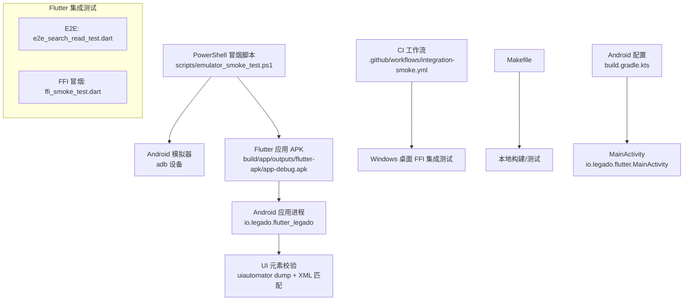
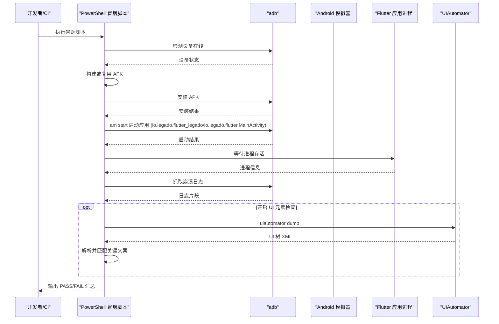
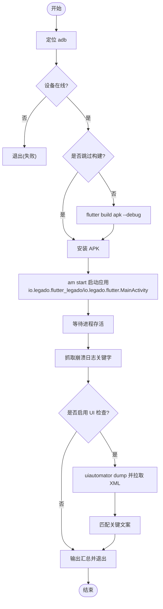
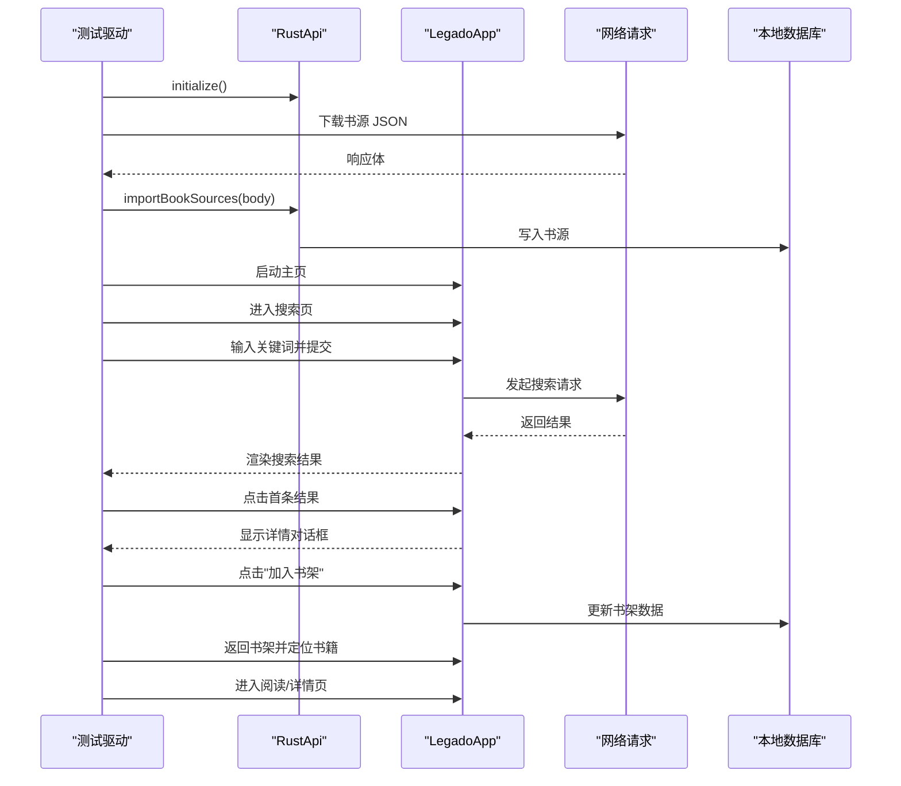
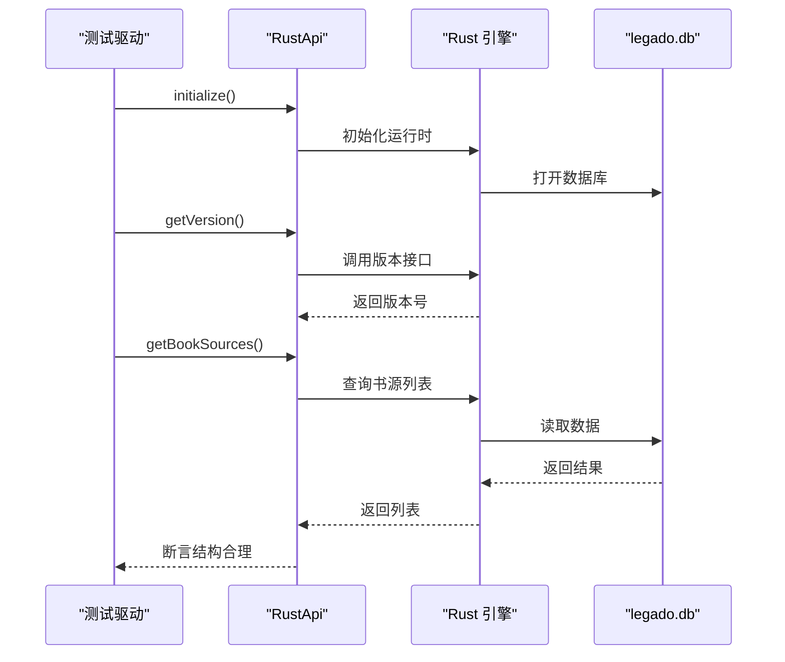
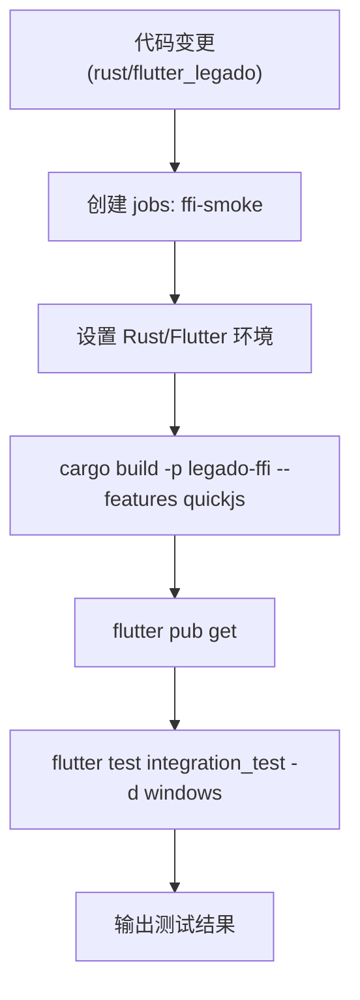
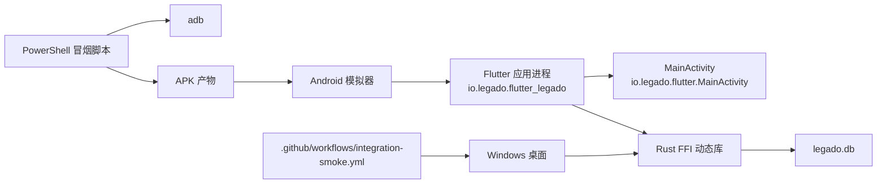

# 自动化模拟器冒烟测试

<cite>
**本文引用的文件**
- [emulator_smoke_test.ps1](file://scripts/emulator_smoke_test.ps1)
- [e2e_search_read_test.dart](file://flutter_legado/integration_test/e2e_search_read_test.dart)
- [ffi_smoke_test.dart](file://flutter_legado/integration_test/ffi_smoke_test.dart)
- [pubspec.yaml](file://flutter_legado/pubspec.yaml)
- [Makefile](file://flutter_legado/Makefile)
- [integration-smoke.yml](file://.github/workflows/integration-smoke.yml)
- [flutter-ci.yml](file://.github/workflows/flutter-ci.yml)
- [build.gradle.kts](file://flutter_legado/android/app/build.gradle.kts)
- [MainActivity.kt](file://flutter_legado/android/app/src/main/kotlin/io/legado/flutter/MainActivity.kt)
- [AndroidManifest.xml](file://flutter_legado/android/app/src/main/AndroidManifest.xml)
</cite>

## 更新摘要
**变更内容**
- 更新了模拟器冒烟脚本的包名和Activity配置，修复了自动化测试中的包名不匹配和活动不存在问题
- 修正了默认包名从 com.legado.legado_flutter 更新为 io.legado.flutter_legado
- 修正了MainActivity类引用从相对路径修正为完全限定名称 io.legado.flutter.MainActivity
- 更新了相关配置文件说明，确保与实际的Flutter应用配置保持一致

## 目录
1. [简介](#简介)
2. [项目结构](#项目结构)
3. [核心组件](#核心组件)
4. [架构总览](#架构总览)
5. [详细组件分析](#详细组件分析)
6. [依赖关系分析](#依赖关系分析)
7. [性能与稳定性考量](#性能与稳定性考量)
8. [故障排查指南](#故障排查指南)
9. [结论](#结论)
10. [附录](#附录)

## 简介
本文件面向 Legado 项目的"自动化模拟器冒烟测试"，聚焦 Flutter 端在 Android 模拟器上的端到端冒烟流程，以及 Flutter↔Rust FFI 的集成冒烟验证。内容涵盖：
- 基于 PowerShell 的模拟器冒烟脚本（构建、安装、启动、进程存活、崩溃日志检查、可选 UI 元素校验）
- Flutter 集成测试用例（E2E 搜索→书架→阅读链路；FFI 初始化与往返调用）
- CI 流水线中的集成冒烟任务（Windows 桌面环境运行 FFI 集成测试）
- 本地构建与测试命令（Makefile）

目标是帮助开发者快速理解并复用现有冒烟能力，稳定回归关键路径，并在 CI 中形成门禁。

## 项目结构
围绕冒烟测试的相关代码与配置主要分布在以下位置：
- scripts/emulator_smoke_test.ps1：Android 模拟器冒烟主脚本
- flutter_legado/integration_test/*：Flutter 集成测试用例
- flutter_legado/pubspec.yaml：Flutter 工程依赖声明（含 integration_test）
- flutter_legado/Makefile：本地构建与测试入口
- .github/workflows/integration-smoke.yml：CI 中运行 FFI 集成冒烟
- .github/workflows/flutter-ci.yml：Flutter 静态分析与单元测试
- flutter_legado/android/app/build.gradle.kts：Android 应用配置（applicationId、namespace）
- flutter_legado/android/app/src/main/kotlin/io/legado/flutter/MainActivity.kt：Flutter 应用入口 Activity

**图示来源**
- [emulator_smoke_test.ps1:1-124](file://scripts/emulator_smoke_test.ps1#L1-L124)
- [e2e_search_read_test.dart:1-152](file://flutter_legado/integration_test/e2e_search_read_test.dart#L1-L152)
- [ffi_smoke_test.dart:1-59](file://flutter_legado/integration_test/ffi_smoke_test.dart#L1-L59)
- [integration-smoke.yml:1-43](file://.github/workflows/integration-smoke.yml#L1-L43)
- [Makefile:1-59](file://flutter_legado/Makefile#L1-L59)
- [build.gradle.kts:29-30](file://flutter_legado/android/app/build.gradle.kts#L29-L30)
- [MainActivity.kt:1-11](file://flutter_legado/android/app/src/main/kotlin/io/legado/flutter/MainActivity.kt#L1-L11)

**章节来源**
- [emulator_smoke_test.ps1:1-124](file://scripts/emulator_smoke_test.ps1#L1-L124)
- [e2e_search_read_test.dart:1-152](file://flutter_legado/integration_test/e2e_search_read_test.dart#L1-L152)
- [ffi_smoke_test.dart:1-59](file://flutter_legado/integration_test/ffi_smoke_test.dart#L1-L59)
- [pubspec.yaml:1-54](file://flutter_legado/pubspec.yaml#L1-L54)
- [Makefile:1-59](file://flutter_legado/Makefile#L1-L59)
- [integration-smoke.yml:1-43](file://.github/workflows/integration-smoke.yml#L1-L43)
- [flutter-ci.yml:1-25](file://.github/workflows/flutter-ci.yml#L1-L25)
- [build.gradle.kts:1-89](file://flutter_legado/android/app/build.gradle.kts#L1-L89)
- [MainActivity.kt:1-111](file://flutter_legado/android/app/src/main/kotlin/io/legado/flutter/MainActivity.kt#L1-L111)
- [AndroidManifest.xml:1-99](file://flutter_legado/android/app/src/main/AndroidManifest.xml#L1-L99)

## 核心组件
- 模拟器冒烟脚本（PowerShell）
  - 自动定位 adb，检查设备在线
  - 构建或复用 debug APK，安装到指定模拟器
  - 启动应用并等待进程存活
  - 抓取崩溃日志关键字进行断言
  - 可选执行 UI 元素冒烟（dump UI 树并匹配关键文案）
- Flutter 集成测试
  - E2E：导入书源→搜索→加书架→打开书籍，包含多阶段截图等待点
  - FFI 冒烟：初始化 RustApi、获取版本、查询书源列表
- CI 集成冒烟
  - 在 Windows 上构建 Rust FFI（启用 quickjs），运行 Flutter 集成测试
- 本地构建与测试
  - Makefile 提供一键生成、构建、测试、清理等目标

**章节来源**
- [emulator_smoke_test.ps1:1-124](file://scripts/emulator_smoke_test.ps1#L1-L124)
- [e2e_search_read_test.dart:1-152](file://flutter_legado/integration_test/e2e_search_read_test.dart#L1-L152)
- [ffi_smoke_test.dart:1-59](file://flutter_legado/integration_test/ffi_smoke_test.dart#L1-L59)
- [integration-smoke.yml:1-43](file://.github/workflows/integration-smoke.yml#L1-L43)
- [Makefile:1-59](file://flutter_legado/Makefile#L1-L59)

## 架构总览
下图展示了从脚本触发到应用运行与验证的整体流程，包括可选的 UI 元素校验环节。

**图示来源**
- [emulator_smoke_test.ps1:33-113](file://scripts/emulator_smoke_test.ps1#L33-L113)
- [build.gradle.kts:29-30](file://flutter_legado/android/app/build.gradle.kts#L29-L30)
- [MainActivity.kt:1-11](file://flutter_legado/android/app/src/main/kotlin/io/legado/flutter/MainActivity.kt#L1-L11)

## 详细组件分析

### 模拟器冒烟脚本（PowerShell）
- 功能要点
  - 自动查找 adb 并确认目标设备在线
  - 构建或复用 debug APK，安装至指定设备
  - 启动应用并等待进程存活
  - 抓取崩溃日志关键字（FATAL EXCEPTION、E/flutter、AndroidRuntime.*FATAL）
  - 可选 UI 冒烟：dump UI 树并匹配"书架/发现/订阅/我的"等关键文案
- 关键参数
  - Device：目标模拟器名称
  - SkipBuild：跳过构建直接复用已有 APK
  - CheckUI：是否执行 UI 元素检查
  - FlutterDir、Package、Activity：Flutter 工程路径与应用包名/入口
- 退出码
  - 0：全部通过；1：任一失败

**已更新** 默认包名已从 com.legado.legado_flutter 更新为 io.legado.flutter_legado，MainActivity 类引用已从相对路径修正为完全限定名称 io.legado.flutter.MainActivity，解决了自动化测试中的包名不匹配和活动不存在问题。

**图示来源**
- [emulator_smoke_test.ps1:33-113](file://scripts/emulator_smoke_test.ps1#L33-L113)
- [build.gradle.kts:29-30](file://flutter_legado/android/app/build.gradle.kts#L29-L30)
- [MainActivity.kt:1-11](file://flutter_legado/android/app/src/main/kotlin/io/legado/flutter/MainActivity.kt#L1-L11)

**章节来源**
- [emulator_smoke_test.ps1:13-24](file://scripts/emulator_smoke_test.ps1#L13-L24)
- [emulator_smoke_test.ps1:33-48](file://scripts/emulator_smoke_test.ps1#L33-L48)
- [emulator_smoke_test.ps1:50-83](file://scripts/emulator_smoke_test.ps1#L50-L83)
- [emulator_smoke_test.ps1:85-99](file://scripts/emulator_smoke_test.ps1#L85-L99)
- [emulator_smoke_test.ps1:101-113](file://scripts/emulator_smoke_test.ps1#L101-L113)
- [emulator_smoke_test.ps1:115-121](file://scripts/emulator_smoke_test.ps1#L115-L121)
- [build.gradle.kts:29-30](file://flutter_legado/android/app/build.gradle.kts#L29-L30)
- [MainActivity.kt:1-11](file://flutter_legado/android/app/src/main/kotlin/io/legado/flutter/MainActivity.kt#L1-L11)

### Flutter 集成测试：E2E 搜索→书架→阅读
- 前置条件
  - 预置 legado.db 与 FFI 动态库
  - 通过 HTTP 下载并导入书源
- 测试步骤
  - 初始化 RustApi
  - 启动真实应用主页，进入搜索页
  - 输入中文关键词并提交搜索
  - 轮询等待搜索结果出现（交替 runAsync 与 pump）
  - 点击首条结果进入详情对话框，点击"加入书架"
  - 返回书架并定位刚加入的书，点击进入阅读/详情页
  - 在各关键页面停留一段时间，便于宿主侧截图取证
- 断言要点
  - 搜索结果出现、书名非空、书架显示刚加入的书

**图示来源**
- [e2e_search_read_test.dart:28-150](file://flutter_legado/integration_test/e2e_search_read_test.dart#L28-L150)

**章节来源**
- [e2e_search_read_test.dart:1-152](file://flutter_legado/integration_test/e2e_search_read_test.dart#L1-L152)

### Flutter 集成测试：FFI 冒烟
- 覆盖点
  - RustApi.initialize() 不抛异常（运行时初始化 + DB 打开）
  - getVersion() 返回有效版本号
  - getBookSources() 正常返回（纯 DB 查询，不依赖外网）
- 运行方式
  - 在 Windows 桌面环境执行 flutter test integration_test -d windows
  - 需要预先构建 Rust FFI 动态库（含 quickjs feature）

**图示来源**
- [ffi_smoke_test.dart:25-57](file://flutter_legado/integration_test/ffi_smoke_test.dart#L25-L57)

**章节来源**
- [ffi_smoke_test.dart:1-59](file://flutter_legado/integration_test/ffi_smoke_test.dart#L1-L59)

### CI 集成冒烟（Windows 桌面）
- 触发条件
  - 推送或 PR 修改 rust/** 或 flutter_legado/**
- 步骤
  - 设置 Rust 工具链与缓存
  - 设置 Flutter 工具链
  - 构建 Rust FFI（启用 quickjs）
  - Flutter pub get
  - 运行集成测试：flutter test integration_test -d windows

**图示来源**
- [integration-smoke.yml:1-43](file://.github/workflows/integration-smoke.yml#L1-L43)

**章节来源**
- [integration-smoke.yml:1-43](file://.github/workflows/integration-smoke.yml#L1-L43)

### 本地构建与测试（Makefile）
- 常用目标
  - gen：生成 FFI 代码并重编译 DLL（保证 content hash 同步）
  - rebuild-ffi / rebuild-ffi-stub：构建带/不带 quickjs 的 FFI 动态库
  - check：Rust 与 Flutter 静态检查
  - test：Rust 与 Flutter 单元测试
  - build / build-debug：完整构建或 Debug 构建
  - run-windows / run-windows-stub：Windows 开发运行
- 注意事项
  - gen 必须紧跟一次 DLL 重编译，避免 content hash 不同步导致初始化失败

**章节来源**
- [Makefile:1-59](file://flutter_legado/Makefile#L1-L59)

### Android 应用配置
- 包名配置
  - applicationId: io.legado.flutter_legado（定义于 build.gradle.kts）
  - namespace: io.legado.flutter（定义于 build.gradle.kts）
- MainActivity 配置
  - 类路径: io.legado.flutter.MainActivity（位于 kotlin/io/legado/flutter/ 目录）
  - 继承自 FlutterActivity，提供 Flutter 应用入口
- Manifest 配置
  - MainActivity 声明为 exported=true，支持外部启动
  - 配置了多种 Intent Filter，支持书籍文件打开

**章节来源**
- [build.gradle.kts:8-30](file://flutter_legado/android/app/build.gradle.kts#L8-L30)
- [MainActivity.kt:1-11](file://flutter_legado/android/app/src/main/kotlin/io/legado/flutter/MainActivity.kt#L1-L11)
- [AndroidManifest.xml:34-63](file://flutter_legado/android/app/src/main/AndroidManifest.xml#L34-L63)

## 依赖关系分析
- 脚本与系统工具
  - PowerShell 脚本依赖 adb（platform-tools），用于设备管理、安装、启动、日志抓取与 UI dump
- Flutter 工程依赖
  - integration_test SDK（Flutter SDK 内置）
  - http 用于下载书源
  - flutter_riverpod、path_provider 等（由应用层使用）
- CI 环境依赖
  - Windows 环境用于运行桌面版 Flutter 集成测试
  - Rust 工具链用于构建 FFI 动态库（quickjs feature）

**图示来源**
- [emulator_smoke_test.ps1:33-113](file://scripts/emulator_smoke_test.ps1#L33-L113)
- [integration-smoke.yml:1-43](file://.github/workflows/integration-smoke.yml#L1-L43)
- [ffi_smoke_test.dart:25-57](file://flutter_legado/integration_test/ffi_smoke_test.dart#L25-L57)
- [build.gradle.kts:29-30](file://flutter_legado/android/app/build.gradle.kts#L29-L30)
- [MainActivity.kt:1-11](file://flutter_legado/android/app/src/main/kotlin/io/legado/flutter/MainActivity.kt#L1-L11)

**章节来源**
- [pubspec.yaml:9-31](file://flutter_legado/pubspec.yaml#L9-L31)
- [pubspec.yaml:32-46](file://flutter_legado/pubspec.yaml#L32-L46)
- [build.gradle.kts:29-30](file://flutter_legado/android/app/build.gradle.kts#L29-L30)
- [MainActivity.kt:1-11](file://flutter_legado/android/app/src/main/kotlin/io/legado/flutter/MainActivity.kt#L1-L11)

## 性能与稳定性考量
- 网络与 UI 轮询
  - E2E 测试中对搜索结果与书架加载采用"真实等待 + pump"的轮询策略，避免状态到达但 UI 未重建导致的误判
- 崩溃日志捕获
  - 冒烟脚本抓取最近日志并匹配关键字，减少误报的同时提高问题定位效率
- FFI 初始化与内容哈希
  - 使用 Makefile 的 gen 目标确保 Dart 与 Rust 侧 content hash 一致，避免初始化失败
- 构建优化
  - 开发态可使用 stub 构建（rebuild-ffi-stub）加速迭代；发布/验收使用 quickjs 特性以支持 JS 规则
- 包名一致性
  - 确保脚本中的包名与实际应用的 applicationId 保持一致，避免启动失败

[本节为通用指导，无需特定文件引用]

## 故障排查指南
- 找不到 adb
  - 现象：脚本抛出未找到 adb 的错误
  - 处理：安装 Android platform-tools 或设置 ANDROID_HOME/ANDROID_SDK_ROOT
- 设备不在线
  - 现象：adb devices 中未见 device 状态
  - 处理：使用 flutter emulators 启动模拟器后重试
- APK 构建失败
  - 现象：flutter build apk 返回非零退出码或 APK 不存在
  - 处理：检查 Flutter 环境与依赖，必要时清理并重新构建
- 应用进程未找到
  - 现象：启动后进程不存在
  - 处理：检查包名/活动名是否正确，查看 logcat 错误
- **包名不匹配问题**（新增）
  - 现象：Activity does not exist 错误或应用无法启动
  - 处理：确认脚本中的 Package 参数为 io.legado.flutter_legado，Activity 参数为 io.legado.flutter.MainActivity
- **Activity 路径错误**（新增）
  - 现象：相对路径 .MainActivity 导致活动不存在
  - 处理：使用完全限定类名 io.legado.flutter.MainActivity 而非相对路径
- 崩溃日志检测
  - 现象：检测到 FATAL EXCEPTION/E/flutter/AndroidRuntime.*FATAL
  - 处理：根据日志定位崩溃点，必要时增加等待时间或修复异常
- UI 元素未检出
  - 现象：UI dump 未匹配到关键文案
  - 处理：检查界面文案是否变化，或调整匹配策略
- FFI 初始化失败
  - 现象：content hash 不同步导致初始化失败
  - 处理：执行 make gen 或手动重编译 FFI 动态库

**章节来源**
- [emulator_smoke_test.ps1:33-48](file://scripts/emulator_smoke_test.ps1#L33-L48)
- [emulator_smoke_test.ps1:50-99](file://scripts/emulator_smoke_test.ps1#L50-L99)
- [emulator_smoke_test.ps1:101-113](file://scripts/emulator_smoke_test.ps1#L101-L113)
- [emulator_smoke_test.ps1:18-23](file://scripts/emulator_smoke_test.ps1#L18-L23)
- [build.gradle.kts:29-30](file://flutter_legado/android/app/build.gradle.kts#L29-L30)
- [MainActivity.kt:1-11](file://flutter_legado/android/app/src/main/kotlin/io/legado/flutter/MainActivity.kt#L1-L11)
- [Makefile:3-8](file://flutter_legado/Makefile#L3-L8)

## 结论
本项目已具备完善的自动化冒烟能力：
- 在 Android 模拟器上实现"构建→安装→启动→存活→崩溃日志→可选 UI 校验"的闭环
- 在 Flutter 集成测试中覆盖 E2E 关键路径与 FFI 往返调用
- 在 CI 中运行桌面端 FFI 集成测试，保障跨平台一致性
- **已修复包名和 Activity 配置问题**，确保自动化测试的稳定性和可靠性

建议在日常开发与合并前，优先运行上述冒烟用例，快速发现回归问题，提升交付质量。

[本节为总结性内容，无需特定文件引用]

## 附录
- 常用命令参考
  - 本地模拟器冒烟：执行 PowerShell 脚本（可传入 Device/SkipBuild/CheckUI 等参数）
  - 运行 Flutter 集成测试：flutter test integration_test -d <设备>
  - 构建与测试：make build / make test / make check
  - CI 触发：提交 rust/** 或 flutter_legado/** 变更将触发集成冒烟任务
- **重要配置说明**
  - 包名：io.legado.flutter_legado（applicationId）
  - 命名空间：io.legado.flutter（namespace）
  - MainActivity：io.legado.flutter.MainActivity（完全限定类名）

[本节为补充说明，无需特定文件引用]