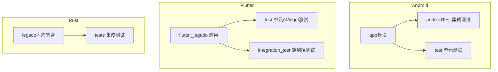
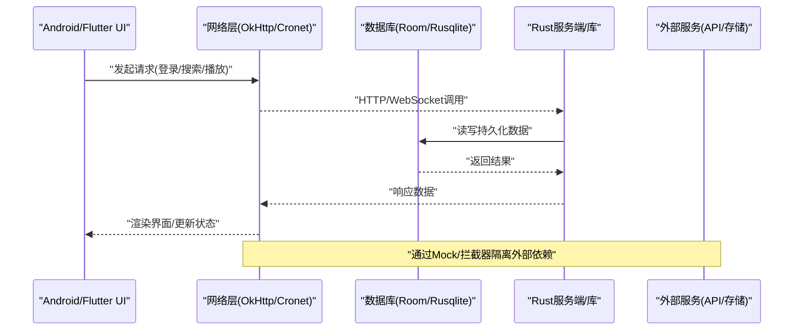
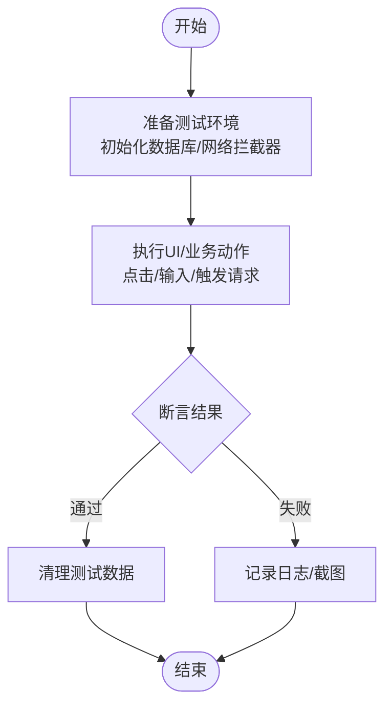
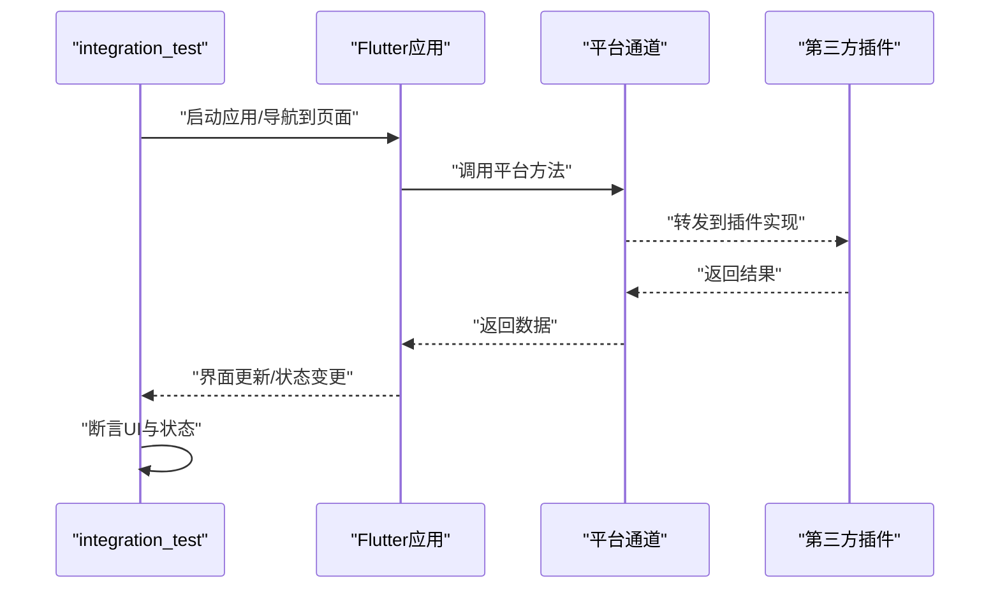
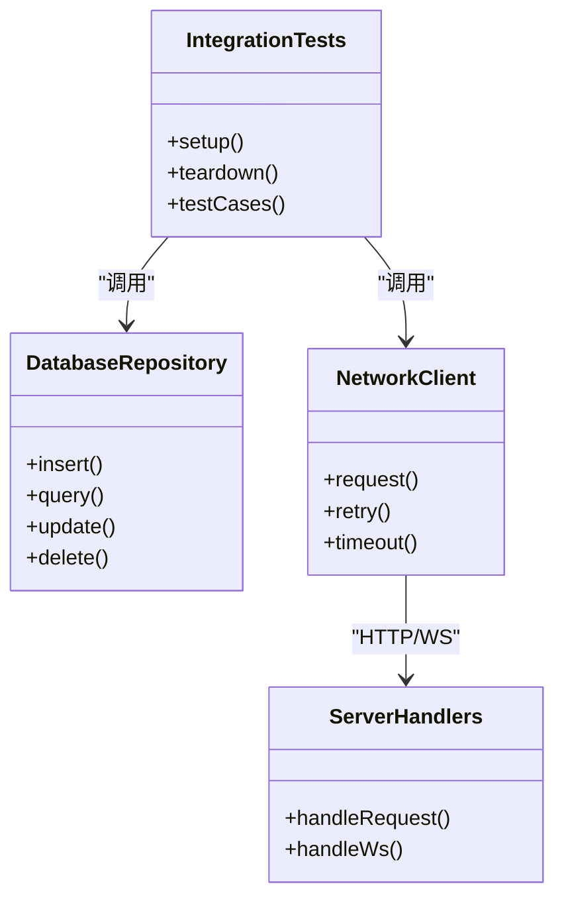
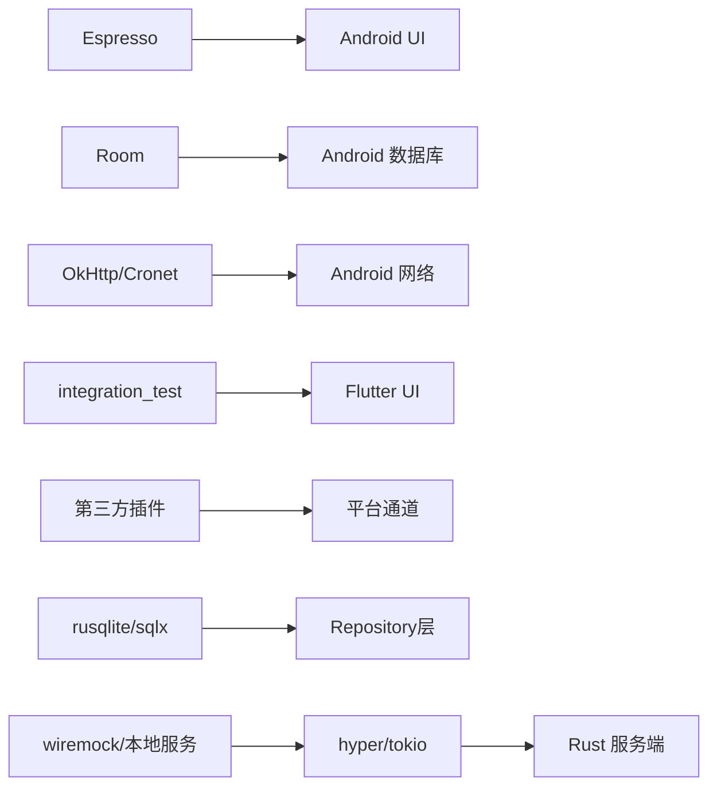

# 集成测试

<cite>
**本文引用的文件**   
- [app/src/androidTest/java/io/legado/app/AndroidJsTest.kt](file://app/src/androidTest/java/io/legado/app/AndroidJsTest.kt)
- [app/src/androidTest/java/io/legado/app/ExampleInstrumentedTest.kt](file://app/src/androidTest/java/io/legado/app/ExampleInstrumentedTest.kt)
- [app/src/androidTest/java/io/legado/app/HttpTest.kt](file://app/src/androidTest/java/io/legado/app/HttpTest.kt)
- [app/src/androidTest/java/io/legado/app/HttpTtsTest.kt](file://app/src/androidTest/java/io/legado/app/HttpTtsTest.kt)
- [app/src/androidTest/java/io/legado/app/MigrationTest.kt](file://app/src/androidTest/java/io/legado/app/MigrationTest.kt)
- [app/src/androidTest/java/io/legado/app/UpdateTest.kt](file://app/src/androidTest/java/io/legado/app/UpdateTest.kt)
- [app/src/androidTest/java/io/legado/app/ui/font/FontSelectionInflationTest.kt](file://app/src/androidTest/java/io/legado/app/ui/font/FontSelectionInflationTest.kt)
- [app/build.gradle](file://app/build.gradle)
- [flutter_legado/pubspec.yaml](file://flutter_legado/pubspec.yaml)
- [rust/legado-db/Cargo.toml](file://rust/legado-db/Cargo.toml)
- [rust/legado-db/tests/integration_test.rs](file://rust/legado-db/tests/integration_test.rs)
- [rust/legado-server/Cargo.toml](file://rust/legado-server/Cargo.toml)
- [rust/legado-server/tests/integration_test.rs](file://rust/legado-server/tests/integration_test.rs)
- [rust/legado-server/tests/ws_test.rs](file://rust/legado-server/tests/ws_test.rs)
</cite>

## 目录
1. [简介](#简介)
2. [项目结构](#项目结构)
3. [核心组件](#核心组件)
4. [架构总览](#架构总览)
5. [详细组件分析](#详细组件分析)
6. [依赖关系分析](#依赖关系分析)
7. [性能考虑](#性能考虑)
8. [故障排查指南](#故障排查指南)
9. [结论](#结论)
10. [附录](#附录)

## 简介
本文件面向Legado项目的集成测试策略与实现指南，覆盖Android（Espresso、Room、网络模拟）、Flutter（integration_test包）以及Rust（数据库、网络、多模块交互）三大平台的集成测试。文档提供测试环境搭建、外部依赖模拟、异步操作测试、数据清理策略、测试数据管理、并行执行与性能基准测试等实践建议，并结合仓库中现有测试样例给出可操作的落地方案。

## 项目结构
本项目包含Android应用、Flutter跨平台应用与Rust后端库三个主要子系统，各自具备独立的测试目录与构建配置：
- Android端：androidTest用于设备/模拟器上的UI与系统级集成测试；test用于JVM单元测试。
- Flutter端：test为单元与Widget测试；integration_test目录用于端到端跨平台测试。
- Rust端：各crate的tests目录存放集成测试；Cargo.toml定义测试目标与依赖。

**图表来源** 
- [app/build.gradle](file://app/build.gradle)
- [flutter_legado/pubspec.yaml](file://flutter_legado/pubspec.yaml)
- [rust/legado-db/Cargo.toml](file://rust/legado-db/Cargo.toml)
- [rust/legado-server/Cargo.toml](file://rust/legado-server/Cargo.toml)

**章节来源**
- [app/build.gradle](file://app/build.gradle)
- [flutter_legado/pubspec.yaml](file://flutter_legado/pubspec.yaml)
- [rust/legado-db/Cargo.toml](file://rust/legado-db/Cargo.toml)
- [rust/legado-server/Cargo.toml](file://rust/legado-server/Cargo.toml)

## 核心组件
本节聚焦三类关键集成测试能力：Android UI与系统交互、Flutter跨平台端到端、Rust后端服务与数据库。

- Android集成测试要点
  - UI交互：使用Espresso进行界面断言与用户操作模拟。
  - 数据库：基于Room的集成测试，使用内存数据库或测试专用Schema。
  - 网络：通过OkHttp MockWebServer或Cronet拦截器进行API模拟。
  - 异步：结合Coroutines与TestDispatcher控制时间与时序。
  - 数据清理：每个用例前后初始化/清理测试数据，避免相互污染。

- Flutter集成测试要点
  - 端到端：使用integration_test驱动真实设备/模拟器，验证跨平台UI流程。
  - 平台通道：通过Platform Channel或插件接口模拟平台行为。
  - 第三方插件：使用mockito或自定义绑定替换插件实现。
  - 并发与状态：确保页面导航与状态更新在测试中稳定可复现。

- Rust集成测试要点
  - 数据库：使用内存SQLite或临时文件数据库，配合迁移脚本验证Schema演进。
  - 网络：使用wiremock或本地HTTP服务器模拟外部API。
  - 多模块：通过lib入口暴露函数，由tests目录中的用例组合调用。
  - 并发：利用tokio runtime与异步测试框架保证并发安全。

**章节来源**
- [app/src/androidTest/java/io/legado/app/ExampleInstrumentedTest.kt](file://app/src/androidTest/java/io/legado/app/ExampleInstrumentedTest.kt)
- [app/src/androidTest/java/io/legado/app/HttpTest.kt](file://app/src/androidTest/java/io/legado/app/HttpTest.kt)
- [app/src/androidTest/java/io/legado/app/HttpTtsTest.kt](file://app/src/androidTest/java/io/legado/app/HttpTtsTest.kt)
- [app/src/androidTest/java/io/legado/app/MigrationTest.kt](file://app/src/androidTest/java/io/legado/app/MigrationTest.kt)
- [app/src/androidTest/java/io/legado/app/UpdateTest.kt](file://app/src/androidTest/java/io/legado/app/UpdateTest.kt)
- [app/src/androidTest/java/io/legado/app/ui/font/FontSelectionInflationTest.kt](file://app/src/androidTest/java/io/legado/app/ui/font/FontSelectionInflationTest.kt)
- [flutter_legado/pubspec.yaml](file://flutter_legado/pubspec.yaml)
- [rust/legado-db/tests/integration_test.rs](file://rust/legado-db/tests/integration_test.rs)
- [rust/legado-server/tests/integration_test.rs](file://rust/legado-server/tests/integration_test.rs)
- [rust/legado-server/tests/ws_test.rs](file://rust/legado-server/tests/ws_test.rs)

## 架构总览
下图展示Android、Flutter与Rust三端的集成测试如何协同工作，涵盖UI、数据库、网络与服务端交互的关键路径。

**图表来源** 
- [app/src/androidTest/java/io/legado/app/HttpTest.kt](file://app/src/androidTest/java/io/legado/app/HttpTest.kt)
- [app/src/androidTest/java/io/legado/app/MigrationTest.kt](file://app/src/androidTest/java/io/legado/app/MigrationTest.kt)
- [rust/legado-server/tests/integration_test.rs](file://rust/legado-server/tests/integration_test.rs)
- [rust/legado-db/tests/integration_test.rs](file://rust/legado-db/tests/integration_test.rs)

## 详细组件分析

### Android集成测试（Espresso、Room、网络模拟）
- UI交互测试
  - 使用Espresso对界面元素进行点击、输入与断言。
  - 针对字体选择等特定场景，验证资源加载与布局膨胀过程。
- 数据库操作测试
  - 基于Room的迁移测试，确保Schema版本升级与数据兼容。
  - 使用内存数据库或测试专用实例，保证用例隔离。
- 网络接口测试
  - 通过MockWebServer或Cronet拦截器模拟HTTP响应，覆盖成功、失败与异常分支。
  - 针对TTS等特定功能，验证音频流处理与回调时序。
- 异步操作测试
  - 使用TestDispatcher或同步屏障等待协程完成，避免竞态条件。
- 数据清理策略
  - 每个用例前插入初始数据，结束后清理或回滚事务。

**图表来源** 
- [app/src/androidTest/java/io/legado/app/ui/font/FontSelectionInflationTest.kt](file://app/src/androidTest/java/io/legado/app/ui/font/FontSelectionInflationTest.kt)
- [app/src/androidTest/java/io/legado/app/MigrationTest.kt](file://app/src/androidTest/java/io/legado/app/MigrationTest.kt)
- [app/src/androidTest/java/io/legado/app/HttpTest.kt](file://app/src/androidTest/java/io/legado/app/HttpTest.kt)
- [app/src/androidTest/java/io/legado/app/HttpTtsTest.kt](file://app/src/androidTest/java/io/legado/app/HttpTtsTest.kt)

**章节来源**
- [app/src/androidTest/java/io/legado/app/ui/font/FontSelectionInflationTest.kt](file://app/src/androidTest/java/io/legado/app/ui/font/FontSelectionInflationTest.kt)
- [app/src/androidTest/java/io/legado/app/MigrationTest.kt](file://app/src/androidTest/java/io/legado/app/MigrationTest.kt)
- [app/src/androidTest/java/io/legado/app/HttpTest.kt](file://app/src/androidTest/java/io/legado/app/HttpTest.kt)
- [app/src/androidTest/java/io/legado/app/HttpTtsTest.kt](file://app/src/androidTest/java/io/legado/app/HttpTtsTest.kt)

### Flutter集成测试（integration_test包）
- 跨平台UI测试
  - 使用integration_test驱动真实设备/模拟器，验证页面导航、列表滚动、表单提交等。
- 平台通道测试
  - 通过Platform Channel发送消息并断言返回值，模拟平台能力（如文件系统、传感器）。
- 第三方插件测试
  - 使用mockito或自定义绑定替换插件实现，确保测试稳定性。
- 异步与状态管理
  - 等待Future完成，使用setState或Provider/Bloc状态变化断言。
- 数据与缓存
  - 预置测试数据到SharedPreferences或本地存储，测试后清理。

**图表来源** 
- [flutter_legado/pubspec.yaml](file://flutter_legado/pubspec.yaml)

**章节来源**
- [flutter_legado/pubspec.yaml](file://flutter_legado/pubspec.yaml)

### Rust集成测试（数据库、网络、多模块交互）
- 数据库集成测试
  - 使用内存SQLite或临时文件数据库，验证CRUD与迁移逻辑。
  - 通过repository层封装查询，确保测试覆盖所有边界条件。
- 网络请求测试
  - 使用本地HTTP服务器或wiremock模拟API，覆盖成功、错误与超时场景。
- 多模块交互测试
  - 通过lib入口组合多个crate的功能，验证跨模块协作。
- WebSocket测试
  - 启动本地WS服务器，验证连接建立、消息收发与断开重连。

**图表来源** 
- [rust/legado-db/tests/integration_test.rs](file://rust/legado-db/tests/integration_test.rs)
- [rust/legado-server/tests/integration_test.rs](file://rust/legado-server/tests/integration_test.rs)
- [rust/legado-server/tests/ws_test.rs](file://rust/legado-server/tests/ws_test.rs)

**章节来源**
- [rust/legado-db/tests/integration_test.rs](file://rust/legado-db/tests/integration_test.rs)
- [rust/legado-server/tests/integration_test.rs](file://rust/legado-server/tests/integration_test.rs)
- [rust/legado-server/tests/ws_test.rs](file://rust/legado-server/tests/ws_test.rs)

## 依赖关系分析
- Android端依赖
  - Espresso用于UI自动化。
  - Room用于数据库抽象与迁移。
  - OkHttp/Cronet用于网络请求，可通过拦截器或MockWebServer模拟。
- Flutter端依赖
  - integration_test用于端到端测试。
  - platform_channel与第三方插件需通过mock或stub替代。
- Rust端依赖
  - rusqlite/sqlx用于数据库访问。
  - hyper/tokio用于HTTP与WebSocket服务。
  - wiremock或本地服务器用于外部API模拟。

**图表来源** 
- [app/build.gradle](file://app/build.gradle)
- [flutter_legado/pubspec.yaml](file://flutter_legado/pubspec.yaml)
- [rust/legado-db/Cargo.toml](file://rust/legado-db/Cargo.toml)
- [rust/legado-server/Cargo.toml](file://rust/legado-server/Cargo.toml)

**章节来源**
- [app/build.gradle](file://app/build.gradle)
- [flutter_legado/pubspec.yaml](file://flutter_legado/pubspec.yaml)
- [rust/legado-db/Cargo.toml](file://rust/legado-db/Cargo.toml)
- [rust/legado-server/Cargo.toml](file://rust/legado-server/Cargo.toml)

## 性能考虑
- 测试数据规模
  - 使用最小必要数据集，避免大对象影响执行速度。
- 并发与并行
  - Android：使用并行设备或分片执行用例。
  - Flutter：按场景分组，避免共享状态冲突。
  - Rust：利用多线程与异步任务提升吞吐。
- I/O优化
  - 数据库：优先内存数据库，减少磁盘I/O。
  - 网络：批量请求与连接池复用。
- 基准测试
  - 引入性能基准框架，测量关键路径耗时与内存占用。
  - 对比不同实现方案的优劣，持续回归监控。

[本节为通用指导，不直接分析具体文件]

## 故障排查指南
- Android
  - UI未找到元素：检查ID、文本或层级定位是否正确。
  - 数据库迁移失败：核对版本号与迁移脚本一致性。
  - 网络超时：确认MockWebServer或拦截器配置正确。
- Flutter
  - 平台通道报错：检查消息格式与类型匹配。
  - 插件不可用：确认依赖声明与权限配置。
- Rust
  - 数据库锁竞争：确保单写或多写并发控制。
  - WS连接断开：检查心跳与重连逻辑。

**章节来源**
- [app/src/androidTest/java/io/legado/app/HttpTest.kt](file://app/src/androidTest/java/io/legado/app/HttpTest.kt)
- [app/src/androidTest/java/io/legado/app/MigrationTest.kt](file://app/src/androidTest/java/io/legado/app/MigrationTest.kt)
- [rust/legado-server/tests/ws_test.rs](file://rust/legado-server/tests/ws_test.rs)

## 结论
通过统一的集成测试策略，Legado项目在Android、Flutter与Rust三端实现了从UI到数据、从网络到服务的全面覆盖。借助Mock与内存数据库隔离外部依赖，结合并行执行与性能基准，可有效提升质量与交付效率。建议持续完善测试用例，强化边界与异常场景，确保系统稳定性与可维护性。

[本节为总结性内容，不直接分析具体文件]

## 附录
- 测试环境搭建
  - Android：安装SDK与模拟器，配置Gradle测试任务。
  - Flutter：安装Flutter SDK与设备驱动，启用integration_test。
  - Rust：安装工具链与cargo test支持，配置crate依赖。
- 外部依赖模拟
  - 网络：MockWebServer、wiremock、本地HTTP/WS服务器。
  - 数据库：内存SQLite、测试专用Schema。
  - 插件：mockito、自定义绑定。
- 异步操作测试
  - Android：TestDispatcher、runBlocking。
  - Flutter：Future.wait、async/await。
  - Rust：tokio::runtime、assert_async。
- 数据清理策略
  - 事务回滚、临时文件删除、内存重置。
- 测试数据管理
  - JSON/YAML fixtures、工厂模式生成、种子数据脚本。
- 并行执行与性能基准
  - Gradle并行、Flutter分片、cargo test --jobs。
  - 引入基准框架，监控关键指标。

[本节为补充信息，不直接分析具体文件]