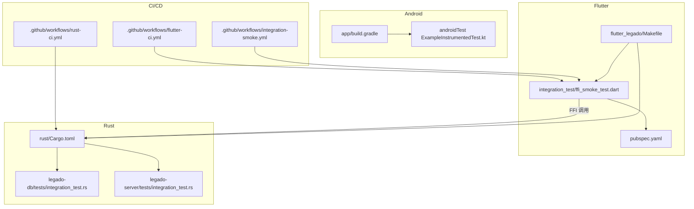
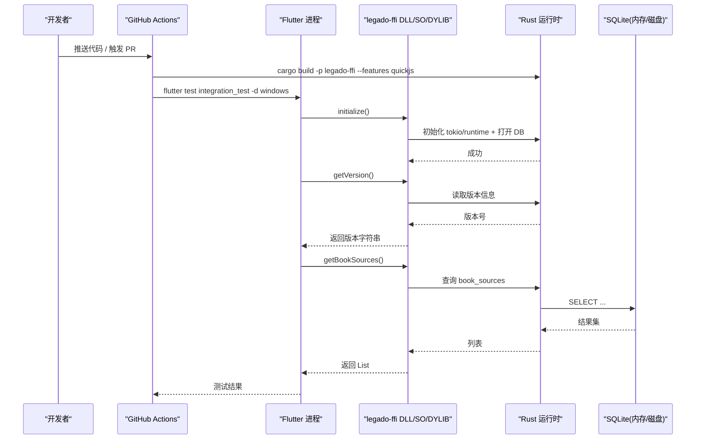
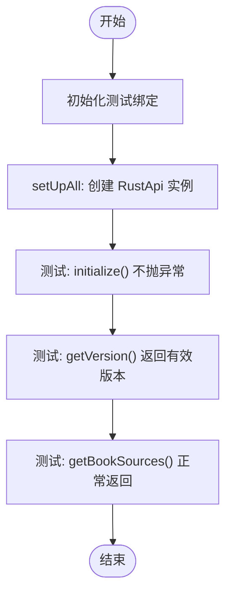
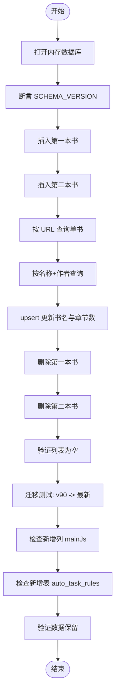
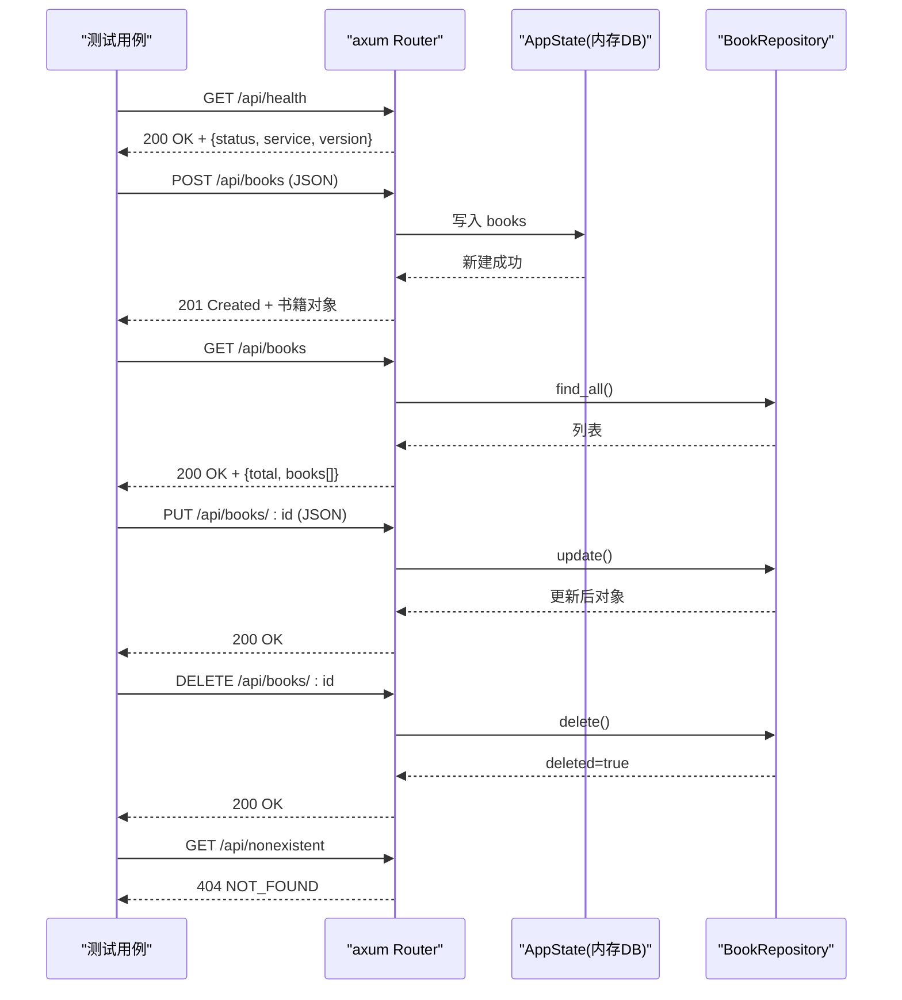
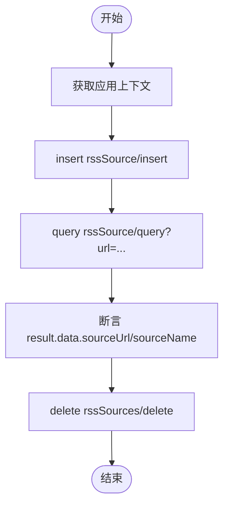
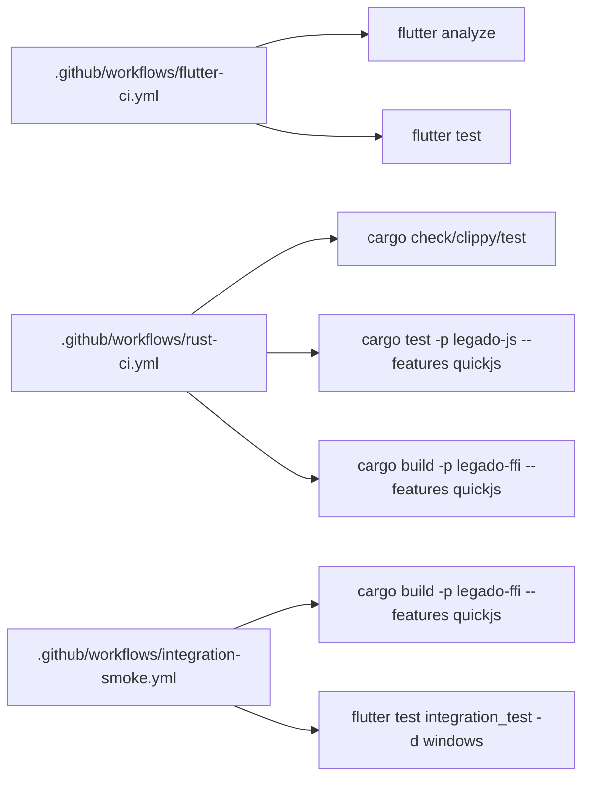
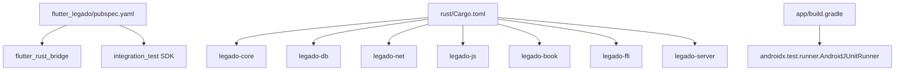

# 集成测试基础设施

<cite>
**本文引用的文件**   
- [README.md](file://README.md)
- [integration_test/ffi_smoke_test.dart](file://flutter_legado/integration_test/ffi_smoke_test.dart)
- [pubspec.yaml](file://flutter_legado/pubspec.yaml)
- [Makefile](file://flutter_legado/Makefile)
- [.github/workflows/integration-smoke.yml](file://.github/workflows/integration-smoke.yml)
- [.github/workflows/flutter-ci.yml](file://.github/workflows/flutter-ci.yml)
- [.github/workflows/rust-ci.yml](file://.github/workflows/rust-ci.yml)
- [app/build.gradle](file://app/build.gradle)
- [app/src/androidTest/java/io/legado/app/ExampleInstrumentedTest.kt](file://app/src/androidTest/java/io/legado/app/ExampleInstrumentedTest.kt)
- [rust/Cargo.toml](file://rust/Cargo.toml)
- [rust/legado-db/tests/integration_test.rs](file://rust/legado-db/tests/integration_test.rs)
- [rust/legado-server/tests/integration_test.rs](file://rust/legado-server/tests/integration_test.rs)
</cite>

## 目录
1. [简介](#简介)
2. [项目结构](#项目结构)
3. [核心组件](#核心组件)
4. [架构总览](#架构总览)
5. [详细组件分析](#详细组件分析)
6. [依赖关系分析](#依赖关系分析)
7. [性能考量](#性能考量)
8. [故障排查指南](#故障排查指南)
9. [结论](#结论)
10. [附录](#附录)

## 简介
本仓库采用“Rust 核心引擎 + Flutter UI”的跨平台架构，集成测试覆盖三层：
- Rust 层：数据库迁移与 CRUD、HTTP 服务端到端调用。
- Flutter 层：单元测试、Widget 测试、FFI 冒烟测试（Flutter↔Rust）。
- Android 层：仪器化测试验证 ContentProvider 等系统级能力。

通过 CI/CD 流水线将各层测试串联，确保在代码变更时快速反馈。

## 项目结构
集成测试相关的关键位置与职责：
- flutter_legado/integration_test：Flutter 侧 FFI 冒烟测试，验证 Rust 初始化、版本获取、DB 查询往返。
- rust/*/tests：Rust 层的集成测试，包含 legado-db 的迁移与 CRUD、legado-server 的 HTTP 路由与状态。
- app/src/androidTest：Android 仪器化测试，验证 ReaderProvider 等系统组件。
- .github/workflows：CI 工作流，分别执行 Flutter 静态检查与单测、Rust 构建与测试、以及端到端 FFI 冒烟测试。
- Makefile：统一入口，聚合 Rust 与 Flutter 的构建与测试命令。

图表来源
- [integration_test/ffi_smoke_test.dart:1-59](file://flutter_legado/integration_test/ffi_smoke_test.dart#L1-L59)
- [pubspec.yaml:1-51](file://flutter_legado/pubspec.yaml#L1-L51)
- [rust/Cargo.toml:1-25](file://rust/Cargo.toml#L1-L25)
- [rust/legado-db/tests/integration_test.rs:1-294](file://rust/legado-db/tests/integration_test.rs#L1-L294)
- [rust/legado-server/tests/integration_test.rs:1-289](file://rust/legado-server/tests/integration_test.rs#L1-L289)
- [app/build.gradle:1-371](file://app/build.gradle#L1-L371)
- [app/src/androidTest/java/io/legado/app/ExampleInstrumentedTest.kt:1-64](file://app/src/androidTest/java/io/legado/app/ExampleInstrumentedTest.kt#L1-L64)
- [.github/workflows/flutter-ci.yml:1-25](file://.github/workflows/flutter-ci.yml#L1-L25)
- [.github/workflows/rust-ci.yml:1-36](file://.github/workflows/rust-ci.yml#L1-L36)
- [.github/workflows/integration-smoke.yml:1-43](file://.github/workflows/integration-smoke.yml#L1-L43)
- [flutter_legado/Makefile:1-53](file://flutter_legado/Makefile#L1-L53)

章节来源
- [README.md:1-121](file://README.md#L1-L121)

## 核心组件
- Flutter FFI 冒烟测试：验证 Rust 运行时初始化、版本号返回、书籍源列表查询（纯 DB，不依赖外网）。
- Rust 数据库集成测试：内存数据库上的完整 CRUD、带 ReadConfig 的字段更新、从 v90 到最新版本的迁移与数据保留。
- Rust HTTP 服务集成测试：健康检查、书架 CRUD、搜索接口、未知路由 404。
- Android 仪器化测试：ReaderProvider 的插入、查询、删除流程。
- CI/CD 工作流：Flutter 静态检查与单测、Rust 全量测试与 quickjs 特性测试、Windows 上 FFI 冒烟测试。
- Makefile 聚合命令：一键生成 FFI 绑定并重建动态库，避免 content hash 不同步问题。

章节来源
- [integration_test/ffi_smoke_test.dart:1-59](file://flutter_legado/integration_test/ffi_smoke_test.dart#L1-L59)
- [rust/legado-db/tests/integration_test.rs:1-294](file://rust/legado-db/tests/integration_test.rs#L1-L294)
- [rust/legado-server/tests/integration_test.rs:1-289](file://rust/legado-server/tests/integration_test.rs#L1-L289)
- [app/src/androidTest/java/io/legado/app/ExampleInstrumentedTest.kt:1-64](file://app/src/androidTest/java/io/legado/app/ExampleInstrumentedTest.kt#L1-L64)
- [.github/workflows/flutter-ci.yml:1-25](file://.github/workflows/flutter-ci.yml#L1-L25)
- [.github/workflows/rust-ci.yml:1-36](file://.github/workflows/rust-ci.yml#L1-L36)
- [.github/workflows/integration-smoke.yml:1-43](file://.github/workflows/integration-smoke.yml#L1-L43)
- [flutter_legado/Makefile:1-53](file://flutter_legado/Makefile#L1-L53)

## 架构总览
下图展示 Flutter 与 Rust 之间的端到端集成测试路径，以及 CI 如何驱动构建与执行。

图表来源
- [.github/workflows/integration-smoke.yml:1-43](file://.github/workflows/integration-smoke.yml#L1-L43)
- [integration_test/ffi_smoke_test.dart:1-59](file://flutter_legado/integration_test/ffi_smoke_test.dart#L1-L59)
- [rust/Cargo.toml:1-25](file://rust/Cargo.toml#L1-L25)

## 详细组件分析

### Flutter FFI 冒烟测试
- 目标：验证 Rust 初始化、版本获取、书籍源查询的 FFI 往返。
- 关键点：
  - 使用 IntegrationTestWidgetsFlutterBinding 初始化测试环境。
  - 通过 RustApi.initialize() 启动 Rust 运行时与数据库。
  - 断言版本号非空且包含点号；getBookSources() 返回合理结构。
- 运行方式：flutter test integration_test -d windows（需预构建 legado_ffi 动态库）。

图表来源
- [integration_test/ffi_smoke_test.dart:1-59](file://flutter_legado/integration_test/ffi_smoke_test.dart#L1-L59)

章节来源
- [integration_test/ffi_smoke_test.dart:1-59](file://flutter_legado/integration_test/ffi_smoke_test.dart#L1-L59)

### Rust 数据库集成测试（legado-db）
- 目标：内存数据库上的完整书籍生命周期、ReadConfig 字段更新、从 v90 到最新版本的迁移与数据保留。
- 关键点：
  - 使用 Database::open_in_memory() 自动迁移至最新版本。
  - BookRepository 提供 insert/find/update/delete 等方法。
  - 构造 v90 最小 schema，验证迁移新增列与表存在性。
  - 迁移前后数据一致性校验。

图表来源
- [rust/legado-db/tests/integration_test.rs:1-294](file://rust/legado-db/tests/integration_test.rs#L1-L294)

章节来源
- [rust/legado-db/tests/integration_test.rs:1-294](file://rust/legado-db/tests/integration_test.rs#L1-L294)

### Rust HTTP 服务集成测试（legado-server）
- 目标：真实 axum Router 下的健康检查、书架 CRUD、搜索接口、未知路由 404。
- 关键点：
  - 使用 make_test_state() 构建共享 AppState（内存 DB、下载管理器）。
  - 通过 Request builder 发送 HTTP 请求，断言状态码与响应体。
  - 搜索接口基于已插入的书籍数据进行关键词匹配。

图表来源
- [rust/legado-server/tests/integration_test.rs:1-289](file://rust/legado-server/tests/integration_test.rs#L1-L289)

章节来源
- [rust/legado-server/tests/integration_test.rs:1-289](file://rust/legado-server/tests/integration_test.rs#L1-L289)

### Android 仪器化测试（ReaderProvider）
- 目标：验证 ContentProvider 的 RSS 源插入、查询、删除流程。
- 关键点：
  - 使用 ApplicationProvider 获取 Context。
  - 构造 JSON 源并通过 insert/query/delete URI 操作 Provider。
  - 断言查询结果中的 sourceUrl 与 sourceName。

图表来源
- [app/src/androidTest/java/io/legado/app/ExampleInstrumentedTest.kt:1-64](file://app/src/androidTest/java/io/legado/app/ExampleInstrumentedTest.kt#L1-L64)

章节来源
- [app/src/androidTest/java/io/legado/app/ExampleInstrumentedTest.kt:1-64](file://app/src/androidTest/java/io/legado/app/ExampleInstrumentedTest.kt#L1-L64)

### CI/CD 工作流
- Flutter CI：安装 Flutter SDK，执行 analyze 与 test。
- Rust CI：workspace 级别 check/clippy/test，quickjs 特性单独测试。
- 集成冒烟：Windows 上构建 legado-ffi DLL，运行 Flutter 集成测试。

图表来源
- [.github/workflows/flutter-ci.yml:1-25](file://.github/workflows/flutter-ci.yml#L1-L25)
- [.github/workflows/rust-ci.yml:1-36](file://.github/workflows/rust-ci.yml#L1-L36)
- [.github/workflows/integration-smoke.yml:1-43](file://.github/workflows/integration-smoke.yml#L1-L43)

章节来源
- [.github/workflows/flutter-ci.yml:1-25](file://.github/workflows/flutter-ci.yml#L1-L25)
- [.github/workflows/rust-ci.yml:1-36](file://.github/workflows/rust-ci.yml#L1-L36)
- [.github/workflows/integration-smoke.yml:1-43](file://.github/workflows/integration-smoke.yml#L1-L43)

### Makefile 与本地开发
- flutter_legado/Makefile：gen 命令会先执行代码生成，再重建 FFI 动态库，避免 content hash 不同步导致的初始化失败。
- 顶层 Makefile：聚合 Rust 与 Flutter 的检查、测试与构建命令。

章节来源
- [flutter_legado/Makefile:1-53](file://flutter_legado/Makefile#L1-L53)
- [Makefile:1-36](file://Makefile#L1-L36)

## 依赖关系分析
- Flutter 依赖 flutter_rust_bridge 与 integration_test SDK，用于 FFI 绑定与集成测试框架。
- Rust workspace 管理多个 crate，其中 legado-ffi 暴露给 Flutter，legado-db 与 legado-server 提供数据与服务能力。
- Android 模块通过 Gradle 配置测试运行器与依赖。

图表来源
- [pubspec.yaml:1-51](file://flutter_legado/pubspec.yaml#L1-L51)
- [rust/Cargo.toml:1-25](file://rust/Cargo.toml#L1-L25)
- [app/build.gradle:1-371](file://app/build.gradle#L1-L371)

章节来源
- [pubspec.yaml:1-51](file://flutter_legado/pubspec.yaml#L1-L51)
- [rust/Cargo.toml:1-25](file://rust/Cargo.toml#L1-L25)
- [app/build.gradle:1-371](file://app/build.gradle#L1-L371)

## 性能考量
- 集成测试优先使用内存数据库，减少 I/O 开销，提高稳定性与速度。
- FFI 冒烟测试仅覆盖必要路径（初始化、版本、DB 查询），避免网络与 JS 引擎带来的不确定性。
- CI 缓存 Rust 与 Flutter 依赖，缩短构建时间。

[本节为通用指导，无需引用具体文件]

## 故障排查指南
- Flutter 侧 FFI 初始化失败：
  - 确认已构建 legado-ffi 动态库（含 quickjs feature），并确保 DLL 路径可被 Flutter 进程发现。
  - 参考冒烟测试的运行说明与 CI 步骤。
- Rust 迁移失败或数据不一致：
  - 检查 v90 最小 schema 构造是否正确，确认迁移注册与版本设置。
  - 验证新增列与表的 existence，确保迁移前后数据保留。
- Android Provider 测试失败：
  - 检查 Authority 与 URI 构造，确认 insert/query/delete 的参数格式。
  - 清理测试数据，避免残留影响后续用例。

章节来源
- [.github/workflows/integration-smoke.yml:1-43](file://.github/workflows/integration-smoke.yml#L1-L43)
- [integration_test/ffi_smoke_test.dart:1-59](file://flutter_legado/integration_test/ffi_smoke_test.dart#L1-L59)
- [rust/legado-db/tests/integration_test.rs:1-294](file://rust/legado-db/tests/integration_test.rs#L1-L294)
- [app/src/androidTest/java/io/legado/app/ExampleInstrumentedTest.kt:1-64](file://app/src/androidTest/java/io/legado/app/ExampleInstrumentedTest.kt#L1-L64)

## 结论
该项目的集成测试基础设施覆盖了 Flutter 与 Rust 的端到端交互、Rust 内部的数据与服务能力，以及 Android 系统级组件。通过清晰的 CI/CD 流程与本地 Makefile 聚合命令，开发者可以快速定位问题并保持质量基线。建议持续扩展冒烟测试覆盖关键业务路径，并在必要时引入更稳定的外部依赖模拟。

[本节为总结性内容，无需引用具体文件]

## 附录
- 运行建议：
  - 本地开发：使用 flutter_legado/Makefile 的 gen 与 run-windows 命令，确保 FFI 绑定与动态库同步。
  - CI 触发：推送或 PR 修改 rust/** 或 flutter_legado/** 将触发相应工作流。
- 参考文档：
  - README 中提供了快速开始与环境要求，便于新成员上手。

章节来源
- [flutter_legado/Makefile:1-53](file://flutter_legado/Makefile#L1-L53)
- [README.md:1-121](file://README.md#L1-L121)