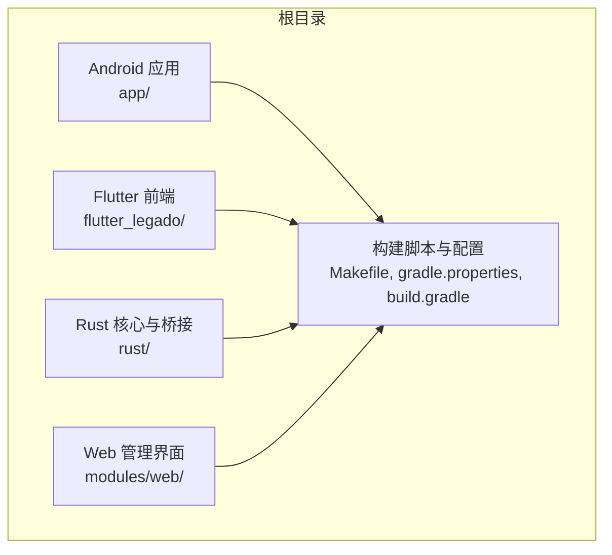
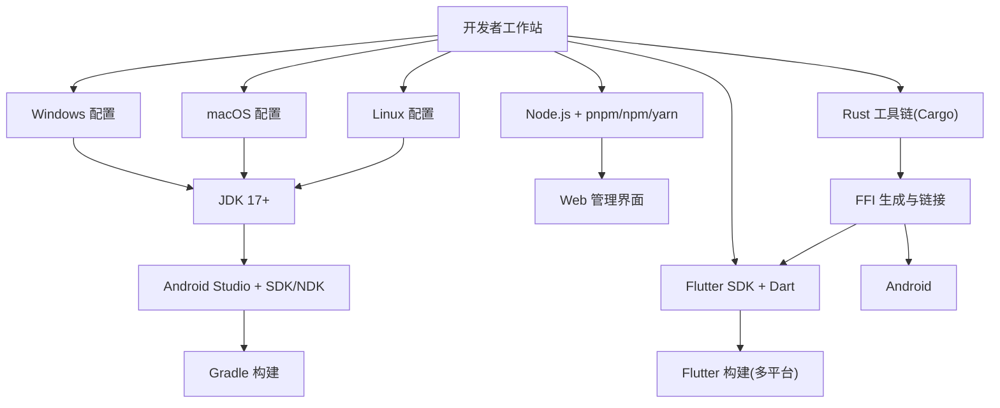
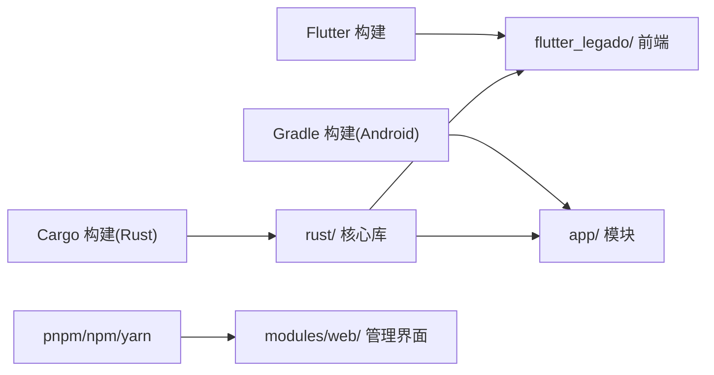

# 环境搭建

<cite>
**本文引用的文件**   
- [README.md](file://README.md)
- [Makefile](file://Makefile)
- [gradle.properties](file://gradle.properties)
- [build.gradle](file://build.gradle)
- [app/build.gradle](file://app/build.gradle)
- [flutter_legado/pubspec.yaml](file://flutter_legado/pubspec.yaml)
- [flutter_legado/Makefile](file://flutter_legado/Makefile)
- [flutter_legado/scripts/build-windows.ps1](file://flutter_legado/scripts/build-windows.ps1)
- [flutter_legado/scripts/build-apk.ps1](file://flutter_legado/scripts/build-apk.ps1)
- [rust/Cargo.toml](file://rust/Cargo.toml)
- [rust/rust-toolchain.toml](file://rust/rust-toolchain.toml)
- [rust/DEVELOPMENT.md](file://rust/DEVELOPMENT.md)
- [modules/web/package.json](file://modules/web/package.json)
</cite>

## 目录
1. [简介](#简介)
2. [项目结构](#项目结构)
3. [核心组件](#核心组件)
4. [架构总览](#架构总览)
5. [详细组件分析](#详细组件分析)
6. [依赖分析](#依赖分析)
7. [性能考虑](#性能考虑)
8. [故障排除指南](#故障排除指南)
9. [结论](#结论)
10. [附录](#附录)

## 简介
本指南面向首次接触 Legado 项目的开发者，提供完整的环境搭建与验证步骤。内容覆盖 JDK、Android Studio、Flutter SDK、Rust 工具链、Node.js 等必需工具的下载、安装与环境变量配置；并给出 Windows、macOS、Linux 三平台的差异化说明。同时包含常见问题的排查方法与安装验证命令，确保你能够顺利编译 Android、Flutter 桌面端以及 Rust 后端模块。

## 项目结构
Legado 是一个多语言、多平台的项目，主要包含：
- Android 应用（Kotlin/Gradle）
- Flutter 跨平台前端（Dart/Flutter）
- Rust 核心库与 FFI 桥接
- Web 管理界面（Vue/TypeScript）

**图示来源** 
- [Makefile](file://Makefile)
- [gradle.properties](file://gradle.properties)
- [build.gradle](file://build.gradle)
- [flutter_legado/Makefile](file://flutter_legado/Makefile)
- [rust/Cargo.toml](file://rust/Cargo.toml)
- [modules/web/package.json](file://modules/web/package.json)

**章节来源**
- [README.md](file://README.md)
- [Makefile](file://Makefile)
- [gradle.properties](file://gradle.properties)
- [build.gradle](file://build.gradle)
- [flutter_legado/Makefile](file://flutter_legado/Makefile)
- [rust/Cargo.toml](file://rust/Cargo.toml)
- [modules/web/package.json](file://modules/web/package.json)

## 核心组件
- Android 工程：使用 Gradle 构建，依赖 JDK、Android SDK/NDK、Gradle Wrapper。
- Flutter 工程：使用 Dart/Flutter SDK，支持 Android、Windows、macOS、Linux 等多目标。
- Rust 工程：使用 Cargo 与 rust-toolchain 指定版本，提供 FFI 供 Flutter/Android 调用。
- Web 工程：使用 Node.js 包管理器（pnpm/npm/yarn），由 Vite 构建。

**章节来源**
- [app/build.gradle](file://app/build.gradle)
- [flutter_legado/pubspec.yaml](file://flutter_legado/pubspec.yaml)
- [rust/Cargo.toml](file://rust/Cargo.toml)
- [rust/rust-toolchain.toml](file://rust/rust-toolchain.toml)
- [modules/web/package.json](file://modules/web/package.json)

## 架构总览
下图展示了各子系统在开发环境中的交互关系与依赖：

**图示来源** 
- [gradle.properties](file://gradle.properties)
- [build.gradle](file://build.gradle)
- [flutter_legado/pubspec.yaml](file://flutter_legado/pubspec.yaml)
- [rust/Cargo.toml](file://rust/Cargo.toml)
- [rust/rust-toolchain.toml](file://rust/rust-toolchain.toml)
- [modules/web/package.json](file://modules/web/package.json)

## 详细组件分析

### 一、JDK 17+ 安装与配置
- 推荐版本：JDK 17 或更高（需满足 Android Gradle Plugin 要求）。
- 安装方式：
  - Windows：从官方或企业分发版安装，记录安装路径。
  - macOS：使用 Homebrew 或官方安装包。
  - Linux：使用系统包管理器或官方二进制包。
- 环境变量：
  - JAVA_HOME：指向 JDK 安装目录。
  - PATH：将 $JAVA_HOME/bin 加入 PATH。
- 验证：
  - 运行 java -version 输出应为 17.x。
  - 运行 javac -version 与 java -version 一致。

**章节来源**
- [gradle.properties](file://gradle.properties)
- [build.gradle](file://build.gradle)

### 二、Android Studio、SDK、NDK 与 Gradle
- 安装 Android Studio，并在 SDK Manager 中安装：
  - Android SDK（建议最新稳定版）
  - Android SDK Build-Tools
  - Android NDK（与 Gradle 插件匹配的版本）
  - Platform Tools
- 配置环境变量：
  - ANDROID_HOME 或 ANDROID_SDK_ROOT：指向 Android SDK 根目录。
  - PATH：将 $ANDROID_HOME/platform-tools 和 $ANDROID_HOME/cmdline-tools/latest/bin 加入 PATH。
- Gradle：
  - 优先使用项目自带的 Gradle Wrapper（gradlew），避免全局版本不一致。
  - 若需全局 Gradle，确保版本与项目兼容。
- 验证：
  - 运行 ./gradlew --version 或 gradlew.bat --version。
  - 运行 ./gradlew tasks 列出任务。

**章节来源**
- [build.gradle](file://build.gradle)
- [app/build.gradle](file://app/build.gradle)
- [gradle.properties](file://gradle.properties)

### 三、Flutter SDK、Dart 与多平台目标
- 安装 Flutter SDK：
  - 下载官方发行版并解压到合适目录。
  - 将 flutter/bin 加入 PATH。
- 初始化与更新：
  - flutter doctor 检查依赖与驱动。
  - flutter upgrade 保持 SDK 最新。
- 多平台目标：
  - Android：需要 Android SDK/NDK 与签名配置。
  - Windows/macOS/Linux：需要对应平台工具链（如 Windows 的 MSVC、CMake；macOS 的 Xcode；Linux 的 GCC/Clang 与 CMake）。
- 验证：
  - flutter --version
  - flutter doctor -v

**章节来源**
- [flutter_legado/pubspec.yaml](file://flutter_legado/pubspec.yaml)
- [flutter_legado/Makefile](file://flutter_legado/Makefile)

### 四、Rust 工具链与 FFI
- 安装 Rust：
  - 使用 rustup 安装 stable 工具链。
  - 根据 rust-toolchain.toml 锁定版本。
- 必要组件：
  - cargo、rustc、rustfmt、clippy。
  - 目标平台工具链（如 aarch64-linux-android、x86_64-pc-windows-msvc、aarch64-apple-darwin 等）。
- FFI 生成：
  - 使用 flutter_rust_bridge 生成桥接代码（参考 flutter_legado/flutter_rust_bridge.yaml）。
- 验证：
  - rustc --version
  - cargo --version
  - 在 rust/ 目录下执行 cargo check/cargo build

**章节来源**
- [rust/Cargo.toml](file://rust/Cargo.toml)
- [rust/rust-toolchain.toml](file://rust/rust-toolchain.toml)
- [rust/DEVELOPMENT.md](file://rust/DEVELOPMENT.md)
- [flutter_legado/flutter_rust_bridge.yaml](file://flutter_legado/flutter_rust_bridge.yaml)

### 五、Node.js 与 Web 管理界面
- 安装 Node.js（LTS 版本推荐）。
- 包管理器：项目使用 pnpm（也可用 npm/yarn）。
- 安装依赖：
  - 进入 modules/web 目录。
  - 运行 pnpm install（或 npm install / yarn install）。
- 开发与构建：
  - pnpm dev（本地开发服务器）
  - pnpm build（生产构建）
- 验证：
  - node --version
  - pnpm --version
  - 启动 dev 服务后访问默认端口页面。

**章节来源**
- [modules/web/package.json](file://modules/web/package.json)

### 六、平台特定配置要点

#### Windows
- JDK：设置 JAVA_HOME 与 PATH。
- Android：安装 Android Studio，配置 ANDROID_HOME，启用模拟器或连接设备。
- Flutter：安装 Windows 桌面支持（MSVC、CMake）。
- Rust：安装 MSVC 工具链与 CMake。
- 脚本：可使用 flutter_legado/scripts/build-windows.ps1 进行构建。

**章节来源**
- [flutter_legado/scripts/build-windows.ps1](file://flutter_legado/scripts/build-windows.ps1)

#### macOS
- JDK：通过 Homebrew 或官方安装。
- Android：Android Studio + SDK/NDK。
- Flutter：安装 macOS 桌面支持（Xcode、Command Line Tools）。
- Rust：安装 Apple Clang 与目标工具链。
- 验证：flutter doctor 应显示所有依赖就绪。

**章节来源**
- [flutter_legado/pubspec.yaml](file://flutter_legado/pubspec.yaml)

#### Linux
- JDK：使用系统包管理器或官方二进制。
- Android：Android Studio + SDK/NDK，可能需要额外依赖（如 libstdc++、libc6-dev）。
- Flutter：安装 Linux 桌面支持（GCC/Clang、CMake）。
- Rust：安装目标工具链（如 aarch64-linux-android）。
- 验证：flutter doctor 与 cargo check 均通过。

**章节来源**
- [flutter_legado/pubspec.yaml](file://flutter_legado/pubspec.yaml)
- [rust/Cargo.toml](file://rust/Cargo.toml)

### 七、关键环境变量与路径配置清单
- JAVA_HOME：JDK 安装路径。
- ANDROID_HOME 或 ANDROID_SDK_ROOT：Android SDK 根路径。
- PATH：包含 $JAVA_HOME/bin、$ANDROID_HOME/platform-tools、$ANDROID_HOME/cmdline-tools/latest/bin、flutter/bin、~/.cargo/bin。
- RUSTUP_TOOLCHAIN：可选，用于固定工具链版本（配合 rust-toolchain.toml）。
- NODE_ENV：开发/生产模式切换（Web 构建时常用）。

**章节来源**
- [gradle.properties](file://gradle.properties)
- [flutter_legado/Makefile](file://flutter_legado/Makefile)
- [rust/rust-toolchain.toml](file://rust/rust-toolchain.toml)
- [modules/web/package.json](file://modules/web/package.json)

### 八、依赖包管理与缓存优化
- Gradle：
  - 使用 Gradle Wrapper 保证一致性。
  - 可配置离线模式加速重复构建。
- Flutter：
  - 使用 flutter pub cache 管理依赖缓存。
  - 网络受限环境下可配置镜像源。
- Rust：
  - 使用 cargo registry 与 crates.io 镜像。
  - 通过 .cargo/config.toml 配置代理或镜像。
- Node.js：
  - 使用 pnpm 的缓存与锁文件（pnpm-lock.yaml）提升稳定性。

**章节来源**
- [rust/Cargo.toml](file://rust/Cargo.toml)
- [modules/web/package.json](file://modules/web/package.json)

## 依赖分析
下图展示各子系统的依赖关系与构建入口：

**图示来源** 
- [build.gradle](file://build.gradle)
- [app/build.gradle](file://app/build.gradle)
- [flutter_legado/pubspec.yaml](file://flutter_legado/pubspec.yaml)
- [rust/Cargo.toml](file://rust/Cargo.toml)
- [modules/web/package.json](file://modules/web/package.json)

**章节来源**
- [build.gradle](file://build.gradle)
- [app/build.gradle](file://app/build.gradle)
- [flutter_legado/pubspec.yaml](file://flutter_legado/pubspec.yaml)
- [rust/Cargo.toml](file://rust/Cargo.toml)
- [modules/web/package.json](file://modules/web/package.json)

## 性能考虑
- 并行构建：
  - Gradle：启用并行与守护进程（gradle.properties 中配置）。
  - Cargo：使用 -j 参数或多核编译。
  - Flutter：合理划分模块与资源，减少增量构建时间。
- 缓存策略：
  - Gradle 缓存、Flutter pub cache、Cargo 目标缓存、pnpm 缓存。
- 网络优化：
  - 配置国内镜像源（Maven、crates.io、pub.dev、npm/pnpm registry）。

[本节为通用指导，不直接分析具体文件]

## 故障排除指南
- Java 版本不匹配：
  - 症状：Gradle 构建失败，提示 JDK 版本过低。
  - 解决：升级至 JDK 17+，并确保 JAVA_HOME 正确。
- Android SDK/NDK 缺失：
  - 症状：构建报找不到 platform-tools 或 NDK。
  - 解决：在 Android Studio 中安装缺失组件，并配置 ANDROID_HOME。
- Flutter 依赖未就绪：
  - 症状：flutter doctor 报告缺失驱动或平台支持。
  - 解决：按提示安装相应平台工具（MSVC/Xcode/GCC+CMake）。
- Rust 目标工具链缺失：
  - 症状：cargo build 报无法找到目标三元组。
  - 解决：使用 rustup target add 安装所需目标。
- Node.js 依赖安装失败：
  - 症状：pnpm install 超时或权限错误。
  - 解决：检查网络代理、权限与磁盘空间，必要时清理缓存重试。

**章节来源**
- [gradle.properties](file://gradle.properties)
- [flutter_legado/Makefile](file://flutter_legado/Makefile)
- [rust/DEVELOPMENT.md](file://rust/DEVELOPMENT.md)
- [modules/web/package.json](file://modules/web/package.json)

## 结论
按照本指南完成 JDK、Android Studio、Flutter SDK、Rust 工具链与 Node.js 的安装与配置后，即可在 Windows、macOS、Linux 上顺利构建 Legado 的 Android、Flutter 桌面端与 Web 管理界面。建议在团队内统一工具链版本与镜像源，以提升构建稳定性与效率。

[本节为总结性内容，不直接分析具体文件]

## 附录

### A. 快速验证清单
- JDK：java -version 与 javac -version 均为 17.x。
- Android：./gradlew --version 成功；./gradlew tasks 列出任务。
- Flutter：flutter --version 与 flutter doctor -v 全部就绪。
- Rust：rustc --version 与 cargo --version 正常；cargo check 通过。
- Node.js：node --version 与 pnpm --version 正常；modules/web 下 pnpm dev 可启动。

**章节来源**
- [Makefile](file://Makefile)
- [flutter_legado/Makefile](file://flutter_legado/Makefile)
- [rust/DEVELOPMENT.md](file://rust/DEVELOPMENT.md)
- [modules/web/package.json](file://modules/web/package.json)

### B. 常用构建命令
- Android：
  - ./gradlew assembleDebug
  - ./gradlew assembleRelease
- Flutter：
  - flutter build apk
  - flutter build windows
  - flutter build macos
  - flutter build linux
- Rust：
  - cargo build --release
  - cargo test
- Web：
  - pnpm dev
  - pnpm build

**章节来源**
- [Makefile](file://Makefile)
- [flutter_legado/Makefile](file://flutter_legado/Makefile)
- [flutter_legado/scripts/build-apk.ps1](file://flutter_legado/scripts/build-apk.ps1)
- [flutter_legado/scripts/build-windows.ps1](file://flutter_legado/scripts/build-windows.ps1)
- [rust/DEVELOPMENT.md](file://rust/DEVELOPMENT.md)
- [modules/web/package.json](file://modules/web/package.json)