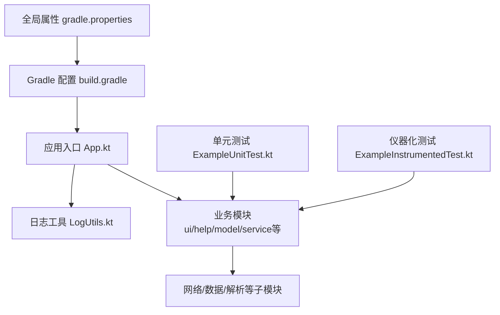
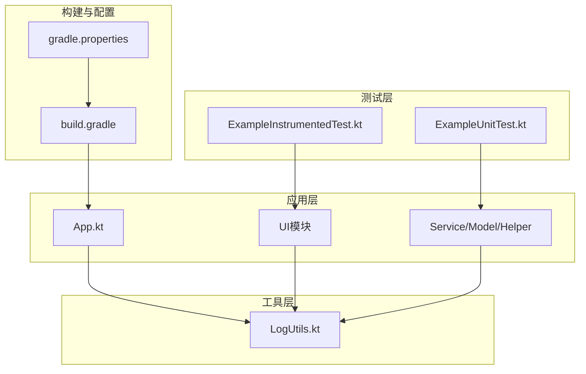
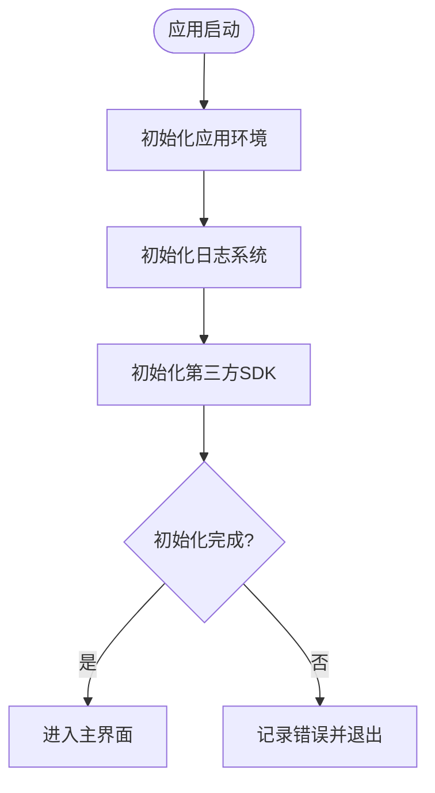
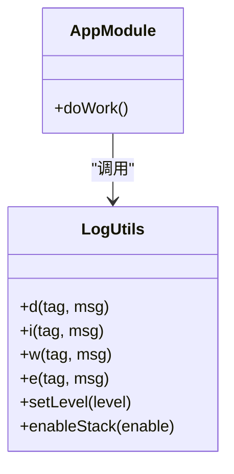
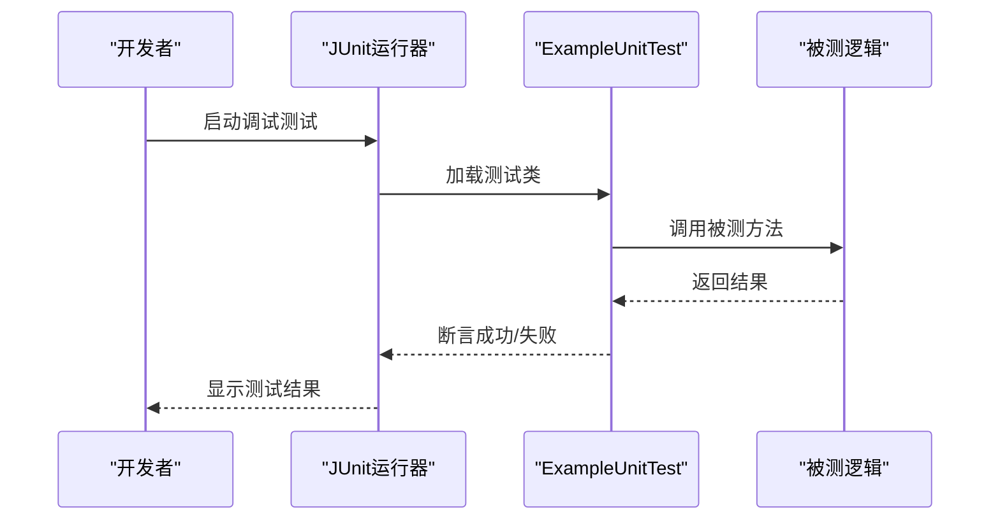
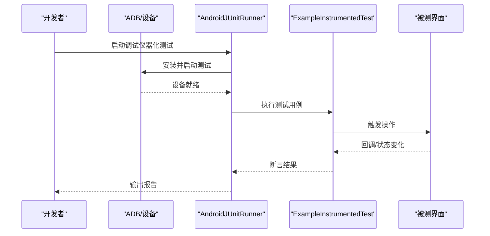
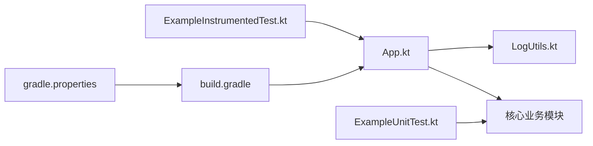

# Android应用调试

<cite>
**本文档引用的文件**   
- [app/src/main/java/io/legado/app/App.kt](file://app/src/main/java/io/legado/app/App.kt)
- [app/src/main/java/io/legado/app/utils/LogUtils.kt](file://app/src/main/java/io/legado/app/utils/LogUtils.kt)
- [app/src/test/java/io/legado/app/ExampleUnitTest.kt](file://app/src/test/java/io/legado/app/ExampleUnitTest.kt)
- [app/src/androidTest/java/io/legado/app/ExampleInstrumentedTest.kt](file://app/src/androidTest/java/io/legado/app/ExampleInstrumentedTest.kt)
- [app/build.gradle](file://app/build.gradle)
- [gradle.properties](file://gradle.properties)
- [README.md](file://README.md)
</cite>

## 目录
1. [简介](#简介)
2. [项目结构](#项目结构)
3. [核心组件](#核心组件)
4. [架构总览](#架构总览)
5. [详细组件分析](#详细组件分析)
6. [依赖分析](#依赖分析)
7. [性能考虑](#性能考虑)
8. [故障排查指南](#故障排查指南)
9. [结论](#结论)
10. [附录](#附录)

## 简介
本指南面向Android开发者，围绕Android Studio调试器、日志系统、性能分析与测试调试四个方面，结合本项目实际代码与配置，提供从入门到进阶的实操方法。内容涵盖断点设置、变量查看、调用栈分析、日志级别与过滤、CPU/内存/网络监控、单元测试与集成测试调试，以及常见问题的定位技巧。

## 项目结构
本项目为多模块Android工程，包含主应用模块（app）、Flutter混合层（flutter_legado）、Rust核心库（rust）与Web管理端（modules/web）。调试相关的关键位置包括：
- Android应用入口与初始化：位于 app/src/main/java/io/legado/app/App.kt
- 日志工具类：位于 app/src/main/java/io/legado/app/utils/LogUtils.kt
- 单元测试与仪器化测试：分别位于 app/src/test 与 app/src/androidTest
- Gradle构建与调试开关：位于 app/build.gradle 与 gradle.properties

**图表来源** 
- [app/src/main/java/io/legado/app/App.kt](file://app/src/main/java/io/legado/app/App.kt)
- [app/src/main/java/io/legado/app/utils/LogUtils.kt](file://app/src/main/java/io/legado/app/utils/LogUtils.kt)
- [app/src/test/java/io/legado/app/ExampleUnitTest.kt](file://app/src/test/java/io/legado/app/ExampleUnitTest.kt)
- [app/src/androidTest/java/io/legado/app/ExampleInstrumentedTest.kt](file://app/src/androidTest/java/io/legado/app/ExampleInstrumentedTest.kt)
- [app/build.gradle](file://app/build.gradle)
- [gradle.properties](file://gradle.properties)

**章节来源**
- [README.md](file://README.md)
- [app/build.gradle](file://app/build.gradle)
- [gradle.properties](file://gradle.properties)

## 核心组件
- 应用入口与初始化
  - 负责应用启动流程、全局初始化、第三方SDK接入、日志框架初始化等。调试时建议在此处设置断点，观察初始化顺序与耗时。
- 日志工具类
  - 封装统一日志输出接口，支持不同日志级别、标签过滤、堆栈打印等。调试时应优先使用该类进行问题定位。
- 测试用例
  - 单元测试用于验证纯逻辑；仪器化测试用于在设备或模拟器上验证UI与系统交互。两者均可通过Android Studio调试器运行并打断点。

**章节来源**
- [app/src/main/java/io/legado/app/App.kt](file://app/src/main/java/io/legado/app/App.kt)
- [app/src/main/java/io/legado/app/utils/LogUtils.kt](file://app/src/main/java/io/legado/app/utils/LogUtils.kt)
- [app/src/test/java/io/legado/app/ExampleUnitTest.kt](file://app/src/test/java/io/legado/app/ExampleUnitTest.kt)
- [app/src/androidTest/java/io/legado/app/ExampleInstrumentedTest.kt](file://app/src/androidTest/java/io/legado/app/ExampleInstrumentedTest.kt)

## 架构总览
下图展示调试相关的主要组件与交互关系：应用入口初始化日志系统，业务模块通过日志工具输出信息；测试模块直接调用业务逻辑以验证行为；Gradle与全局属性控制构建与调试开关。

**图表来源** 
- [app/src/main/java/io/legado/app/App.kt](file://app/src/main/java/io/legado/app/App.kt)
- [app/src/main/java/io/legado/app/utils/LogUtils.kt](file://app/src/main/java/io/legado/app/utils/LogUtils.kt)
- [app/src/test/java/io/legado/app/ExampleUnitTest.kt](file://app/src/test/java/io/legado/app/ExampleUnitTest.kt)
- [app/src/androidTest/java/io/legado/app/ExampleInstrumentedTest.kt](file://app/src/androidTest/java/io/legado/app/ExampleInstrumentedTest.kt)
- [app/build.gradle](file://app/build.gradle)
- [gradle.properties](file://gradle.properties)

## 详细组件分析

### 应用入口与初始化（App.kt）
- 职责
  - 应用生命周期钩子、全局状态初始化、日志框架初始化、第三方服务接入。
- 调试要点
  - 在初始化关键步骤设置断点，观察执行顺序与异常。
  - 检查是否开启调试模式（如Debuggable），确保能附加调试器。
  - 关注线程模型，避免在主线程阻塞。

**图表来源** 
- [app/src/main/java/io/legado/app/App.kt](file://app/src/main/java/io/legado/app/App.kt)

**章节来源**
- [app/src/main/java/io/legado/app/App.kt](file://app/src/main/java/io/legado/app/App.kt)

### 日志系统（LogUtils.kt）
- 职责
  - 统一日志输出、级别控制、标签过滤、堆栈信息收集。
- 使用建议
  - 在关键路径插入日志，便于回溯调用链。
  - 合理设置日志级别（如DEBUG/INFO/WARN/ERROR），避免生产环境输出过多日志。
  - 使用标签区分模块，便于过滤与搜索。

**图表来源** 
- [app/src/main/java/io/legado/app/utils/LogUtils.kt](file://app/src/main/java/io/legado/app/utils/LogUtils.kt)

**章节来源**
- [app/src/main/java/io/legado/app/utils/LogUtils.kt](file://app/src/main/java/io/legado/app/utils/LogUtils.kt)

### 单元测试（ExampleUnitTest.kt）
- 职责
  - 对无UI依赖的业务逻辑进行快速验证。
- 调试方法
  - 在测试方法中打断点，使用“调试测试”运行，逐步执行并观察变量。
  - 准备测试数据，断言期望结果，必要时输出中间日志辅助定位。

**图表来源** 
- [app/src/test/java/io/legado/app/ExampleUnitTest.kt](file://app/src/test/java/io/legado/app/ExampleUnitTest.kt)

**章节来源**
- [app/src/test/java/io/legado/app/ExampleUnitTest.kt](file://app/src/test/java/io/legado/app/ExampleUnitTest.kt)

### 仪器化测试（ExampleInstrumentedTest.kt）
- 职责
  - 在设备或模拟器上验证UI与系统交互。
- 调试方法
  - 使用“调试仪器化测试”，在测试代码中打断点，观察UI状态与系统回调。
  - 借助日志与截图辅助定位问题。

**图表来源** 
- [app/src/androidTest/java/io/legado/app/ExampleInstrumentedTest.kt](file://app/src/androidTest/java/io/legado/app/ExampleInstrumentedTest.kt)

**章节来源**
- [app/src/androidTest/java/io/legado/app/ExampleInstrumentedTest.kt](file://app/src/androidTest/java/io/legado/app/ExampleInstrumentedTest.kt)

## 依赖分析
- 模块耦合
  - 应用入口依赖日志工具与各业务模块；测试模块依赖业务逻辑以进行验证。
- 外部依赖
  - Gradle与全局属性影响构建产物与调试能力（如是否启用调试符号、混淆规则等）。

**图表来源** 
- [app/src/main/java/io/legado/app/App.kt](file://app/src/main/java/io/legado/app/App.kt)
- [app/src/main/java/io/legado/app/utils/LogUtils.kt](file://app/src/main/java/io/legado/app/utils/LogUtils.kt)
- [app/src/test/java/io/legado/app/ExampleUnitTest.kt](file://app/src/test/java/io/legado/app/ExampleUnitTest.kt)
- [app/src/androidTest/java/io/legado/app/ExampleInstrumentedTest.kt](file://app/src/androidTest/java/io/legado/app/ExampleInstrumentedTest.kt)
- [app/build.gradle](file://app/build.gradle)
- [gradle.properties](file://gradle.properties)

**章节来源**
- [app/build.gradle](file://app/build.gradle)
- [gradle.properties](file://gradle.properties)

## 性能考虑
- CPU分析
  - 使用Android Studio Profiler的CPU采样，定位热点方法与线程阻塞。
  - 建议在关键业务流程前后添加日志时间戳，结合调用栈分析。
- 内存分析
  - 使用内存快照与泄漏检测，关注对象生命周期与引用链。
  - 避免大对象常驻内存，合理使用缓存策略。
- 网络监控
  - 使用网络面板抓包与分析请求响应，检查超时、重试与错误码。
  - 结合日志标签过滤，聚焦特定模块的网络行为。

[本节为通用指导，不直接分析具体文件]

## 故障排查指南
- 常见问题
  - 应用启动崩溃：在App入口初始化阶段设置断点，逐步排查第三方SDK初始化顺序。
  - 日志缺失或混乱：确认日志级别与标签配置，确保关键路径已输出必要信息。
  - 测试失败：检查测试数据准备与环境配置，必要时输出中间状态日志。
- 定位技巧
  - 使用调用栈回溯异常源头，结合日志上下文缩小范围。
  - 利用过滤器按模块/标签筛选日志，提高检索效率。
  - 在多线程场景下，注意线程切换与同步问题，必要时加锁或改用协程。

**章节来源**
- [app/src/main/java/io/legado/app/App.kt](file://app/src/main/java/io/legado/app/App.kt)
- [app/src/main/java/io/legado/app/utils/LogUtils.kt](file://app/src/main/java/io/legado/app/utils/LogUtils.kt)
- [app/src/test/java/io/legado/app/ExampleUnitTest.kt](file://app/src/test/java/io/legado/app/ExampleUnitTest.kt)
- [app/src/androidTest/java/io/legado/app/ExampleInstrumentedTest.kt](file://app/src/androidTest/java/io/legado/app/ExampleInstrumentedTest.kt)

## 结论
通过系统化使用Android Studio调试器、规范日志输出、结合性能分析与测试调试，可显著提升问题定位效率与代码质量。建议团队统一日志规范与调试流程，持续优化构建与测试配置，确保开发体验与稳定性。

[本节为总结性内容，不直接分析具体文件]

## 附录
- 常用快捷键
  - 断点：F9继续、F8单步、Shift+F9调试运行
  - 日志过滤：在Logcat中使用Tag或消息关键字过滤
- 参考资源
  - Android官方文档：调试与Profiler
  - 项目README与构建说明

[本节为补充信息，不直接分析具体文件]