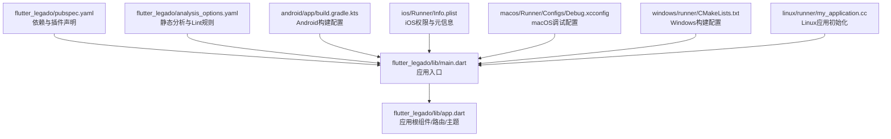
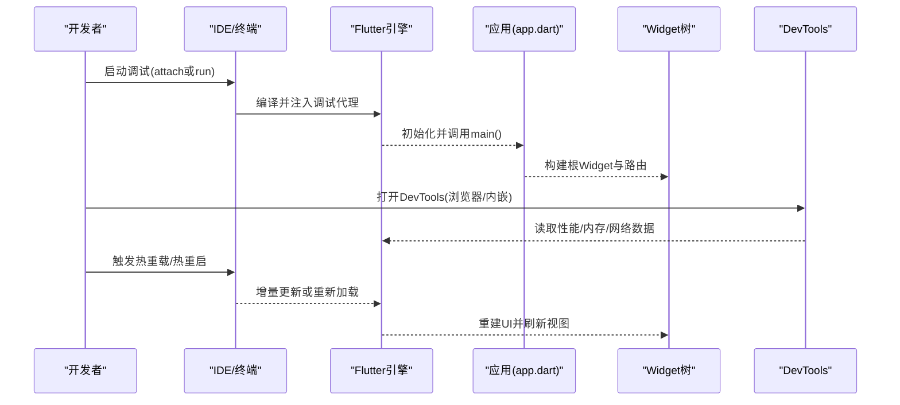
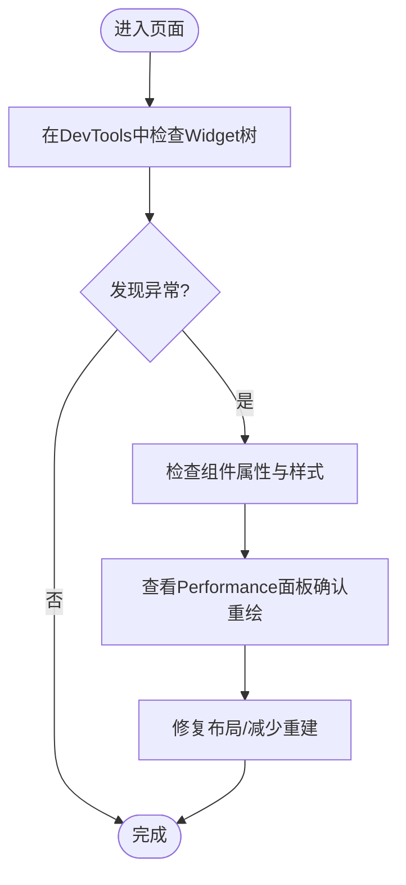
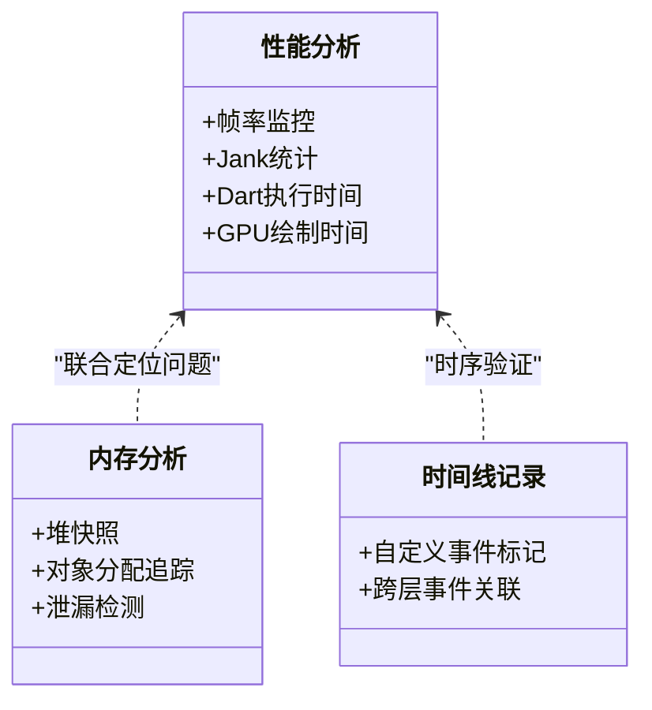
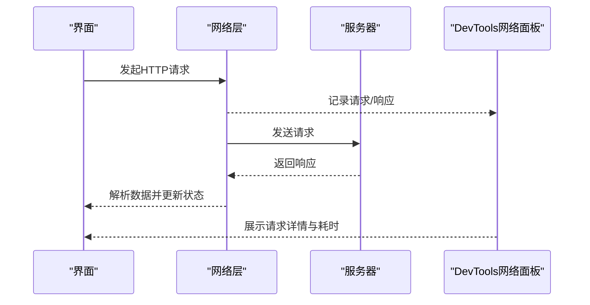
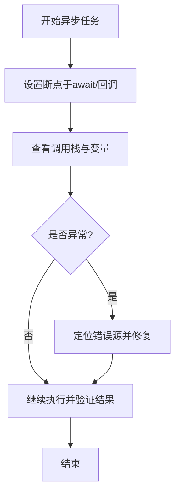
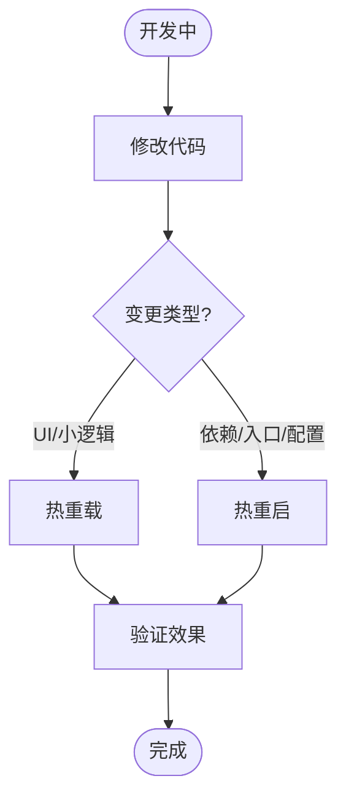
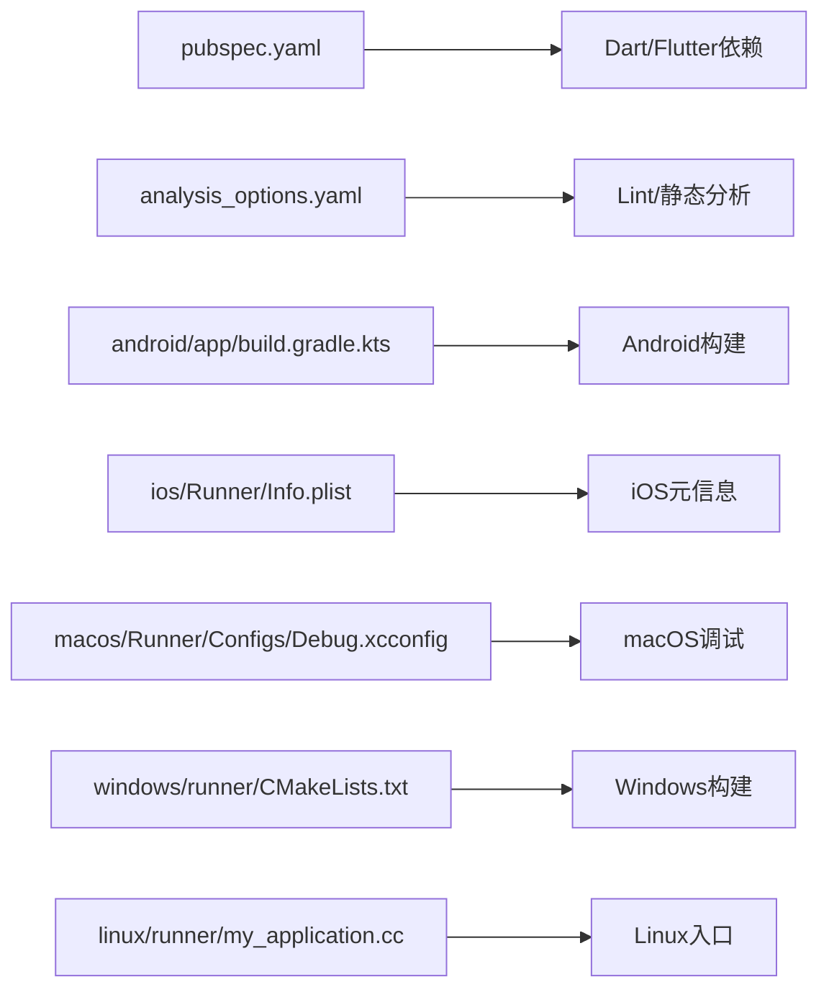

# Flutter应用调试

<cite>
**本文引用的文件**   
- [flutter_legado/lib/main.dart](file://flutter_legado/lib/main.dart)
- [flutter_legado/lib/app.dart](file://flutter_legado/lib/app.dart)
- [flutter_legado/pubspec.yaml](file://flutter_legado/pubspec.yaml)
- [flutter_legado/analysis_options.yaml](file://flutter_legado/analysis_options.yaml)
- [flutter_legado/android/app/build.gradle.kts](file://flutter_legado/android/app/build.gradle.kts)
- [flutter_legado/ios/Runner/Info.plist](file://flutter_legado/ios/Runner/Info.plist)
- [flutter_legado/macos/Runner/Configs/Debug.xcconfig](file://flutter_legado/macos/Runner/Configs/Debug.xcconfig)
- [flutter_legado/windows/runner/CMakeLists.txt](file://flutter_legado/windows/runner/CMakeLists.txt)
- [flutter_legado/linux/runner/my_application.cc](file://flutter_legado/linux/runner/my_application.cc)
</cite>

## 目录
1. [简介](#简介)
2. [项目结构](#项目结构)
3. [核心组件](#核心组件)
4. [架构总览](#架构总览)
5. [详细组件分析](#详细组件分析)
6. [依赖分析](#依赖分析)
7. [性能考虑](#性能考虑)
8. [故障排查指南](#故障排查指南)
9. [结论](#结论)
10. [附录](#附录)

## 简介
本指南面向Flutter开发者，系统化介绍在Legado的Flutter子项目中如何进行高效调试与性能优化。内容覆盖：
- Flutter DevTools的使用：Widget树检查、性能分析、内存分析、网络监控等
- 热重载与热重启的使用场景与技巧
- Widget树调试方法：状态检查、布局问题排查、响应式调试
- 异步代码调试：Future、Stream、异步函数的断点与日志策略
- 网络请求调试：HTTP请求监控、API接口测试、错误处理
- Flutter特有的性能优化与调试策略

## 项目结构
Flutter子工程位于 flutter_legado 目录，入口为 lib/main.dart，应用配置由 app.dart 组织，构建与依赖通过 pubspec.yaml 管理。平台侧（Android/iOS/macOS/Windows/Linux）提供各自的运行与调试配置。

图表来源
- [flutter_legado/lib/main.dart](file://flutter_legado/lib/main.dart)
- [flutter_legado/lib/app.dart](file://flutter_legado/lib/app.dart)
- [flutter_legado/pubspec.yaml](file://flutter_legado/pubspec.yaml)
- [flutter_legado/analysis_options.yaml](file://flutter_legado/analysis_options.yaml)
- [flutter_legado/android/app/build.gradle.kts](file://flutter_legado/android/app/build.gradle.kts)
- [flutter_legado/ios/Runner/Info.plist](file://flutter_legado/ios/Runner/Info.plist)
- [flutter_legado/macos/Runner/Configs/Debug.xcconfig](file://flutter_legado/macos/Runner/Configs/Debug.xcconfig)
- [flutter_legado/windows/runner/CMakeLists.txt](file://flutter_legado/windows/runner/CMakeLists.txt)
- [flutter_legado/linux/runner/my_application.cc](file://flutter_legado/linux/runner/my_application.cc)

章节来源
- [flutter_legado/lib/main.dart](file://flutter_legado/lib/main.dart)
- [flutter_legado/lib/app.dart](file://flutter_legado/lib/app.dart)
- [flutter_legado/pubspec.yaml](file://flutter_legado/pubspec.yaml)
- [flutter_legado/analysis_options.yaml](file://flutter_legado/analysis_options.yaml)
- [flutter_legado/android/app/build.gradle.kts](file://flutter_legado/android/app/build.gradle.kts)
- [flutter_legado/ios/Runner/Info.plist](file://flutter_legado/ios/Runner/Info.plist)
- [flutter_legado/macos/Runner/Configs/Debug.xcconfig](file://flutter_legado/macos/Runner/Configs/Debug.xcconfig)
- [flutter_legado/windows/runner/CMakeLists.txt](file://flutter_legado/windows/runner/CMakeLists.txt)
- [flutter_legado/linux/runner/my_application.cc](file://flutter_legado/linux/runner/my_application.cc)

## 核心组件
- 应用入口 main.dart：负责初始化Flutter引擎、设置调试模式、启动应用根组件。
- 应用根 app.dart：集中管理主题、路由、国际化、全局配置与顶层Widget组合。
- 构建与依赖：pubspec.yaml 声明Flutter/Dart包与插件；analysis_options.yaml 控制静态分析与Lint。
- 平台配置：各平台构建与调试配置文件影响打包产物与运行时行为。

章节来源
- [flutter_legado/lib/main.dart](file://flutter_legado/lib/main.dart)
- [flutter_legado/lib/app.dart](file://flutter_legado/lib/app.dart)
- [flutter_legado/pubspec.yaml](file://flutter_legado/pubspec.yaml)
- [flutter_legado/analysis_options.yaml](file://flutter_legado/analysis_options.yaml)
- [flutter_legado/android/app/build.gradle.kts](file://flutter_legado/android/app/build.gradle.kts)
- [flutter_legado/ios/Runner/Info.plist](file://flutter_legado/ios/Runner/Info.plist)
- [flutter_legado/macos/Runner/Configs/Debug.xcconfig](file://flutter_legado/macos/Runner/Configs/Debug.xcconfig)
- [flutter_legado/windows/runner/CMakeLists.txt](file://flutter_legado/windows/runner/CMakeLists.txt)
- [flutter_legado/linux/runner/my_application.cc](file://flutter_legado/linux/runner/my_application.cc)

## 架构总览
下图展示从应用入口到UI渲染的关键路径，以及DevTools介入点。

图表来源
- [flutter_legado/lib/main.dart](file://flutter_legado/lib/main.dart)
- [flutter_legado/lib/app.dart](file://flutter_legado/lib/app.dart)

## 详细组件分析

### Widget树调试与状态检查
- 使用DevTools的“Widget”面板查看组件层级、属性与样式，定位布局异常与重复构建。
- 结合“Performance”面板观察build耗时与重绘范围，识别不必要的setState调用。
- 对状态类组件，优先使用StatefulWidget的状态快照与变更追踪，配合“Timeline”查看事件流。

章节来源
- [flutter_legado/lib/app.dart](file://flutter_legado/lib/app.dart)

### 性能分析与内存分析
- Performance面板：关注帧率、Jank、GPU绘制时间、Dart执行时间，定位卡顿原因。
- Memory面板：查看对象分配、堆快照、泄漏检测，结合“Allocation Instrumentation”定位热点。
- Timeline面板：记录自定义事件，串联UI、网络、I/O与业务逻辑，形成端到端时序。

章节来源
- [flutter_legado/lib/app.dart](file://flutter_legado/lib/app.dart)

### 网络监控与API调试
- 使用DevTools的“Network”面板捕获HTTP请求/响应，检查状态码、耗时、载荷大小。
- 结合日志与断点，复现失败场景，定位服务端错误或客户端参数问题。
- 对于WebSocket或长连接，可在Timeline中标记关键节点，辅助排查延迟与丢包。

章节来源
- [flutter_legado/lib/app.dart](file://flutter_legado/lib/app.dart)

### 异步代码调试（Future/Stream）
- 在Future回调与await处设置断点，结合“Call Stack”查看调用链。
- 使用Timeline记录异步任务起止，对比预期与实际执行顺序。
- 对Stream订阅，打印onData/onError/onDone事件，定位数据流异常。

章节来源
- [flutter_legado/lib/app.dart](file://flutter_legado/lib/app.dart)

### 热重载与热重启
- 热重载：适用于UI调整、常量修改、小逻辑变更，保持状态不变，快速反馈。
- 热重启：适用于新增依赖、修改main入口、全局配置变更，需完整重建。
- 技巧：将易变逻辑封装为可热重载的函数；避免在热重载期间持有不可恢复状态。

章节来源
- [flutter_legado/lib/main.dart](file://flutter_legado/lib/main.dart)
- [flutter_legado/lib/app.dart](file://flutter_legado/lib/app.dart)

### 平台调试配置要点
- Android：确保debuggable=true，启用ProGuard/R8排除调试符号；Gradle配置影响构建产物。
- iOS：Info.plist包含必要权限；Xcode调试器与符号化支持。
- macOS：Debug.xcconfig设置调试标志与路径。
- Windows/Linux：CMake与原生入口配置影响调试体验。

章节来源
- [flutter_legado/android/app/build.gradle.kts](file://flutter_legado/android/app/build.gradle.kts)
- [flutter_legado/ios/Runner/Info.plist](file://flutter_legado/ios/Runner/Info.plist)
- [flutter_legado/macos/Runner/Configs/Debug.xcconfig](file://flutter_legado/macos/Runner/Configs/Debug.xcconfig)
- [flutter_legado/windows/runner/CMakeLists.txt](file://flutter_legado/windows/runner/CMakeLists.txt)
- [flutter_legado/linux/runner/my_application.cc](file://flutter_legado/linux/runner/my_application.cc)

## 依赖分析
- 依赖声明：pubspec.yaml 统一管理第三方库与插件版本，便于锁定与升级。
- 静态分析：analysis_options.yaml 控制Lint规则，提前发现潜在问题。
- 平台构建：各平台构建脚本与配置文件决定调试符号、优化级别与资源打包。

图表来源
- [flutter_legado/pubspec.yaml](file://flutter_legado/pubspec.yaml)
- [flutter_legado/analysis_options.yaml](file://flutter_legado/analysis_options.yaml)
- [flutter_legado/android/app/build.gradle.kts](file://flutter_legado/android/app/build.gradle.kts)
- [flutter_legado/ios/Runner/Info.plist](file://flutter_legado/ios/Runner/Info.plist)
- [flutter_legado/macos/Runner/Configs/Debug.xcconfig](file://flutter_legado/macos/Runner/Configs/Debug.xcconfig)
- [flutter_legado/windows/runner/CMakeLists.txt](file://flutter_legado/windows/runner/CMakeLists.txt)
- [flutter_legado/linux/runner/my_application.cc](file://flutter_legado/linux/runner/my_application.cc)

章节来源
- [flutter_legado/pubspec.yaml](file://flutter_legado/pubspec.yaml)
- [flutter_legado/analysis_options.yaml](file://flutter_legado/analysis_options.yaml)
- [flutter_legado/android/app/build.gradle.kts](file://flutter_legado/android/app/build.gradle.kts)
- [flutter_legado/ios/Runner/Info.plist](file://flutter_legado/ios/Runner/Info.plist)
- [flutter_legado/macos/Runner/Configs/Debug.xcconfig](file://flutter_legado/macos/Runner/Configs/Debug.xcconfig)
- [flutter_legado/windows/runner/CMakeLists.txt](file://flutter_legado/windows/runner/CMakeLists.txt)
- [flutter_legado/linux/runner/my_application.cc](file://flutter_legado/linux/runner/my_application.cc)

## 性能考虑
- 减少不必要的setState与重建：使用Provider/Riverpod/Bloc等状态管理，局部更新。
- 列表优化：复用Item、懒加载、分页与缓存，避免一次性渲染大量数据。
- 图片与媒体：压缩、占位图、缓存策略，降低内存与带宽占用。
- 异步任务：合理拆分任务、限制并发、避免阻塞主线程。
- 网络：连接池、超时与重试、缓存与离线策略。

## 故障排查指南
- 常见崩溃：检查空引用、越界访问、未处理的异常；使用try-catch与错误边界。
- 内存泄漏：使用Memory面板进行堆快照对比，定位未释放的对象与监听器。
- 网络异常：查看Network面板的错误码与响应体，结合服务端日志定位问题。
- 性能抖动：结合Performance与Timeline，定位高耗时操作与频繁重绘。
- 平台差异：分别在Android/iOS/macOS/Windows/Linux上复现，核对平台特定配置。

章节来源
- [flutter_legado/lib/app.dart](file://flutter_legado/lib/app.dart)

## 结论
通过系统化的DevTools使用、严谨的异步与网络调试策略，以及针对Flutter特性的性能优化方法，可以显著提升开发与排障效率。建议团队统一调试规范与最佳实践，持续沉淀问题案例与解决方案。

## 附录
- 常用命令与快捷键：热重载（r）、热重启（R）、退出（q）、打开DevTools（v）。
- 日志输出：使用print与logging框架，结合过滤与分级，避免生产环境泄露敏感信息。
- 测试与Mock：单元测试与集成测试辅助定位问题，减少回归风险。