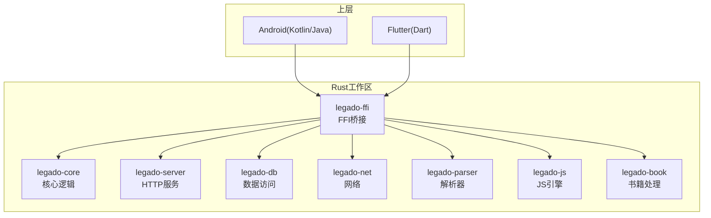
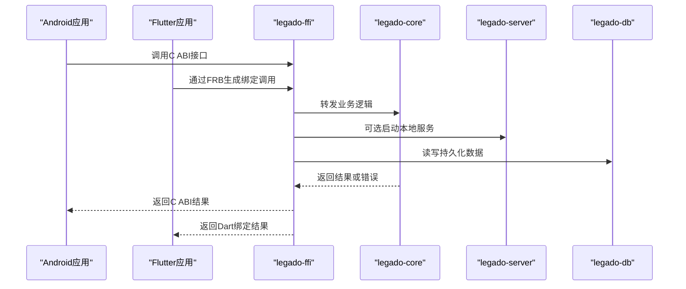
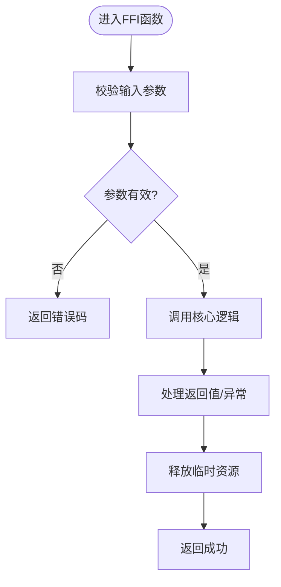
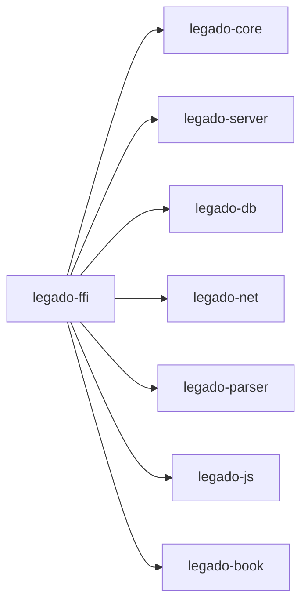

# Rust核心库调试

<cite>
**本文引用的文件**   
- [rust/Cargo.toml](file://rust/Cargo.toml)
- [rust/rust-toolchain.toml](file://rust/rust-toolchain.toml)
- [rust/.cargo/config.toml](file://rust/.cargo/config.toml)
- [DEVELOPMENT.md](file://DEVELOPMENT.md)
- [Makefile](file://Makefile)
- [gradle.properties](file://gradle.properties)
- [app/build.gradle](file://app/build.gradle)
- [flutter_legado/flutter_rust_bridge.yaml](file://flutter_legado/flutter_rust_bridge.yaml)
- [flutter_legado/Makefile](file://flutter_legado/Makefile)
- [rust/legado-core/src/lib.rs](file://rust/legado-core/src/lib.rs)
- [rust/legado-ffi/src/lib.rs](file://rust/legado-ffi/src/lib.rs)
- [rust/legado-ffi/src/runtime.rs](file://rust/legado-ffi/src/runtime.rs)
- [rust/legado-server/src/server.rs](file://rust/legado-server/src/server.rs)
- [rust/legado-db/tests/integration_test.rs](file://rust/legado-db/tests/integration_test.rs)
</cite>

## 目录
1. [简介](#简介)
2. [项目结构](#项目结构)
3. [核心组件](#核心组件)
4. [架构总览](#架构总览)
5. [详细组件分析](#详细组件分析)
6. [依赖关系分析](#依赖关系分析)
7. [性能考虑](#性能考虑)
8. [故障排查指南](#故障排查指南)
9. [结论](#结论)
10. [附录](#附录)

## 简介
本指南面向使用Rust构建的Legado核心库与FFI层，提供从构建、测试、基准到调试与性能剖析的一站式实践。内容覆盖：
- Cargo调试命令（debug、test、bench）
- GDB与LLDB断点、变量查看、内存分析
- Rust特有技巧（panic信息、所有权与生命周期调试）
- 性能剖析（cargo flamegraph、perf）
- 内存安全检测（Valgrind、AddressSanitizer）
- 跨平台配置与常见问题

## 项目结构
仓库包含Android应用、Flutter前端以及Rust核心库。Rust部分位于 rust/ 目录下，采用多crate工作区组织，并通过FFI暴露给上层语言（Kotlin/Java与Flutter）。关键入口包括：
- 顶层Cargo工作区与工具链配置
- FFI桥接层与运行时初始化
- 服务器模块用于本地调试与联调
- 数据库集成测试用例

**图表来源** 
- [rust/Cargo.toml](file://rust/Cargo.toml)
- [rust/legado-ffi/src/lib.rs](file://rust/legado-ffi/src/lib.rs)
- [rust/legado-core/src/lib.rs](file://rust/legado-core/src/lib.rs)

**章节来源**
- [rust/Cargo.toml](file://rust/Cargo.toml)
- [DEVELOPMENT.md](file://DEVELOPMENT.md)

## 核心组件
- 工作区与工具链
  - 顶层Cargo工作区定义各crate及特性开关
  - rust-toolchain.toml锁定工具链版本，确保跨平台一致性
  - .cargo/config.toml可配置目标、链接器与调试符号策略
- FFI桥接与运行时
  - FFI crate负责对外暴露C ABI接口，并管理运行时上下文
  - runtime.rs封装线程、事件循环与资源清理
- 服务器模块
  - 提供HTTP端点，便于在本地快速验证功能与调试
- 数据库测试
  - integration_test.rs展示如何运行集成测试与准备环境

**章节来源**
- [rust/rust-toolchain.toml](file://rust/rust-toolchain.toml)
- [rust/.cargo/config.toml](file://rust/.cargo/config.toml)
- [rust/legado-ffi/src/lib.rs](file://rust/legado-ffi/src/lib.rs)
- [rust/legado-ffi/src/runtime.rs](file://rust/legado-ffi/src/runtime.rs)
- [rust/legado-server/src/server.rs](file://rust/legado-server/src/server.rs)
- [rust/legado-db/tests/integration_test.rs](file://rust/legado-db/tests/integration_test.rs)

## 架构总览
下图展示了Rust核心库与上层语言的交互路径，以及调试时常用的切入点（FFI、服务器、测试）。

**图表来源** 
- [rust/legado-ffi/src/lib.rs](file://rust/legado-ffi/src/lib.rs)
- [rust/legado-core/src/lib.rs](file://rust/legado-core/src/lib.rs)
- [rust/legado-server/src/server.rs](file://rust/legado-server/src/server.rs)
- [rust/legado-db/tests/integration_test.rs](file://rust/legado-db/tests/integration_test.rs)

## 详细组件分析

### Cargo构建与调试
- 常用命令
  - cargo build --debug：编译带调试信息的二进制，便于GDB/LLDB附加或内嵌调试
  - cargo test：运行单元测试与集成测试；可按包或过滤测试名执行
  - cargo bench：运行基准测试，结合火焰图定位热点
- 特性与目标
  - 通过Cargo特性开关控制日志、ASAN、TLS等能力
  - 指定目标三元组以匹配交叉编译环境（如Android NDK）

**章节来源**
- [rust/Cargo.toml](file://rust/Cargo.toml)
- [DEVELOPMENT.md](file://DEVELOPMENT.md)

### 测试与集成测试
- 单元测试：按模块编写，配合cargo test快速验证
- 集成测试：位于tests目录，适合端到端场景（如数据库、网络）
- 测试数据与环境：可通过环境变量或临时目录隔离

**章节来源**
- [rust/legado-db/tests/integration_test.rs](file://rust/legado-db/tests/integration_test.rs)

### FFI与运行时调试
- FFI边界是崩溃与内存问题的重灾区，建议：
  - 在FFI函数入口设置断点，检查参数合法性
  - 使用条件断点过滤特定调用路径
  - 打印/记录关键状态，避免侵入式修改
- 运行时初始化
  - 关注线程池、异步任务与资源释放顺序
  - 在进程退出前确保清理，避免悬垂指针与泄漏

**图表来源** 
- [rust/legado-ffi/src/lib.rs](file://rust/legado-ffi/src/lib.rs)
- [rust/legado-ffi/src/runtime.rs](file://rust/legado-ffi/src/runtime.rs)

**章节来源**
- [rust/legado-ffi/src/lib.rs](file://rust/legado-ffi/src/lib.rs)
- [rust/legado-ffi/src/runtime.rs](file://rust/legado-ffi/src/runtime.rs)

### 服务器模块调试
- 本地启动HTTP服务，便于浏览器或curl直接验证API
- 结合日志级别与请求追踪，定位问题链路

**章节来源**
- [rust/legado-server/src/server.rs](file://rust/legado-server/src/server.rs)

### 构建系统与脚本
- Makefile集中了常用构建与打包步骤，便于CI与本地复现
- Gradle属性与Android构建脚本影响Rust产物集成方式

**章节来源**
- [Makefile](file://Makefile)
- [gradle.properties](file://gradle.properties)
- [app/build.gradle](file://app/build.gradle)

### Flutter与Rust桥接
- flutter_rust_bridge.yaml定义绑定生成规则，影响调试时的符号与类型可见性
- 建议在开发阶段启用详细日志与慢模式，便于观察调用时序

**章节来源**
- [flutter_legado/flutter_rust_bridge.yaml](file://flutter_legado/flutter_rust_bridge.yaml)
- [flutter_legado/Makefile](file://flutter_legado/Makefile)

## 依赖关系分析
- 工作区内各crate职责清晰，FFI作为统一出口
- 外部依赖（如网络、加密、解析）集中在对应crate中，降低耦合
- 通过Cargo特性与条件编译控制可选能力，减少发布体积

**图表来源** 
- [rust/Cargo.toml](file://rust/Cargo.toml)
- [rust/legado-ffi/src/lib.rs](file://rust/legado-ffi/src/lib.rs)

**章节来源**
- [rust/Cargo.toml](file://rust/Cargo.toml)

## 性能考虑
- 基准测试
  - 使用cargo bench对热点路径进行回归与对比
  - 结合--no-capture输出原始数据，便于后续分析
- 火焰图
  - 使用cargo flamegraph生成调用栈火焰图，定位CPU热点
  - 在Android上需开启调试符号与NDK perf支持
- 系统级剖析
  - Linux/macOS使用perf记录采样，结合符号表还原Rust帧
  - Windows可使用Windows Performance Toolkit（WPT）

[本节为通用指导，不直接分析具体文件]

## 故障排查指南
- 常见崩溃与定位
  - panic堆栈：启用完整调试符号，查看panic位置与调用链
  - 内存越界：启用ASAN或Valgrind捕获非法访问
  - 死锁与竞争：使用并发调试工具与日志时间戳定位
- 断点与变量查看
  - LLDB/GDB设置断点、条件断点、查看寄存器与内存
  - 针对FFI边界，检查ABI对齐与字符串编码
- 日志与追踪
  - 调整日志级别，结合结构化日志输出关键上下文
  - 在服务器模式下，记录请求ID与耗时

**章节来源**
- [rust/legado-ffi/src/lib.rs](file://rust/legado-ffi/src/lib.rs)
- [rust/legado-ffi/src/runtime.rs](file://rust/legado-ffi/src/runtime.rs)
- [rust/legado-server/src/server.rs](file://rust/legado-server/src/server.rs)

## 结论
通过合理组织构建、测试、基准与调试流程，并结合Rust特有的工具链与生态，可以高效定位与修复问题。建议在开发周期中持续使用ASAN、perf与火焰图，将稳定性与性能纳入日常实践。

[本节为总结性内容，不直接分析具体文件]

## 附录

### Cargo调试命令速查
- 构建与调试
  - cargo build --debug
  - cargo run --features=... -- --args
- 测试
  - cargo test
  - cargo test --package <pkg> --test <name>
- 基准
  - cargo bench
  - cargo bench -- --noplot

**章节来源**
- [rust/Cargo.toml](file://rust/Cargo.toml)
- [DEVELOPMENT.md](file://DEVELOPMENT.md)

### GDB与LLDB基础
- 启动与附加
  - LLDB：lldb ./target/debug/<binary>
  - GDB：gdb ./target/debug/<binary>
- 断点
  - 设置断点：break main / break <function>
  - 条件断点：break <func> if <cond>
- 变量与内存
  - 查看变量：print <var> / p <var>
  - 查看内存：x/<n>xw <addr>
- 多线程
  - 列出线程：thread list
  - 切换线程：thread <id>
  - 查看调用栈：bt / backtrace

[本节为通用指导，不直接分析具体文件]

### Rust特有调试技巧
- Panic分析
  - 启用RUST_BACKTRACE=1获取完整堆栈
  - 使用RUST_LOG调节日志级别
- 所有权与生命周期
  - 借助编译器错误提示与借用检查器，优先静态分析
  - 对复杂借用场景，拆分函数与引入中间变量
- 并发调试
  - 使用tokio-console或tracing订阅事件
  - 对临界区加细粒度日志与时间戳

[本节为通用指导，不直接分析具体文件]

### 性能剖析与内存安全
- 火焰图
  - cargo install cargo-flamegraph
  - cargo flamegraph --bin <name> --features=...
- Perf
  - perf record -g ./target/debug/<binary>
  - perf report --sort=dso,symbol
- ASAN与Valgrind
  - ASAN：RUSTFLAGS="-Z sanitizer=address" cargo +nightly build -Zbuild-std
  - Valgrind：valgrind --tool=memcheck ./target/debug/<binary>

[本节为通用指导，不直接分析具体文件]

### 跨平台配置要点
- 工具链锁定
  - rust-toolchain.toml固定版本，保证一致行为
- 交叉编译
  - 配置目标三元组与链接器，确保符号与调试信息可用
- Android集成
  - Gradle属性与构建脚本决定Rust产物接入方式
  - 在模拟器/真机上启用调试符号与NDK工具链

**章节来源**
- [rust/rust-toolchain.toml](file://rust/rust-toolchain.toml)
- [rust/.cargo/config.toml](file://rust/.cargo/config.toml)
- [gradle.properties](file://gradle.properties)
- [app/build.gradle](file://app/build.gradle)