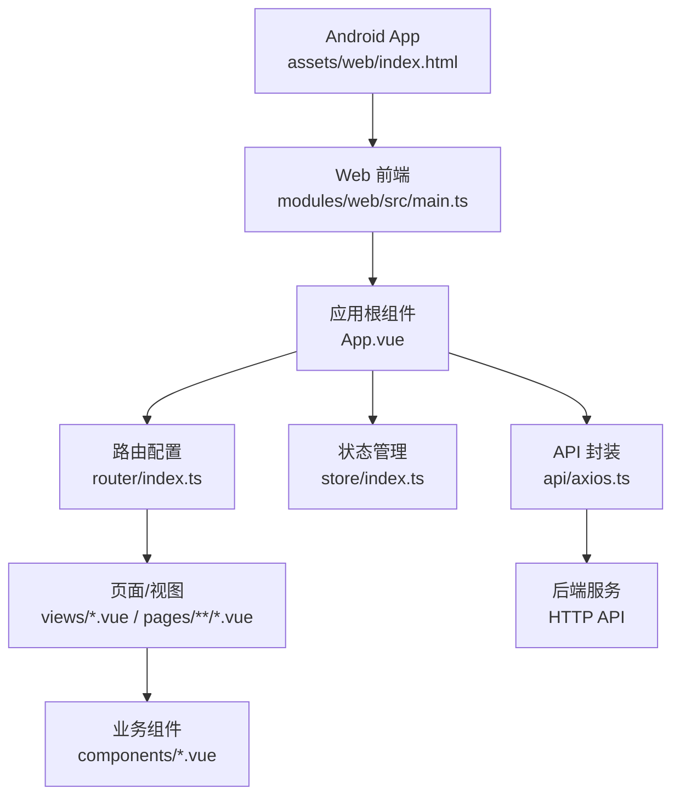
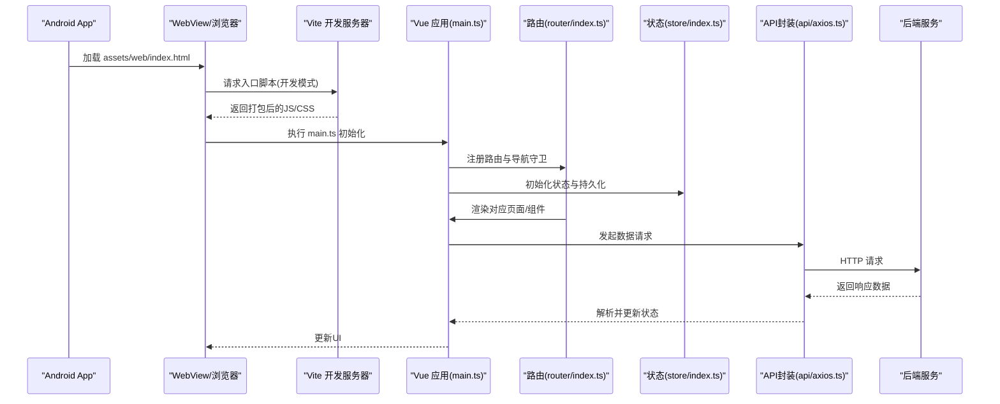
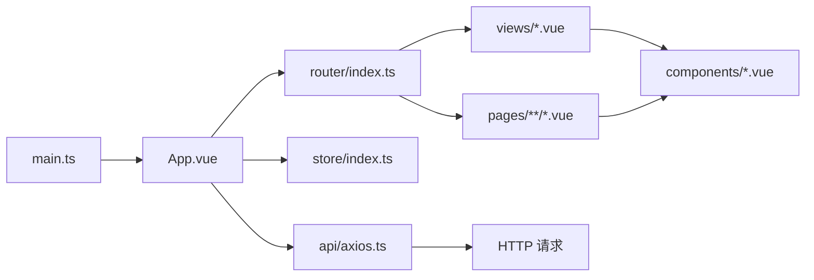

# Web界面调试

<cite>
**本文引用的文件**   
- [modules/web/package.json](file://modules/web/package.json)
- [modules/web/vite.config.ts](file://modules/web/vite.config.ts)
- [modules/web/src/main.ts](file://modules/web/src/main.ts)
- [modules/web/src/App.vue](file://modules/web/src/App.vue)
- [modules/web/src/router/index.ts](file://modules/web/src/router/index.ts)
- [modules/web/src/api/axios.ts](file://modules/web/src/api/axios.ts)
- [modules/web/src/store/index.ts](file://modules/web/src/store/index.ts)
- [modules/web/src/pages/bookshelf/BookShelf.vue](file://modules/web/src/pages/bookshelf/BookShelf.vue)
- [modules/web/src/views/SourceEditor.vue](file://modules/web/src/views/SourceEditor.vue)
- [app/src/main/assets/web/index.html](file://app/src/main/assets/web/index.html)
</cite>

## 目录
1. [简介](#简介)
2. [项目结构](#项目结构)
3. [核心组件](#核心组件)
4. [架构总览](#架构总览)
5. [详细组件分析](#详细组件分析)
6. [依赖分析](#依赖分析)
7. [性能考虑](#性能考虑)
8. [故障排查指南](#故障排查指南)
9. [结论](#结论)
10. [附录](#附录)

## 简介
本指南面向使用浏览器开发者工具与Vue.js生态进行Web界面调试的工程师，结合Legado项目的Web前端模块（位于 modules/web）与Android内嵌Web资源（app/src/main/assets/web），系统讲解以下主题：
- 浏览器开发者工具：Elements、Console、Network、Performance等面板的使用要点
- Vue.js应用调试：Vue DevTools、组件状态检查、事件监听、路由调试
- 构建与开发服务器：Vite开发服务器、热模块替换（HMR）、源码映射（Source Maps）
- 网络请求调试：API接口测试、请求拦截、响应分析
- 性能分析方法：页面加载分析、JavaScript执行分析、内存泄漏检测
- 跨浏览器兼容性与移动端调试技巧

本指南既适合初学者快速上手，也提供进阶实践路径，帮助你在Legado的Web子系统中高效定位问题并优化体验。

## 项目结构
Legado的Web前端采用Vue 3 + Vite + TypeScript技术栈，主要代码位于 modules/web；Android端通过assets/web/index.html作为入口承载Web内容。关键目录与职责如下：
- modules/web/src：Vue应用源码，包含入口、路由、视图、组件、状态管理、API封装等
- modules/web/public 或 assets：静态资源（图片、字体等）
- app/src/main/assets/web：Android端内嵌的Web入口HTML及资源

图表来源
- [app/src/main/assets/web/index.html](file://app/src/main/assets/web/index.html)
- [modules/web/src/main.ts](file://modules/web/src/main.ts)
- [modules/web/src/App.vue](file://modules/web/src/App.vue)
- [modules/web/src/router/index.ts](file://modules/web/src/router/index.ts)
- [modules/web/src/store/index.ts](file://modules/web/src/store/index.ts)
- [modules/web/src/api/axios.ts](file://modules/web/src/api/axios.ts)

章节来源
- [modules/web/package.json](file://modules/web/package.json)
- [modules/web/vite.config.ts](file://modules/web/vite.config.ts)
- [modules/web/src/main.ts](file://modules/web/src/main.ts)
- [app/src/main/assets/web/index.html](file://app/src/main/assets/web/index.html)

## 核心组件
- 应用入口与初始化：main.ts负责创建Vue实例、挂载DOM、注册插件与全局配置
- 根组件：App.vue定义应用级布局、全局样式与顶层逻辑
- 路由：router/index.ts集中管理页面路由与导航守卫
- 状态管理：store/index.ts集中管理应用状态（如书籍书架、连接状态、源编辑器等）
- API层：api/axios.ts封装HTTP请求、拦截器、错误处理与重试策略
- 页面与组件：views与pages按功能划分，components为可复用UI组件

章节来源
- [modules/web/src/main.ts](file://modules/web/src/main.ts)
- [modules/web/src/App.vue](file://modules/web/src/App.vue)
- [modules/web/src/router/index.ts](file://modules/web/src/router/index.ts)
- [modules/web/src/store/index.ts](file://modules/web/src/store/index.ts)
- [modules/web/src/api/axios.ts](file://modules/web/src/api/axios.ts)

## 架构总览
下图展示从Android内嵌Web到Vue应用的启动流程，以及前后端交互的关键节点。

图表来源
- [app/src/main/assets/web/index.html](file://app/src/main/assets/web/index.html)
- [modules/web/src/main.ts](file://modules/web/src/main.ts)
- [modules/web/src/router/index.ts](file://modules/web/src/router/index.ts)
- [modules/web/src/store/index.ts](file://modules/web/src/store/index.ts)
- [modules/web/src/api/axios.ts](file://modules/web/src/api/axios.ts)

## 详细组件分析

### 应用入口与根组件
- main.ts：创建Vue应用、挂载到DOM、启用插件（如路由、状态管理、第三方库）
- App.vue：定义应用外壳、全局样式、顶部导航与内容区域

调试建议
- 在Console中打印Vue实例以确认挂载成功
- 使用DevTools的“组件”面板查看App层级结构与props/state
- 若页面空白，优先检查index.html是否引入正确脚本与CSS

章节来源
- [modules/web/src/main.ts](file://modules/web/src/main.ts)
- [modules/web/src/App.vue](file://modules/web/src/App.vue)

### 路由与页面导航
- router/index.ts：定义路由表、懒加载页面、导航守卫（鉴权、参数校验）
- views与pages：按功能组织页面，如书架、阅读器、源编辑器等

调试建议
- 使用“路由”面板观察当前路由、历史栈与参数变化
- 在导航守卫中打断点，验证跳转条件与权限控制
- 对懒加载页面开启Source Maps，便于定位源码

章节来源
- [modules/web/src/router/index.ts](file://modules/web/src/router/index.ts)
- [modules/web/src/pages/bookshelf/BookShelf.vue](file://modules/web/src/pages/bookshelf/BookShelf.vue)
- [modules/web/src/views/SourceEditor.vue](file://modules/web/src/views/SourceEditor.vue)

### 状态管理与数据流
- store/index.ts：集中管理应用状态（如书架数据、连接状态、编辑器状态）
- 组件通过响应式API访问与更新状态，确保UI同步

调试建议
- 在DevTools中查看store的state、mutations/actions调用链
- 对关键状态变更添加日志或断点，追踪数据来源与副作用
- 使用时间旅行调试（若启用）回放状态变更过程

章节来源
- [modules/web/src/store/index.ts](file://modules/web/src/store/index.ts)

### API封装与网络请求
- api/axios.ts：封装HTTP客户端，统一设置基础URL、超时、拦截器、错误处理
- 请求拦截：注入认证头、请求ID、调试日志
- 响应拦截：统一错误提示、重试机制、缓存策略

调试建议
- 在Network面板筛选XHR/Fetch请求，查看请求头、参数、响应体
- 在拦截器中打断点，验证请求构造与响应处理逻辑
- 模拟失败场景（网络错误、服务端异常）验证错误处理

章节来源
- [modules/web/src/api/axios.ts](file://modules/web/src/api/axios.ts)

### 页面与组件调试
- BookShelf.vue：书架列表页，展示书籍信息、搜索、排序等功能
- SourceEditor.vue：源编辑器页面，支持JSON编辑、语法高亮、保存操作

调试建议
- 使用Elements面板检查DOM结构、样式计算与事件绑定
- 在Console中直接调用组件方法或修改状态，快速验证修复效果
- 对复杂交互（拖拽、虚拟滚动）使用Performance面板录制帧率与主线程占用

章节来源
- [modules/web/src/pages/bookshelf/BookShelf.vue](file://modules/web/src/pages/bookshelf/BookShelf.vue)
- [modules/web/src/views/SourceEditor.vue](file://modules/web/src/views/SourceEditor.vue)

## 依赖分析
Vue应用依赖关系清晰，模块化程度高，便于独立调试与维护。

图表来源
- [modules/web/src/main.ts](file://modules/web/src/main.ts)
- [modules/web/src/App.vue](file://modules/web/src/App.vue)
- [modules/web/src/router/index.ts](file://modules/web/src/router/index.ts)
- [modules/web/src/store/index.ts](file://modules/web/src/store/index.ts)
- [modules/web/src/api/axios.ts](file://modules/web/src/api/axios.ts)

章节来源
- [modules/web/package.json](file://modules/web/package.json)
- [modules/web/vite.config.ts](file://modules/web/vite.config.ts)

## 性能考虑
- 首屏加载：优化资源体积（代码分割、图片压缩）、启用Gzip/Brotli、CDN加速
- 运行时性能：避免重排重绘、合理使用虚拟列表、减少不必要的重渲染
- 内存管理：及时解绑事件监听、清理定时器、避免闭包引用导致泄漏
- 监控与度量：集成性能埋点（LCP、FID、CLS）、A/B测试不同优化策略

[本节为通用指导，不直接分析具体文件]

## 故障排查指南

### 浏览器开发者工具使用要点
- Elements面板：检查DOM结构、样式计算、事件监听器；右键元素选择“Break on subtree modifications”跟踪动态变更
- Console面板：执行表达式、查看日志、过滤错误；使用console.table格式化输出数组/对象
- Network面板：筛选请求类型、查看请求头/响应体、模拟慢网络、禁用缓存复现实时问题
- Performance面板：录制页面生命周期，分析主线程任务、长任务、内存快照对比

### Vue DevTools使用技巧
- 安装扩展：Chrome/Firefox商店搜索“Vue.js DevTools”
- 组件面板：查看组件树、props、state、computed、methods
- 事件面板：监听组件事件触发，验证事件冒泡与捕获
- 路由面板：查看当前路由、历史栈、参数与查询字符串
- 状态面板：实时修改store状态，验证UI响应

### Vite开发与构建调试
- 开发服务器：vite dev启动本地服务，支持HMR热更新
- 源码映射：确保vite.config.ts中开启sourcemap，便于定位源码
- 环境变量：通过.env文件管理不同环境配置，避免硬编码
- 构建产物：vite build生成生产资源，检查bundle大小与依赖分析

### 网络请求调试
- 请求拦截：在axios拦截器中添加日志、重试、错误上报
- 响应分析：检查HTTP状态码、响应头、JSON结构是否符合预期
- 模拟测试：使用Mock Service Worker或本地Mock服务器模拟后端接口
- 跨域问题：检查CORS配置、代理设置、Cookie/SameSite属性

### 性能分析与内存泄漏检测
- 页面加载分析：使用Performance面板录制FCP/LCP/TBT指标
- JavaScript执行分析：识别长任务、阻塞渲染的代码段
- 内存泄漏检测：使用Memory面板对比堆快照，查找未释放引用
- 渲染性能：避免频繁DOM操作，使用requestAnimationFrame优化动画

### 跨浏览器兼容性与移动端调试
- 兼容性检查：使用Browserslist配置目标浏览器，自动注入polyfill
- 移动端调试：Chrome DevTools设备模拟器、USB调试真机、远程调试
- 触摸事件：模拟触摸手势，验证滑动、缩放、长按等行为
- 适配问题：检查viewport设置、媒体查询、flex/grid布局兼容性

章节来源
- [modules/web/vite.config.ts](file://modules/web/vite.config.ts)
- [modules/web/src/api/axios.ts](file://modules/web/src/api/axios.ts)
- [modules/web/src/router/index.ts](file://modules/web/src/router/index.ts)
- [modules/web/src/store/index.ts](file://modules/web/src/store/index.ts)

## 结论
通过系统掌握浏览器开发者工具、Vue DevTools、Vite构建系统与网络调试技巧，你可以在Legado的Web子应用中高效定位问题、优化性能并确保跨平台兼容性。建议在日常开发中养成以下习惯：
- 每次迭代后运行性能分析，持续优化关键指标
- 建立统一的错误处理与日志规范，便于问题追踪
- 编写单元测试与端到端测试，覆盖核心业务流程
- 定期审查依赖版本与安全漏洞，保持技术栈健康

[本节为总结性内容，不直接分析具体文件]

## 附录
- 常用快捷键：Ctrl+Shift+I打开开发者工具、F12切换面板、Ctrl+F搜索元素
- 推荐扩展：Vue DevTools、React Developer Tools（备用）、JSON Viewer、Postman
- 学习资源：MDN Web Docs、Chrome DevTools文档、Vue官方指南

[本节为参考资料，不直接分析具体文件]