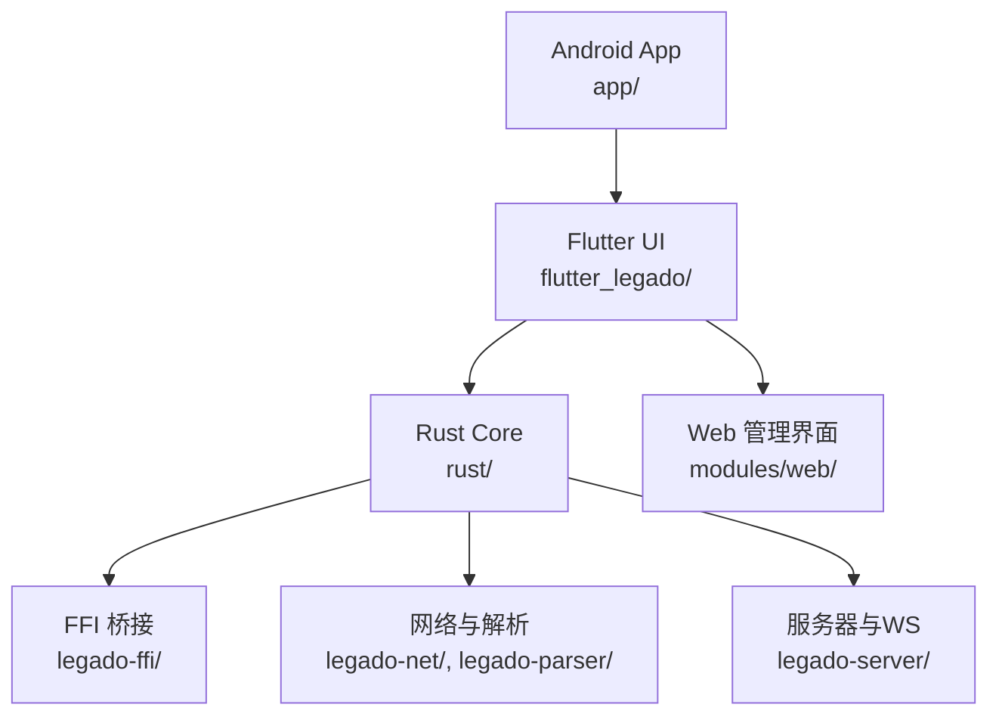
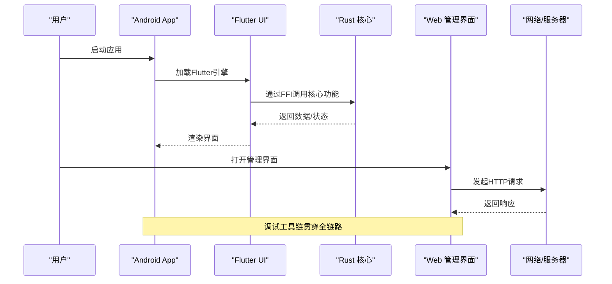
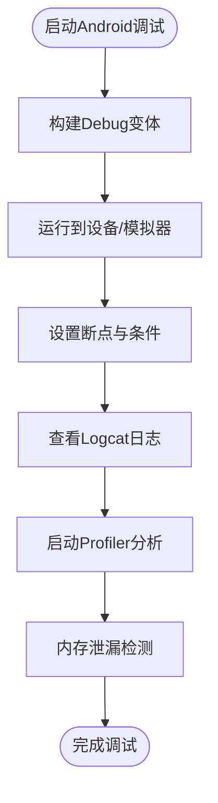
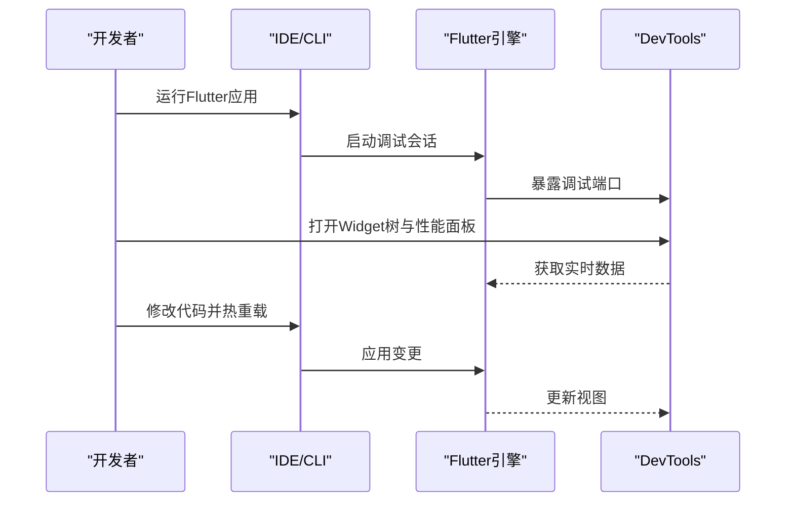
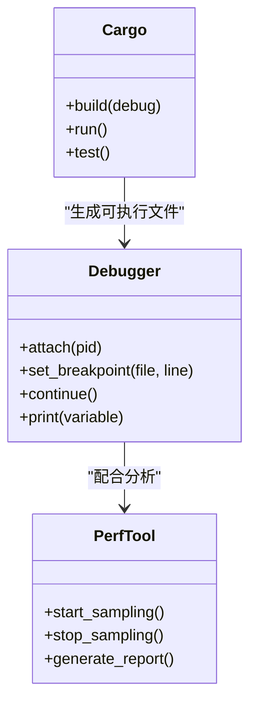
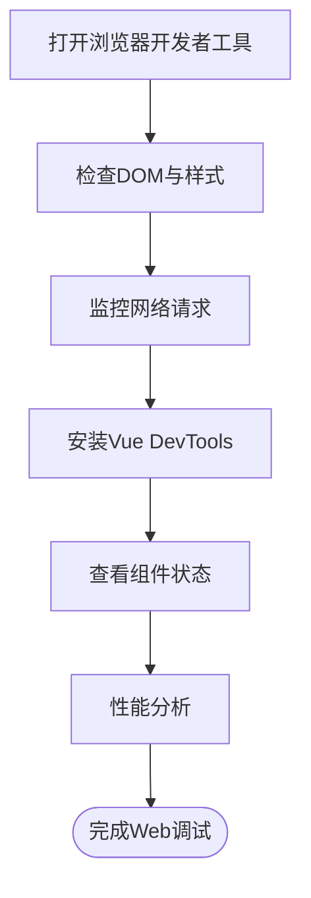
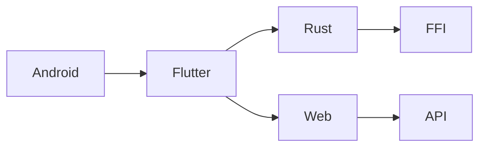

# 调试技巧

<cite>
**本文引用的文件**   
- [README.md](file://README.md)
- [app/build.gradle](file://app/build.gradle)
- [app/src/main/AndroidManifest.xml](file://app/src/main/AndroidManifest.xml)
- [app/src/debug/AndroidManifest.xml](file://app/src/debug/AndroidManifest.xml)
- [flutter_legado/pubspec.yaml](file://flutter_legado/pubspec.yaml)
- [flutter_legado/lib/main.dart](file://flutter_legado/lib/main.dart)
- [flutter_legado/lib/app.dart](file://flutter_legado/lib/app.dart)
- [flutter_legado/android/app/build.gradle.kts](file://flutter_legado/android/app/build.gradle.kts)
- [flutter_legado/ios/Runner/Info.plist](file://flutter_legado/ios/Runner/Info.plist)
- [flutter_legado/macos/Runner/Info.plist](file://flutter_legado/macos/Runner/Info.plist)
- [flutter_legado/windows/runner/CMakeLists.txt](file://flutter_legado/windows/runner/CMakeLists.txt)
- [flutter_legado/linux/runner/CMakeLists.txt](file://flutter_legado/linux/runner/CMakeLists.txt)
- [modules/web/package.json](file://modules/web/package.json)
- [modules/web/vite.config.ts](file://modules/web/vite.config.ts)
- [rust/Cargo.toml](file://rust/Cargo.toml)
- [rust/legado-core/Cargo.toml](file://rust/legado-core/Cargo.toml)
- [rust/legado-ffi/Cargo.toml](file://rust/legado-ffi/Cargo.toml)
- [rust/legado-net/Cargo.toml](file://rust/legado-net/Cargo.toml)
- [rust/legado-server/Cargo.toml](file://rust/legado-server/Cargo.toml)
- [rust/legado-js/Cargo.toml](file://rust/legado-js/Cargo.toml)
- [rust/DEVELOPMENT.md](file://rust/DEVELOPMENT.md)
</cite>

## 目录
1. [简介](#简介)
2. [项目结构](#项目结构)
3. [核心组件](#核心组件)
4. [架构总览](#架构总览)
5. [详细组件分析](#详细组件分析)
6. [依赖关系分析](#依赖关系分析)
7. [性能注意事项](#性能注意事项)
8. [故障排查指南](#故障排查指南)
9. [结论](#结论)
10. [附录](#附录)

## 简介
本指南面向Legado项目的跨平台调试实践，覆盖Android应用、Flutter界面、Rust核心库与Web管理界面的调试方法。内容包含：
- Android Studio调试器使用、日志查看、性能分析与内存泄漏检测
- Flutter DevTools、热重载、Widget树调试、网络请求调试
- Rust Cargo调试、GDB/Lldb使用、性能剖析与内存安全检查
- Web浏览器开发者工具、网络监控、Vue DevTools与性能分析
- 跨平台调试策略与常见问题排查

## 项目结构
Legado由多模块组成：Android原生应用（Kotlin/Java）、Flutter跨平台UI、Rust核心库（FFI桥接）、以及Web管理界面（Vue/Vite）。各模块的构建与调试配置如下：
- Android模块位于 app/，通过Gradle构建，支持debug/profile/release变体
- Flutter模块位于 flutter_legado/，通过Flutter CLI与IDE集成进行调试
- Rust核心位于 rust/，通过Cargo构建，提供FFI接口供上层调用
- Web管理界面位于 modules/web/，基于Vite+Vue开发，便于本地调试

图表来源
- [app/build.gradle](file://app/build.gradle)
- [flutter_legado/pubspec.yaml](file://flutter_legado/pubspec.yaml)
- [rust/Cargo.toml](file://rust/Cargo.toml)
- [modules/web/package.json](file://modules/web/package.json)

章节来源
- [README.md](file://README.md)
- [app/build.gradle](file://app/build.gradle)
- [flutter_legado/pubspec.yaml](file://flutter_legado/pubspec.yaml)
- [rust/Cargo.toml](file://rust/Cargo.toml)
- [modules/web/package.json](file://modules/web/package.json)

## 核心组件
- Android应用层：负责UI与系统交互，可通过Android Studio进行断点、日志、性能与内存分析
- Flutter界面层：提供跨平台UI，支持DevTools、热重载与Widget树调试
- Rust核心层：实现业务逻辑、网络、解析与数据库访问，通过FFI暴露给上层
- Web管理界面：用于源码编辑与管理，支持浏览器调试与Vue DevTools

章节来源
- [app/src/main/AndroidManifest.xml](file://app/src/main/AndroidManifest.xml)
- [flutter_legado/lib/main.dart](file://flutter_legado/lib/main.dart)
- [flutter_legado/lib/app.dart](file://flutter_legado/lib/app.dart)
- [rust/legado-ffi/src/lib.rs](file://rust/legado-ffi/src/lib.rs)
- [modules/web/src/main.ts](file://modules/web/src/main.ts)

## 架构总览
下图展示从Android到Flutter、再到Rust与Web的调试链路，包括日志、网络与性能数据的采集路径。

图表来源
- [app/build.gradle](file://app/build.gradle)
- [flutter_legado/pubspec.yaml](file://flutter_legado/pubspec.yaml)
- [rust/Cargo.toml](file://rust/Cargo.toml)
- [modules/web/package.json](file://modules/web/package.json)

## 详细组件分析

### Android调试
- 使用Android Studio运行Debug变体，设置断点、单步执行与变量监视
- 通过Logcat过滤日志，结合自定义标签定位问题
- 使用Profiler分析CPU、内存与网络，定位卡顿与内存泄漏
- 在AndroidManifest中启用调试标志，确保调试信息完整

章节来源
- [app/build.gradle](file://app/build.gradle)
- [app/src/main/AndroidManifest.xml](file://app/src/main/AndroidManifest.xml)
- [app/src/debug/AndroidManifest.xml](file://app/src/debug/AndroidManifest.xml)

### Flutter调试
- 使用Flutter DevTools进行Widget树检查、性能分析与内存快照
- 利用热重载快速迭代UI，结合控制台输出调试逻辑
- 通过DevTools的网络面板监控HTTP请求与响应
- 在main.dart中初始化调试模式，确保DevTools可用

章节来源
- [flutter_legado/lib/main.dart](file://flutter_legado/lib/main.dart)
- [flutter_legado/lib/app.dart](file://flutter_legado/lib/app.dart)
- [flutter_legado/pubspec.yaml](file://flutter_legado/pubspec.yaml)

### Rust调试
- 使用Cargo构建Debug版本，启用符号信息与优化开关
- 通过GDB或Lldb附加进程，设置断点与查看堆栈
- 使用性能剖析工具（如perf）分析热点函数
- 启用内存安全检查（如AddressSanitizer）定位内存错误

章节来源
- [rust/Cargo.toml](file://rust/Cargo.toml)
- [rust/DEVELOPMENT.md](file://rust/DEVELOPMENT.md)

### Web调试
- 使用浏览器开发者工具检查DOM、样式与脚本执行
- 通过Vue DevTools查看组件状态与事件流
- 在网络面板监控API请求与响应，模拟失败场景
- 使用性能面板分析渲染瓶颈与资源加载

章节来源
- [modules/web/package.json](file://modules/web/package.json)
- [modules/web/vite.config.ts](file://modules/web/vite.config.ts)

## 依赖关系分析
各模块间的依赖关系清晰，调试时需关注接口契约与数据流向：
- Android与Flutter通过引擎通信，需确保版本兼容
- Flutter与Rust通过FFI交互，需验证数据类型与生命周期
- Web与后端服务通过HTTP/WebSocket通信，需处理跨域与认证

图表来源
- [app/build.gradle](file://app/build.gradle)
- [flutter_legado/pubspec.yaml](file://flutter_legado/pubspec.yaml)
- [rust/Cargo.toml](file://rust/Cargo.toml)
- [modules/web/package.json](file://modules/web/package.json)

章节来源
- [app/build.gradle](file://app/build.gradle)
- [flutter_legado/pubspec.yaml](file://flutter_legado/pubspec.yaml)
- [rust/Cargo.toml](file://rust/Cargo.toml)
- [modules/web/package.json](file://modules/web/package.json)

## 性能注意事项
- Android：避免主线程阻塞，合理使用异步任务，监控内存增长
- Flutter：减少Widget重建，使用const构造，避免不必要的setState
- Rust：优化算法复杂度，避免频繁分配，使用零拷贝技术
- Web：懒加载资源，压缩静态文件，减少重绘与回流

## 故障排查指南
- Android崩溃：查看堆栈跟踪，复现步骤，添加更多日志
- Flutter白屏：检查依赖注入，确认路由配置，验证数据源
- Rust段错误：使用GDB定位崩溃点，检查指针与内存访问
- Web空白页：检查控制台错误，验证API响应，确认路由配置

## 结论
通过系统化调试方法与工具链，可有效提升Legado项目的开发与维护效率。建议团队统一调试规范，定期回顾性能与稳定性指标，持续优化用户体验。

## 附录
- 常用命令参考：
  - Android：./gradlew assembleDebug
  - Flutter：flutter run --debug
  - Rust：cargo build --target aarch64-linux-android
  - Web：npm run dev
- 调试配置文件位置：
  - Android：app/build.gradle
  - Flutter：flutter_legado/pubspec.yaml
  - Rust：rust/Cargo.toml
  - Web：modules/web/package.json